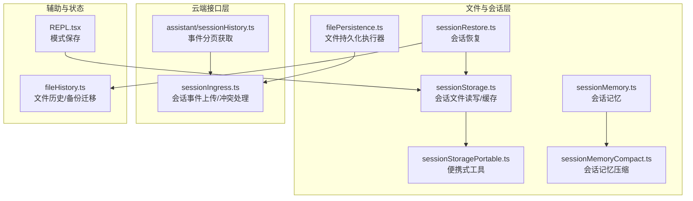
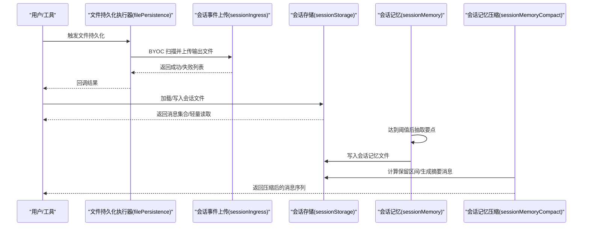
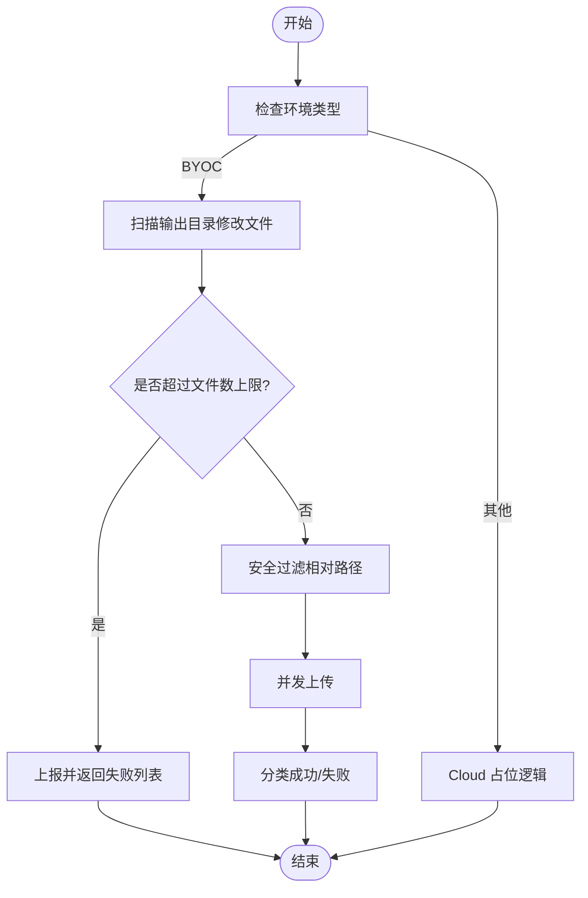
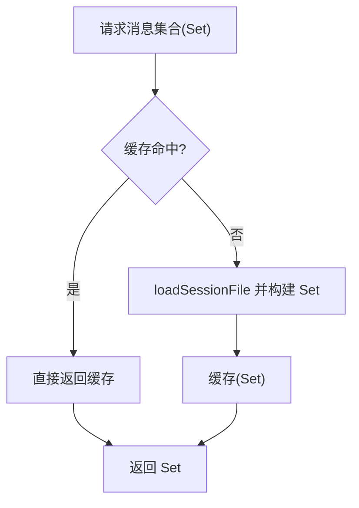
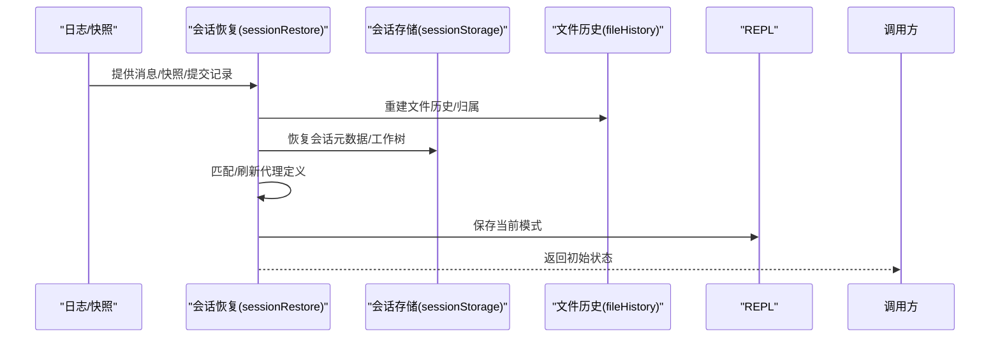
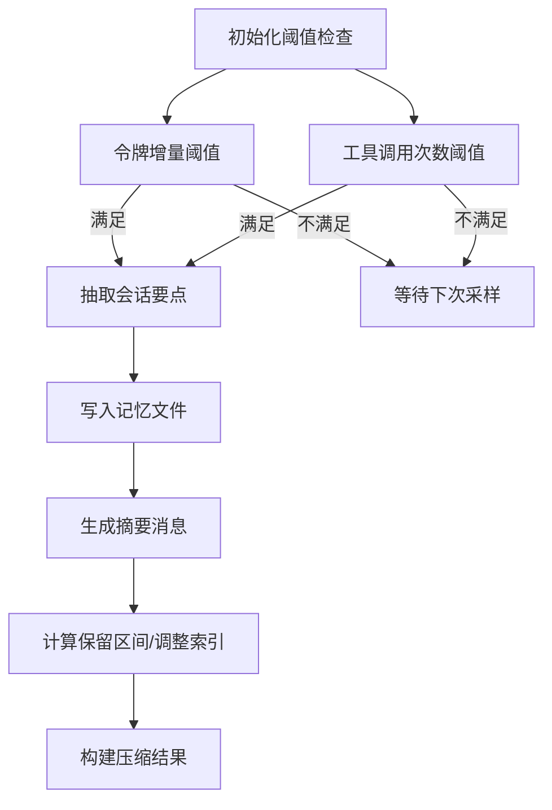
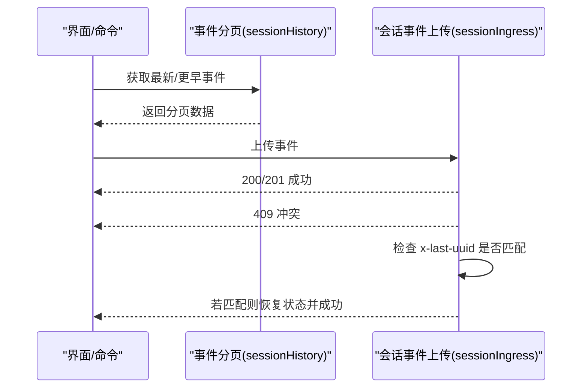
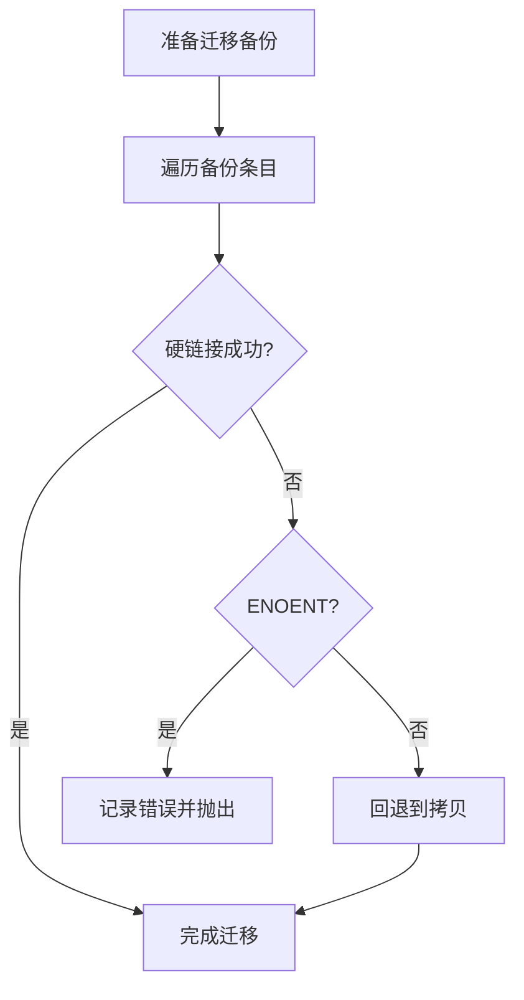
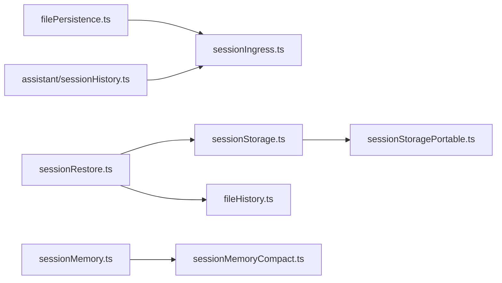

# 会话持久化

<cite>
**本文引用的文件**
- [src/utils/filePersistence/filePersistence.ts](file://src/utils/filePersistence/filePersistence.ts)
- [src/services/api/sessionIngress.ts](file://src/services/api/sessionIngress.ts)
- [src/utils/sessionStorage.ts](file://src/utils/sessionStorage.ts)
- [src/utils/sessionStoragePortable.ts](file://src/utils/sessionStoragePortable.ts)
- [src/utils/sessionRestore.ts](file://src/utils/sessionRestore.ts)
- [src/services/SessionMemory/sessionMemory.ts](file://src/services/SessionMemory/sessionMemory.ts)
- [src/services/SessionMemory/sessionMemoryUtils.ts](file://src/services/SessionMemory/sessionMemoryUtils.ts)
- [src/services/compact/sessionMemoryCompact.ts](file://src/services/compact/sessionMemoryCompact.ts)
- [src/utils/fileHistory.ts](file://src/utils/fileHistory.ts)
- [src/assistant/sessionHistory.ts](file://src/assistant/sessionHistory.ts)
- [src/screens/REPL.tsx](file://src/screens/REPL.tsx)
</cite>

## 目录
1. [简介](#简介)
2. [项目结构](#项目结构)
3. [核心组件](#核心组件)
4. [架构总览](#架构总览)
5. [详细组件分析](#详细组件分析)
6. [依赖关系分析](#依赖关系分析)
7. [性能考量](#性能考量)
8. [故障排查指南](#故障排查指南)
9. [结论](#结论)
10. [附录](#附录)

## 简介
本文件系统性阐述 Claude Code 的会话持久化体系，覆盖以下主题：
- 会话数据持久化策略：本地与云端（按环境）的选择机制
- 会话快照的创建与恢复流程，确保数据完整性与一致性
- 会话版本管理与迁移：通过文件头尾读取、边界标记与摘要消息实现
- 备份与恢复：文件历史备份迁移、会话元数据与工作树状态恢复
- 压缩与优化：基于会话记忆的智能压缩与消息边界保持
- 配置项与最佳实践：特性开关、阈值参数、并发与限流
- 应用示例：多场景下的会话恢复、模式切换与成本状态恢复

## 项目结构
围绕会话持久化的关键模块分布如下：
- 文件持久化与上传：filePersistence.ts 负责 BYOC 模式下输出文件的扫描、上传与结果回调
- 会话存储与读写：sessionStorage.ts 提供会话文件的加载、写入、消息缓存与轻量读取
- 便携式工具：sessionStoragePortable.ts 提供跨平台的 JSON 字段提取、首提示词解析与轻量读取
- 会话恢复：sessionRestore.ts 负责从日志重建状态、工作树恢复、代理设置与模式保存
- 会话记忆与压缩：sessionMemory.ts 与 sessionMemoryUtils.ts 维护会话记忆文件；sessionMemoryCompact.ts 基于会话记忆进行压缩
- 历史查询与事件回溯：assistant/sessionHistory.ts 提供事件分页拉取；fileHistory.ts 支持备份迁移
- 会话入口与模式保存：REPL.tsx 在退出时保存当前模式，便于后续恢复

**图表来源**
- [src/utils/filePersistence/filePersistence.ts:51-144](file://src/utils/filePersistence/filePersistence.ts#L51-L144)
- [src/services/api/sessionIngress.ts:77-142](file://src/services/api/sessionIngress.ts#L77-L142)
- [src/utils/sessionStorage.ts:1-200](file://src/utils/sessionStorage.ts#L1-L200)
- [src/utils/sessionStoragePortable.ts:1-200](file://src/utils/sessionStoragePortable.ts#L1-L200)
- [src/utils/sessionRestore.ts:1-200](file://src/utils/sessionRestore.ts#L1-L200)
- [src/services/SessionMemory/sessionMemory.ts:1-200](file://src/services/SessionMemory/sessionMemory.ts#L1-L200)
- [src/services/compact/sessionMemoryCompact.ts:1-120](file://src/services/compact/sessionMemoryCompact.ts#L1-L120)
- [src/utils/fileHistory.ts:970-1010](file://src/utils/fileHistory.ts#L970-L1010)
- [src/assistant/sessionHistory.ts:1-88](file://src/assistant/sessionHistory.ts#L1-L88)
- [src/screens/REPL.tsx:1894-1910](file://src/screens/REPL.tsx#L1894-L1910)

**章节来源**
- [src/utils/filePersistence/filePersistence.ts:1-288](file://src/utils/filePersistence/filePersistence.ts#L1-L288)
- [src/utils/sessionStorage.ts:1-200](file://src/utils/sessionStorage.ts#L1-L200)
- [src/utils/sessionStoragePortable.ts:1-200](file://src/utils/sessionStoragePortable.ts#L1-L200)
- [src/utils/sessionRestore.ts:1-200](file://src/utils/sessionRestore.ts#L1-L200)
- [src/services/SessionMemory/sessionMemory.ts:1-200](file://src/services/SessionMemory/sessionMemory.ts#L1-L200)
- [src/services/compact/sessionMemoryCompact.ts:1-120](file://src/services/compact/sessionMemoryCompact.ts#L1-L120)
- [src/utils/fileHistory.ts:970-1010](file://src/utils/fileHistory.ts#L970-L1010)
- [src/assistant/sessionHistory.ts:1-88](file://src/assistant/sessionHistory.ts#L1-L88)
- [src/screens/REPL.tsx:1894-1910](file://src/screens/REPL.tsx#L1894-L1910)

## 核心组件
- 文件持久化执行器（BYOC/Cloud）
  - BYOC：扫描输出目录修改文件，调用上传接口，返回成功/失败列表
  - Cloud：占位逻辑（xattr 文件 ID 读取待实现）
  - 启用条件：特性开关开启、环境类型为 BYOC、具备会话访问令牌与远程会话 ID
- 会话存储与缓存
  - 提供会话文件的加载、消息集合缓存、轻量读取（仅头部/尾部）、消息存在性检查
  - 用于快速判断与避免全量解析
- 会话恢复
  - 从日志重建文件历史、归属信息、上下文折叠、待办等状态
  - 支持工作树恢复、代理设置恢复、模式保存与刷新
- 会话记忆与压缩
  - 自动抽取会话要点到独立记忆文件，按阈值触发更新
  - 基于会话记忆生成摘要消息，保留工具调用配对与思考块合并不变式
- 历史与事件
  - 分页获取会话事件，支持锚定最新与向前翻页
  - 云端上传时处理并发修改与 409 冲突恢复
- 备份迁移
  - 会话切换或恢复时，将旧会话备份硬链接/复制到新会话目录，保证可追溯性

**章节来源**
- [src/utils/filePersistence/filePersistence.ts:51-144](file://src/utils/filePersistence/filePersistence.ts#L51-L144)
- [src/utils/sessionStorage.ts:3838-3867](file://src/utils/sessionStorage.ts#L3838-L3867)
- [src/utils/sessionStoragePortable.ts:244-286](file://src/utils/sessionStoragePortable.ts#L244-L286)
- [src/utils/sessionRestore.ts:1-200](file://src/utils/sessionRestore.ts#L1-L200)
- [src/services/SessionMemory/sessionMemory.ts:134-181](file://src/services/SessionMemory/sessionMemory.ts#L134-L181)
- [src/services/compact/sessionMemoryCompact.ts:316-397](file://src/services/compact/sessionMemoryCompact.ts#L316-L397)
- [src/assistant/sessionHistory.ts:45-87](file://src/assistant/sessionHistory.ts#L45-L87)
- [src/services/api/sessionIngress.ts:77-142](file://src/services/api/sessionIngress.ts#L77-L142)
- [src/utils/fileHistory.ts:970-1010](file://src/utils/fileHistory.ts#L970-L1010)

## 架构总览
会话持久化由“本地扫描/上传”“云端事件上传/冲突恢复”“会话文件读写/缓存”“会话记忆/压缩”“恢复与备份迁移”五条主线协同构成。

**图表来源**
- [src/utils/filePersistence/filePersistence.ts:51-144](file://src/utils/filePersistence/filePersistence.ts#L51-L144)
- [src/services/api/sessionIngress.ts:77-142](file://src/services/api/sessionIngress.ts#L77-L142)
- [src/utils/sessionStorage.ts:1-200](file://src/utils/sessionStorage.ts#L1-L200)
- [src/services/SessionMemory/sessionMemory.ts:272-350](file://src/services/SessionMemory/sessionMemory.ts#L272-L350)
- [src/services/compact/sessionMemoryCompact.ts:514-631](file://src/services/compact/sessionMemoryCompact.ts#L514-L631)

## 详细组件分析

### 文件持久化执行器（BYOC/Cloud）
- 功能要点
  - BYOC：扫描输出目录修改文件，限制数量，安全过滤路径，批量上传，汇总结果
  - Cloud：占位逻辑，未来将从扩展属性读取文件 ID
  - 启用条件：特性开关、环境类型、令牌与远程会话 ID
  - 错误处理：捕获异常并记录诊断事件
- 关键流程
  - runFilePersistence：根据环境选择执行路径，统计耗时并上报事件
  - executeBYOCPersistence：扫描→限流→安全过滤→并发上传→分类结果
  - executeCloudPersistence：占位返回空结果
  - executeFilePersistence：带错误兜底的回调执行
  - isFilePersistenceEnabled：综合判定启用条件

**图表来源**
- [src/utils/filePersistence/filePersistence.ts:51-144](file://src/utils/filePersistence/filePersistence.ts#L51-L144)
- [src/utils/filePersistence/filePersistence.ts:150-240](file://src/utils/filePersistence/filePersistence.ts#L150-L240)

**章节来源**
- [src/utils/filePersistence/filePersistence.ts:51-144](file://src/utils/filePersistence/filePersistence.ts#L51-L144)
- [src/utils/filePersistence/filePersistence.ts:150-240](file://src/utils/filePersistence/filePersistence.ts#L150-L240)
- [src/utils/filePersistence/filePersistence.ts:256-287](file://src/utils/filePersistence/filePersistence.ts#L256-L287)

### 会话存储与轻量读取
- 功能要点
  - 会话文件加载/写入、消息集合缓存（memoized）、消息存在性检查
  - 便携式工具：JSON 字段提取、首提示词提取、轻量读取（头尾）
  - 用于快速判断与避免全量解析，提升恢复与压缩路径性能
- 关键流程
  - getSessionMessages：缓存消息 UUID 集合，避免重复读取
  - clearSessionMessagesCache：在压缩后清理缓存，防止使用过期 UUID
  - readSessionLite：单文件句柄读取头尾，支持并发 Promise.all
  - extractFirstPromptFromHead：从头片段提取首个有效用户提示

**图表来源**
- [src/utils/sessionStorage.ts:3838-3867](file://src/utils/sessionStorage.ts#L3838-L3867)

**章节来源**
- [src/utils/sessionStorage.ts:3838-3867](file://src/utils/sessionStorage.ts#L3838-L3867)
- [src/utils/sessionStoragePortable.ts:244-286](file://src/utils/sessionStoragePortable.ts#L244-L286)
- [src/utils/sessionStoragePortable.ts:117-200](file://src/utils/sessionStoragePortable.ts#L117-L200)

### 会话恢复与状态重建
- 功能要点
  - 从日志重建文件历史、归属信息、上下文折叠、待办等
  - 工作树恢复：根据最后进入/退出记录恢复当前工作目录
  - 代理设置与模式保存：恢复代理类型、模型覆盖、模式（协调者/普通）
  - 成本状态恢复：按目标会话 ID 恢复计费状态
- 关键流程
  - restoreSessionStateFromLog：重建文件历史/归属/上下文折叠/待办
  - processResumedConversation：匹配模式、切换会话 ID、恢复元数据、保存模式
  - restoreWorktreeForResume：恢复工作树状态并清理缓存
  - saveMode：在退出时保存当前模式，便于后续恢复

**图表来源**
- [src/utils/sessionRestore.ts:99-150](file://src/utils/sessionRestore.ts#L99-L150)
- [src/utils/sessionRestore.ts:409-551](file://src/utils/sessionRestore.ts#L409-L551)
- [src/utils/sessionRestore.ts:332-366](file://src/utils/sessionRestore.ts#L332-L366)
- [src/screens/REPL.tsx:1894-1910](file://src/screens/REPL.tsx#L1894-L1910)

**章节来源**
- [src/utils/sessionRestore.ts:99-150](file://src/utils/sessionRestore.ts#L99-L150)
- [src/utils/sessionRestore.ts:409-551](file://src/utils/sessionRestore.ts#L409-L551)
- [src/utils/sessionRestore.ts:332-366](file://src/utils/sessionRestore.ts#L332-L366)
- [src/screens/REPL.tsx:1894-1910](file://src/screens/REPL.tsx#L1894-L1910)

### 会话记忆与压缩
- 功能要点
  - 自动抽取：达到初始化阈值后，按令牌增量与工具调用次数触发抽取
  - 写入：创建记忆文件并写入模板，随后异步抽取更新
  - 压缩：基于会话记忆生成摘要消息，保留工具调用配对与思考块合并不变式
- 关键流程
  - shouldExtractMemory：计算令牌增量与工具调用数，决定是否抽取
  - createMemoryFileCanUseTool：限制仅允许编辑记忆文件
  - trySessionMemoryCompaction：计算保留区间，生成摘要消息，构建压缩结果
  - adjustIndexToPreserveAPIInvariants：确保工具调用/结果配对与思考块不被切分

**图表来源**
- [src/services/SessionMemory/sessionMemory.ts:134-181](file://src/services/SessionMemory/sessionMemory.ts#L134-L181)
- [src/services/SessionMemory/sessionMemory.ts:457-482](file://src/services/SessionMemory/sessionMemory.ts#L457-L482)
- [src/services/compact/sessionMemoryCompact.ts:514-631](file://src/services/compact/sessionMemoryCompact.ts#L514-L631)
- [src/services/compact/sessionMemoryCompact.ts:232-314](file://src/services/compact/sessionMemoryCompact.ts#L232-L314)

**章节来源**
- [src/services/SessionMemory/sessionMemory.ts:134-181](file://src/services/SessionMemory/sessionMemory.ts#L134-L181)
- [src/services/SessionMemory/sessionMemory.ts:457-482](file://src/services/SessionMemory/sessionMemory.ts#L457-L482)
- [src/services/compact/sessionMemoryCompact.ts:514-631](file://src/services/compact/sessionMemoryCompact.ts#L514-L631)
- [src/services/compact/sessionMemoryCompact.ts:232-314](file://src/services/compact/sessionMemoryCompact.ts#L232-L314)

### 历史与事件上传（云端）
- 功能要点
  - 分页获取会话事件（锚定最新/向前翻页）
  - 上传事件至云端，处理 409 冲突：若服务端已存在相同 UUID，则视为成功并更新本地映射
  - 并发修改检测：当服务端返回 UUID 不一致时，记录诊断并中止
- 关键流程
  - fetchLatestEvents/fetchOlderEvents：构造请求参数并解析响应
  - 上传流程：200/201 成功；409 时检查服务端返回的 last-uuid，若匹配则恢复状态

**图表来源**
- [src/assistant/sessionHistory.ts:73-87](file://src/assistant/sessionHistory.ts#L73-L87)
- [src/services/api/sessionIngress.ts:77-142](file://src/services/api/sessionIngress.ts#L77-L142)

**章节来源**
- [src/assistant/sessionHistory.ts:45-87](file://src/assistant/sessionHistory.ts#L45-L87)
- [src/services/api/sessionIngress.ts:77-142](file://src/services/api/sessionIngress.ts#L77-L142)
- [src/services/api/sessionIngress.ts:127-142](file://src/services/api/sessionIngress.ts#L127-L142)

### 备份与恢复（文件历史）
- 功能要点
  - 会话切换/恢复时，将旧会话备份硬链接到新会话目录
  - 若硬链接失败（如已存在或不存在），回退到拷贝
  - 保证备份可追溯与一致性
- 关键流程
  - 迁移备份：遍历备份条目，尝试硬链接；失败则拷贝

**图表来源**
- [src/utils/fileHistory.ts:970-1010](file://src/utils/fileHistory.ts#L970-L1010)

**章节来源**
- [src/utils/fileHistory.ts:970-1010](file://src/utils/fileHistory.ts#L970-L1010)

## 依赖关系分析
- 组件耦合
  - filePersistence 依赖 sessionIngress 的上传能力与认证上下文
  - sessionStorage 与 sessionStoragePortable 共同支撑会话文件的读写与轻量解析
  - sessionRestore 依赖 sessionStorage、fileHistory 与代理定义刷新
  - sessionMemory 与 sessionMemoryCompact 通过共享的阈值与配置协作
- 外部依赖
  - 云端事件上传依赖 OAuth 与组织 UUID 头部
  - 文件持久化依赖会话访问令牌与远程会话 ID 环境变量

**图表来源**
- [src/utils/filePersistence/filePersistence.ts:1-288](file://src/utils/filePersistence/filePersistence.ts#L1-L288)
- [src/services/api/sessionIngress.ts:1-142](file://src/services/api/sessionIngress.ts#L1-L142)
- [src/utils/sessionStorage.ts:1-200](file://src/utils/sessionStorage.ts#L1-L200)
- [src/utils/sessionStoragePortable.ts:1-200](file://src/utils/sessionStoragePortable.ts#L1-L200)
- [src/utils/sessionRestore.ts:1-200](file://src/utils/sessionRestore.ts#L1-L200)
- [src/utils/fileHistory.ts:970-1010](file://src/utils/fileHistory.ts#L970-L1010)
- [src/services/SessionMemory/sessionMemory.ts:1-200](file://src/services/SessionMemory/sessionMemory.ts#L1-L200)
- [src/services/compact/sessionMemoryCompact.ts:1-120](file://src/services/compact/sessionMemoryCompact.ts#L1-L120)
- [src/assistant/sessionHistory.ts:1-88](file://src/assistant/sessionHistory.ts#L1-L88)

**章节来源**
- [src/utils/filePersistence/filePersistence.ts:1-288](file://src/utils/filePersistence/filePersistence.ts#L1-L288)
- [src/services/api/sessionIngress.ts:1-142](file://src/services/api/sessionIngress.ts#L1-L142)
- [src/utils/sessionStorage.ts:1-200](file://src/utils/sessionStorage.ts#L1-L200)
- [src/utils/sessionStoragePortable.ts:1-200](file://src/utils/sessionStoragePortable.ts#L1-L200)
- [src/utils/sessionRestore.ts:1-200](file://src/utils/sessionRestore.ts#L1-L200)
- [src/utils/fileHistory.ts:970-1010](file://src/utils/fileHistory.ts#L970-L1010)
- [src/services/SessionMemory/sessionMemory.ts:1-200](file://src/services/SessionMemory/sessionMemory.ts#L1-L200)
- [src/services/compact/sessionMemoryCompact.ts:1-120](file://src/services/compact/sessionMemoryCompact.ts#L1-L120)
- [src/assistant/sessionHistory.ts:1-88](file://src/assistant/sessionHistory.ts#L1-L88)

## 性能考量
- 轻量读取与缓存
  - readSessionLite 使用固定缓冲区读取头尾，避免全量解析
  - getSessionMessages 缓存消息 UUID 集合，减少重复 IO
- 并发与限流
  - 文件上传采用默认并发度，受文件数量上限约束
- 压缩与节流
  - 会话记忆抽取与压缩基于令牌增量与工具调用次数，避免频繁触发
  - 压缩时保留工具调用/结果配对与思考块合并不变式，减少 API 错误风险

[本节为通用指导，无需具体文件分析]

## 故障排查指南
- 文件持久化失败
  - 检查特性开关、环境类型、令牌与远程会话 ID 是否满足启用条件
  - 查看上传结果中的失败条目与错误信息
- 云端上传冲突
  - 409 时检查服务端返回的 last-uuid 是否与本地 entry.uuid 匹配，若匹配则视为已成功
  - 若 UUID 不一致，记录诊断并中止，避免数据不一致
- 会话恢复异常
  - 确认工作树目录是否存在；若不存在，恢复逻辑会覆盖缓存以避免错误持久化
  - 检查代理定义是否可用，必要时刷新代理定义
- 会话记忆抽取阻塞
  - waitForSessionMemoryExtraction 提供超时与陈旧阈值保护，避免长时间等待

**章节来源**
- [src/utils/filePersistence/filePersistence.ts:256-287](file://src/utils/filePersistence/filePersistence.ts#L256-L287)
- [src/services/api/sessionIngress.ts:77-142](file://src/services/api/sessionIngress.ts#L77-L142)
- [src/utils/sessionRestore.ts:332-366](file://src/utils/sessionRestore.ts#L332-L366)
- [src/services/SessionMemory/sessionMemoryUtils.ts:89-105](file://src/services/SessionMemory/sessionMemoryUtils.ts#L89-L105)

## 结论
Claude Code 的会话持久化体系通过“本地扫描/上传 + 云端事件上传 + 会话文件读写 + 会话记忆抽取 + 压缩 + 恢复与备份迁移”的闭环，实现了高可靠、高性能且可扩展的会话数据管理。其设计强调：
- 环境适配：BYOC 与 Cloud 的差异化路径
- 数据一致性：冲突检测与恢复、消息链不变式、工具调用配对保护
- 可靠性：缓存与轻量读取、并发上传、超时与陈旧保护
- 可维护性：阈值驱动的抽取与压缩、备份迁移与模式保存

[本节为总结，无需具体文件分析]

## 附录

### 会话快照创建与恢复流程
- 创建
  - 会话记忆抽取：达到阈值后生成摘要消息并写入记忆文件
  - 会话文件写入：通过会话存储写入消息与元数据
- 恢复
  - 从日志重建文件历史、归属、上下文折叠与待办
  - 恢复工作树状态与代理设置，保存当前模式以便后续恢复

**章节来源**
- [src/services/SessionMemory/sessionMemory.ts:272-350](file://src/services/SessionMemory/sessionMemory.ts#L272-L350)
- [src/utils/sessionRestore.ts:99-150](file://src/utils/sessionRestore.ts#L99-L150)
- [src/utils/sessionRestore.ts:409-551](file://src/utils/sessionRestore.ts#L409-L551)

### 会话版本管理与迁移
- 版本与边界
  - 使用压缩边界消息与摘要消息作为版本分界，保留工具调用/结果配对不变式
- 迁移
  - 通过会话记忆压缩生成新的摘要消息，替换旧的长文本内容
  - 备份迁移：硬链接优先，失败回退到拷贝

**章节来源**
- [src/services/compact/sessionMemoryCompact.ts:437-503](file://src/services/compact/sessionMemoryCompact.ts#L437-L503)
- [src/utils/fileHistory.ts:970-1010](file://src/utils/fileHistory.ts#L970-L1010)

### 备份与恢复功能实现原理
- 备份
  - 切换会话时，将旧会话的备份硬链接到新会话目录
- 恢复
  - 恢复阶段根据备份文件名定位并迁移，失败时回退到拷贝

**章节来源**
- [src/utils/fileHistory.ts:970-1010](file://src/utils/fileHistory.ts#L970-L1010)

### 会话数据压缩与优化策略
- 基于会话记忆的摘要压缩，减少上下文长度
- 保留工具调用/结果配对与思考块合并不变式，避免 API 错误
- 轻量读取与缓存减少 IO 开销

**章节来源**
- [src/services/compact/sessionMemoryCompact.ts:316-397](file://src/services/compact/sessionMemoryCompact.ts#L316-L397)
- [src/utils/sessionStorage.ts:3838-3867](file://src/utils/sessionStorage.ts#L3838-L3867)
- [src/utils/sessionStoragePortable.ts:244-286](file://src/utils/sessionStoragePortable.ts#L244-L286)

### 配置选项与最佳实践
- 特性开关
  - FILE_PERSISTENCE：控制文件持久化启用
  - tengu_session_memory / tengu_sm_compact：控制会话记忆抽取与压缩
- 阈值与参数
  - 会话记忆：最小令牌增量、最小工具调用次数、最大保留令牌数
  - 文件持久化：文件数量上限、并发度
- 最佳实践
  - 在 BYOC 环境启用文件持久化，确保令牌与会话 ID 设置正确
  - 合理设置会话记忆阈值，避免过度抽取
  - 恢复前确认工作树目录存在，必要时清理缓存

**章节来源**
- [src/utils/filePersistence/filePersistence.ts:278-287](file://src/utils/filePersistence/filePersistence.ts#L278-L287)
- [src/services/SessionMemory/sessionMemoryUtils.ts:18-36](file://src/services/SessionMemory/sessionMemoryUtils.ts#L18-L36)
- [src/services/SessionMemory/sessionMemoryUtils.ts:173-189](file://src/services/SessionMemory/sessionMemoryUtils.ts#L173-L189)
- [src/services/compact/sessionMemoryCompact.ts:47-61](file://src/services/compact/sessionMemoryCompact.ts#L47-L61)

### 应用示例
- 会话恢复
  - 通过 processResumedConversation 匹配模式、切换会话 ID、恢复元数据与工作树
- 模式切换
  - 保存当前模式并在恢复时匹配，必要时刷新代理定义
- 成本状态恢复
  - 恢复目标会话的成本状态，确保计费信息一致

**章节来源**
- [src/utils/sessionRestore.ts:409-551](file://src/utils/sessionRestore.ts#L409-L551)
- [src/screens/REPL.tsx:1894-1910](file://src/screens/REPL.tsx#L1894-L1910)