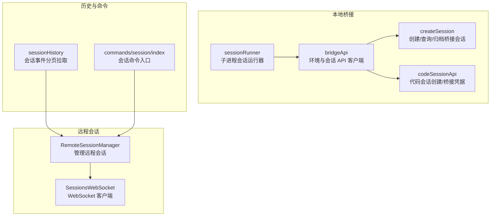
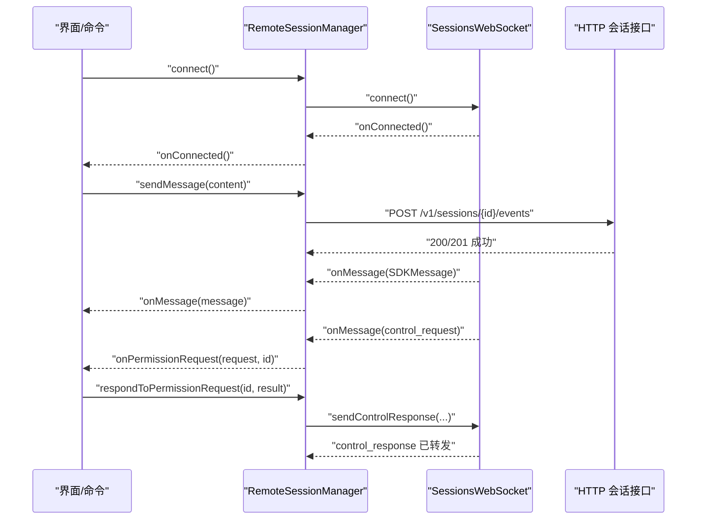
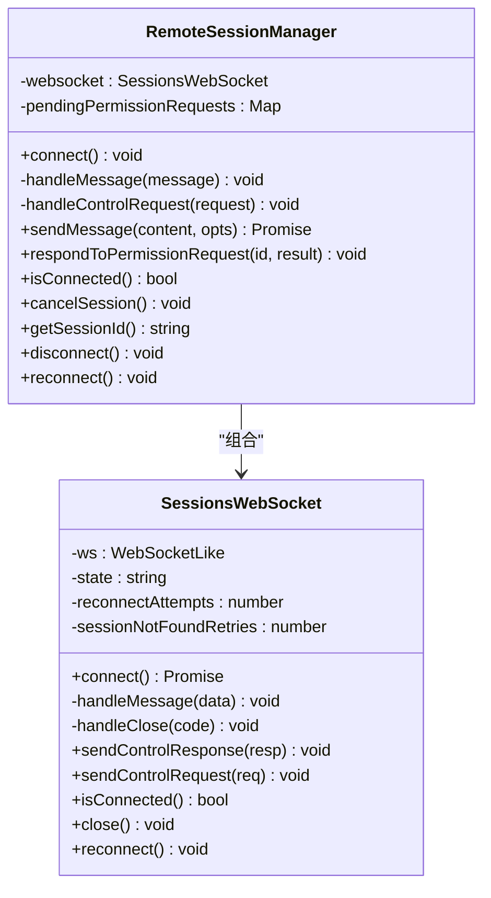
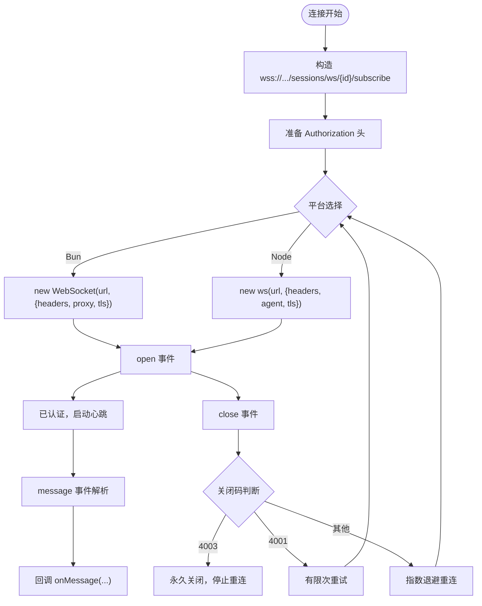
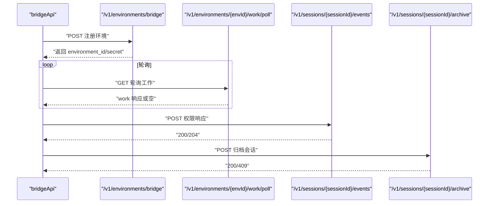
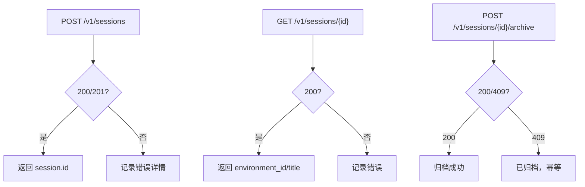
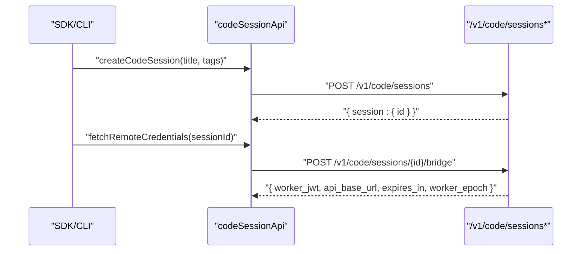
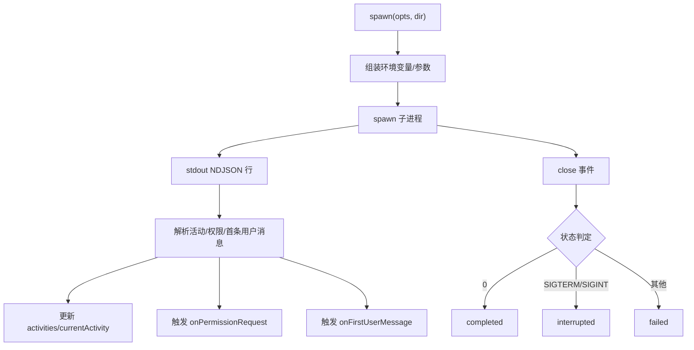
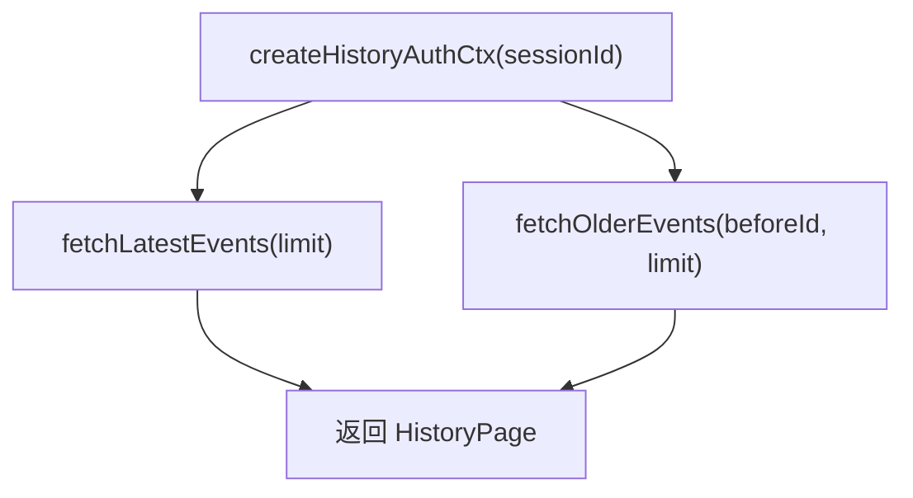
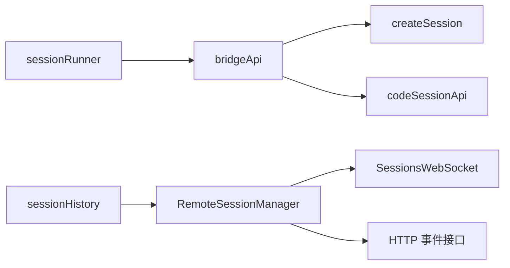

# 会话管理

<cite>
**本文引用的文件**   
- [src/assistant/sessionHistory.ts](file://src/assistant/sessionHistory.ts)
- [src/remote/RemoteSessionManager.ts](file://src/remote/RemoteSessionManager.ts)
- [src/remote/SessionsWebSocket.ts](file://src/remote/SessionsWebSocket.ts)
- [src/bridge/createSession.ts](file://src/bridge/createSession.ts)
- [src/bridge/codeSessionApi.ts](file://src/bridge/codeSessionApi.ts)
- [src/bridge/sessionRunner.ts](file://src/bridge/sessionRunner.ts)
- [src/bridge/bridgeApi.ts](file://src/bridge/bridgeApi.ts)
- [src/bridge/types.ts](file://src/bridge/types.ts)
- [src/commands/session/index.ts](file://src/commands/session/index.ts)
</cite>

## 目录
1. [简介](#简介)
2. [项目结构](#项目结构)
3. [核心组件](#核心组件)
4. [架构总览](#架构总览)
5. [详细组件分析](#详细组件分析)
6. [依赖关系分析](#依赖关系分析)
7. [性能考量](#性能考量)
8. [故障排查指南](#故障排查指南)
9. [结论](#结论)
10. [附录](#附录)

## 简介
本文件系统性阐述 Claude Code 的会话管理系统，覆盖本地桥接会话与远程会话两类形态，解释会话创建、事件历史拉取、消息通道（WebSocket + HTTP）、权限请求与响应、会话生命周期管理（启动、心跳、归档、断开）、以及迁移与恢复策略。文档同时给出最佳实践、安全与权限注意事项，并通过图示帮助读者快速把握端到端流程。

## 项目结构
围绕“会话”的关键模块分布如下：
- 远程会话：通过 WebSocket 订阅事件流，配合 HTTP 发送用户消息与控制请求；支持断线重连、心跳保活、权限请求处理。
- 本地桥接会话：通过子进程运行本地 CLI，桥接环境注册、轮询任务、会话事件上报、权限决策回传等。
- 历史与事件：提供按页拉取会话事件的能力，支持锚定最新或基于游标向前翻页。
- 命令入口：在远程模式下暴露会话相关命令入口，用于展示远程会话信息。

**图表来源**
- [src/remote/RemoteSessionManager.ts:95-324](file://src/remote/RemoteSessionManager.ts#L95-L324)
- [src/remote/SessionsWebSocket.ts:82-404](file://src/remote/SessionsWebSocket.ts#L82-L404)
- [src/bridge/bridgeApi.ts:68-451](file://src/bridge/bridgeApi.ts#L68-L451)
- [src/bridge/createSession.ts:34-180](file://src/bridge/createSession.ts#L34-L180)
- [src/bridge/codeSessionApi.ts:26-168](file://src/bridge/codeSessionApi.ts#L26-L168)
- [src/bridge/sessionRunner.ts:248-547](file://src/bridge/sessionRunner.ts#L248-L547)
- [src/assistant/sessionHistory.ts:73-87](file://src/assistant/sessionHistory.ts#L73-L87)
- [src/commands/session/index.ts:4-16](file://src/commands/session/index.ts#L4-L16)

**章节来源**
- [src/remote/RemoteSessionManager.ts:95-324](file://src/remote/RemoteSessionManager.ts#L95-L324)
- [src/remote/SessionsWebSocket.ts:82-404](file://src/remote/SessionsWebSocket.ts#L82-L404)
- [src/bridge/bridgeApi.ts:68-451](file://src/bridge/bridgeApi.ts#L68-L451)
- [src/bridge/createSession.ts:34-180](file://src/bridge/createSession.ts#L34-L180)
- [src/bridge/codeSessionApi.ts:26-168](file://src/bridge/codeSessionApi.ts#L26-L168)
- [src/bridge/sessionRunner.ts:248-547](file://src/bridge/sessionRunner.ts#L248-L547)
- [src/assistant/sessionHistory.ts:73-87](file://src/assistant/sessionHistory.ts#L73-L87)
- [src/commands/session/index.ts:4-16](file://src/commands/session/index.ts#L4-L16)

## 核心组件
- 远程会话管理器：负责 WebSocket 连接、消息收发、权限请求/取消/响应、中断发送、断线重连与状态查询。
- 会话 WebSocket：封装连接、认证、消息解析、心跳保活、错误与关闭处理、有限次数重连策略。
- 桥接 API 客户端：环境注册、轮询工作项、确认/停止/心跳、发送权限响应、归档会话、重连会话。
- 会话创建/查询/归档：通过 HTTP 创建/获取/归档桥接会话，支持标题更新与兼容层 ID 转换。
- 代码会话 API：创建代码会话、获取桥接凭据（含 worker_epoch）。
- 会话运行器：以子进程方式运行本地 CLI，解析 NDJSON 输出、提取活动与首次用户消息、处理权限请求、令牌刷新、进程生命周期管理。
- 会话历史：按页拉取会话事件，支持锚定最新与基于 before_id 向前翻页。
- 会话命令入口：在远程模式下暴露会话相关命令。

**章节来源**
- [src/remote/RemoteSessionManager.ts:95-324](file://src/remote/RemoteSessionManager.ts#L95-L324)
- [src/remote/SessionsWebSocket.ts:82-404](file://src/remote/SessionsWebSocket.ts#L82-L404)
- [src/bridge/bridgeApi.ts:141-451](file://src/bridge/bridgeApi.ts#L141-L451)
- [src/bridge/createSession.ts:34-384](file://src/bridge/createSession.ts#L34-L384)
- [src/bridge/codeSessionApi.ts:26-168](file://src/bridge/codeSessionApi.ts#L26-L168)
- [src/bridge/sessionRunner.ts:248-547](file://src/bridge/sessionRunner.ts#L248-L547)
- [src/assistant/sessionHistory.ts:73-87](file://src/assistant/sessionHistory.ts#L73-L87)
- [src/commands/session/index.ts:4-16](file://src/commands/session/index.ts#L4-L16)

## 架构总览
远程会话采用“WebSocket 订阅 + HTTP 控制/事件”的混合协议：
- WebSocket：建立于 /v1/sessions/ws/{id}/subscribe，使用 Bearer 认证头；服务端推送 SDKMessage 流。
- HTTP：用于发送用户消息（POST /v1/sessions/{id}/events），以及控制请求/响应（通过 WebSocket 通道）。
- 权限模型：当工具调用需要特定权限时，服务端通过 control_request 推送权限请求，客户端在 RemoteSessionManager 中回调上层处理，最终以 control_response 回复。

本地桥接会话采用“环境注册 + 轮询 + 子进程执行 + 事件上报”的模式：
- 环境注册：向 /v1/environments/bridge 注册桥接环境，携带机器名、目录、分支、最大会话数、元数据等。
- 轮询工作：周期性轮询 /v1/environments/{envId}/work/poll 获取待执行的工作项（包含会话 ID）。
- 执行会话：spawn 子进程运行本地 CLI，解析其 NDJSON 输出，提取活动、权限请求、首次用户消息等。
- 事件上报：通过 /v1/sessions/{sessionId}/events 上报权限响应等事件。
- 生命周期：心跳延长租期、归档结束会话、强制停止、重连会话。

**图表来源**
- [src/remote/RemoteSessionManager.ts:108-141](file://src/remote/RemoteSessionManager.ts#L108-L141)
- [src/remote/SessionsWebSocket.ts:100-205](file://src/remote/SessionsWebSocket.ts#L100-L205)
- [src/remote/RemoteSessionManager.ts:219-242](file://src/remote/RemoteSessionManager.ts#L219-L242)
- [src/remote/RemoteSessionManager.ts:189-214](file://src/remote/RemoteSessionManager.ts#L189-L214)

**章节来源**
- [src/remote/RemoteSessionManager.ts:95-324](file://src/remote/RemoteSessionManager.ts#L95-L324)
- [src/remote/SessionsWebSocket.ts:82-404](file://src/remote/SessionsWebSocket.ts#L82-L404)

## 详细组件分析

### 组件一：远程会话管理（RemoteSessionManager）
职责与行为：
- 连接：创建 SessionsWebSocket 并发起连接，回调 onConnected/onDisconnected/onReconnecting/onError。
- 消息处理：区分 SDKMessage、control_request、control_cancel_request、control_response，分别处理。
- 权限处理：缓存 pendingPermissionRequests，回调上层进行授权决策；支持取消请求清理。
- 发送消息：通过 HTTP POST 将用户消息写入会话事件流。
- 控制请求：支持发送中断（control_request: interrupt）。
- 断线重连：委托 SessionsWebSocket 实现指数退避与有限尝试。
- 状态查询：isConnected、getSessionId、disconnect、reconnect。

**图表来源**
- [src/remote/RemoteSessionManager.ts:95-324](file://src/remote/RemoteSessionManager.ts#L95-L324)
- [src/remote/SessionsWebSocket.ts:82-404](file://src/remote/SessionsWebSocket.ts#L82-L404)

**章节来源**
- [src/remote/RemoteSessionManager.ts:95-324](file://src/remote/RemoteSessionManager.ts#L95-L324)

### 组件二：会话 WebSocket（SessionsWebSocket）
职责与行为：
- 连接：根据平台选择原生 WebSocket 或 ws 包，设置代理与 TLS 参数，使用 Bearer 认证头。
- 认证：连接后立即进入已认证状态（headers 认证），随后开始心跳保活。
- 消息：解析 NDJSON 文本，过滤非法类型，回调上层 onMessage。
- 关闭与重连：区分永久关闭码（如 4003）与临时关闭（如 4001），对 4001 在有限次数内重试；其他情况按指数退避重连。
- 心跳：定时发送 ping，维持连接活性。
- 控制：支持发送 control_request 与 control_response。

**图表来源**
- [src/remote/SessionsWebSocket.ts:100-205](file://src/remote/SessionsWebSocket.ts#L100-L205)
- [src/remote/SessionsWebSocket.ts:234-288](file://src/remote/SessionsWebSocket.ts#L234-L288)

**章节来源**
- [src/remote/SessionsWebSocket.ts:82-404](file://src/remote/SessionsWebSocket.ts#L82-L404)

### 组件三：桥接 API 客户端（bridgeApi）
职责与行为：
- 环境注册：POST /v1/environments/bridge，支持复用旧 environment_id、设置 worker_type、最大会话数等。
- 轮询工作：GET /v1/environments/{envId}/work/poll，支持 reclaim_older_than_ms 参数。
- 确认/停止/心跳：ACK、STOP（force 可选）、HEARTBEAT 使用会话令牌。
- 发送权限响应：POST /v1/sessions/{sessionId}/events，上报 control_response。
- 归档会话：POST /v1/sessions/{sessionId}/archive（幂等）。
- 重连会话：POST /v1/environments/{envId}/bridge/reconnect。
- 错误处理：统一 401 刷新、403/404/410/429 等错误分类与致命错误封装。

**图表来源**
- [src/bridge/bridgeApi.ts:141-451](file://src/bridge/bridgeApi.ts#L141-L451)

**章节来源**
- [src/bridge/bridgeApi.ts:68-451](file://src/bridge/bridgeApi.ts#L68-L451)

### 组件四：会话创建/查询/归档（createSession）
职责与行为：
- 创建桥接会话：POST /v1/sessions，支持标题、初始事件、Git 源与结果上下文、权限模式等。
- 查询桥接会话：GET /v1/sessions/{id}，返回 environment_id 与 title。
- 归档桥接会话：POST /v1/sessions/{id}/archive，幂等处理。
- 更新标题：PATCH /v1/sessions/{id}，兼容旧 ID。

**图表来源**
- [src/bridge/createSession.ts:34-180](file://src/bridge/createSession.ts#L34-L180)
- [src/bridge/createSession.ts:190-244](file://src/bridge/createSession.ts#L190-L244)
- [src/bridge/createSession.ts:263-317](file://src/bridge/createSession.ts#L263-L317)
- [src/bridge/createSession.ts:327-384](file://src/bridge/createSession.ts#L327-L384)

**章节来源**
- [src/bridge/createSession.ts:34-384](file://src/bridge/createSession.ts#L34-L384)

### 组件五：代码会话 API（codeSessionApi）
职责与行为：
- 创建代码会话：POST /v1/code/sessions，支持标题与标签。
- 获取桥接凭据：POST /v1/code/sessions/{id}/bridge，返回 worker_jwt、api_base_url、expires_in、worker_epoch。

**图表来源**
- [src/bridge/codeSessionApi.ts:26-80](file://src/bridge/codeSessionApi.ts#L26-L80)
- [src/bridge/codeSessionApi.ts:93-168](file://src/bridge/codeSessionApi.ts#L93-L168)

**章节来源**
- [src/bridge/codeSessionApi.ts:26-168](file://src/bridge/codeSessionApi.ts#L26-L168)

### 组件六：会话运行器（sessionRunner）
职责与行为：
- 子进程启动：拼装参数与环境变量，注入会话访问令牌、是否使用 CCR v2、调试文件等。
- 输出解析：逐行读取 NDJSON，提取活动（tool_start/text/result/error）、权限请求（can_use_tool）、首次用户消息。
- 生命周期：提供 kill/forceKill、更新访问令牌、写入 stdin、完成状态（completed/failed/interrupted）。
- 会话活动：维护最近若干条活动与当前活动，便于 UI 展示。

**图表来源**
- [src/bridge/sessionRunner.ts:248-547](file://src/bridge/sessionRunner.ts#L248-L547)

**章节来源**
- [src/bridge/sessionRunner.ts:248-547](file://src/bridge/sessionRunner.ts#L248-L547)

### 组件七：会话历史（sessionHistory）
职责与行为：
- 创建历史认证上下文：准备 base URL 与带 orgUUID 的 OAuth 头，复用 across 页面。
- 拉取最新事件：anchor_to_latest 分页，返回 events/firstId/hasMore。
- 拉取更早事件：基于 before_id 游标翻页。

**图表来源**
- [src/assistant/sessionHistory.ts:31-43](file://src/assistant/sessionHistory.ts#L31-L43)
- [src/assistant/sessionHistory.ts:73-87](file://src/assistant/sessionHistory.ts#L73-L87)

**章节来源**
- [src/assistant/sessionHistory.ts:7-87](file://src/assistant/sessionHistory.ts#L7-L87)

### 组件八：会话命令入口（commands/session/index）
职责与行为：
- 在远程模式启用时，注册名为 session（别名 remote）的命令，加载对应模块，用于展示远程会话 URL 与二维码等。

**章节来源**
- [src/commands/session/index.ts:4-16](file://src/commands/session/index.ts#L4-L16)

## 依赖关系分析
- RemoteSessionManager 依赖 SessionsWebSocket 与 HTTP 事件接口，负责高层编排与权限处理。
- SessionsWebSocket 依赖 OAuth 配置、代理与 mTLS 设置，负责底层连接与重连。
- bridgeApi 提供环境与会话的统一 HTTP 客户端，被 sessionRunner 与 createSession 使用。
- createSession 与 codeSessionApi 共同支撑会话创建与桥接凭据获取。
- sessionHistory 与 RemoteSessionManager 协作，用于历史事件展示与回放。

**图表来源**
- [src/remote/RemoteSessionManager.ts:95-324](file://src/remote/RemoteSessionManager.ts#L95-L324)
- [src/remote/SessionsWebSocket.ts:82-404](file://src/remote/SessionsWebSocket.ts#L82-L404)
- [src/bridge/bridgeApi.ts:68-451](file://src/bridge/bridgeApi.ts#L68-L451)
- [src/bridge/createSession.ts:34-180](file://src/bridge/createSession.ts#L34-L180)
- [src/bridge/codeSessionApi.ts:26-168](file://src/bridge/codeSessionApi.ts#L26-L168)
- [src/bridge/sessionRunner.ts:248-547](file://src/bridge/sessionRunner.ts#L248-L547)
- [src/assistant/sessionHistory.ts:73-87](file://src/assistant/sessionHistory.ts#L73-L87)

**章节来源**
- [src/remote/RemoteSessionManager.ts:95-324](file://src/remote/RemoteSessionManager.ts#L95-L324)
- [src/remote/SessionsWebSocket.ts:82-404](file://src/remote/SessionsWebSocket.ts#L82-L404)
- [src/bridge/bridgeApi.ts:68-451](file://src/bridge/bridgeApi.ts#L68-L451)
- [src/bridge/createSession.ts:34-180](file://src/bridge/createSession.ts#L34-L180)
- [src/bridge/codeSessionApi.ts:26-168](file://src/bridge/codeSessionApi.ts#L26-L168)
- [src/bridge/sessionRunner.ts:248-547](file://src/bridge/sessionRunner.ts#L248-L547)
- [src/assistant/sessionHistory.ts:73-87](file://src/assistant/sessionHistory.ts#L73-L87)

## 性能考量
- 远程会话
  - WebSocket 心跳间隔固定，避免频繁 ping；断线重连采用有限次数与指数退避，降低风暴效应。
  - HTTP 请求设置合理超时与校验状态，避免阻塞。
- 本地桥接
  - NDJSON 解析轻量，仅在必要时解析；stderr 缓冲限制减少内存占用。
  - 会话活动环形缓冲大小可控，避免长期运行内存膨胀。
- 历史拉取
  - 分页大小固定，按需翻页，避免一次性拉取过多事件导致内存压力。

[本节为通用建议，无需具体文件来源]

## 故障排查指南
- 远程会话
  - 4003（未授权）：永久关闭，检查令牌与组织权限。
  - 4001（会话不存在）：短暂重试至上限，确认会话未被压缩或过期。
  - 连接抖动：观察 onReconnecting 回调，确认网络与代理配置。
  - 权限请求未决：检查 pendingPermissionRequests 是否正确清理与响应。
- 本地桥接
  - 401：尝试刷新令牌后重试；若无刷新处理器则直接报错。
  - 403：检查角色与范围；部分 403 可抑制不干扰核心功能。
  - 404/410：环境或会话过期，需重新注册或重启。
  - 子进程异常：查看 stderr 环形缓冲与调试日志，定位工具调用失败原因。
- 历史拉取
  - HTTP 非 200：检查认证头与 orgUUID，确认 before_id 游标是否有效。

**章节来源**
- [src/remote/SessionsWebSocket.ts:234-288](file://src/remote/SessionsWebSocket.ts#L234-L288)
- [src/bridge/bridgeApi.ts:454-500](file://src/bridge/bridgeApi.ts#L454-L500)
- [src/bridge/bridgeApi.ts:516-524](file://src/bridge/bridgeApi.ts#L516-L524)
- [src/bridge/sessionRunner.ts:352-366](file://src/bridge/sessionRunner.ts#L352-L366)

## 结论
该会话管理体系通过“远程 WebSocket + HTTP”与“本地桥接 + 子进程”的双轨设计，实现了跨端一致的会话体验。远程侧强调低延迟事件流与细粒度权限控制；本地侧强调可审计、可诊断与可恢复。结合历史事件分页、心跳与归档机制，系统在可用性与可观测性方面具备良好平衡。

[本节为总结，无需具体文件来源]

## 附录

### 会话迁移与备份恢复
- 迁移
  - 通过 bridgeApi 的 reconnectSession 将会话重新绑定到新的环境实例，适合桥接环境崩溃后的恢复。
  - 通过 createSession 的查询能力获取会话的 environment_id 与 title，便于在不同客户端间切换。
- 备份与恢复
  - 历史事件可通过 sessionHistory 分页拉取并落盘，作为离线备份。
  - 代码会话的桥接凭据包含 worker_epoch，可用于在兼容环境下重建会话。

**章节来源**
- [src/bridge/bridgeApi.ts:358-385](file://src/bridge/bridgeApi.ts#L358-L385)
- [src/bridge/createSession.ts:190-244](file://src/bridge/createSession.ts#L190-L244)
- [src/assistant/sessionHistory.ts:73-87](file://src/assistant/sessionHistory.ts#L73-L87)
- [src/bridge/codeSessionApi.ts:93-168](file://src/bridge/codeSessionApi.ts#L93-L168)

### 最佳实践
- 远程会话
  - 使用 anchor_to_latest 拉取最新事件，再基于 before_id 向前翻页，避免一次性拉取过多。
  - 对权限请求尽快响应，避免服务端等待超时。
  - 在 UI 中显示 onReconnecting 状态，提升用户体验。
- 本地桥接
  - 合理设置 sessionTimeoutMs，避免长时间占用资源。
  - 使用调试文件与转录文件辅助问题定位。
  - 在权限模式下严格控制工具调用范围。
- 历史与持久化
  - 定期归档不再活跃的会话，保持服务器侧整洁。
  - 对重要会话导出历史事件，保留证据链。

[本节为通用建议，无需具体文件来源]

### 权限控制与安全
- 远程会话
  - 仅允许必要的工具调用；对未知 subtype 的 control_request 返回 error，避免挂起。
  - 使用 orgUUID 与 beta 头确保组织级隔离与版本兼容。
- 本地桥接
  - 环境注册时设置 worker_type，便于服务端筛选与审计。
  - 使用受信设备令牌（X-Trusted-Device-Token）满足安全强化策略。
- 令牌与凭据
  - 会话运行器支持通过 stdin 动态刷新访问令牌，避免硬编码。
  - 代码会话桥接凭据包含过期时间，需在过期前续签。

**章节来源**
- [src/remote/RemoteSessionManager.ts:198-214](file://src/remote/RemoteSessionManager.ts#L198-L214)
- [src/bridge/bridgeApi.ts:76-89](file://src/bridge/bridgeApi.ts#L76-L89)
- [src/bridge/sessionRunner.ts:527-542](file://src/bridge/sessionRunner.ts#L527-L542)
- [src/bridge/codeSessionApi.ts:93-104](file://src/bridge/codeSessionApi.ts#L93-L104)

### 实际使用场景与操作示例
- 远程会话
  - 启动：调用 connect() 建立订阅，收到 onConnected 后即可交互。
  - 发送消息：sendMessage(content) 写入事件流。
  - 权限审批：收到 onPermissionRequest 后，respondToPermissionRequest(id, {behavior:'allow'|'deny'})。
  - 中断：cancelSession() 发送中断请求。
- 本地桥接
  - 注册环境：registerBridgeEnvironment(config)。
  - 轮询任务：pollForWork(environmentId, environmentSecret)。
  - 执行会话：spawn 子进程，解析活动与权限请求。
  - 归档会话：archiveSession(sessionId)。
- 历史查看
  - createHistoryAuthCtx(sessionId) 准备上下文，然后 fetchLatestEvents 或 fetchOlderEvents 分页拉取。

**章节来源**
- [src/remote/RemoteSessionManager.ts:108-141](file://src/remote/RemoteSessionManager.ts#L108-L141)
- [src/remote/RemoteSessionManager.ts:219-242](file://src/remote/RemoteSessionManager.ts#L219-L242)
- [src/remote/RemoteSessionManager.ts:294-297](file://src/remote/RemoteSessionManager.ts#L294-L297)
- [src/bridge/bridgeApi.ts:199-247](file://src/bridge/bridgeApi.ts#L199-L247)
- [src/bridge/sessionRunner.ts:248-547](file://src/bridge/sessionRunner.ts#L248-L547)
- [src/assistant/sessionHistory.ts:31-43](file://src/assistant/sessionHistory.ts#L31-L43)
- [src/assistant/sessionHistory.ts:73-87](file://src/assistant/sessionHistory.ts#L73-L87)