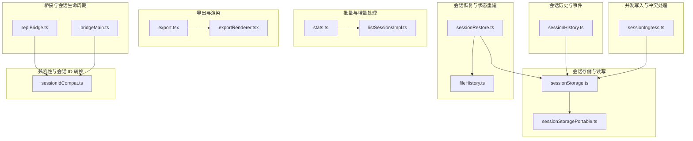
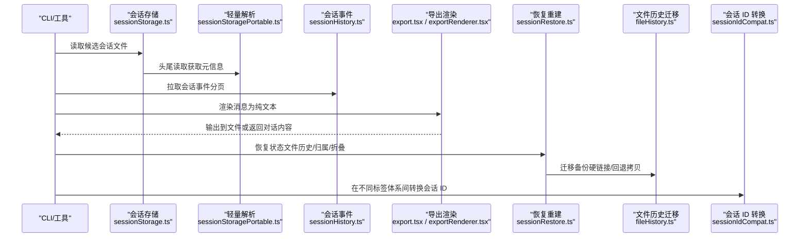
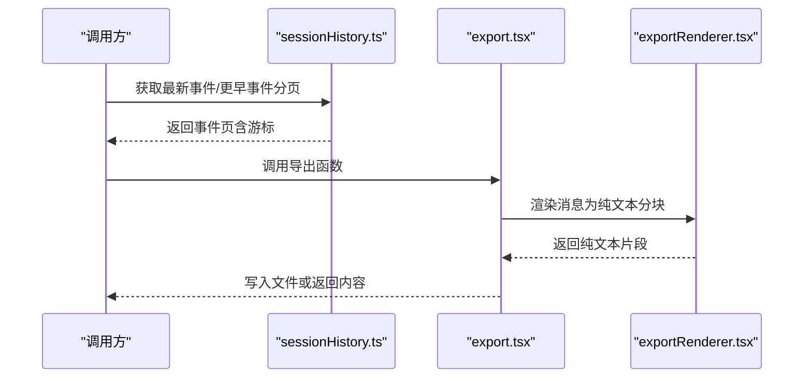
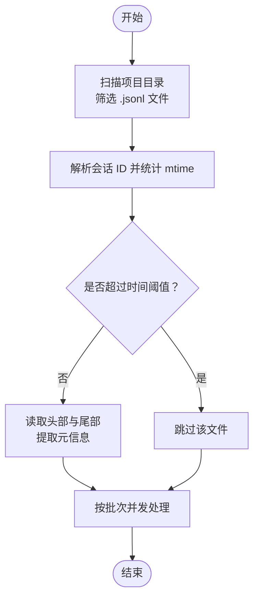
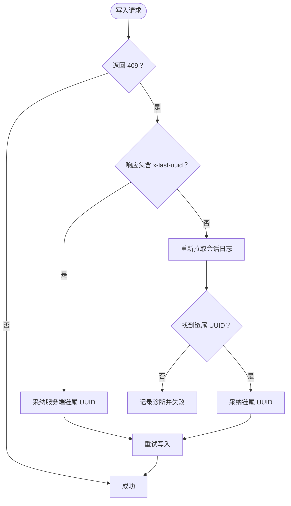
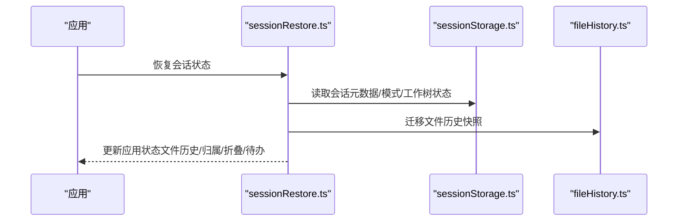
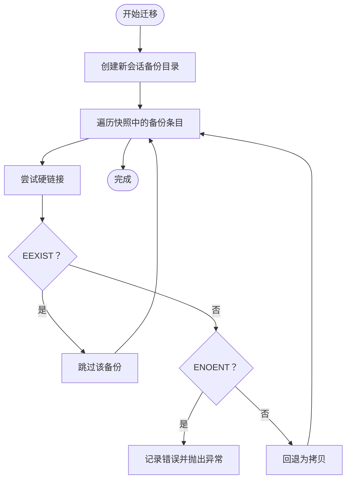
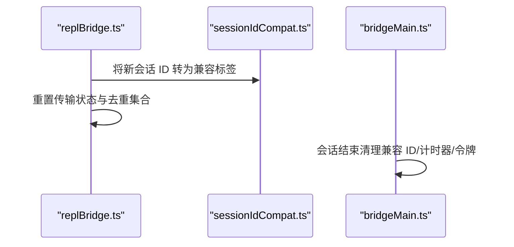
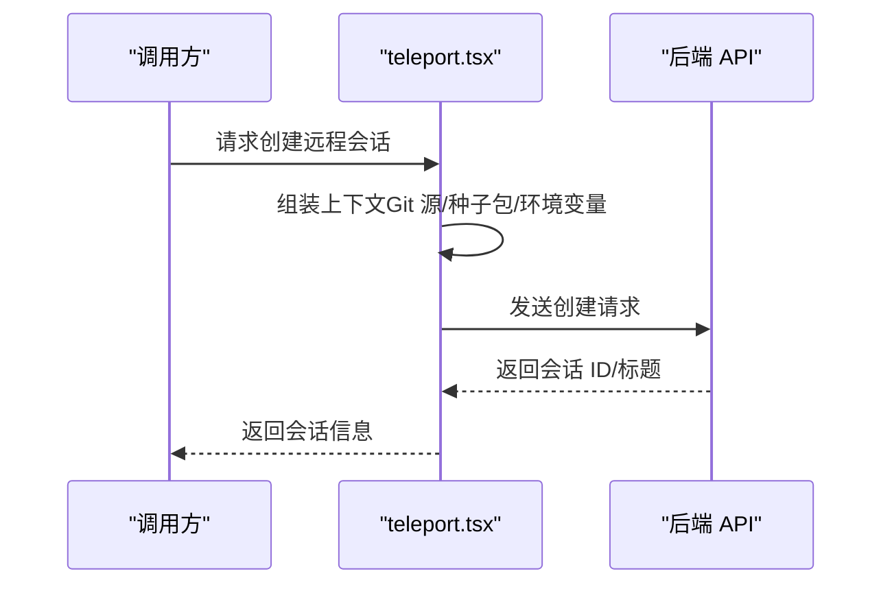
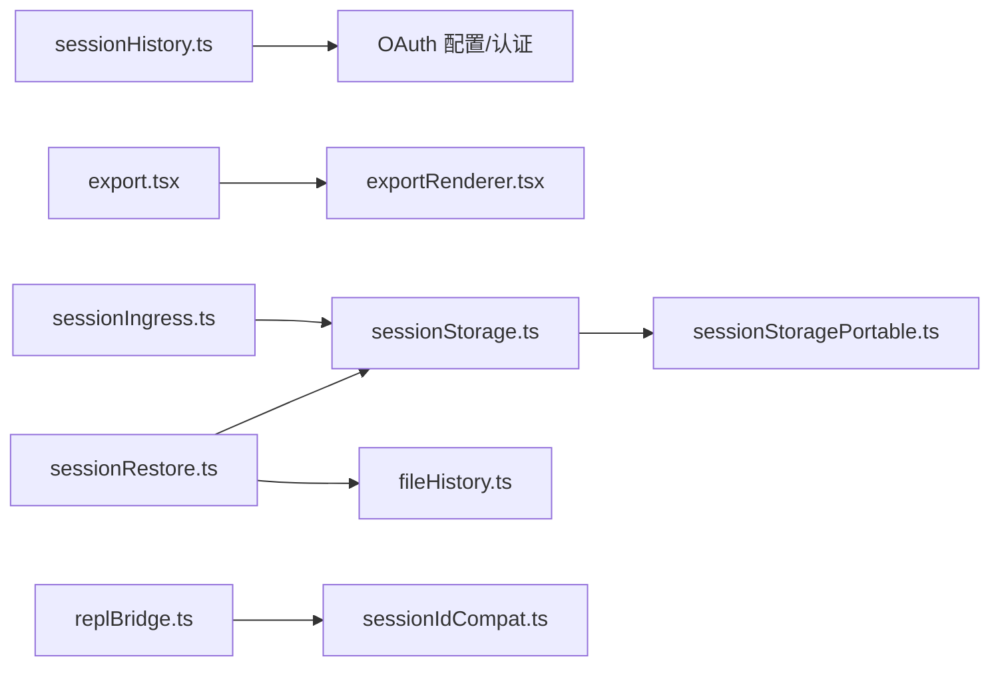

# 会话迁移

<cite>
**本文引用的文件**
- [src/assistant/sessionHistory.ts](file://src/assistant/sessionHistory.ts)
- [src/commands/export/export.tsx](file://src/commands/export/export.tsx)
- [src/utils/exportRenderer.tsx](file://src/utils/exportRenderer.tsx)
- [src/utils/sessionStorage.ts](file://src/utils/sessionStorage.ts)
- [src/utils/sessionStoragePortable.ts](file://src/utils/sessionStoragePortable.ts)
- [src/utils/sessionRestore.ts](file://src/utils/sessionRestore.ts)
- [src/utils/fileHistory.ts](file://src/utils/fileHistory.ts)
- [src/bridge/sessionIdCompat.ts](file://src/bridge/sessionIdCompat.ts)
- [src/services/api/sessionIngress.ts](file://src/services/api/sessionIngress.ts)
- [src/bridge/replBridge.ts](file://src/bridge/replBridge.ts)
- [src/bridge/bridgeMain.ts](file://src/bridge/bridgeMain.ts)
- [src/utils/stats.ts](file://src/utils/stats.ts)
- [src/utils/listSessionsImpl.ts](file://src/utils/listSessionsImpl.ts)
- [src/utils/teleport.tsx](file://src/utils/teleport.tsx)
- [src/screens/REPL.tsx](file://src/screens/REPL.tsx)
- [src/cli/print.ts](file://src/cli/print.ts)
</cite>

## 目录
1. [简介](#简介)
2. [项目结构](#项目结构)
3. [核心组件](#核心组件)
4. [架构总览](#架构总览)
5. [详细组件分析](#详细组件分析)
6. [依赖关系分析](#依赖关系分析)
7. [性能考量](#性能考量)
8. [故障排查指南](#故障排查指南)
9. [结论](#结论)
10. [附录](#附录)

## 简介
本文件系统化梳理 Claude Code 的“会话迁移”能力，覆盖跨项目会话迁移的实现机制（导出与导入）、安全验证与完整性保障、兼容性检查、批量与增量策略、回滚与错误恢复、配置与性能优化，以及在团队协作与项目切换中的实际应用。文档以仓库源码为依据，通过图示与分层讲解帮助读者快速理解并正确使用该能力。

## 项目结构
围绕会话迁移的关键模块分布如下：
- 会话历史与事件：会话事件拉取与分页，用于远端迁移或备份
- 会话存储与读写：本地 JSONL 会话文件的读取、解析、写入与元数据管理
- 会话恢复与状态重建：从日志快照恢复文件历史、归属、上下文折叠等状态
- 文件历史迁移：在会话切换时迁移文件备份链接或拷贝
- 兼容性与会话 ID 转换：在不同会话标签体系间转换
- 并发写入与冲突处理：会话入口写入的并发冲突检测与自适应重试
- 批量与增量处理：统计与扫描、批量读取、按时间窗口过滤
- 导出与渲染：将对话内容渲染为纯文本并支持导出对话

**图表来源**
- [src/assistant/sessionHistory.ts:1-88](file://src/assistant/sessionHistory.ts#L1-L88)
- [src/utils/sessionStorage.ts:1-200](file://src/utils/sessionStorage.ts#L1-L200)
- [src/utils/sessionStoragePortable.ts:244-286](file://src/utils/sessionStoragePortable.ts#L244-L286)
- [src/utils/sessionRestore.ts:1-200](file://src/utils/sessionRestore.ts#L1-L200)
- [src/utils/fileHistory.ts:927-1010](file://src/utils/fileHistory.ts#L927-L1010)
- [src/bridge/sessionIdCompat.ts:1-58](file://src/bridge/sessionIdCompat.ts#L1-L58)
- [src/services/api/sessionIngress.ts:105-142](file://src/services/api/sessionIngress.ts#L105-L142)
- [src/utils/stats.ts:137-183](file://src/utils/stats.ts#L137-L183)
- [src/utils/listSessionsImpl.ts:164-209](file://src/utils/listSessionsImpl.ts#L164-L209)
- [src/commands/export/export.tsx:1-91](file://src/commands/export/export.tsx#L1-L91)
- [src/utils/exportRenderer.tsx:1-98](file://src/utils/exportRenderer.tsx#L1-L98)
- [src/bridge/replBridge.ts:788-807](file://src/bridge/replBridge.ts#L788-L807)
- [src/bridge/bridgeMain.ts:442-475](file://src/bridge/bridgeMain.ts#L442-L475)

**章节来源**
- [src/assistant/sessionHistory.ts:1-88](file://src/assistant/sessionHistory.ts#L1-L88)
- [src/utils/sessionStorage.ts:1-200](file://src/utils/sessionStorage.ts#L1-L200)
- [src/utils/sessionRestore.ts:1-200](file://src/utils/sessionRestore.ts#L1-L200)
- [src/utils/fileHistory.ts:927-1010](file://src/utils/fileHistory.ts#L927-L1010)
- [src/bridge/sessionIdCompat.ts:1-58](file://src/bridge/sessionIdCompat.ts#L1-L58)
- [src/services/api/sessionIngress.ts:105-142](file://src/services/api/sessionIngress.ts#L105-L142)
- [src/utils/stats.ts:137-183](file://src/utils/stats.ts#L137-L183)
- [src/utils/listSessionsImpl.ts:164-209](file://src/utils/listSessionsImpl.ts#L164-L209)
- [src/commands/export/export.tsx:1-91](file://src/commands/export/export.tsx#L1-L91)
- [src/utils/exportRenderer.tsx:1-98](file://src/utils/exportRenderer.tsx#L1-L98)
- [src/bridge/replBridge.ts:788-807](file://src/bridge/replBridge.ts#L788-L807)
- [src/bridge/bridgeMain.ts:442-475](file://src/bridge/bridgeMain.ts#L442-L475)

## 核心组件
- 会话事件获取与分页：提供基于游标的分页拉取接口，支持“最新”和“更早”的翻页，便于远端迁移或备份
- 会话文件读取与轻量解析：对大文件进行头尾读取，快速提取元信息，支持批量扫描与按时间过滤
- 会话写入与并发冲突处理：在并发写入冲突时采用“自适应重试 + 服务端链尾 UUID 采纳”，保证一致性
- 会话恢复与状态重建：从日志快照恢复文件历史、归属、上下文折叠、模式等状态
- 文件历史迁移：在会话切换时将旧会话的备份硬链接到新会话目录，失败时回退为拷贝
- 会话 ID 兼容转换：在“cse_*”与“session_*”标签之间互转，适配不同后端接口
- 导出与渲染：将消息渲染为纯文本，支持直接写文件或弹窗选择路径

**章节来源**
- [src/assistant/sessionHistory.ts:45-87](file://src/assistant/sessionHistory.ts#L45-L87)
- [src/utils/sessionStoragePortable.ts:256-282](file://src/utils/sessionStoragePortable.ts#L256-L282)
- [src/services/api/sessionIngress.ts:105-142](file://src/services/api/sessionIngress.ts#L105-L142)
- [src/utils/sessionRestore.ts:99-150](file://src/utils/sessionRestore.ts#L99-L150)
- [src/utils/fileHistory.ts:963-1010](file://src/utils/fileHistory.ts#L963-L1010)
- [src/bridge/sessionIdCompat.ts:38-57](file://src/bridge/sessionIdCompat.ts#L38-L57)
- [src/commands/export/export.tsx:49-90](file://src/commands/export/export.tsx#L49-L90)
- [src/utils/exportRenderer.tsx:55-97](file://src/utils/exportRenderer.tsx#L55-L97)

## 架构总览
下图展示了会话迁移在不同场景下的关键交互：从本地会话文件读取与解析，到事件拉取与导出，再到恢复与状态重建，以及在桥接层的会话 ID 转换与生命周期管理。

**图表来源**
- [src/utils/sessionStorage.ts:198-200](file://src/utils/sessionStorage.ts#L198-L200)
- [src/utils/sessionStoragePortable.ts:256-282](file://src/utils/sessionStoragePortable.ts#L256-L282)
- [src/assistant/sessionHistory.ts:45-87](file://src/assistant/sessionHistory.ts#L45-L87)
- [src/commands/export/export.tsx:49-90](file://src/commands/export/export.tsx#L49-L90)
- [src/utils/exportRenderer.tsx:55-97](file://src/utils/exportRenderer.tsx#L55-L97)
- [src/utils/sessionRestore.ts:99-150](file://src/utils/sessionRestore.ts#L99-L150)
- [src/utils/fileHistory.ts:963-1010](file://src/utils/fileHistory.ts#L963-L1010)
- [src/bridge/sessionIdCompat.ts:38-57](file://src/bridge/sessionIdCompat.ts#L38-L57)

## 详细组件分析

### 组件一：会话事件获取与导出
- 事件获取：提供“最新事件”和“更早事件”的分页接口，支持锚定到最新事件并设置分页大小
- 导出渲染：将消息渲染为纯文本，支持分块流式输出，避免一次性渲染导致内存压力
- 导出对话：支持直接写文件或弹窗选择路径，自动清洗文件名并生成默认文件名

**图表来源**
- [src/assistant/sessionHistory.ts:73-87](file://src/assistant/sessionHistory.ts#L73-L87)
- [src/commands/export/export.tsx:49-90](file://src/commands/export/export.tsx#L49-L90)
- [src/utils/exportRenderer.tsx:55-97](file://src/utils/exportRenderer.tsx#L55-L97)

**章节来源**
- [src/assistant/sessionHistory.ts:45-87](file://src/assistant/sessionHistory.ts#L45-L87)
- [src/commands/export/export.tsx:1-91](file://src/commands/export/export.tsx#L1-L91)
- [src/utils/exportRenderer.tsx:1-98](file://src/utils/exportRenderer.tsx#L1-L98)

### 组件二：会话文件读取与批量处理
- 候选文件扫描：遍历项目目录，筛选 .jsonl 文件并解析会话 ID
- 轻量读取：对大文件仅读取头部与尾部，快速提取起止时间与大小，支持按修改时间过滤
- 批量处理：按批次并发读取，提升统计与迁移效率

**图表来源**
- [src/utils/listSessionsImpl.ts:164-209](file://src/utils/listSessionsImpl.ts#L164-L209)
- [src/utils/sessionStoragePortable.ts:256-282](file://src/utils/sessionStoragePortable.ts#L256-L282)
- [src/utils/stats.ts:137-183](file://src/utils/stats.ts#L137-L183)

**章节来源**
- [src/utils/listSessionsImpl.ts:164-209](file://src/utils/listSessionsImpl.ts#L164-L209)
- [src/utils/sessionStoragePortable.ts:256-282](file://src/utils/sessionStoragePortable.ts#L256-L282)
- [src/utils/stats.ts:137-183](file://src/utils/stats.ts#L137-L183)

### 组件三：会话写入与并发冲突处理
- 并发写入：当服务端返回 409 且包含服务器链尾 UUID 时，采用“采纳服务端链尾 UUID + 重试”的策略
- 自适应重试：若无法从响应头获取链尾 UUID，则重新拉取会话日志发现当前链尾，再重试
- 失败回退：若仍无法确定服务端状态，记录诊断信息并判定失败

**图表来源**
- [src/services/api/sessionIngress.ts:105-142](file://src/services/api/sessionIngress.ts#L105-L142)

**章节来源**
- [src/services/api/sessionIngress.ts:105-142](file://src/services/api/sessionIngress.ts#L105-L142)

### 组件四：会话恢复与状态重建
- 状态恢复：从日志快照恢复文件历史、归属、上下文折叠、待办等状态
- 模式保存与恢复：在会话中持久化模式（普通/协调者），恢复时匹配并刷新代理定义
- 成本状态恢复：从读取的数据恢复会话成本状态

**图表来源**
- [src/utils/sessionRestore.ts:99-150](file://src/utils/sessionRestore.ts#L99-L150)
- [src/utils/fileHistory.ts:963-1010](file://src/utils/fileHistory.ts#L963-L1010)
- [src/screens/REPL.tsx:1894-1910](file://src/screens/REPL.tsx#L1894-L1910)

**章节来源**
- [src/utils/sessionRestore.ts:99-150](file://src/utils/sessionRestore.ts#L99-L150)
- [src/utils/fileHistory.ts:927-1010](file://src/utils/fileHistory.ts#L927-L1010)
- [src/screens/REPL.tsx:1894-1910](file://src/screens/REPL.tsx#L1894-L1910)

### 组件五：文件历史迁移与回退
- 硬链接优先：将旧会话备份硬链接到新会话目录，避免重复存储
- 回退策略：遇到“已存在”或“不存在”等错误时，回退为拷贝，确保迁移成功
- 并行处理：对多个快照内的备份并行迁移，提升吞吐

**图表来源**
- [src/utils/fileHistory.ts:963-1010](file://src/utils/fileHistory.ts#L963-L1010)

**章节来源**
- [src/utils/fileHistory.ts:927-1010](file://src/utils/fileHistory.ts#L927-L1010)

### 组件六：会话 ID 兼容与桥接层
- 标签转换：在“cse_*”与“session_*”之间互转，适配不同后端接口
- 桥接层：在会话切换时重置传输状态与去重集合，防止序列号与 UUID 泄漏
- 生命周期清理：会话结束时清理兼容 ID 映射、计时器与令牌刷新定时器

**图表来源**
- [src/bridge/sessionIdCompat.ts:38-57](file://src/bridge/sessionIdCompat.ts#L38-L57)
- [src/bridge/replBridge.ts:788-807](file://src/bridge/replBridge.ts#L788-L807)
- [src/bridge/bridgeMain.ts:442-475](file://src/bridge/bridgeMain.ts#L442-L475)

**章节来源**
- [src/bridge/sessionIdCompat.ts:1-58](file://src/bridge/sessionIdCompat.ts#L1-L58)
- [src/bridge/replBridge.ts:788-807](file://src/bridge/replBridge.ts#L788-L807)
- [src/bridge/bridgeMain.ts:442-475](file://src/bridge/bridgeMain.ts#L442-L475)

### 组件七：远程会话创建与上下文注入
- 远程会话创建：通过 API 创建远程会话，支持注入环境变量、种子包或 Git 源
- 上下文参数：支持标题、事件列表、结果 outcome、环境变量等

**图表来源**
- [src/utils/teleport.tsx:863-898](file://src/utils/teleport.tsx#L863-L898)

**章节来源**
- [src/utils/teleport.tsx:863-901](file://src/utils/teleport.tsx#L863-L901)

## 依赖关系分析
- 低耦合高内聚：会话事件获取与导出相互独立；存储层与恢复层通过日志快照解耦
- 关键依赖链：
  - 会话事件获取依赖 OAuth 配置与认证头
  - 会话存储依赖文件系统与 JSONL 解析
  - 恢复层依赖多类快照（文件历史、归属、上下文折叠）
  - 桥接层依赖会话 ID 兼容转换
  - 并发写入依赖服务端响应头与链尾 UUID

**图表来源**
- [src/assistant/sessionHistory.ts:25-43](file://src/assistant/sessionHistory.ts#L25-L43)
- [src/commands/export/export.tsx:1-10](file://src/commands/export/export.tsx#L1-L10)
- [src/utils/exportRenderer.tsx:1-11](file://src/utils/exportRenderer.tsx#L1-L11)
- [src/utils/sessionStorage.ts:1-100](file://src/utils/sessionStorage.ts#L1-L100)
- [src/utils/sessionStoragePortable.ts:244-286](file://src/utils/sessionStoragePortable.ts#L244-L286)
- [src/utils/sessionRestore.ts:1-63](file://src/utils/sessionRestore.ts#L1-L63)
- [src/utils/fileHistory.ts:927-962](file://src/utils/fileHistory.ts#L927-L962)
- [src/bridge/replBridge.ts:788-807](file://src/bridge/replBridge.ts#L788-L807)
- [src/bridge/sessionIdCompat.ts:1-23](file://src/bridge/sessionIdCompat.ts#L1-L23)
- [src/services/api/sessionIngress.ts:105-142](file://src/services/api/sessionIngress.ts#L105-L142)

**章节来源**
- 同上

## 性能考量
- 批量处理：统计与扫描采用固定批次大小并发处理，减少 IO 抖动
- 大文件优化：对大文件仅读取头部与尾部，结合修改时间与起始日期过滤，避免全量读取
- 分块渲染：导出渲染采用分块流式输出，降低内存峰值
- 并发写入：在冲突时采用“采纳服务端链尾 UUID + 重试”，避免盲目重试造成拥塞

**章节来源**
- [src/utils/stats.ts:137-183](file://src/utils/stats.ts#L137-L183)
- [src/utils/sessionStoragePortable.ts:256-282](file://src/utils/sessionStoragePortable.ts#L256-L282)
- [src/utils/exportRenderer.tsx:55-97](file://src/utils/exportRenderer.tsx#L55-L97)
- [src/services/api/sessionIngress.ts:105-142](file://src/services/api/sessionIngress.ts#L105-L142)

## 故障排查指南
- 并发写入冲突
  - 现象：服务端返回 409，提示并发修改
  - 处理：自动采纳服务端链尾 UUID 并重试；若无法获取则重新拉取日志发现链尾；仍失败则记录诊断并返回失败
- 文件历史迁移失败
  - 现象：硬链接报错（如 EEXIST/ENOENT）
  - 处理：回退为拷贝；若拷贝也失败，记录错误并中断
- 会话 ID 标签不一致
  - 现象：后端接口期望不同标签
  - 处理：使用会话 ID 兼容转换函数在“cse_*”与“session_*”之间互转
- 事件拉取失败
  - 现象：HTTP 非 200 或超时
  - 处理：记录调试日志并返回空结果，避免阻塞后续流程

**章节来源**
- [src/services/api/sessionIngress.ts:105-142](file://src/services/api/sessionIngress.ts#L105-L142)
- [src/utils/fileHistory.ts:963-1010](file://src/utils/fileHistory.ts#L963-L1010)
- [src/bridge/sessionIdCompat.ts:38-57](file://src/bridge/sessionIdCompat.ts#L38-L57)
- [src/assistant/sessionHistory.ts:45-67](file://src/assistant/sessionHistory.ts#L45-L67)

## 结论
本文件基于仓库源码对 Claude Code 的会话迁移能力进行了系统化梳理。通过事件分页、文件轻量解析、并发写入冲突处理、状态恢复与文件历史迁移、会话 ID 兼容转换以及导出渲染等机制，实现了跨项目、跨环境的可靠迁移。配合批量与增量策略、回滚与错误恢复流程，能够在复杂场景下保持数据一致性与用户体验。

## 附录
- 实际应用场景
  - 团队协作：在不同成员的开发环境中迁移会话，共享上下文与历史
  - 项目切换：从旧项目迁移到新项目，保留文件历史与上下文折叠状态
  - 远程会话：通过远程创建接口注入环境变量与源码，快速建立一致的远程会话
- 相关实现参考路径
  - 事件分页与拉取：[src/assistant/sessionHistory.ts:45-87](file://src/assistant/sessionHistory.ts#L45-L87)
  - 会话导出与渲染：[src/commands/export/export.tsx:49-90](file://src/commands/export/export.tsx#L49-L90)、[src/utils/exportRenderer.tsx:55-97](file://src/utils/exportRenderer.tsx#L55-L97)
  - 会话恢复与状态重建：[src/utils/sessionRestore.ts:99-150](file://src/utils/sessionRestore.ts#L99-L150)
  - 文件历史迁移：[src/utils/fileHistory.ts:963-1010](file://src/utils/fileHistory.ts#L963-L1010)
  - 会话 ID 兼容转换：[src/bridge/sessionIdCompat.ts:38-57](file://src/bridge/sessionIdCompat.ts#L38-L57)
  - 并发写入冲突处理：[src/services/api/sessionIngress.ts:105-142](file://src/services/api/sessionIngress.ts#L105-L142)
  - 批量与增量处理：[src/utils/stats.ts:137-183](file://src/utils/stats.ts#L137-L183)、[src/utils/listSessionsImpl.ts:164-209](file://src/utils/listSessionsImpl.ts#L164-L209)
  - 远程会话创建：[src/utils/teleport.tsx:863-898](file://src/utils/teleport.tsx#L863-L898)