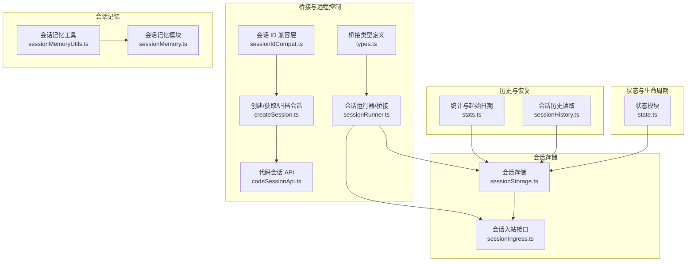
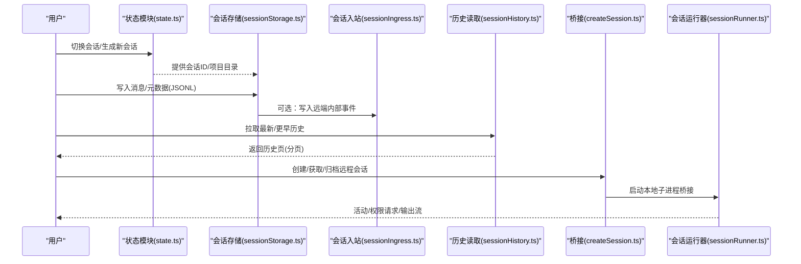
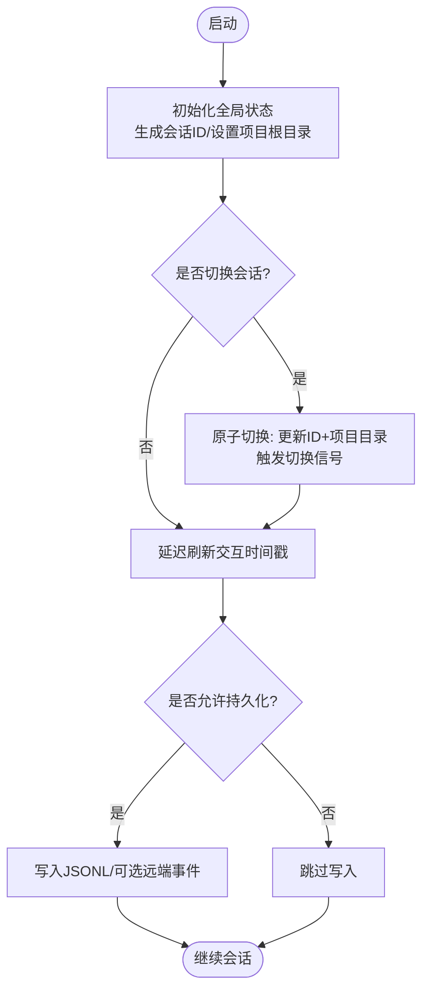
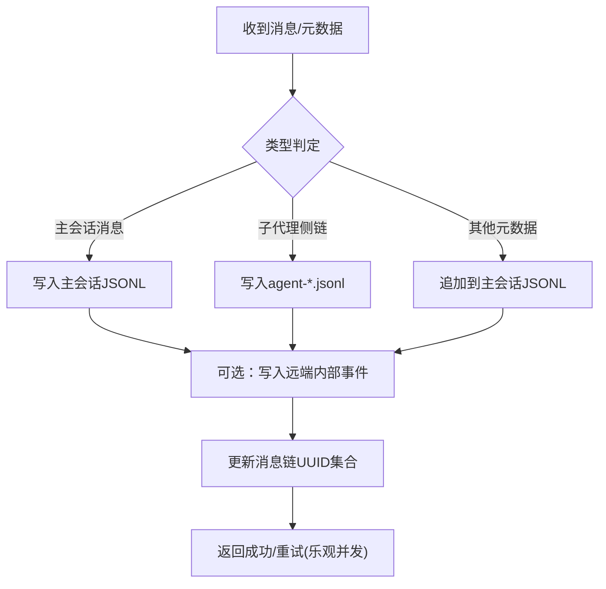
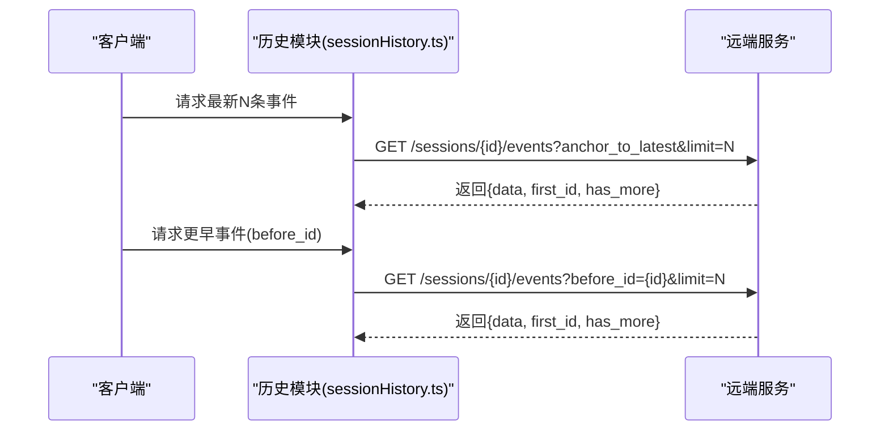
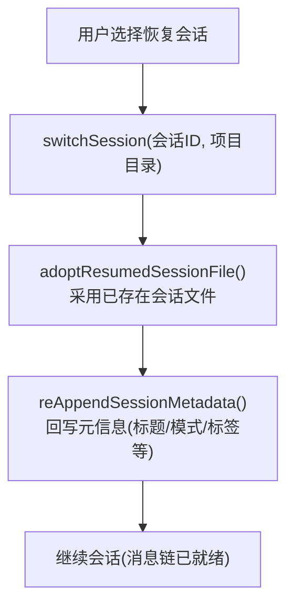
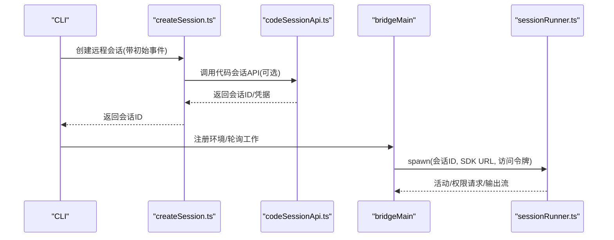
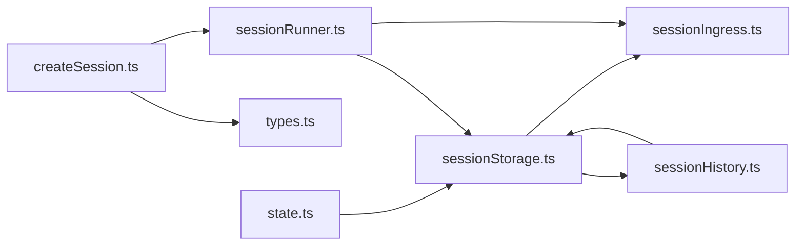

# 本地会话

<cite>
**本文引用的文件**
- [sessionStorage.ts](file://src/utils/sessionStorage.ts)
- [state.ts](file://src/bootstrap/state.ts)
- [sessionHistory.ts](file://src/assistant/sessionHistory.ts)
- [createSession.ts](file://src/bridge/createSession.ts)
- [codeSessionApi.ts](file://src/bridge/codeSessionApi.ts)
- [sessionRunner.ts](file://src/bridge/sessionRunner.ts)
- [sessionIdCompat.ts](file://src/bridge/sessionIdCompat.ts)
- [types.ts](file://src/bridge/types.ts)
- [sessionIngress.ts](file://src/services/api/sessionIngress.ts)
- [stats.ts](file://src/utils/stats.ts)
- [sessionMemoryUtils.ts](file://src/services/SessionMemory/sessionMemoryUtils.ts)
- [sessionMemory.ts](file://src/services/SessionMemory/sessionMemory.ts)
</cite>

## 目录
1. [简介](#简介)
2. [项目结构](#项目结构)
3. [核心组件](#核心组件)
4. [架构总览](#架构总览)
5. [详细组件分析](#详细组件分析)
6. [依赖关系分析](#依赖关系分析)
7. [性能考量](#性能考量)
8. [故障排查指南](#故障排查指南)
9. [结论](#结论)
10. [附录](#附录)

## 简介
本文件系统性阐述 Claude Code 的“本地会话”能力：从会话创建与切换、到本地存储格式与持久化策略、再到会话历史的读取与恢复机制。重点覆盖以下方面：
- 会话状态的初始化与维护（全局状态、会话标识、项目根目录等）
- 会话历史的本地存储格式（NDJSON 行式日志）与序列化/反序列化流程
- 会话状态的响应式更新机制（信号与订阅、状态变更传播）
- 会话恢复（从磁盘加载、标题与元信息恢复、链式消息重建）
- 本地会话的配置项与性能优化建议
- 实际使用场景与操作示例

## 项目结构
围绕本地会话的关键模块与职责如下：
- 会话状态与生命周期：在引导阶段初始化全局状态，提供会话 ID、项目根目录、工作目录等；支持会话切换与父会话追踪
- 会话存储与写入：统一的 JSONL（NDJSON）会话文件，按类型分发写入（主会话、子代理侧链、远程事件）
- 会话历史读取：支持分页拉取远端历史，或从本地文件解析
- 会话桥接与远程控制：创建/获取/归档远程会话，桥接本地进程与远端运行器
- 会话内存与统计：会话记忆内容读取、会话统计数据计算（起始日期、活跃度等）

图表来源
- [state.ts:1-800](file://src/bootstrap/state.ts#L1-L800)
- [sessionStorage.ts:1-300](file://src/utils/sessionStorage.ts#L1-L300)
- [sessionIngress.ts:77-229](file://src/services/api/sessionIngress.ts#L77-L229)
- [sessionHistory.ts:1-88](file://src/assistant/sessionHistory.ts#L1-L88)
- [stats.ts:979-1062](file://src/utils/stats.ts#L979-L1062)
- [createSession.ts:1-385](file://src/bridge/createSession.ts#L1-L385)
- [codeSessionApi.ts:1-169](file://src/bridge/codeSessionApi.ts#L1-L169)
- [sessionRunner.ts:1-551](file://src/bridge/sessionRunner.ts#L1-L551)
- [sessionIdCompat.ts:1-58](file://src/bridge/sessionIdCompat.ts#L1-L58)
- [types.ts:1-263](file://src/bridge/types.ts#L1-L263)
- [sessionMemoryUtils.ts:85-138](file://src/services/SessionMemory/sessionMemoryUtils.ts#L85-L138)
- [sessionMemory.ts:64-99](file://src/services/SessionMemory/sessionMemory.ts#L64-L99)

章节来源
- [state.ts:1-800](file://src/bootstrap/state.ts#L1-L800)
- [sessionStorage.ts:1-300](file://src/utils/sessionStorage.ts#L1-L300)

## 核心组件
- 全局状态与会话标识
  - 初始化会话 ID、项目根目录、工作目录、交互时间戳等
  - 提供会话切换、父会话追踪、持久化开关等能力
- 会话存储与写入
  - 统一的 .jsonl 文件，按条目类型分发到主会话或子代理侧链
  - 支持乐观并发（基于最后 UUID 头部）与顺序写入队列
  - 远程事件写入（内部事件）与本地文件写入双通道
- 会话历史读取
  - 本地：解析 JSONL，构建消息链，支持摘要、标签、PR 信息等元数据
  - 远端：分页拉取事件，支持锚点到最新与游标翻页
- 桥接与远程控制
  - 创建/获取/归档远程会话，兼容 v1/v2 ID 标签
  - 本地子进程桥接，NDJSON 流解析，活动与权限请求上报
- 会话记忆与统计
  - 会话记忆内容读取与等待提取完成
  - 会话起始日期快速探测（小范围头部扫描）

章节来源
- [state.ts:431-498](file://src/bootstrap/state.ts#L431-L498)
- [sessionStorage.ts:1209-1323](file://src/utils/sessionStorage.ts#L1209-L1323)
- [sessionIngress.ts:193-229](file://src/services/api/sessionIngress.ts#L193-L229)
- [sessionHistory.ts:73-87](file://src/assistant/sessionHistory.ts#L73-L87)
- [createSession.ts:34-180](file://src/bridge/createSession.ts#L34-L180)
- [sessionIdCompat.ts:38-57](file://src/bridge/sessionIdCompat.ts#L38-L57)
- [sessionRunner.ts:248-547](file://src/bridge/sessionRunner.ts#L248-L547)
- [sessionMemoryUtils.ts:85-138](file://src/services/SessionMemory/sessionMemoryUtils.ts#L85-L138)
- [stats.ts:994-1036](file://src/utils/stats.ts#L994-L1036)

## 架构总览
本地会话的端到端流程包括：创建/切换会话、写入本地 JSONL、必要时写入远端、读取历史、恢复会话。

图表来源
- [state.ts:468-498](file://src/bootstrap/state.ts#L468-L498)
- [sessionStorage.ts:1209-1323](file://src/utils/sessionStorage.ts#L1209-L1323)
- [sessionIngress.ts:193-229](file://src/services/api/sessionIngress.ts#L193-L229)
- [sessionHistory.ts:73-87](file://src/assistant/sessionHistory.ts#L73-L87)
- [createSession.ts:34-180](file://src/bridge/createSession.ts#L34-L180)
- [sessionRunner.ts:248-547](file://src/bridge/sessionRunner.ts#L248-L547)

## 详细组件分析

### 会话状态与生命周期
- 初始化与会话标识
  - 会话 ID 由随机 UUID 生成；项目根目录稳定不变，避免工作树切换影响历史/技能锚定
  - 提供会话切换函数，原子地更新会话 ID 与项目目录，并发出切换信号
- 交互时间与统计
  - 延迟刷新交互时间戳，减少高频按键带来的开销
  - 提供模型用量、工具耗时、分类器耗时等统计聚合入口
- 持久化控制
  - 支持禁用会话持久化的标志位，用于测试或特定环境

图表来源
- [state.ts:260-426](file://src/bootstrap/state.ts#L260-L426)
- [state.ts:468-498](file://src/bootstrap/state.ts#L468-L498)
- [state.ts:667-689](file://src/bootstrap/state.ts#L667-L689)
- [state.ts:953-970](file://src/utils/sessionStorage.ts#L953-L970)

章节来源
- [state.ts:260-426](file://src/bootstrap/state.ts#L260-L426)
- [state.ts:468-498](file://src/bootstrap/state.ts#L468-L498)
- [state.ts:667-689](file://src/bootstrap/state.ts#L667-L689)
- [sessionStorage.ts:953-970](file://src/utils/sessionStorage.ts#L953-L970)

### 会话存储与写入（JSONL）
- 存储位置与命名
  - 会话文件位于项目目录下，以会话 ID 命名的 .jsonl 文件
  - 子代理侧链文件位于同一会话目录下的子目录，便于隔离与恢复
- 写入策略
  - 主文件权威：消息链 UUID 集合维护在主文件，确保侧链条目不会重复写入主文件
  - 顺序写入：每个会话维护一个串行队列，保证并发写入的顺序一致性
  - 乐观并发：基于 Last-Uuid 头部进行冲突检测与恢复
  - 远端事件：当存在内部事件写入器时，优先写入远端内部事件
- 读取与恢复
  - 解析 JSONL，构建消息链、摘要、标签、PR 信息等映射
  - 快速探测会话起始日期，避免全量扫描

图表来源
- [sessionStorage.ts:1209-1265](file://src/utils/sessionStorage.ts#L1209-L1265)
- [sessionStorage.ts:1271-1323](file://src/utils/sessionStorage.ts#L1271-L1323)
- [sessionIngress.ts:193-229](file://src/services/api/sessionIngress.ts#L193-L229)

章节来源
- [sessionStorage.ts:202-225](file://src/utils/sessionStorage.ts#L202-L225)
- [sessionStorage.ts:1209-1265](file://src/utils/sessionStorage.ts#L1209-L1265)
- [sessionStorage.ts:1271-1323](file://src/utils/sessionStorage.ts#L1271-L1323)
- [sessionIngress.ts:193-229](file://src/services/api/sessionIngress.ts#L193-L229)

### 会话历史读取与分页
- 本地历史
  - 通过解析 JSONL，构建消息链与元数据映射，支持摘要、标签、PR 信息等
- 远端历史
  - 通过锚点到最新或基于 before_id 游标翻页，分页大小固定
  - 返回事件列表、first_id、has_more 等字段，便于客户端增量加载

图表来源
- [sessionHistory.ts:73-87](file://src/assistant/sessionHistory.ts#L73-L87)

章节来源
- [sessionHistory.ts:73-87](file://src/assistant/sessionHistory.ts#L73-L87)

### 会话恢复机制
- 采用“非派生”方式恢复：在切换会话后直接采用已存在的会话文件，避免孤儿文件产生
- 在恢复后立即采用现有文件指针，确保退出清理阶段能正确回写元信息（如自定义标题）
- 会话元信息（标题、模式、标签、代理设置等）从文件尾部缓存，避免重复读取

图表来源
- [state.ts:468-498](file://src/bootstrap/state.ts#L468-L498)
- [sessionStorage.ts:1530-1534](file://src/utils/sessionStorage.ts#L1530-L1534)

章节来源
- [state.ts:468-498](file://src/bootstrap/state.ts#L468-L498)
- [sessionStorage.ts:1530-1534](file://src/utils/sessionStorage.ts#L1530-L1534)

### 会话桥接与远程控制
- 会话创建/获取/归档
  - 创建远程会话，携带事件与上下文（模型、来源、权限模式等）
  - 获取会话信息（环境 ID、标题），用于 UI 展示与恢复
  - 归档会话，避免资源泄漏
- ID 兼容
  - v1/v2 标签互转（session_* 与 cse_*），兼容旧版/新版 API
- 本地运行器
  - 子进程桥接，NDJSON 输出解析，活动与权限请求上报，stderr 捕获与诊断

图表来源
- [createSession.ts:34-180](file://src/bridge/createSession.ts#L34-L180)
- [codeSessionApi.ts:26-80](file://src/bridge/codeSessionApi.ts#L26-L80)
- [sessionIdCompat.ts:38-57](file://src/bridge/sessionIdCompat.ts#L38-L57)
- [sessionRunner.ts:248-547](file://src/bridge/sessionRunner.ts#L248-L547)

章节来源
- [createSession.ts:34-180](file://src/bridge/createSession.ts#L34-L180)
- [codeSessionApi.ts:26-80](file://src/bridge/codeSessionApi.ts#L26-L80)
- [sessionIdCompat.ts:38-57](file://src/bridge/sessionIdCompat.ts#L38-L57)
- [sessionRunner.ts:248-547](file://src/bridge/sessionRunner.ts#L248-L547)

### 会话记忆与统计数据
- 会话记忆
  - 等待提取完成（超时/陈旧阈值控制），读取当前会话记忆内容
  - 动态配置（特性门控、远程配置缓存）
- 统计数据
  - 会话起始日期快速探测（仅扫描头部 4KB，逐行解析 JSON）
  - 统计提示次数、内存访问次数等指标

章节来源
- [sessionMemoryUtils.ts:85-138](file://src/services/SessionMemory/sessionMemoryUtils.ts#L85-L138)
- [sessionMemory.ts:64-99](file://src/services/SessionMemory/sessionMemory.ts#L64-L99)
- [stats.ts:994-1036](file://src/utils/stats.ts#L994-L1036)

## 依赖关系分析
- 状态模块对会话存储的依赖
  - 会话 ID、项目目录、持久化开关等状态直接影响存储路径与写入行为
- 会话存储对入站接口的依赖
  - 当存在内部事件写入器时，优先写入远端内部事件，否则回退到本地文件
- 历史读取对网络与存储的依赖
  - 本地解析 JSONL 与远端分页拉取并存，提升可用性与离线能力
- 桥接模块对运行器与类型定义的依赖
  - 通过类型约束与运行器实现，确保子进程生命周期与输出解析一致

图表来源
- [state.ts:431-498](file://src/bootstrap/state.ts#L431-L498)
- [sessionStorage.ts:1209-1323](file://src/utils/sessionStorage.ts#L1209-L1323)
- [sessionIngress.ts:193-229](file://src/services/api/sessionIngress.ts#L193-L229)
- [sessionHistory.ts:73-87](file://src/assistant/sessionHistory.ts#L73-L87)
- [createSession.ts:34-180](file://src/bridge/createSession.ts#L34-L180)
- [types.ts:178-211](file://src/bridge/types.ts#L178-L211)
- [sessionRunner.ts:248-547](file://src/bridge/sessionRunner.ts#L248-L547)

章节来源
- [state.ts:431-498](file://src/bootstrap/state.ts#L431-L498)
- [sessionStorage.ts:1209-1323](file://src/utils/sessionStorage.ts#L1209-L1323)
- [sessionIngress.ts:193-229](file://src/services/api/sessionIngress.ts#L193-L229)
- [sessionHistory.ts:73-87](file://src/assistant/sessionHistory.ts#L73-L87)
- [createSession.ts:34-180](file://src/bridge/createSession.ts#L34-L180)
- [types.ts:178-211](file://src/bridge/types.ts#L178-L211)
- [sessionRunner.ts:248-547](file://src/bridge/sessionRunner.ts#L248-L547)

## 性能考量
- 写入性能
  - 顺序写入队列避免竞态，乐观并发减少冲突重试
  - 大文件读取限制（最大 50MB）防止 OOM，必要时采用分段读取
- 读取性能
  - 会话起始日期快速探测（4KB 头部扫描），避免全量解析
  - 分页拉取历史，降低单次网络与解析压力
- 资源占用
  - 子进程桥接时，stderr 缓冲与活动环形缓冲限制内存占用
  - 会话记忆提取等待机制，避免长时间阻塞

章节来源
- [sessionStorage.ts:227-229](file://src/utils/sessionStorage.ts#L227-L229)
- [stats.ts:994-1036](file://src/utils/stats.ts#L994-L1036)
- [sessionRunner.ts:16-17](file://src/bridge/sessionRunner.ts#L16-L17)
- [sessionMemoryUtils.ts:85-105](file://src/services/SessionMemory/sessionMemoryUtils.ts#L85-L105)

## 故障排查指南
- 写入失败与并发冲突
  - 乐观并发冲突：检查 Last-Uuid 头部，自动重试并采用服务器 UUID
  - 令牌失效：重新获取会话令牌后重试
  - 网络错误/5xx：指数退避重试，超过最大重试次数后记录诊断
- 读取异常
  - JSONL 解析失败：检查文件完整性与编码
  - 历史拉取失败：确认会话 ID、权限与网络连通性
- 恢复问题
  - 标题未更新：确认 adoptResumedSessionFile 后是否调用回写元信息
  - 侧链消息缺失：检查侧链文件是否存在以及消息链 UUID 集合是否正确

章节来源
- [sessionIngress.ts:77-186](file://src/services/api/sessionIngress.ts#L77-L186)
- [sessionStorage.ts:1530-1534](file://src/utils/sessionStorage.ts#L1530-L1534)

## 结论
本地会话通过统一的状态管理、可靠的 JSONL 存储与远端事件写入、灵活的历史读取与恢复机制，实现了高可用、可扩展且易于调试的会话体验。配合桥接与远程控制能力，既满足本地开发场景，也能无缝对接云端运行器。

## 附录
- 使用场景示例
  - 新建空会话：生成新会话 ID，开始本地对话
  - 恢复会话：选择历史会话文件，切换会话并采用现有文件
  - 远程会话：创建远程会话，桥接本地子进程，实时查看活动与权限请求
- 配置选项（节选）
  - 会话持久化开关：禁用持久化用于测试或临时会话
  - 会话超时：默认 24 小时，超时自动终止
  - 会话记忆：特性门控与远程配置缓存，动态生效

章节来源
- [state.ts:953-970](file://src/utils/sessionStorage.ts#L953-L970)
- [types.ts:1-12](file://src/bridge/types.ts#L1-L12)
- [sessionMemory.ts:64-99](file://src/services/SessionMemory/sessionMemory.ts#L64-L99)