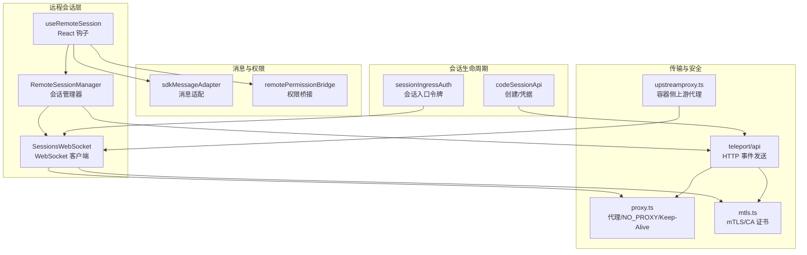
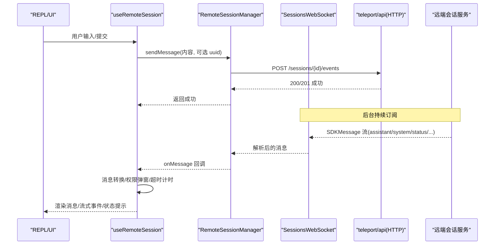
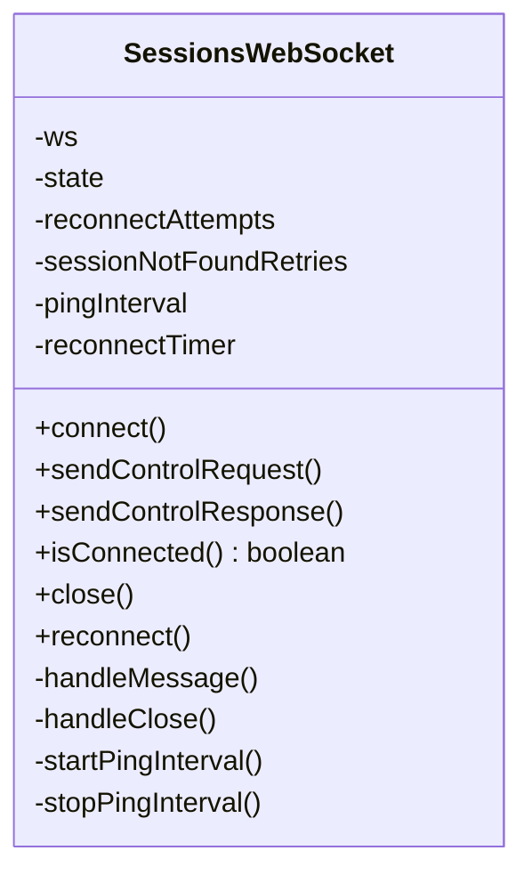
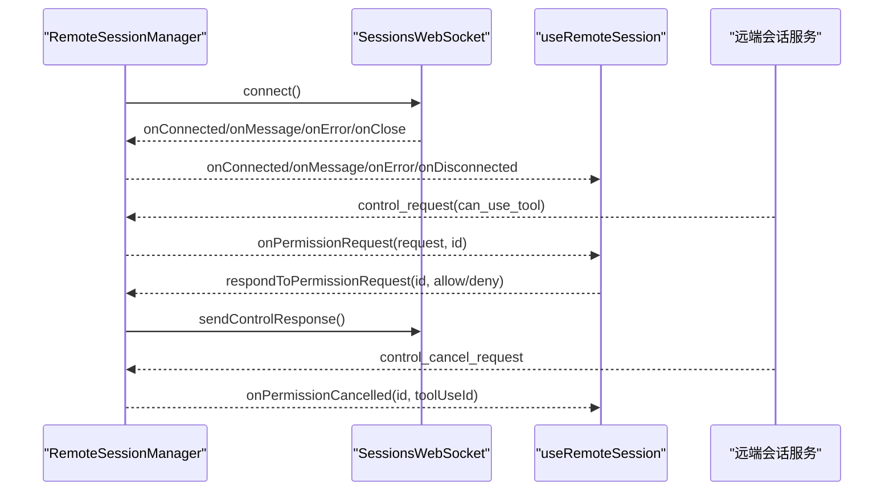
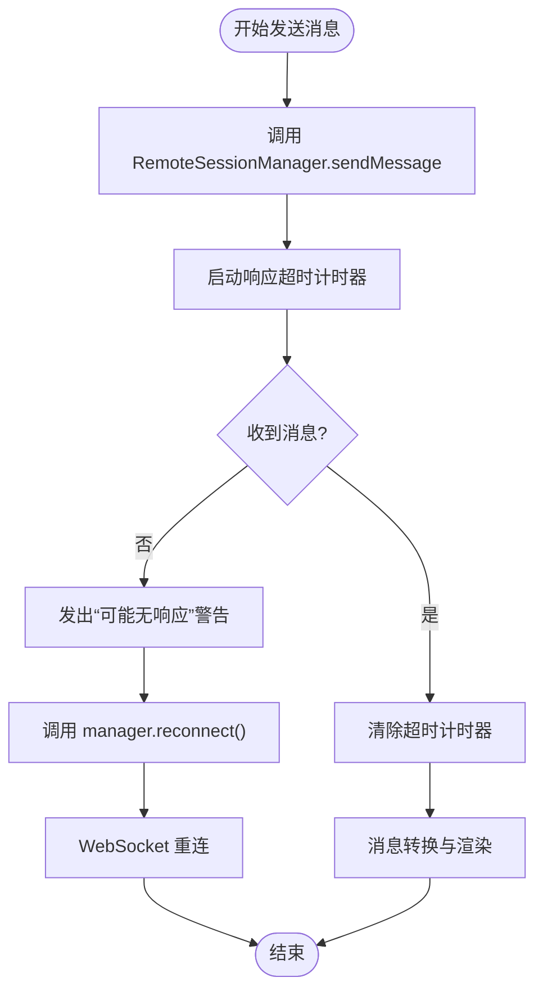
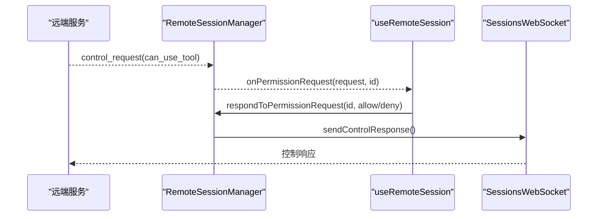
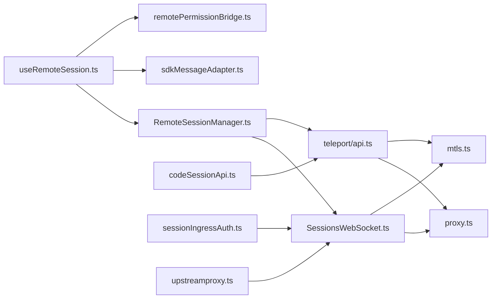

# 远程会话

<cite>
**本文引用的文件**
- [SessionsWebSocket.ts](file://src/remote/SessionsWebSocket.ts)
- [RemoteSessionManager.ts](file://src/remote/RemoteSessionManager.ts)
- [useRemoteSession.ts](file://src/hooks/useRemoteSession.ts)
- [sdkMessageAdapter.ts](file://src/remote/sdkMessageAdapter.ts)
- [remotePermissionBridge.ts](file://src/remote/remotePermissionBridge.ts)
- [api.ts](file://src/utils/teleport/api.ts)
- [proxy.ts](file://src/utils/proxy.ts)
- [mtls.ts](file://src/utils/mtls.ts)
- [upstreamproxy.ts](file://src/upstreamproxy/upstreamproxy.ts)
- [codeSessionApi.ts](file://src/bridge/codeSessionApi.ts)
- [sessionIngressAuth.ts](file://src/utils/sessionIngressAuth.ts)
</cite>

## 目录
1. [简介](#简介)
2. [项目结构](#项目结构)
3. [核心组件](#核心组件)
4. [架构总览](#架构总览)
5. [详细组件分析](#详细组件分析)
6. [依赖关系分析](#依赖关系分析)
7. [性能考量](#性能考量)
8. [故障排查指南](#故障排查指南)
9. [结论](#结论)
10. [附录](#附录)

## 简介
本文件系统化阐述 Claude Code 的“远程会话”能力，覆盖从连接建立、认证与授权、消息协议与传输、状态同步、断线重连与错误处理、安全（加密与鉴权）、到配置与网络优化以及典型使用场景与排障实践。目标是帮助开发者与使用者全面理解并高效使用远程会话功能。

## 项目结构
远程会话相关代码主要分布在以下模块：
- 远程连接层：WebSocket 客户端封装与重连逻辑
- 会话管理器：协调 WebSocket 与 HTTP 事件发送、权限请求响应
- React 钩子：在 REPL 中集成远程会话，处理消息转换、权限弹窗、超时与重连
- 消息适配器：将 SDK 消息转换为 REPL 内部消息类型
- 权限桥接：在远程模式下生成合成消息与工具桩
- 传输与安全：HTTP 事件发送、代理与 mTLS 配置、上游代理
- 会话凭证：远程会话凭据获取与会话创建

图表来源
- [SessionsWebSocket.ts:82-205](file://src/remote/SessionsWebSocket.ts#L82-L205)
- [RemoteSessionManager.ts:95-141](file://src/remote/RemoteSessionManager.ts#L95-L141)
- [useRemoteSession.ts:76-470](file://src/hooks/useRemoteSession.ts#L76-L470)
- [sdkMessageAdapter.ts:27-168](file://src/remote/sdkMessageAdapter.ts#L27-L168)
- [remotePermissionBridge.ts:7-46](file://src/remote/remotePermissionBridge.ts#L7-L46)
- [api.ts:361-417](file://src/utils/teleport/api.ts#L361-L417)
- [proxy.ts:198-275](file://src/utils/proxy.ts#L198-L275)
- [mtls.ts:23-112](file://src/utils/mtls.ts#L23-L112)
- [upstreamproxy.ts:79-199](file://src/upstreamproxy/upstreamproxy.ts#L79-L199)
- [codeSessionApi.ts:26-80](file://src/bridge/codeSessionApi.ts#L26-L80)
- [sessionIngressAuth.ts:101-110](file://src/utils/sessionIngressAuth.ts#L101-L110)

章节来源
- [SessionsWebSocket.ts:82-205](file://src/remote/SessionsWebSocket.ts#L82-L205)
- [RemoteSessionManager.ts:95-141](file://src/remote/RemoteSessionManager.ts#L95-L141)
- [useRemoteSession.ts:76-470](file://src/hooks/useRemoteSession.ts#L76-L470)
- [api.ts:361-417](file://src/utils/teleport/api.ts#L361-L417)

## 核心组件
- SessionsWebSocket：封装 WebSocket 连接、认证头注入、消息解析、心跳与断线重连。
- RemoteSessionManager：协调 WebSocket 订阅、HTTP 事件发送、权限请求/取消/响应。
- useRemoteSession：在 REPL 中集成远程会话，负责消息转换、权限弹窗、超时检测与自动重连。
- sdkMessageAdapter：将 SDK 消息转换为 REPL 内部消息类型，支持流式事件与状态消息。
- remotePermissionBridge：在远程模式下生成合成助手消息与工具桩，以驱动本地权限 UI。
- teleport/api：HTTP 事件发送、会话标题更新、会话查询等；含指数退避重试。
- proxy/mtls：统一代理与 mTLS 配置，支持 NO_PROXY、Keep-Alive、容器侧上游代理。
- codeSessionApi：创建远程会话、获取远程凭据（worker_jwt、api_base_url、过期时间）。
- sessionIngressAuth：会话入口访问令牌来源优先级与读取。

章节来源
- [SessionsWebSocket.ts:82-205](file://src/remote/SessionsWebSocket.ts#L82-L205)
- [RemoteSessionManager.ts:95-141](file://src/remote/RemoteSessionManager.ts#L95-L141)
- [useRemoteSession.ts:76-470](file://src/hooks/useRemoteSession.ts#L76-L470)
- [sdkMessageAdapter.ts:27-168](file://src/remote/sdkMessageAdapter.ts#L27-L168)
- [remotePermissionBridge.ts:7-46](file://src/remote/remotePermissionBridge.ts#L7-L46)
- [api.ts:361-417](file://src/utils/teleport/api.ts#L361-L417)
- [proxy.ts:198-275](file://src/utils/proxy.ts#L198-L275)
- [mtls.ts:23-112](file://src/utils/mtls.ts#L23-L112)
- [codeSessionApi.ts:26-80](file://src/bridge/codeSessionApi.ts#L26-L80)
- [sessionIngressAuth.ts:101-110](file://src/utils/sessionIngressAuth.ts#L101-L110)

## 架构总览
远程会话采用“WebSocket 订阅 + HTTP 事件推送”的双通道设计：
- WebSocket：用于实时接收 SDK 消息（含流式事件、系统状态、工具进度、结果等），并支持控制请求/响应（如中断、权限确认）。
- HTTP：用于向会话发送用户事件（消息内容可为字符串或内容块数组），并支持会话标题更新等操作。

图表来源
- [useRemoteSession.ts:472-566](file://src/hooks/useRemoteSession.ts#L472-L566)
- [RemoteSessionManager.ts:219-242](file://src/remote/RemoteSessionManager.ts#L219-L242)
- [api.ts:361-417](file://src/utils/teleport/api.ts#L361-L417)
- [sdkMessageAdapter.ts:168-278](file://src/remote/sdkMessageAdapter.ts#L168-L278)

## 详细组件分析

### SessionsWebSocket：连接、认证与消息处理
- 连接建立
  - 使用 OAuth 访问令牌作为 Authorization 头，按平台差异分别通过浏览器原生 WebSocket 或 ws 包建立连接，并注入代理与 mTLS 参数。
  - 认证方式：通过请求头携带 Bearer 令牌，无需额外握手消息。
- 心跳与保活
  - 周期性发送 ping，收到 pong 即视为连接健康。
- 消息处理
  - 将收到的字符串消息解析为 JSON，校验具备 type 字段后转发给回调；未知类型静默忽略，避免因后端新增消息类型导致崩溃。
- 关闭与重连
  - 对永久关闭码（如 4003 未授权）直接停止重连。
  - 对 4001（会话不存在）进行有限次重试，避免压缩期间短暂不可用导致误判。
  - 其他瞬时断开按固定次数与延迟重连，支持强制重连以刷新过期订阅。
- 控制消息
  - 支持发送控制请求（如中断）与控制响应（权限决策）。

图表来源
- [SessionsWebSocket.ts:82-205](file://src/remote/SessionsWebSocket.ts#L82-L205)
- [SessionsWebSocket.ts:234-288](file://src/remote/SessionsWebSocket.ts#L234-L288)
- [SessionsWebSocket.ts:328-357](file://src/remote/SessionsWebSocket.ts#L328-L357)

章节来源
- [SessionsWebSocket.ts:82-205](file://src/remote/SessionsWebSocket.ts#L82-L205)
- [SessionsWebSocket.ts:234-288](file://src/remote/SessionsWebSocket.ts#L234-L288)
- [SessionsWebSocket.ts:328-357](file://src/remote/SessionsWebSocket.ts#L328-L357)

### RemoteSessionManager：会话协调与权限
- 职责
  - 维护 SessionsWebSocket 实例，转发消息与回调。
  - 通过 HTTP 将用户事件投递到远端会话。
  - 处理权限请求（can_use_tool）：缓存待决请求，触发 UI 弹窗，等待用户决策后发送控制响应。
  - 处理权限取消（control_cancel_request）：清理待决队列并通知 UI。
  - 提供中断信号（control_request: interrupt）以取消当前请求。
- 状态查询与断开
  - 提供 isConnected、disconnect、reconnect 等接口。

图表来源
- [RemoteSessionManager.ts:108-141](file://src/remote/RemoteSessionManager.ts#L108-L141)
- [RemoteSessionManager.ts:146-214](file://src/remote/RemoteSessionManager.ts#L146-L214)
- [RemoteSessionManager.ts:247-282](file://src/remote/RemoteSessionManager.ts#L247-L282)

章节来源
- [RemoteSessionManager.ts:95-141](file://src/remote/RemoteSessionManager.ts#L95-L141)
- [RemoteSessionManager.ts:146-214](file://src/remote/RemoteSessionManager.ts#L146-L214)
- [RemoteSessionManager.ts:247-282](file://src/remote/RemoteSessionManager.ts#L247-L282)

### useRemoteSession：REPL 集成与状态同步
- 连接与回连
  - 初始化 RemoteSessionManager 并注册 onMessage/onConnected/onReconnecting/onDisconnected/onError 回调。
  - 在 onReconnecting 与 onDisconnected 时清空任务计数与 in-progress 工具集，避免状态漂移。
- 消息转换与渲染
  - 使用 sdkMessageAdapter 将 SDK 消息转换为 REPL 内部消息；支持流式事件与系统状态消息。
  - 在 viewerOnly 模式下，将工具结果转换为用户消息以便渲染。
- 权限弹窗
  - 通过 remotePermissionBridge 生成合成助手消息与工具桩，驱动本地权限确认 UI。
- 超时与自动重连
  - 发送消息后启动定时器；若长时间无响应，在非 viewerOnly 模式下发出警告并尝试 WebSocket 重连。
  - 在压缩期间（compaction）延长超时阈值，避免误判。
- 会话标题
  - 首条消息到达后（无初始提示且非 viewerOnly），根据内容生成标题并调用 HTTP 接口更新。

图表来源
- [useRemoteSession.ts:472-566](file://src/hooks/useRemoteSession.ts#L472-L566)
- [useRemoteSession.ts:538-561](file://src/hooks/useRemoteSession.ts#L538-L561)

章节来源
- [useRemoteSession.ts:76-470](file://src/hooks/useRemoteSession.ts#L76-L470)
- [useRemoteSession.ts:472-566](file://src/hooks/useRemoteSession.ts#L472-L566)

### 消息协议与数据模型
- 消息类型
  - SDKMessage：assistant、user、system、result、tool_progress、stream_event 等。
  - 控制消息：control_request（如 interrupt、can_use_tool）、control_response（success/error/deny/allow）、control_cancel_request。
- 消息格式
  - 所有消息均为 JSON，具备字符串类型的 type 字段；SDKMessage 的 message 字段遵循 Anthropic API 消息规范（内容块数组）。
- 传输协议
  - WebSocket：订阅 /v1/sessions/ws/{id}/subscribe，认证头中包含 Authorization 与版本号。
  - HTTP：POST /v1/sessions/{id}/events 发送用户事件；PATCH /v1/sessions/{id} 更新标题。

章节来源
- [SessionsWebSocket.ts:40-55](file://src/remote/SessionsWebSocket.ts#L40-L55)
- [sdkMessageAdapter.ts:168-278](file://src/remote/sdkMessageAdapter.ts#L168-L278)
- [api.ts:349-417](file://src/utils/teleport/api.ts#L349-L417)

### 权限请求与响应流程
- 权限请求
  - 远端服务通过 control_request(can_use_tool) 触发权限弹窗；本地缓存请求 ID 与请求体。
- 用户决策
  - 允许：返回 allow 并附带更新后的输入；拒绝：返回 deny 并附带反馈信息。
- 取消与错误
  - 支持 control_cancel_request 清理待决请求；未知 subtype 自动返回 error 防止挂起。

图表来源
- [RemoteSessionManager.ts:189-214](file://src/remote/RemoteSessionManager.ts#L189-L214)
- [RemoteSessionManager.ts:247-282](file://src/remote/RemoteSessionManager.ts#L247-L282)
- [remotePermissionBridge.ts:12-46](file://src/remote/remotePermissionBridge.ts#L12-L46)

章节来源
- [RemoteSessionManager.ts:189-214](file://src/remote/RemoteSessionManager.ts#L189-L214)
- [RemoteSessionManager.ts:247-282](file://src/remote/RemoteSessionManager.ts#L247-L282)
- [remotePermissionBridge.ts:12-46](file://src/remote/remotePermissionBridge.ts#L12-L46)

### 断线重连策略与错误处理
- 重连参数
  - 初始延迟 2 秒，最大重连次数 5 次；4001（会话不存在）最多重试 3 次。
- 关闭码策略
  - 4003（未授权）为永久关闭码，不重连；其他瞬时错误在连接态断开时按次数与延迟重连。
- 强制重连
  - 当订阅可能过期（如容器重启）时，调用 reconnect() 以立即关闭并重新连接。
- 错误上报
  - WebSocket 错误与解析失败均记录日志并通过回调上抛。

章节来源
- [SessionsWebSocket.ts:17-36](file://src/remote/SessionsWebSocket.ts#L17-L36)
- [SessionsWebSocket.ts:234-288](file://src/remote/SessionsWebSocket.ts#L234-L288)
- [SessionsWebSocket.ts:393-403](file://src/remote/SessionsWebSocket.ts#L393-L403)

### 安全与认证
- 认证
  - WebSocket 通过 Authorization 头（Bearer 令牌）认证；HTTP 事件发送同样使用 OAuth 头。
  - 会话入口访问令牌可通过环境变量或文件描述符读取，优先级明确。
- 加密与信任
  - 支持 mTLS 客户端证书与私钥，以及自定义 CA 证书链；在代理与直连场景均生效。
  - 代理与 NO_PROXY 配置统一由 proxy.ts 管理，确保合规绕过与安全传输。
- 上游代理（容器侧）
  - 在 CCR 容器内可启用上游代理，下载 CA 证书并注入环境变量，使子进程信任代理链路。

章节来源
- [SessionsWebSocket.ts:113-118](file://src/remote/SessionsWebSocket.ts#L113-L118)
- [api.ts:276-282](file://src/utils/teleport/api.ts#L276-L282)
- [sessionIngressAuth.ts:101-110](file://src/utils/sessionIngressAuth.ts#L101-L110)
- [mtls.ts:23-112](file://src/utils/mtls.ts#L23-L112)
- [proxy.ts:198-275](file://src/utils/proxy.ts#L198-L275)
- [upstreamproxy.ts:79-199](file://src/upstreamproxy/upstreamproxy.ts#L79-L199)

### 配置选项与网络优化
- 代理与 NO_PROXY
  - 自动识别 https_proxy/http_proxy 与 NO_PROXY；支持端口特定匹配与域名后缀匹配。
  - 通过 EnvHttpProxyAgent 与 Axios 拦截器实现全局与实例级代理配置。
- mTLS 与 CA 证书
  - 支持从环境变量加载客户端证书/私钥/口令，以及附加 CA 证书；memoized 缓存提升性能。
- Keep-Alive 与连接池
  - 在代理与 mTLS 场景下，禁用 keep-alive 以规避陈旧连接池导致的 ECONNRESET。
- 会话凭据
  - 通过 /v1/code/sessions/{id}/bridge 获取 worker_jwt、api_base_url、过期时间等，用于后续会话交互。

章节来源
- [proxy.ts:64-129](file://src/utils/proxy.ts#L64-L129)
- [proxy.ts:198-275](file://src/utils/proxy.ts#L198-L275)
- [mtls.ts:23-112](file://src/utils/mtls.ts#L23-L112)
- [codeSessionApi.ts:93-168](file://src/bridge/codeSessionApi.ts#L93-L168)

## 依赖关系分析

图表来源
- [SessionsWebSocket.ts:1-16](file://src/remote/SessionsWebSocket.ts#L1-L16)
- [proxy.ts:1-11](file://src/utils/proxy.ts#L1-L11)
- [mtls.ts:1-8](file://src/utils/mtls.ts#L1-L8)
- [RemoteSessionManager.ts:1-17](file://src/remote/RemoteSessionManager.ts#L1-L17)
- [api.ts:1-13](file://src/utils/teleport/api.ts#L1-L13)
- [useRemoteSession.ts:1-34](file://src/hooks/useRemoteSession.ts#L1-L34)
- [sdkMessageAdapter.ts:1-20](file://src/remote/sdkMessageAdapter.ts#L1-L20)
- [remotePermissionBridge.ts:1-5](file://src/remote/remotePermissionBridge.ts#L1-L5)
- [codeSessionApi.ts:1-14](file://src/bridge/codeSessionApi.ts#L1-L14)
- [sessionIngressAuth.ts:1-11](file://src/utils/sessionIngressAuth.ts#L1-L11)
- [upstreamproxy.ts:1-20](file://src/upstreamproxy/upstreamproxy.ts#L1-L20)

章节来源
- [SessionsWebSocket.ts:1-16](file://src/remote/SessionsWebSocket.ts#L1-L16)
- [RemoteSessionManager.ts:1-17](file://src/remote/RemoteSessionManager.ts#L1-L17)
- [useRemoteSession.ts:1-34](file://src/hooks/useRemoteSession.ts#L1-L34)
- [api.ts:1-14](file://src/utils/teleport/api.ts#L1-L14)

## 性能考量
- 重试与退避
  - HTTP 事件发送采用指数退避（2s、4s、8s、16s）四次重试，降低瞬时网络波动影响。
- 心跳与保活
  - WebSocket 定期 ping/pong，结合代理与 mTLS 的连接复用策略，减少握手开销。
- 缓存与懒加载
  - mTLS 与代理配置使用 memoized 缓存；代理 Agent 按需懒加载，避免冷启动成本。
- 超时与去抖
  - 非 viewerOnly 模式下，响应超时触发重连；viewerOnly 模式下延长超时以适应远端空闲重启。
- Echo 过滤
  - 使用有界环形集合过滤本地已发送消息的回显，避免重复渲染与内存增长。

章节来源
- [api.ts:15-81](file://src/utils/teleport/api.ts#L15-L81)
- [SessionsWebSocket.ts:301-323](file://src/remote/SessionsWebSocket.ts#L301-L323)
- [mtls.ts:157-161](file://src/utils/mtls.ts#L157-L161)
- [proxy.ts:198-237](file://src/utils/proxy.ts#L198-L237)
- [useRemoteSession.ts:538-561](file://src/hooks/useRemoteSession.ts#L538-L561)
- [useRemoteSession.ts:137-138](file://src/hooks/useRemoteSession.ts#L137-L138)

## 故障排查指南
- WebSocket 无法连接
  - 检查代理与 NO_PROXY 设置是否正确；确认 mTLS 证书路径与权限。
  - 查看日志中的关闭码：4003 表示未授权，需刷新令牌；4001 表示会话不存在，等待短暂恢复。
- 消息不显示或重复
  - 确认 echo 过滤是否生效（sentUUIDsRef 是否正确填充）；检查 convertSDKMessage 的用户消息转换开关。
- 权限弹窗不出现
  - 确认远端服务确发出了 control_request(can_use_tool)；检查 onPermissionRequest 回调是否被触发。
- 超时误报
  - 在压缩期间（compaction）会延长超时；若非 viewerOnly 模式仍频繁超时，尝试禁用 keep-alive 或调整代理。
- 会话标题未更新
  - 确认首次消息后未设置 hasInitialPrompt；检查 updateSessionTitle 的 HTTP 调用是否成功。
- 代理与 mTLS 不生效
  - 确认环境变量（如 HTTPS_PROXY、NO_PROXY、NODE_EXTRA_CA_CERTS、CLAUDE_CODE_CLIENT_CERT/key/passphrase）正确；必要时清理缓存后重试。

章节来源
- [SessionsWebSocket.ts:246-288](file://src/remote/SessionsWebSocket.ts#L246-L288)
- [useRemoteSession.ts:177-191](file://src/hooks/useRemoteSession.ts#L177-L191)
- [sdkMessageAdapter.ts:168-215](file://src/remote/sdkMessageAdapter.ts#L168-L215)
- [api.ts:425-466](file://src/utils/teleport/api.ts#L425-L466)
- [proxy.ts:327-388](file://src/utils/proxy.ts#L327-L388)
- [mtls.ts:157-161](file://src/utils/mtls.ts#L157-L161)

## 结论
远程会话通过“WebSocket 订阅 + HTTP 事件”的双通道设计，实现了低延迟、高可靠的消息交互与权限控制；配合完善的断线重连、超时与去抖策略，以及代理与 mTLS 的安全增强，能够在复杂网络环境中稳定运行。开发者与使用者可依据本文档的配置与排障建议，快速定位问题并优化体验。

## 附录
- 典型使用场景
  - 在受限网络环境下通过代理与 mTLS 安全访问远端会话。
  - 长时间无响应时自动重连，保障交互连续性。
  - 远端工具调用前的权限弹窗与用户决策闭环。
- 最佳实践
  - 明确代理与 NO_PROXY 规则，避免不必要的绕行。
  - 在生产环境启用 mTLS 并妥善管理证书与口令。
  - 合理设置超时阈值，区分 viewerOnly 与非 viewerOnly 场景。
  - 使用 echo 过滤与 in-progress 工具集，避免状态漂移与重复渲染。