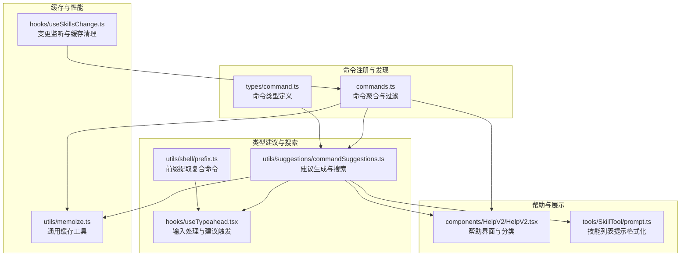
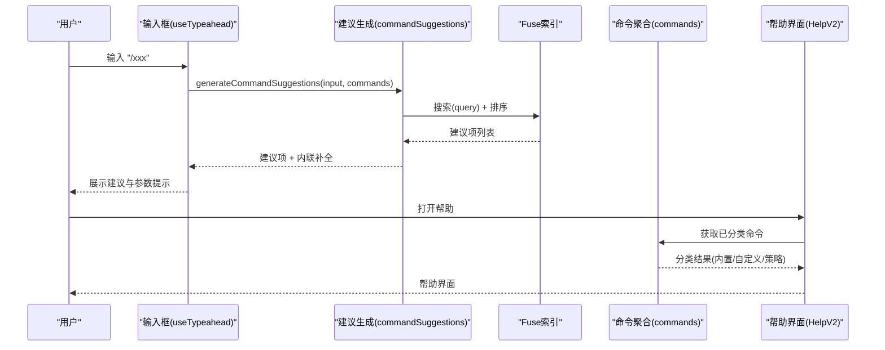
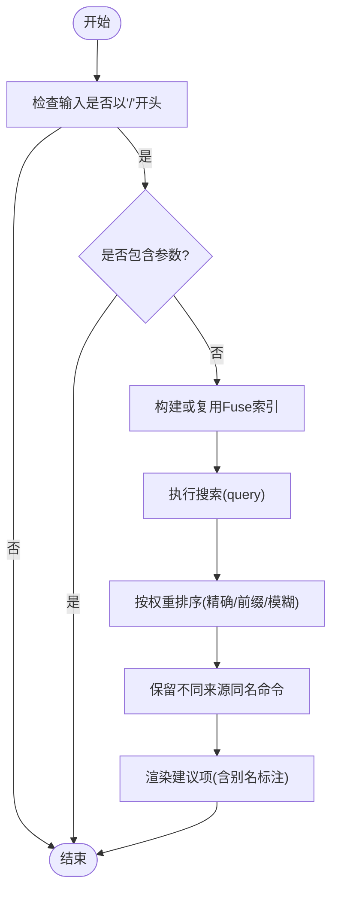
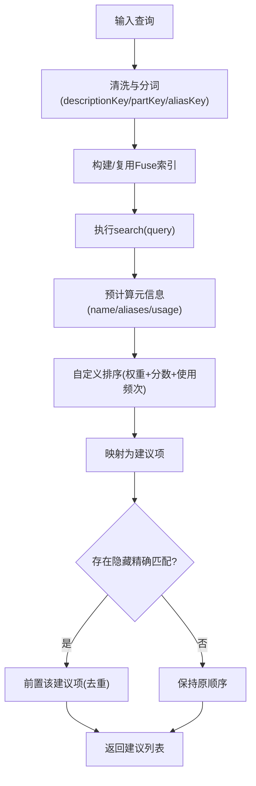
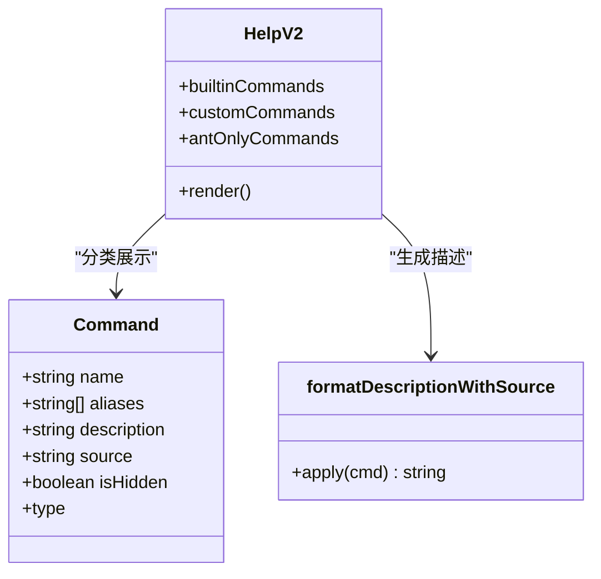
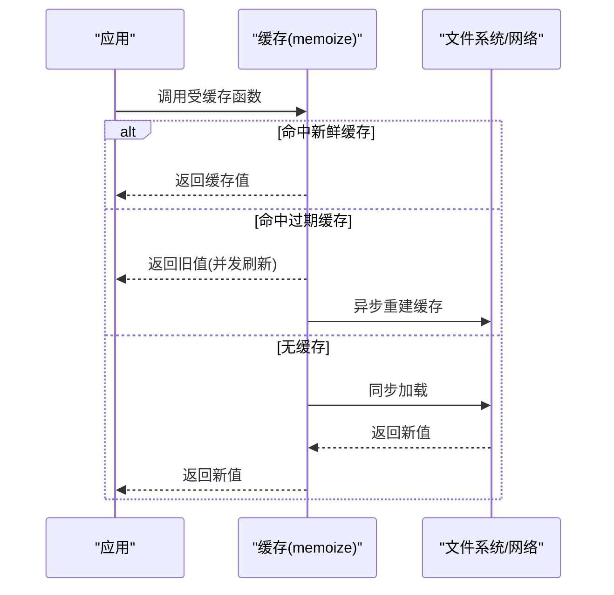
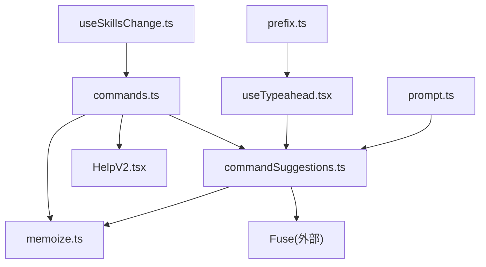

# 命令发现与搜索

<cite>
**本文档引用的文件**
- [commands.ts](file://src/commands.ts)
- [commandSuggestions.ts](file://src/utils/suggestions/commandSuggestions.ts)
- [command.ts](file://src/types/command.ts)
- [HelpV2.tsx](file://src/components/HelpV2/HelpV2.tsx)
- [useTypeahead.tsx](file://src/hooks/useTypeahead.tsx)
- [prompt.ts](file://src/tools/SkillTool/prompt.ts)
- [memoize.ts](file://src/utils/memoize.ts)
- [useSkillsChange.ts](file://src/hooks/useSkillsChange.ts)
- [prefix.ts](file://src/utils/shell/prefix.ts)
- [index.ts](file://src/commands/help/index.ts)
- [index.ts](file://src/commands/usage/index.ts)
</cite>

## 目录
1. [简介](#简介)
2. [项目结构](#项目结构)
3. [核心组件](#核心组件)
4. [架构总览](#架构总览)
5. [详细组件分析](#详细组件分析)
6. [依赖关系分析](#依赖关系分析)
7. [性能考量](#性能考量)
8. [故障排查指南](#故障排查指南)
9. [结论](#结论)
10. [附录](#附录)

## 简介
本文件系统性阐述命令发现与搜索系统的设计与实现，覆盖以下关键主题：
- 命令自动补全：命令名称匹配、别名解析、动态建议生成
- 命令搜索算法：基于模糊匹配与权重排序的高效检索
- 命令帮助系统：描述生成、分类展示、搜索索引构建
- 命令缓存策略与性能优化：多层缓存、懒加载、并发刷新
- 配置选项与自定义：命令可用性、启用条件、来源标注
- 用户体验设计：内联补全、参数提示、交互模式

## 项目结构
命令发现与搜索系统由“命令注册与发现”、“类型建议与搜索”、“帮助与展示”、“缓存与性能”四大部分构成，并通过钩子与工具函数在运行时协同工作。

**图表来源**
- [commands.ts:258-517](file://src/commands.ts#L258-L517)
- [commandSuggestions.ts:30-80](file://src/utils/suggestions/commandSuggestions.ts#L30-L80)
- [command.ts:16-217](file://src/types/command.ts#L16-L217)
- [HelpV2.tsx:55-137](file://src/components/HelpV2/HelpV2.tsx#L55-L137)
- [useTypeahead.tsx:350-781](file://src/hooks/useTypeahead.tsx#L350-L781)
- [prompt.ts:76-121](file://src/tools/SkillTool/prompt.ts#L76-L121)
- [memoize.ts:40-107](file://src/utils/memoize.ts#L40-L107)
- [useSkillsChange.ts:12-43](file://src/hooks/useSkillsChange.ts#L12-L43)
- [prefix.ts:128-167](file://src/utils/shell/prefix.ts#L128-L167)

**章节来源**
- [commands.ts:258-517](file://src/commands.ts#L258-L517)
- [commandSuggestions.ts:30-80](file://src/utils/suggestions/commandSuggestions.ts#L30-L80)
- [command.ts:16-217](file://src/types/command.ts#L16-L217)
- [HelpV2.tsx:55-137](file://src/components/HelpV2/HelpV2.tsx#L55-L137)
- [useTypeahead.tsx:350-781](file://src/hooks/useTypeahead.tsx#L350-L781)
- [prompt.ts:76-121](file://src/tools/SkillTool/prompt.ts#L76-L121)
- [memoize.ts:40-107](file://src/utils/memoize.ts#L40-L107)
- [useSkillsChange.ts:12-43](file://src/hooks/useSkillsChange.ts#L12-L43)
- [prefix.ts:128-167](file://src/utils/shell/prefix.ts#L128-L167)

## 核心组件
- 命令聚合与过滤：统一加载内置、插件、技能、工作流等来源的命令，按可用性与启用状态过滤，并支持动态技能插入。
- 建议生成与搜索：基于 Fuse.js 构建命令索引，支持名称、别名、分段与描述的加权匹配与排序。
- 输入处理与建议触发：在输入框中识别“/”开头的命令片段，触发建议与内联补全。
- 帮助与展示：按来源与类型分类展示命令，支持“最近使用”优先与来源标注。
- 缓存与性能：多层缓存（命令列表、技能索引、建议索引）与并发刷新，避免重复计算与磁盘 I/O。

**章节来源**
- [commands.ts:476-517](file://src/commands.ts#L476-L517)
- [commandSuggestions.ts:292-498](file://src/utils/suggestions/commandSuggestions.ts#L292-L498)
- [useTypeahead.tsx:350-781](file://src/hooks/useTypeahead.tsx#L350-L781)
- [HelpV2.tsx:55-137](file://src/components/HelpV2/HelpV2.tsx#L55-L137)
- [memoize.ts:40-107](file://src/utils/memoize.ts#L40-L107)

## 架构总览
命令发现与搜索的端到端流程如下：

**图表来源**
- [useTypeahead.tsx:350-781](file://src/hooks/useTypeahead.tsx#L350-L781)
- [commandSuggestions.ts:292-498](file://src/utils/suggestions/commandSuggestions.ts#L292-L498)
- [commands.ts:476-517](file://src/commands.ts#L476-L517)
- [HelpV2.tsx:55-137](file://src/components/HelpV2/HelpV2.tsx#L55-L137)

## 详细组件分析

### 命令自动补全与别名解析
- 命令名称匹配：优先匹配完整名称与别名，其次进行前缀匹配与模糊匹配；通过权重排序确保精确匹配优先。
- 别名解析：当用户输入为别名前缀时，建议项会标注所匹配的别名，避免歧义。
- 动态建议生成：在无参数输入且以“/”开头时生成建议；隐藏命令不会被 Fuse 索引覆盖，但可通过精确名称前置显示。

**图表来源**
- [commandSuggestions.ts:292-498](file://src/utils/suggestions/commandSuggestions.ts#L292-L498)
- [commandSuggestions.ts:414-473](file://src/utils/suggestions/commandSuggestions.ts#L414-L473)

**章节来源**
- [commandSuggestions.ts:292-498](file://src/utils/suggestions/commandSuggestions.ts#L292-L498)
- [commandSuggestions.ts:414-473](file://src/utils/suggestions/commandSuggestions.ts#L414-L473)

### 命令搜索算法
- 索引构建：对可见命令构建 Fuse 实例，键包括命令名、分段、别名与描述词，权重分别为 3、2、2、0.5。
- 查询策略：严格阈值与位置偏好，允许在描述中匹配；对隐藏但精确匹配的命令进行前置处理。
- 排序规则：优先级为“完全匹配 > 别名完全匹配 > 前缀匹配 > 描述模糊匹配”，同级按分数与使用频率排序。

**图表来源**
- [commandSuggestions.ts:30-80](file://src/utils/suggestions/commandSuggestions.ts#L30-L80)
- [commandSuggestions.ts:403-498](file://src/utils/suggestions/commandSuggestions.ts#L403-L498)

**章节来源**
- [commandSuggestions.ts:30-80](file://src/utils/suggestions/commandSuggestions.ts#L30-L80)
- [commandSuggestions.ts:403-498](file://src/utils/suggestions/commandSuggestions.ts#L403-L498)

### 命令帮助系统
- 描述生成：非模型侧展示时，为命令添加来源标注；工作流命令单独标识。
- 分类显示：内置本地命令、用户设置命令、项目设置命令、策略设置命令与其他命令分别展示。
- 最近使用：对提示型命令按使用频率排序，优先展示最近使用的技能。
- 来源标注：根据命令来源（插件、内置、捆绑、策略等）生成可读描述后缀。

**图表来源**
- [HelpV2.tsx:55-137](file://src/components/HelpV2/HelpV2.tsx#L55-L137)
- [commands.ts:728-754](file://src/commands.ts#L728-L754)

**章节来源**
- [HelpV2.tsx:55-137](file://src/components/HelpV2/HelpV2.tsx#L55-L137)
- [commands.ts:728-754](file://src/commands.ts#L728-L754)

### 命令缓存策略与性能优化
- 多层缓存：
  - 命令聚合缓存：命令列表与技能索引缓存，避免重复加载与过滤。
  - 建议索引缓存：Fuse 索引按命令数组身份缓存，仅在命令数组变化时重建。
  - 并发刷新：缓存过期时返回旧值并异步刷新，防止阻塞。
- 变更监听：监听技能文件与特性开关变化，触发缓存清理与重新加载。
- 前缀提取：复合命令的子命令前缀提取采用 LRU 缓存与拒绝污染策略。

**图表来源**
- [memoize.ts:40-107](file://src/utils/memoize.ts#L40-L107)
- [memoize.ts:134-215](file://src/utils/memoize.ts#L134-L215)
- [useSkillsChange.ts:12-43](file://src/hooks/useSkillsChange.ts#L12-L43)

**章节来源**
- [memoize.ts:40-107](file://src/utils/memoize.ts#L40-L107)
- [memoize.ts:134-215](file://src/utils/memoize.ts#L134-L215)
- [useSkillsChange.ts:12-43](file://src/hooks/useSkillsChange.ts#L12-L43)

### 配置选项与自定义
- 命令可用性：通过 availability 字段限制命令对特定认证/提供商环境可见（如 claude.ai 订阅者、Console API 用户）。
- 启用条件：isEnabled 回调用于动态启用/禁用（如特性开关、环境变量）。
- 来源标注：formatDescriptionWithSource 依据 source 与 kind 生成描述后缀，便于区分插件、内置、捆绑与工作流。
- 命令类型：支持 prompt、local、local-jsx 三类，分别对应模型可调用、本地执行与延迟加载 UI。

**章节来源**
- [command.ts:155-217](file://src/types/command.ts#L155-L217)
- [commands.ts:728-754](file://src/commands.ts#L728-L754)

### 用户体验设计与交互模式
- 内联补全：在输入“/”后，若未输入参数，显示建议列表；若输入为别名前缀，建议项标注别名。
- 参数提示：当命令后有空格且存在参数提示或 argNames 时，显示逐项参数提示。
- 帮助界面：提供“通用”“命令”“自定义命令”“[ant-only]”等标签页，支持快速浏览与查找。
- 远程安全：远程模式下仅允许本地状态操作命令，避免依赖本地上下文的命令。

**章节来源**
- [useTypeahead.tsx:350-781](file://src/hooks/useTypeahead.tsx#L350-L781)
- [HelpV2.tsx:55-137](file://src/components/HelpV2/HelpV2.tsx#L55-L137)
- [commands.ts:619-637](file://src/commands.ts#L619-L637)

## 依赖关系分析

**图表来源**
- [commands.ts:258-517](file://src/commands.ts#L258-L517)
- [commandSuggestions.ts:1-10](file://src/utils/suggestions/commandSuggestions.ts#L1-L10)
- [HelpV2.tsx:55-137](file://src/components/HelpV2/HelpV2.tsx#L55-L137)
- [useTypeahead.tsx:350-781](file://src/hooks/useTypeahead.tsx#L350-L781)
- [prompt.ts:76-121](file://src/tools/SkillTool/prompt.ts#L76-L121)
- [useSkillsChange.ts:12-43](file://src/hooks/useSkillsChange.ts#L12-L43)
- [prefix.ts:128-167](file://src/utils/shell/prefix.ts#L128-L167)

**章节来源**
- [commands.ts:258-517](file://src/commands.ts#L258-L517)
- [commandSuggestions.ts:1-10](file://src/utils/suggestions/commandSuggestions.ts#L1-L10)
- [HelpV2.tsx:55-137](file://src/components/HelpV2/HelpV2.tsx#L55-L137)
- [useTypeahead.tsx:350-781](file://src/hooks/useTypeahead.tsx#L350-L781)
- [prompt.ts:76-121](file://src/tools/SkillTool/prompt.ts#L76-L121)
- [useSkillsChange.ts:12-43](file://src/hooks/useSkillsChange.ts#L12-L43)
- [prefix.ts:128-167](file://src/utils/shell/prefix.ts#L128-L167)

## 性能考量
- 建议索引缓存：Fuse 索引按命令数组身份缓存，避免每次按键重建；仅在命令数组变化时重建。
- 命令聚合缓存：getCommands 与 getSkillToolCommands 使用 memoize，减少磁盘 I/O 与动态导入成本。
- 并发刷新：缓存过期时立即返回旧值，后台异步刷新，保证交互流畅。
- 变更驱动刷新：技能文件或特性开关变化时，清理相关缓存并重新加载，确保一致性。
- 前缀提取缓存：复合命令前缀提取采用 LRU 缓存与拒绝污染策略，避免重复计算。

[本节为通用性能指导，无需具体文件分析]

## 故障排查指南
- 建议不出现或不更新：
  - 检查输入是否以“/”开头且不含参数。
  - 确认命令未被标记为 isHidden；精确匹配隐藏命令会被前置显示。
  - 触发缓存清理：调用 clearCommandMemoizationCaches 或 clearCommandsCache。
- 帮助界面空白或分类异常：
  - 确认 commands 数组包含预期命令。
  - 检查 builtInCommandNames 是否正确识别内置命令。
- 性能问题：
  - 观察是否频繁重建 Fuse 索引（命令数组未稳定）。
  - 检查是否存在大量动态技能导致列表增长，必要时清理缓存。

**章节来源**
- [commandSuggestions.ts:30-80](file://src/utils/suggestions/commandSuggestions.ts#L30-L80)
- [commands.ts:523-539](file://src/commands.ts#L523-L539)
- [HelpV2.tsx:55-137](file://src/components/HelpV2/HelpV2.tsx#L55-L137)

## 结论
该系统通过“命令聚合 + 建议索引 + 输入处理 + 帮助展示 + 多层缓存”的架构，实现了高性能、可扩展、易维护的命令发现与搜索能力。其设计兼顾了准确性（精确/前缀/模糊匹配）、可用性（来源标注、最近使用、参数提示）与性能（缓存、并发刷新、变更监听）。对于扩展与定制，建议遵循命令类型规范、合理设置 availability 与 isEnabled，并利用现有缓存与变更监听机制保障一致性与性能。

[本节为总结性内容，无需具体文件分析]

## 附录
- 常用命令示例：
  - 帮助命令：用于打开帮助界面，查看内置与自定义命令分类。
  - 使用量命令：展示计划使用限制，受可用性约束。
- 关键路径参考：
  - 命令聚合与过滤：[commands.ts:476-517](file://src/commands.ts#L476-L517)
  - 建议生成与搜索：[commandSuggestions.ts:292-498](file://src/utils/suggestions/commandSuggestions.ts#L292-L498)
  - 输入处理与建议触发：[useTypeahead.tsx:350-781](file://src/hooks/useTypeahead.tsx#L350-L781)
  - 帮助界面与分类：[HelpV2.tsx:55-137](file://src/components/HelpV2/HelpV2.tsx#L55-L137)
  - 技能列表提示格式化：[prompt.ts:76-121](file://src/tools/SkillTool/prompt.ts#L76-L121)
  - 缓存工具与并发刷新：[memoize.ts:40-107](file://src/utils/memoize.ts#L40-L107)
  - 变更监听与缓存清理：[useSkillsChange.ts:12-43](file://src/hooks/useSkillsChange.ts#L12-L43)
  - 复合命令前缀提取：[prefix.ts:128-167](file://src/utils/shell/prefix.ts#L128-L167)