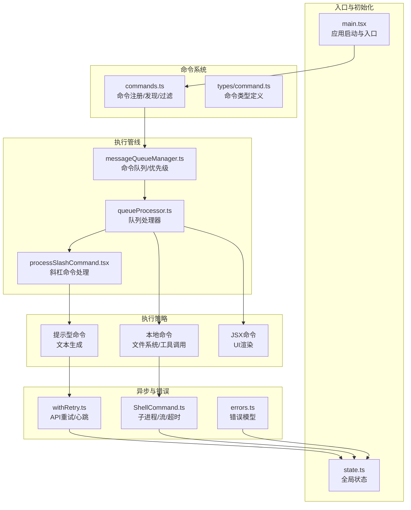
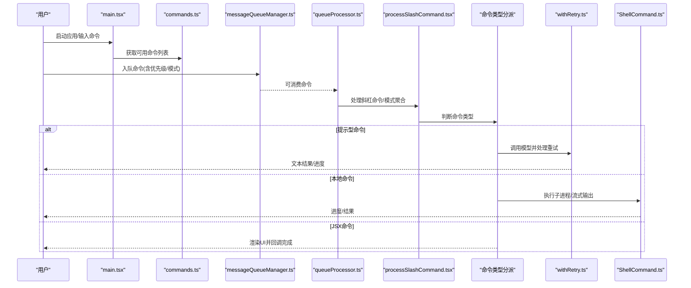
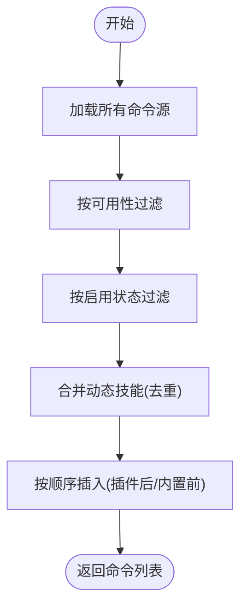
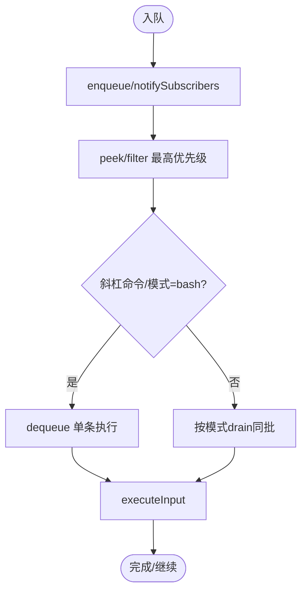
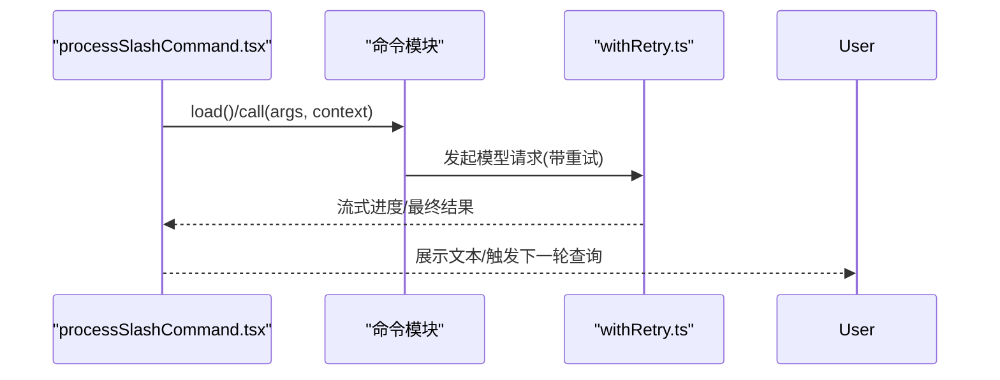
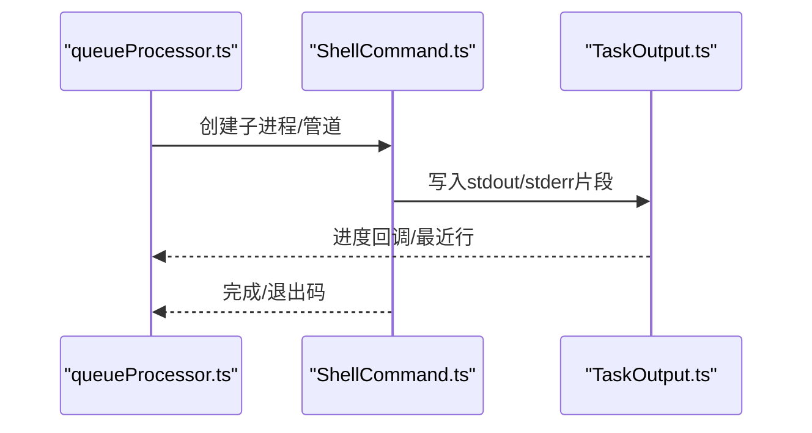
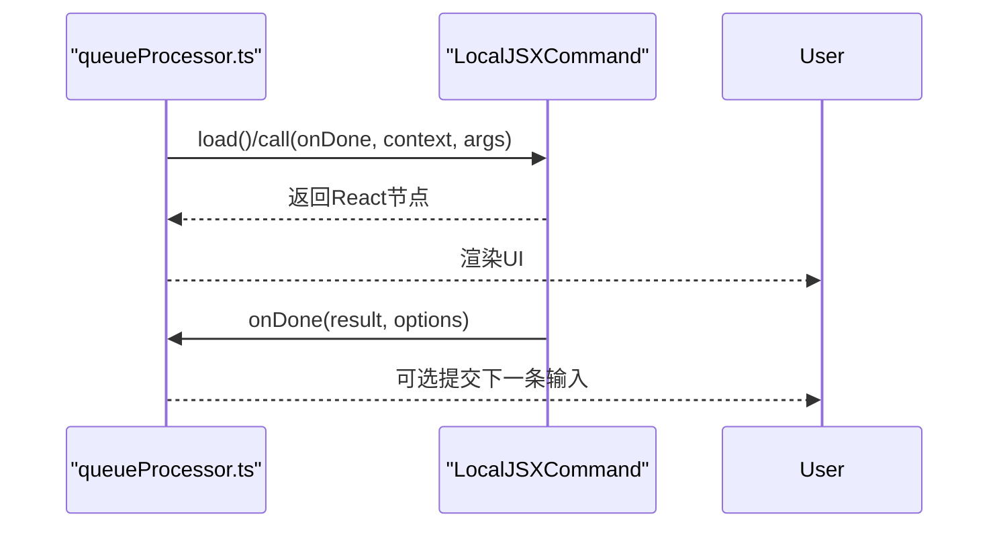
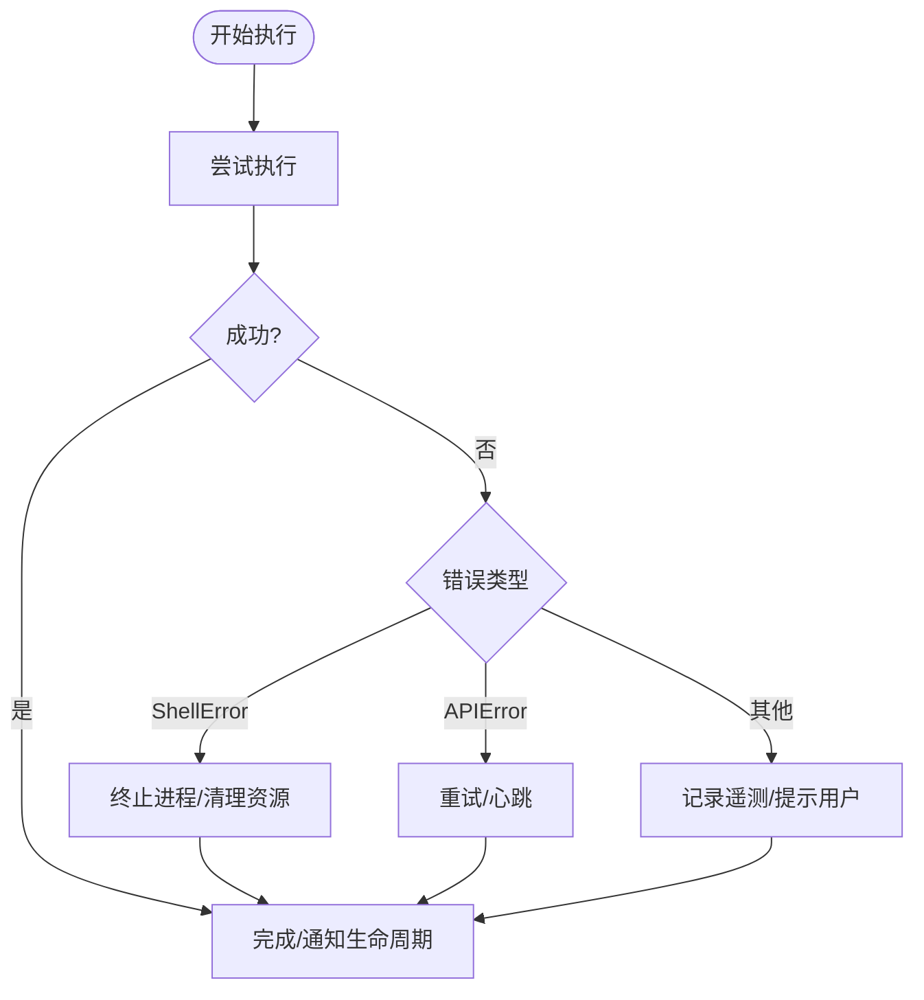
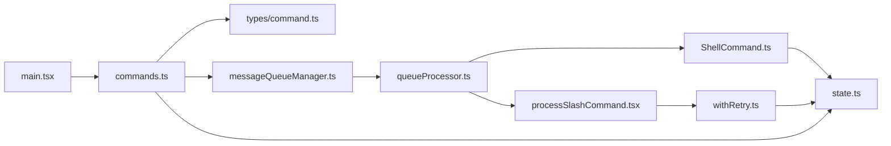

# 命令执行流程

<cite>
**本文档引用的文件**
- [commands.ts](file://src/commands.ts)
- [main.tsx](file://src/main.tsx)
- [state.ts](file://src/bootstrap/state.ts)
- [command.ts](file://src/types/command.ts)
- [messageQueueManager.ts](file://src/utils/messageQueueManager.ts)
- [commandLifecycle.ts](file://src/utils/commandLifecycle.ts)
- [processSlashCommand.tsx](file://src/utils/processUserInput/processSlashCommand.tsx)
- [queueProcessor.ts](file://src/utils/queueProcessor.ts)
- [ShellCommand.ts](file://src/utils/ShellCommand.ts)
- [withRetry.ts](file://src/services/api/withRetry.ts)
- [queryProfiler.ts](file://src/utils/queryProfiler.ts)
- [errors.ts](file://src/utils/errors.ts)
- [print.ts](file://src/cli/print.ts)
</cite>

## 目录
1. [简介](#简介)
2. [项目结构](#项目结构)
3. [核心组件](#核心组件)
4. [架构总览](#架构总览)
5. [详细组件分析](#详细组件分析)
6. [依赖关系分析](#依赖关系分析)
7. [性能考虑](#性能考虑)
8. [故障排除指南](#故障排除指南)
9. [结论](#结论)

## 简介
本文件系统性阐述命令执行从“解析到执行完成”的完整流程，覆盖命令参数解析、验证与预处理阶段；解释提示型命令（文本生成）、本地命令（文件系统操作）与JSX命令（UI渲染）三类执行策略；详述异步处理机制、错误处理与回滚策略；并提供性能监控与调试方法及常见问题排查建议。

## 项目结构
命令系统围绕“命令定义—命令发现—队列调度—执行—结果呈现”展开，核心模块包括：
- 命令注册与发现：集中于命令清单与动态加载
- 队列管理：统一的命令队列与优先级调度
- 执行引擎：按类型分派执行路径（提示型/本地/JSX）
- 异步与错误：重试、超时、进度与日志
- 性能与调试：查询剖析、生命周期事件、状态统计

**图表来源**
- [main.tsx:585-800](file://src/main.tsx#L585-L800)
- [commands.ts:476-517](file://src/commands.ts#L476-L517)
- [command.ts:16-206](file://src/types/command.ts#L16-L206)
- [messageQueueManager.ts:128-193](file://src/utils/messageQueueManager.ts#L128-L193)
- [queueProcessor.ts:63-95](file://src/utils/queueProcessor.ts#L63-L95)
- [processSlashCommand.tsx:660-676](file://src/utils/processUserInput/processSlashCommand.tsx#L660-L676)
- [withRetry.ts:477-514](file://src/services/api/withRetry.ts#L477-L514)
- [ShellCommand.ts:32-71](file://src/utils/ShellCommand.ts#L32-L71)

**章节来源**
- [main.tsx:585-800](file://src/main.tsx#L585-L800)
- [commands.ts:476-517](file://src/commands.ts#L476-L517)

## 核心组件
- 命令类型与结果
  - 提示型命令（PromptCommand）：通过模型生成文本内容，支持上下文与预算控制
  - 本地命令（LocalCommand）：返回文本或紧凑结果，支持非交互模式
  - JSX命令（LocalJSXCommand）：渲染UI，回调式完成通知
- 命令发现与过滤
  - 动态加载技能、插件与工作流，按可用性与启用状态过滤
  - 远程/桥接安全命令白名单
- 队列与优先级
  - 统一队列，优先级为 now/next/later，同级FIFO
  - 支持批量出队、可见性与可编辑性判定
- 执行器
  - 按类型分派：斜杠命令独立执行；其他同模式聚合执行
  - 生命周期事件：开始/完成通知
- 异步与错误
  - 子进程流式输出与进度上报
  - API重试与持久等待心跳
  - 错误模型与遥测安全错误

**章节来源**
- [command.ts:16-206](file://src/types/command.ts#L16-L206)
- [commands.ts:476-517](file://src/commands.ts#L476-L517)
- [messageQueueManager.ts:128-193](file://src/utils/messageQueueManager.ts#L128-L193)
- [queueProcessor.ts:63-95](file://src/utils/queueProcessor.ts#L63-L95)
- [commandLifecycle.ts:1-22](file://src/utils/commandLifecycle.ts#L1-L22)
- [ShellCommand.ts:32-71](file://src/utils/ShellCommand.ts#L32-L71)
- [withRetry.ts:477-514](file://src/services/api/withRetry.ts#L477-L514)
- [errors.ts:51-94](file://src/utils/errors.ts#L51-L94)

## 架构总览
命令执行的端到端流程如下：

**图表来源**
- [main.tsx:585-800](file://src/main.tsx#L585-L800)
- [commands.ts:476-517](file://src/commands.ts#L476-L517)
- [messageQueueManager.ts:128-193](file://src/utils/messageQueueManager.ts#L128-L193)
- [queueProcessor.ts:63-95](file://src/utils/queueProcessor.ts#L63-L95)
- [processSlashCommand.tsx:660-676](file://src/utils/processUserInput/processSlashCommand.tsx#L660-L676)
- [withRetry.ts:477-514](file://src/services/api/withRetry.ts#L477-L514)
- [ShellCommand.ts:32-71](file://src/utils/ShellCommand.ts#L32-L71)

## 详细组件分析

### 命令解析与发现
- 命令来源
  - 内置命令集合与条件特性命令
  - 技能目录、插件、工作流脚本
  - MCP服务器提供的技能
- 过滤逻辑
  - 可用性要求（订阅/控制台等）
  - 启用状态（isEnabled）
  - 远程/桥接安全命令白名单
- 动态技能插入
  - 去重后插入到插件技能之后、内置命令之前

**图表来源**
- [commands.ts:449-469](file://src/commands.ts#L449-L469)
- [commands.ts:476-517](file://src/commands.ts#L476-L517)

**章节来源**
- [commands.ts:417-443](file://src/commands.ts#L417-L443)
- [commands.ts:449-469](file://src/commands.ts#L449-L469)
- [commands.ts:476-517](file://src/commands.ts#L476-L517)

### 命令队列与调度
- 队列数据结构
  - 数组存储，快照冻结以供外部订阅
  - 优先级映射：now(0)<next(1)<later(2)
- 出队策略
  - 独立处理斜杠命令与bash模式命令
  - 同模式聚合处理，提升吞吐
- 可见性与可编辑性
  - 仅对可编辑模式与非元消息显示
  - 支持弹出所有可编辑命令合并到当前输入

**图表来源**
- [messageQueueManager.ts:128-193](file://src/utils/messageQueueManager.ts#L128-L193)
- [queueProcessor.ts:63-95](file://src/utils/queueProcessor.ts#L63-L95)

**章节来源**
- [messageQueueManager.ts:128-193](file://src/utils/messageQueueManager.ts#L128-L193)
- [queueProcessor.ts:63-95](file://src/utils/queueProcessor.ts#L63-L95)

### 命令执行策略

#### 提示型命令（文本生成）
- 执行路径
  - 斜杠命令加载模块后直接调用
  - 返回内容块参数，交由模型处理
- 重试与进度
  - API重试与持久等待心跳，逐段输出系统消息
  - 查询剖析记录各阶段耗时

**图表来源**
- [processSlashCommand.tsx:660-676](file://src/utils/processUserInput/processSlashCommand.tsx#L660-L676)
- [withRetry.ts:477-514](file://src/services/api/withRetry.ts#L477-L514)
- [queryProfiler.ts:205-293](file://src/utils/queryProfiler.ts#L205-L293)

**章节来源**
- [processSlashCommand.tsx:660-676](file://src/utils/processUserInput/processSlashCommand.tsx#L660-L676)
- [withRetry.ts:477-514](file://src/services/api/withRetry.ts#L477-L514)
- [queryProfiler.ts:205-293](file://src/utils/queryProfiler.ts#L205-L293)

#### 本地命令（文件系统/工具）
- 执行路径
  - 通过ShellCommand封装子进程，流式读取stdout/stderr
  - TaskOutput聚合最近行与总行数，限制内存占用
- 超时与资源保护
  - 定期轮询文件大小，超限时终止
  - 支持后台任务与清理钩子
- 结果格式
  - 文本或紧凑结果（用于上下文压缩）

**图表来源**
- [queueProcessor.ts:63-95](file://src/utils/queueProcessor.ts#L63-L95)
- [ShellCommand.ts:32-71](file://src/utils/ShellCommand.ts#L32-L71)
- [utils/task/TaskOutput.ts:211-257](file://src/utils/task/TaskOutput.ts#L211-L257)

**章节来源**
- [ShellCommand.ts:32-71](file://src/utils/ShellCommand.ts#L32-L71)
- [utils/task/TaskOutput.ts:211-257](file://src/utils/task/TaskOutput.ts#L211-L257)

#### JSX命令（UI渲染）
- 执行路径
  - 加载UI模块，返回React节点
  - 通过回调onDone传递结果与后续输入
- 上下文能力
  - 访问工具权限、主题、IDE集成状态等

**图表来源**
- [command.ts:131-152](file://src/types/command.ts#L131-L152)
- [queueProcessor.ts:63-95](file://src/utils/queueProcessor.ts#L63-L95)

**章节来源**
- [command.ts:131-152](file://src/types/command.ts#L131-L152)

### 异步处理、错误处理与回滚
- 异步处理
  - CLI打印模式下并行读取输入与处理队列，完成即通知生命周期
  - API重试采用分块心跳，避免长时间无输出导致会话空闲
- 错误处理
  - ShellError封装子进程失败信息
  - TelemetrySafeError确保遥测安全
- 回滚策略
  - 队列层面：ESC取消可清空通知队列
  - 执行层面：子进程超时/过大自动终止，释放资源

**图表来源**
- [print.ts:2807-2828](file://src/cli/print.ts#L2807-L2828)
- [withRetry.ts:477-514](file://src/services/api/withRetry.ts#L477-L514)
- [errors.ts:51-94](file://src/utils/errors.ts#L51-L94)

**章节来源**
- [print.ts:2807-2828](file://src/cli/print.ts#L2807-L2828)
- [withRetry.ts:477-514](file://src/services/api/withRetry.ts#L477-L514)
- [errors.ts:51-94](file://src/utils/errors.ts#L51-L94)

## 依赖关系分析

**图表来源**
- [main.tsx:585-800](file://src/main.tsx#L585-L800)
- [commands.ts:476-517](file://src/commands.ts#L476-L517)
- [messageQueueManager.ts:128-193](file://src/utils/messageQueueManager.ts#L128-L193)
- [queueProcessor.ts:63-95](file://src/utils/queueProcessor.ts#L63-L95)
- [processSlashCommand.tsx:660-676](file://src/utils/processUserInput/processSlashCommand.tsx#L660-L676)
- [withRetry.ts:477-514](file://src/services/api/withRetry.ts#L477-L514)
- [ShellCommand.ts:32-71](file://src/utils/ShellCommand.ts#L32-L71)

**章节来源**
- [main.tsx:585-800](file://src/main.tsx#L585-L800)
- [commands.ts:476-517](file://src/commands.ts#L476-L517)

## 性能考虑
- 查询剖析
  - 分阶段记录时间戳，输出阶段耗时柱状图
  - 识别预API开销瓶颈（上下文加载、微紧凑、自动紧凑、工具schema构建等）
- 队列与并发
  - 同模式聚合减少调度开销
  - CLI打印模式并行处理输入与队列，降低端到端延迟
- 子进程与IO
  - 限制输出缓冲区大小，超限自动终止
  - 分块心跳避免会话空闲

**章节来源**
- [queryProfiler.ts:205-293](file://src/utils/queryProfiler.ts#L205-L293)
- [print.ts:2807-2828](file://src/cli/print.ts#L2807-L2828)
- [ShellCommand.ts:32-71](file://src/utils/ShellCommand.ts#L32-L71)

## 故障排除指南
- 常见问题定位
  - 命令未出现：检查可用性过滤与isEnabled
  - 命令被远程/桥接屏蔽：确认是否在安全白名单
  - 执行卡住：查看队列是否被系统通知阻塞；检查子进程输出是否过大
  - API错误：关注重试心跳消息与错误格式化组件
- 排查步骤
  - 使用查询剖析报告定位瓶颈阶段
  - 检查命令生命周期事件（开始/完成）是否匹配
  - 在CLI打印模式下观察并行处理行为
  - 查看最近错误日志与遥测安全错误

**章节来源**
- [commands.ts:619-676](file://src/commands.ts#L619-L676)
- [commandLifecycle.ts:1-22](file://src/utils/commandLifecycle.ts#L1-L22)
- [queryProfiler.ts:205-293](file://src/utils/queryProfiler.ts#L205-L293)
- [print.ts:2807-2828](file://src/cli/print.ts#L2807-L2828)
- [errors.ts:51-94](file://src/utils/errors.ts#L51-L94)

## 结论
该命令执行体系以统一队列为核心，结合类型分派与异步执行，实现了提示型、本地与JSX三类命令的高效协同。通过严格的可用性过滤、远程/桥接安全策略、子进程资源保护与API重试机制，系统在复杂场景下仍保持稳定与可观测性。配合查询剖析与生命周期事件，开发者可以快速定位性能瓶颈与异常路径，持续优化用户体验。