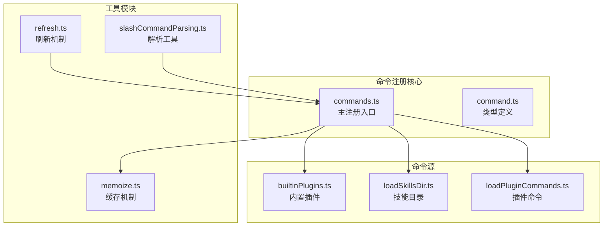
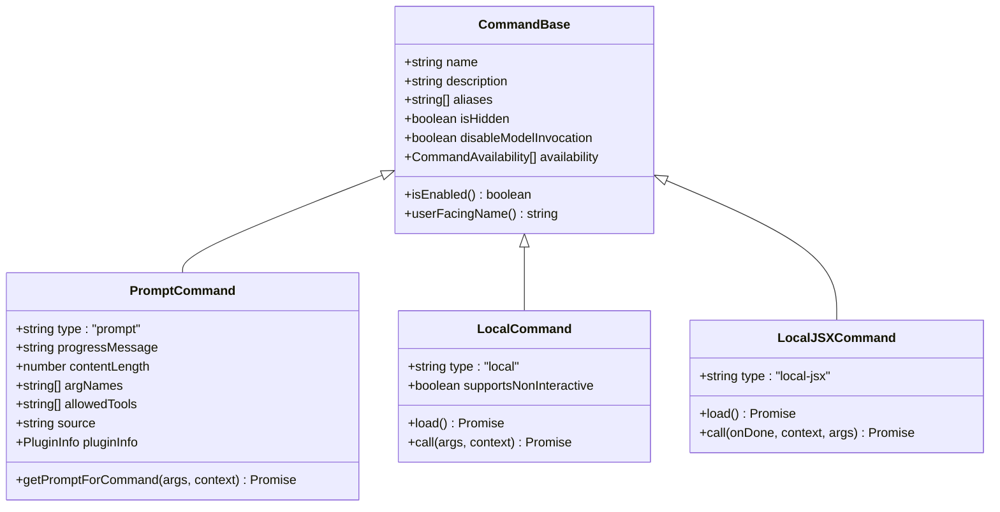
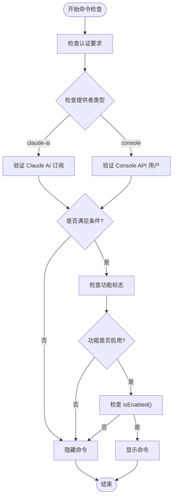
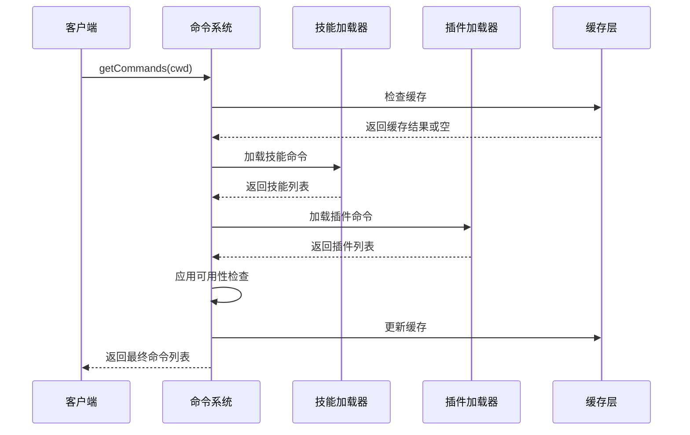
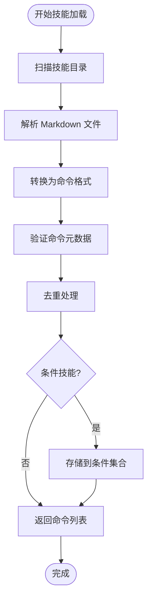
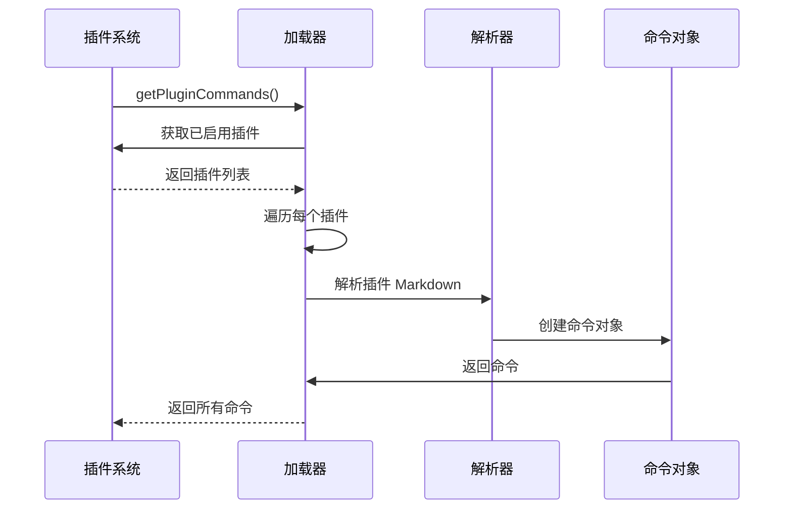
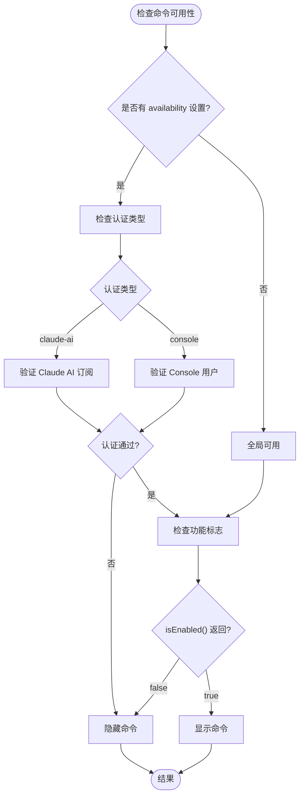
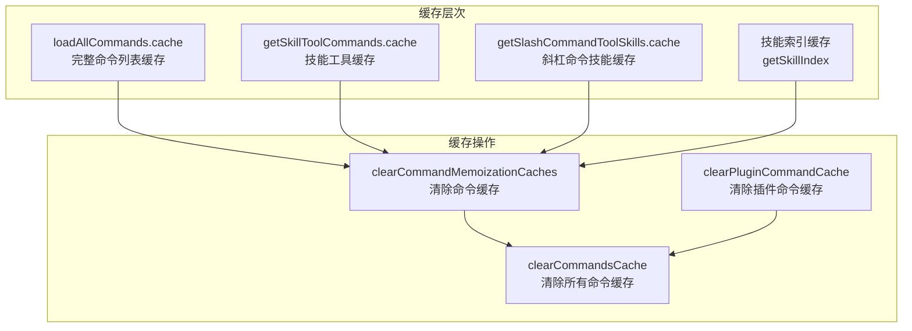
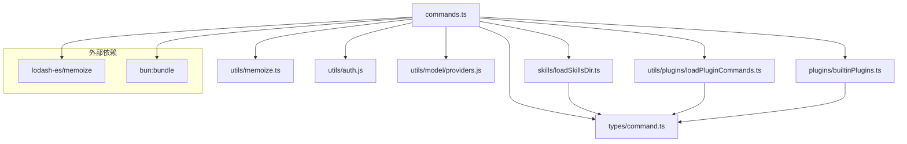

# 命令注册机制

<cite>
**本文档引用的文件**
- [commands.ts](file://src/commands.ts)
- [command.ts](file://src/types/command.ts)
- [loadPluginCommands.ts](file://src/utils/plugins/loadPluginCommands.ts)
- [loadSkillsDir.ts](file://src/skills/loadSkillsDir.ts)
- [builtinPlugins.ts](file://src/plugins/builtinPlugins.ts)
- [refresh.ts](file://src/utils/plugins/refresh.ts)
- [help/index.ts](file://src/commands/help/index.ts)
- [init.ts](file://src/commands/init.ts)
- [skills/index.ts](file://src/commands/skills/index.ts)
- [slashCommandParsing.ts](file://src/utils/slashCommandParsing.ts)
- [memoize.ts](file://src/utils/memoize.ts)
</cite>

## 目录
1. [简介](#简介)
2. [项目结构](#项目结构)
3. [核心组件](#核心组件)
4. [架构概览](#架构概览)
5. [详细组件分析](#详细组件分析)
6. [依赖关系分析](#依赖关系分析)
7. [性能考虑](#性能考虑)
8. [故障排除指南](#故障排除指南)
9. [结论](#结论)

## 简介

命令注册机制是 Claude Code 的核心功能之一，负责管理所有可用的命令，包括内置命令、动态技能命令、插件命令等。该机制实现了复杂的命令发现、加载和缓存策略，确保用户能够高效地访问和使用各种命令。

本文档深入解析了命令注册机制的完整实现，包括静态注册、动态加载、可用性检查、缓存策略等关键特性。

## 项目结构

命令注册机制涉及多个关键模块的协作：



**图表来源**
- [commands.ts:1-755](file://src/commands.ts#L1-L755)
- [command.ts:1-217](file://src/types/command.ts#L1-L217)

**章节来源**
- [commands.ts:1-755](file://src/commands.ts#L1-L755)
- [command.ts:1-217](file://src/types/command.ts#L1-L217)

## 核心组件

### 命令类型系统

命令系统基于统一的类型定义，支持三种主要类型：



**图表来源**
- [command.ts:25-206](file://src/types/command.ts#L25-L206)

### 命令可用性检查

系统实现了多层次的可用性检查机制：



**图表来源**
- [commands.ts:417-443](file://src/commands.ts#L417-L443)

**章节来源**
- [command.ts:154-216](file://src/types/command.ts#L154-L216)
- [commands.ts:417-443](file://src/commands.ts#L417-L443)

## 架构概览

命令注册机制采用分层架构设计，实现了高效的命令发现和加载：



**图表来源**
- [commands.ts:476-517](file://src/commands.ts#L476-L517)

## 详细组件分析

### 内置命令静态注册

内置命令通过静态导入的方式注册到系统中：

```mermaid
graph LR
subgraph "内置命令注册"
A[commands.ts 导入声明]
B[静态命令对象]
C[COMMANDS() 函数]
D[COMMANDS.memoize 缓存]
end
A --> B
B --> C
C --> D
```

**图表来源**
- [commands.ts:258-346](file://src/commands.ts#L258-L346)

内置命令的注册遵循以下模式：
- 所有内置命令在模块顶部通过 `import` 语句导入
- 使用 `COMMANDS()` 函数进行延迟初始化
- 通过 `memoize` 实现缓存，避免重复创建

**章节来源**
- [commands.ts:2-152](file://src/commands.ts#L2-L152)
- [commands.ts:258-346](file://src/commands.ts#L258-L346)

### 动态技能命令加载

动态技能命令通过文件系统扫描和解析实现：



**图表来源**
- [loadSkillsDir.ts:638-800](file://src/skills/loadSkillsDir.ts#L638-L800)

动态技能加载的关键特性：
- 支持多源目录：用户目录、项目目录、策略目录
- 自动去重：通过文件路径识别避免重复加载
- 条件技能：支持基于文件路径的条件激活
- 并行加载：不同目录的加载相互独立，可并行执行

**章节来源**
- [loadSkillsDir.ts:638-800](file://src/skills/loadSkillsDir.ts#L638-L800)

### 插件命令发现和注册

插件命令通过插件系统自动发现和加载：



**图表来源**
- [loadPluginCommands.ts:414-677](file://src/utils/plugins/loadPluginCommands.ts#L414-L677)

插件命令加载的详细流程：
- 插件发现：通过 `loadAllPluginsCacheOnly()` 获取已启用插件
- 路径扫描：遍历插件的 `commandsPath` 和 `commandsPaths`
- 文件解析：支持单个文件和目录两种模式
- 元数据处理：从 Frontmatter 中提取命令配置
- 命令生成：创建标准化的命令对象

**章节来源**
- [loadPluginCommands.ts:414-677](file://src/utils/plugins/loadPluginCommands.ts#L414-L677)

### 命令可用性检查机制

系统实现了严格的命令可用性检查，确保只有合适的命令对用户可见：



**图表来源**
- [commands.ts:417-443](file://src/commands.ts#L417-L443)

**章节来源**
- [commands.ts:417-443](file://src/commands.ts#L417-L443)

### 命令缓存策略

系统采用了多层缓存策略来优化性能：



**图表来源**
- [commands.ts:523-539](file://src/commands.ts#L523-L539)

缓存策略的特点：
- 按需缓存：只缓存昂贵的操作结果
- 分层清理：支持精确的缓存清理
- 异步刷新：支持缓存的异步更新
- 错误处理：缓存失效时自动回退到原始数据

**章节来源**
- [commands.ts:523-539](file://src/commands.ts#L523-L539)
- [memoize.ts:174-215](file://src/utils/memoize.ts#L174-L215)

## 依赖关系分析

命令注册机制的依赖关系如下：



**图表来源**
- [commands.ts:1-222](file://src/commands.ts#L1-L222)

**章节来源**
- [commands.ts:1-222](file://src/commands.ts#L1-L222)

## 性能考虑

命令注册机制在性能方面采用了多项优化策略：

### 缓存优化
- 使用 `lodash-es/memoize` 实现智能缓存
- 支持缓存清理和异步刷新
- 避免重复的文件系统扫描和解析

### 并行处理
- 技能目录加载采用并行策略
- 插件命令加载支持并发处理
- 缓存层减少重复计算

### 条件加载
- 延迟加载非关键命令
- 按需解析命令内容
- 支持按功能标志的条件编译

## 故障排除指南

### 常见问题及解决方案

**问题1：命令不显示**
- 检查命令的 `availability` 设置
- 验证功能标志是否启用
- 确认 `isEnabled()` 返回值

**问题2：插件命令未加载**
- 检查插件是否已启用
- 验证 `commandsPath` 配置
- 确认文件权限和路径正确性

**问题3：缓存问题**
- 使用 `clearCommandsCache()` 清理缓存
- 检查缓存键是否正确
- 验证缓存清理时机

**章节来源**
- [commands.ts:534-539](file://src/commands.ts#L534-L539)

## 结论

命令注册机制通过精心设计的架构和多种优化策略，实现了高效、灵活且可扩展的命令管理系统。其核心优势包括：

1. **模块化设计**：清晰的职责分离和接口定义
2. **多源支持**：统一处理内置、动态、插件等多种命令源
3. **智能缓存**：多层次缓存策略确保性能最优
4. **严格检查**：完善的可用性检查机制保证用户体验
5. **易于扩展**：标准化的接口设计便于新功能集成

该机制为 Claude Code 提供了强大而灵活的命令系统，支持丰富的功能扩展和定制需求。