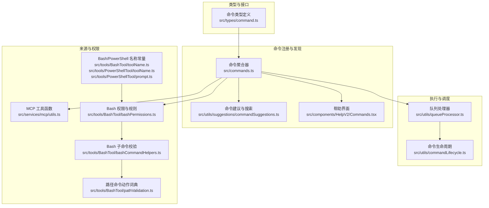
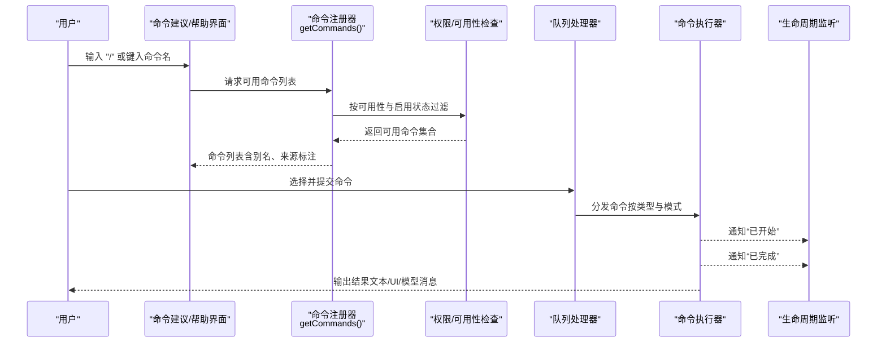
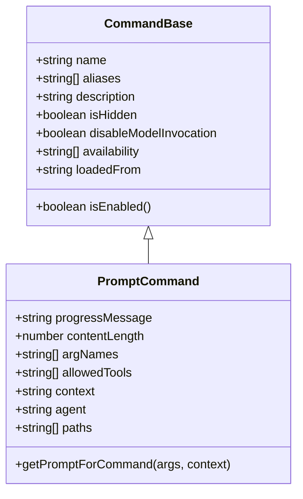
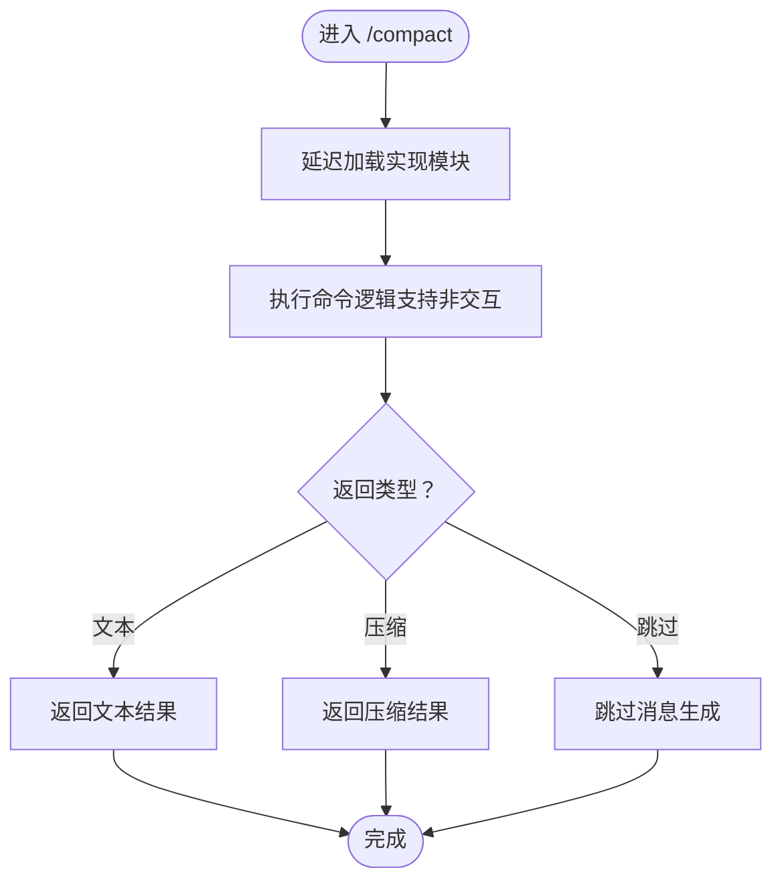
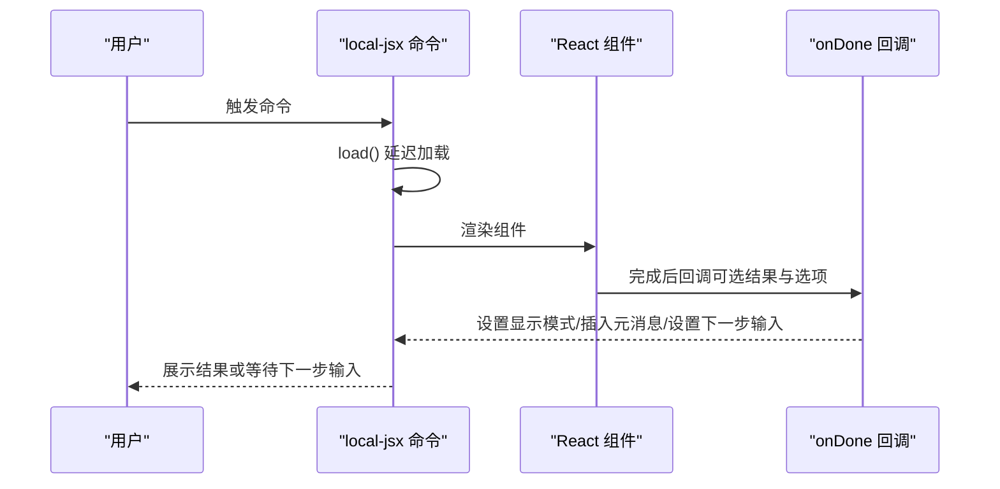
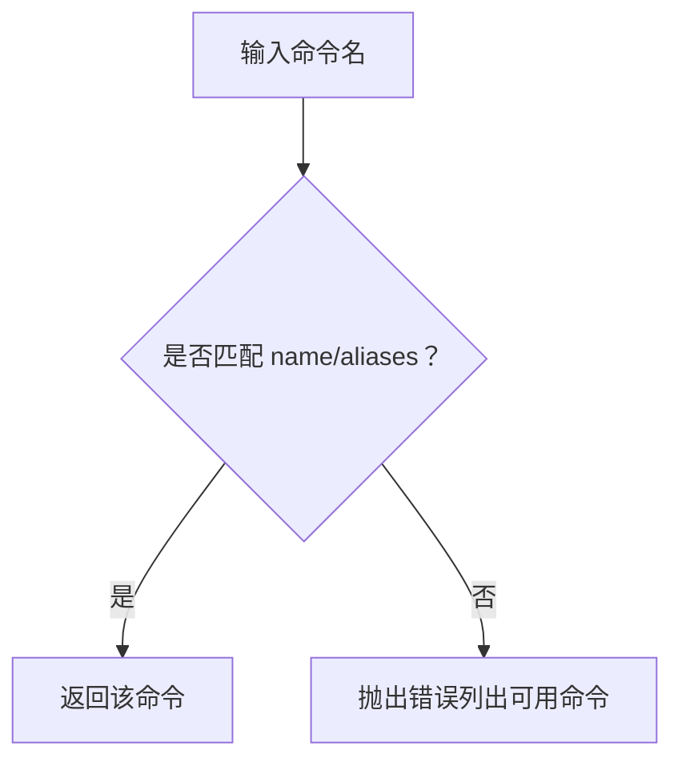
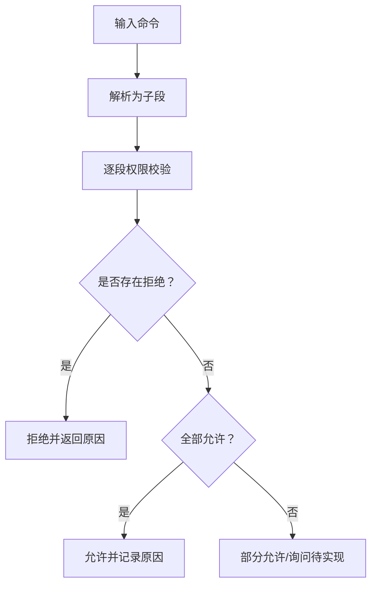
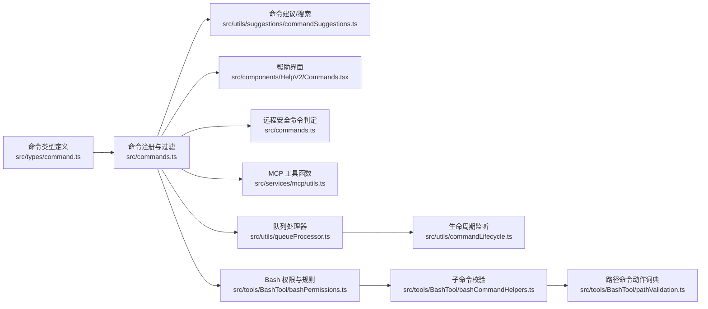

# 命令类型与分类

<cite>
**本文引用的文件**
- [src/types/command.ts](file://src/types/command.ts)
- [src/commands.ts](file://src/commands.ts)
- [src/commands/help/index.ts](file://src/commands/help/index.ts)
- [src/commands/config/index.ts](file://src/commands/config/index.ts)
- [src/commands/compact/index.ts](file://src/commands/compact/index.ts)
- [src/commands/exit/index.ts](file://src/commands/exit/index.ts)
- [src/commands/stats/stats.tsx](file://src/commands/stats/stats.tsx)
- [src/commands/output-style/output-style.tsx](file://src/commands/output-style/output-style.tsx)
- [src/components/HelpV2/Commands.tsx](file://src/components/HelpV2/Commands.tsx)
- [src/utils/suggestions/commandSuggestions.ts](file://src/utils/suggestions/commandSuggestions.ts)
- [src/utils/commandLifecycle.ts](file://src/utils/commandLifecycle.ts)
- [src/utils/queueProcessor.ts](file://src/utils/queueProcessor.ts)
- [src/services/mcp/utils.ts](file://src/services/mcp/utils.ts)
- [src/tools/BashTool/bashPermissions.ts](file://src/tools/BashTool/bashPermissions.ts)
- [src/tools/BashTool/bashCommandHelpers.ts](file://src/tools/BashTool/bashCommandHelpers.ts)
- [src/tools/BashTool/pathValidation.ts](file://src/tools/BashTool/pathValidation.ts)
- [src/tools/PowerShellTool/prompt.ts](file://src/tools/PowerShellTool/prompt.ts)
- [src/tools/PowerShellTool/toolName.ts](file://src/tools/PowerShellTool/toolName.ts)
- [src/tools/BashTool/toolName.ts](file://src/tools/BashTool/toolName.ts)
- [src/utils/bash/commands.ts](file://src/utils/bash/commands.ts)
</cite>

## 目录
1. [引言](#引言)
2. [项目结构](#项目结构)
3. [核心组件](#核心组件)
4. [架构总览](#架构总览)
5. [详细组件分析](#详细组件分析)
6. [依赖关系分析](#依赖关系分析)
7. [性能考量](#性能考量)
8. [故障排查指南](#故障排查指南)
9. [结论](#结论)
10. [附录](#附录)

## 引言
本文件系统化梳理命令类型与分类，聚焦三类核心命令形态：prompt 命令（提示型）、local 命令（本地型）、local-jsx 命令（本地 JSX 型）。文档从类型定义、结构特征、执行流程、来源分类、可用性与权限控制、别名系统、使用示例与最佳实践、以及选择决策指南等维度进行深入说明，帮助开发者与使用者高效理解与正确运用命令体系。

## 项目结构
命令体系由“类型定义 + 命令注册与发现 + 权限与可用性控制 + 执行调度”四部分构成：
- 类型定义：统一声明命令基元、三类命令形态及其上下文参数
- 命令注册与发现：聚合内置、插件、技能、MCP 等来源，动态加载与去重
- 可用性与权限：按认证来源与运行时条件过滤；对 shell 等高风险命令进行细粒度权限校验
- 执行调度：队列处理、远程安全命令白名单、生命周期监听

图表来源
- [src/types/command.ts:1-217](file://src/types/command.ts#L1-L217)
- [src/commands.ts:256-660](file://src/commands.ts#L256-L660)
- [src/utils/suggestions/commandSuggestions.ts:41-342](file://src/utils/suggestions/commandSuggestions.ts#L41-L342)
- [src/components/HelpV2/Commands.tsx:1-52](file://src/components/HelpV2/Commands.tsx#L1-L52)
- [src/utils/queueProcessor.ts:63-95](file://src/utils/queueProcessor.ts#L63-L95)
- [src/utils/commandLifecycle.ts:1-21](file://src/utils/commandLifecycle.ts#L1-L21)
- [src/services/mcp/utils.ts:32-75](file://src/services/mcp/utils.ts#L32-L75)
- [src/tools/BashTool/bashPermissions.ts:2472-2490](file://src/tools/BashTool/bashPermissions.ts#L2472-L2490)
- [src/tools/BashTool/bashCommandHelpers.ts:84-131](file://src/tools/BashTool/bashCommandHelpers.ts#L84-L131)
- [src/tools/BashTool/pathValidation.ts:511-550](file://src/tools/BashTool/pathValidation.ts#L511-L550)
- [src/tools/PowerShellTool/prompt.ts:73-91](file://src/tools/PowerShellTool/prompt.ts#L73-L91)
- [src/tools/PowerShellTool/toolName.ts:1-2](file://src/tools/PowerShellTool/toolName.ts#L1-L2)
- [src/tools/BashTool/toolName.ts:1-2](file://src/tools/BashTool/toolName.ts#L1-L2)

章节来源
- [src/types/command.ts:1-217](file://src/types/command.ts#L1-L217)
- [src/commands.ts:256-660](file://src/commands.ts#L256-L660)

## 核心组件
- 命令类型与结构
  - prompt 命令：面向模型调用的提示型命令，支持内容长度估算、工具限制、上下文模式（内联/分叉）、路径过滤、钩子设置等
  - local 命令：纯本地执行，返回文本或压缩结果，支持非交互式调用
  - local-jsx 命令：延迟加载 UI 组件渲染，适合复杂交互与可视化展示
- 命令基元与可用性
  - 基础字段：名称、别名、描述、版本、是否隐藏、是否禁用模型调用、用户可调用性、来源标记、敏感参数等
  - 可用性：按认证来源（claude.ai 订阅者、Console 直连）过滤
  - 启用状态：支持运行时启用/禁用检查
- 来源分类
  - 内置（builtin）
  - 插件（plugin）
  - 技能（skills/bundled/commands_DEPRECATED）
  - MCP（mcp）
  - 动态技能（动态注入）

章节来源
- [src/types/command.ts:25-57](file://src/types/command.ts#L25-L57)
- [src/types/command.ts:74-78](file://src/types/command.ts#L74-L78)
- [src/types/command.ts:144-152](file://src/types/command.ts#L144-L152)
- [src/types/command.ts:175-203](file://src/types/command.ts#L175-L203)
- [src/commands.ts:417-443](file://src/commands.ts#L417-L443)
- [src/commands.ts:541-581](file://src/commands.ts#L541-L581)

## 架构总览
命令从“注册与发现”到“执行与调度”的整体流程如下：

图表来源
- [src/commands.ts:476-517](file://src/commands.ts#L476-L517)
- [src/utils/suggestions/commandSuggestions.ts:41-342](file://src/utils/suggestions/commandSuggestions.ts#L41-L342)
- [src/utils/queueProcessor.ts:63-95](file://src/utils/queueProcessor.ts#L63-L95)
- [src/utils/commandLifecycle.ts:1-21](file://src/utils/commandLifecycle.ts#L1-L21)

## 详细组件分析

### prompt 命令（提示型）
- 结构要点
  - 必须为 prompt 类型，具备内容长度、进度消息、可选工具列表、上下文模式（内联/fork）、路径过滤、钩子配置等
  - 支持 disableModelInvocation 控制是否允许模型调用
  - 支持 loadedFrom 标记来源（如 mcp），便于区分与过滤
- 执行方式
  - 通过 getPromptForCommand(args, context) 生成模型可见的内容块，不直接产生用户可见输出
  - 可在 fork 模式下以子代理运行，隔离上下文与预算
- 适用场景
  - 需要模型参与的复杂工作流、策略性任务、跨工具协作
  - 作为 SkillTool 的能力来源，供模型自动选择与调用
- 来源分类
  - 内置、插件、技能目录、捆绑技能、MCP 等
  - MCP 技能可通过 getMcpSkillCommands 过滤出 prompt 且未禁用模型调用的条目
- 示例与最佳实践
  - 使用时明确指定上下文模式与工具限制，避免不必要的 token 消耗
  - 对于需要外部资源的技能，合理设置 paths 以提升可见性与相关性
  - 将描述与 whenToUse 写清楚，有助于模型理解使用时机

图表来源
- [src/types/command.ts:25-57](file://src/types/command.ts#L25-L57)
- [src/types/command.ts:175-203](file://src/types/command.ts#L175-L203)

章节来源
- [src/types/command.ts:25-57](file://src/types/command.ts#L25-L57)
- [src/commands.ts:541-581](file://src/commands.ts#L541-L581)

### local 命令（本地型）
- 结构要点
  - 必须为 local 类型，支持 Non-Interactive 调用（supportsNonInteractive）
  - 返回 LocalCommandResult：文本、压缩结果或跳过
  - 适合无 UI、纯文本输出的本地操作
- 执行方式
  - 通过 load() 延迟导入实现模块，减少启动开销
  - 在队列中按模式批量处理，保证错误隔离与进度反馈
- 适用场景
  - 清理会话历史、显示统计信息、列出受跟踪文件、紧凑化上下文等
  - 移动端/远程模式下安全命令的首选
- 示例与最佳实践
  - 对可能影响环境的命令，优先采用 Non-Interactive 模式以适配自动化
  - 输出应简洁明确，必要时提供 argumentHint 提示

图表来源
- [src/commands/compact/index.ts:1-16](file://src/commands/compact/index.ts#L1-L16)
- [src/types/command.ts:16-24](file://src/types/command.ts#L16-L24)
- [src/utils/queueProcessor.ts:63-95](file://src/utils/queueProcessor.ts#L63-L95)

章节来源
- [src/commands/compact/index.ts:1-16](file://src/commands/compact/index.ts#L1-L16)
- [src/types/command.ts:74-78](file://src/types/command.ts#L74-L78)
- [src/utils/queueProcessor.ts:63-95](file://src/utils/queueProcessor.ts#L63-L95)

### local-jsx 命令（本地 JSX 型）
- 结构要点
  - 必须为 local-jsx 类型，通过 load() 返回包含 call 的模块
  - call(onDone, context, args) 支持回调 onDone 以控制结果展示与后续输入
  - 适合复杂 UI 交互、多步骤引导、可视化展示
- 执行方式
  - 延迟加载，渲染 React 组件，onDone 控制显示模式（跳过/系统/用户）
  - 常用于面板打开、对话框展示、状态查看等
- 适用场景
  - 配置面板、统计视图、帮助界面等需要交互与可视化的场景
- 示例与最佳实践
  - 使用 onDone 的 display 选项控制消息可见性
  - 对需要继续输入的场景，合理设置 nextInput 与 submitNextInput

图表来源
- [src/types/command.ts:144-152](file://src/types/command.ts#L144-L152)
- [src/types/command.ts:117-135](file://src/types/command.ts#L117-L135)
- [src/commands/help/index.ts:1-10](file://src/commands/help/index.ts#L1-L10)
- [src/commands/config/index.ts:1-12](file://src/commands/config/index.ts#L1-L12)
- [src/commands/stats/stats.tsx:1-7](file://src/commands/stats/stats.tsx#L1-L7)
- [src/commands/output-style/output-style.tsx:1-7](file://src/commands/output-style/output-style.tsx#L1-L7)

章节来源
- [src/commands/help/index.ts:1-10](file://src/commands/help/index.ts#L1-L10)
- [src/commands/config/index.ts:1-12](file://src/commands/config/index.ts#L1-L12)
- [src/commands/exit/index.ts:1-13](file://src/commands/exit/index.ts#L1-L13)
- [src/commands/stats/stats.tsx:1-7](file://src/commands/stats/stats.tsx#L1-L7)
- [src/commands/output-style/output-style.tsx:1-7](file://src/commands/output-style/output-style.tsx#L1-L7)

### 别名系统与可用性要求
- 别名系统
  - 命令可配置 aliases 字段，支持多名称匹配
  - 命令建议与搜索同时索引主名与别名，提升发现率
- 可用性要求
  - availability 支持按认证来源过滤（claude-ai、console）
  - meetsAvailabilityRequirement 在每次获取命令列表时重新评估
  - isCommandEnabled 支持运行时启用/禁用检查

图表来源
- [src/commands.ts:688-719](file://src/commands.ts#L688-L719)
- [src/utils/suggestions/commandSuggestions.ts:41-342](file://src/utils/suggestions/commandSuggestions.ts#L41-L342)

章节来源
- [src/commands.ts:417-443](file://src/commands.ts#L417-L443)
- [src/commands.ts:688-719](file://src/commands.ts#L688-L719)
- [src/utils/suggestions/commandSuggestions.ts:41-342](file://src/utils/suggestions/commandSuggestions.ts#L41-L342)

### 权限控制机制（以 Bash 为例）
- 规则匹配
  - 支持前缀、通配符、精确匹配三种规则
  - 建议生成：针对精确命令、前缀分别生成更新建议
- 子命令级校验
  - 将复合命令拆分为子段，逐段校验，任一拒绝即拒绝整条命令
  - 允许时返回合并后的决策原因，便于审计
- 路径命令动作词典
  - 为常见路径操作（cd、ls、find、mkdir、cat、grep 等）提供动作语义映射，辅助安全判断

图表来源
- [src/tools/BashTool/bashPermissions.ts:2472-2490](file://src/tools/BashTool/bashPermissions.ts#L2472-L2490)
- [src/tools/BashTool/bashCommandHelpers.ts:84-131](file://src/tools/BashTool/bashCommandHelpers.ts#L84-L131)
- [src/utils/bash/commands.ts:371-411](file://src/utils/bash/commands.ts#L371-L411)
- [src/tools/BashTool/pathValidation.ts:511-550](file://src/tools/BashTool/pathValidation.ts#L511-L550)

章节来源
- [src/tools/BashTool/bashPermissions.ts:2472-2490](file://src/tools/BashTool/bashPermissions.ts#L2472-L2490)
- [src/tools/BashTool/bashCommandHelpers.ts:84-131](file://src/tools/BashTool/bashCommandHelpers.ts#L84-L131)
- [src/utils/bash/commands.ts:371-411](file://src/utils/bash/commands.ts#L371-L411)
- [src/tools/BashTool/pathValidation.ts:511-550](file://src/tools/BashTool/pathValidation.ts#L511-L550)

### 命令来源分类（内置、插件、技能、MCP）
- 内置（builtin）
  - 由框架自带的命令，如 /help、/config、/stats 等
- 插件（plugin）
  - 通过插件系统注册的命令，描述中可标注插件来源
- 技能（skills/bundled/commands_DEPRECATED）
  - 技能目录、捆绑技能、历史遗留命令条目
- MCP（mcp）
  - 通过 MCP 协议提供的命令与技能，命名遵循特定前缀与格式
  - 可通过工具函数按服务器筛选与归类

章节来源
- [src/commands.ts:541-581](file://src/commands.ts#L541-L581)
- [src/services/mcp/utils.ts:32-75](file://src/services/mcp/utils.ts#L32-L75)
- [src/commands.ts:728-754](file://src/commands.ts#L728-L754)

### 命令执行与远程安全
- 远程安全命令白名单
  - REMOTE_SAFE_COMMANDS：仅影响本地 TUI 状态的命令
  - BRIDGE_SAFE_COMMANDS：允许通过远程桥接收的本地命令
  - isBridgeSafeCommand：综合类型与白名单判定
- 队列处理
  - 斜杠命令与 bash 模式命令单独处理，保证错误隔离与进度 UI
  - 非斜杠命令同模式批量处理，提升吞吐

章节来源
- [src/commands.ts:619-676](file://src/commands.ts#L619-L676)
- [src/utils/queueProcessor.ts:63-95](file://src/utils/queueProcessor.ts#L63-L95)

### 命令生命周期与监控
- 生命周期监听
  - setCommandLifecycleListener 注册监听器
  - notifyCommandLifecycle 在开始/完成时触发
- 应用场景
  - 统计命令使用频次、追踪执行耗时、触发后续动作

章节来源
- [src/utils/commandLifecycle.ts:1-21](file://src/utils/commandLifecycle.ts#L1-L21)

## 依赖关系分析

图表来源
- [src/types/command.ts:1-217](file://src/types/command.ts#L1-L217)
- [src/commands.ts:256-660](file://src/commands.ts#L256-L660)
- [src/utils/suggestions/commandSuggestions.ts:41-342](file://src/utils/suggestions/commandSuggestions.ts#L41-L342)
- [src/components/HelpV2/Commands.tsx:1-52](file://src/components/HelpV2/Commands.tsx#L1-L52)
- [src/services/mcp/utils.ts:32-75](file://src/services/mcp/utils.ts#L32-L75)
- [src/utils/queueProcessor.ts:63-95](file://src/utils/queueProcessor.ts#L63-L95)
- [src/utils/commandLifecycle.ts:1-21](file://src/utils/commandLifecycle.ts#L1-L21)
- [src/tools/BashTool/bashPermissions.ts:2472-2490](file://src/tools/BashTool/bashPermissions.ts#L2472-L2490)
- [src/tools/BashTool/bashCommandHelpers.ts:84-131](file://src/tools/BashTool/bashCommandHelpers.ts#L84-L131)
- [src/tools/BashTool/pathValidation.ts:511-550](file://src/tools/BashTool/pathValidation.ts#L511-L550)

章节来源
- [src/commands.ts:256-660](file://src/commands.ts#L256-L660)

## 性能考量
- 延迟加载
  - local-jsx 与 local 命令均通过 load() 延迟导入，降低启动时的内存与 CPU 开销
- 缓存与去重
  - 命令加载与技能索引采用 memoize 缓存，动态技能去重后插入合适位置
- 队列批处理
  - 非斜杠命令同模式批量处理，减少调度开销与 UI 抖动
- 权限短路
  - 子命令级权限校验在拒绝时提前返回，避免无效计算

章节来源
- [src/types/command.ts:144-152](file://src/types/command.ts#L144-L152)
- [src/commands.ts:449-517](file://src/commands.ts#L449-L517)
- [src/utils/queueProcessor.ts:63-95](file://src/utils/queueProcessor.ts#L63-L95)
- [src/tools/BashTool/bashCommandHelpers.ts:84-131](file://src/tools/BashTool/bashCommandHelpers.ts#L84-L131)

## 故障排查指南
- 命令不可见
  - 检查 availability 是否与当前认证来源匹配
  - 检查 isEnabled 是否返回 true
  - 检查是否被 isHidden 标记为隐藏
- 命令无法执行
  - 对于 Bash/PowerShell 等高风险命令，确认权限规则是否允许
  - 复合命令被拒绝时，查看子命令拒绝原因
- 命令输出不符合预期
  - 对于 local-jsx 命令，检查 onDone 的 display 选项与 metaMessages
  - 对于 prompt 命令，检查 getPromptForCommand 的内容构造与工具限制
- 远程/移动端不可用
  - 确认命令类型与是否在 BRIDGE_SAFE_COMMANDS 中
  - 确认是否属于 REMOTE_SAFE_COMMANDS

章节来源
- [src/commands.ts:417-443](file://src/commands.ts#L417-L443)
- [src/commands.ts:619-676](file://src/commands.ts#L619-L676)
- [src/tools/BashTool/bashPermissions.ts:2472-2490](file://src/tools/BashTool/bashPermissions.ts#L2472-L2490)
- [src/tools/BashTool/bashCommandHelpers.ts:84-131](file://src/tools/BashTool/bashCommandHelpers.ts#L84-L131)

## 结论
命令类型与分类围绕“prompt/local/local-jsx”三大形态展开，配合严格的来源标记、可用性与权限控制、延迟加载与缓存优化，形成一套可扩展、可审计、可远程安全使用的命令体系。在实际使用中，应根据场景选择合适的命令类型，并遵循最佳实践以确保安全性与性能。

## 附录

### 命令类型选择决策指南
- 选择 prompt 命令
  - 当需要模型参与、跨工具协作、策略性任务时
  - 当希望命令被模型自动调用时
- 选择 local 命令
  - 当需要纯文本输出、本地执行、可非交互式调用时
  - 当命令对远程/移动端安全且无需 UI 时
- 选择 local-jsx 命令
  - 当需要复杂交互、可视化展示、多步骤引导时
  - 当命令需渲染 React 组件并与用户持续交互时

### 常用命令示例与最佳实践
- /help（local-jsx）
  - 用途：展示帮助与可用命令
  - 最佳实践：保持描述简洁，利用别名提升易用性
- /config（local-jsx）
  - 用途：打开配置面板
  - 最佳实践：通过 onDone 控制显示模式，避免泄露敏感信息
- /compact（local）
  - 用途：清理会话历史但保留摘要
  - 最佳实践：提供 argumentHint，明确可选的总结指令
- /stats（local-jsx）
  - 用途：展示统计信息
  - 最佳实践：在 onClose 中通过 onDone 回传简要总结
- /exit（local-jsx）
  - 用途：退出 REPL
  - 最佳实践：设置 immediate 以快速响应

章节来源
- [src/commands/help/index.ts:1-10](file://src/commands/help/index.ts#L1-L10)
- [src/commands/config/index.ts:1-12](file://src/commands/config/index.ts#L1-L12)
- [src/commands/compact/index.ts:1-16](file://src/commands/compact/index.ts#L1-L16)
- [src/commands/stats/stats.tsx:1-7](file://src/commands/stats/stats.tsx#L1-L7)
- [src/commands/exit/index.ts:1-13](file://src/commands/exit/index.ts#L1-L13)