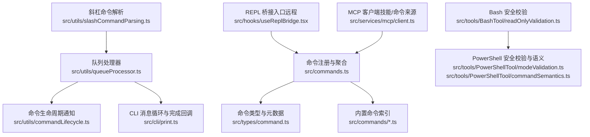
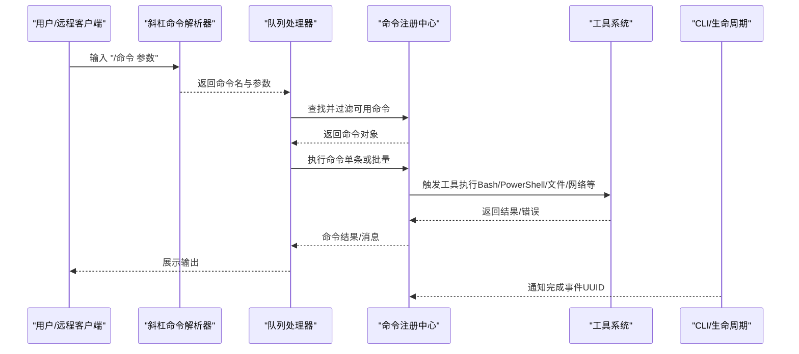
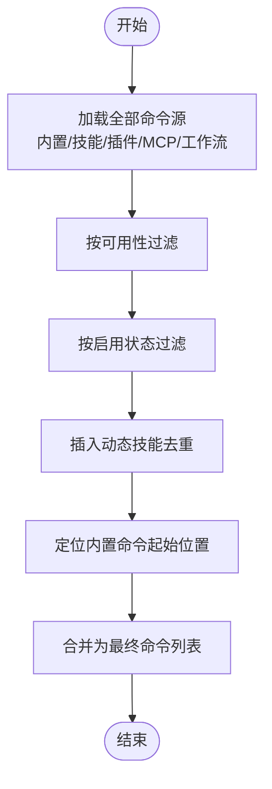
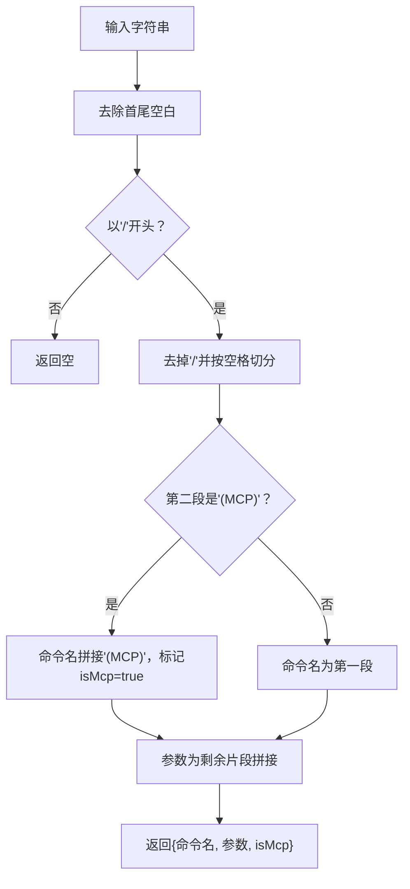
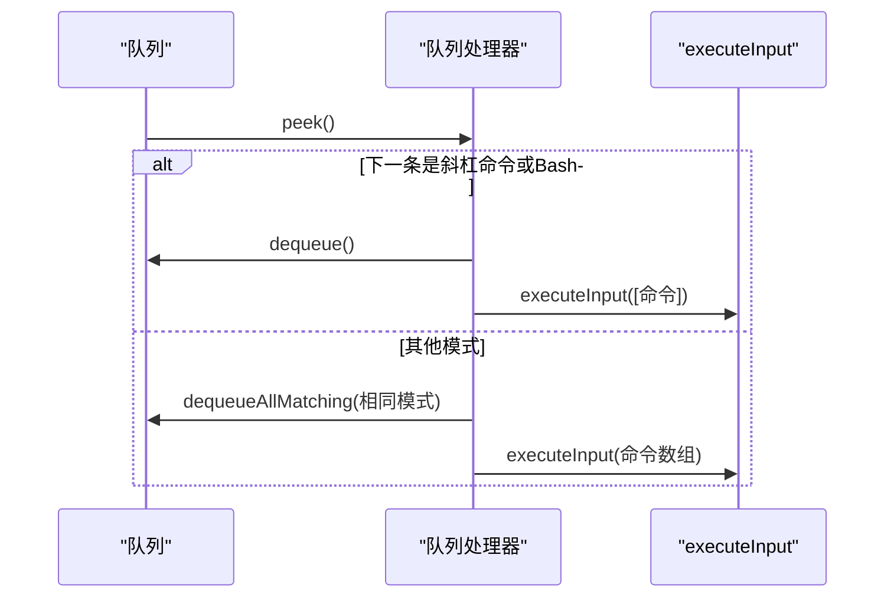
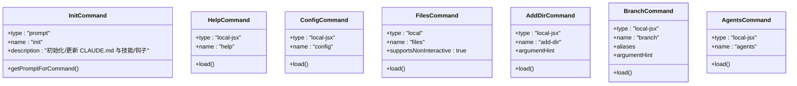
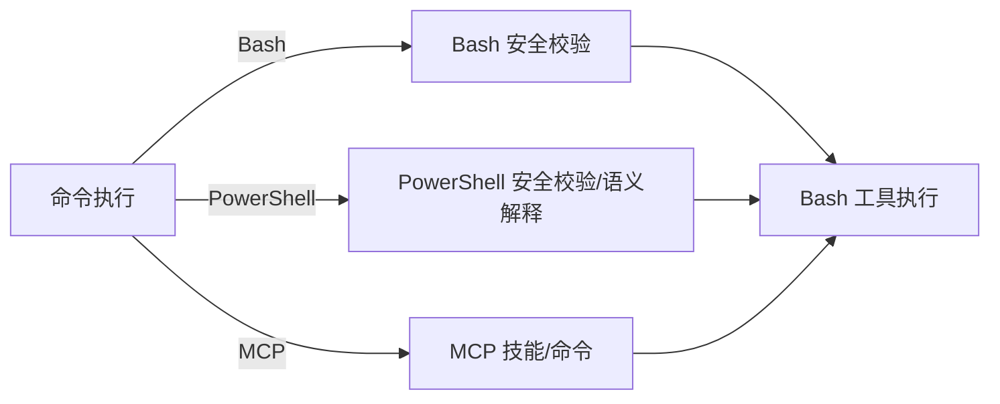
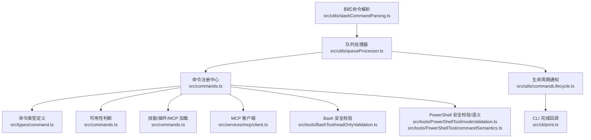

# 命令系统

<cite>
**本文引用的文件**
- [src/commands.ts](file://src/commands.ts)
- [src/types/command.ts](file://src/types/command.ts)
- [src/utils/slashCommandParsing.ts](file://src/utils/slashCommandParsing.ts)
- [src/utils/queueProcessor.ts](file://src/utils/queueProcessor.ts)
- [src/commands/init.ts](file://src/commands/init.ts)
- [src/commands/help/index.ts](file://src/commands/help/index.ts)
- [src/commands/config/index.ts](file://src/commands/config/index.ts)
- [src/commands/files/index.ts](file://src/commands/files/index.ts)
- [src/commands/add-dir/index.ts](file://src/commands/add-dir/index.ts)
- [src/commands/branch/index.ts](file://src/commands/branch/index.ts)
- [src/commands/agents/index.ts](file://src/commands/agents/index.ts)
- [src/utils/commandLifecycle.ts](file://src/utils/commandLifecycle.ts)
- [src/cli/print.ts](file://src/cli/print.ts)
- [src/hooks/useReplBridge.tsx](file://src/hooks/useReplBridge.tsx)
- [src/services/mcp/client.ts](file://src/services/mcp/client.ts)
- [src/tools/BashTool/readOnlyValidation.ts](file://src/tools/BashTool/readOnlyValidation.ts)
- [src/tools/PowerShellTool/modeValidation.ts](file://src/tools/PowerShellTool/modeValidation.ts)
- [src/tools/PowerShellTool/commandSemantics.ts](file://src/tools/PowerShellTool/commandSemantics.ts)
</cite>

## 目录
1. [简介](#简介)
2. [项目结构](#项目结构)
3. [核心组件](#核心组件)
4. [架构总览](#架构总览)
5. [详细组件分析](#详细组件分析)
6. [依赖分析](#依赖分析)
7. [性能考虑](#性能考虑)
8. [故障排查指南](#故障排查指南)
9. [结论](#结论)
10. [附录](#附录)

## 简介
本文件系统性阐述 Claude Code 的命令系统：命令注册机制、命令解析流程、命令执行管道；内置命令的分类与功能；命令参数解析、验证与处理；自定义命令开发指南；命令执行的错误处理与调试方法；命令与工具系统的集成关系及触发机制。目标是帮助开发者快速理解并扩展命令系统。

## 项目结构
命令系统由“命令注册与聚合”“命令类型与元数据”“命令解析与队列执行”“内置命令集合”“与工具系统集成”五部分组成，并通过缓存与可用性过滤保障性能与安全。

**图表来源**
- [src/commands.ts:256-517](file://src/commands.ts#L256-L517)
- [src/types/command.ts:16-217](file://src/types/command.ts#L16-L217)
- [src/utils/slashCommandParsing.ts:25-60](file://src/utils/slashCommandParsing.ts#L25-L60)
- [src/utils/queueProcessor.ts:52-87](file://src/utils/queueProcessor.ts#L52-L87)
- [src/utils/commandLifecycle.ts:16-21](file://src/utils/commandLifecycle.ts#L16-L21)
- [src/cli/print.ts:2813-2828](file://src/cli/print.ts#L2813-L2828)
- [src/hooks/useReplBridge.tsx:210-221](file://src/hooks/useReplBridge.tsx#L210-L221)
- [src/services/mcp/client.ts:2080-2107](file://src/services/mcp/client.ts#L2080-L2107)
- [src/tools/BashTool/readOnlyValidation.ts:1246-1280](file://src/tools/BashTool/readOnlyValidation.ts#L1246-L1280)
- [src/tools/PowerShellTool/modeValidation.ts:244-268](file://src/tools/PowerShellTool/modeValidation.ts#L244-L268)
- [src/tools/PowerShellTool/commandSemantics.ts:130-142](file://src/tools/PowerShellTool/commandSemantics.ts#L130-L142)

**章节来源**
- [src/commands.ts:256-517](file://src/commands.ts#L256-L517)
- [src/types/command.ts:16-217](file://src/types/command.ts#L16-L217)
- [src/utils/slashCommandParsing.ts:25-60](file://src/utils/slashCommandParsing.ts#L25-L60)
- [src/utils/queueProcessor.ts:52-87](file://src/utils/queueProcessor.ts#L52-L87)
- [src/utils/commandLifecycle.ts:16-21](file://src/utils/commandLifecycle.ts#L16-L21)
- [src/cli/print.ts:2813-2828](file://src/cli/print.ts#L2813-L2828)
- [src/hooks/useReplBridge.tsx:210-221](file://src/hooks/useReplBridge.tsx#L210-L221)
- [src/services/mcp/client.ts:2080-2107](file://src/services/mcp/client.ts#L2080-L2107)
- [src/tools/BashTool/readOnlyValidation.ts:1246-1280](file://src/tools/BashTool/readOnlyValidation.ts#L1246-L1280)
- [src/tools/PowerShellTool/modeValidation.ts:244-268](file://src/tools/PowerShellTool/modeValidation.ts#L244-L268)
- [src/tools/PowerShellTool/commandSemantics.ts:130-142](file://src/tools/PowerShellTool/commandSemantics.ts#L130-L142)

## 核心组件
- 命令注册与聚合：集中导出与缓存所有命令，按可用性与启用状态过滤，动态注入技能与插件命令，支持远程模式安全命令集。
- 命令类型与元数据：统一声明命令类型（prompt、local、local-jsx），提供描述、别名、来源、是否可被模型调用、路径过滤、上下文模式等。
- 命令解析与队列执行：斜杠命令解析器拆分命令名与参数；队列处理器按模式批处理或单条处理，保证 Bash 命令的隔离与进度反馈。
- 内置命令集合：覆盖初始化、帮助、配置、文件列表、目录添加、分支/派生会话、代理管理等常用能力。
- 工具系统集成：命令可触发 Bash/PowerShell/文件读写/搜索/网络请求等工具，配合安全校验与语义解释。

**章节来源**
- [src/commands.ts:256-517](file://src/commands.ts#L256-L517)
- [src/types/command.ts:16-217](file://src/types/command.ts#L16-L217)
- [src/utils/slashCommandParsing.ts:25-60](file://src/utils/slashCommandParsing.ts#L25-L60)
- [src/utils/queueProcessor.ts:52-87](file://src/utils/queueProcessor.ts#L52-L87)

## 架构总览
命令系统以“命令注册中心”为核心，围绕“解析—过滤—执行—通知—工具调用”的流水线运行。远程桥接与 MCP 技能来源为命令生态提供扩展点。

**图表来源**
- [src/utils/slashCommandParsing.ts:25-60](file://src/utils/slashCommandParsing.ts#L25-L60)
- [src/utils/queueProcessor.ts:52-87](file://src/utils/queueProcessor.ts#L52-L87)
- [src/commands.ts:476-517](file://src/commands.ts#L476-L517)
- [src/cli/print.ts:2813-2828](file://src/cli/print.ts#L2813-L2828)

## 详细组件分析

### 命令注册与聚合（commands.ts）
- 统一导入与条件加载：内置命令、特性开关命令、技能/插件/MCP 来源命令，均在内存中聚合为数组。
- 可用性与启用过滤：按 provider/订阅者身份过滤；每次查询重新评估，确保登录态变化即时生效。
- 动态技能插入：在插件技能之后、内置命令之前去重插入动态发现的技能。
- 远程/桥接安全命令集：明确允许从移动端/网页端桥接执行的命令白名单。
- 缓存策略：对命令加载与技能索引进行 memoize，避免重复 I/O 与动态导入开销。

**图表来源**
- [src/commands.ts:449-469](file://src/commands.ts#L449-L469)
- [src/commands.ts:476-517](file://src/commands.ts#L476-L517)

**章节来源**
- [src/commands.ts:256-517](file://src/commands.ts#L256-L517)

### 命令类型与元数据（types/command.ts）
- 命令类型
  - prompt：面向模型的提示型命令，可生成内容块，支持路径过滤、上下文模式（内联/派生）、是否禁用模型调用等。
  - local：本地命令，延迟加载实现，支持非交互执行。
  - local-jsx：本地 JSX 命令，延迟加载 UI 实现，适合渲染交互界面。
- 元数据字段：名称、别名、描述、来源（内置/插件/MCP/技能等）、可用性要求、是否隐藏、版本、敏感参数等。
- 结果与显示：本地命令返回文本、紧凑压缩结果或跳过；可配置结果显示方式与是否继续向模型提问。

**章节来源**
- [src/types/command.ts:16-217](file://src/types/command.ts#L16-L217)

### 斜杠命令解析（utils/slashCommandParsing.ts）
- 将输入字符串解析为命令名、参数与是否为 MCP 命令标记。
- 支持“/命令 (MCP) 参数”格式，便于区分本地命令与 MCP 命令。

**图表来源**
- [src/utils/slashCommandParsing.ts:25-60](file://src/utils/slashCommandParsing.ts#L25-L60)

**章节来源**
- [src/utils/slashCommandParsing.ts:25-60](file://src/utils/slashCommandParsing.ts#L25-L60)

### 队列处理器与执行管道（utils/queueProcessor.ts）
- 判定是否斜杠命令或 Bash 模式：斜杠命令与 Bash 命令逐条执行，保证错误隔离与进度 UI。
- 非斜杠命令按模式批处理：同模式的多个命令一次性传入执行，每个命令独立 UUID。
- 主线程过滤：避免子代理消息误入主线程队列导致卡死。

**图表来源**
- [src/utils/queueProcessor.ts:52-87](file://src/utils/queueProcessor.ts#L52-L87)

**章节来源**
- [src/utils/queueProcessor.ts:52-87](file://src/utils/queueProcessor.ts#L52-L87)

### 命令生命周期与 CLI 完成通知（utils/commandLifecycle.ts, cli/print.ts）
- 生命周期监听：设置监听器，接收命令启动/完成事件。
- CLI 消息循环：在非用户事件与控制响应之外，收到结构化输入时通知完成，用于统计与诊断。

**章节来源**
- [src/utils/commandLifecycle.ts:16-21](file://src/utils/commandLifecycle.ts#L16-L21)
- [src/cli/print.ts:2813-2828](file://src/cli/print.ts#L2813-L2828)

### 内置命令示例与分类
- 初始化命令（init）：引导生成/更新 CLAUDE.md、个人偏好、技能与钩子，支持新旧两种流程。
- 帮助命令（help）：打开帮助面板，列出可用命令。
- 配置命令（config）：打开配置面板。
- 文件相关（files）：列出当前上下文中受管文件。
- 目录管理（add-dir）：添加新的工作目录。
- 分支/派生（branch）：在当前会话点创建分支（或别名 fork）。
- 代理管理（agents）：管理代理配置。

**图表来源**
- [src/commands/init.ts:226-257](file://src/commands/init.ts#L226-L257)
- [src/commands/help/index.ts:3-11](file://src/commands/help/index.ts#L3-L11)
- [src/commands/config/index.ts:3-12](file://src/commands/config/index.ts#L3-L12)
- [src/commands/files/index.ts:3-13](file://src/commands/files/index.ts#L3-L13)
- [src/commands/add-dir/index.ts:3-12](file://src/commands/add-dir/index.ts#L3-L12)
- [src/commands/branch/index.ts:4-15](file://src/commands/branch/index.ts#L4-L15)
- [src/commands/agents/index.ts:3-11](file://src/commands/agents/index.ts#L3-L11)

**章节来源**
- [src/commands/init.ts:226-257](file://src/commands/init.ts#L226-L257)
- [src/commands/help/index.ts:3-11](file://src/commands/help/index.ts#L3-L11)
- [src/commands/config/index.ts:3-12](file://src/commands/config/index.ts#L3-L12)
- [src/commands/files/index.ts:3-13](file://src/commands/files/index.ts#L3-L13)
- [src/commands/add-dir/index.ts:3-12](file://src/commands/add-dir/index.ts#L3-L12)
- [src/commands/branch/index.ts:4-15](file://src/commands/branch/index.ts#L4-L15)
- [src/commands/agents/index.ts:3-11](file://src/commands/agents/index.ts#L3-L11)

### 命令与工具系统的集成
- Bash 工具：命令经只读安全校验后执行，失败时根据退出码与输出进行语义解释，必要时回退到交互确认。
- PowerShell 工具：在表达式源、控制流语句、非管道重定向等场景下采取“透传”或拒绝策略，避免静态不可验证风险。
- MCP 技能：MCP 提供的命令作为“技能”注入，可被模型调用或用户触发，支持跨服务能力扩展。

**图表来源**
- [src/tools/BashTool/readOnlyValidation.ts:1246-1280](file://src/tools/BashTool/readOnlyValidation.ts#L1246-L1280)
- [src/tools/PowerShellTool/modeValidation.ts:244-268](file://src/tools/PowerShellTool/modeValidation.ts#L244-L268)
- [src/tools/PowerShellTool/commandSemantics.ts:130-142](file://src/tools/PowerShellTool/commandSemantics.ts#L130-L142)
- [src/services/mcp/client.ts:2080-2107](file://src/services/mcp/client.ts#L2080-L2107)

**章节来源**
- [src/tools/BashTool/readOnlyValidation.ts:1246-1280](file://src/tools/BashTool/readOnlyValidation.ts#L1246-L1280)
- [src/tools/PowerShellTool/modeValidation.ts:244-268](file://src/tools/PowerShellTool/modeValidation.ts#L244-L268)
- [src/tools/PowerShellTool/commandSemantics.ts:130-142](file://src/tools/PowerShellTool/commandSemantics.ts#L130-L142)
- [src/services/mcp/client.ts:2080-2107](file://src/services/mcp/client.ts#L2080-L2107)

## 依赖分析
- 命令注册中心依赖：命令类型定义、可用性判断、特性开关、技能/插件/MCP 加载器。
- 解析与执行链路：解析器依赖队列处理器；队列处理器依赖执行入口与生命周期通知。
- 工具侧依赖：Bash/PowerShell 安全校验与语义解释，MCP 客户端负责拉取 MCP 命令。

**图表来源**
- [src/commands.ts:256-517](file://src/commands.ts#L256-L517)
- [src/types/command.ts:16-217](file://src/types/command.ts#L16-L217)
- [src/utils/slashCommandParsing.ts:25-60](file://src/utils/slashCommandParsing.ts#L25-L60)
- [src/utils/queueProcessor.ts:52-87](file://src/utils/queueProcessor.ts#L52-L87)
- [src/utils/commandLifecycle.ts:16-21](file://src/utils/commandLifecycle.ts#L16-L21)
- [src/cli/print.ts:2813-2828](file://src/cli/print.ts#L2813-L2828)
- [src/services/mcp/client.ts:2080-2107](file://src/services/mcp/client.ts#L2080-L2107)
- [src/tools/BashTool/readOnlyValidation.ts:1246-1280](file://src/tools/BashTool/readOnlyValidation.ts#L1246-L1280)
- [src/tools/PowerShellTool/modeValidation.ts:244-268](file://src/tools/PowerShellTool/modeValidation.ts#L244-L268)
- [src/tools/PowerShellTool/commandSemantics.ts:130-142](file://src/tools/PowerShellTool/commandSemantics.ts#L130-L142)

**章节来源**
- [src/commands.ts:256-517](file://src/commands.ts#L256-L517)
- [src/utils/slashCommandParsing.ts:25-60](file://src/utils/slashCommandParsing.ts#L25-L60)
- [src/utils/queueProcessor.ts:52-87](file://src/utils/queueProcessor.ts#L52-L87)
- [src/utils/commandLifecycle.ts:16-21](file://src/utils/commandLifecycle.ts#L16-L21)
- [src/cli/print.ts:2813-2828](file://src/cli/print.ts#L2813-L2828)
- [src/services/mcp/client.ts:2080-2107](file://src/services/mcp/client.ts#L2080-L2107)
- [src/tools/BashTool/readOnlyValidation.ts:1246-1280](file://src/tools/BashTool/readOnlyValidation.ts#L1246-L1280)
- [src/tools/PowerShellTool/modeValidation.ts:244-268](file://src/tools/PowerShellTool/modeValidation.ts#L244-L268)
- [src/tools/PowerShellTool/commandSemantics.ts:130-142](file://src/tools/PowerShellTool/commandSemantics.ts#L130-L142)

## 性能考虑
- 命令加载与技能索引 memoize：避免重复磁盘 I/O 与动态导入成本。
- 可用性与启用状态实时评估：登录态变化时即时生效，无需重启。
- 队列批处理：同模式命令批量执行，减少上下文切换与消息开销。
- 远程模式预过滤：在 REPL 渲染前剔除本地命令，降低桥接端等待时间。

[本节为通用建议，不直接分析具体文件]

## 故障排查指南
- 命令未出现/不可用
  - 检查可用性要求与启用状态：确认 provider/订阅者身份满足条件。
  - 检查特性开关与环境变量：某些命令仅在特定 feature 下启用。
- 命令执行失败
  - Bash/PowerShell 安全校验：查看是否因表达式源、控制流或重定向导致拒绝。
  - MCP 命令：检查 MCP 服务器连接与权限。
- 远程/桥接不可用
  - 确认命令类型与安全白名单：仅 prompt 与 local-jsx 中允许的 local 命令可在桥接端执行。
- 生命周期与诊断
  - 使用命令生命周期监听与 CLI 完成回调，定位命令完成事件与诊断日志。

**章节来源**
- [src/commands.ts:417-443](file://src/commands.ts#L417-L443)
- [src/commands.ts:619-686](file://src/commands.ts#L619-L686)
- [src/utils/commandLifecycle.ts:16-21](file://src/utils/commandLifecycle.ts#L16-L21)
- [src/cli/print.ts:2813-2828](file://src/cli/print.ts#L2813-L2828)
- [src/tools/BashTool/readOnlyValidation.ts:1246-1280](file://src/tools/BashTool/readOnlyValidation.ts#L1246-L1280)
- [src/tools/PowerShellTool/modeValidation.ts:244-268](file://src/tools/PowerShellTool/modeValidation.ts#L244-L268)

## 结论
命令系统通过“注册—解析—过滤—执行—通知—工具调用”的闭环，实现了高扩展、强安全与良好性能。内置命令覆盖开发日常高频场景，结合特性开关、MCP 与插件生态，可灵活适配不同用户与环境需求。建议在扩展时遵循类型定义、安全校验与可用性约束，确保一致性与稳定性。

[本节为总结性内容，不直接分析具体文件]

## 附录

### 自定义命令开发指南
- 类型选择
  - prompt：需要生成内容给模型或用户显示，支持路径过滤与上下文模式。
  - local：纯本地逻辑，支持非交互执行。
  - local-jsx：需要渲染 UI，延迟加载模块。
- 元数据配置
  - 必填：name、description。
  - 可选：aliases、argumentHint、availability、isEnabled、isHidden、disableModelInvocation、loadedFrom、kind、immediate、isSensitive、userFacingName。
- 注册与发布
  - 在命令注册中心导出并加入聚合数组，确保缓存与可用性过滤生效。
  - 如需远程/桥接安全，纳入安全白名单。
- 参数解析与验证
  - 对于 Bash/PowerShell 命令，遵循只读安全校验与语义解释规则。
  - 对于 MCP 命令，确保来源标记与权限配置正确。

**章节来源**
- [src/types/command.ts:16-217](file://src/types/command.ts#L16-L217)
- [src/commands.ts:256-517](file://src/commands.ts#L256-L517)

### 常见命令使用示例与最佳实践
- 初始化项目：使用 init 命令生成/更新 CLAUDE.md、个人偏好与技能/钩子。
- 查看帮助：使用 help 命令浏览可用命令与快捷键。
- 打开配置：使用 config 命令调整主题、颜色、键位等。
- 列出上下文文件：使用 files 命令快速查看当前会话受管文件。
- 添加工作目录：使用 add-dir 命令扩展工作空间。
- 分支会话：使用 branch 命令在当前节点创建分支，便于并行探索。
- 代理管理：使用 agents 命令配置与切换代理角色。

**章节来源**
- [src/commands/init.ts:226-257](file://src/commands/init.ts#L226-L257)
- [src/commands/help/index.ts:3-11](file://src/commands/help/index.ts#L3-L11)
- [src/commands/config/index.ts:3-12](file://src/commands/config/index.ts#L3-L12)
- [src/commands/files/index.ts:3-13](file://src/commands/files/index.ts#L3-L13)
- [src/commands/add-dir/index.ts:3-12](file://src/commands/add-dir/index.ts#L3-L12)
- [src/commands/branch/index.ts:4-15](file://src/commands/branch/index.ts#L4-L15)
- [src/commands/agents/index.ts:3-11](file://src/commands/agents/index.ts#L3-L11)