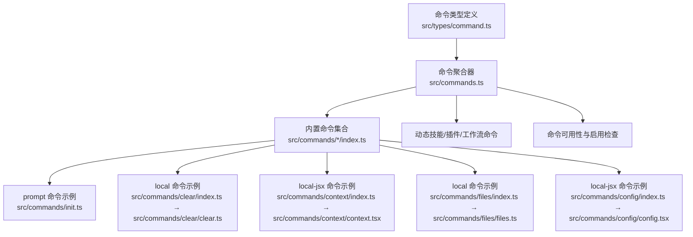
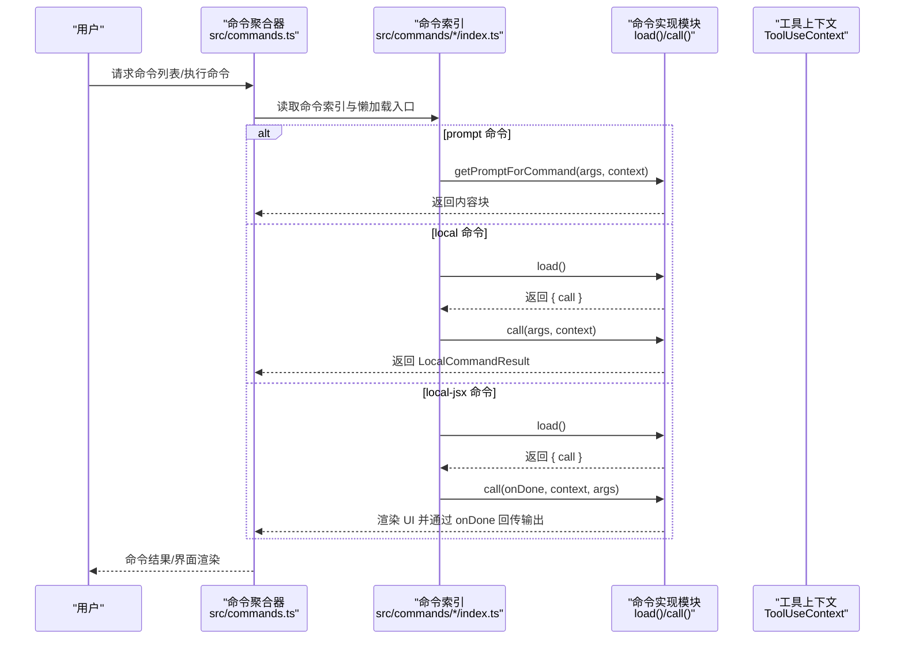
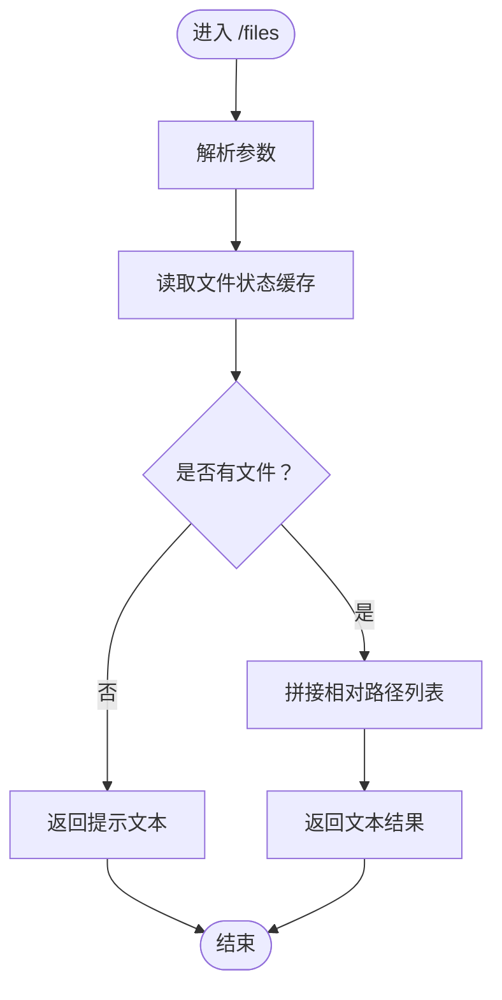
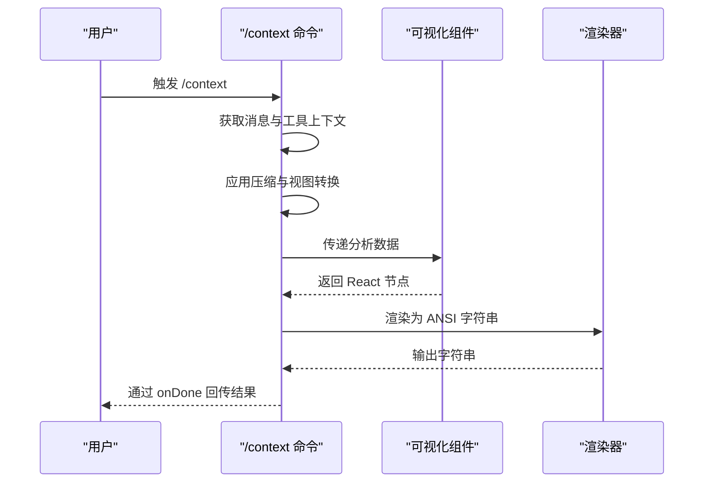
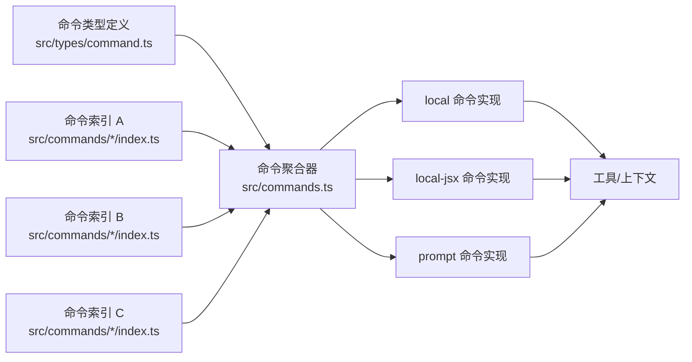

# 自定义命令开发

<cite>
**本文引用的文件**
- [src/commands.ts](file://src/commands.ts)
- [src/types/command.ts](file://src/types/command.ts)
- [src/commands/init.ts](file://src/commands/init.ts)
- [src/commands/help/index.ts](file://src/commands/help/index.ts)
- [src/commands/clear/index.ts](file://src/commands/clear/index.ts)
- [src/commands/clear/clear.ts](file://src/commands/clear/clear.ts)
- [src/commands/context/index.ts](file://src/commands/context/index.ts)
- [src/commands/context/context.tsx](file://src/commands/context/context.tsx)
- [src/commands/files/index.ts](file://src/commands/files/index.ts)
- [src/commands/files/files.ts](file://src/commands/files/files.ts)
- [src/commands/config/index.ts](file://src/commands/config/index.ts)
- [src/commands/config/config.tsx](file://src/commands/config/config.tsx)
</cite>

## 目录
1. [简介](#简介)
2. [项目结构](#项目结构)
3. [核心组件](#核心组件)
4. [架构总览](#架构总览)
5. [详细组件分析](#详细组件分析)
6. [依赖关系分析](#依赖关系分析)
7. [性能考量](#性能考量)
8. [故障排查指南](#故障排查指南)
9. [结论](#结论)
10. [附录](#附录)

## 简介
本指南面向希望在该系统中开发“自定义命令”的开发者，覆盖从命令模板、必需属性与方法、参数处理与验证，到与工具系统集成、生命周期管理、错误处理与日志记录，再到测试、调试与部署的最佳实践，并解释版本管理与向后兼容性注意事项。文档以仓库中的命令与类型定义为依据，结合具体命令示例（简单文本命令、交互式命令、文件操作命令）进行讲解。

## 项目结构
命令系统由“命令注册与聚合”“命令类型与契约”“具体命令实现”三部分组成：
- 命令注册与聚合：集中导出并按可用性与启用状态过滤命令，支持动态技能、插件技能与工作流命令的加载与合并。
- 命令类型与契约：定义命令的统一接口、本地命令与交互式命令的调用签名、结果展示策略等。
- 具体命令实现：以“索引文件 + 懒加载实现模块”的方式组织，支持 prompt 型、local 型与 local-jsx 型命令。

图表来源
- [src/commands.ts:258-517](file://src/commands.ts#L258-L517)
- [src/types/command.ts:16-217](file://src/types/command.ts#L16-L217)
- [src/commands/init.ts:226-254](file://src/commands/init.ts#L226-L254)
- [src/commands/clear/index.ts:10-17](file://src/commands/clear/index.ts#L10-L17)
- [src/commands/clear/clear.ts:4-7](file://src/commands/clear/clear.ts#L4-L7)
- [src/commands/context/index.ts:4-10](file://src/commands/context/index.ts#L4-L10)
- [src/commands/context/context.tsx:30-63](file://src/commands/context/context.tsx#L30-L63)
- [src/commands/files/index.ts:3-10](file://src/commands/files/index.ts#L3-L10)
- [src/commands/files/files.ts:7-19](file://src/commands/files/files.ts#L7-L19)
- [src/commands/config/index.ts:3-9](file://src/commands/config/index.ts#L3-L9)
- [src/commands/config/config.tsx:4-6](file://src/commands/config/config.tsx#L4-L6)

章节来源
- [src/commands.ts:258-517](file://src/commands.ts#L258-L517)
- [src/types/command.ts:16-217](file://src/types/command.ts#L16-L217)

## 核心组件
- 命令类型与契约
  - 统一命令接口包含基础元数据（名称、别名、描述、可用性、启用条件、来源等），以及三种命令形态：
    - prompt 命令：通过 getPromptForCommand(args, context) 返回模型输入内容块。
    - local 命令：通过 load() 懒加载实现，call(args, context) 返回本地执行结果。
    - local-jsx 命令：通过 load() 懒加载实现，call(onDone, context, args) 渲染 UI 并通过回调完成。
  - 结果展示策略：LocalCommandResult 支持纯文本、压缩结果或跳过消息；LocalJSXCommandOnDone 支持控制显示位置、是否继续对话、插入元消息等。
- 命令聚合与可用性
  - 聚合内置命令、动态技能、插件技能、工作流命令，按可用性与启用状态过滤，支持远程模式安全命令白名单。
  - 提供查找命令、格式化描述、预过滤远程命令等功能。

章节来源
- [src/types/command.ts:16-217](file://src/types/command.ts#L16-L217)
- [src/commands.ts:476-517](file://src/commands.ts#L476-L517)
- [src/commands.ts:619-686](file://src/commands.ts#L619-L686)
- [src/commands.ts:728-754](file://src/commands.ts#L728-L754)

## 架构总览
命令系统采用“声明式索引 + 懒加载实现 + 统一类型约束”的架构，确保启动时延与功能扩展性的平衡。

图表来源
- [src/commands.ts:476-517](file://src/commands.ts#L476-L517)
- [src/types/command.ts:53-56](file://src/types/command.ts#L53-L56)
- [src/types/command.ts:62-65](file://src/types/command.ts#L62-L65)
- [src/types/command.ts:131-135](file://src/types/command.ts#L131-L135)

## 详细组件分析

### 命令模板与必需属性
- 必备字段
  - name：命令唯一标识
  - description：对用户的描述
  - type：'prompt' | 'local' | 'local-jsx'
  - 对于 prompt 命令：contentLength、progressMessage、getPromptForCommand(args, context)
  - 对于 local 命令：supportsNonInteractive、load()、call(args, context)
  - 对于 local-jsx 命令：load()、call(onDone, context, args)
- 可选增强字段
  - aliases、argumentHint、whenToUse、version、isHidden、isEnabled、availability、loadedFrom、kind、immediate、isSensitive、userInvocable、disableModelInvocation、hooks、skillRoot、context、agent、paths 等

章节来源
- [src/types/command.ts:175-206](file://src/types/command.ts#L175-L206)
- [src/types/command.ts:25-57](file://src/types/command.ts#L25-L57)
- [src/types/command.ts:74-78](file://src/types/command.ts#L74-L78)
- [src/types/command.ts:144-152](file://src/types/command.ts#L144-L152)

### 参数处理与验证
- 参数来源
  - args 字符串：所有命令的参数入口均为字符串，具体解析由命令实现自行处理。
- 验证建议
  - 在命令实现内部进行参数校验与默认值设置。
  - 对敏感参数可标记 isSensitive，避免历史记录泄露。
  - 使用 argumentHint 提示参数格式，提升可用性。
- 示例参考
  - 文件列表命令直接使用 args 作为过滤条件（若无则列出全部）。
  - 上下文可视化命令根据当前会话消息生成可视化输出。

章节来源
- [src/commands/files/files.ts:7-19](file://src/commands/files/files.ts#L7-L19)
- [src/commands/context/context.tsx:30-63](file://src/commands/context/context.tsx#L30-L63)
- [src/types/command.ts:186-188](file://src/types/command.ts#L186-L188)
- [src/types/command.ts:200-200](file://src/types/command.ts#L200-L200)

### 与工具系统的集成
- 工具上下文
  - 所有命令实现均可访问 ToolUseContext，包含消息、工具、模型等运行期信息。
- 与模型交互
  - prompt 命令通过 getPromptForCommand 返回内容块，交由模型处理。
  - local 命令返回 LocalCommandResult，系统决定是否继续对话或插入元消息。
- 与 UI 集成
  - local-jsx 命令通过 React 组件渲染界面，使用 onDone 回传最终输出。

章节来源
- [src/types/command.ts:80-98](file://src/types/command.ts#L80-L98)
- [src/types/command.ts:53-56](file://src/types/command.ts#L53-L56)
- [src/types/command.ts:131-135](file://src/types/command.ts#L131-L135)

### 生命周期管理
- 注册阶段
  - 在命令索引文件中声明命令元数据与懒加载入口。
- 加载阶段
  - 聚合器按需调用 load()，延迟昂贵模块的导入。
- 执行阶段
  - prompt 命令：getPromptForCommand(args, context) → 返回内容块
  - local 命令：call(args, context) → 返回结果
  - local-jsx 命令：call(onDone, context, args) → 渲染 UI
- 完成阶段
  - 通过 LocalJSXCommandOnDone 控制结果展示位置、是否继续对话、插入元消息等。

章节来源
- [src/commands.ts:476-517](file://src/commands.ts#L476-L517)
- [src/types/command.ts:62-65](file://src/types/command.ts#L62-L65)
- [src/types/command.ts:131-135](file://src/types/command.ts#L131-L135)
- [src/types/command.ts:117-126](file://src/types/command.ts#L117-L126)

### 错误处理与日志记录
- 错误处理
  - 动态加载失败时，聚合器捕获异常并记录错误，保证系统稳定。
  - 技能加载失败不中断主流程，返回空数组或降级处理。
- 日志记录
  - 使用统一的日志工具记录错误与调试信息，便于定位问题。
- 远程模式安全
  - 提供 REMOTE_SAFE_COMMANDS 与 BRIDGE_SAFE_COMMANDS 白名单，限制仅能在远程/桥接场景安全执行的命令。

章节来源
- [src/commands.ts:353-398](file://src/commands.ts#L353-L398)
- [src/commands.ts:417-443](file://src/commands.ts#L417-L443)
- [src/commands.ts:619-686](file://src/commands.ts#L619-L686)
- [src/commands.ts:672-676](file://src/commands.ts#L672-L676)

### 版本管理与向后兼容
- 版本字段
  - 命令可设置 version 字段用于版本追踪。
- 后向兼容
  - 通过 userFacingName 可调整显示名称，避免破坏既有别名。
  - 通过 isEnabled/isHidden 控制命令可见性与启用状态，支持渐进式发布。
- 描述来源标注
  - formatDescriptionWithSource 为用户界面提供来源标注，便于区分内置、插件、MCP、打包资源等。

章节来源
- [src/types/command.ts:188-188](file://src/types/command.ts#L188-L188)
- [src/types/command.ts:202-202](file://src/types/command.ts#L202-L202)
- [src/types/command.ts:179-182](file://src/types/command.ts#L179-L182)
- [src/commands.ts:728-754](file://src/commands.ts#L728-L754)

### 多种类型命令开发示例

#### 简单文本命令：文件列表命令
- 类型：local 命令
- 关键点
  - 索引文件声明 supportsNonInteractive、load 懒加载。
  - 实现文件解析 args，读取上下文中的文件状态，拼接相对路径并返回文本结果。
- 适用场景：快速查看当前上下文中已跟踪的文件列表。

图表来源
- [src/commands/files/index.ts:3-10](file://src/commands/files/index.ts#L3-L10)
- [src/commands/files/files.ts:7-19](file://src/commands/files/files.ts#L7-L19)

章节来源
- [src/commands/files/index.ts:3-10](file://src/commands/files/index.ts#L3-L10)
- [src/commands/files/files.ts:7-19](file://src/commands/files/files.ts#L7-L19)

#### 复杂交互式命令：上下文可视化
- 类型：local-jsx 命令
- 关键点
  - 索引文件声明 type: 'local-jsx'，load 懒加载。
  - 实现中对消息进行压缩与视图转换，计算终端宽度，分析上下文使用情况，渲染为 ANSI 字符串并通过 onDone 回传。
- 适用场景：帮助用户直观理解当前会话的上下文占用与模型实际看到的内容。

图表来源
- [src/commands/context/index.ts:4-10](file://src/commands/context/index.ts#L4-L10)
- [src/commands/context/context.tsx:30-63](file://src/commands/context/context.tsx#L30-L63)

章节来源
- [src/commands/context/index.ts:4-10](file://src/commands/context/index.ts#L4-L10)
- [src/commands/context/context.tsx:30-63](file://src/commands/context/context.tsx#L30-L63)

#### 文件操作命令：清屏命令
- 类型：local 命令
- 关键点
  - 索引文件声明 supportsNonInteractive=false，load 懒加载。
  - 实现文件调用会话清理函数，返回空文本结果，表示清屏成功。
- 适用场景：快速清空会话历史并释放上下文空间。

章节来源
- [src/commands/clear/index.ts:10-17](file://src/commands/clear/index.ts#L10-L17)
- [src/commands/clear/clear.ts:4-7](file://src/commands/clear/clear.ts#L4-L7)

#### 配置面板命令：设置面板
- 类型：local-jsx 命令
- 关键点
  - 索引文件声明 type: 'local-jsx'，load 懒加载。
  - 实现文件渲染设置组件，关闭时通过 onDone 回传结果。
- 适用场景：打开配置面板进行设置修改。

章节来源
- [src/commands/config/index.ts:3-9](file://src/commands/config/index.ts#L3-L9)
- [src/commands/config/config.tsx:4-6](file://src/commands/config/config.tsx#L4-L6)

#### Prompt 命令：初始化引导
- 类型：prompt 命令
- 关键点
  - 索引文件声明 type: 'prompt'，getPromptForCommand 返回文本内容块。
  - 支持特性开关与环境变量控制描述文案与行为。
- 适用场景：引导用户初始化 CLAUDE.md、技能与钩子。

章节来源
- [src/commands/init.ts:226-254](file://src/commands/init.ts#L226-L254)

### 命令与工具系统的集成方式
- 将现有工具包装为命令
  - 若工具具备明确的输入输出与副作用，可将其封装为 local 命令，通过 call(args, context) 执行并返回结果。
  - 若工具需要与模型交互，可封装为 prompt 命令，通过 getPromptForCommand(args, context) 生成模型输入。
  - 若工具需要复杂 UI 交互，可封装为 local-jsx 命令，通过 React 组件渲染并在 onDone 中回传结果。
- 与上下文集成
  - 命令实现可读取 ToolUseContext 中的消息、工具、模型等信息，必要时通过 context.setMessages 更新会话消息。

章节来源
- [src/types/command.ts:80-98](file://src/types/command.ts#L80-L98)
- [src/types/command.ts:53-56](file://src/types/command.ts#L53-L56)
- [src/types/command.ts:131-135](file://src/types/command.ts#L131-L135)

## 依赖关系分析
命令系统的关键依赖关系如下：

图表来源
- [src/types/command.ts:16-217](file://src/types/command.ts#L16-L217)
- [src/commands.ts:258-517](file://src/commands.ts#L258-L517)
- [src/commands/help/index.ts:3-8](file://src/commands/help/index.ts#L3-L8)

章节来源
- [src/commands.ts:258-517](file://src/commands.ts#L258-L517)
- [src/types/command.ts:16-217](file://src/types/command.ts#L16-L217)

## 性能考量
- 懒加载
  - 通过 load() 按需加载命令实现，减少启动时的模块解析与内存占用。
- 缓存
  - 命令聚合器对动态加载与技能加载结果进行缓存，避免重复 I/O 与动态导入开销。
- 远程模式优化
  - 提供 REMOTE_SAFE_COMMANDS 与 BRIDGE_SAFE_COMMANDS 白名单，减少不必要的命令暴露与渲染。

章节来源
- [src/commands.ts:449-469](file://src/commands.ts#L449-L469)
- [src/commands.ts:523-539](file://src/commands.ts#L523-L539)
- [src/commands.ts:619-686](file://src/commands.ts#L619-L686)

## 故障排查指南
- 命令未出现
  - 检查命令的 availability 与 isEnabled 是否满足当前环境与启用条件。
  - 确认命令未被标记为 isHidden。
- 命令执行报错
  - 查看日志工具输出，确认错误堆栈与上下文信息。
  - 对于 prompt 命令，检查 getPromptForCommand 的返回内容是否符合模型输入规范。
- UI 命令无法渲染
  - 确认 local-jsx 命令的 load() 是否正确返回 call 函数。
  - 检查 onDone 回调是否被正确调用，以及输出是否被系统正确展示。

章节来源
- [src/commands.ts:417-443](file://src/commands.ts#L417-L443)
- [src/commands.ts:476-517](file://src/commands.ts#L476-L517)
- [src/types/command.ts:117-126](file://src/types/command.ts#L117-L126)

## 结论
通过统一的命令类型定义与聚合机制，该系统为开发者提供了清晰、可扩展的命令开发框架。遵循“索引声明 + 懒加载实现 + 统一上下文”的模式，可以高效地开发简单文本命令、复杂交互式命令与文件操作命令，并与工具系统无缝集成。配合可用性与启用控制、远程安全白名单、版本与描述标注，以及完善的错误处理与日志记录，能够保障命令在多场景下的稳定性与可维护性。

## 附录

### 开发步骤清单
- 创建命令索引文件（src/commands/<cmd>/index.ts）
  - 声明 name、description、type、aliases（可选）、argumentHint（可选）
  - 对于 prompt 命令：提供 contentLength、progressMessage、getPromptForCommand
  - 对于 local 命令：提供 supportsNonInteractive、load、call
  - 对于 local-jsx 命令：提供 load、call
- 实现命令逻辑
  - prompt 命令：在 getPromptForCommand 中构造模型输入
  - local 命令：在 call 中执行业务逻辑并返回 LocalCommandResult
  - local-jsx 命令：在 call 中渲染 UI，并在 onDone 中回传输出
- 注册与可用性
  - 在命令聚合器中注册命令（如需），并根据需要设置 availability、isEnabled、isHidden
- 测试与调试
  - 单元测试：针对 call/getPromptForCommand 的输入输出进行断言
  - 集成测试：在 REPL 或 UI 中触发命令，观察输出与副作用
  - 调试：利用日志工具输出关键路径与上下文信息
- 部署与版本管理
  - 通过 version 字段与 userFacingName 管理版本与显示名称
  - 使用 isEnabled/isHidden 控制灰度与隐藏策略
  - 利用 formatDescriptionWithSource 为用户界面提供来源标注

章节来源
- [src/commands.ts:258-517](file://src/commands.ts#L258-L517)
- [src/types/command.ts:175-217](file://src/types/command.ts#L175-L217)
- [src/commands.ts:728-754](file://src/commands.ts#L728-L754)