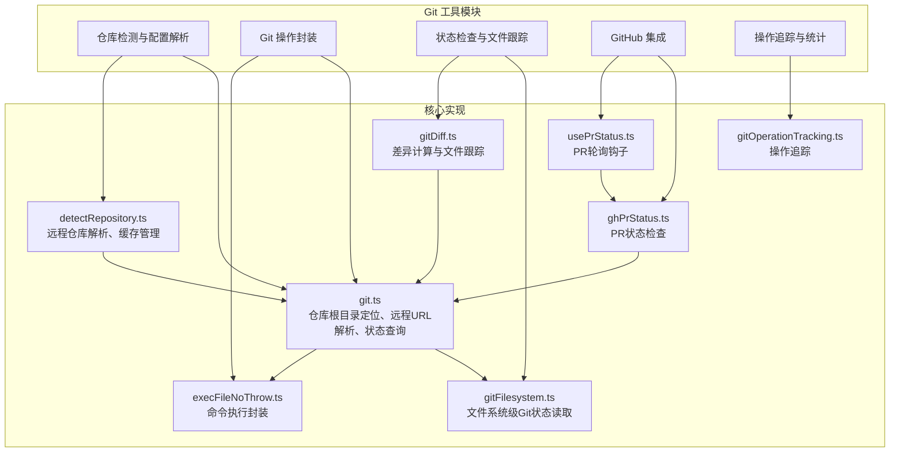
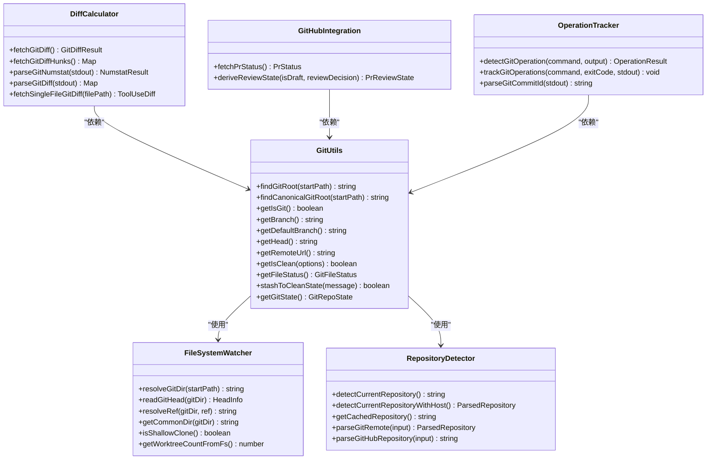
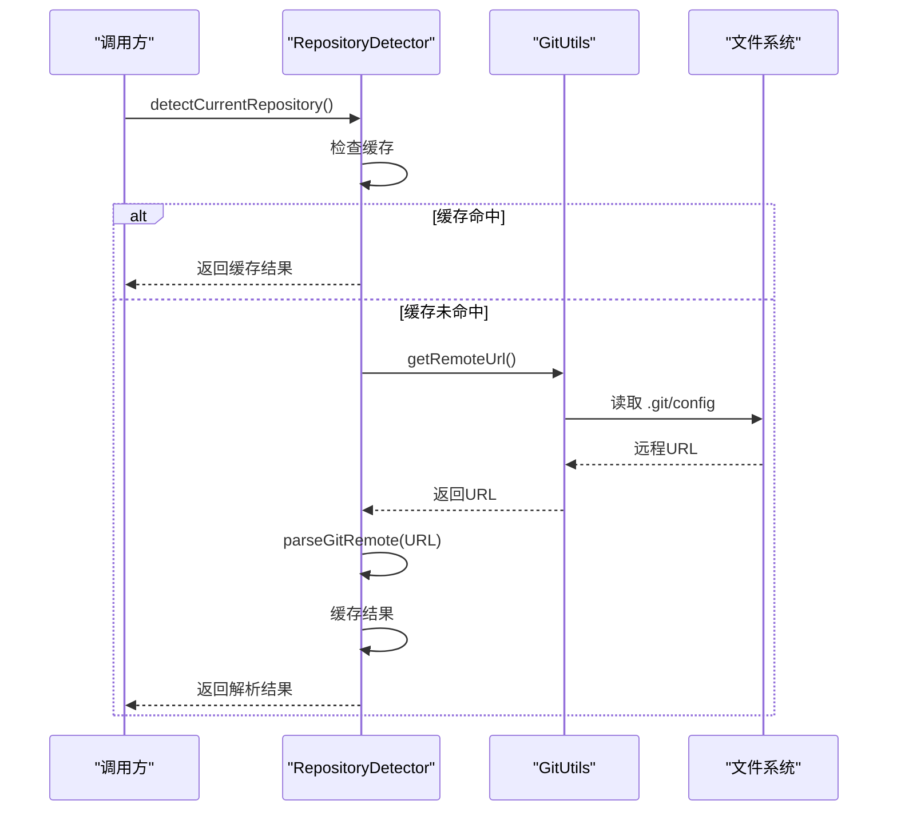
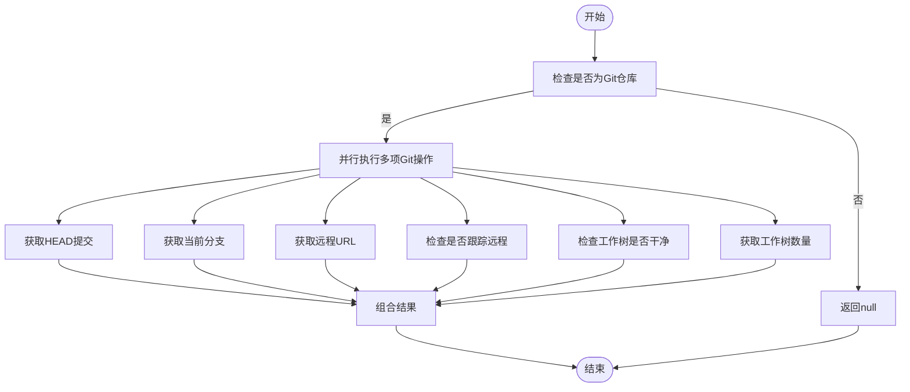
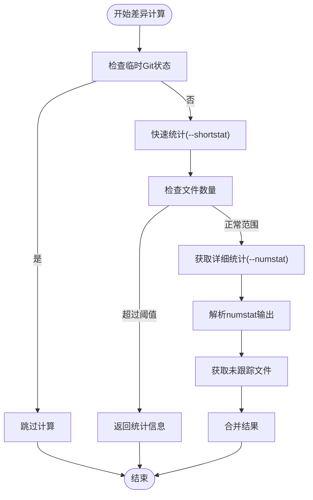
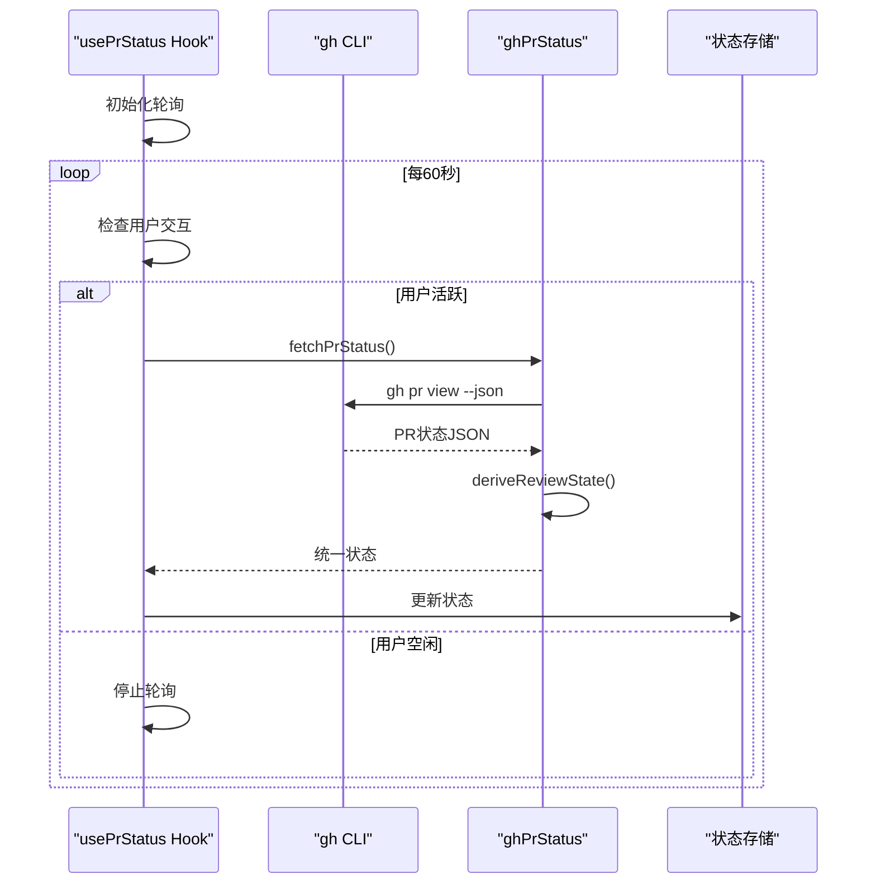
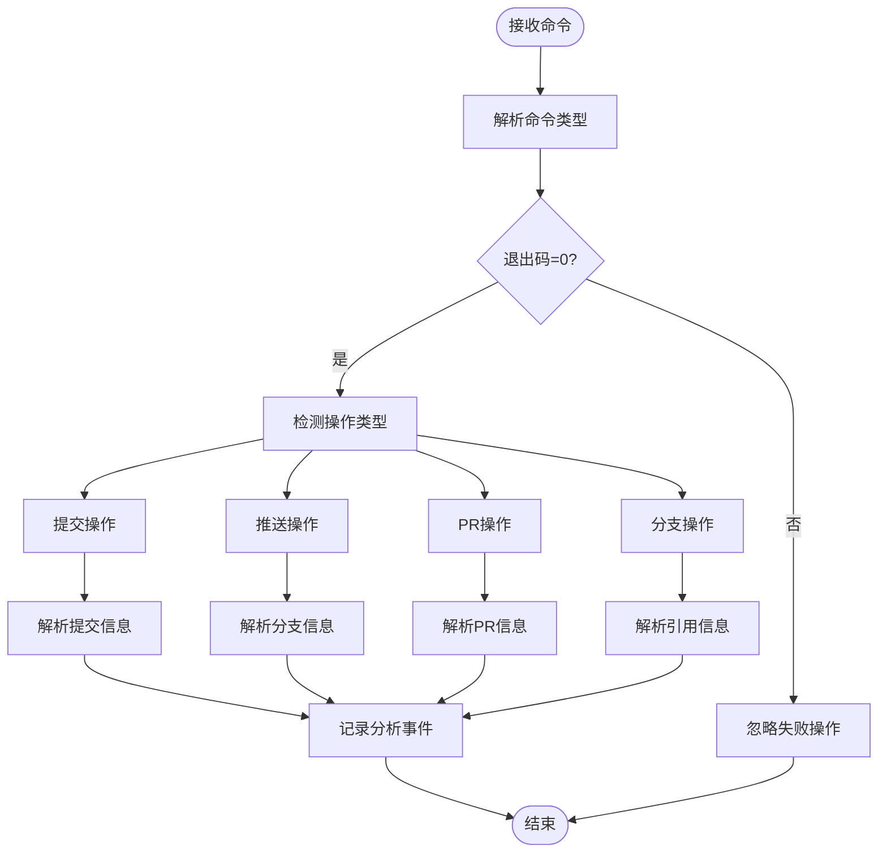
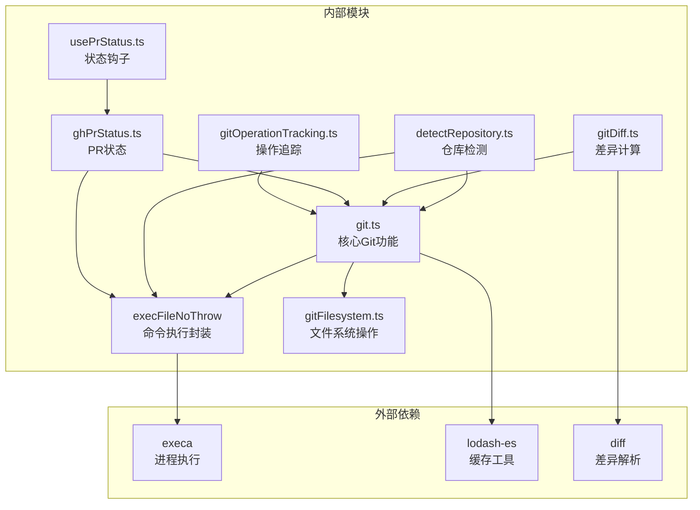

# Git 集成工具

<cite>
**本文档引用的文件**
- [src/utils/git.ts](file://src/utils/git.ts)
- [src/utils/detectRepository.ts](file://src/utils/detectRepository.ts)
- [src/utils/git/gitFilesystem.ts](file://src/utils/git/gitFilesystem.ts)
- [src/utils/gitDiff.ts](file://src/utils/gitDiff.ts)
- [src/utils/ghPrStatus.ts](file://src/utils/ghPrStatus.ts)
- [src/hooks/usePrStatus.ts](file://src/hooks/usePrStatus.ts)
- [src/tools/shared/gitOperationTracking.ts](file://src/tools/shared/gitOperationTracking.ts)
- [src/utils/execFileNoThrow.ts](file://src/utils/execFileNoThrow.ts)
- [src/commands/commit.ts](file://src/commands/commit.ts)
- [src/commands/commit-push-pr.ts](file://src/commands/commit-push-pr.ts)
</cite>

## 目录
1. [简介](#简介)
2. [项目结构](#项目结构)
3. [核心组件](#核心组件)
4. [架构概览](#架构概览)
5. [详细组件分析](#详细组件分析)
6. [依赖关系分析](#依赖关系分析)
7. [性能考虑](#性能考虑)
8. [故障排除指南](#故障排除指南)
9. [结论](#结论)
10. [附录](#附录)

## 简介

本文件为 Claude Code 项目中的 Git 集成工具函数提供详细的技术文档。该工具集涵盖了 Git 仓库检测与配置解析、Git 操作封装、状态检查与文件跟踪、以及 GitHub 集成等功能模块。文档旨在帮助开发者理解这些工具的设计原理、使用方式和最佳实践，特别适用于需要在应用中集成 Git 功能或进行自动化 Git 操作的场景。

## 项目结构

Git 集成工具主要分布在以下模块中：

- **仓库检测与配置解析**：负责识别当前工作目录是否为 Git 仓库、解析远程仓库信息、提取仓库标识等。
- **Git 操作封装**：提供对常见 Git 操作（如状态检查、文件跟踪、暂存等）的封装，确保跨平台兼容性和错误处理。
- **状态检查与文件跟踪**：通过文件系统监控和 Git 命令结合的方式，高效地获取仓库状态和文件变更信息。
- **GitHub 集成**：支持 PR 状态检查、PR 创建与更新、PR URL 解析等功能。
- **操作追踪与统计**：记录 Git 操作（如提交、推送、PR 创建等），用于使用统计和分析。

**图表来源**
- [src/utils/git.ts:1-927](file://src/utils/git.ts#L1-L927)
- [src/utils/detectRepository.ts:1-179](file://src/utils/detectRepository.ts#L1-L179)
- [src/utils/git/gitFilesystem.ts:1-700](file://src/utils/git/gitFilesystem.ts#L1-L700)
- [src/utils/gitDiff.ts:1-533](file://src/utils/gitDiff.ts#L1-L533)
- [src/utils/ghPrStatus.ts:1-107](file://src/utils/ghPrStatus.ts#L1-L107)
- [src/hooks/usePrStatus.ts:1-107](file://src/hooks/usePrStatus.ts#L1-L107)
- [src/tools/shared/gitOperationTracking.ts:1-278](file://src/tools/shared/gitOperationTracking.ts#L1-L278)
- [src/utils/execFileNoThrow.ts:1-151](file://src/utils/execFileNoThrow.ts#L1-L151)

**章节来源**
- [src/utils/git.ts:1-927](file://src/utils/git.ts#L1-L927)
- [src/utils/detectRepository.ts:1-179](file://src/utils/detectRepository.ts#L1-L179)

## 核心组件

### 仓库检测与配置解析

该组件负责识别当前工作目录是否为 Git 仓库，并解析远程仓库信息。关键功能包括：

- **仓库根目录定位**：通过向上遍历目录树查找 `.git` 目录或文件，支持工作树和子模块场景。
- **远程仓库解析**：解析不同格式的远程 URL（HTTPS、SSH、git 协议），并提取主机名、所有者和仓库名。
- **缓存机制**：为当前工作目录的解析结果提供缓存，避免重复计算。
- **安全校验**：对解析出的主机名进行域名验证，防止 SSH 配置别名导致的安全问题。

**章节来源**
- [src/utils/git.ts:27-210](file://src/utils/git.ts#L27-L210)
- [src/utils/detectRepository.ts:17-72](file://src/utils/detectRepository.ts#L17-L72)

### Git 操作封装

该组件提供对常见 Git 操作的封装，确保跨平台兼容性和一致的错误处理：

- **状态查询**：获取当前分支、默认分支、HEAD 提交、远程 URL 等信息。
- **状态检查**：检查工作树是否干净、是否有未推送的提交、是否位于仓库根目录等。
- **文件状态**：区分已跟踪和未跟踪文件，支持忽略未跟踪文件的选项。
- **暂存操作**：安全地暂存所有更改（包括未跟踪文件），防止数据丢失。
- **仓库状态聚合**：一次性获取多个 Git 状态信息，减少命令调用次数。

**章节来源**
- [src/utils/git.ts:257-502](file://src/utils/git.ts#L257-L502)

### 状态检查与文件跟踪

该组件通过文件系统监控和 Git 命令结合的方式，高效地获取仓库状态和文件变更信息：

- **差异计算**：计算工作树与 HEAD 的差异，支持快速统计和详细 hunks。
- **文件跟踪**：区分新增、修改、删除文件，支持二进制文件检测。
- **临时状态处理**：在合并、变基、挑选等临时状态下跳过差异计算。
- **性能优化**：限制最大文件数和文件大小，避免内存溢出。

**章节来源**
- [src/utils/gitDiff.ts:49-135](file://src/utils/gitDiff.ts#L49-L135)

### GitHub 集成

该组件提供 GitHub 相关的功能，包括 PR 状态检查和 PR 创建/更新：

- **PR 状态检查**：通过 `gh` CLI 获取当前分支的 PR 信息，包括审查状态、PR 编号和 URL。
- **轮询机制**：React Hook 实现的 PR 状态轮询，支持空闲停止和超时处理。
- **状态转换**：将 GitHub API 返回的状态转换为统一的审查状态枚举。

**章节来源**
- [src/utils/ghPrStatus.ts:46-106](file://src/utils/ghPrStatus.ts#L46-L106)
- [src/hooks/usePrStatus.ts:35-106](file://src/hooks/usePrStatus.ts#L35-L106)

### 操作追踪与统计

该组件记录 Git 操作（如提交、推送、PR 创建等），用于使用统计和分析：

- **命令解析**：通过正则表达式解析 Bash 命令字符串，识别 Git 操作类型。
- **输出解析**：从命令输出中提取提交 SHA、分支名、PR 信息等。
- **事件上报**：将操作信息转换为统一格式，触发分析事件和计数器更新。

**章节来源**
- [src/tools/shared/gitOperationTracking.ts:135-186](file://src/tools/shared/gitOperationTracking.ts#L135-L186)

## 架构概览

Git 集成工具采用分层架构设计，各模块职责清晰、耦合度低：

**图表来源**
- [src/utils/git.ts:27-502](file://src/utils/git.ts#L27-L502)
- [src/utils/detectRepository.ts:32-72](file://src/utils/detectRepository.ts#L32-L72)
- [src/utils/git/gitFilesystem.ts:40-582](file://src/utils/git/gitFilesystem.ts#L40-L582)
- [src/utils/gitDiff.ts:49-135](file://src/utils/gitDiff.ts#L49-L135)
- [src/utils/ghPrStatus.ts:46-106](file://src/utils/ghPrStatus.ts#L46-L106)
- [src/tools/shared/gitOperationTracking.ts:135-186](file://src/tools/shared/gitOperationTracking.ts#L135-L186)

## 详细组件分析

### 仓库检测与配置解析组件

该组件的核心功能是准确识别 Git 仓库并解析远程配置信息：

**图表来源**
- [src/utils/detectRepository.ts:32-58](file://src/utils/detectRepository.ts#L32-L58)
- [src/utils/git.ts:269-271](file://src/utils/git.ts#L269-L271)

**章节来源**
- [src/utils/detectRepository.ts:32-72](file://src/utils/detectRepository.ts#L32-L72)

### Git 操作封装组件

该组件提供了一组完整的 Git 操作封装函数：

**图表来源**
- [src/utils/git.ts:472-502](file://src/utils/git.ts#L472-L502)

**章节来源**
- [src/utils/git.ts:472-502](file://src/utils/git.ts#L472-L502)

### 状态检查与文件跟踪组件

该组件实现了高效的差异计算和文件跟踪功能：

**图表来源**
- [src/utils/gitDiff.ts:49-108](file://src/utils/gitDiff.ts#L49-L108)

**章节来源**
- [src/utils/gitDiff.ts:49-135](file://src/utils/gitDiff.ts#L49-L135)

### GitHub 集成组件

该组件提供了 PR 状态检查和轮询机制：

**图表来源**
- [src/hooks/usePrStatus.ts:49-87](file://src/hooks/usePrStatus.ts#L49-L87)
- [src/utils/ghPrStatus.ts:46-106](file://src/utils/ghPrStatus.ts#L46-L106)

**章节来源**
- [src/hooks/usePrStatus.ts:35-106](file://src/hooks/usePrStatus.ts#L35-L106)
- [src/utils/ghPrStatus.ts:46-106](file://src/utils/ghPrStatus.ts#L46-L106)

### 操作追踪与统计组件

该组件实现了对 Git 操作的智能追踪：

**图表来源**
- [src/tools/shared/gitOperationTracking.ts:135-186](file://src/tools/shared/gitOperationTracking.ts#L135-L186)

**章节来源**
- [src/tools/shared/gitOperationTracking.ts:135-186](file://src/tools/shared/gitOperationTracking.ts#L135-L186)

## 依赖关系分析

Git 集成工具之间的依赖关系如下：

**图表来源**
- [src/utils/execFileNoThrow.ts:5-10](file://src/utils/execFileNoThrow.ts#L5-L10)
- [src/utils/git.ts:1-24](file://src/utils/git.ts#L1-L24)
- [src/utils/gitDiff.ts:1-8](file://src/utils/gitDiff.ts#L1-L8)

**章节来源**
- [src/utils/execFileNoThrow.ts:1-151](file://src/utils/execFileNoThrow.ts#L1-L151)
- [src/utils/git.ts:1-927](file://src/utils/git.ts#L1-L927)

## 性能考虑

Git 集成工具在设计时充分考虑了性能优化：

- **缓存策略**：使用 LRU 缓存和文件系统监控，避免重复计算和频繁的文件系统访问。
- **并行执行**：大量状态查询采用并行方式，显著减少总执行时间。
- **内存限制**：对大文件和大量文件进行限制，防止内存溢出。
- **短路优化**：在临时 Git 状态下跳过耗时的差异计算。
- **异步处理**：使用异步 I/O 和 Promise 并发，提高响应性。

## 故障排除指南

### 常见问题及解决方案

**问题：无法检测到 Git 仓库**
- 检查当前工作目录是否存在 `.git` 目录
- 确认文件权限正确
- 使用 `findGitRoot` 手动测试

**问题：远程 URL 解析失败**
- 验证远程 URL 格式是否正确
- 检查网络连接和代理设置
- 使用 `normalizeGitRemoteUrl` 进行标准化

**问题：PR 状态检查失败**
- 确认 `gh` CLI 已安装且可执行
- 检查 GitHub 认证状态
- 查看超时设置和网络状况

**问题：差异计算性能问题**
- 检查文件数量和大小限制
- 确认没有大型二进制文件
- 考虑使用 `--ignore-untracked` 选项

**章节来源**
- [src/utils/git.ts:218-229](file://src/utils/git.ts#L218-L229)
- [src/utils/git.ts:347-354](file://src/utils/git.ts#L347-L354)
- [src/utils/gitDiff.ts:307-326](file://src/utils/gitDiff.ts#L307-L326)

## 结论

Git 集成工具通过模块化设计和精心的性能优化，为 Claude Code 提供了强大而可靠的 Git 支持。该工具集不仅覆盖了基本的仓库检测和状态查询功能，还包含了高级的差异计算、GitHub 集成和操作追踪能力。其设计充分考虑了安全性、性能和用户体验，在各种复杂的 Git 场景中都能提供稳定可靠的服务。

## 附录

### 实际使用示例

**自动化 Git 操作示例**
- 使用 `commit-push-pr` 命令自动完成提交、推送和 PR 创建
- 通过 `stashToCleanState` 安全地暂存工作区更改
- 利用 `preserveGitStateForIssue` 生成问题报告所需的 Git 状态

**版本控制集成示例**
- 在 CI/CD 流程中使用 `findRemoteBase` 确定 PR 基准分支
- 通过 `getRepoRemoteHash` 生成仓库的唯一标识符
- 使用 `isCurrentDirectoryBareGitRepo` 防范潜在的安全威胁

**章节来源**
- [src/commands/commit-push-pr.ts:108-156](file://src/commands/commit-push-pr.ts#L108-L156)
- [src/utils/git.ts:429-461](file://src/utils/git.ts#L429-L461)
- [src/utils/git.ts:528-545](file://src/utils/git.ts#L528-L545)