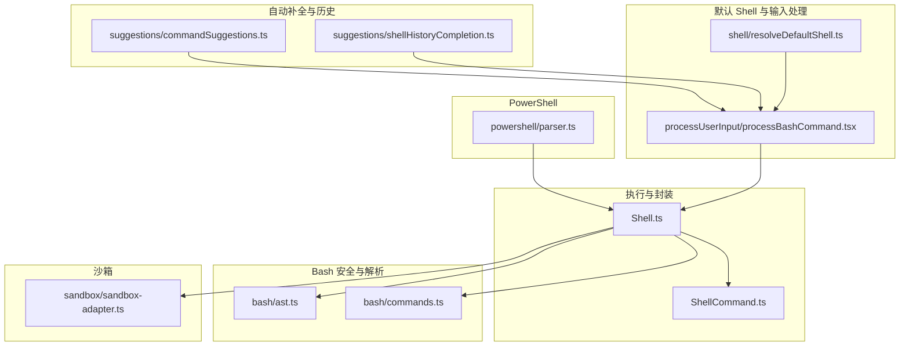
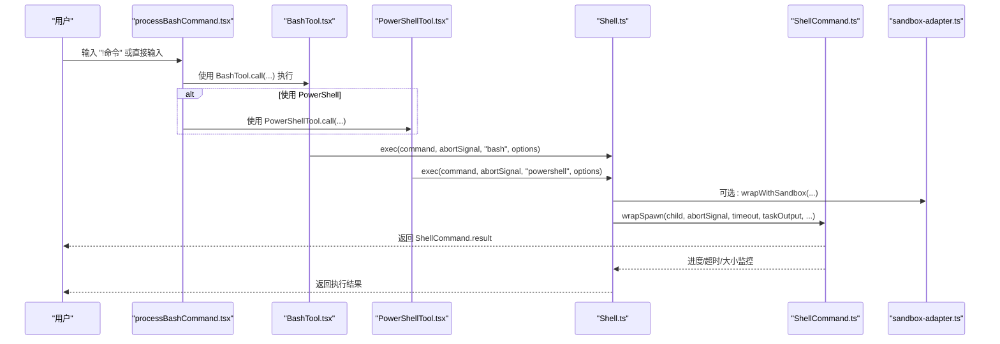
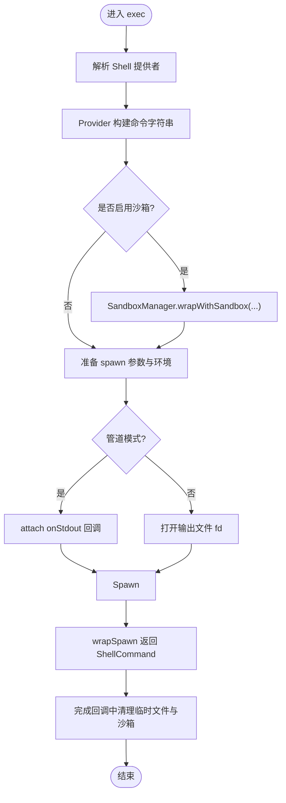
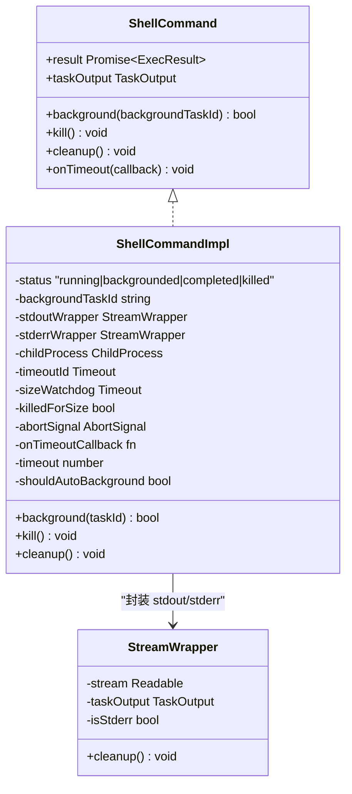
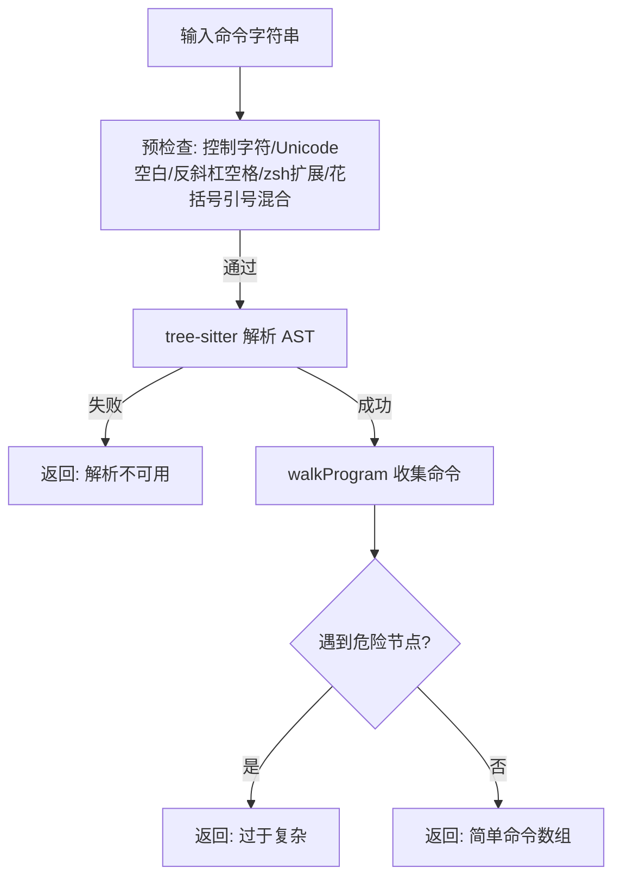
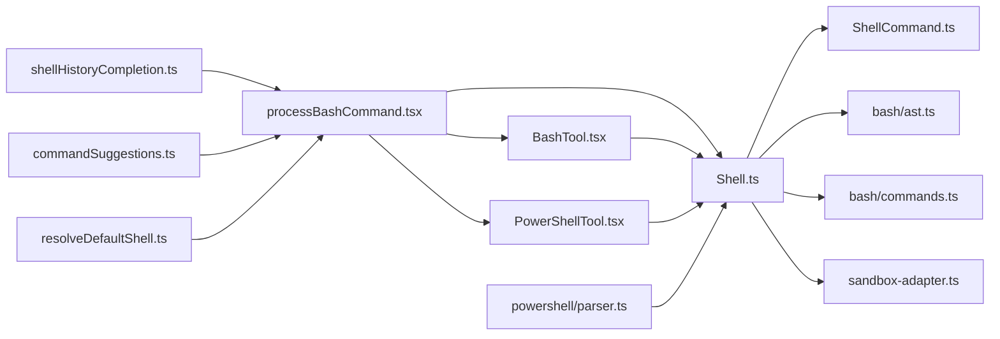

# Shell 命令处理

<cite>
**本文引用的文件**
- [src/utils/Shell.ts](file://src/utils/Shell.ts)
- [src/utils/ShellCommand.ts](file://src/utils/ShellCommand.ts)
- [src/utils/bash/ast.ts](file://src/utils/bash/ast.ts)
- [src/utils/bash/commands.ts](file://src/utils/bash/commands.ts)
- [src/utils/sandbox/sandbox-adapter.ts](file://src/utils/sandbox/sandbox-adapter.ts)
- [src/utils/suggestions/shellHistoryCompletion.ts](file://src/utils/suggestions/shellHistoryCompletion.ts)
- [src/utils/suggestions/commandSuggestions.ts](file://src/utils/suggestions/commandSuggestions.ts)
- [src/utils/shell/resolveDefaultShell.ts](file://src/utils/shell/resolveDefaultShell.ts)
- [src/utils/processUserInput/processBashCommand.tsx](file://src/utils/processUserInput/processBashCommand.tsx)
- [src/utils/deepLink/terminalLauncher.ts](file://src/utils/deepLink/terminalLauncher.ts)
- [src/tools/BashTool/BashTool.tsx](file://src/tools/BashTool/BashTool.tsx)
- [src/tools/PowerShellTool/PowerShellTool.tsx](file://src/tools/PowerShellTool/PowerShellTool.tsx)
- [src/utils/powershell/parser.ts](file://src/utils/powershell/parser.ts)
</cite>

## 目录
1. [简介](#简介)
2. [项目结构](#项目结构)
3. [核心组件](#核心组件)
4. [架构总览](#架构总览)
5. [详细组件分析](#详细组件分析)
6. [依赖关系分析](#依赖关系分析)
7. [性能考量](#性能考量)
8. [故障排查指南](#故障排查指南)
9. [结论](#结论)
10. [附录](#附录)

## 简介
本文件系统性梳理 Shell 命令处理工具函数与相关能力，覆盖命令解析、参数处理、输出捕获、Bash 与 PowerShell 的特定处理、安全机制（危险命令检测、沙箱隔离、资源限制）、命令历史与自动补全、错误处理与异常恢复，以及典型使用场景（复杂命令组合、管道处理、后台执行）。

## 项目结构
围绕 Shell 命令处理的关键模块分布如下：
- 执行入口与通用封装：Shell.ts、ShellCommand.ts
- Bash 安全解析与命令拆分：bash/ast.ts、bash/commands.ts
- 沙箱适配器：sandbox/sandbox-adapter.ts
- 自动补全与历史：suggestions/shellHistoryCompletion.ts、suggestions/commandSuggestions.ts
- 默认 Shell 解析与用户输入处理：shell/resolveDefaultShell.ts、processUserInput/processBashCommand.tsx
- PowerShell 特定解析：powershell/parser.ts
- 终端探测与默认终端选择：deepLink/terminalLauncher.ts
- 工具层封装：tools/BashTool、tools/PowerShellTool

图表来源
- [src/utils/Shell.ts:1-475](file://src/utils/Shell.ts#L1-L475)
- [src/utils/ShellCommand.ts:1-466](file://src/utils/ShellCommand.ts#L1-L466)
- [src/utils/bash/ast.ts:1-800](file://src/utils/bash/ast.ts#L1-L800)
- [src/utils/bash/commands.ts:1-800](file://src/utils/bash/commands.ts#L1-L800)
- [src/utils/sandbox/sandbox-adapter.ts:1-200](file://src/utils/sandbox/sandbox-adapter.ts#L1-L200)
- [src/utils/suggestions/shellHistoryCompletion.ts:1-119](file://src/utils/suggestions/shellHistoryCompletion.ts#L1-L119)
- [src/utils/suggestions/commandSuggestions.ts:136-176](file://src/utils/suggestions/commandSuggestions.ts#L136-L176)
- [src/utils/shell/resolveDefaultShell.ts:1-14](file://src/utils/shell/resolveDefaultShell.ts#L1-L14)
- [src/utils/processUserInput/processBashCommand.tsx:68-93](file://src/utils/processUserInput/processBashCommand.tsx#L68-L93)
- [src/utils/powershell/parser.ts:1165-1180](file://src/utils/powershell/parser.ts#L1165-L1180)

章节来源
- [src/utils/Shell.ts:1-475](file://src/utils/Shell.ts#L1-L475)
- [src/utils/ShellCommand.ts:1-466](file://src/utils/ShellCommand.ts#L1-L466)
- [src/utils/bash/ast.ts:1-800](file://src/utils/bash/ast.ts#L1-L800)
- [src/utils/bash/commands.ts:1-800](file://src/utils/bash/commands.ts#L1-L800)
- [src/utils/sandbox/sandbox-adapter.ts:1-200](file://src/utils/sandbox/sandbox-adapter.ts#L1-L200)
- [src/utils/suggestions/shellHistoryCompletion.ts:1-119](file://src/utils/suggestions/shellHistoryCompletion.ts#L1-L119)
- [src/utils/suggestions/commandSuggestions.ts:136-176](file://src/utils/suggestions/commandSuggestions.ts#L136-L176)
- [src/utils/shell/resolveDefaultShell.ts:1-14](file://src/utils/shell/resolveDefaultShell.ts#L1-L14)
- [src/utils/processUserInput/processBashCommand.tsx:68-93](file://src/utils/processUserInput/processBashCommand.tsx#L68-L93)
- [src/utils/powershell/parser.ts:1165-1180](file://src/utils/powershell/parser.ts#L1165-L1180)

## 核心组件
- Shell 执行器：负责选择合适的 Shell、构建执行命令、处理工作目录、沙箱包装、输出捕获、超时与中断、后台化与清理。
- Shell 命令封装：统一的子进程封装、流式写入、进度回调、超时与大小监控、后台化与清理。
- Bash 安全解析：基于 tree-sitter 的 AST 分析，提取简单命令、变量作用域、重定向与危险节点识别；提供“过于复杂”判定与回退策略。
- Bash 命令拆分与安全校验：对操作符、重定向、续行、heredoc、注释等进行安全处理，生成可信任的命令片段。
- 沙箱适配器：桥接外部 sandbox-runtime，整合设置系统、路径转换、网络与文件系统限制、违规记录与清理。
- PowerShell 特定处理：通过 -EncodedCommand 传递脚本，避免交互模式与转义问题；提供只读/搜索/读取类命令识别与 UI 折叠逻辑。
- 自动补全与历史：基于历史缓存与上下文解析的内联补全；命令建议生成与匹配。
- 默认 Shell 与输入处理：根据设置解析默认 Shell；在 Bash 模式下处理用户输入，支持历史补全与实时进度。

章节来源
- [src/utils/Shell.ts:181-442](file://src/utils/Shell.ts#L181-L442)
- [src/utils/ShellCommand.ts:32-466](file://src/utils/ShellCommand.ts#L32-L466)
- [src/utils/bash/ast.ts:381-460](file://src/utils/bash/ast.ts#L381-L460)
- [src/utils/bash/commands.ts:85-249](file://src/utils/bash/commands.ts#L85-L249)
- [src/utils/sandbox/sandbox-adapter.ts:172-200](file://src/utils/sandbox/sandbox-adapter.ts#L172-L200)
- [src/utils/powershell/parser.ts:1165-1180](file://src/utils/powershell/parser.ts#L1165-L1180)
- [src/utils/suggestions/shellHistoryCompletion.ts:91-119](file://src/utils/suggestions/shellHistoryCompletion.ts#L91-L119)
- [src/utils/suggestions/commandSuggestions.ts:164-176](file://src/utils/suggestions/commandSuggestions.ts#L164-L176)
- [src/utils/shell/resolveDefaultShell.ts:12-14](file://src/utils/shell/resolveDefaultShell.ts#L12-L14)
- [src/utils/processUserInput/processBashCommand.tsx:68-93](file://src/utils/processUserInput/processBashCommand.tsx#L68-L93)

## 架构总览
整体流程从用户输入到命令执行，再到结果返回与清理，贯穿安全校验、沙箱包装、输出捕获与 UI 展示。

图表来源
- [src/utils/processUserInput/processBashCommand.tsx:68-93](file://src/utils/processUserInput/processBashCommand.tsx#L68-L93)
- [src/tools/BashTool/BashTool.tsx:1-200](file://src/tools/BashTool/BashTool.tsx#L1-L200)
- [src/tools/PowerShellTool/PowerShellTool.tsx:1-200](file://src/tools/PowerShellTool/PowerShellTool.tsx#L1-L200)
- [src/utils/Shell.ts:181-442](file://src/utils/Shell.ts#L181-L442)
- [src/utils/ShellCommand.ts:387-403](file://src/utils/ShellCommand.ts#L387-L403)
- [src/utils/sandbox/sandbox-adapter.ts:910-967](file://src/utils/sandbox/sandbox-adapter.ts#L910-L967)

## 详细组件分析

### Shell 执行器（Shell.ts）
- 功能要点
  - 选择可用 Shell：优先环境变量、用户首选、常见路径，最终校验可执行性。
  - 构建执行命令：按 Shell 类型调用对应 Provider，支持沙箱包装。
  - 处理工作目录：恢复不存在的 CWD，更新状态，触发环境缓存失效与钩子通知。
  - 输出捕获：文件模式与管道模式双通道；管道模式支持实时回调。
  - 超时与中断：统一超时策略；AbortSignal 触发中断；后台化防止阻塞。
  - 清理：关闭文件句柄、清理临时文件、沙箱后清理。
- 关键数据结构
  - ExecOptions：timeout、onProgress、preventCwdChanges、shouldUseSandbox、shouldAutoBackground、onStdout。
  - ShellConfig：provider。
- 性能与安全
  - 文件模式使用 O_APPEND 保证原子写入；Windows 使用字符串标志避免 EINVAL。
  - 沙箱模式下创建安全临时目录，严格权限控制。
  - PowerShell 沙箱通过 /bin/sh 包装，保留 -NoProfile -NonInteractive 等参数。

图表来源
- [src/utils/Shell.ts:181-442](file://src/utils/Shell.ts#L181-L442)
- [src/utils/ShellCommand.ts:387-403](file://src/utils/ShellCommand.ts#L387-L403)

章节来源
- [src/utils/Shell.ts:73-137](file://src/utils/Shell.ts#L73-L137)
- [src/utils/Shell.ts:181-442](file://src/utils/Shell.ts#L181-L442)
- [src/utils/ShellCommand.ts:106-180](file://src/utils/ShellCommand.ts#L106-L180)

### Shell 命令封装（ShellCommand.ts）
- 功能要点
  - 统一封装子进程生命周期：启动、退出、错误、超时、中断、后台化。
  - 流式写入：StreamWrapper 将 stdout/stderr 写入 TaskOutput，支持实时进度。
  - 资源限制：大小看门狗，超过阈值自动 SIGKILL；超时可自动后台化或终止。
  - 结果聚合：合并 stdout/stderr、输出文件路径与大小、是否被中断、是否后台化。
- 关键类型
  - ExecResult：code、stdout、stderr、interrupted、backgroundTaskId、outputFilePath 等。
  - ShellCommand：background、result、kill、cleanup、onTimeout。

图表来源
- [src/utils/ShellCommand.ts:32-104](file://src/utils/ShellCommand.ts#L32-L104)
- [src/utils/ShellCommand.ts:114-382](file://src/utils/ShellCommand.ts#L114-L382)

章节来源
- [src/utils/ShellCommand.ts:13-47](file://src/utils/ShellCommand.ts#L13-L47)
- [src/utils/ShellCommand.ts:114-382](file://src/utils/ShellCommand.ts#L114-L382)

### Bash 安全解析（ast.ts）
- 设计原则
  - FAIL-CLOSED：未知节点一律视为“过于复杂”，走权限提示流程。
  - 允许白名单：仅允许已知安全节点类型，递归提取简单命令 argv、环境变量、重定向。
  - 危险节点识别：命令替换、进程替换、扩展、花括号表达式、子壳、控制流、函数定义、测试命令、ANSI_C/翻译字符串、herestring/heredoc 等。
- 关键规则
  - 变量展开：仅允许已跟踪的变量与安全环境变量；裸变量在非引号中不安全。
  - 控制流：`||`/`|`/`|&`/`&` 不线性传播作用域；管道阶段在子壳运行。
  - 特殊变量：`?`、`$`、`!`、`#`、`0`、`-` 等仅在字符串内安全解析。
  - 字符与空白：控制字符、Unicode 空白、反斜杠空格、zsh 动态目录与等号扩展、花括号与引号混合等均拒绝。
- 输出
  - 简单命令列表或“过于复杂”/“解析不可用”。

图表来源
- [src/utils/bash/ast.ts:381-460](file://src/utils/bash/ast.ts#L381-L460)
- [src/utils/bash/ast.ts:176-205](file://src/utils/bash/ast.ts#L176-L205)
- [src/utils/bash/ast.ts:462-565](file://src/utils/bash/ast.ts#L462-L565)

章节来源
- [src/utils/bash/ast.ts:381-460](file://src/utils/bash/ast.ts#L381-L460)
- [src/utils/bash/ast.ts:462-565](file://src/utils/bash/ast.ts#L462-L565)

### Bash 命令拆分与安全校验（commands.ts）
- 功能要点
  - 续行拼接：正确处理奇数个反斜杠后的换行，避免注入与绕过。
  - heredoc 提前抽取：先抽取再解析，避免 shell-quote 对 `<<` 的误判。
  - 占位符随机盐：防止恶意命令包含字面占位符导致参数注入。
  - 重定向目标静态性校验：拒绝动态目标（变量、命令替换、通配、波浪号、过程替换、文件描述符等），确保权限提示可见。
  - 注释与操作符映射：保留语义，过滤控制操作符。
- 输出
  - 去除重定向的目标命令片段数组；或在解析失败时返回续行拼接后的原始命令以保守处理。

章节来源
- [src/utils/bash/commands.ts:85-249](file://src/utils/bash/commands.ts#L85-L249)
- [src/utils/bash/commands.ts:47-81](file://src/utils/bash/commands.ts#L47-L81)
- [src/utils/bash/commands.ts:634-790](file://src/utils/bash/commands.ts#L634-L790)

### 沙箱适配器（sandbox-adapter.ts）
- 功能要点
  - 设置转换：将 Claude Code 的路径规则与文件系统限制转换为 sandbox-runtime 配置。
  - 路径解析：支持 `//path`（绝对根）、`/path`（相对设置目录）、`~/path`、相对路径等。
  - 网络与文件系统限制：允许域、忽略违规、代理端口、Unix Socket 与本地绑定控制。
  - 违规记录与清理：记录违规事件，命令后清理残留文件。
- 关键接口
  - wrapWithSandbox、getFsReadConfig、getFsWriteConfig、getNetworkRestrictionConfig、waitForNetworkInitialization、cleanupAfterCommand 等。

章节来源
- [src/utils/sandbox/sandbox-adapter.ts:172-200](file://src/utils/sandbox/sandbox-adapter.ts#L172-L200)
- [src/utils/sandbox/sandbox-adapter.ts:880-985](file://src/utils/sandbox/sandbox-adapter.ts#L880-L985)

### PowerShell 特定处理（powershell/parser.ts）
- 功能要点
  - 使用 -EncodedCommand 传递脚本，避免交互模式与 ANSI 转义问题。
  - 参数构造：-NoProfile、-NonInteractive、-NoLogo、-EncodedCommand。
- 适用范围
  - 适用于需要通过 PowerShell 执行命令的场景，确保跨平台一致性与安全性。

章节来源
- [src/utils/powershell/parser.ts:1165-1180](file://src/utils/powershell/parser.ts#L1165-L1180)

### 自动补全与历史（shellHistoryCompletion.ts、commandSuggestions.ts）
- 历史补全
  - 缓存最近命令，按输入前缀匹配，返回“内联幽灵文本”与完整命令后缀。
  - 输入变化时丢弃过期结果，避免 UI 不一致。
- 命令建议
  - 基于部分命令生成建议，过滤前缀匹配，返回最佳匹配后缀与完整命令。

章节来源
- [src/utils/suggestions/shellHistoryCompletion.ts:91-119](file://src/utils/suggestions/shellHistoryCompletion.ts#L91-L119)
- [src/utils/suggestions/commandSuggestions.ts:164-176](file://src/utils/suggestions/commandSuggestions.ts#L164-L176)

### 默认 Shell 与输入处理（resolveDefaultShell.ts、processBashCommand.tsx）
- 默认 Shell 解析
  - 依据设置返回 'bash' 或 'powershell'，默认 'bash'。
- 用户输入处理
  - 在 Bash 模式下，根据用户选择调用 BashTool 或 PowerShellTool；用户发起的 `!` 命令默认禁用沙箱。

章节来源
- [src/utils/shell/resolveDefaultShell.ts:12-14](file://src/utils/shell/resolveDefaultShell.ts#L12-L14)
- [src/utils/processUserInput/processBashCommand.tsx:68-93](file://src/utils/processUserInput/processBashCommand.tsx#L68-L93)

### 终端探测与默认终端（terminalLauncher.ts）
- 功能要点
  - 在不同平台检测可用终端与 PowerShell 可执行路径，提供终端信息。
- 应用场景
  - 用于 deep link 启动或外部集成时选择合适的终端。

章节来源
- [src/utils/deepLink/terminalLauncher.ts:164-194](file://src/utils/deepLink/terminalLauncher.ts#L164-L194)

## 依赖关系分析

图表来源
- [src/utils/Shell.ts:1-475](file://src/utils/Shell.ts#L1-L475)
- [src/utils/ShellCommand.ts:1-466](file://src/utils/ShellCommand.ts#L1-L466)
- [src/utils/bash/ast.ts:1-800](file://src/utils/bash/ast.ts#L1-800)
- [src/utils/bash/commands.ts:1-800](file://src/utils/bash/commands.ts#L1-L800)
- [src/utils/sandbox/sandbox-adapter.ts:1-200](file://src/utils/sandbox/sandbox-adapter.ts#L1-L200)
- [src/utils/processUserInput/processBashCommand.tsx:68-93](file://src/utils/processUserInput/processBashCommand.tsx#L68-L93)
- [src/tools/BashTool/BashTool.tsx:1-200](file://src/tools/BashTool/BashTool.tsx#L1-L200)
- [src/tools/PowerShellTool/PowerShellTool.tsx:1-200](file://src/tools/PowerShellTool/PowerShellTool.tsx#L1-L200)
- [src/utils/suggestions/shellHistoryCompletion.ts:1-119](file://src/utils/suggestions/shellHistoryCompletion.ts#L1-L119)
- [src/utils/suggestions/commandSuggestions.ts:136-176](file://src/utils/suggestions/commandSuggestions.ts#L136-L176)
- [src/utils/shell/resolveDefaultShell.ts:1-14](file://src/utils/shell/resolveDefaultShell.ts#L1-L14)
- [src/utils/powershell/parser.ts:1165-1180](file://src/utils/powershell/parser.ts#L1165-L1180)

章节来源
- [src/utils/Shell.ts:1-475](file://src/utils/Shell.ts#L1-L475)
- [src/utils/ShellCommand.ts:1-466](file://src/utils/ShellCommand.ts#L1-L466)
- [src/utils/bash/ast.ts:1-800](file://src/utils/bash/ast.ts#L1-L800)
- [src/utils/bash/commands.ts:1-800](file://src/utils/bash/commands.ts#L1-L800)
- [src/utils/sandbox/sandbox-adapter.ts:1-200](file://src/utils/sandbox/sandbox-adapter.ts#L1-L200)
- [src/utils/processUserInput/processBashCommand.tsx:68-93](file://src/utils/processUserInput/processBashCommand.tsx#L68-L93)
- [src/tools/BashTool/BashTool.tsx:1-200](file://src/tools/BashTool/BashTool.tsx#L1-L200)
- [src/tools/PowerShellTool/PowerShellTool.tsx:1-200](file://src/tools/PowerShellTool/PowerShellTool.tsx#L1-L200)
- [src/utils/suggestions/shellHistoryCompletion.ts:1-119](file://src/utils/suggestions/shellHistoryCompletion.ts#L1-L119)
- [src/utils/suggestions/commandSuggestions.ts:136-176](file://src/utils/suggestions/commandSuggestions.ts#L136-L176)
- [src/utils/shell/resolveDefaultShell.ts:1-14](file://src/utils/shell/resolveDefaultShell.ts#L1-L14)
- [src/utils/powershell/parser.ts:1165-1180](file://src/utils/powershell/parser.ts#L1165-L1180)

## 性能考量
- 输出捕获
  - 文件模式：POSIX 上 O_APPEND 原子写入；Windows 使用 'w' 获得写权限，避免 MSYS2/Cygwin 的只读问题。
  - 管道模式：StreamWrapper 实时写入 TaskOutput，避免额外缓冲。
- 超时与后台化
  - 统一超时策略，支持自动后台化；后台化后开启大小看门狗，防止磁盘写满。
- 解析与安全
  - Bash AST 解析采用白名单策略，未知节点直接拒绝，避免昂贵的回溯与误判。
  - 命令拆分与占位符随机盐降低注入风险，减少 shell-quote 的误判成本。
- 缓存与复用
  - Shell 配置与 PowerShell 提供者按会话记忆，避免重复查找与初始化。

[本节为通用指导，无需具体文件分析]

## 故障排查指南
- 常见错误与恢复
  - 无法找到可用 Shell：检查 SHELL 环境变量与常见路径；确认可执行权限。
  - 工作目录不存在：自动回退到初始 CWD 并提示重启；必要时手动切换。
  - 子进程启动失败：捕获错误消息，返回“执行前失败”的结果；清理 TaskOutput。
  - 超时与中断：区分 SIGTERM（超时）与 SIGKILL（大小限制或手动终止）；后台化后仍可查看输出文件。
  - 沙箱违规：通过 SandboxViolationStore 记录并清理残留文件；调整设置后重试。
- 定位步骤
  - 查看 ExecResult 中的 stderr 与 outputFilePath。
  - 检查 AbortSignal 是否触发中断。
  - 确认 shouldUseSandbox 与 shouldAutoBackground 的配置。
  - 核对 Bash AST 解析结果（过于复杂）与命令拆分结果（重定向目标动态性）。

章节来源
- [src/utils/Shell.ts:234-238](file://src/utils/Shell.ts#L234-L238)
- [src/utils/Shell.ts:424-441](file://src/utils/Shell.ts#L424-L441)
- [src/utils/ShellCommand.ts:291-335](file://src/utils/ShellCommand.ts#L291-L335)
- [src/utils/ShellCommand.ts:447-465](file://src/utils/ShellCommand.ts#L447-L465)
- [src/utils/sandbox/sandbox-adapter.ts:960-967](file://src/utils/sandbox/sandbox-adapter.ts#L960-L967)

## 结论
该 Shell 命令处理体系以安全为核心，结合 Bash AST 白名单解析、严格的命令拆分与重定向校验、统一的子进程封装与资源限制、可选的沙箱隔离与路径/网络限制，提供了稳健的命令执行能力。配合历史补全与命令建议，提升了交互效率与安全性。通过清晰的错误处理与异常恢复机制，保障了在复杂场景下的可靠性。

[本节为总结性内容，无需具体文件分析]

## 附录
- 实际使用示例（概念性说明）
  - 复杂命令组合：使用 `splitCommandWithOperators` 将复合命令拆分为片段，逐段进行安全校验与权限提示。
  - 管道处理：Bash AST 递归遍历结构节点，识别管道阶段在子壳运行，作用域不泄漏；PowerShell 通过语义分割识别管道与语句分隔符。
  - 后台执行：长任务自动后台化，大小看门狗防止磁盘写满；前台任务更新工作目录并触发环境缓存失效。
  - PowerShell 执行：通过 -EncodedCommand 传递脚本，避免交互模式与转义问题；在 Linux/macOS/WSL2 上支持沙箱。

[本节为概念性说明，无需具体文件分析]