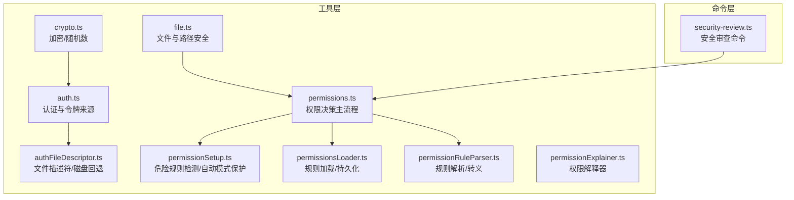
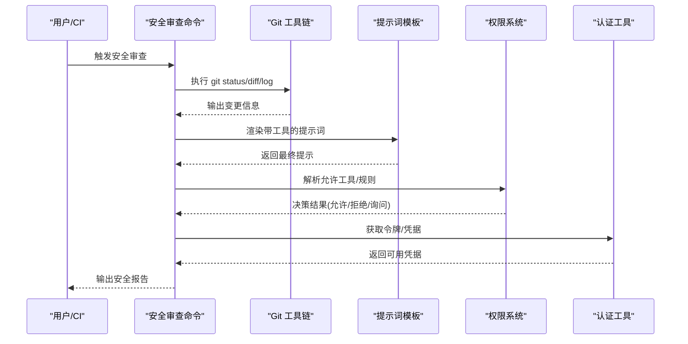
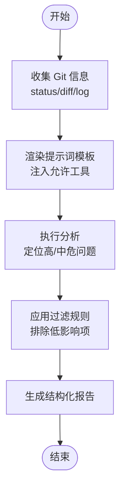
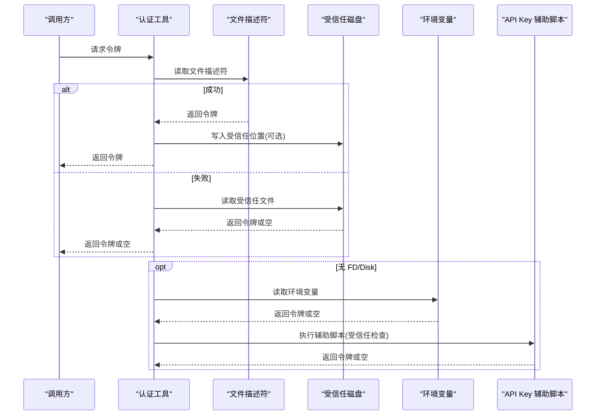
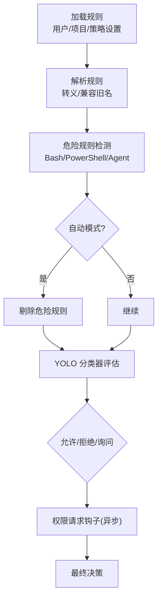
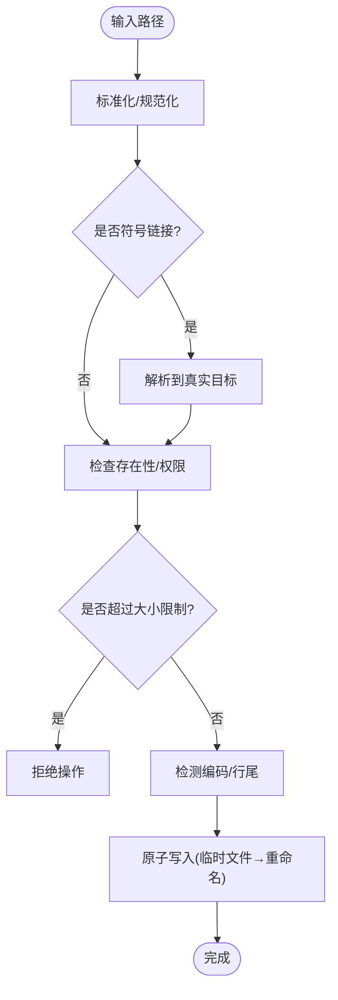
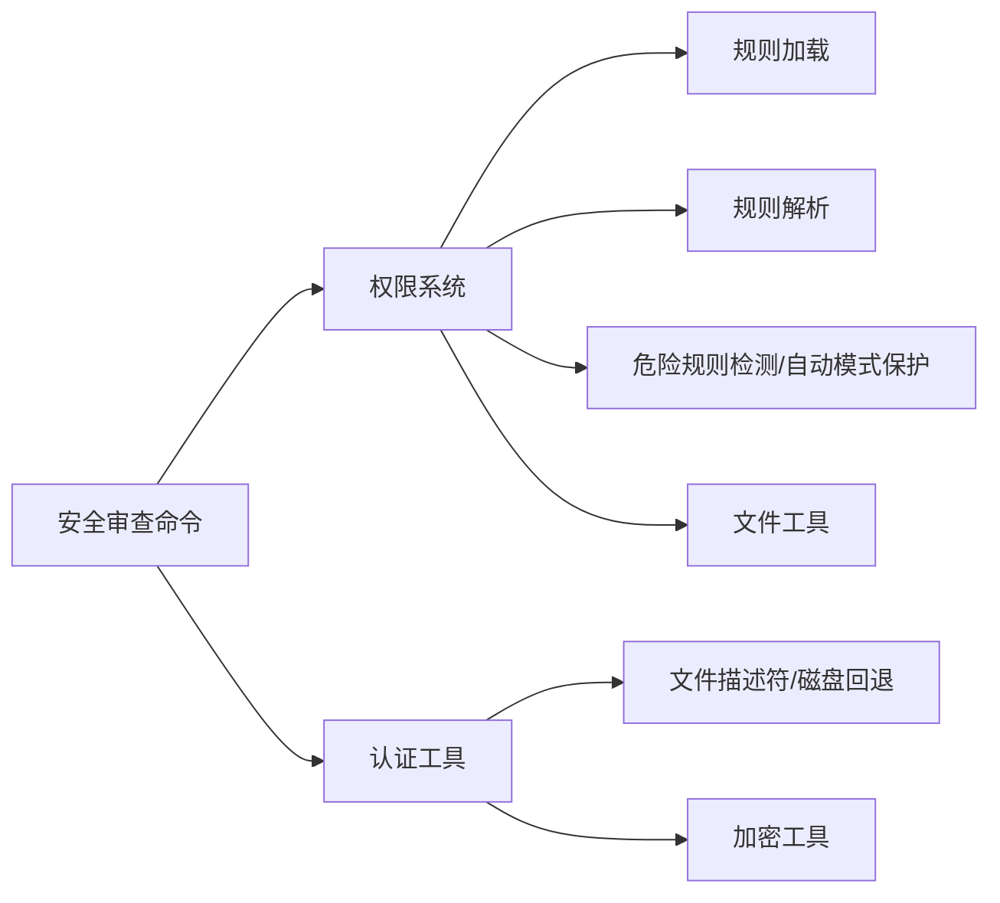

# 安全验证工具

<cite>
**本文档引用的文件**
- [security-review.ts](file://src/commands/security-review.ts)
- [auth.ts](file://src/utils/auth.ts)
- [authFileDescriptor.ts](file://src/utils/authFileDescriptor.ts)
- [crypto.ts](file://src/utils/crypto.ts)
- [permissions.ts](file://src/utils/permissions/permissions.ts)
- [permissionSetup.ts](file://src/utils/permissions/permissionSetup.ts)
- [permissionLoader.ts](file://src/utils/permissions/permissionsLoader.ts)
- [permissionRuleParser.ts](file://src/utils/permissions/permissionRuleParser.ts)
- [permissionExplainer.ts](file://src/utils/permissions/permissionExplainer.ts)
- [file.ts](file://src/utils/file.ts)
</cite>

## 目录
1. [简介](#简介)
2. [项目结构](#项目结构)
3. [核心组件](#核心组件)
4. [架构总览](#架构总览)
5. [详细组件分析](#详细组件分析)
6. [依赖关系分析](#依赖关系分析)
7. [性能考虑](#性能考虑)
8. [故障排除指南](#故障排除指南)
9. [结论](#结论)
10. [附录](#附录)

## 简介
本文件系统性梳理并文档化代码库中的安全验证工具与流程，覆盖以下方面：
- 输入验证与安全检查：参数校验、类型检查、注入防护（命令注入、路径遍历等）
- 认证与授权：令牌来源识别、OAuth/JWT 验证、权限规则解析与执行、自动模式与分类器
- 文件与路径安全：路径规范化、符号链接处理、目录/文件存在性检查、大小限制、编码检测
- 图像与二进制文件验证：编码/行尾检测、平台差异处理
- 加密与哈希：随机数生成、跨平台兼容
- 实际使用示例：安全审查、合规检查、威胁检测

本指南在保持技术深度的同时，尽量以可读方式呈现，便于非专业读者理解。

## 项目结构
安全相关能力主要分布在以下模块：
- 命令层：安全审查命令，用于对变更进行安全风险评估
- 工具层：认证与授权、权限规则、文件与路径处理、通用加密工具
- 权限子系统：规则加载、解析、危险规则检测、自动模式切换与保护

**图表来源**
- [security-review.ts:1-244](file://src/commands/security-review.ts#L1-L244)
- [auth.ts:1-2003](file://src/utils/auth.ts#L1-L2003)
- [authFileDescriptor.ts:1-197](file://src/utils/authFileDescriptor.ts#L1-L197)
- [crypto.ts:1-14](file://src/utils/crypto.ts#L1-L14)
- [permissions.ts:1-1487](file://src/utils/permissions/permissions.ts#L1-L1487)
- [permissionSetup.ts:1-1533](file://src/utils/permissions/permissionSetup.ts#L1-L1533)
- [permissionsLoader.ts:1-297](file://src/utils/permissions/permissionsLoader.ts#L1-L297)
- [permissionRuleParser.ts:1-199](file://src/utils/permissions/permissionRuleParser.ts#L1-L199)
- [permissionExplainer.ts:1-251](file://src/utils/permissions/permissionExplainer.ts#L1-L251)
- [file.ts:1-585](file://src/utils/file.ts#L1-L585)

**章节来源**
- [security-review.ts:1-244](file://src/commands/security-review.ts#L1-L244)
- [auth.ts:1-2003](file://src/utils/auth.ts#L1-L2003)
- [authFileDescriptor.ts:1-197](file://src/utils/authFileDescriptor.ts#L1-L197)
- [crypto.ts:1-14](file://src/utils/crypto.ts#L1-L14)
- [permissions.ts:1-1487](file://src/utils/permissions/permissions.ts#L1-L1487)
- [permissionSetup.ts:1-1533](file://src/utils/permissions/permissionSetup.ts#L1-L1533)
- [permissionsLoader.ts:1-297](file://src/utils/permissions/permissionsLoader.ts#L1-L297)
- [permissionRuleParser.ts:1-199](file://src/utils/permissions/permissionRuleParser.ts#L1-L199)
- [permissionExplainer.ts:1-251](file://src/utils/permissions/permissionExplainer.ts#L1-L251)
- [file.ts:1-585](file://src/utils/file.ts#L1-L585)

## 核心组件
- 安全审查命令：基于 Git 工具链与提示词模板，对当前分支变更进行安全风险评估，聚焦注入、认证/授权、加密与数据暴露等类别，并提供置信度评分与过滤规则。
- 认证与令牌来源：统一识别 API Key、OAuth、文件描述符、外部令牌源、受信任工作区等，确保在不同运行环境（本地、远程、CI）下正确选择与缓存令牌。
- 权限与授权：规则驱动的权限系统，支持 allow/deny/ask 规则、MCP 工具匹配、沙箱集成、自动模式（YOLO 分类器）与危险规则剔除。
- 文件与路径安全：路径规范化、符号链接处理、原子写入、大小限制、编码与行尾检测、跨平台差异处理。
- 加密与哈希：通过浏览器/Node 兼容层导出随机 UUID，避免不必要的 polyfill。

**章节来源**
- [security-review.ts:1-244](file://src/commands/security-review.ts#L1-L244)
- [auth.ts:1-2003](file://src/utils/auth.ts#L1-L2003)
- [permissions.ts:1-1487](file://src/utils/permissions/permissions.ts#L1-L1487)
- [file.ts:1-585](file://src/utils/file.ts#L1-L585)
- [crypto.ts:1-14](file://src/utils/crypto.ts#L1-L14)

## 架构总览
安全验证体系由“命令触发—上下文构建—规则决策—执行控制”构成闭环：

**图表来源**
- [security-review.ts:1-244](file://src/commands/security-review.ts#L1-L244)
- [permissions.ts:1-1487](file://src/utils/permissions/permissions.ts#L1-L1487)
- [auth.ts:1-2003](file://src/utils/auth.ts#L1-L2003)

## 详细组件分析

### 组件A：安全审查命令
- 功能概述：基于 Git 工具链收集状态、修改文件列表与提交历史，结合预定义提示词模板，对变更进行安全风险评估。
- 关键特性：
  - 允许工具白名单（如 Bash、Read、Glob、Grep 等），限制执行范围
  - 明确安全类别（输入验证、认证/授权、加密、注入、数据泄露等）
  - 置信度评分与过滤规则，避免误报与噪声
  - 输出结构化报告，包含严重级别、类别、描述、利用场景与修复建议
- 使用场景：PR 安全审查、CI 合规检查、威胁检测

**图表来源**
- [security-review.ts:1-244](file://src/commands/security-review.ts#L1-L244)

**章节来源**
- [security-review.ts:1-244](file://src/commands/security-review.ts#L1-L244)

### 组件B：认证与令牌来源
- 功能概述：统一识别与获取 API Key、OAuth、文件描述符令牌、外部令牌源等，支持受信任工作区、CI、远程环境等多场景。
- 关键特性：
  - 令牌来源优先级：文件描述符 → 受信任磁盘文件 → 环境变量 → 外部脚本/密钥链
  - 受信任工作区检查：在项目设置中启用时，禁止在未确认信任前执行敏感脚本
  - 缓存与去重：API Key 辅助脚本结果缓存，避免重复执行
  - AWS 凭证：STS 调用、刷新与导出，失败时提供超时与错误输出
- 安全要点：严格区分受信任与非受信环境；对项目设置中的脚本执行前置信任检查

**图表来源**
- [auth.ts:1-2003](file://src/utils/auth.ts#L1-L2003)
- [authFileDescriptor.ts:1-197](file://src/utils/authFileDescriptor.ts#L1-L197)

**章节来源**
- [auth.ts:1-2003](file://src/utils/auth.ts#L1-L2003)
- [authFileDescriptor.ts:1-197](file://src/utils/authFileDescriptor.ts#L1-L197)

### 组件C：权限系统与授权
- 功能概述：基于规则的权限决策，支持 allow/deny/ask、MCP 工具匹配、沙箱集成、自动模式（YOLO 分类器）与危险规则剔除。
- 关键特性：
  - 规则加载：从用户/项目/本地设置与策略设置加载，支持仅受管规则模式
  - 规则解析：转义/反转义括号，兼容旧工具名映射
  - 危险规则检测：Bash/PowerShell/Agent 的过度宽泛规则与绕过分类器规则
  - 自动模式保护：进入自动模式时剔除危险规则，退出时恢复
  - 权限解释器：基于模型生成风险等级与解释，辅助用户理解
- 执行流程：规则匹配 → 工具实现检查 → 模式转换 → 自动模式分类器 → 用户交互/钩子

**图表来源**
- [permissions.ts:1-1487](file://src/utils/permissions/permissions.ts#L1-L1487)
- [permissionSetup.ts:1-1533](file://src/utils/permissions/permissionSetup.ts#L1-L1533)
- [permissionsLoader.ts:1-297](file://src/utils/permissions/permissionsLoader.ts#L1-L297)
- [permissionRuleParser.ts:1-199](file://src/utils/permissions/permissionRuleParser.ts#L1-L199)
- [permissionExplainer.ts:1-251](file://src/utils/permissions/permissionExplainer.ts#L1-L251)

**章节来源**
- [permissions.ts:1-1487](file://src/utils/permissions/permissions.ts#L1-L1487)
- [permissionSetup.ts:1-1533](file://src/utils/permissions/permissionSetup.ts#L1-L1533)
- [permissionsLoader.ts:1-297](file://src/utils/permissions/permissionsLoader.ts#L1-L297)
- [permissionRuleParser.ts:1-199](file://src/utils/permissions/permissionRuleParser.ts#L1-L199)
- [permissionExplainer.ts:1-251](file://src/utils/permissions/permissionExplainer.ts#L1-L251)

### 组件D：文件与路径安全
- 功能概述：提供路径规范化、符号链接处理、原子写入、大小限制、编码与行尾检测等能力，保障文件操作安全与一致性。
- 关键特性：
  - 路径比较：跨平台大小写不敏感比较、标准化处理
  - 符号链接：保留并写入目标，避免破坏链接结构
  - 原子写入：临时文件 + 重命名，失败时清理临时文件
  - 大小限制：读取大小上限，防止大文件导致资源压力
  - 编码与行尾：检测 UTF-8/行尾类型，统一输出格式
- 安全要点：严格区分绝对/相对路径，避免路径遍历；在远程/容器环境中谨慎写入磁盘

**图表来源**
- [file.ts:1-585](file://src/utils/file.ts#L1-L585)

**章节来源**
- [file.ts:1-585](file://src/utils/file.ts#L1-L585)

### 组件E：加密与哈希工具
- 功能概述：提供跨平台随机 UUID 导出，避免在浏览器构建中引入大型 polyfill。
- 关键特性：
  - 浏览器/Node 双态：通过包字段切换实现最小体积
  - 运行时绑定：避免 re-export 语法导致的绑定问题
- 使用场景：生成唯一标识、会话 ID、测试数据等

**章节来源**
- [crypto.ts:1-14](file://src/utils/crypto.ts#L1-L14)

## 依赖关系分析
- 命令层依赖权限系统与认证工具，形成“审查—决策—凭据”的闭环
- 权限系统内部依赖规则解析与加载模块，以及危险规则检测与自动模式保护
- 文件工具被权限系统与命令层共同使用，确保安全的文件操作
- 认证工具依赖文件描述符与受信任磁盘回退机制，保证在不同环境下的令牌可用性

**图表来源**
- [security-review.ts:1-244](file://src/commands/security-review.ts#L1-L244)
- [permissions.ts:1-1487](file://src/utils/permissions/permissions.ts#L1-L1487)
- [permissionsLoader.ts:1-297](file://src/utils/permissions/permissionsLoader.ts#L1-L297)
- [permissionRuleParser.ts:1-199](file://src/utils/permissions/permissionRuleParser.ts#L1-L199)
- [permissionSetup.ts:1-1533](file://src/utils/permissions/permissionSetup.ts#L1-L1533)
- [file.ts:1-585](file://src/utils/file.ts#L1-L585)
- [auth.ts:1-2003](file://src/utils/auth.ts#L1-L2003)
- [authFileDescriptor.ts:1-197](file://src/utils/authFileDescriptor.ts#L1-L197)
- [crypto.ts:1-14](file://src/utils/crypto.ts#L1-L14)

**章节来源**
- [security-review.ts:1-244](file://src/commands/security-review.ts#L1-L244)
- [permissions.ts:1-1487](file://src/utils/permissions/permissions.ts#L1-L1487)
- [permissionsLoader.ts:1-297](file://src/utils/permissions/permissionsLoader.ts#L1-L297)
- [permissionRuleParser.ts:1-199](file://src/utils/permissions/permissionRuleParser.ts#L1-L199)
- [permissionSetup.ts:1-1533](file://src/utils/permissions/permissionSetup.ts#L1-L1533)
- [file.ts:1-585](file://src/utils/file.ts#L1-L585)
- [auth.ts:1-2003](file://src/utils/auth.ts#L1-L2003)
- [authFileDescriptor.ts:1-197](file://src/utils/authFileDescriptor.ts#L1-L197)
- [crypto.ts:1-14](file://src/utils/crypto.ts#L1-L14)

## 性能考虑
- 权限系统采用规则缓存与懒加载，减少重复解析与 I/O
- 文件写入采用原子操作与临时文件，降低失败率与数据损坏风险
- 认证工具对 API Key 辅助脚本进行缓存与去重，避免重复执行
- 自动模式分类器按需调用，具备失败回退与限额保护，避免过度调用

[本节为通用指导，无需特定文件引用]

## 故障排除指南
- 安全审查命令无输出或报错
  - 检查允许工具配置与 Git 工具链可用性
  - 确认提示词模板渲染成功且未被过滤
- 权限规则不生效
  - 确认规则来源（用户/项目/本地/策略）与加载顺序
  - 检查是否处于仅受管规则模式
- 自动模式无法进入
  - 检查功能门禁与电路断路器状态
  - 确认危险规则已被剔除
- 文件写入失败
  - 检查路径是否存在符号链接、权限与大小限制
  - 查看原子写入失败日志并清理临时文件

**章节来源**
- [security-review.ts:1-244](file://src/commands/security-review.ts#L1-L244)
- [permissions.ts:1-1487](file://src/utils/permissions/permissions.ts#L1-L1487)
- [permissionSetup.ts:1-1533](file://src/utils/permissions/permissionSetup.ts#L1-L1533)
- [file.ts:1-585](file://src/utils/file.ts#L1-L585)

## 结论
该安全验证工具体系通过“命令驱动 + 规则决策 + 多源认证 + 文件安全”的组合，实现了从输入验证、注入防护、认证授权到文件与路径安全的全链路覆盖。其危险规则检测与自动模式保护机制有效降低了误用风险，同时通过权限解释器提升了透明度与可审计性。建议在生产环境中启用仅受管规则模式与自动模式保护，并定期审查规则与令牌来源策略。

[本节为总结性内容，无需特定文件引用]

## 附录
- 实际使用示例
  - 安全审查：在 PR 合并前自动扫描潜在注入、认证绕过与数据泄露风险
  - 合规检查：通过规则限制危险工具（如 Bash/PowerShell）的过度宽泛使用
  - 威胁检测：结合自动模式分类器与权限解释器，识别异常行为并阻断高风险操作
- 最佳实践
  - 在项目设置中启用信任检查后再执行外部脚本
  - 使用原子写入与大小限制保护文件系统
  - 对 API Key 辅助脚本进行缓存与超时控制
  - 定期清理与轮换令牌，避免长期有效凭据泄露

[本节为概念性内容，无需特定文件引用]