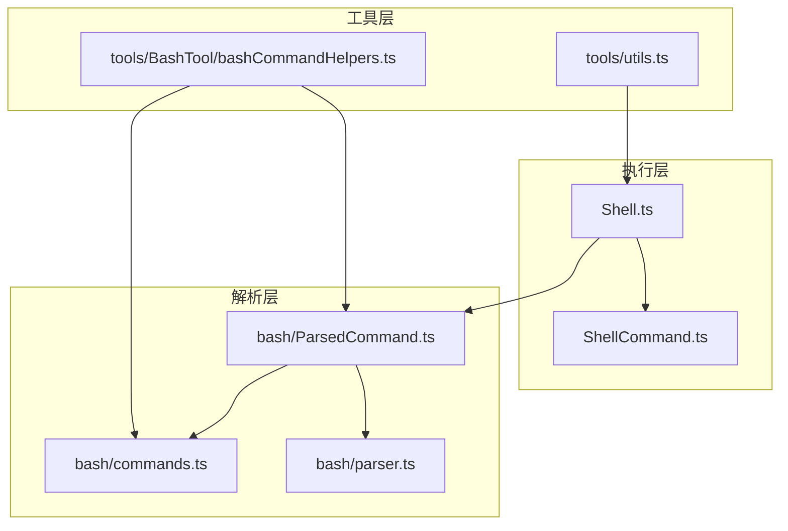
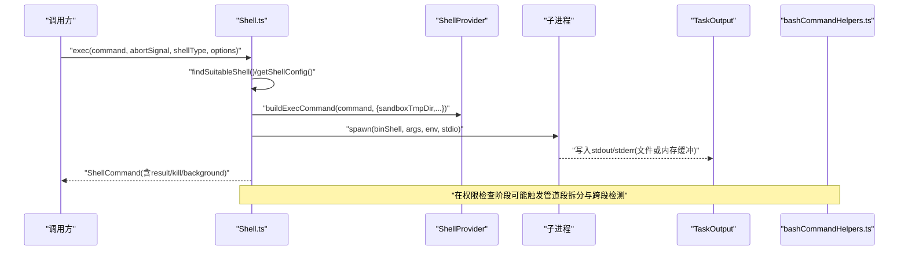
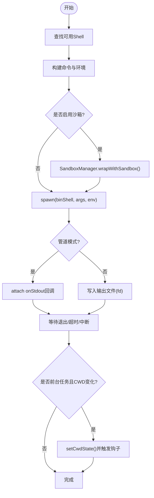
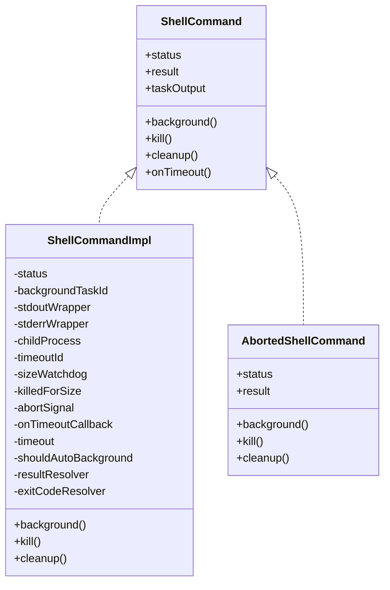
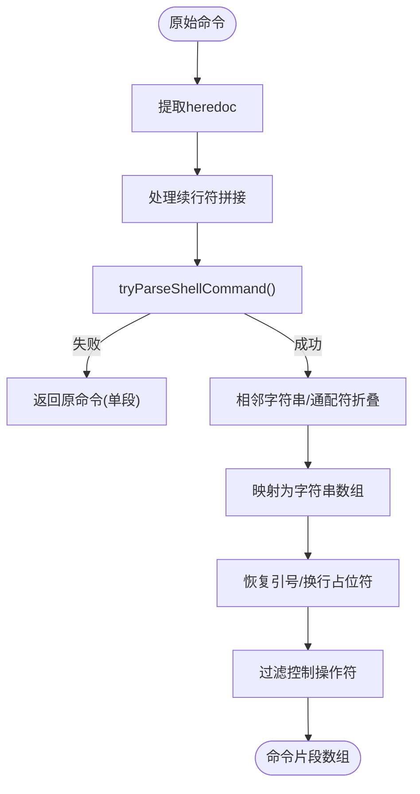
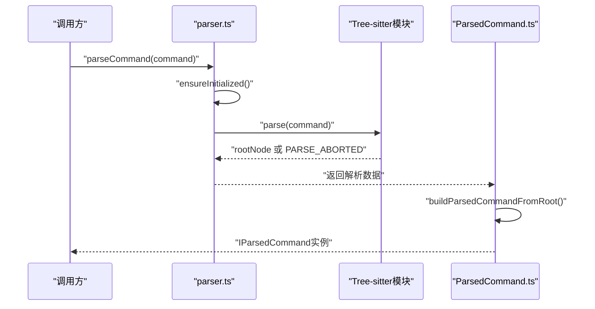
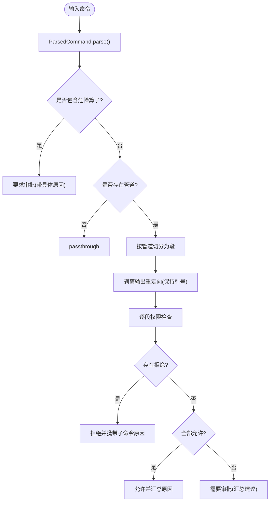
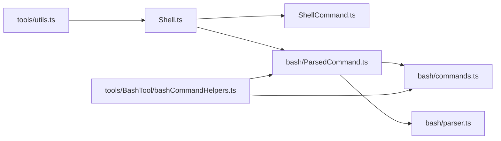

# 工具函数库

<cite>
**本文引用的文件**
- [src/utils/Shell.ts](file://src/utils/Shell.ts)
- [src/utils/ShellCommand.ts](file://src/utils/ShellCommand.ts)
- [src/utils/bash/commands.ts](file://src/utils/bash/commands.ts)
- [src/utils/bash/parser.ts](file://src/utils/bash/parser.ts)
- [src/utils/bash/ParsedCommand.ts](file://src/utils/bash/ParsedCommand.ts)
- [src/tools/utils.ts](file://src/tools/utils.ts)
- [src/tools/BashTool/bashCommandHelpers.ts](file://src/tools/BashTool/bashCommandHelpers.ts)
</cite>

## 目录
1. [简介](#简介)
2. [项目结构](#项目结构)
3. [核心组件](#核心组件)
4. [架构总览](#架构总览)
5. [详细组件分析](#详细组件分析)
6. [依赖关系分析](#依赖关系分析)
7. [性能考量](#性能考量)
8. [故障排查指南](#故障排查指南)
9. [结论](#结论)
10. [附录](#附录)

## 简介
本文件系统性梳理 Claude Code 的工具函数库，重点覆盖以下方面：
- 设计原则与组织结构：模块化、安全优先、可扩展、可观测性与可维护性
- 文件操作相关工具：路径解析、工作目录变更、沙箱隔离、输出持久化
- 命令执行相关工具：Shell 选择与适配、进程生命周期管理、超时与中断处理、输出解析与进度回调
- Git 集成相关工具：权限检查与跨段检测（防止裸仓库绕过）、安全策略
- 输入处理工具：命令拆分、重定向剥离、前缀提取、帮助命令识别
- 错误处理与异常：失败回退、资源清理、日志与遥测
- 使用示例与最佳实践：推荐调用流程、参数配置、安全建议

## 项目结构
工具函数库主要分布在以下位置：
- 执行层：Shell.ts、ShellCommand.ts
- 解析层：bash/commands.ts、bash/parser.ts、bash/ParsedCommand.ts
- 工具层：tools/utils.ts、tools/BashTool/bashCommandHelpers.ts

**图表来源**
- [src/utils/Shell.ts](file://src/utils/Shell.ts)
- [src/utils/ShellCommand.ts](file://src/utils/ShellCommand.ts)
- [src/utils/bash/commands.ts](file://src/utils/bash/commands.ts)
- [src/utils/bash/parser.ts](file://src/utils/bash/parser.ts)
- [src/utils/bash/ParsedCommand.ts](file://src/utils/bash/ParsedCommand.ts)
- [src/tools/utils.ts](file://src/tools/utils.ts)
- [src/tools/BashTool/bashCommandHelpers.ts](file://src/tools/BashTool/bashCommandHelpers.ts)

**章节来源**
- [src/utils/Shell.ts](file://src/utils/Shell.ts)
- [src/utils/ShellCommand.ts](file://src/utils/ShellCommand.ts)
- [src/utils/bash/commands.ts](file://src/utils/bash/commands.ts)
- [src/utils/bash/parser.ts](file://src/utils/bash/parser.ts)
- [src/utils/bash/ParsedCommand.ts](file://src/utils/bash/ParsedCommand.ts)
- [src/tools/utils.ts](file://src/tools/utils.ts)
- [src/tools/BashTool/bashCommandHelpers.ts](file://src/tools/BashTool/bashCommandHelpers.ts)

## 核心组件
- Shell.ts
  - 提供 Shell 选择、环境准备、进程启动、输出持久化、工作目录更新、沙箱包装等能力
  - 关键导出：findSuitableShell、getShellConfig、exec、setCwd
- ShellCommand.ts
  - 封装子进程生命周期、超时控制、中断处理、后台运行、输出截断保护、结果聚合
  - 关键导出：wrapSpawn、createAbortedCommand、createFailedCommand、ShellCommand 接口
- bash/commands.ts
  - 命令拆分、重定向剥离、帮助命令识别、前缀提取、危险算子检测、占位符注入防护
  - 关键导出：splitCommandWithOperators、splitCommand_DEPRECATED、extractOutputRedirections、getCommandSubcommandPrefix
- bash/parser.ts
  - Tree-sitter 解析入口、节点搜索、变量提取、命令参数提取、解析中止哨兵
  - 关键导出：ensureInitialized、parseCommand、parseCommandRaw、PARSE_ABORTED
- bash/ParsedCommand.ts
  - 统一解析接口 IParsedCommand、管道段提取、重定向剥离、树分析、备选正则实现
  - 关键导出：ParsedCommand.parse、buildParsedCommandFromRoot
- tools/utils.ts
  - 消息标记与工具使用 ID 提取，用于 UI 一致性与消息去重
  - 关键导出：tagMessagesWithToolUseID、getToolUseIDFromParentMessage
- tools/BashTool/bashCommandHelpers.ts
  - 权限检查增强：多段命令、管道段、cd+git 跨段组合检测、重定向剥离、决策合并
  - 关键导出：checkCommandOperatorPermissions、bashToolCheckCommandOperatorPermissions、segmentedCommandPermissionResult

**章节来源**
- [src/utils/Shell.ts](file://src/utils/Shell.ts)
- [src/utils/ShellCommand.ts](file://src/utils/ShellCommand.ts)
- [src/utils/bash/commands.ts](file://src/utils/bash/commands.ts)
- [src/utils/bash/parser.ts](file://src/utils/bash/parser.ts)
- [src/utils/bash/ParsedCommand.ts](file://src/utils/bash/ParsedCommand.ts)
- [src/tools/utils.ts](file://src/tools/utils.ts)
- [src/tools/BashTool/bashCommandHelpers.ts](file://src/tools/BashTool/bashCommandHelpers.ts)

## 架构总览
整体执行链路从“输入命令”到“安全检查”再到“进程执行”，并贯穿“输出持久化与进度回调”。

**图表来源**
- [src/utils/Shell.ts](file://src/utils/Shell.ts)
- [src/utils/ShellCommand.ts](file://src/utils/ShellCommand.ts)
- [src/tools/BashTool/bashCommandHelpers.ts](file://src/tools/BashTool/bashCommandHelpers.ts)

## 详细组件分析

### Shell.ts：Shell 选择、执行与工作目录管理
- Shell 选择
  - 支持环境变量覆盖、用户首选 Shell、自动探测与可执行性校验
  - 失败时抛出明确错误信息，便于诊断
- 执行流程
  - 构建命令字符串、确定 CWD、沙箱包装（可选）、设置环境变量、选择 spawn 参数
  - 支持文件模式与管道模式两种输出路径；管道模式支持实时 onStdout 回调
  - 进程退出后根据是否前台任务决定是否更新工作目录，并触发钩子
- 安全与稳定性
  - 输出文件使用 O_NOFOLLOW 防符号链接攻击；Windows 下采用字符串标志避免 EINVAL
  - 超大输出文件自动杀进程并提示截断；沙箱后清理残留文件
- 错误处理
  - spawn 失败时清理句柄并返回“已中止/失败”命令对象
  - CWD 恢复逻辑对不存在目录进行回退处理

**图表来源**
- [src/utils/Shell.ts](file://src/utils/Shell.ts)

**章节来源**
- [src/utils/Shell.ts](file://src/utils/Shell.ts)

### ShellCommand.ts：进程生命周期与结果聚合
- 生命周期
  - 包装子进程，统一处理 exit/error 事件、超时回调、中断信号
  - 支持后台运行（background）与手动 kill
- 输出与进度
  - TaskOutput 负责 stdout/stderr 写入与读取；文件模式下轮询尾部以计算进度
  - 管道模式下通过 StreamWrapper 实时转发数据
- 资源清理
  - cleanup 释放监听器与内部引用，避免内存泄漏
- 结果聚合
  - 返回标准字段：stdout、stderr、退出码、是否被中断、后台任务标识、输出文件路径与大小等

**图表来源**
- [src/utils/ShellCommand.ts](file://src/utils/ShellCommand.ts)

**章节来源**
- [src/utils/ShellCommand.ts](file://src/utils/ShellCommand.ts)

### bash/commands.ts：命令解析与安全策略
- 命令拆分
  - 使用占位符注入与恢复机制，确保解析不被注入；处理续行符拼接、heredoc 提取与还原
  - 过滤控制操作符，保留纯命令片段
- 重定向剥离
  - 仅对静态目标进行剥离，动态目标（含变量、命令替换、通配符等）保留以供权限提示
- 帮助命令识别
  - 严格限制仅允许无其他标志的简单 --help 形式，避免前缀泛化
- 前缀提取与子命令前缀
  - 基于策略规范与预检（如 isHelpCommand），结合 splitCommand_DEPRECATED 生成子命令前缀
- 危险算子检测
  - 在树解析不可用时，回退到正则路径，判断复合命令与命令列表的安全性

**图表来源**
- [src/utils/bash/commands.ts](file://src/utils/bash/commands.ts)

**章节来源**
- [src/utils/bash/commands.ts](file://src/utils/bash/commands.ts)

### bash/parser.ts 与 ParsedCommand.ts：树解析与统一接口
- 解析入口
  - ensureInitialized 确保 Tree-sitter 初始化；parseCommandRaw 提供“加载但解析中止”的哨兵值
- 节点搜索与变量提取
  - findCommandNode 递归定位命令节点；extractEnvVars 提取变量赋值
  - extractCommandArguments 支持声明类命令与普通命令参数提取
- 统一解析接口
  - IParsedCommand 抽象：管道段、剥离重定向、输出重定向列表、树分析
  - TreeSitterParsedCommand 基于 AST；RegexParsedCommand_DEPRECATED 作为回退

**图表来源**
- [src/utils/bash/parser.ts](file://src/utils/bash/parser.ts)
- [src/utils/bash/ParsedCommand.ts](file://src/utils/bash/ParsedCommand.ts)

**章节来源**
- [src/utils/bash/parser.ts](file://src/utils/bash/parser.ts)
- [src/utils/bash/ParsedCommand.ts](file://src/utils/bash/ParsedCommand.ts)

### tools/utils.ts：消息标记与工具使用 ID
- 为用户消息附加 sourceToolUseID，避免工具未完成时 UI 重复显示
- 从父消息中提取指定工具的工具使用 ID，便于关联上下文

**章节来源**
- [src/tools/utils.ts](file://src/tools/utils.ts)

### tools/BashTool/bashCommandHelpers.ts：权限检查与跨段检测
- 多段命令与管道段处理
  - 对每个段进行权限检查，收集决策原因与建议；任一拒绝即拒绝整条命令
  - 允许全部允许或需要审批的混合结果，汇总建议
- 跨段检测
  - 检测 cd 与 git 分布在不同管道段的情况，防止裸仓库监控绕过
- 重定向剥离
  - 使用 ParsedCommand 去除输出重定向，避免将文件名误判为命令
- 决策合并
  - 将各段结果合并为最终权限结果，必要时构造请求消息

**图表来源**
- [src/tools/BashTool/bashCommandHelpers.ts](file://src/tools/BashTool/bashCommandHelpers.ts)
- [src/utils/bash/ParsedCommand.ts](file://src/utils/bash/ParsedCommand.ts)
- [src/utils/bash/commands.ts](file://src/utils/bash/commands.ts)

**章节来源**
- [src/tools/BashTool/bashCommandHelpers.ts](file://src/tools/BashTool/bashCommandHelpers.ts)

## 依赖关系分析
- 模块耦合
  - Shell.ts 依赖 ShellCommand.ts 与 TaskOutput；间接依赖 ParsedCommand.ts 与权限工具
  - ParsedCommand.ts 同时依赖 commands.ts 与 parser.ts，形成解析层闭环
  - bashCommandHelpers.ts 依赖 commands.ts 与 ParsedCommand.ts，负责权限增强
- 外部依赖
  - 子进程管理、文件系统、平台差异、沙箱适配、Tree-sitter WASM
- 循环依赖
  - 当前设计避免直接循环；解析层通过接口抽象降低耦合

**图表来源**
- [src/utils/Shell.ts](file://src/utils/Shell.ts)
- [src/utils/ShellCommand.ts](file://src/utils/ShellCommand.ts)
- [src/utils/bash/commands.ts](file://src/utils/bash/commands.ts)
- [src/utils/bash/parser.ts](file://src/utils/bash/parser.ts)
- [src/utils/bash/ParsedCommand.ts](file://src/utils/bash/ParsedCommand.ts)
- [src/tools/utils.ts](file://src/tools/utils.ts)
- [src/tools/BashTool/bashCommandHelpers.ts](file://src/tools/BashTool/bashCommandHelpers.ts)

**章节来源**
- [src/utils/Shell.ts](file://src/utils/Shell.ts)
- [src/utils/ShellCommand.ts](file://src/utils/ShellCommand.ts)
- [src/utils/bash/commands.ts](file://src/utils/bash/commands.ts)
- [src/utils/bash/parser.ts](file://src/utils/bash/parser.ts)
- [src/utils/bash/ParsedCommand.ts](file://src/utils/bash/ParsedCommand.ts)
- [src/tools/utils.ts](file://src/tools/utils.ts)
- [src/tools/BashTool/bashCommandHelpers.ts](file://src/tools/BashTool/bashCommandHelpers.ts)

## 性能考量
- 解析缓存
  - ParsedCommand.parse 使用单条目缓存，避免重复解析同一命令带来的开销
  - getShellConfig 与 getPsProvider 使用 memoize，减少每次会话重复初始化
- I/O 优化
  - 文件模式下使用 O_APPEND 保证原子写入；Windows 采用字符串标志避免数值标志导致的错误
  - 管道模式下通过 StreamWrapper 减少中间层转换成本
- 超时与后台
  - 支持自动后台与定时器 watchdog，防止长时间阻塞与磁盘写满
- 平台差异
  - Windows 与 POSIX 在文件权限、句柄行为上分别处理，避免跨平台问题

## 故障排查指南
- 无法找到可用 Shell
  - 现象：抛出“未找到合适 Shell”错误
  - 排查：检查 SHELL 环境变量、CLAUDE_CODE_SHELL 覆盖、可执行性
  - 参考：[src/utils/Shell.ts](file://src/utils/Shell.ts)
- CWD 不存在或被删除
  - 现象：执行失败或提示重启到现有目录
  - 排查：确认当前工作目录存在；查看恢复逻辑与日志
  - 参考：[src/utils/Shell.ts](file://src/utils/Shell.ts)
- 命令解析失败
  - 现象：回退到单段命令或提示危险
  - 排查：检查语法、heredoc、续行符；确认 Tree-sitter 是否可用
  - 参考：[src/utils/bash/commands.ts](file://src/utils/bash/commands.ts), [src/utils/bash/parser.ts](file://src/utils/bash/parser.ts)
- 输出过大被截断
  - 现象：stderr 提示输出超过阈值并被终止
  - 排查：查看输出文件路径与大小；考虑后台运行
  - 参考：[src/utils/ShellCommand.ts](file://src/utils/ShellCommand.ts)
- 权限拒绝
  - 现象：需要审批或拒绝
  - 排查：检查管道段拆分、cd+git 跨段组合、重定向剥离后的命令
  - 参考：[src/tools/BashTool/bashCommandHelpers.ts](file://src/tools/BashTool/bashCommandHelpers.ts)

**章节来源**
- [src/utils/Shell.ts](file://src/utils/Shell.ts)
- [src/utils/ShellCommand.ts](file://src/utils/ShellCommand.ts)
- [src/utils/bash/commands.ts](file://src/utils/bash/commands.ts)
- [src/utils/bash/parser.ts](file://src/utils/bash/parser.ts)
- [src/tools/BashTool/bashCommandHelpers.ts](file://src/tools/BashTool/bashCommandHelpers.ts)

## 结论
该工具函数库围绕“安全、稳定、可观测”三大目标构建，通过解析层与执行层的清晰分离、权限检查的多维度设计、以及完善的错误处理与资源清理机制，为命令执行提供了可靠支撑。推荐在生产环境中：
- 明确 Shell 选择策略与覆盖方式
- 合理使用沙箱与输出截断保护
- 在复杂命令场景下启用管道段权限检查
- 利用消息标记与工具使用 ID 提升 UI 一致性

## 附录
- 最佳实践
  - 优先使用管道模式获取实时输出；文件模式适合长任务持久化
  - 对包含重定向、管道、子壳的命令启用权限检查增强
  - 避免在命令中混入动态目标（变量、命令替换、通配符）用于重定向目标
  - 后台运行时关注输出文件大小与磁盘占用
- 常见问题速查
  - “找不到 Shell”：检查 SHELL 与 CLAUDE_CODE_SHELL
  - “CWD 不可用”：回到上一个有效目录或重启会话
  - “命令被拒绝”：简化命令、移除危险算子或获得审批