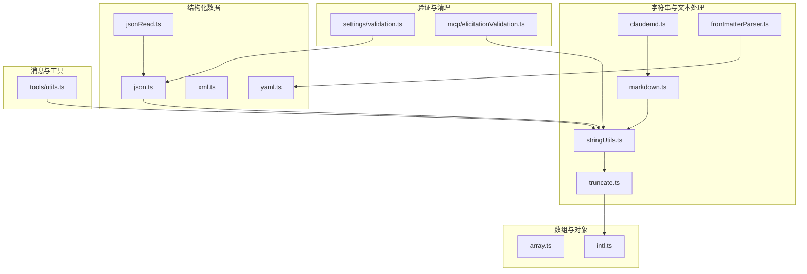
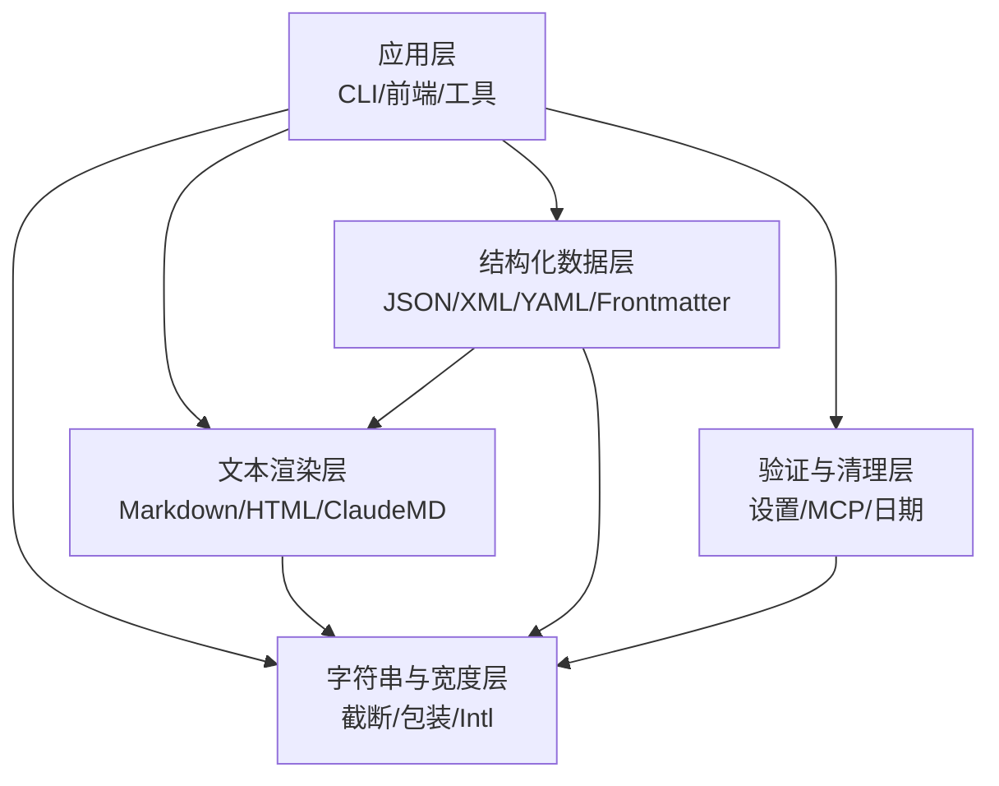
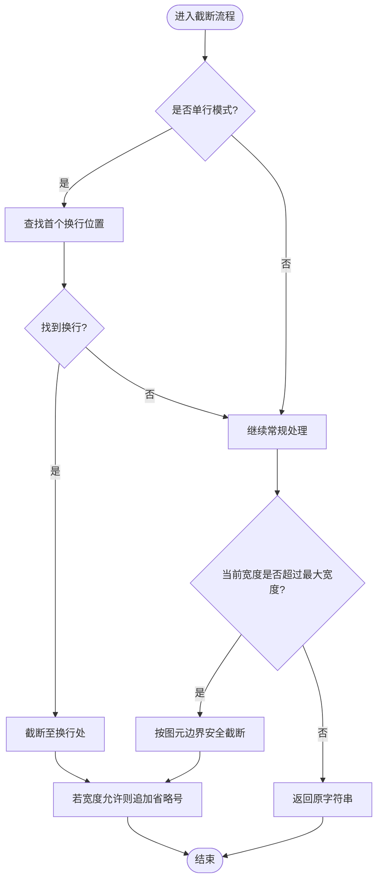
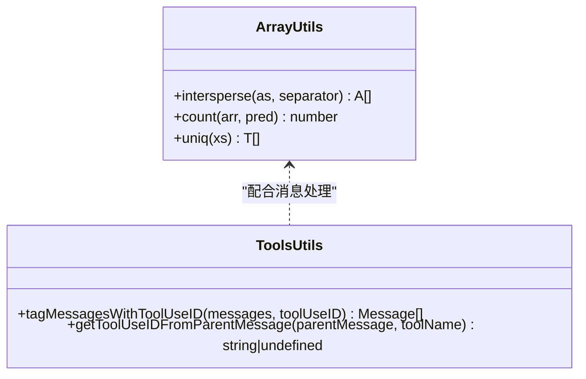
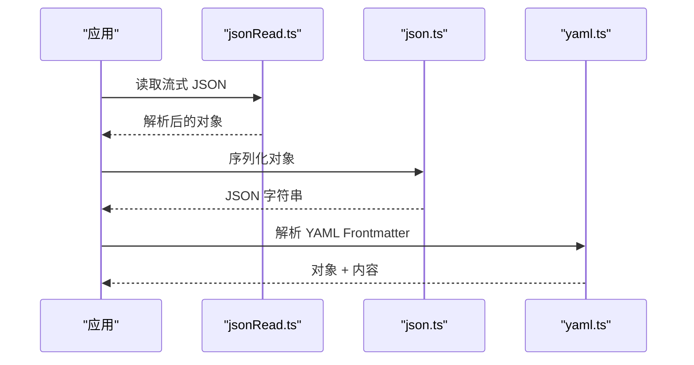
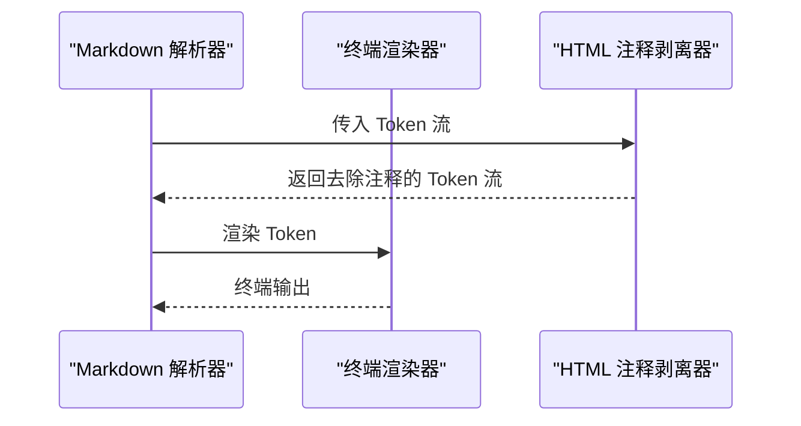
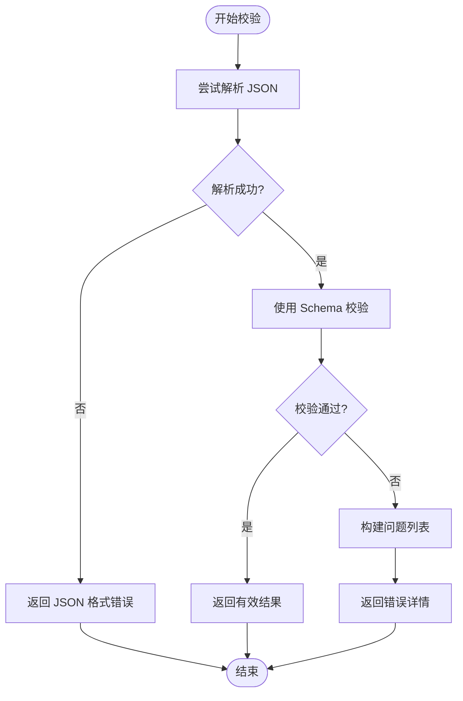
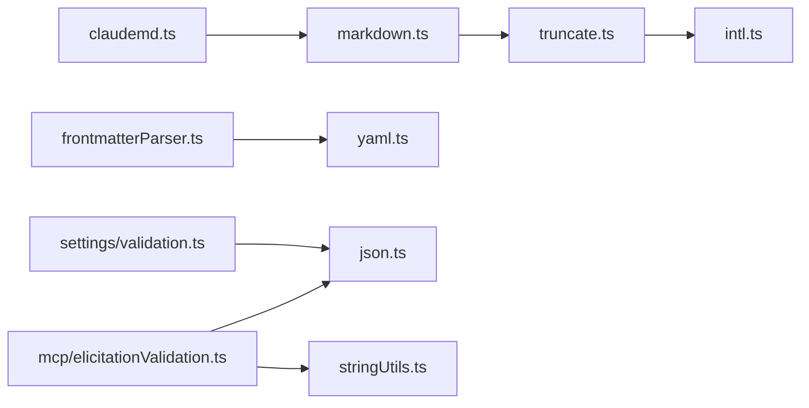

# 数据处理工具

<cite>
**本文引用的文件**
- [src/utils/stringUtils.ts](file://src/utils/stringUtils.ts)
- [src/utils/truncate.ts](file://src/utils/truncate.ts)
- [src/utils/array.ts](file://src/utils/array.ts)
- [src/utils/intl.ts](file://src/utils/intl.ts)
- [src/utils/json.ts](file://src/utils/json.ts)
- [src/utils/jsonRead.ts](file://src/utils/jsonRead.ts)
- [src/utils/xml.ts](file://src/utils/xml.ts)
- [src/utils/yaml.ts](file://src/utils/yaml.ts)
- [src/utils/markdown.ts](file://src/utils/markdown.ts)
- [src/utils/claudemd.ts](file://src/utils/claudemd.ts)
- [src/utils/frontmatterParser.ts](file://src/utils/frontmatterParser.ts)
- [src/utils/settings/validation.ts](file://src/utils/settings/validation.ts)
- [src/utils/mcp/elicitationValidation.ts](file://src/utils/mcp/elicitationValidation.ts)
- [src/tools/utils.ts](file://src/tools/utils.ts)
</cite>

## 目录
1. [简介](#简介)
2. [项目结构](#项目结构)
3. [核心组件](#核心组件)
4. [架构总览](#架构总览)
5. [详细组件分析](#详细组件分析)
6. [依赖关系分析](#依赖关系分析)
7. [性能考量](#性能考量)
8. [故障排查指南](#故障排查指南)
9. [结论](#结论)
10. [附录：使用示例与最佳实践](#附录使用示例与最佳实践)

## 简介
本文件系统性梳理并说明代码库中的数据处理工具函数，覆盖以下主题：
- 字符串处理：宽度感知截断、路径中间截断、行内截断、包装换行、图元边界安全处理
- 数组与对象处理：去重、计数、交错插入、消息标记与工具调用 ID 提取
- 结构化数据格式：JSON 解析/读取、XML 工具、YAML 工具（含 Frontmatter）
- 文本处理：Markdown 渲染、HTML 注释剥离、ClaudeMD 特定处理
- 验证与清理：设置文件校验、MCP 输入校验、日期时间解析辅助、安全转义与格式化

这些工具广泛用于 CLI 输出、消息渲染、配置校验、前端渲染与数据清洗等场景。

## 项目结构
数据处理相关能力主要集中在 src/utils 下的专用模块，并在 src/tools 中提供与消息/工具交互相关的实用函数。下图给出概览：

**图表来源**
- [src/utils/stringUtils.ts](file://src/utils/stringUtils.ts)
- [src/utils/truncate.ts](file://src/utils/truncate.ts)
- [src/utils/markdown.ts](file://src/utils/markdown.ts)
- [src/utils/claudemd.ts](file://src/utils/claudemd.ts)
- [src/utils/frontmatterParser.ts](file://src/utils/frontmatterParser.ts)
- [src/utils/json.ts](file://src/utils/json.ts)
- [src/utils/jsonRead.ts](file://src/utils/jsonRead.ts)
- [src/utils/xml.ts](file://src/utils/xml.ts)
- [src/utils/yaml.ts](file://src/utils/yaml.ts)
- [src/utils/array.ts](file://src/utils/array.ts)
- [src/utils/intl.ts](file://src/utils/intl.ts)
- [src/utils/settings/validation.ts](file://src/utils/settings/validation.ts)
- [src/utils/mcp/elicitationValidation.ts](file://src/utils/mcp/elicitationValidation.ts)
- [src/tools/utils.ts](file://src/tools/utils.ts)

**章节来源**
- [src/utils/stringUtils.ts](file://src/utils/stringUtils.ts)
- [src/utils/truncate.ts](file://src/utils/truncate.ts)
- [src/utils/array.ts](file://src/utils/array.ts)
- [src/utils/intl.ts](file://src/utils/intl.ts)
- [src/utils/json.ts](file://src/utils/json.ts)
- [src/utils/jsonRead.ts](file://src/utils/jsonRead.ts)
- [src/utils/xml.ts](file://src/utils/xml.ts)
- [src/utils/yaml.ts](file://src/utils/yaml.ts)
- [src/utils/markdown.ts](file://src/utils/markdown.ts)
- [src/utils/claudemd.ts](file://src/utils/claudemd.ts)
- [src/utils/frontmatterParser.ts](file://src/utils/frontmatterParser.ts)
- [src/utils/settings/validation.ts](file://src/utils/settings/validation.ts)
- [src/utils/mcp/elicitationValidation.ts](file://src/utils/mcp/elicitationValidation.ts)
- [src/tools/utils.ts](file://src/tools/utils.ts)

## 核心组件
- 字符串与宽度处理：提供宽度感知的截断、包装、路径中间截断、首尾图元提取等能力，确保终端显示正确且不破坏 Emoji/CJK/代理对
- 数组与对象工具：提供去重、计数、交错插入等通用操作；消息工具提供工具调用 ID 标记与提取
- 结构化数据：JSON/JSON-R 读取、XML/YAML 工具；Frontmatter 解析与值转义
- 文本渲染：Markdown 渲染器、HTML 注释剥离、ClaudeMD 特定处理
- 验证与清理：设置文件校验、MCP 输入校验、日期时间解析辅助

**章节来源**
- [src/utils/truncate.ts](file://src/utils/truncate.ts)
- [src/utils/array.ts](file://src/utils/array.ts)
- [src/utils/intl.ts](file://src/utils/intl.ts)
- [src/utils/json.ts](file://src/utils/json.ts)
- [src/utils/jsonRead.ts](file://src/utils/jsonRead.ts)
- [src/utils/xml.ts](file://src/utils/xml.ts)
- [src/utils/yaml.ts](file://src/utils/yaml.ts)
- [src/utils/frontmatterParser.ts](file://src/utils/frontmatterParser.ts)
- [src/utils/markdown.ts](file://src/utils/markdown.ts)
- [src/utils/claudemd.ts](file://src/utils/claudemd.ts)
- [src/utils/settings/validation.ts](file://src/utils/settings/validation.ts)
- [src/utils/mcp/elicitationValidation.ts](file://src/utils/mcp/elicitationValidation.ts)
- [src/tools/utils.ts](file://src/tools/utils.ts)

## 架构总览
下图展示数据处理工具在不同层之间的协作关系与职责划分：

**图表来源**
- [src/utils/markdown.ts](file://src/utils/markdown.ts)
- [src/utils/claudemd.ts](file://src/utils/claudemd.ts)
- [src/utils/frontmatterParser.ts](file://src/utils/frontmatterParser.ts)
- [src/utils/json.ts](file://src/utils/json.ts)
- [src/utils/jsonRead.ts](file://src/utils/jsonRead.ts)
- [src/utils/xml.ts](file://src/utils/xml.ts)
- [src/utils/yaml.ts](file://src/utils/yaml.ts)
- [src/utils/truncate.ts](file://src/utils/truncate.ts)
- [src/utils/intl.ts](file://src/utils/intl.ts)
- [src/utils/settings/validation.ts](file://src/utils/settings/validation.ts)
- [src/utils/mcp/elicitationValidation.ts](file://src/utils/mcp/elicitationValidation.ts)

## 详细组件分析

### 字符串处理工具
- 宽度感知截断与包装
  - 支持从起始/末尾截断、中间截断保留首尾片段、单行截断到首个换行、无省略号截断等策略
  - 基于图元边界分割，避免破坏 Emoji/CJK/代理对
  - 使用宽度计算函数进行终端列宽控制
- 路径中间截断
  - 在路径中保留目录上下文与文件名，通过“…”占位实现
- 图元与语言环境
  - 提供首/尾图元提取、词段/图元段分割器缓存、相对时间格式化、时区与系统语言获取

**图表来源**
- [src/utils/truncate.ts](file://src/utils/truncate.ts)
- [src/utils/intl.ts](file://src/utils/intl.ts)

**章节来源**
- [src/utils/truncate.ts](file://src/utils/truncate.ts)
- [src/utils/intl.ts](file://src/utils/intl.ts)

### 数组与对象处理工具
- 数组工具
  - 交错插入：在元素间按索引动态插入分隔符
  - 计数：基于谓词统计满足条件的元素数量
  - 去重：利用 Set 实现可迭代对象去重
- 消息与工具调用 ID
  - 将用户消息标记为来自特定工具调用 ID，避免 UI 重复显示“运行中”提示
  - 从父消息中提取指定工具的工具调用 ID

**图表来源**
- [src/utils/array.ts](file://src/utils/array.ts)
- [src/tools/utils.ts](file://src/tools/utils.ts)

**章节来源**
- [src/utils/array.ts](file://src/utils/array.ts)
- [src/tools/utils.ts](file://src/tools/utils.ts)

### JSON、XML、YAML 工具
- JSON
  - 提供 JSON 序列化与读取工具，便于统一处理结构化数据
- JSON-R（读取）
  - 面向 NDJSON/流式 JSON 的读取封装，支持安全解析
- XML
  - 提供 XML 处理工具（如命名空间、节点遍历等），用于与外部系统或文档格式交互
- YAML
  - 提供 YAML 工具（如解析、转义、序列化），结合 Frontmatter 解析器使用

**图表来源**
- [src/utils/jsonRead.ts](file://src/utils/jsonRead.ts)
- [src/utils/json.ts](file://src/utils/json.ts)
- [src/utils/yaml.ts](file://src/utils/yaml.ts)
- [src/utils/frontmatterParser.ts](file://src/utils/frontmatterParser.ts)

**章节来源**
- [src/utils/json.ts](file://src/utils/json.ts)
- [src/utils/jsonRead.ts](file://src/utils/jsonRead.ts)
- [src/utils/xml.ts](file://src/utils/xml.ts)
- [src/utils/yaml.ts](file://src/utils/yaml.ts)
- [src/utils/frontmatterParser.ts](file://src/utils/frontmatterParser.ts)

### 文本处理工具
- Markdown 渲染
  - 支持标题、粗体、斜体、水平线、图片链接、链接等语法的终端渲染
- HTML 注释剥离
  - 在 Markdown Token 流中识别并剥离 HTML 注释，保留非注释内容
- ClaudeMD 特定处理
  - 针对特定 Markdown 扩展与注释规则的预处理与后处理

**图表来源**
- [src/utils/markdown.ts](file://src/utils/markdown.ts)
- [src/utils/claudemd.ts](file://src/utils/claudemd.ts)

**章节来源**
- [src/utils/markdown.ts](file://src/utils/markdown.ts)
- [src/utils/claudemd.ts](file://src/utils/claudemd.ts)

### 验证与清理工具
- 设置文件校验
  - 将输入内容解析为 JSON 后与 Schema 对比，生成结构化的错误信息（字段缺失、类型不符、枚举值无效、数值范围等）
- MCP 输入校验
  - 针对字符串格式（邮箱、URI、日期、日期时间）与枚举/多选枚举进行校验，支持自然语言日期时间解析辅助
- 日期时间解析辅助
  - 判断是否为 ISO8601 风格，提供自然语言日期时间解析入口

**图表来源**
- [src/utils/settings/validation.ts](file://src/utils/settings/validation.ts)
- [src/utils/mcp/elicitationValidation.ts](file://src/utils/mcp/elicitationValidation.ts)

**章节来源**
- [src/utils/settings/validation.ts](file://src/utils/settings/validation.ts)
- [src/utils/mcp/elicitationValidation.ts](file://src/utils/mcp/elicitationValidation.ts)

## 依赖关系分析
- 截断与包装依赖图元段分割器与宽度计算，确保跨语言字符正确显示
- Frontmatter 解析依赖 YAML 工具与正则表达式，对特殊字符进行安全转义
- 设置与 MCP 校验依赖 JSON 工具与 Zod Schema，保证输入一致性与安全性
- Markdown 渲染依赖 HTML 注释剥离器，提升渲染质量

**图表来源**
- [src/utils/truncate.ts](file://src/utils/truncate.ts)
- [src/utils/intl.ts](file://src/utils/intl.ts)
- [src/utils/markdown.ts](file://src/utils/markdown.ts)
- [src/utils/claudemd.ts](file://src/utils/claudemd.ts)
- [src/utils/frontmatterParser.ts](file://src/utils/frontmatterParser.ts)
- [src/utils/yaml.ts](file://src/utils/yaml.ts)
- [src/utils/json.ts](file://src/utils/json.ts)
- [src/utils/settings/validation.ts](file://src/utils/settings/validation.ts)
- [src/utils/mcp/elicitationValidation.ts](file://src/utils/mcp/elicitationValidation.ts)
- [src/utils/stringUtils.ts](file://src/utils/stringUtils.ts)

**章节来源**
- [src/utils/truncate.ts](file://src/utils/truncate.ts)
- [src/utils/intl.ts](file://src/utils/intl.ts)
- [src/utils/markdown.ts](file://src/utils/markdown.ts)
- [src/utils/claudemd.ts](file://src/utils/claudemd.ts)
- [src/utils/frontmatterParser.ts](file://src/utils/frontmatterParser.ts)
- [src/utils/yaml.ts](file://src/utils/yaml.ts)
- [src/utils/json.ts](file://src/utils/json.ts)
- [src/utils/settings/validation.ts](file://src/utils/settings/validation.ts)
- [src/utils/mcp/elicitationValidation.ts](file://src/utils/mcp/elicitationValidation.ts)
- [src/utils/stringUtils.ts](file://src/utils/stringUtils.ts)

## 性能考量
- 图元段分割器与相对时间格式化采用懒加载与缓存策略，避免重复构造带来的开销
- 截断与包装算法按图元遍历，时间复杂度 O(n)，其中 n 为图元数量；宽度阈值控制可减少不必要的处理
- JSON/YAML 解析与 Schema 校验建议在批量处理时复用已初始化的解析器与格式化器实例

[本节为通用指导，无需列出具体文件来源]

## 故障排查指南
- 截断异常
  - 若出现宽度不一致或字符被截断中间，请确认传入的最大宽度单位为终端列宽，并检查是否启用了单行模式
- Markdown 渲染问题
  - 若 HTML 注释未被正确剥离，请检查 Token 类型与注释格式是否符合规范
- 设置文件校验失败
  - 查看错误信息中的字段路径与期望类型，修正类型或枚举值；对于空 JSON/null 的情况，注意报错提示会明确指出
- MCP 输入校验失败
  - 对于字符串格式（邮箱/URI/日期/日期时间），请确保输入符合对应格式；必要时使用自然语言解析辅助

**章节来源**
- [src/utils/truncate.ts](file://src/utils/truncate.ts)
- [src/utils/claudemd.ts](file://src/utils/claudemd.ts)
- [src/utils/settings/validation.ts](file://src/utils/settings/validation.ts)
- [src/utils/mcp/elicitationValidation.ts](file://src/utils/mcp/elicitationValidation.ts)

## 结论
该工具集以“宽度感知、图元安全、格式兼容、可扩展”为核心设计原则，覆盖字符串、数组、结构化数据、文本渲染与验证清理等关键领域。通过模块化组织与清晰的依赖关系，既满足终端与前端渲染需求，又保障了数据处理的一致性与安全性。

[本节为总结性内容，无需列出具体文件来源]

## 附录：使用示例与最佳实践
- 数据清洗
  - 使用数组工具对采集数据进行去重与计数，再结合字符串工具进行宽度截断与安全包装
- 格式转换
  - 使用 JSON/JSON-R 进行结构化数据读写；YAML/Frontmatter 解析用于静态内容管理
- 批量处理
  - 在循环中复用图元段分割器与相对时间格式化器，减少初始化成本
- 安全过滤
  - 在渲染前使用 HTML 注释剥离器清理 Markdown Token 流，避免注入风险
- 验证与提示
  - 对用户输入与外部配置进行设置文件校验与 MCP 输入校验，提供结构化错误信息

[本节为概念性内容，无需列出具体文件来源]