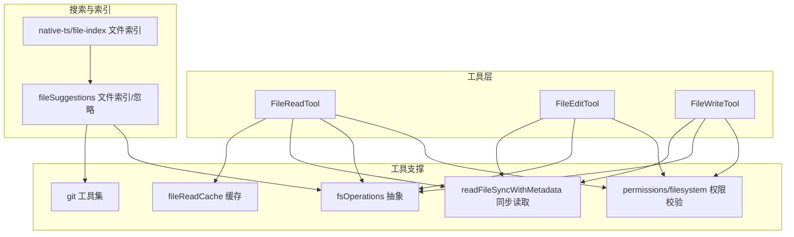
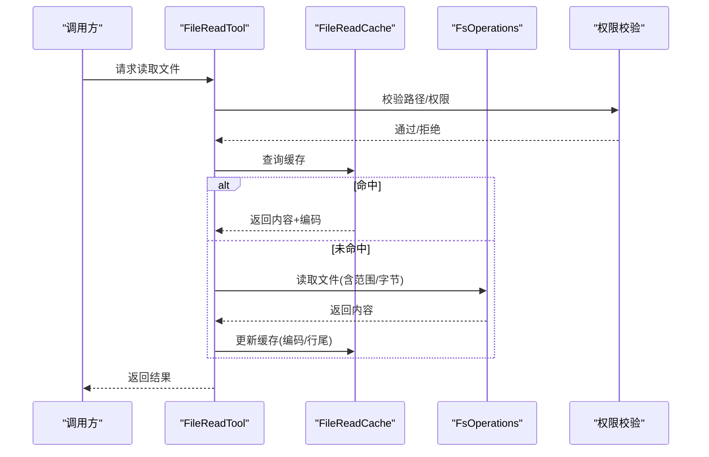
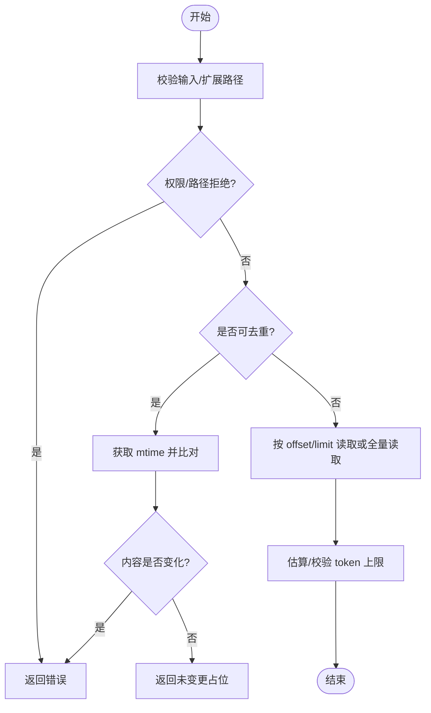
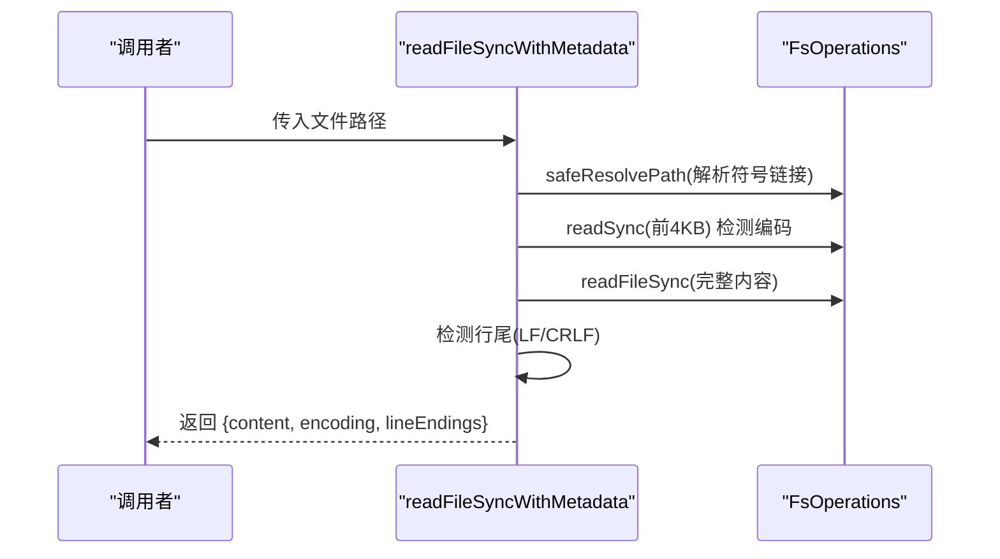
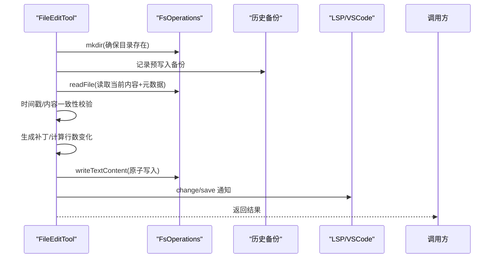
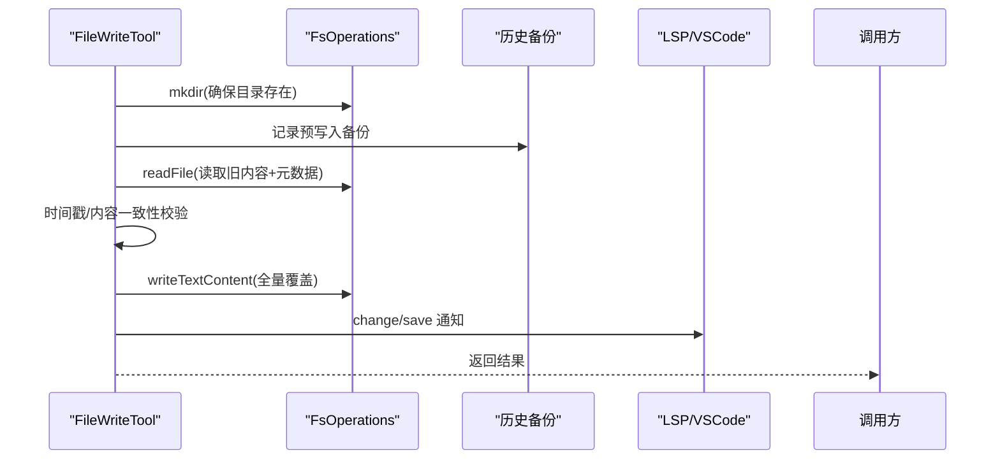
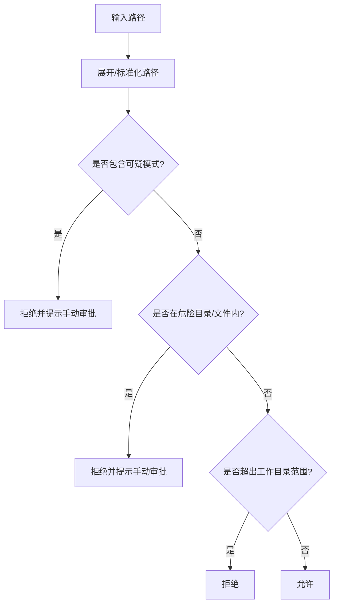
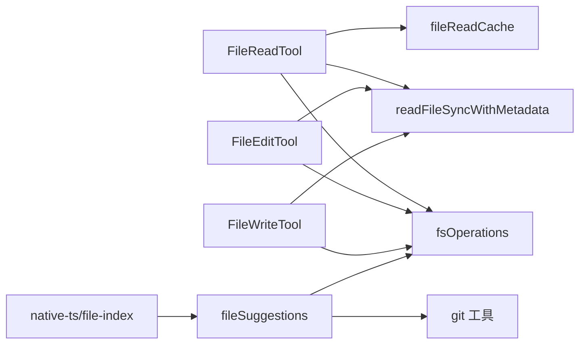

# 文件操作工具

<cite>
**本文引用的文件**
- [src/utils/fileReadCache.ts](file://src/utils/fileReadCache.ts)
- [src/utils/fileRead.ts](file://src/utils/fileRead.ts)
- [src/utils/fsOperations.ts](file://src/utils/fsOperations.ts)
- [src/utils/git.ts](file://src/utils/git.ts)
- [src/utils/gitDiff.ts](file://src/utils/gitDiff.ts)
- [src/utils/git/gitignore.ts](file://src/utils/git/gitignore.ts)
- [src/utils/permissions/filesystem.ts](file://src/utils/permissions/filesystem.ts)
- [src/tools/FileReadTool/FileReadTool.ts](file://src/tools/FileReadTool/FileReadTool.ts)
- [src/tools/FileEditTool/FileEditTool.ts](file://src/tools/FileEditTool/FileEditTool.ts)
- [src/tools/FileWriteTool/FileWriteTool.ts](file://src/tools/FileWriteTool/FileWriteTool.ts)
- [src/hooks/fileSuggestions.ts](file://src/hooks/fileSuggestions.ts)
- [src/native-ts/file-index/index.ts](file://src/native-ts/file-index/index.ts)
</cite>

## 目录
1. [简介](#简介)
2. [项目结构](#项目结构)
3. [核心组件](#核心组件)
4. [架构总览](#架构总览)
5. [详细组件分析](#详细组件分析)
6. [依赖关系分析](#依赖关系分析)
7. [性能考量](#性能考量)
8. [故障排查指南](#故障排查指南)
9. [结论](#结论)
10. [附录](#附录)

## 简介
本文件操作工具文档聚焦于以下方面：
- 文件读取：内容读取、编码检测、行尾识别、缓存机制、去重与性能优化
- 文件写入与编辑：安全写入、权限校验、备份与历史记录、原子性与一致性
- 文件系统操作：目录遍历、文件搜索、路径处理、大小端与平台差异
- Git 集成：仓库定位、状态检查、忽略文件处理、单文件 diff 生成
- 错误处理与异常：路径安全、设备文件阻断、权限拒绝、竞态与并发问题
- 实践建议：大文件处理、并发场景下的注意事项与最佳实践

## 项目结构
围绕文件操作的核心模块分布如下：
- 工具层（Tools）：FileReadTool、FileEditTool、FileWriteTool
- 工具支撑（Utils）：文件读取缓存、同步读取元数据、文件系统抽象、Git 工具、权限校验
- 搜索与索引（Hooks/Native）：文件索引与忽略模式加载、目录缓存清理



图表来源
- [src/tools/FileReadTool/FileReadTool.ts:1-800](file://src/tools/FileReadTool/FileReadTool.ts#L1-L800)
- [src/tools/FileEditTool/FileEditTool.ts:1-626](file://src/tools/FileEditTool/FileEditTool.ts#L1-L626)
- [src/tools/FileWriteTool/FileWriteTool.ts:1-435](file://src/tools/FileWriteTool/FileWriteTool.ts#L1-L435)
- [src/utils/fileReadCache.ts:1-97](file://src/utils/fileReadCache.ts#L1-L97)
- [src/utils/fileRead.ts:1-103](file://src/utils/fileRead.ts#L1-L103)
- [src/utils/fsOperations.ts:1-771](file://src/utils/fsOperations.ts#L1-L771)
- [src/utils/git.ts:1-927](file://src/utils/git.ts#L1-L927)
- [src/utils/gitDiff.ts:1-533](file://src/utils/gitDiff.ts#L1-L533)
- [src/utils/git/gitignore.ts:1-45](file://src/utils/git/gitignore.ts#L1-L45)
- [src/utils/permissions/filesystem.ts:1-800](file://src/utils/permissions/filesystem.ts#L1-L800)
- [src/hooks/fileSuggestions.ts:175-376](file://src/hooks/fileSuggestions.ts#L175-L376)
- [src/native-ts/file-index/index.ts:40-70](file://src/native-ts/file-index/index.ts#L40-L70)

章节来源
- [src/utils/fileReadCache.ts:1-97](file://src/utils/fileReadCache.ts#L1-L97)
- [src/utils/fileRead.ts:1-103](file://src/utils/fileRead.ts#L1-L103)
- [src/utils/fsOperations.ts:1-771](file://src/utils/fsOperations.ts#L1-L771)
- [src/utils/git.ts:1-927](file://src/utils/git.ts#L1-L927)
- [src/utils/gitDiff.ts:1-533](file://src/utils/gitDiff.ts#L1-L533)
- [src/utils/git/gitignore.ts:1-45](file://src/utils/git/gitignore.ts#L1-L45)
- [src/utils/permissions/filesystem.ts:1-800](file://src/utils/permissions/filesystem.ts#L1-L800)
- [src/tools/FileReadTool/FileReadTool.ts:1-800](file://src/tools/FileReadTool/FileReadTool.ts#L1-L800)
- [src/tools/FileEditTool/FileEditTool.ts:1-626](file://src/tools/FileEditTool/FileEditTool.ts#L1-L626)
- [src/tools/FileWriteTool/FileWriteTool.ts:1-435](file://src/tools/FileWriteTool/FileWriteTool.ts#L1-L435)
- [src/hooks/fileSuggestions.ts:175-376](file://src/hooks/fileSuggestions.ts#L175-L376)
- [src/native-ts/file-index/index.ts:40-70](file://src/native-ts/file-index/index.ts#L40-L70)

## 核心组件
- 文件读取缓存（FileReadCache）
  - 基于修改时间的内存缓存，避免重复读取；支持最大容量淘汰
  - 读取时自动检测编码并规范化换行
- 同步读取元数据（readFileSyncWithMetadata）
  - 一次文件读取同时返回内容、编码与行尾类型，供编辑/写入复用
- 文件系统抽象（FsOperations）
  - 统一的文件系统接口，支持同步/异步、范围读取、流式写入、符号链接解析
- Git 工具集（git 工具）
  - 仓库根查找、工作树/子模块解析、远程信息、状态检查、diff 解析
- 权限校验（permissions/filesystem）
  - 跨平台路径比较、危险路径/目录检测、UNC/ADS/短名等可疑模式阻断
- 工具实现
  - FileReadTool：带去重、令牌限制、设备文件阻断、macOS 截图兼容
  - FileEditTool：原子读改写、变更前后对比、LSP 通知、历史备份
  - FileWriteTool：覆盖写入、变更统计、LSP 通知、历史备份

章节来源
- [src/utils/fileReadCache.ts:1-97](file://src/utils/fileReadCache.ts#L1-L97)
- [src/utils/fileRead.ts:1-103](file://src/utils/fileRead.ts#L1-L103)
- [src/utils/fsOperations.ts:1-771](file://src/utils/fsOperations.ts#L1-L771)
- [src/utils/git.ts:1-927](file://src/utils/git.ts#L1-L927)
- [src/utils/gitDiff.ts:1-533](file://src/utils/gitDiff.ts#L1-L533)
- [src/utils/permissions/filesystem.ts:1-800](file://src/utils/permissions/filesystem.ts#L1-L800)
- [src/tools/FileReadTool/FileReadTool.ts:1-800](file://src/tools/FileReadTool/FileReadTool.ts#L1-L800)
- [src/tools/FileEditTool/FileEditTool.ts:1-626](file://src/tools/FileEditTool/FileEditTool.ts#L1-L626)
- [src/tools/FileWriteTool/FileWriteTool.ts:1-435](file://src/tools/FileWriteTool/FileWriteTool.ts#L1-L435)

## 架构总览
文件操作工具的整体流程：
- 输入路径标准化与权限校验
- 读取阶段：缓存命中/未命中、编码与行尾检测、范围读取
- 写入/编辑阶段：原子性保证、历史备份、LSP 通知、Git diff
- Git 集成：仓库定位、忽略规则、状态检查、单文件 diff



图表来源
- [src/tools/FileReadTool/FileReadTool.ts:496-651](file://src/tools/FileReadTool/FileReadTool.ts#L496-L651)
- [src/utils/fileReadCache.ts:22-68](file://src/utils/fileReadCache.ts#L22-L68)
- [src/utils/fsOperations.ts:644-714](file://src/utils/fsOperations.ts#L644-L714)
- [src/utils/permissions/filesystem.ts:620-665](file://src/utils/permissions/filesystem.ts#L620-L665)

## 详细组件分析

### 文件读取工具（FileReadTool）
- 功能要点
  - 去重：基于上次读取的时间戳与偏移范围，若文件未变化则返回“未变更”占位
  - 设备文件阻断：对无限输出或阻塞输入的设备文件进行路径级检查
  - macOS 截图兼容：尝试不同空格字符变体以匹配文件名
  - 令牌限制：根据文件类型估算 token 数量，超过阈值抛出错误
  - 多媒体/PDF：直接返回元数据，不将全文载入消息
- 性能优化
  - 读取范围参数 offset/limit 支持分段读取
  - 缓存命中避免重复 I/O
  - 去重减少重复传输



图表来源
- [src/tools/FileReadTool/FileReadTool.ts:418-573](file://src/tools/FileReadTool/FileReadTool.ts#L418-L573)
- [src/utils/fileReadCache.ts:22-68](file://src/utils/fileReadCache.ts#L22-L68)

章节来源
- [src/tools/FileReadTool/FileReadTool.ts:1-800](file://src/tools/FileReadTool/FileReadTool.ts#L1-L800)

### 文件读取缓存（FileReadCache）
- 数据结构
  - Map<路径, 缓存项>，缓存项包含内容、编码、mtime
- 机制
  - 读取前 stat 获取 mtime，若与缓存一致则命中
  - 自动淘汰最旧条目，防止内存膨胀
- 使用场景
  - FileEditTool/ReadTool 的频繁读取去重

```mermaid
classDiagram
class FileReadCache {
-cache : Map<string, CachedFileData>
-maxCacheSize : number
+readFile(filePath) : {content, encoding}
+clear() : void
+invalidate(filePath) : void
+getStats() : {size, entries}
}
class CachedFileData {
+content : string
+encoding : BufferEncoding
+mtime : number
}
FileReadCache --> CachedFileData : "缓存项"
```

图表来源
- [src/utils/fileReadCache.ts:4-97](file://src/utils/fileReadCache.ts#L4-L97)

章节来源
- [src/utils/fileReadCache.ts:1-97](file://src/utils/fileReadCache.ts#L1-L97)

### 同步读取元数据（readFileSyncWithMetadata）
- 一次性完成：编码检测、行尾识别、内容读取
- 用于编辑/写入时复用，避免重复探测



图表来源
- [src/utils/fileRead.ts:75-98](file://src/utils/fileRead.ts#L75-L98)
- [src/utils/fsOperations.ts:138-178](file://src/utils/fsOperations.ts#L138-L178)

章节来源
- [src/utils/fileRead.ts:1-103](file://src/utils/fileRead.ts#L1-L103)
- [src/utils/fsOperations.ts:138-178](file://src/utils/fsOperations.ts#L138-L178)

### 文件系统抽象（FsOperations）
- 接口能力
  - 同步/异步文件操作、目录遍历、范围读取、字节读取、流式写入
  - 安全路径解析、重复路径检测、符号链接链跟踪
- 关键特性
  - safeResolvePath：在不阻塞 FIFO/套接字的前提下解析路径
  - isDuplicatePath：基于解析后路径去重
  - resolveDeepestExistingAncestorSync：解析父链中的第一个存在节点，规避悬挂链接

```mermaid
classDiagram
class FsOperations {
+cwd() : string
+existsSync(path) : boolean
+stat(path) : Promise
+readdir(path) : Promise
+readFile(path, options) : Promise
+readFileSync(path, options) : string
+readFileBytes(path, maxBytes?) : Promise
+readSync(path, options) : {buffer, bytesRead}
+createWriteStream(path) : WriteStream
+mkdir(path, options?) : Promise
+rm(path, options?) : Promise
}
class NodeFsOperations {
<<implements>>
}
FsOperations <|.. NodeFsOperations : "默认实现"
```

图表来源
- [src/utils/fsOperations.ts:23-123](file://src/utils/fsOperations.ts#L23-L123)
- [src/utils/fsOperations.ts:384-603](file://src/utils/fsOperations.ts#L384-L603)

章节来源
- [src/utils/fsOperations.ts:1-771](file://src/utils/fsOperations.ts#L1-L771)

### 文件编辑工具（FileEditTool）
- 核心流程
  - 路径扩展与权限校验
  - 读取当前内容与元数据（编码/行尾），确保自上次读取以来未被外部修改
  - 生成补丁并执行原子写入（mkdir 确保目录存在，写入后再更新读取时间戳）
  - 通知 LSP 与 VSCode，记录历史备份
- 安全与一致性
  - 严格的时间戳校验，避免 Windows 下云同步/杀软导致的假性变更
  - 替换策略：支持全部替换或逐次替换，并保留引号风格



图表来源
- [src/tools/FileEditTool/FileEditTool.ts:387-574](file://src/tools/FileEditTool/FileEditTool.ts#L387-L574)
- [src/utils/fileRead.ts:75-98](file://src/utils/fileRead.ts#L75-L98)

章节来源
- [src/tools/FileEditTool/FileEditTool.ts:1-626](file://src/tools/FileEditTool/FileEditTool.ts#L1-L626)

### 文件写入工具（FileWriteTool）
- 核心流程
  - 路径扩展与权限校验
  - 读取旧内容与元数据，确保自上次读取以来未被外部修改
  - 全量覆盖写入（尊重用户提供的行尾），记录历史备份
  - 通知 LSP 与 VSCode，统计行数变化
- 与编辑的区别
  - 编辑：基于字符串替换生成补丁，适合小范围修改
  - 写入：全量覆盖，适合全新文件或整体重写



图表来源
- [src/tools/FileWriteTool/FileWriteTool.ts:223-417](file://src/tools/FileWriteTool/FileWriteTool.ts#L223-L417)

章节来源
- [src/tools/FileWriteTool/FileWriteTool.ts:1-435](file://src/tools/FileWriteTool/FileWriteTool.ts#L1-L435)

### Git 集成与忽略文件处理
- 仓库定位与解析
  - findGitRoot/findCanonicalGitRoot：向上查找 .git 或 worktree 文件，解析到主仓库根
  - 远程信息、分支、状态检查、浅克隆检测
- 忽略文件处理
  - 加载 .ignore/.rgignore 并应用到文件列表过滤
  - 支持 ripgrep 忽略模式，加速文件枚举
- 单文件 diff
  - 对已跟踪文件：基于 merge-base 生成 PR 类 diff
  - 对未跟踪文件：生成合成 diff（全新增）


图表来源
- [src/utils/git.ts:27-210](file://src/utils/git.ts#L27-L210)
- [src/hooks/fileSuggestions.ts:240-376](file://src/hooks/fileSuggestions.ts#L240-L376)
- [src/utils/gitDiff.ts:405-441](file://src/utils/gitDiff.ts#L405-L441)

章节来源
- [src/utils/git.ts:1-927](file://src/utils/git.ts#L1-L927)
- [src/utils/git/gitignore.ts:1-45](file://src/utils/git/gitignore.ts#L1-L45)
- [src/hooks/fileSuggestions.ts:175-376](file://src/hooks/fileSuggestions.ts#L175-L376)
- [src/utils/gitDiff.ts:1-533](file://src/utils/gitDiff.ts#L1-L533)

### 权限与安全校验
- 路径安全
  - 检测可疑 Windows 路径模式（ADS、8.3 名称、长路径前缀、DOS 设备名等）
  - UNC 路径阻断与凭证泄露防护
- 危险路径阻断
  - .git/.vscode/.idea 等敏感目录
  - shell 配置文件、.gitconfig 等潜在风险文件
- 工作目录约束
  - 跨平台相对路径计算与大小写不敏感比较
  - 符号链接链解析，确保所有中间目标均在允许范围内



图表来源
- [src/utils/permissions/filesystem.ts:537-602](file://src/utils/permissions/filesystem.ts#L537-L602)
- [src/utils/permissions/filesystem.ts:620-665](file://src/utils/permissions/filesystem.ts#L620-L665)
- [src/utils/permissions/filesystem.ts:709-744](file://src/utils/permissions/filesystem.ts#L709-L744)

章节来源
- [src/utils/permissions/filesystem.ts:1-800](file://src/utils/permissions/filesystem.ts#L1-L800)

## 依赖关系分析
- 工具到支撑模块
  - FileReadTool 依赖：fileReadCache、readFileSyncWithMetadata、fsOperations、permissions
  - FileEditTool/FileWriteTool 依赖：readFileSyncWithMetadata、fsOperations、permissions、LSP/VSCode 通知
- Git 集成
  - hooks/fileSuggestions 与 git 工具协作，结合 ripgrep 忽略规则
  - gitDiff 提供 diff 解析与单文件 diff 生成
- 文件索引
  - native-ts/file-index 通过去重与批量加载构建索引，提升搜索效率



图表来源
- [src/tools/FileReadTool/FileReadTool.ts:1-800](file://src/tools/FileReadTool/FileReadTool.ts#L1-L800)
- [src/tools/FileEditTool/FileEditTool.ts:1-626](file://src/tools/FileEditTool/FileEditTool.ts#L1-L626)
- [src/tools/FileWriteTool/FileWriteTool.ts:1-435](file://src/tools/FileWriteTool/FileWriteTool.ts#L1-L435)
- [src/utils/fileReadCache.ts:1-97](file://src/utils/fileReadCache.ts#L1-L97)
- [src/utils/fileRead.ts:1-103](file://src/utils/fileRead.ts#L1-L103)
- [src/utils/fsOperations.ts:1-771](file://src/utils/fsOperations.ts#L1-L771)
- [src/hooks/fileSuggestions.ts:175-376](file://src/hooks/fileSuggestions.ts#L175-L376)
- [src/native-ts/file-index/index.ts:40-70](file://src/native-ts/file-index/index.ts#L40-L70)

章节来源
- [src/tools/FileReadTool/FileReadTool.ts:1-800](file://src/tools/FileReadTool/FileReadTool.ts#L1-L800)
- [src/tools/FileEditTool/FileEditTool.ts:1-626](file://src/tools/FileEditTool/FileEditTool.ts#L1-L626)
- [src/tools/FileWriteTool/FileWriteTool.ts:1-435](file://src/tools/FileWriteTool/FileWriteTool.ts#L1-L435)
- [src/utils/fileReadCache.ts:1-97](file://src/utils/fileReadCache.ts#L1-L97)
- [src/utils/fileRead.ts:1-103](file://src/utils/fileRead.ts#L1-L103)
- [src/utils/fsOperations.ts:1-771](file://src/utils/fsOperations.ts#L1-L771)
- [src/hooks/fileSuggestions.ts:175-376](file://src/hooks/fileSuggestions.ts#L175-L376)
- [src/native-ts/file-index/index.ts:40-70](file://src/native-ts/file-index/index.ts#L40-L70)

## 性能考量
- 读取性能
  - 使用 FileReadCache 缓解重复读取；配合 readFileRange/tailFile 支持大文件分段读取
  - readFileSyncWithMetadata 一次读取同时获得编码与行尾，减少二次探测
- 写入性能
  - 原子写入：先 mkdir 确保目录存在，再写入，避免中间态竞争
  - 历史备份与 LSP 通知在写入后进行，不影响核心写入路径
- Git 操作
  - 优先使用 git ls-files 与 --shortstat/--numstat 获取统计，避免全量 diff
  - 单文件 diff 按需生成，避免轮询开销
- 索引与搜索
  - native-ts/file-index 去重与批量加载，降低重复扫描成本
  - hooks/fileSuggestions 缓存忽略规则与路径签名，避免重复 I/O

[本节为通用指导，无需特定文件引用]

## 故障排查指南
- 文件不存在/路径错误
  - FileReadTool 在 ENOENT 时尝试替代 macOS 截图空格变体，并给出相似文件建议
- 设备文件阻断
  - 对 /dev/zero、stdin/stdout 等阻断读取，避免进程挂起或无限输出
- 权限拒绝
  - 检查危险路径/UNC/可疑 Windows 模式；必要时手动审批
- 并发与竞态
  - 编辑/写入前严格校验 mtime 与内容一致性；Windows 下云同步/杀软可能改变时间戳，采用内容对比兜底
- 大文件与内存
  - 使用 offset/limit 分段读取；tailFile/readLinesReverse 支持从末尾反向读取，避免全量加载
- Git 状态异常
  - 合并/变基/挑选/回滚期间跳过 diff 计算；浅克隆降级为 HEAD-only 模式

章节来源
- [src/tools/FileReadTool/FileReadTool.ts:609-650](file://src/tools/FileReadTool/FileReadTool.ts#L609-L650)
- [src/utils/permissions/filesystem.ts:537-602](file://src/utils/permissions/filesystem.ts#L537-L602)
- [src/utils/fsOperations.ts:644-770](file://src/utils/fsOperations.ts#L644-L770)
- [src/utils/gitDiff.ts:307-326](file://src/utils/gitDiff.ts#L307-L326)

## 结论
该文件操作工具体系通过“缓存 + 元数据 + 抽象 + 权限 + Git 集成”的组合，在保证安全性与一致性的同时，提供了高性能、可扩展的文件读写能力。建议在生产环境中：
- 优先使用 FileReadTool 的去重与范围读取
- 编辑场景使用 FileEditTool，写入场景使用 FileWriteTool
- 对大文件与高并发场景启用分段读取与原子写入
- 合理配置 Git 忽略规则与索引缓存，提升搜索效率

[本节为总结，无需特定文件引用]

## 附录
- 实际使用示例与最佳实践
  - 大文件处理：使用 FileReadTool 的 offset/limit 或 readFileRange/tailFile
  - 并发文件操作：确保在编辑/写入前进行 mtime 与内容一致性校验
  - Git 集成：优先使用 git ls-files 与 numstat，按需生成单文件 diff
  - 安全写入：先 mkdir，再写入，最后通知 LSP/VSCode，记录历史备份

[本节为概念性内容，无需特定文件引用]