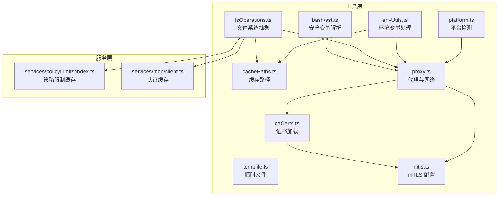
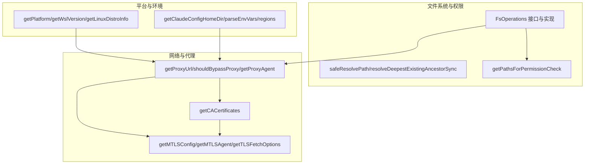
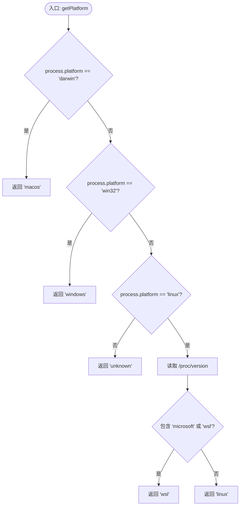
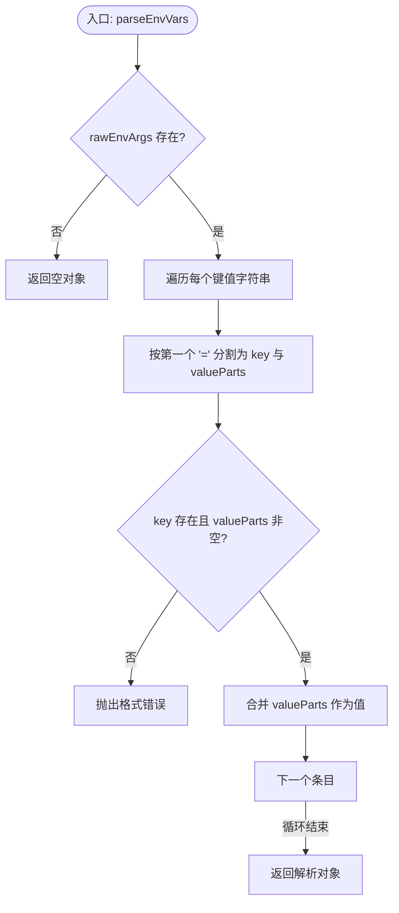
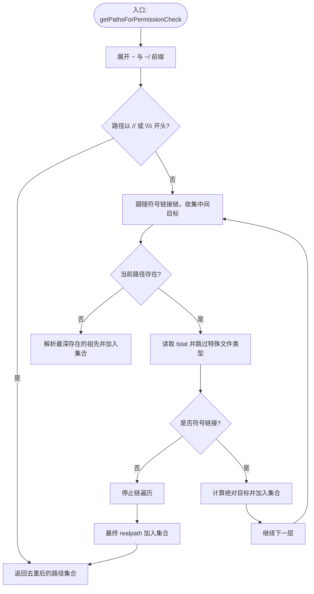
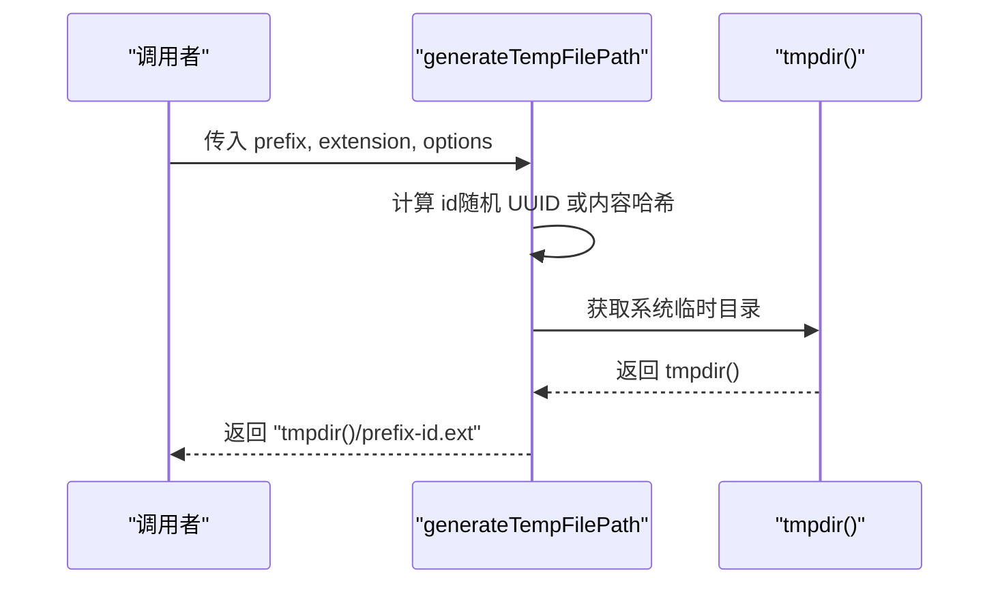
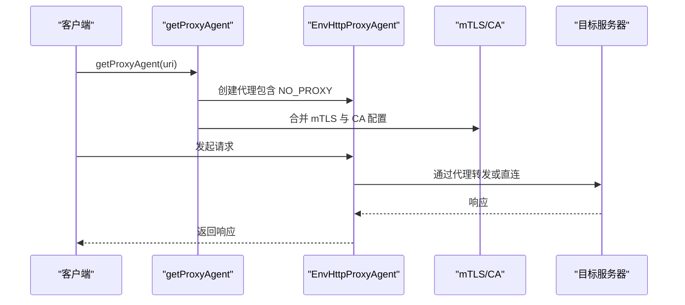
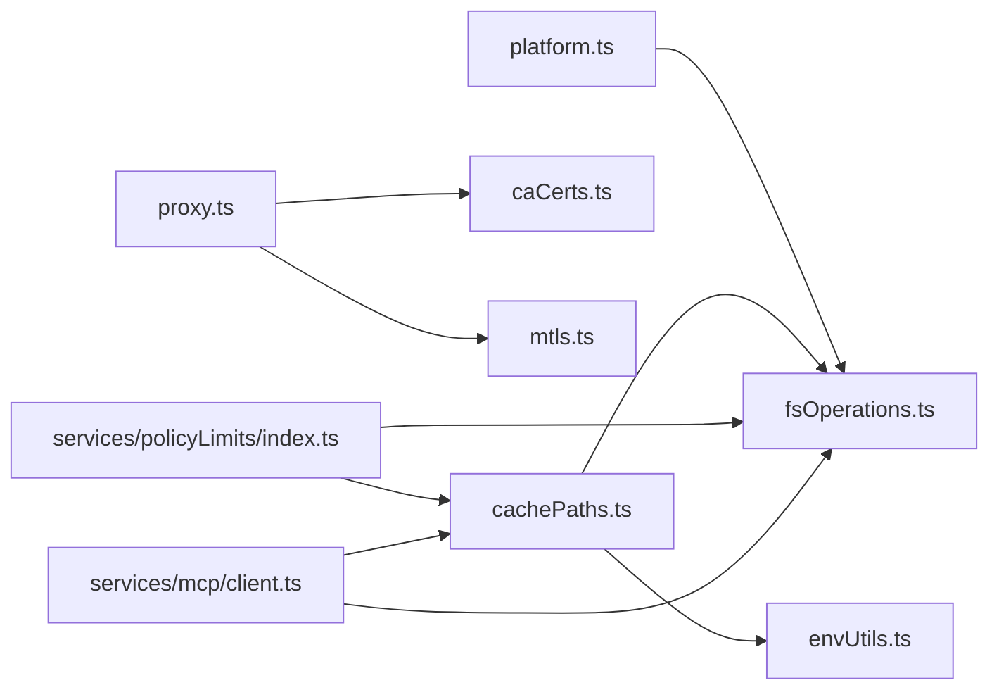

# 系统工具函数

<cite>
**本文档引用的文件**
- [platform.ts](file://src/utils/platform.ts)
- [envUtils.ts](file://src/utils/envUtils.ts)
- [fsOperations.ts](file://src/utils/fsOperations.ts)
- [tempfile.ts](file://src/utils/tempfile.ts)
- [cachePaths.ts](file://src/utils/cachePaths.ts)
- [proxy.ts](file://src/utils/proxy.ts)
- [caCerts.ts](file://src/utils/caCerts.ts)
- [mtls.ts](file://src/utils/mtls.ts)
- [ast.ts](file://src/utils/bash/ast.ts)
- [index.ts](file://src/services/policyLimits/index.ts)
- [client.ts](file://src/services/mcp/client.ts)
</cite>

## 目录
1. [简介](#简介)
2. [项目结构](#项目结构)
3. [核心组件](#核心组件)
4. [架构总览](#架构总览)
5. [详细组件分析](#详细组件分析)
6. [依赖关系分析](#依赖关系分析)
7. [性能考虑](#性能考虑)
8. [故障排除指南](#故障排除指南)
9. [结论](#结论)
10. [附录](#附录)

## 简介
本文件系统工具函数文档聚焦于以下能力：
- 平台检测与兼容性：操作系统识别、WSL 版本检测、Linux 发行版信息获取、版本控制工具检测
- 环境变量处理：配置目录解析、路径解析、布尔值判断、区域设置、Node 选项检查、模型区域覆盖
- 系统目录与缓存路径管理：基于 env-paths 的缓存目录结构、日志与消息缓存路径、项目工作目录归一化
- 临时文件与缓存管理：临时文件路径生成（稳定标识符）、缓存写入与失效策略
- 代理与网络配置：HTTP(S)/WS 代理、NO_PROXY 规则、证书与 mTLS 配置、全局代理拦截器
- 实际使用示例：跨平台开发、系统集成、网络配置场景

## 项目结构
系统工具函数主要位于 src/utils 目录下，并在服务层与工具层被广泛复用：
- 平台与环境：platform.ts、envUtils.ts
- 文件系统抽象：fsOperations.ts
- 临时文件与缓存路径：tempfile.ts、cachePaths.ts
- 代理与证书：proxy.ts、caCerts.ts、mtls.ts
- 脚本安全（bash 变量）：bash/ast.ts
- 缓存持久化示例：services/policyLimits/index.ts、services/mcp/client.ts

**图表来源**
- [platform.ts:1-151](file://src/utils/platform.ts#L1-L151)
- [envUtils.ts:1-184](file://src/utils/envUtils.ts#L1-L184)
- [fsOperations.ts:1-771](file://src/utils/fsOperations.ts#L1-L771)
- [tempfile.ts:1-32](file://src/utils/tempfile.ts#L1-L32)
- [cachePaths.ts:1-39](file://src/utils/cachePaths.ts#L1-L39)
- [proxy.ts:1-427](file://src/utils/proxy.ts#L1-L427)
- [caCerts.ts:1-116](file://src/utils/caCerts.ts#L1-L116)
- [mtls.ts:1-180](file://src/utils/mtls.ts#L1-L180)
- [ast.ts:117-1958](file://src/utils/bash/ast.ts#L117-L1958)
- [index.ts:401-455](file://src/services/policyLimits/index.ts#L401-L455)
- [client.ts:289-316](file://src/services/mcp/client.ts#L289-L316)

**章节来源**
- [platform.ts:1-151](file://src/utils/platform.ts#L1-L151)
- [envUtils.ts:1-184](file://src/utils/envUtils.ts#L1-L184)
- [fsOperations.ts:1-771](file://src/utils/fsOperations.ts#L1-L771)
- [tempfile.ts:1-32](file://src/utils/tempfile.ts#L1-L32)
- [cachePaths.ts:1-39](file://src/utils/cachePaths.ts#L1-L39)
- [proxy.ts:1-427](file://src/utils/proxy.ts#L1-L427)
- [caCerts.ts:1-116](file://src/utils/caCerts.ts#L1-L116)
- [mtls.ts:1-180](file://src/utils/mtls.ts#L1-L180)
- [ast.ts:117-1958](file://src/utils/bash/ast.ts#L117-L1958)
- [index.ts:401-455](file://src/services/policyLimits/index.ts#L401-L455)
- [client.ts:289-316](file://src/services/mcp/client.ts#L289-L316)

## 核心组件
- 平台检测与兼容性
  - 操作系统识别：支持 macos、windows、wsl、linux、unknown
  - WSL 版本检测：从 /proc/version 中提取 WSL 版本或标记
  - Linux 发行版信息：读取 /etc/os-release 获取 ID 与版本
  - 版本控制工具检测：通过目录标记检测 git、mercurial、svn 等
- 环境变量处理
  - 配置根目录解析：CLAUDE_CONFIG_DIR 或用户主目录下的 .claude
  - 布尔值判断：isEnvTruthy/isEnvFalsy 支持多语言真值
  - 区域设置：AWS/Vertex 默认区域回退
  - Node 选项检查：hasNodeOption 检测 NODE_OPTIONS
  - 模型区域覆盖：按模型前缀映射到特定环境变量
- 文件系统抽象与权限
  - 统一接口：cwd、existsSync、stat/readdir、rm/mkdir、readFile、rename、symlink、realpath 等
  - 安全路径解析：safeResolvePath、resolveDeepestExistingAncestorSync
  - 权限路径集合：getPathsForPermissionCheck 收集原路径、中间符号链接目标与最终解析路径
- 临时文件与缓存路径
  - 临时文件：generateTempFilePath 支持内容哈希稳定标识符
  - 缓存路径：基于 env-paths 的 cache/logs/messages/mcp 日志目录
- 代理与网络配置
  - 代理 URL 与 NO_PROXY 解析：getProxyUrl/getNoProxy/shouldBypassProxy
  - 代理代理：createHttpsProxyAgent、getProxyAgent、getWebSocketProxyAgent
  - 证书与 mTLS：getCACertificates、getMTLSConfig/getMTLSAgent、getTLSFetchOptions
  - 全局代理拦截：configureGlobalAgents
- 脚本安全（bash）
  - 已知安全环境变量集合、简单展开解析与注入防护

**章节来源**
- [platform.ts:7-151](file://src/utils/platform.ts#L7-L151)
- [envUtils.ts:5-184](file://src/utils/envUtils.ts#L5-L184)
- [fsOperations.ts:18-771](file://src/utils/fsOperations.ts#L18-L771)
- [tempfile.ts:5-32](file://src/utils/tempfile.ts#L5-L32)
- [cachePaths.ts:6-39](file://src/utils/cachePaths.ts#L6-L39)
- [proxy.ts:57-427](file://src/utils/proxy.ts#L57-L427)
- [caCerts.ts:6-116](file://src/utils/caCerts.ts#L6-L116)
- [mtls.ts:10-180](file://src/utils/mtls.ts#L10-L180)
- [ast.ts:117-1958](file://src/utils/bash/ast.ts#L117-L1958)

## 架构总览
系统工具函数采用“分层模块化”设计：
- 工具层提供平台、环境、文件系统、网络与脚本安全的基础能力
- 服务层通过缓存路径与文件系统抽象实现数据持久化与权限校验
- 代理与证书模块为网络请求提供统一的代理、mTLS 与证书链配置

**图表来源**
- [platform.ts:11-116](file://src/utils/platform.ts#L11-L116)
- [envUtils.ts:7-184](file://src/utils/envUtils.ts#L7-L184)
- [fsOperations.ts:138-382](file://src/utils/fsOperations.ts#L138-L382)
- [proxy.ts:59-237](file://src/utils/proxy.ts#L59-L237)
- [caCerts.ts:28-105](file://src/utils/caCerts.ts#L28-L105)
- [mtls.ts:23-152](file://src/utils/mtls.ts#L23-L152)

## 详细组件分析

### 平台检测与兼容性
- 功能要点
  - 使用 process.platform 与 /proc/version 判断 WSL 版本
  - 读取 /etc/os-release 获取发行版 ID 与版本
  - 检测版本控制工具目录标记
- 性能与健壮性
  - 多处使用 memoize 缓存结果，避免重复系统调用
  - 异常捕获与降级逻辑，未知平台返回 unknown
- 使用场景
  - 跨平台行为分支、WSL 特定优化、Linux 发行版差异化处理

**图表来源**
- [platform.ts:11-49](file://src/utils/platform.ts#L11-L49)

**章节来源**
- [platform.ts:7-151](file://src/utils/platform.ts#L7-L151)

### 环境变量处理工具
- 配置根目录解析：优先 CLAUDE_CONFIG_DIR，否则用户主目录下的 .claude
- 布尔值判断：isEnvTruthy/isEnvFalsy 支持 1/true/yes/on 与 0/false/no/off
- Node 选项检查：hasNodeOption 基于空白分割精确匹配
- 区域设置：AWS_REGION/AWS_DEFAULT_REGION、CLOUD_ML_REGION 回退
- 模型区域覆盖：VERTEXT_REGION_* 环境变量映射表
- 项目工作目录保持：CLAUDE_BASH_MAINTAIN_PROJECT_WORKING_DIR 控制 bash 行为
- 受保护命名空间检测：保守策略，信号不明确时视为受保护

**图表来源**
- [envUtils.ts:72-90](file://src/utils/envUtils.ts#L72-L90)

**章节来源**
- [envUtils.ts:5-184](file://src/utils/envUtils.ts#L5-L184)

### 文件系统抽象与权限
- 统一接口：提供同步/异步操作、字节读取、范围读取、尾部读取、逆序行迭代
- 安全路径解析：safeResolvePath 防止 FIFO/套接字/设备阻塞；resolveDeepestExistingAncestorSync 处理父级符号链接与悬空文件链接
- 权限路径集合：收集原路径、中间符号链接目标与最终解析路径，确保拒绝规则对真实目标生效

**图表来源**
- [fsOperations.ts:288-382](file://src/utils/fsOperations.ts#L288-L382)

**章节来源**
- [fsOperations.ts:18-771](file://src/utils/fsOperations.ts#L18-L771)

### 临时文件与缓存路径管理
- 临时文件路径生成：支持前缀、扩展名与内容哈希稳定标识符，避免每次子进程生成不同路径导致提示缓存失效
- 缓存路径结构：基于 env-paths 的 cache/logs/messages/mcp 日志目录，项目目录名进行路径安全化处理

**图表来源**
- [tempfile.ts:19-31](file://src/utils/tempfile.ts#L19-L31)

**章节来源**
- [tempfile.ts:1-32](file://src/utils/tempfile.ts#L1-L32)
- [cachePaths.ts:6-39](file://src/utils/cachePaths.ts#L6-L39)

### 代理与网络配置工具
- 代理 URL 与 NO_PROXY：优先小写变量子，支持通配符、后缀匹配、端口匹配与 IP 地址
- 代理代理：createHttpsProxyAgent 结合 mTLS 与 CA 证书；getProxyAgent 使用 EnvHttpProxyAgent 自动尊重 NO_PROXY
- mTLS 与证书：从环境变量加载客户端证书/密钥/口令，结合 CA 证书；getTLSFetchOptions 为 undici 提供连接参数
- 全局代理拦截：configureGlobalAgents 注册 axios 请求拦截器与 undici 全局调度器，支持 NO_PROXY 与 mTLS

**图表来源**
- [proxy.ts:198-237](file://src/utils/proxy.ts#L198-L237)
- [mtls.ts:78-95](file://src/utils/mtls.ts#L78-L95)
- [caCerts.ts:28-105](file://src/utils/caCerts.ts#L28-L105)

**章节来源**
- [proxy.ts:57-427](file://src/utils/proxy.ts#L57-L427)
- [caCerts.ts:6-116](file://src/utils/caCerts.ts#L6-L116)
- [mtls.ts:10-180](file://src/utils/mtls.ts#L10-L180)

### 脚本安全（bash 变量）
- 已知安全环境变量集合：如 HOME、PWD、USER、PATH、SHELL 等
- 简单展开解析：在字符串内允许安全变量展开，在裸参数中严格限制
- 注入风险控制：对 IFS 等高危变量在裸参数位置进行阻止

**章节来源**
- [ast.ts:117-1958](file://src/utils/bash/ast.ts#L117-L1958)

### 缓存持久化示例
- 策略限制缓存：读取/保存缓存文件，失败时回退到旧缓存
- MCP 认证缓存：序列化写入，避免并发竞争，读取后失效缓存以保证一致性

**章节来源**
- [index.ts:407-455](file://src/services/policyLimits/index.ts#L407-L455)
- [client.ts:289-316](file://src/services/mcp/client.ts#L289-L316)

## 依赖关系分析
- 模块耦合
  - platform.ts 与 fsOperations.ts 协作完成 WSL 与 Linux 信息检测
  - proxy.ts 依赖 caCerts.ts 与 mtls.ts 提供证书与 mTLS
  - cachePaths.ts 依赖 envUtils.ts 与 fsOperations.ts 获取配置目录与当前工作目录
  - services 层通过 fsOperations.ts 与 cachePaths.ts 进行缓存读写
- 外部依赖
  - lodash-es/memoize.js：用于缓存函数结果
  - env-paths：标准化跨平台缓存/配置目录
  - axios/undici/https-proxy-agent：网络代理与 TLS
  - Node.js 内置模块：fs、os、path、tls、dns、http/https

**图表来源**
- [platform.ts:1-151](file://src/utils/platform.ts#L1-L151)
- [fsOperations.ts:1-771](file://src/utils/fsOperations.ts#L1-L771)
- [proxy.ts:1-427](file://src/utils/proxy.ts#L1-L427)
- [caCerts.ts:1-116](file://src/utils/caCerts.ts#L1-L116)
- [mtls.ts:1-180](file://src/utils/mtls.ts#L1-L180)
- [cachePaths.ts:1-39](file://src/utils/cachePaths.ts#L1-L39)
- [index.ts:401-455](file://src/services/policyLimits/index.ts#L401-L455)
- [client.ts:289-316](file://src/services/mcp/client.ts#L289-L316)

**章节来源**
- [platform.ts:1-151](file://src/utils/platform.ts#L1-L151)
- [proxy.ts:1-427](file://src/utils/proxy.ts#L1-L427)
- [cachePaths.ts:1-39](file://src/utils/cachePaths.ts#L1-L39)
- [index.ts:401-455](file://src/services/policyLimits/index.ts#L401-L455)
- [client.ts:289-316](file://src/services/mcp/client.ts#L289-L316)

## 性能考虑
- 缓存策略
  - 多个探测函数使用 memoize，键为相关环境变量或路径，避免重复 IO 与 CPU 开销
  - 证书与代理代理缓存可显式清空以适配运行时变更
- I/O 优化
  - readFileRange/tailFile/逆序行迭代采用分块读取，避免一次性加载大文件
  - safeResolvePath 避免阻塞型特殊文件（FIFO/套接字/设备），提升健壮性
- 平台差异
  - WSL/Linux 发行版信息按需读取，异常时快速降级
  - Node/Bun 差异化处理（如目录创建 EEXIST 处理）

[本节为通用指导，无需具体文件分析]

## 故障排除指南
- 代理相关
  - NO_PROXY 不生效：确认大小写与格式（逗号/空格分隔），检查端口匹配与域名后缀
  - 代理绕过：shouldBypassProxy 对 URL 解析失败时默认不绕过，检查 URL 合法性
  - mTLS/证书：若 NODE_EXTRA_CA_CERTS 未生效，检查文件路径与权限
- 权限与路径
  - 符号链接逃逸：getPathsForPermissionCheck 已收集中间目标与最终解析路径，确保拒绝规则覆盖真实目标
  - UNC 路径：Windows UNC 路径在解析前被阻断，避免网络请求
- 缓存问题
  - 策略限制缓存：保存失败时会记录调试日志，必要时删除缓存文件重试
  - MCP 认证缓存：写入失败为尽力而为，可通过 clearMcpAuthCache 清理

**章节来源**
- [proxy.ts:88-129](file://src/utils/proxy.ts#L88-L129)
- [fsOperations.ts:138-178](file://src/utils/fsOperations.ts#L138-L178)
- [index.ts:410-426](file://src/services/policyLimits/index.ts#L410-L426)
- [client.ts:311-316](file://src/services/mcp/client.ts#L311-L316)

## 结论
该系统工具函数体系提供了跨平台、可移植且高性能的基础设施：
- 平台检测与兼容性保障了在不同操作系统与容器环境中的正确行为
- 环境变量处理与路径解析实现了灵活的配置与部署方式
- 文件系统抽象与权限检查确保了安全性与稳定性
- 代理与证书模块为复杂网络环境提供了统一的接入点
- 缓存路径与持久化示例展示了生产级缓存策略

[本节为总结，无需具体文件分析]

## 附录
- 实际使用示例（场景化说明）
  - 跨平台开发：根据 getPlatform 选择平台特定行为，如 WSL 下的特殊优化
  - 系统集成：通过 getClaudeConfigHomeDir 与 cachePaths 获取一致的配置与缓存目录
  - 网络配置：在企业代理与受限环境中，通过 NO_PROXY 与 mTLS/CA 配置实现合规访问

[本节为概念性说明，无需具体文件分析]