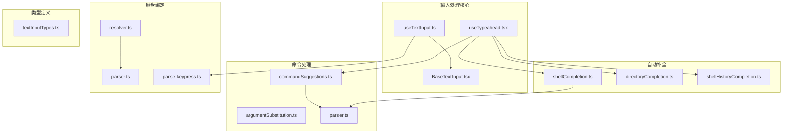
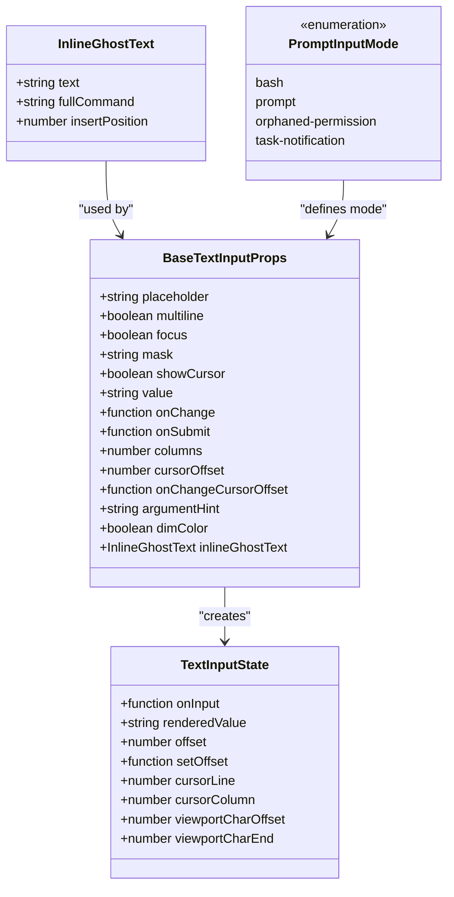
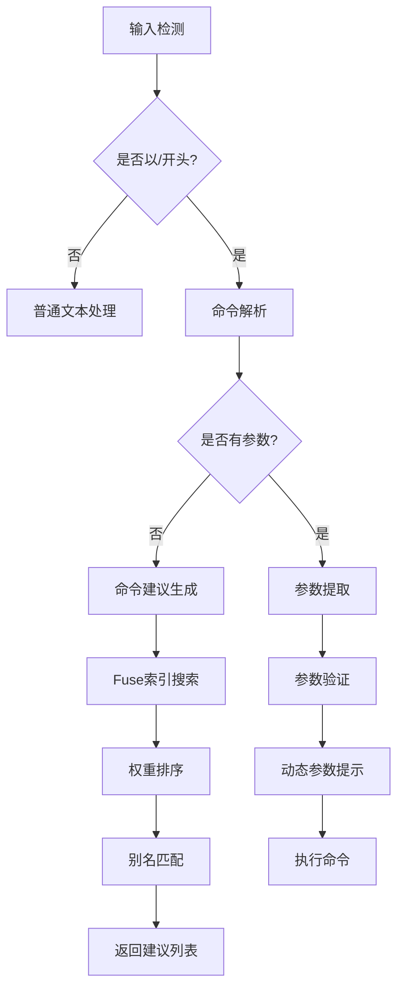
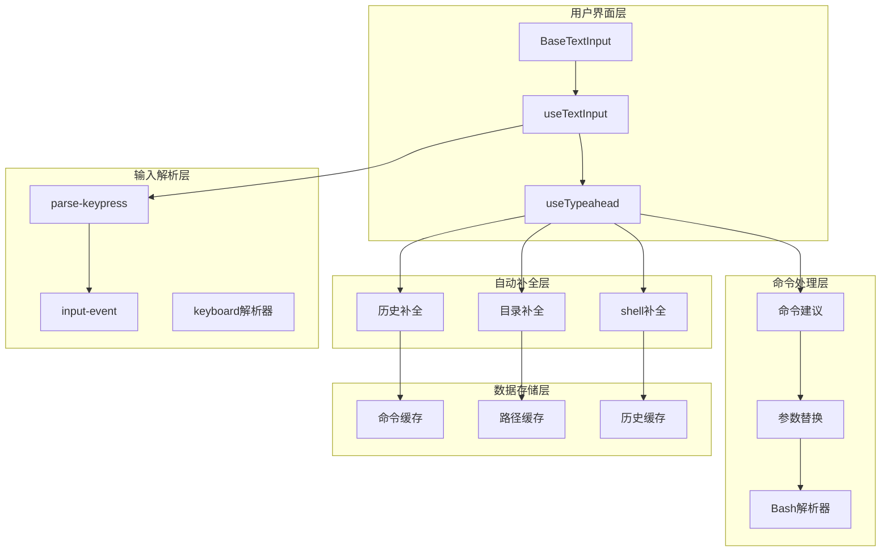
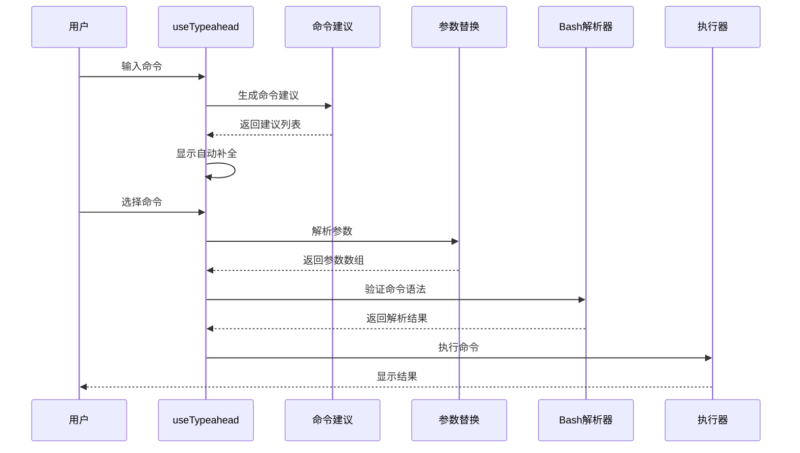
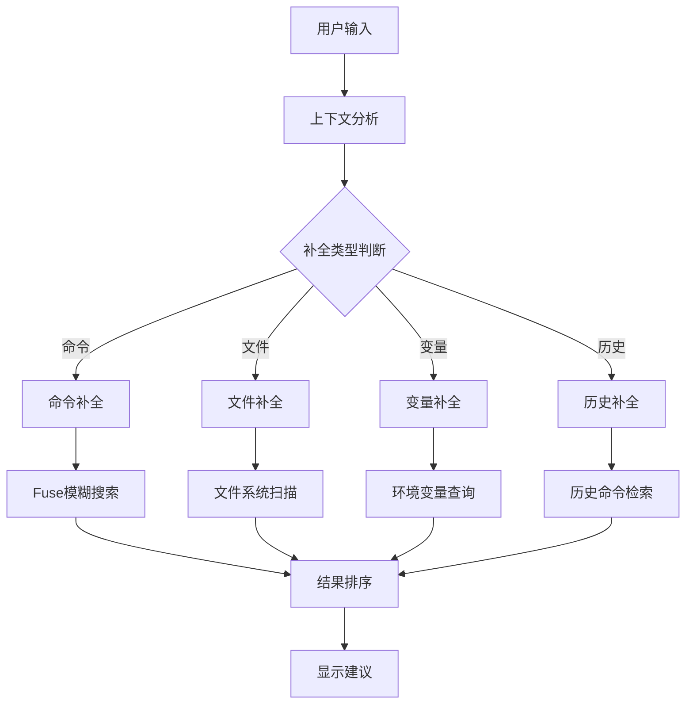
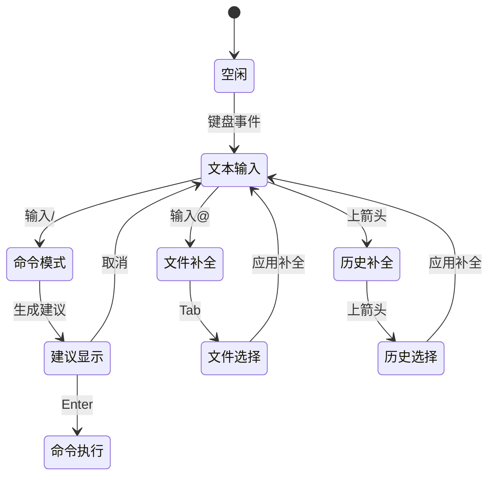
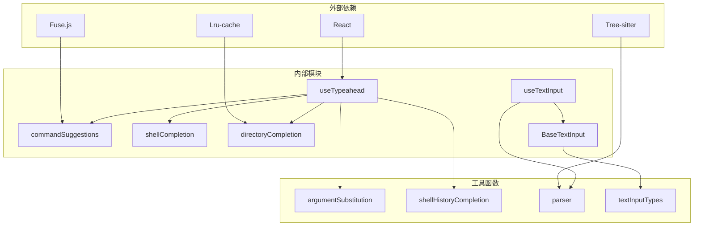

# 输入处理工具

<cite>
**本文档引用的文件**
- [useTypeahead.tsx](file://src/hooks/useTypeahead.tsx)
- [commandSuggestions.ts](file://src/utils/suggestions/commandSuggestions.ts)
- [argumentSubstitution.ts](file://src/utils/argumentSubstitution.ts)
- [shellCompletion.ts](file://src/utils/bash/shellCompletion.ts)
- [directoryCompletion.ts](file://src/utils/suggestions/directoryCompletion.ts)
- [shellHistoryCompletion.ts](file://src/utils/suggestions/shellHistoryCompletion.ts)
- [parser.ts](file://src/utils/bash/parser.ts)
- [useTextInput.ts](file://src/hooks/useTextInput.ts)
- [BaseTextInput.tsx](file://src/components/BaseTextInput.tsx)
- [textInputTypes.ts](file://src/types/textInputTypes.ts)
- [resolver.ts](file://src/keybindings/resolver.ts)
- [parser.ts](file://src/keybindings/parser.ts)
- [parse-keypress.ts](file://src/ink/parse-keypress.ts)
- [input-event.ts](file://src/ink/events/input-event.ts)
- [useDebouncedDigitInput.ts](file://src/components/FeedbackSurvey/useDebouncedDigitInput.ts)
- [ElicitationDialog.tsx](file://src/components/mcp/ElicitationDialog.tsx)
- [elicitationValidation.ts](file://src/utils/mcp/elicitationValidation.ts)
</cite>

## 目录
1. [简介](#简介)
2. [项目结构](#项目结构)
3. [核心组件](#核心组件)
4. [架构概览](#架构概览)
5. [详细组件分析](#详细组件分析)
6. [依赖关系分析](#依赖关系分析)
7. [性能考虑](#性能考虑)
8. [故障排除指南](#故障排除指南)
9. [结论](#结论)
10. [附录](#附录)

## 简介

输入处理工具是 Claude Code 代码库中的核心模块，负责处理各种类型的用户输入，包括文本输入、命令识别、参数提取、自动补全等功能。该系统提供了完整的输入处理生命周期管理，从输入解析到命令执行，再到结果反馈的完整流程。

该工具集支持多种输入模式，包括 Bash 模式和普通提示模式，能够智能识别斜杠命令（/command）和快捷命令，提供实时的自动补全建议，并具备强大的参数验证和错误处理机制。

## 项目结构

输入处理工具主要分布在以下目录中：

**图表来源**
- [useTypeahead.tsx:1-800](file://src/hooks/useTypeahead.tsx#L1-L800)
- [useTextInput.ts:1-530](file://src/hooks/useTextInput.ts#L1-L530)
- [commandSuggestions.ts:1-568](file://src/utils/suggestions/commandSuggestions.ts#L1-L568)

**章节来源**
- [useTypeahead.tsx:1-800](file://src/hooks/useTypeahead.tsx#L1-L800)
- [useTextInput.ts:1-530](file://src/hooks/useTextInput.ts#L1-L530)
- [commandSuggestions.ts:1-568](file://src/utils/suggestions/commandSuggestions.ts#L1-L568)

## 核心组件

### 输入类型系统

输入处理系统基于 TypeScript 类型定义，提供了完整的输入状态管理和类型安全保证：

**图表来源**
- [textInputTypes.ts:15-202](file://src/types/textInputTypes.ts#L15-L202)
- [textInputTypes.ts:227-247](file://src/types/textInputTypes.ts#L227-L247)
- [textInputTypes.ts:265-274](file://src/types/textInputTypes.ts#L265-L274)

### 命令识别引擎

命令识别系统采用多层过滤机制，支持精确匹配、模糊搜索和别名识别：

**图表来源**
- [commandSuggestions.ts:292-498](file://src/utils/suggestions/commandSuggestions.ts#L292-L498)
- [argumentSubstitution.ts:24-40](file://src/utils/argumentSubstitution.ts#L24-L40)

**章节来源**
- [commandSuggestions.ts:1-568](file://src/utils/suggestions/commandSuggestions.ts#L1-L568)
- [argumentSubstitution.ts:1-146](file://src/utils/argumentSubstitution.ts#L1-L146)

## 架构概览

输入处理系统的整体架构采用分层设计，每个层次都有明确的职责分工：

**图表来源**
- [BaseTextInput.tsx:1-136](file://src/components/BaseTextInput.tsx#L1-L136)
- [useTextInput.ts:431-501](file://src/hooks/useTextInput.ts#L431-L501)
- [useTypeahead.tsx:533-800](file://src/hooks/useTypeahead.tsx#L533-L800)

## 详细组件分析

### 命令生命周期管理

命令生命周期管理是输入处理的核心功能，涵盖了从命令识别到执行完成的完整流程：

**图表来源**
- [useTypeahead.tsx:730-788](file://src/hooks/useTypeahead.tsx#L730-L788)
- [commandSuggestions.ts:503-539](file://src/utils/suggestions/commandSuggestions.ts#L503-L539)
- [argumentSubstitution.ts:94-145](file://src/utils/argumentSubstitution.ts#L94-L145)

#### 命令验证机制

命令验证系统确保输入的安全性和正确性：

| 验证类型 | 描述 | 实现方式 |
|---------|------|----------|
| 语法验证 | 检查命令格式是否正确 | Tree-sitter 解析器 |
| 参数验证 | 验证参数类型和范围 | Zod Schema 验证 |
| 权限验证 | 检查命令执行权限 | 权限检查器 |
| 安全验证 | 防止恶意输入 | 过滤器和转义 |

**章节来源**
- [parser.ts:56-84](file://src/utils/bash/parser.ts#L56-L84)
- [parser.ts:104-136](file://src/utils/bash/parser.ts#L104-L136)
- [elicitationValidation.ts:225-288](file://src/utils/mcp/elicitationValidation.ts#L225-L288)

### 自动补全系统

自动补全系统提供了多层次的智能补全功能：

**图表来源**
- [shellCompletion.ts:80-137](file://src/utils/bash/shellCompletion.ts#L80-L137)
- [directoryCompletion.ts:121-140](file://src/utils/suggestions/directoryCompletion.ts#L121-L140)
- [shellHistoryCompletion.ts:91-119](file://src/utils/suggestions/shellHistoryCompletion.ts#L91-L119)

#### 文件路径补全

文件路径补全功能支持复杂的路径解析和缓存机制：

**章节来源**
- [directoryCompletion.ts:1-264](file://src/utils/suggestions/directoryCompletion.ts#L1-L264)
- [shellCompletion.ts:1-260](file://src/utils/bash/shellCompletion.ts#L1-L260)
- [shellHistoryCompletion.ts:1-120](file://src/utils/suggestions/shellHistoryCompletion.ts#L1-L120)

### 键盘输入处理

键盘输入处理系统提供了完整的键盘事件解析和映射功能：

**图表来源**
- [useTextInput.ts:318-349](file://src/hooks/useTextInput.ts#L318-L349)
- [parse-keypress.ts:213-225](file://src/ink/parse-keypress.ts#L213-L225)
- [resolver.ts:47-61](file://src/keybindings/resolver.ts#L47-L61)

**章节来源**
- [useTextInput.ts:1-530](file://src/hooks/useTextInput.ts#L1-L530)
- [parse-keypress.ts:166-454](file://src/ink/parse-keypress.ts#L166-L454)
- [resolver.ts:1-99](file://src/keybindings/resolver.ts#L1-L99)

## 依赖关系分析

输入处理系统的依赖关系呈现清晰的分层结构：

**图表来源**
- [useTypeahead.tsx:1-32](file://src/hooks/useTypeahead.tsx#L1-L32)
- [commandSuggestions.ts:1-10](file://src/utils/suggestions/commandSuggestions.ts#L1-L10)
- [shellCompletion.ts:1-10](file://src/utils/bash/shellCompletion.ts#L1-L10)

**章节来源**
- [useTypeahead.tsx:1-800](file://src/hooks/useTypeahead.tsx#L1-L800)
- [commandSuggestions.ts:1-568](file://src/utils/suggestions/commandSuggestions.ts#L1-L568)

## 性能考虑

输入处理系统在性能方面采用了多项优化策略：

### 缓存策略
- **命令建议缓存**: 使用 LRU 缓存存储命令搜索结果
- **文件系统缓存**: 目录扫描结果缓存 5 分钟
- **历史命令缓存**: 历史命令缓存 60 秒

### 异步处理
- **防抖机制**: 文件建议搜索使用 50ms 防抖
- **超时控制**: Shell 补全操作 1秒超时
- **并发限制**: 同时只允许一个补全请求

### 内存优化
- **增量构建**: 文件索引后台构建，避免阻塞主线程
- **垃圾回收**: 及时清理过期缓存和取消的请求
- **内存泄漏防护**: 使用 AbortController 取消长时间运行的操作

## 故障排除指南

### 常见问题及解决方案

#### 命令补全不工作
1. **检查 Tree-sitter 是否加载成功**
   - 查看控制台日志中的加载信息
   - 确认 feature 标志已启用

2. **验证命令缓存状态**
   - 清理命令缓存：`fuseCache = null`
   - 重新初始化命令索引

#### 文件补全性能问题
1. **检查缓存配置**
   - 调整缓存大小和 TTL 设置
   - 清理过期缓存条目

2. **优化文件系统访问**
   - 限制扫描深度
   - 过滤隐藏文件和系统文件

#### 键盘输入响应慢
1. **检查防抖设置**
   - 调整防抖延迟时间
   - 优化回调函数复杂度

2. **验证事件处理链**
   - 检查事件冒泡是否被阻止
   - 确认正确的事件处理器注册

**章节来源**
- [parser.ts:36-44](file://src/utils/bash/parser.ts#L36-L44)
- [directoryCompletion.ts:36-50](file://src/utils/suggestions/directoryCompletion.ts#L36-L50)
- [useTypeahead.tsx:507-511](file://src/hooks/useTypeahead.tsx#L507-L511)

## 结论

输入处理工具系统是一个高度模块化、可扩展且性能优化的输入处理框架。它通过分层架构设计实现了功能的清晰分离，通过缓存和异步处理机制保证了良好的用户体验，通过严格的类型定义和验证机制确保了系统的稳定性和安全性。

该系统的主要优势包括：
- **多模式支持**: 同时支持 Bash 和普通提示两种输入模式
- **智能补全**: 提供命令、文件、变量、历史等多种类型的智能补全
- **性能优化**: 采用多种缓存策略和异步处理机制
- **类型安全**: 完整的 TypeScript 类型定义和运行时验证
- **扩展性强**: 模块化设计便于功能扩展和维护

## 附录

### 实际使用示例

#### 复杂输入场景处理
系统能够处理复杂的混合输入场景，包括命令与文本的组合输入、嵌套的自动补全等。

#### 批量处理能力
通过队列机制支持批量命令处理，确保命令执行的顺序性和一致性。

#### 实时响应机制
采用事件驱动的设计模式，能够实时响应用户的输入变化并提供即时反馈。

### 配置选项

| 选项名称 | 类型 | 默认值 | 描述 |
|---------|------|--------|------|
| maxResults | number | 10 | 补全结果最大数量 |
| debounceMs | number | 50 | 防抖延迟时间（毫秒） |
| timeoutMs | number | 1000 | 操作超时时间（毫秒） |
| cacheTTL | number | 300000 | 缓存存活时间（毫秒） |