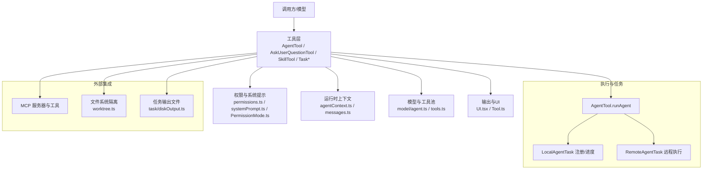
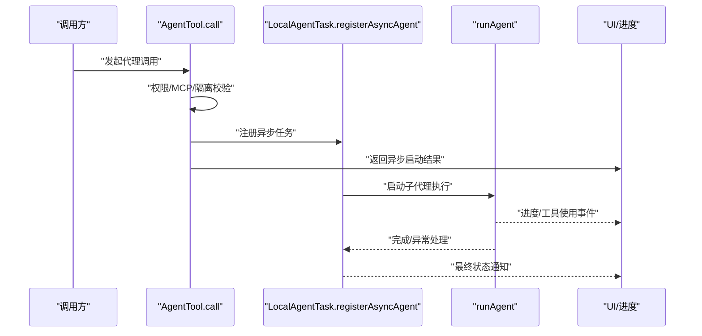
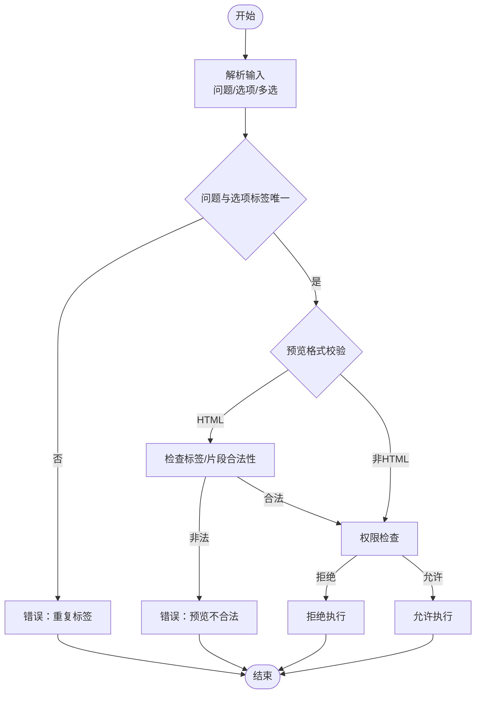
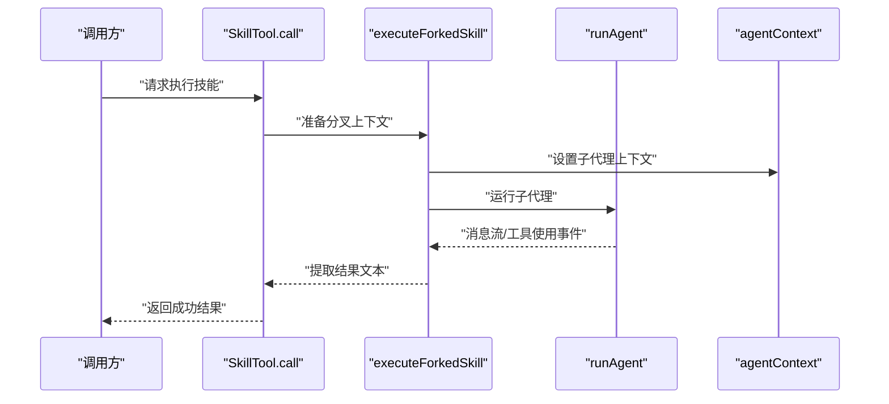
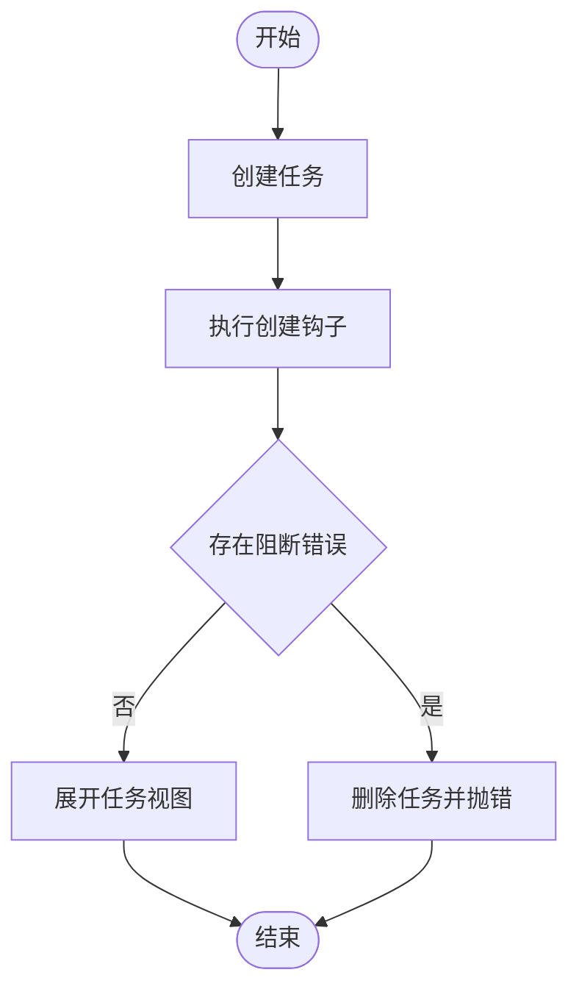
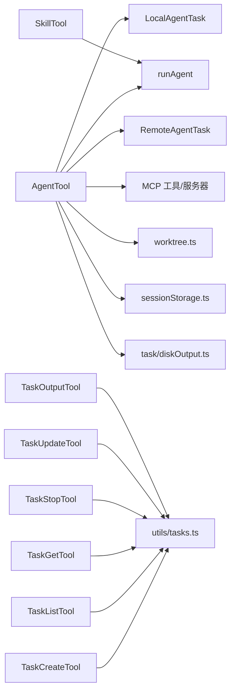

# 代理与任务工具

<cite>
**本文引用的文件**
- [AgentTool.tsx](file://src/tools/AgentTool/AgentTool.tsx)
- [AskUserQuestionTool.tsx](file://src/tools/AskUserQuestionTool/AskUserQuestionTool.tsx)
- [SkillTool.ts](file://src/tools/SkillTool/SkillTool.ts)
- [TaskCreateTool.ts](file://src/tools/TaskCreateTool/TaskCreateTool.ts)
- [TaskListTool.ts](file://src/tools/TaskListTool/TaskListTool.ts)
- [TaskGetTool.ts](file://src/tools/TaskGetTool/TaskGetTool.ts)
- [TaskStopTool.ts](file://src/tools/TaskStopTool/TaskStopTool.ts)
- [TaskUpdateTool.ts](file://src/tools/TaskUpdateTool/TaskUpdateTool.ts)
- [TaskOutputTool.tsx](file://src/tools/TaskOutputTool/TaskOutputTool.tsx)
- [LocalAgentTask.ts](file://src/tasks/LocalAgentTask/LocalAgentTask.ts)
- [RemoteAgentTask.ts](file://src/tasks/RemoteAgentTask/RemoteAgentTask.ts)
- [runAgent.ts](file://src/tools/AgentTool/runAgent.ts)
- [agentToolUtils.ts](file://src/tools/AgentTool/agentToolUtils.ts)
- [forkSubagent.ts](file://src/tools/AgentTool/forkSubagent.ts)
- [builtInAgents.ts](file://src/tools/AgentTool/builtInAgents.ts)
- [constants.ts](file://src/tools/AgentTool/constants.ts)
- [prompt.ts](file://src/tools/AgentTool/prompt.ts)
- [UI.tsx](file://src/tools/AgentTool/UI.tsx)
- [prompt.ts](file://src/tools/AskUserQuestionTool/prompt.ts)
- [UI.tsx](file://src/tools/SkillTool/UI.tsx)
- [constants.ts](file://src/tools/SkillTool/constants.ts)
- [prompt.ts](file://src/tools/SkillTool/prompt.ts)
- [constants.ts](file://src/tools/TaskCreateTool/constants.ts)
- [prompt.ts](file://src/tools/TaskCreateTool/prompt.ts)
- [constants.ts](file://src/tools/TaskListTool/constants.ts)
- [prompt.ts](file://src/tools/TaskListTool/prompt.ts)
- [constants.ts](file://src/tools/TaskGetTool/constants.ts)
- [prompt.ts](file://src/tools/TaskGetTool/prompt.ts)
- [constants.ts](file://src/tools/TaskStopTool/constants.ts)
- [prompt.ts](file://src/tools/TaskStopTool/prompt.ts)
- [UI.tsx](file://src/tools/TaskStopTool/UI.tsx)
- [constants.ts](file://src/tools/TaskUpdateTool/constants.ts)
- [prompt.ts](file://src/tools/TaskUpdateTool/prompt.ts)
- [constants.ts](file://src/tools/TaskOutputTool/constants.ts)
- [tasks.ts](file://src/utils/tasks.ts)
- [hooks.ts](file://src/utils/hooks.ts)
- [teammate.ts](file://src/utils/teammate.ts)
- [agentContext.ts](file://src/utils/agentContext.ts)
- [permissions.ts](file://src/utils/permissions/permissions.ts)
- [PermissionMode.ts](file://src/utils/permissions/PermissionMode.ts)
- [sleep.ts](file://src/utils/sleep.ts)
- [messages.ts](file://src/utils/messages.ts)
- [systemPrompt.ts](file://src/utils/systemPrompt.ts)
- [model/agent.ts](file://src/utils/model/agent.ts)
- [envUtils.ts](file://src/utils/envUtils.ts)
- [worktree.ts](file://src/utils/worktree.ts)
- [sessionStorage.ts](file://src/utils/sessionStorage.ts)
- [task/diskOutput.ts](file://src/utils/task/diskOutput.ts)
- [sdkEventQueue.ts](file://src/utils/sdkEventQueue.ts)
- [agentSummary.ts](file://src/services/AgentSummary/agentSummary.ts)
- [growthbook.ts](file://src/services/analytics/growthbook.ts)
- [index.ts](file://src/services/analytics/index.ts)
- [dumpPrompts.ts](file://src/services/api/dumpPrompts.ts)
- [state.ts](file://src/bootstrap/state.ts)
- [Tool.ts](file://src/Tool.ts)
- [tools.ts](file://src/tools.ts)
- [spawnMultiAgent.ts](file://src/tools/shared/spawnMultiAgent.ts)
</cite>

## 目录
1. [简介](#简介)
2. [项目结构](#项目结构)
3. [核心组件](#核心组件)
4. [架构总览](#架构总览)
5. [详细组件分析](#详细组件分析)
6. [依赖关系分析](#依赖关系分析)
7. [性能考量](#性能考量)
8. [故障排查指南](#故障排查指南)
9. [结论](#结论)
10. [附录](#附录)

## 简介
本文件面向“代理与任务工具”的使用者与维护者，系统化阐述以下能力：
- 智能代理工具（AgentTool）：支持内置与自定义代理、多代理协作、工作树隔离、远程执行、后台运行与进度通知等。
- 用户问答工具（AskUserQuestionTool）：以多选题形式收集用户输入，支持预览内容与注释标注，具备权限与并发安全设计。
- 技能工具（SkillTool）：在独立子代理上下文中执行“提示型”技能，支持内联与分叉两种执行模式，并提供进度上报与遥测。
- 任务系列工具（Task*）：围绕任务生命周期提供创建、查询、列表、更新、停止、输出等工具，配套钩子与状态追踪。

文档同时覆盖代理的创建、配置、执行与监控流程；任务的生命周期、状态跟踪、进度报告与结果输出；以及权限控制、资源限制与并发执行管理策略。

## 项目结构
本节聚焦与“代理与任务工具”相关的目录与文件组织方式，帮助快速定位实现位置与职责边界。

```mermaid
graph TB
subgraph "工具层"
AT["AgentTool.tsx"]
AQQ["AskUserQuestionTool.tsx"]
ST["SkillTool.ts"]
TCT["TaskCreateTool.ts"]
TLT["TaskListTool.ts"]
TGT["TaskGetTool.ts"]
TST["TaskStopTool.ts"]
TUT["TaskUpdateTool.ts"]
TOT["TaskOutputTool.tsx"]
end
subgraph "任务与执行"
LAT["LocalAgentTask.ts"]
RAT["RemoteAgentTask.ts"]
RA["runAgent.ts"]
ATU["agentToolUtils.ts"]
FS["forkSubagent.ts"]
end
subgraph "通用工具与服务"
MSG["messages.ts"]
PERM["permissions.ts"]
PMODE["PermissionMode.ts"]
SYS["systemPrompt.ts"]
MODEL["model/agent.ts"]
ENV["envUtils.ts"]
WT["worktree.ts"]
SS["sessionStorage.ts"]
TASKU["tasks.ts"]
HOOK["hooks.ts"]
TEAM["teammate.ts"]
AC["agentContext.ts"]
SB["spawnMultiAgent.ts"]
end
AT --> LAT
AT --> RAT
AT --> RA
AT --> ATU
AT --> FS
AT --> MSG
AT --> PERM
AT --> PMODE
AT --> SYS
AT --> MODEL
AT --> ENV
AT --> WT
AT --> SS
AT --> TEAM
AT --> AC
AT --> SB
ST --> RA
ST --> MSG
ST --> AC
ST --> HOOK
TCT --> TASKU
TLT --> TASKU
TGT --> TASKU
TST --> TASKU
TUT --> TASKU
TOT --> TASKU
```

图示来源
- [AgentTool.tsx:1-1398](file://src/tools/AgentTool/AgentTool.tsx#L1-L1398)
- [AskUserQuestionTool.tsx:1-266](file://src/tools/AskUserQuestionTool/AskUserQuestionTool.tsx#L1-L266)
- [SkillTool.ts:1-1109](file://src/tools/SkillTool/SkillTool.ts#L1-L1109)
- [TaskCreateTool.ts:1-139](file://src/tools/TaskCreateTool/TaskCreateTool.ts#L1-L139)
- [TaskListTool.ts:1-117](file://src/tools/TaskListTool/TaskListTool.ts#L1-L117)
- [TaskGetTool.ts:1-129](file://src/tools/TaskGetTool/TaskGetTool.ts#L1-L129)
- [TaskStopTool.ts:1-200](file://src/tools/TaskStopTool/TaskStopTool.ts#L1-L200)
- [TaskUpdateTool.ts:1-200](file://src/tools/TaskUpdateTool/TaskUpdateTool.ts#L1-L200)
- [TaskOutputTool.tsx:1-200](file://src/tools/TaskOutputTool/TaskOutputTool.tsx#L1-L200)
- [LocalAgentTask.ts:1-200](file://src/tasks/LocalAgentTask/LocalAgentTask.ts#L1-L200)
- [RemoteAgentTask.ts:1-200](file://src/tasks/RemoteAgentTask/RemoteAgentTask.ts#L1-L200)
- [runAgent.ts:1-200](file://src/tools/AgentTool/runAgent.ts#L1-L200)
- [agentToolUtils.ts:1-200](file://src/tools/AgentTool/agentToolUtils.ts#L1-L200)
- [forkSubagent.ts:1-200](file://src/tools/AgentTool/forkSubagent.ts#L1-L200)
- [messages.ts:1-200](file://src/utils/messages.ts#L1-L200)
- [permissions.ts:1-200](file://src/utils/permissions/permissions.ts#L1-L200)
- [PermissionMode.ts:1-200](file://src/utils/permissions/PermissionMode.ts#L1-L200)
- [systemPrompt.ts:1-200](file://src/utils/systemPrompt.ts#L1-L200)
- [model/agent.ts:1-200](file://src/utils/model/agent.ts#L1-L200)
- [envUtils.ts:1-200](file://src/utils/envUtils.ts#L1-L200)
- [worktree.ts:1-200](file://src/utils/worktree.ts#L1-L200)
- [sessionStorage.ts:1-200](file://src/utils/sessionStorage.ts#L1-L200)
- [tasks.ts:1-200](file://src/utils/tasks.ts#L1-L200)
- [hooks.ts:1-200](file://src/utils/hooks.ts#L1-L200)
- [teammate.ts:1-200](file://src/utils/teammate.ts#L1-L200)
- [agentContext.ts:1-200](file://src/utils/agentContext.ts#L1-L200)
- [spawnMultiAgent.ts:1-200](file://src/tools/shared/spawnMultiAgent.ts#L1-L200)

章节来源
- [AgentTool.tsx:1-1398](file://src/tools/AgentTool/AgentTool.tsx#L1-L1398)
- [SkillTool.ts:1-1109](file://src/tools/SkillTool/SkillTool.ts#L1-L1109)
- [TaskCreateTool.ts:1-139](file://src/tools/TaskCreateTool/TaskCreateTool.ts#L1-L139)
- [TaskListTool.ts:1-117](file://src/tools/TaskListTool/TaskListTool.ts#L1-L117)
- [TaskGetTool.ts:1-129](file://src/tools/TaskGetTool/TaskGetTool.ts#L1-L129)

## 核心组件
本节对四大核心工具进行要点梳理与关联说明，便于快速理解其职责与交互。

- AgentTool（智能代理）
  - 支持内置与自定义代理类型选择、模型覆盖、权限模式、工作树隔离、远程执行、后台运行与进度通知。
  - 提供同步与异步两种执行路径，异步路径通过本地任务注册与进度追踪实现后台运行。
  - 具备多代理协作（团队/子代理）与递归分叉（fork）实验路径，支持父子代理上下文传递与工具池隔离。
  - 权限控制贯穿输入校验、MCP服务器可用性检查、代理定义过滤与UI渲染。

- AskUserQuestionTool（用户问答）
  - 以多选题形式收集用户输入，支持选项标签、描述与可选预览内容，允许附加注释。
  - 具备并发安全与通道适配逻辑，确保在特定渠道场景下不阻塞非TUI环境。
  - 输入校验包含唯一性约束与HTML预览格式校验，保障内容安全与一致性。

- SkillTool（技能执行）
  - 在独立子代理上下文中执行“提示型”技能，支持内联与分叉两种执行模式。
  - 内联模式直接扩展为消息序列并返回新消息；分叉模式在隔离代理中运行并上报进度。
  - 提供遥测与使用统计，支持远程“规范技能”（canonical）的发现与加载。

- Task* 系列（任务管理）
  - TaskCreateTool：创建任务并触发创建钩子，失败时回滚删除。
  - TaskListTool：列出任务并过滤内部任务，计算阻塞关系。
  - TaskGetTool：按ID检索任务详情。
  - TaskStopTool/TaskUpdateTool/TaskOutputTool：分别负责停止、更新与输出读取，配合任务状态机与元数据。

章节来源
- [AgentTool.tsx:196-195](file://src/tools/AgentTool/AgentTool.tsx#L196-L195)
- [AskUserQuestionTool.tsx:109-245](file://src/tools/AskUserQuestionTool/AskUserQuestionTool.tsx#L109-L245)
- [SkillTool.ts:331-800](file://src/tools/SkillTool/SkillTool.ts#L331-L800)
- [TaskCreateTool.ts:48-139](file://src/tools/TaskCreateTool/TaskCreateTool.ts#L48-L139)
- [TaskListTool.ts:33-117](file://src/tools/TaskListTool/TaskListTool.ts#L33-L117)
- [TaskGetTool.ts:38-129](file://src/tools/TaskGetTool/TaskGetTool.ts#L38-L129)

## 架构总览
下图展示“代理与任务工具”的端到端交互架构：工具层负责输入解析与权限校验，执行层负责实际运行与进度上报，服务层提供任务注册、MCP集成与遥测等支撑。

图示来源
- [AgentTool.tsx:239-765](file://src/tools/AgentTool/AgentTool.tsx#L239-L765)
- [runAgent.ts:1-200](file://src/tools/AgentTool/runAgent.ts#L1-L200)
- [LocalAgentTask.ts:1-200](file://src/tasks/LocalAgentTask/LocalAgentTask.ts#L1-L200)
- [RemoteAgentTask.ts:1-200](file://src/tasks/RemoteAgentTask/RemoteAgentTask.ts#L1-L200)
- [messages.ts:1-200](file://src/utils/messages.ts#L1-L200)
- [permissions.ts:1-200](file://src/utils/permissions/permissions.ts#L1-L200)
- [PermissionMode.ts:1-200](file://src/utils/permissions/PermissionMode.ts#L1-L200)
- [model/agent.ts:1-200](file://src/utils/model/agent.ts#L1-L200)
- [worktree.ts:1-200](file://src/utils/worktree.ts#L1-L200)
- [task/diskOutput.ts:1-200](file://src/utils/task/diskOutput.ts#L1-L200)

## 详细组件分析

### AgentTool（智能代理）
- 功能要点
  - 输入/输出模式：支持基础参数（描述、提示、子代理类型、模型覆盖、后台运行），以及多代理参数（名称、团队名、权限模式）与隔离模式（工作树/远程）。
  - 执行路径：根据是否后台运行、是否分叉实验、是否助理强制异步等因素决定同步或异步执行。
  - 资源隔离：工作树隔离自动创建与清理；远程隔离委托至远程会话。
  - 进度与通知：异步执行通过任务注册与进度追踪实现；支持SDK事件队列与摘要生成。
  - 多代理协作：支持团队/子代理创建与路由；禁止在进程内子代理中创建后台代理。
  - 权限与MCP：按权限规则过滤代理；等待MCP服务器连接与认证完成；校验所需MCP服务器工具可用性。
- 关键流程（异步启动）

图示来源
- [AgentTool.tsx:239-765](file://src/tools/AgentTool/AgentTool.tsx#L239-L765)
- [LocalAgentTask.ts:1-200](file://src/tasks/LocalAgentTask/LocalAgentTask.ts#L1-L200)
- [runAgent.ts:1-200](file://src/tools/AgentTool/runAgent.ts#L1-L200)
- [agentToolUtils.ts:1-200](file://src/tools/AgentTool/agentToolUtils.ts#L1-L200)

章节来源
- [AgentTool.tsx:196-195](file://src/tools/AgentTool/AgentTool.tsx#L196-L195)
- [AgentTool.tsx:239-765](file://src/tools/AgentTool/AgentTool.tsx#L239-L765)
- [runAgent.ts:1-200](file://src/tools/AgentTool/runAgent.ts#L1-L200)
- [LocalAgentTask.ts:1-200](file://src/tasks/LocalAgentTask/LocalAgentTask.ts#L1-L200)
- [RemoteAgentTask.ts:1-200](file://src/tasks/RemoteAgentTask/RemoteAgentTask.ts#L1-L200)
- [forkSubagent.ts:1-200](file://src/tools/AgentTool/forkSubagent.ts#L1-L200)
- [permissions.ts:1-200](file://src/utils/permissions/permissions.ts#L1-L200)
- [PermissionMode.ts:1-200](file://src/utils/permissions/PermissionMode.ts#L1-L200)
- [systemPrompt.ts:1-200](file://src/utils/systemPrompt.ts#L1-L200)
- [model/agent.ts:1-200](file://src/utils/model/agent.ts#L1-L200)
- [worktree.ts:1-200](file://src/utils/worktree.ts#L1-L200)
- [task/diskOutput.ts:1-200](file://src/utils/task/diskOutput.ts#L1-L200)

### AskUserQuestionTool（用户问答）
- 功能要点
  - 输入：问题集合（1-4个）、选项（2-4个）、是否多选、可选预览与注释。
  - 输出：问题文本与用户答案映射，以及可选注解。
  - 并发与通道：在特定渠道启用时禁用该工具，避免非TUI环境阻塞。
  - 安全校验：HTML预览片段校验，禁止完整文档标签与脚本样式标签。
- 关键流程（输入校验与权限）

图示来源
- [AskUserQuestionTool.tsx:158-181](file://src/tools/AskUserQuestionTool/AskUserQuestionTool.tsx#L158-L181)
- [AskUserQuestionTool.tsx:182-188](file://src/tools/AskUserQuestionTool/AskUserQuestionTool.tsx#L182-L188)

章节来源
- [AskUserQuestionTool.tsx:109-245](file://src/tools/AskUserQuestionTool/AskUserQuestionTool.tsx#L109-L245)

### SkillTool（技能执行）
- 功能要点
  - 内联模式：将技能扩展为消息序列，返回新消息与上下文修改器。
  - 分叉模式：在独立子代理中执行，捕获工具使用事件并上报进度，完成后清理状态。
  - 权限与规则：支持显式允许/拒绝规则匹配，自动允许仅使用安全属性的技能，否则需要用户授权。
  - 遥测与发现：记录调用事件、插件信息、发现来源等；支持远程“规范技能”的发现与加载。
- 关键流程（分叉执行）

图示来源
- [SkillTool.ts:580-800](file://src/tools/SkillTool/SkillTool.ts#L580-L800)
- [SkillTool.ts:122-289](file://src/tools/SkillTool/SkillTool.ts#L122-L289)
- [runAgent.ts:1-200](file://src/tools/AgentTool/runAgent.ts#L1-L200)
- [agentContext.ts:1-200](file://src/utils/agentContext.ts#L1-L200)

章节来源
- [SkillTool.ts:331-800](file://src/tools/SkillTool/SkillTool.ts#L331-L800)

### Task* 系列（任务管理）
- TaskCreateTool：创建任务并执行创建钩子，若钩子产生阻断错误则回滚删除任务，同时自动展开任务视图。
- TaskListTool：列出任务并过滤内部任务，计算阻塞关系（仅保留未完成的上游任务）。
- TaskGetTool：按ID检索任务详情，支持不存在时返回空值。
- TaskStopTool/TaskUpdateTool/TaskOutputTool：分别负责停止、更新与输出读取，配合任务状态机与元数据。
- 关键流程（创建与钩子）

图示来源
- [TaskCreateTool.ts:80-129](file://src/tools/TaskCreateTool/TaskCreateTool.ts#L80-L129)
- [hooks.ts:1-200](file://src/utils/hooks.ts#L1-L200)
- [tasks.ts:1-200](file://src/utils/tasks.ts#L1-L200)

章节来源
- [TaskCreateTool.ts:48-139](file://src/tools/TaskCreateTool/TaskCreateTool.ts#L48-L139)
- [TaskListTool.ts:33-117](file://src/tools/TaskListTool/TaskListTool.ts#L33-L117)
- [TaskGetTool.ts:38-129](file://src/tools/TaskGetTool/TaskGetTool.ts#L38-L129)
- [TaskStopTool.ts:1-200](file://src/tools/TaskStopTool/TaskStopTool.ts#L1-L200)
- [TaskUpdateTool.ts:1-200](file://src/tools/TaskUpdateTool/TaskUpdateTool.ts#L1-L200)
- [TaskOutputTool.tsx:1-200](file://src/tools/TaskOutputTool/TaskOutputTool.tsx#L1-L200)

## 依赖关系分析
- 组件耦合
  - AgentTool 与 LocalAgentTask/RemoteAgentTask 强耦合，用于异步执行与进度追踪。
  - SkillTool 与 runAgent 强耦合，用于分叉执行与进度上报。
  - Task* 工具与 utils/tasks.ts、utils/hooks.ts 强耦合，用于任务持久化与钩子执行。
- 外部依赖
  - MCP 服务器与工具：AgentTool 在执行前校验所需服务器与工具可用性。
  - 文件系统隔离：工作树隔离由 worktree.ts 提供创建与清理。
  - 会话与存储：sessionStorage.ts 用于代理元数据写入；task/diskOutput.ts 用于后台任务输出路径。
- 循环依赖规避
  - AgentTool 通过延迟导入与工具池组装避免循环依赖；SkillTool 在分叉执行中通过 agentContext 管理上下文。

图示来源
- [AgentTool.tsx:1-1398](file://src/tools/AgentTool/AgentTool.tsx#L1-L1398)
- [SkillTool.ts:1-1109](file://src/tools/SkillTool/SkillTool.ts#L1-L1109)
- [TaskCreateTool.ts:1-139](file://src/tools/TaskCreateTool/TaskCreateTool.ts#L1-L139)
- [TaskListTool.ts:1-117](file://src/tools/TaskListTool/TaskListTool.ts#L1-L117)
- [TaskGetTool.ts:1-129](file://src/tools/TaskGetTool/TaskGetTool.ts#L1-L129)
- [tasks.ts:1-200](file://src/utils/tasks.ts#L1-L200)
- [worktree.ts:1-200](file://src/utils/worktree.ts#L1-L200)
- [sessionStorage.ts:1-200](file://src/utils/sessionStorage.ts#L1-L200)
- [task/diskOutput.ts:1-200](file://src/utils/task/diskOutput.ts#L1-L200)

章节来源
- [AgentTool.tsx:1-1398](file://src/tools/AgentTool/AgentTool.tsx#L1-L1398)
- [SkillTool.ts:1-1109](file://src/tools/SkillTool/SkillTool.ts#L1-L1109)
- [TaskCreateTool.ts:1-139](file://src/tools/TaskCreateTool/TaskCreateTool.ts#L1-L139)
- [TaskListTool.ts:1-117](file://src/tools/TaskListTool/TaskListTool.ts#L1-L117)
- [TaskGetTool.ts:1-129](file://src/tools/TaskGetTool/TaskGetTool.ts#L1-L129)

## 性能考量
- 后台运行与并发
  - AgentTool 在满足条件时强制异步执行，避免主线程阻塞；异步任务通过 LocalAgentTask 注册与进度追踪，减少 UI 卡顿。
  - AskUserQuestionTool 具备并发安全标记，避免在特定渠道场景下造成阻塞。
- 资源隔离与清理
  - 工作树隔离在无变更时自动清理，降低磁盘占用；远程隔离通过远程会话管理生命周期。
- 模型与工具池
  - 子代理工具池基于权限模式独立构建，避免父级工具限制影响子代理执行。
- I/O 与输出
  - 任务输出采用磁盘文件路径，便于外部读取与进度监控；代理工具在后台运行时提供输出文件路径与可读性提示。

## 故障排查指南
- 代理无法启动
  - 检查 MCP 服务器连接与认证状态，确认所需服务器与工具可用。
  - 若为远程隔离，确认远程执行前置条件与会话创建结果。
  - 查看后台任务输出文件路径与可读性提示，确认是否有 Bash/FileRead 工具可用。
- 代理被拒
  - 检查权限规则与代理类型是否被显式拒绝；必要时添加允许规则或调整权限模式。
- 技能执行失败
  - 确认技能类型为“提示型”，且未禁用模型调用；对于分叉执行，检查子代理上下文与工具使用事件。
  - 对于远程“规范技能”，确认已发现并加载。
- 任务相关问题
  - 创建失败：查看阻断错误并回滚；确认任务列表ID与钩子配置。
  - 列表/查询异常：检查任务状态与内部元数据过滤逻辑。

章节来源
- [AgentTool.tsx:370-410](file://src/tools/AgentTool/AgentTool.tsx#L370-L410)
- [RemoteAgentTask.ts:1-200](file://src/tasks/RemoteAgentTask/RemoteAgentTask.ts#L1-L200)
- [SkillTool.ts:354-430](file://src/tools/SkillTool/SkillTool.ts#L354-L430)
- [TaskCreateTool.ts:92-113](file://src/tools/TaskCreateTool/TaskCreateTool.ts#L92-L113)

## 结论
本文档从架构与实现两个层面梳理了代理与任务工具的关键能力与交互关系。AgentTool 提供灵活的代理执行与监控；AskUserQuestionTool 提供安全可控的用户输入收集；SkillTool 实现了可审计、可观测的技能执行；Task* 工具链完善了任务生命周期管理。通过权限控制、资源隔离与并发管理，系统在保证安全性的同时提升了执行效率与可观测性。

## 附录
- 代理配置示例（概述）
  - 基础代理：指定描述、提示、可选模型覆盖与后台运行。
  - 多代理协作：指定团队名与子代理名称，结合权限模式与颜色标识。
  - 隔离与远程：工作树隔离用于文件系统隔离，远程隔离用于跨环境执行。
- 任务创建工作流（概述）
  - 调用 TaskCreateTool 创建任务，执行创建钩子，若出现阻断错误则回滚并抛错，否则自动展开任务视图。
- 技能调用方法（概述）
  - 内联：直接扩展为消息序列并返回新消息。
  - 分叉：在独立子代理中执行，捕获工具使用事件并上报进度，完成后清理状态。