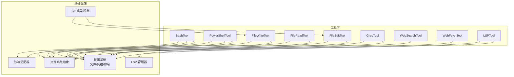
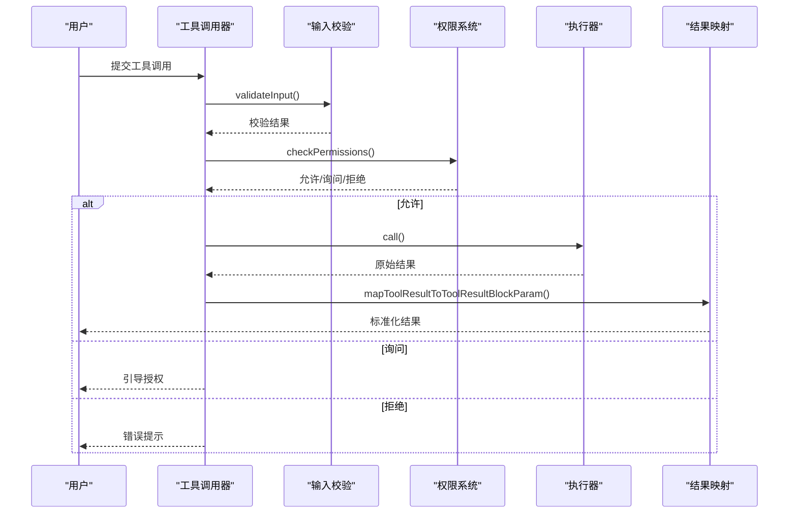
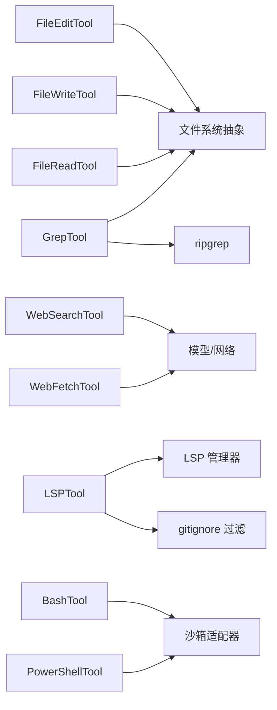

# 内置工具详解

<cite>
**本文档引用的文件**
- [BashTool.tsx](file://src/tools/BashTool/BashTool.tsx)
- [FileEditTool.ts](file://src/tools/FileEditTool/FileEditTool.ts)
- [WebSearchTool.ts](file://src/tools/WebSearchTool/WebSearchTool.ts)
- [WebFetchTool.ts](file://src/tools/WebFetchTool/WebFetchTool.ts)
- [FileReadTool.ts](file://src/tools/FileReadTool/FileReadTool.ts)
- [FileWriteTool.ts](file://src/tools/FileWriteTool/FileWriteTool.ts)
- [GrepTool.ts](file://src/tools/GrepTool/GrepTool.ts)
- [LSPTool.ts](file://src/tools/LSPTool/LSPTool.ts)
- [PowerShellTool.tsx](file://src/tools/PowerShellTool/PowerShellTool.tsx)
- [types.ts](file://src/tools/FileEditTool/types.ts)
</cite>

## 目录
1. [简介](#简介)
2. [项目结构](#项目结构)
3. [核心组件](#核心组件)
4. [架构总览](#架构总览)
5. [详细组件分析](#详细组件分析)
6. [依赖关系分析](#依赖关系分析)
7. [性能考虑](#性能考虑)
8. [故障排除指南](#故障排除指南)
9. [结论](#结论)

## 简介
本文件系统性梳理 Claude Code 的内置工具体系，覆盖命令执行（BashTool、PowerShellTool）、文件编辑（FileEditTool）、文件读取（FileReadTool）、文件写入（FileWriteTool）、网页搜索（WebSearchTool）、网页抓取（WebFetchTool）、文件内容搜索（GrepTool）、语言服务器协议（LSPTool）等。文档从架构设计、数据流、处理逻辑、权限与安全、错误处理与异常、性能特征与优化建议等方面进行深入解析，并提供使用示例与最佳实践。

## 项目结构
内置工具均位于 src/tools 下，按功能模块划分目录，每个工具包含：
- 工具定义与调用逻辑：ToolDef 实现
- 输入/输出模式：Zod Schema 定义
- 权限校验与规则匹配：基于路径/内容的规则系统
- UI 渲染与结果映射：将内部结果转换为模型可消费的消息块
- 辅助能力：文件历史、差异计算、LSP 集成、沙箱策略等

图表来源
- [BashTool.tsx:420-800](file://src/tools/BashTool/BashTool.tsx#L420-L800)
- [PowerShellTool.tsx:272-662](file://src/tools/PowerShellTool/PowerShellTool.tsx#L272-L662)
- [FileEditTool.ts:86-595](file://src/tools/FileEditTool/FileEditTool.ts#L86-L595)
- [FileReadTool.ts:337-718](file://src/tools/FileReadTool/FileReadTool.ts#L337-L718)
- [FileWriteTool.ts:94-434](file://src/tools/FileWriteTool/FileWriteTool.ts#L94-L434)
- [GrepTool.ts:160-577](file://src/tools/GrepTool/GrepTool.ts#L160-L577)
- [WebSearchTool.ts:152-435](file://src/tools/WebSearchTool/WebSearchTool.ts#L152-L435)
- [WebFetchTool.ts:66-307](file://src/tools/WebFetchTool/WebFetchTool.ts#L66-L307)
- [LSPTool.ts:127-422](file://src/tools/LSPTool/LSPTool.ts#L127-L422)

章节来源
- [BashTool.tsx:1-1144](file://src/tools/BashTool/BashTool.tsx#L1-L1144)
- [PowerShellTool.tsx:1-1001](file://src/tools/PowerShellTool/PowerShellTool.tsx#L1-L1001)
- [FileEditTool.ts:1-626](file://src/tools/FileEditTool/FileEditTool.ts#L1-L626)
- [FileReadTool.ts:1-1184](file://src/tools/FileReadTool/FileReadTool.ts#L1-L1184)
- [FileWriteTool.ts:1-435](file://src/tools/FileWriteTool/FileWriteTool.ts#L1-L435)
- [GrepTool.ts:1-578](file://src/tools/GrepTool/GrepTool.ts#L1-L578)
- [WebSearchTool.ts:1-436](file://src/tools/WebSearchTool/WebSearchTool.ts#L1-L436)
- [WebFetchTool.ts:1-319](file://src/tools/WebFetchTool/WebFetchTool.ts#L1-L319)
- [LSPTool.ts:1-861](file://src/tools/LSPTool/LSPTool.ts#L1-L861)

## 核心组件
- 工具基类与构建器：统一的 ToolDef 接口，支持描述、权限检查、输入/输出模式、并发安全、只读标记、进度回调、结果映射等。
- 权限系统：基于路径/内容的规则匹配，支持 deny/ask/allow 三态决策；命令工具还支持子命令级安全钩子与 AST 解析。
- 文件系统抽象：统一的 fs 操作封装，支持原子读改写、编码检测、行尾规范化、文件历史备份、差异计算。
- LSP 集成：统一的 LSP 管理器，支持打开/保存/变更通知、符号查询、调用层次、引用定位等。
- 沙箱与安全：针对不同平台的沙箱策略，Windows 原生不支持沙箱时的策略回退与策略拒绝提示。
- 结果持久化：大输出自动落盘并生成预览，避免内存溢出与上下文污染。

章节来源
- [BashTool.tsx:420-800](file://src/tools/BashTool/BashTool.tsx#L420-L800)
- [PowerShellTool.tsx:272-662](file://src/tools/PowerShellTool/PowerShellTool.tsx#L272-L662)
- [FileEditTool.ts:86-595](file://src/tools/FileEditTool/FileEditTool.ts#L86-L595)
- [FileReadTool.ts:337-718](file://src/tools/FileReadTool/FileReadTool.ts#L337-L718)
- [FileWriteTool.ts:94-434](file://src/tools/FileWriteTool/FileWriteTool.ts#L94-L434)
- [GrepTool.ts:160-577](file://src/tools/GrepTool/GrepTool.ts#L160-L577)
- [WebSearchTool.ts:152-435](file://src/tools/WebSearchTool/WebSearchTool.ts#L152-L435)
- [WebFetchTool.ts:66-307](file://src/tools/WebFetchTool/WebFetchTool.ts#L66-L307)
- [LSPTool.ts:127-422](file://src/tools/LSPTool/LSPTool.ts#L127-L422)

## 架构总览
内置工具遵循“统一入口 + 分层处理 + 权限前置 + 结果标准化”的架构原则：
- 统一入口：所有工具通过 buildTool 构建 ToolDef，暴露标准接口（validateInput/checkPermissions/call/render 等）。
- 分层处理：输入校验（schema + 业务规则）→ 权限决策（规则匹配 + 交互提示）→ 执行（文件/网络/命令/LSP）→ 结果映射（消息块/预览/差异）。
- 权限前置：在 I/O 或网络调用前完成权限判断，避免越权操作。
- 结果标准化：统一的 ToolResultBlockParam 输出，支持文本、图片、结构化内容、大文件预览等。

图表来源
- [BashTool.tsx:524-623](file://src/tools/BashTool/BashTool.tsx#L524-L623)
- [PowerShellTool.tsx:352-436](file://src/tools/PowerShellTool/PowerShellTool.tsx#L352-L436)
- [FileEditTool.ts:137-361](file://src/tools/FileEditTool/FileEditTool.ts#L137-L361)
- [FileReadTool.ts:418-651](file://src/tools/FileReadTool/FileReadTool.ts#L418-L651)
- [FileWriteTool.ts:153-222](file://src/tools/FileWriteTool/FileWriteTool.ts#L153-L222)
- [GrepTool.ts:201-232](file://src/tools/GrepTool/GrepTool.ts#L201-L232)
- [WebSearchTool.ts:235-253](file://src/tools/WebSearchTool/WebSearchTool.ts#L235-L253)
- [WebFetchTool.ts:191-204](file://src/tools/WebFetchTool/WebFetchTool.ts#L191-L204)
- [LSPTool.ts:155-209](file://src/tools/LSPTool/LSPTool.ts#L155-L209)

## 详细组件分析

### BashTool（命令执行）
- 功能概述：在本地 Shell 中执行任意命令，支持超时、后台运行、进度回调、大输出落盘、图像输出压缩、沙箱策略、只读约束与权限校验。
- 输入参数
  - command: 要执行的命令字符串
  - timeout: 可选超时（毫秒），受最大超时限制
  - description: 可选描述，用于 UI 展示
  - run_in_background: 是否后台运行（受环境变量禁用影响）
  - dangerouslyDisableSandbox: 是否禁用沙箱（仅在允许时生效）
- 输出格式
  - stdout/stderr：标准输出与错误
  - interrupted：是否被中断
  - isImage：stdout 是否为图像数据
  - backgroundTaskId/backgroundedByUser/assistantAutoBackgrounded：后台任务状态
  - returnCodeInterpretation：非错误退出码的语义解释
  - structuredContent：结构化内容块
  - persistedOutputPath/persistedOutputSize：大输出落盘路径与大小
- 权限与安全
  - 子命令级安全钩子：对复合命令进行拆分匹配，确保任何子命令命中规则都会触发安全钩子
  - 只读约束：基于命令语义与语法检测，阻止潜在写操作
  - 沙箱策略：跨平台统一，Windows 原生不支持时有明确拒绝提示
  - 大输出保护：超过阈值自动落盘并生成预览，避免内存与上下文溢出
- 使用示例
  - 后台运行长任务：run_in_background: true
  - 设置超时：timeout: 60000
  - 禁用沙箱（谨慎）：dangerouslyDisableSandbox: true
- 最佳实践
  - 优先使用 run_in_background 处理长时间阻塞命令，避免阻塞主会话
  - 对可能产生图像输出的命令，注意 isImage 标记以正确渲染
  - 大输出场景下，结合 persistedOutputPath 进行后续读取
  - 严格控制危险命令，必要时启用只读模式或权限审批

章节来源
- [BashTool.tsx:227-296](file://src/tools/BashTool/BashTool.tsx#L227-L296)
- [BashTool.tsx:420-800](file://src/tools/BashTool/BashTool.tsx#L420-L800)
- [BashTool.tsx:800-1144](file://src/tools/BashTool/BashTool.tsx#L800-L1144)

### PowerShellTool（PowerShell 命令执行）
- 功能概述：在 Windows 平台执行 PowerShell 命令，具备与 BashTool 类似的特性（超时、后台、进度、大输出、图像、沙箱、只读约束、权限校验）。
- 输入参数
  - command: PowerShell 命令
  - timeout/description/run_in_background/dangerouslyDisableSandbox：同 BashTool
- 输出格式
  - stdout/stderr/interrupted/isImage/persistedOutputPath/persistedOutputSize/backgroundTaskId 等字段与 BashTool 一致
- 权限与安全
  - Windows 原生不支持沙箱时，若企业策略强制沙箱，则直接拒绝执行
  - 采用同步与异步双通道的只读检测，复杂脚本需依赖 AST 解析
- 使用示例
  - 阻塞命令后台化：run_in_background: true
  - 超时控制：timeout: 30000
- 最佳实践
  - 在 Windows 原生环境中，若策略要求沙箱且不可绕过，应改用支持沙箱的平台或使用 MCP 工具
  - 对包含 sleep/Start-Sleep 的长时间等待命令，建议后台化或使用 Monitor 工具

章节来源
- [PowerShellTool.tsx:228-258](file://src/tools/PowerShellTool/PowerShellTool.tsx#L228-L258)
- [PowerShellTool.tsx:272-662](file://src/tools/PowerShellTool/PowerShellTool.tsx#L272-L662)
- [PowerShellTool.tsx:663-1001](file://src/tools/PowerShellTool/PowerShellTool.tsx#L663-L1001)

### FileEditTool（文件编辑）
- 功能概述：在不破坏文件内容一致性前提下进行精确替换，支持多处替换、引用样式保留、增量差异、LSP 通知、文件历史备份。
- 输入参数
  - file_path: 绝对路径
  - old_string/new_string: 要替换的旧文本与新文本
  - replace_all: 是否替换全部出现位置（默认 false）
- 输出格式
  - filePath/oldString/newString/originalFile/structuredPatch/userModified/replaceAll/gitDiff
- 权限与安全
  - 路径展开与 UNC 路径安全处理
  - 文件大小上限（1GiB）防止 OOM
  - 读取后的时间戳一致性校验，避免并发修改导致的数据不一致
  - 团队机密检测，禁止写入包含敏感信息的内容
- 使用示例
  - 替换单个实例：replace_all: false
  - 替换全部：replace_all: true
- 最佳实践
  - 编辑前先 Read 文件，确保时间戳一致
  - 对笔记本文件（.ipynb）使用专用工具
  - 大文件谨慎编辑，优先使用局部范围与上下文

章节来源
- [FileEditTool.ts:59-86](file://src/tools/FileEditTool/FileEditTool.ts#L59-L86)
- [FileEditTool.ts:137-361](file://src/tools/FileEditTool/FileEditTool.ts#L137-L361)
- [FileEditTool.ts:387-574](file://src/tools/FileEditTool/FileEditTool.ts#L387-L574)
- [types.ts:5-86](file://src/tools/FileEditTool/types.ts#L5-L86)

### FileReadTool（文件读取）
- 功能概述：读取文本、图片、PDF、Jupyter 笔记本等，支持偏移/限制读取、页范围（PDF）、去重缓存、令牌计数限制、Cyber 风险提醒。
- 输入参数
  - file_path: 绝对路径
  - offset/limit: 行号范围（大文件分段读取）
  - pages: PDF 页范围（如 "1-5"、"3"、"10-20"）
- 输出格式
  - type: text/image/notebook/pdf/parts/file_unchanged
  - file: 包含路径、内容、尺寸、页数等元信息
- 权限与安全
  - 设备文件黑名单（/dev/zero、/dev/random 等）防止挂起或无限输出
  - UNC 路径安全处理（权限阶段跳过 I/O）
  - 二进制扩展名过滤（除 PDF、图片、SVG 外的二进制文件禁止读取）
- 使用示例
  - 读取部分行：offset: 1, limit: 100
  - 读取 PDF 指定页：pages: "1-10"
- 最佳实践
  - 大文件优先使用 offset/limit 分段读取
  - PDF 与图片可直接渲染，无需额外处理
  - 使用去重机制避免重复读取同一范围

章节来源
- [FileReadTool.ts:227-246](file://src/tools/FileReadTool/FileReadTool.ts#L227-L246)
- [FileReadTool.ts:418-651](file://src/tools/FileReadTool/FileReadTool.ts#L418-L651)
- [FileReadTool.ts:652-718](file://src/tools/FileReadTool/FileReadTool.ts#L652-L718)

### FileWriteTool（文件写入）
- 功能概述：全量覆盖写入文件，支持增量差异、LSP 通知、VSCode 同步、文件历史备份、团队机密检测。
- 输入参数
  - file_path: 绝对路径
  - content: 新内容
- 输出格式
  - type: create/update
  - filePath/content/structuredPatch/originalFile/gitDiff
- 权限与安全
  - 与 FileEditTool 类似的安全与权限检查流程
  - 写入前确保已 Read 且未被外部修改
- 使用示例
  - 创建新文件：content 为完整内容
  - 更新现有文件：content 为替换后内容
- 最佳实践
  - 写入前先 Read，避免并发冲突
  - 大文件写入建议先生成临时文件再原子替换

章节来源
- [FileWriteTool.ts:56-91](file://src/tools/FileWriteTool/FileWriteTool.ts#L56-L91)
- [FileWriteTool.ts:153-222](file://src/tools/FileWriteTool/FileWriteTool.ts#L153-L222)
- [FileWriteTool.ts:223-417](file://src/tools/FileWriteTool/FileWriteTool.ts#L223-L417)

### GrepTool（文件搜索）
- 功能概述：基于 ripgrep 的正则搜索，支持内容/文件列表/计数三种输出模式、上下文行、大小写忽略、类型过滤、头限制与偏移分页。
- 输入参数
  - pattern: 正则表达式
  - path: 搜索路径（默认当前工作目录）
  - glob: 文件过滤通配符
  - output_mode: content/files_with_matches/count
  - -B/-A/-C/context: 上下文行数
  - -n: 显示行号
  - -i: 忽略大小写
  - type: 文件类型过滤
  - head_limit/offset: 结果限制与偏移
  - multiline: 多行模式
- 输出格式
  - mode/numFiles/filenames/content/numLines/numMatches/appliedLimit/appliedOffset
- 权限与安全
  - 路径存在性校验（UNC 路径跳过 I/O）
  - 默认排除版本控制目录（.git/.svn 等）
  - 忽略模式来自权限配置，支持相对/绝对路径
- 使用示例
  - 查找所有匹配文件：output_mode: "files_with_matches"
  - 显示匹配内容及上下文：output_mode: "content", -C: 2
  - 计数统计：output_mode: "count"
- 最佳实践
  - 使用 head_limit 控制结果规模，避免上下文膨胀
  - 通过 glob 与 type 精确缩小搜索范围
  - 使用 offset 进行分页浏览

章节来源
- [GrepTool.ts:33-91](file://src/tools/GrepTool/GrepTool.ts#L33-L91)
- [GrepTool.ts:201-232](file://src/tools/GrepTool/GrepTool.ts#L201-L232)
- [GrepTool.ts:310-577](file://src/tools/GrepTool/GrepTool.ts#L310-L577)

### WebSearchTool（网页搜索）
- 功能概述：通过模型驱动的网页搜索工具，支持域名白名单/黑名单、最大使用次数限制、进度回调、结果聚合与文本注释混合输出。
- 输入参数
  - query: 搜索关键词
  - allowed_domains: 仅允许的域名列表
  - blocked_domains: 禁止的域名列表
- 输出格式
  - query/results/durationSeconds
  - results: 搜索结果数组或文本注释
- 权限与安全
  - 仅在特定提供商与模型上启用
  - 需要显式授权（ask 规则）
- 使用示例
  - 限定域名：allowed_domains: ["example.com"]
  - 禁止特定域名：blocked_domains: ["ads.example.com"]
- 最佳实践
  - 合理设置 allowed_domains/blocked_domains，避免无关结果
  - 关注 durationSeconds 评估搜索耗时

章节来源
- [WebSearchTool.ts:25-74](file://src/tools/WebSearchTool/WebSearchTool.ts#L25-L74)
- [WebSearchTool.ts:152-253](file://src/tools/WebSearchTool/WebSearchTool.ts#L152-L253)
- [WebSearchTool.ts:254-435](file://src/tools/WebSearchTool/WebSearchTool.ts#L254-L435)

### WebFetchTool（网页抓取）
- 功能概述：抓取指定 URL 内容并应用提示词提取摘要，支持预批准主机、重定向检测、二进制内容落盘、大小限制。
- 输入参数
  - url: 目标 URL
  - prompt: 应用于内容的提示词
- 输出格式
  - bytes/code/codeText/result/durationMs/url
- 权限与安全
  - 主机级规则匹配（domain:hostname）
  - 预批准主机豁免权限检查
  - 重定向到不同主机时给出明确提示并要求重新调用
- 使用示例
  - 抓取文档并摘要：prompt: "提取关键要点"
- 最佳实践
  - 对需要认证的页面，优先使用具备认证能力的 MCP 工具
  - 注意重定向场景，按提示更新参数

章节来源
- [WebFetchTool.ts:24-48](file://src/tools/WebFetchTool/WebFetchTool.ts#L24-L48)
- [WebFetchTool.ts:104-180](file://src/tools/WebFetchTool/WebFetchTool.ts#L104-L180)
- [WebFetchTool.ts:208-307](file://src/tools/WebFetchTool/WebFetchTool.ts#L208-L307)

### LSPTool（语言服务器协议）
- 功能概述：提供定义跳转、引用查找、悬停信息、文档符号、工作区符号、实现跳转、调用层次等 LSP 能力，支持过滤 gitignore 文件、格式化输出。
- 输入参数
  - operation: goToDefinition/findReferences/hover/documentSymbol/workspaceSymbol/goToImplementation/prepareCallHierarchy/incomingCalls/outgoingCalls
  - filePath/line/character: 文件路径与位置（1 基）
- 输出格式
  - operation/result/filePath/resultCount/fileCount
- 权限与安全
  - 文件存在性与类型校验
  - 文件过大（>10MB）直接拒绝
  - 未初始化的 LSP 服务返回友好提示
- 使用示例
  - 定位定义：operation: "goToDefinition"
  - 查找引用：operation: "findReferences"
- 最佳实践
  - 对大型文件避免 LSP 查询
  - 利用过滤 gitignore 的结果提升准确性

章节来源
- [LSPTool.ts:59-87](file://src/tools/LSPTool/LSPTool.ts#L59-L87)
- [LSPTool.ts:155-209](file://src/tools/LSPTool/LSPTool.ts#L155-L209)
- [LSPTool.ts:224-422](file://src/tools/LSPTool/LSPTool.ts#L224-L422)

## 依赖关系分析
- 工具间耦合
  - FileEditTool/FileWriteTool 依赖文件系统抽象与 LSP 管理器，共享差异计算与文件历史备份
  - GrepTool 依赖 ripgrep 与权限忽略模式，与文件系统交互
  - WebSearchTool/WebFetchTool 依赖模型与网络访问，受权限与提供商限制
  - LSPTool 依赖 LSP 管理器与 gitignore 过滤
- 外部依赖
  - 沙箱适配器：跨平台沙箱策略
  - 文件系统抽象：统一的读写与统计接口
  - 权限系统：规则匹配与交互提示
  - Git 差异：单文件差异计算与追踪

图表来源
- [FileEditTool.ts:86-595](file://src/tools/FileEditTool/FileEditTool.ts#L86-L595)
- [FileWriteTool.ts:94-434](file://src/tools/FileWriteTool/FileWriteTool.ts#L94-L434)
- [FileReadTool.ts:337-718](file://src/tools/FileReadTool/FileReadTool.ts#L337-L718)
- [GrepTool.ts:160-577](file://src/tools/GrepTool/GrepTool.ts#L160-L577)
- [WebSearchTool.ts:152-435](file://src/tools/WebSearchTool/WebSearchTool.ts#L152-L435)
- [WebFetchTool.ts:66-307](file://src/tools/WebFetchTool/WebFetchTool.ts#L66-L307)
- [LSPTool.ts:127-422](file://src/tools/LSPTool/LSPTool.ts#L127-L422)
- [BashTool.tsx:420-800](file://src/tools/BashTool/BashTool.tsx#L420-L800)
- [PowerShellTool.tsx:272-662](file://src/tools/PowerShellTool/PowerShellTool.tsx#L272-L662)

## 性能考虑
- 大文件与大输出
  - FileEditTool/FileWriteTool：1GiB 上限，避免 OOM
  - BashTool/PowerShellTool：超过阈值自动落盘并生成预览
  - GrepTool：默认 head_limit=250，避免上下文膨胀
- 并发与一致性
  - 文件读写前后的时间戳一致性校验，避免并发修改
  - LSPTool 对大型文件设置 10MB 限制
- 网络与模型
  - WebSearchTool 限制最大使用次数，避免滥用
  - WebFetchTool 对预批准主机与 Markdown 内容有特殊处理，减少不必要的模型调用

## 故障排除指南
- 权限相关
  - BashTool/PowerShellTool：子命令级安全钩子未通过时，需调整命令或获得授权
  - FileEditTool/FileReadTool/FileWriteTool：deny 规则导致拒绝，需在设置中添加允许规则
  - WebSearchTool/WebFetchTool：ask 规则需要用户确认
- 文件相关
  - FileEditTool：文件意外修改（时间戳变化）会触发错误，需重新 Read
  - FileReadTool：设备文件黑名单导致无法读取，需更换目标
  - GrepTool：路径不存在时给出建议路径
- 网络相关
  - WebFetchTool：重定向到不同主机时，按提示更新 URL 参数
  - WebSearchTool：提供商/模型不支持时无法启用
- LSP 相关
  - LSPTool：文件过大或无可用 LSP 服务器时返回友好提示

章节来源
- [BashTool.tsx:524-538](file://src/tools/BashTool/BashTool.tsx#L524-L538)
- [PowerShellTool.tsx:352-374](file://src/tools/PowerShellTool/PowerShellTool.tsx#L352-L374)
- [FileEditTool.ts:289-311](file://src/tools/FileEditTool/FileEditTool.ts#L289-L311)
- [FileReadTool.ts:484-494](file://src/tools/FileReadTool/FileReadTool.ts#L484-L494)
- [GrepTool.ts:212-229](file://src/tools/GrepTool/GrepTool.ts#L212-L229)
- [WebFetchTool.ts:216-249](file://src/tools/WebFetchTool/WebFetchTool.ts#L216-L249)
- [WebSearchTool.ts:168-193](file://src/tools/WebSearchTool/WebSearchTool.ts#L168-L193)
- [LSPTool.ts:265-272](file://src/tools/LSPTool/LSPTool.ts#L265-L272)

## 结论
Claude Code 的内置工具体系以统一的 ToolDef 为核心，围绕权限前置、安全校验、结果标准化与平台适配构建。各工具在满足功能需求的同时，兼顾了安全性、性能与用户体验。建议在实际使用中遵循最佳实践，合理设置超时与输出限制，优先使用后台运行与分页策略，严格控制危险命令与敏感文件操作，并根据场景选择合适的工具组合。