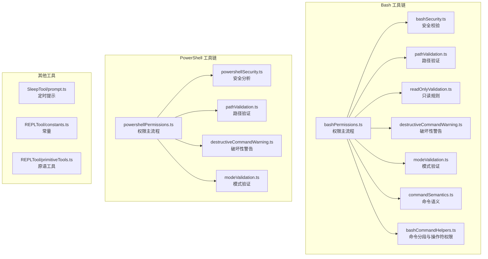
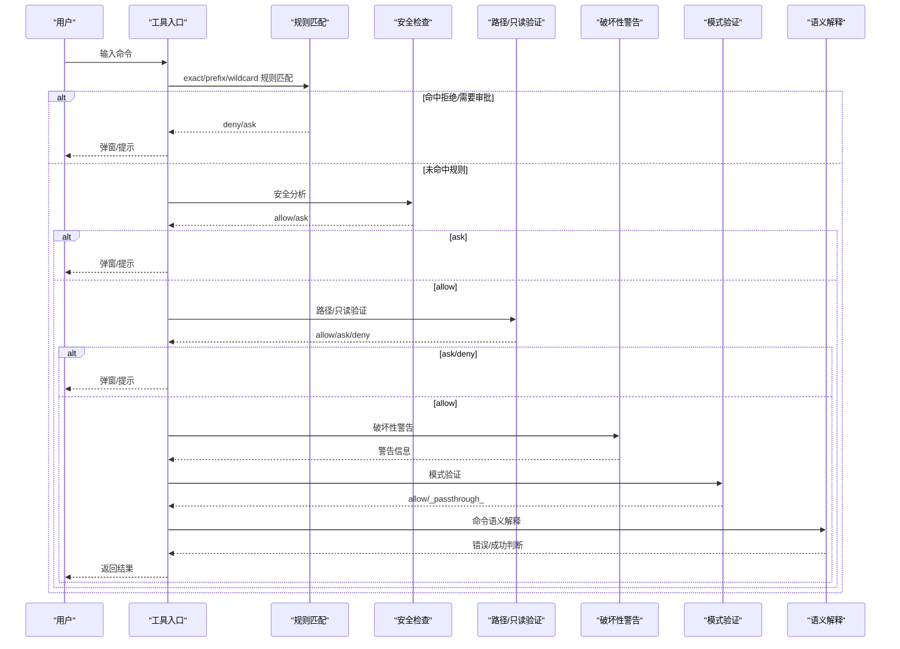
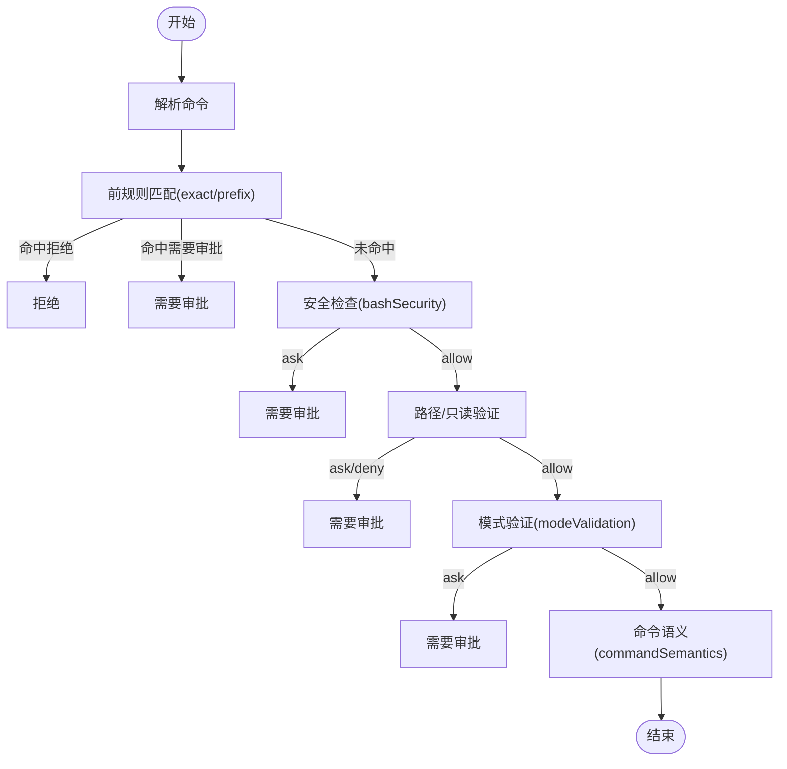
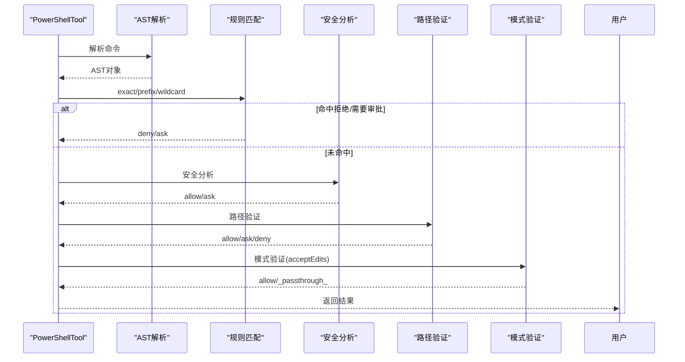
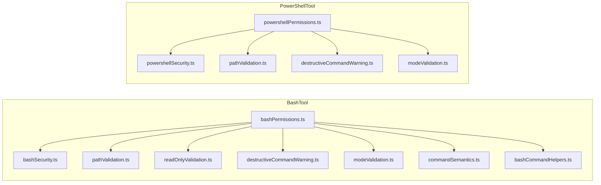

# 命令执行工具

<cite>
**本文档引用的文件**
- [BashTool/bashCommandHelpers.ts](file://src/tools/BashTool/bashCommandHelpers.ts)
- [BashTool/bashPermissions.ts](file://src/tools/BashTool/bashPermissions.ts)
- [BashTool/bashSecurity.ts](file://src/tools/BashTool/bashSecurity.ts)
- [BashTool/commandSemantics.ts](file://src/tools/BashTool/commandSemantics.ts)
- [BashTool/destructiveCommandWarning.ts](file://src/tools/BashTool/destructiveCommandWarning.ts)
- [BashTool/modeValidation.ts](file://src/tools/BashTool/modeValidation.ts)
- [BashTool/pathValidation.ts](file://src/tools/BashTool/pathValidation.ts)
- [BashTool/readOnlyValidation.ts](file://src/tools/BashTool/readOnlyValidation.ts)
- [PowerShellTool/powershellSecurity.ts](file://src/tools/PowerShellTool/powershellSecurity.ts)
- [PowerShellTool/powershellPermissions.ts](file://src/tools/PowerShellTool/powershellPermissions.ts)
- [PowerShellTool/modeValidation.ts](file://src/tools/PowerShellTool/modeValidation.ts)
- [PowerShellTool/pathValidation.ts](file://src/tools/PowerShellTool/pathValidation.ts)
- [PowerShellTool/destructiveCommandWarning.ts](file://src/tools/PowerShellTool/destructiveCommandWarning.ts)
- [SleepTool/prompt.ts](file://src/tools/SleepTool/prompt.ts)
- [REPLTool/constants.ts](file://src/tools/REPLTool/constants.ts)
- [REPLTool/primitiveTools.ts](file://src/tools/REPLTool/primitiveTools.ts)
</cite>

## 目录
1. [简介](#简介)
2. [项目结构](#项目结构)
3. [核心组件](#核心组件)
4. [架构总览](#架构总览)
5. [详细组件分析](#详细组件分析)
6. [依赖关系分析](#依赖关系分析)
7. [性能考虑](#性能考虑)
8. [故障排除指南](#故障排除指南)
9. [结论](#结论)

## 简介
本文件系统化梳理命令执行工具的设计与实现，重点覆盖 BashTool 与 PowerShellTool 的权限控制、路径验证、破坏性命令警告机制；解释命令语义分析、只读模式验证、沙箱使用策略；并提供 SleepTool 的定时功能与 REPLTool 的交互式编程能力说明。文档同时给出命令执行示例、错误处理机制与安全最佳实践，帮助开发者与使用者在保证安全的前提下高效使用命令执行工具。

## 项目结构
命令执行工具主要分布在以下模块：
- BashTool：面向 Bash 的命令解析、权限检查、路径与只读验证、破坏性命令警告、语义解释等。
- PowerShellTool：面向 PowerShell 的命令解析、权限检查、路径与只读验证、破坏性命令警告、安全分析等。
- SleepTool：提供定时等待能力。
- REPLTool：提供交互式编程与原语工具集合。

图表来源
- [BashTool/bashPermissions.ts:1-2622](file://src/tools/BashTool/bashPermissions.ts#L1-2622)
- [BashTool/bashSecurity.ts:1-2593](file://src/tools/BashTool/bashSecurity.ts#L1-2593)
- [BashTool/pathValidation.ts:1-1304](file://src/tools/BashTool/pathValidation.ts#L1-1304)
- [BashTool/readOnlyValidation.ts:1-1991](file://src/tools/BashTool/readOnlyValidation.ts#L1-1991)
- [BashTool/destructiveCommandWarning.ts:1-103](file://src/tools/BashTool/destructiveCommandWarning.ts#L1-103)
- [BashTool/modeValidation.ts:1-116](file://src/tools/BashTool/modeValidation.ts#L1-116)
- [BashTool/commandSemantics.ts:1-141](file://src/tools/BashTool/commandSemantics.ts#L1-141)
- [PowerShellTool/powershellPermissions.ts:1-1649](file://src/tools/PowerShellTool/powershellPermissions.ts#L1-1649)
- [PowerShellTool/powershellSecurity.ts:1-1091](file://src/tools/PowerShellTool/powershellSecurity.ts#L1-1091)
- [PowerShellTool/pathValidation.ts:1-2050](file://src/tools/PowerShellTool/pathValidation.ts#L1-2050)
- [PowerShellTool/destructiveCommandWarning.ts:1-110](file://src/tools/PowerShellTool/destructiveCommandWarning.ts#L1-110)
- [SleepTool/prompt.ts](file://src/tools/SleepTool/prompt.ts)
- [REPLTool/constants.ts](file://src/tools/REPLTool/constants.ts)
- [REPLTool/primitiveTools.ts](file://src/tools/REPLTool/primitiveTools.ts)

章节来源
- [BashTool/bashPermissions.ts:1-2622](file://src/tools/BashTool/bashPermissions.ts#L1-2622)
- [PowerShellTool/powershellPermissions.ts:1-1649](file://src/tools/PowerShellTool/powershellPermissions.ts#L1-1649)

## 核心组件
- BashTool
  - 权限主流程：统一入口，按规则匹配、安全检查、路径与只读验证、破坏性警告、模式验证、语义解释等。
  - 安全校验：针对 Bash 特有的危险模式（如命令替换、Zsh 扩展、不完整命令等）进行检测。
  - 路径验证：对文件系统操作命令提取路径，结合工作目录与规则进行白名单/黑名单判定。
  - 只读规则：允许仅读取文件的命令集，避免写入风险。
  - 模式验证：在特定模式（如 acceptEdits）下自动放行安全的文件系统修改命令。
  - 命令语义：根据命令退出码语义（如 grep/rg 的“无匹配”视为成功）调整错误报告。
  - 破坏性警告：对高危命令（如递归删除、强制推送）提供用户提示。
  - 命令分段与操作符权限：对管道与复合命令进行细粒度权限评估。
- PowerShellTool
  - 权限主流程：基于 AST 的命令解析，精确匹配别名与模块限定命令，执行安全检查与路径验证。
  - 安全分析：检测动态命令名、编码参数、嵌套 PowerShell 进程、下载脚手架、COM 对象、成员调用等高危模式。
  - 路径验证：为每个 cmdlet 建立参数配置，识别路径参数与非路径参数，严格限制写入目标。
  - 模式验证：在 acceptEdits 模式下，仅允许简单写入类 cmdlet，并进行 cwd 变更与符号链接创建的防护。
  - 破坏性警告：与 BashTool 类似的破坏性命令提示。
- SleepTool
  - 提供定时等待能力，用于延时执行或节奏控制。
- REPLTool
  - 提供交互式编程环境与基础原语工具集合，支持快速原型与调试。

章节来源
- [BashTool/bashPermissions.ts:1-2622](file://src/tools/BashTool/bashPermissions.ts#L1-2622)
- [PowerShellTool/powershellPermissions.ts:1-1649](file://src/tools/PowerShellTool/powershellPermissions.ts#L1-1649)
- [SleepTool/prompt.ts](file://src/tools/SleepTool/prompt.ts)
- [REPLTool/constants.ts](file://src/tools/REPLTool/constants.ts)
- [REPLTool/primitiveTools.ts](file://src/tools/REPLTool/primitiveTools.ts)

## 架构总览
BashTool 与 PowerShellTool 的权限流均遵循“规则匹配 → 安全检查 → 路径/只读验证 → 破坏性警告 → 模式验证 → 语义解释”的顺序，最终输出允许/要求审批/拒绝三种结果。两者在安全分析与路径验证上采用不同的语言特性与 AST 解析策略，但整体流程一致。

图表来源
- [BashTool/bashPermissions.ts:1-2622](file://src/tools/BashTool/bashPermissions.ts#L1-2622)
- [PowerShellTool/powershellPermissions.ts:1-1649](file://src/tools/PowerShellTool/powershellPermissions.ts#L1-1649)

## 详细组件分析

### BashTool 组件分析

#### 权限主流程与规则匹配
- 支持 exact/prefix/wildcard 三类规则匹配，优先级为 deny > ask > allow。
- 在解析失败或包含 UNC 路径时，延迟决策以确保子命令拒绝规则仍能生效。
- 对于 Bash 特有语法（如管道、复合命令），通过命令分段与操作符权限检查进行细化。

图表来源
- [BashTool/bashPermissions.ts:1-2622](file://src/tools/BashTool/bashPermissions.ts#L1-2622)
- [BashTool/bashSecurity.ts:1-2593](file://src/tools/BashTool/bashSecurity.ts#L1-2593)
- [BashTool/pathValidation.ts:1-1304](file://src/tools/BashTool/pathValidation.ts#L1-1304)
- [BashTool/modeValidation.ts:1-116](file://src/tools/BashTool/modeValidation.ts#L1-116)
- [BashTool/commandSemantics.ts:1-141](file://src/tools/BashTool/commandSemantics.ts#L1-141)

章节来源
- [BashTool/bashPermissions.ts:1-2622](file://src/tools/BashTool/bashPermissions.ts#L1-2622)

#### 安全检查（bashSecurity）
- 针对 Bash 危险模式进行检测，包括命令替换、Zsh 扩展、不完整命令、heredoc 替换注入、git 提交消息中的命令替换等。
- 对特定命令（如 git commit、jq）进行特殊规则校验，防止绕过与滥用。

章节来源
- [BashTool/bashSecurity.ts:1-2593](file://src/tools/BashTool/bashSecurity.ts#L1-2593)

#### 路径验证（pathValidation）
- 为不同命令建立路径提取器，区分读/写/创建操作类型。
- 对写操作进行危险路径阻断（如根目录删除），并结合工作目录与规则生成建议。
- 对复合命令中的目录变更（cd）进行防护，避免路径解析偏差。

章节来源
- [BashTool/pathValidation.ts:1-1304](file://src/tools/BashTool/pathValidation.ts#L1-1304)

#### 只读规则（readOnlyValidation）
- 允许仅读取文件的命令集，避免写入风险。
- 对部分命令（如 xargs、sed、sort、grep 等）进行参数白名单校验，防止任意命令执行与路径写入。

章节来源
- [BashTool/readOnlyValidation.ts:1-1991](file://src/tools/BashTool/readOnlyValidation.ts#L1-1991)

#### 破坏性命令警告
- 对高危 Bash 命令（如递归删除、强制推送、数据库删除等）提供用户提示，不影响权限逻辑。

章节来源
- [BashTool/destructiveCommandWarning.ts:1-103](file://src/tools/BashTool/destructiveCommandWarning.ts#L1-103)

#### 模式验证（acceptEdits）
- 在 acceptEdits 模式下自动放行安全的文件系统修改命令（如 mkdir、touch、rm、rmdir、mv、cp、sed）。
- 复合命令中若存在目录变更或符号链接创建，则拒绝自动放行，防止路径解析偏差导致越权。

章节来源
- [BashTool/modeValidation.ts:1-116](file://src/tools/BashTool/modeValidation.ts#L1-116)

#### 命令语义分析
- 根据命令退出码语义（如 grep/rg 的“无匹配”视为成功）调整错误报告，提升用户体验。

章节来源
- [BashTool/commandSemantics.ts:1-141](file://src/tools/BashTool/commandSemantics.ts#L1-141)

#### 命令分段与操作符权限
- 对管道与复合命令进行分段处理，检测跨段的危险组合（如 cd+git），并逐段进行权限评估。

章节来源
- [BashTool/bashCommandHelpers.ts:1-266](file://src/tools/BashTool/bashCommandHelpers.ts#L1-266)

### PowerShellTool 组件分析

#### 权限主流程（powershellPermissions）
- 使用 AST 解析命令，支持别名与模块限定命令的规范化匹配。
- 规则匹配顺序：exact → prefix → wildcard；解析失败时保留拒绝/审批优先级。
- 对包含 UNC 路径的命令进行拦截，防止网络请求与凭据泄露。

图表来源
- [PowerShellTool/powershellPermissions.ts:1-1649](file://src/tools/PowerShellTool/powershellPermissions.ts#L1-1649)
- [PowerShellTool/powershellSecurity.ts:1-1091](file://src/tools/PowerShellTool/powershellSecurity.ts#L1-1091)
- [PowerShellTool/pathValidation.ts:1-2050](file://src/tools/PowerShellTool/pathValidation.ts#L1-2050)
- [PowerShellTool/modeValidation.ts:1-405](file://src/tools/PowerShellTool/modeValidation.ts#L1-405)

章节来源
- [PowerShellTool/powershellPermissions.ts:1-1649](file://src/tools/PowerShellTool/powershellPermissions.ts#L1-1649)

#### 安全分析（powershellSecurity）
- 检测动态命令名、编码参数、嵌套 PowerShell 进程、下载脚手架（IWR/IRM/IEX）、COM 对象、成员调用、子表达式、可展开字符串、Splatting、停止解析标记等高危模式。
- 对特定 cmdlet（如 Invoke-Expression、Start-Process -Verb RunAs、Invoke-Command -FilePath 等）进行严格限制。

章节来源
- [PowerShellTool/powershellSecurity.ts:1-1091](file://src/tools/PowerShellTool/powershellSecurity.ts#L1-1091)

#### 路径验证（pathValidation）
- 为每个 cmdlet 建立参数配置，识别路径参数与非路径参数，严格限制写入目标。
- 对写入型 cmdlet（如 Set-Content、Remove-Item、Out-File、Export-* 等）进行路径提取与验证。
- 对位置参数（如 Invoke-WebRequest 的 -Uri）进行跳过，避免误判。

章节来源
- [PowerShellTool/pathValidation.ts:1-2050](file://src/tools/PowerShellTool/pathValidation.ts#L1-2050)

#### 模式验证（acceptEdits）
- 在 acceptEdits 模式下，仅允许简单写入类 cmdlet（如 Set-Content、Add-Content、Remove-Item、Clear-Content）。
- 复合命令中若存在目录变更（Set-Location/ Push-Location/Pop-Location）或符号链接创建（New-Item -ItemType SymbolicLink/Junction/HardLink），则拒绝自动放行。

章节来源
- [PowerShellTool/modeValidation.ts:1-405](file://src/tools/PowerShellTool/modeValidation.ts#L1-405)

#### 破坏性命令警告
- 对高危 PowerShell 命令（如递归删除、格式化卷、清空回收站、Git 强制推送等）提供用户提示。

章节来源
- [PowerShellTool/destructiveCommandWarning.ts:1-110](file://src/tools/PowerShellTool/destructiveCommandWarning.ts#L1-110)

### SleepTool 与 REPLTool

#### SleepTool
- 提供定时等待能力，用于延时执行或节奏控制，便于与其他工具配合实现有序的命令序列。

章节来源
- [SleepTool/prompt.ts](file://src/tools/SleepTool/prompt.ts)

#### REPLTool
- 提供交互式编程能力与原语工具集合，支持快速原型与调试，适合探索性任务与小规模实验。

章节来源
- [REPLTool/constants.ts](file://src/tools/REPLTool/constants.ts)
- [REPLTool/primitiveTools.ts](file://src/tools/REPLTool/primitiveTools.ts)

## 依赖关系分析

图表来源
- [BashTool/bashPermissions.ts:1-2622](file://src/tools/BashTool/bashPermissions.ts#L1-2622)
- [PowerShellTool/powershellPermissions.ts:1-1649](file://src/tools/PowerShellTool/powershellPermissions.ts#L1-1649)

章节来源
- [BashTool/bashPermissions.ts:1-2622](file://src/tools/BashTool/bashPermissions.ts#L1-2622)
- [PowerShellTool/powershellPermissions.ts:1-1649](file://src/tools/PowerShellTool/powershellPermissions.ts#L1-1649)

## 性能考虑
- BashTool
  - 复合命令拆分数量上限与建议规则数量上限，避免过宽拆分导致的事件循环饥饿与 REPL 冻结。
  - 对复杂命令采用异步解析与缓存元数据，减少重复计算。
- PowerShellTool
  - AST 解析失败时的降级路径，确保显式规则仍能生效。
  - 对解析失败的片段进行保守匹配，避免误报与漏报。

[本节为通用指导，无需具体文件引用]

## 故障排除指南
- 命令被拒绝
  - 检查是否存在 deny 规则或 UNC 路径触发的拦截。
  - 查看是否命中破坏性命令警告，必要时调整命令或添加会话级规则。
- 需要审批
  - 若命令包含安全边界模糊的元素（如管道、复合命令、动态参数、子表达式等），可能触发 ask。
  - 可参考建议生成的规则（如添加目录读取/写入规则、切换 acceptEdits 模式）。
- 路径验证失败
  - 确认路径在允许的工作目录范围内，避免危险路径（如根目录删除）。
  - 对复合命令中的目录变更（cd）场景，避免在同一条命令中进行写操作。
- PowerShell 安全问题
  - 动态命令名、编码参数、嵌套 PowerShell 进程、下载脚手架等会被严格限制。
  - 对 COM 对象、成员调用、Splatting 等高危模式，建议改用更安全的替代方案。

章节来源
- [BashTool/bashPermissions.ts:1-2622](file://src/tools/BashTool/bashPermissions.ts#L1-2622)
- [PowerShellTool/powershellPermissions.ts:1-1649](file://src/tools/PowerShellTool/powershellPermissions.ts#L1-1649)

## 结论
BashTool 与 PowerShellTool 通过“规则匹配 + 安全检查 + 路径/只读验证 + 破坏性警告 + 模式验证 + 语义解释”的多层防护体系，在保障安全的前提下提供了灵活的命令执行能力。BashTool 更侧重于 Bash 语法与路径安全，PowerShellTool 则聚焦于 AST 精准解析与 cmdlet 参数安全。结合 SleepTool 的定时与 REPLTool 的交互能力，可构建从自动化到探索式开发的完整命令执行生态。