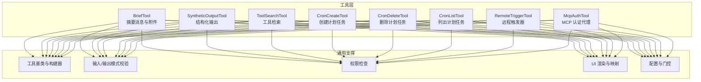
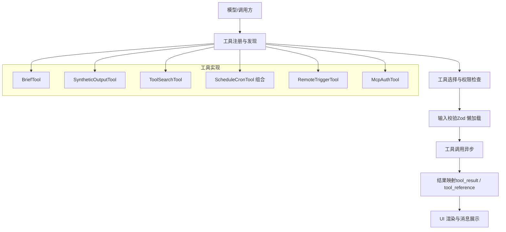
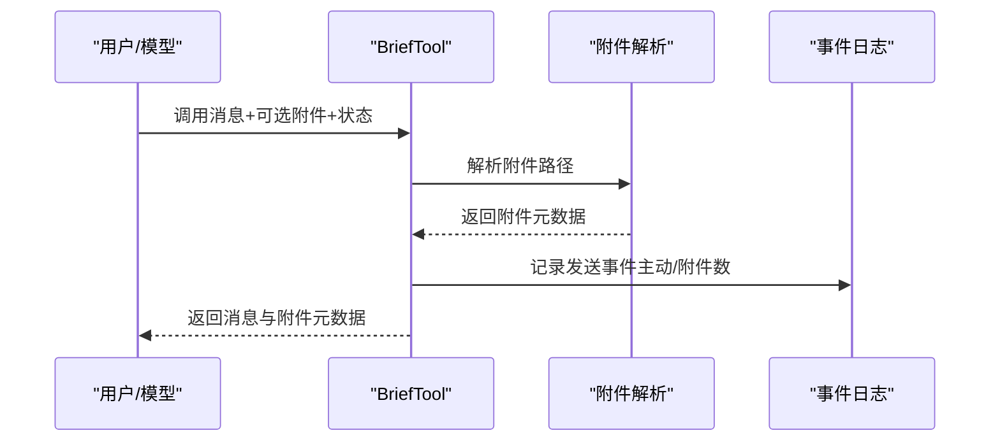
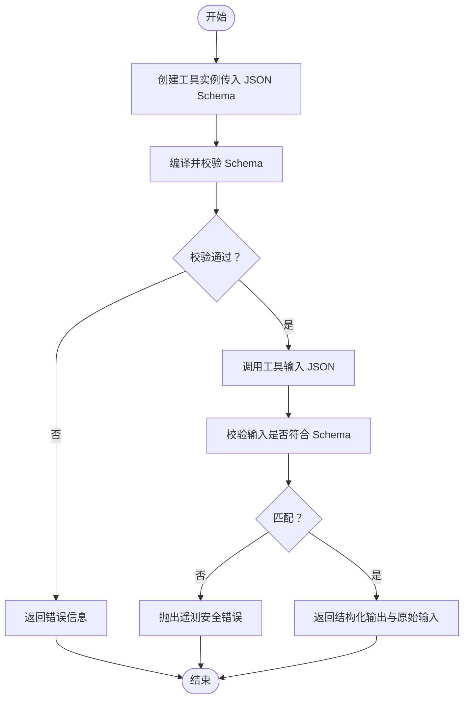
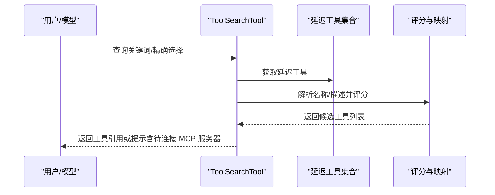
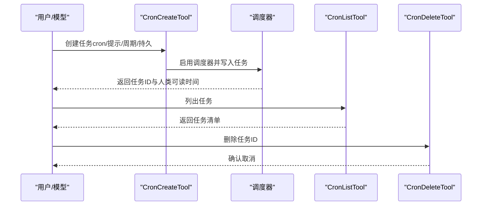
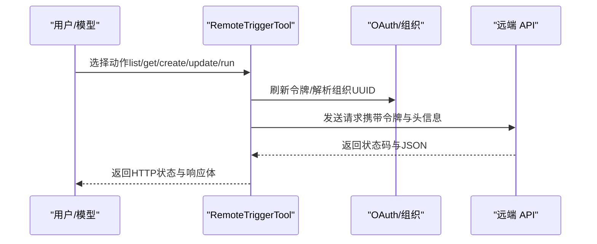
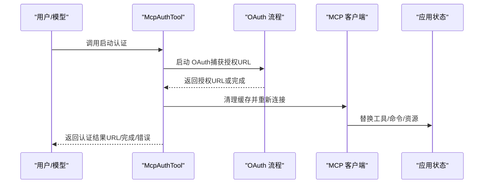
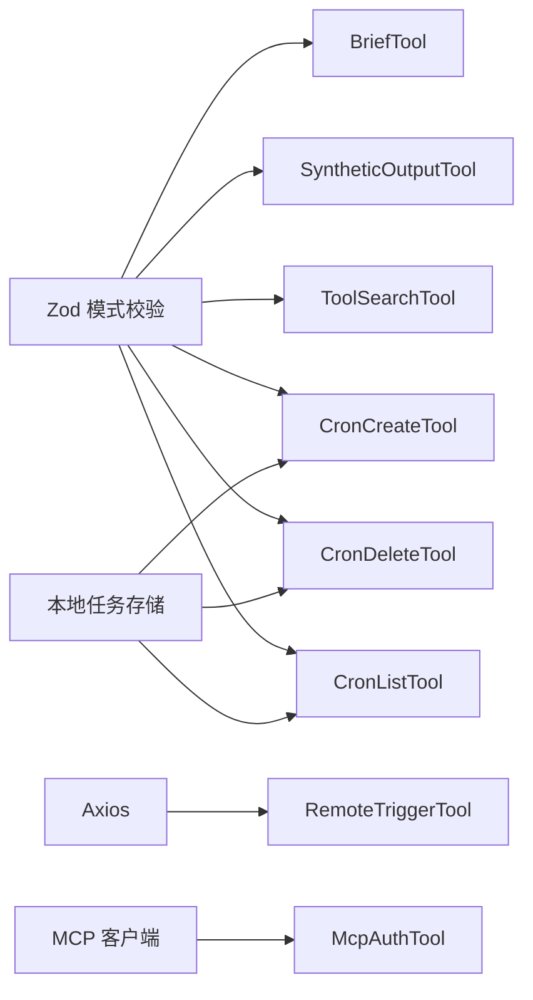

# 实用工具集合

<cite>
**本文引用的文件**
- [BriefTool.ts](file://src/tools/BriefTool/BriefTool.ts)
- [SyntheticOutputTool.ts](file://src/tools/SyntheticOutputTool/SyntheticOutputTool.ts)
- [ToolSearchTool.ts](file://src/tools/ToolSearchTool/ToolSearchTool.ts)
- [ScheduleCronTool/CronCreateTool.ts](file://src/tools/ScheduleCronTool/CronCreateTool.ts)
- [ScheduleCronTool/CronDeleteTool.ts](file://src/tools/ScheduleCronTool/CronDeleteTool.ts)
- [ScheduleCronTool/CronListTool.ts](file://src/tools/ScheduleCronTool/CronListTool.ts)
- [RemoteTriggerTool.ts](file://src/tools/RemoteTriggerTool/RemoteTriggerTool.ts)
- [McpAuthTool.ts](file://src/tools/McpAuthTool/McpAuthTool.ts)
- [utils.ts](file://src/tools/utils.ts)
</cite>

## 目录
1. [简介](#简介)
2. [项目结构](#项目结构)
3. [核心组件](#核心组件)
4. [架构总览](#架构总览)
5. [详细组件分析](#详细组件分析)
6. [依赖关系分析](#依赖关系分析)
7. [性能考量](#性能考量)
8. [故障排查指南](#故障排查指南)
9. [结论](#结论)
10. [附录](#附录)

## 简介
本文件系统化梳理并说明实用工具集合的设计与实现，重点覆盖以下工具：
- BriefTool：摘要消息发送与附件投递，作为主可见输出通道
- SyntheticOutputTool：结构化输出生成器，面向非交互式 SDK/CLI 场景
- ToolSearchTool：延迟加载工具的检索与选择机制
- ScheduleCronTool：基于本地任务计划的定时调度（创建/删除/列出）
- RemoteTriggerTool：远程触发器管理（列表/获取/创建/更新/运行）
- McpAuthTool：MCP 服务器认证代理工具，桥接 OAuth 流程

文档从设计目标、使用场景、集成方式、配置方法、使用示例、最佳实践、扩展性与可定制性、以及与其他系统的集成能力等维度进行阐述，并辅以可视化图示帮助理解。

## 项目结构
实用工具位于 src/tools 下，按功能模块划分目录，每个工具均通过统一的工具定义接口构建，具备输入/输出模式校验、权限检查、渲染与映射等通用能力。部分工具还包含配套的 UI 渲染与提示文案。

图表来源
- [BriefTool.ts:136-204](file://src/tools/BriefTool/BriefTool.ts#L136-L204)
- [SyntheticOutputTool.ts:28-101](file://src/tools/SyntheticOutputTool/SyntheticOutputTool.ts#L28-L101)
- [ToolSearchTool.ts:304-471](file://src/tools/ToolSearchTool/ToolSearchTool.ts#L304-L471)
- [ScheduleCronTool/CronCreateTool.ts:56-157](file://src/tools/ScheduleCronTool/CronCreateTool.ts#L56-L157)
- [ScheduleCronTool/CronDeleteTool.ts:35-95](file://src/tools/ScheduleCronTool/CronDeleteTool.ts#L35-L95)
- [ScheduleCronTool/CronListTool.ts:37-97](file://src/tools/ScheduleCronTool/CronListTool.ts#L37-L97)
- [RemoteTriggerTool.ts:46-161](file://src/tools/RemoteTriggerTool/RemoteTriggerTool.ts#L46-L161)
- [McpAuthTool.ts:49-215](file://src/tools/McpAuthTool/McpAuthTool.ts#L49-L215)

章节来源
- [BriefTool.ts:1-205](file://src/tools/BriefTool/BriefTool.ts#L1-L205)
- [SyntheticOutputTool.ts:1-164](file://src/tools/SyntheticOutputTool/SyntheticOutputTool.ts#L1-L164)
- [ToolSearchTool.ts:1-472](file://src/tools/ToolSearchTool/ToolSearchTool.ts#L1-L472)
- [ScheduleCronTool/CronCreateTool.ts:1-158](file://src/tools/ScheduleCronTool/CronCreateTool.ts#L1-L158)
- [ScheduleCronTool/CronDeleteTool.ts:1-96](file://src/tools/ScheduleCronTool/CronDeleteTool.ts#L1-L96)
- [ScheduleCronTool/CronListTool.ts:1-98](file://src/tools/ScheduleCronTool/CronListTool.ts#L1-L98)
- [RemoteTriggerTool.ts:1-162](file://src/tools/RemoteTriggerTool/RemoteTriggerTool.ts#L1-L162)
- [McpAuthTool.ts:1-216](file://src/tools/McpAuthTool/McpAuthTool.ts#L1-L216)

## 核心组件
- 工具构建与基类：所有工具通过统一的构建器创建，具备输入/输出模式、启用条件、并发安全、只读属性、权限检查、渲染与映射等能力。
- 模式校验：使用 Zod 懒加载模式，确保在需要时才编译，减少启动开销。
- 权限与策略：部分工具内置权限检查或依赖外部策略限制（如 MCP 连接、OAuth 状态）。
- UI 映射：工具调用结果映射到消息块，支持工具引用、进度、错误与拒绝提示等 UI 表达。
- 配置与门控：通过特性开关、运行时门控与环境变量控制工具可用性与行为。

章节来源
- [BriefTool.ts:136-204](file://src/tools/BriefTool/BriefTool.ts#L136-L204)
- [SyntheticOutputTool.ts:28-101](file://src/tools/SyntheticOutputTool/SyntheticOutputTool.ts#L28-L101)
- [ToolSearchTool.ts:304-471](file://src/tools/ToolSearchTool/ToolSearchTool.ts#L304-L471)
- [RemoteTriggerTool.ts:46-161](file://src/tools/RemoteTriggerTool/RemoteTriggerTool.ts#L46-L161)
- [McpAuthTool.ts:49-215](file://src/tools/McpAuthTool/McpAuthTool.ts#L49-L215)

## 架构总览
实用工具集合遵循“统一构建器 + 可插拔实现”的架构。各工具共享输入/输出模式、权限检查、渲染与映射等通用逻辑；同时通过各自的提示、验证与调用实现满足特定业务需求。

图表来源
- [BriefTool.ts:136-204](file://src/tools/BriefTool/BriefTool.ts#L136-L204)
- [SyntheticOutputTool.ts:28-101](file://src/tools/SyntheticOutputTool/SyntheticOutputTool.ts#L28-L101)
- [ToolSearchTool.ts:304-471](file://src/tools/ToolSearchTool/ToolSearchTool.ts#L304-L471)
- [ScheduleCronTool/CronCreateTool.ts:56-157](file://src/tools/ScheduleCronTool/CronCreateTool.ts#L56-L157)
- [RemoteTriggerTool.ts:46-161](file://src/tools/RemoteTriggerTool/RemoteTriggerTool.ts#L46-L161)
- [McpAuthTool.ts:49-215](file://src/tools/McpAuthTool/McpAuthTool.ts#L49-L215)

## 详细组件分析

### BriefTool：摘要生成功能
- 设计目的：作为主要的用户可见输出通道，支持文本消息与附件（截图、日志、差异等）同步投递，提升信息传达效率。
- 使用场景：会话中主动告知状态（如任务完成、阻塞问题、未请求但需立即关注的信息）、与附件结合呈现上下文。
- 关键能力
  - 输入/输出模式：严格对象模式，支持消息内容、附件路径数组与状态标记（常规/主动）。
  - 附件解析：对相对/绝对路径进行解析，返回元数据（路径、大小、是否图片、可选文件标识）。
  - 启用门控：结合特性开关、运行时门控与用户显式开启，确保合规启用。
  - 日志与 UI：记录发送事件与附件数量，渲染工具使用与结果消息。
- 集成方法
  - 在会话中通过工具调用发送消息；若存在附件，先解析再返回元数据。
  - 通过门控函数判断当前会话是否允许使用该工具。
- 最佳实践
  - 附件路径尽量使用相对路径，便于跨环境复用。
  - 主动状态用于重要且非请求的提醒，避免过度打扰。
  - 结合 UI 层的消息标签与去重逻辑，避免重复渲染。

图表来源
- [BriefTool.ts:186-204](file://src/tools/BriefTool/BriefTool.ts#L186-L204)

章节来源
- [BriefTool.ts:1-205](file://src/tools/BriefTool/BriefTool.ts#L1-L205)

### SyntheticOutputTool：合成输出能力
- 设计目的：在非交互式场景（SDK/CLI）中，要求模型以指定 JSON Schema 输出最终结果，保证结构化与一致性。
- 使用场景：工作流脚本、自动化任务、批量处理等需要稳定结构化输出的场景。
- 关键能力
  - 动态 Schema：通过工厂方法创建带具体 JSON Schema 的工具实例，内部缓存以降低重复编译开销。
  - 校验与错误：对输入进行 Schema 校验，不匹配时抛出遥测安全的错误信息。
  - 权限策略：始终允许，仅返回数据。
  - UI 简化：最小化 UI 实现，适合非交互式使用。
- 集成方法
  - 在会话初始化时根据需求创建工具实例；调用后返回结构化输出与原始输入。
- 最佳实践
  - 对频繁使用的相同 Schema 建议复用已创建的工具实例，利用弱引用缓存。
  - 提前验证 Schema 的有效性，避免运行期异常。

图表来源
- [SyntheticOutputTool.ts:116-163](file://src/tools/SyntheticOutputTool/SyntheticOutputTool.ts#L116-L163)

章节来源
- [SyntheticOutputTool.ts:1-164](file://src/tools/SyntheticOutputTool/SyntheticOutputTool.ts#L1-L164)

### ToolSearchTool：工具搜索机制
- 设计目的：在大量延迟加载工具中，帮助模型快速定位并选择所需工具，提升交互效率。
- 使用场景：工具集较大、MCP 服务器动态接入、模型需要按关键词或精确名称选择工具。
- 关键能力
  - 精确匹配：支持直接选择（select:）与逗号分隔多选；若工具已加载则视为无操作。
  - 关键词搜索：对工具名与描述进行词边界匹配与评分，支持必需词（+前缀）与可选词组合。
  - 缓存与失效：基于当前延迟工具集合的缓存键，当工具变化时自动清理描述缓存。
  - MCP 支持：区分 MCP 工具命名（mcp__server__action）与常规工具命名，分别解析与评分。
  - 结果映射：当无匹配时提示仍有 MCP 服务器正在连接；有匹配时返回工具引用块。
- 集成方法
  - 在会话中调用工具，传入查询与最大结果数；根据返回的工具引用进行后续调用。
- 最佳实践
  - 查询中使用 + 前缀标注必需词，提高召回质量。
  - 若已知 MCP 服务器名称，优先使用 mcp__ 前缀进行精确匹配。
  - 定期清理描述缓存，避免工具变更导致的陈旧评分。

图表来源
- [ToolSearchTool.ts:328-471](file://src/tools/ToolSearchTool/ToolSearchTool.ts#L328-L471)

章节来源
- [ToolSearchTool.ts:1-472](file://src/tools/ToolSearchTool/ToolSearchTool.ts#L1-L472)

### ScheduleCronTool：定时调度功能
- 设计目的：提供本地定时任务的创建、删除与列出能力，支持一次性与周期性任务，可选持久化。
- 使用场景：定时提醒、周期性任务、跨会话持久化的计划任务。
- 组件构成
  - CronCreateTool：创建任务（cron 表达式、提示、是否周期、是否持久）。
  - CronDeleteTool：取消任务（按任务 ID）。
  - CronListTool：列出当前有效任务（支持按代理身份过滤）。
- 关键能力
  - cron 校验与人类可读转换：解析标准 5 字段表达式，计算下次运行时间。
  - 门控与持久化：受特性开关控制；持久化需额外开关；teammate 上下文限制持久化。
  - 会话调度器：创建任务后启用调度器，使任务在当前会话中生效。
- 集成方法
  - 先调用创建工具生成任务 ID，再通过列出工具确认状态，必要时调用删除工具取消。
- 最佳实践
  - 使用人类可读表达式描述频率，避免歧义。
  - 对需要跨会话的任务启用持久化，注意 teammate 上下文限制。
  - 控制任务数量，避免超过上限。

图表来源
- [ScheduleCronTool/CronCreateTool.ts:117-142](file://src/tools/ScheduleCronTool/CronCreateTool.ts#L117-L142)
- [ScheduleCronTool/CronListTool.ts:63-78](file://src/tools/ScheduleCronTool/CronListTool.ts#L63-L78)
- [ScheduleCronTool/CronDeleteTool.ts:82-84](file://src/tools/ScheduleCronTool/CronDeleteTool.ts#L82-L84)

章节来源
- [ScheduleCronTool/CronCreateTool.ts:1-158](file://src/tools/ScheduleCronTool/CronCreateTool.ts#L1-L158)
- [ScheduleCronTool/CronDeleteTool.ts:1-96](file://src/tools/ScheduleCronTool/CronDeleteTool.ts#L1-L96)
- [ScheduleCronTool/CronListTool.ts:1-98](file://src/tools/ScheduleCronTool/CronListTool.ts#L1-L98)

### RemoteTriggerTool：远程触发器
- 设计目的：管理远程代理触发器（列表/获取/创建/更新/运行），通过 OAuth 令牌与组织上下文访问远端 API。
- 使用场景：远程触发器生命周期管理、按需触发远程任务。
- 关键能力
  - OAuth 令牌刷新与组织 UUID 解析：确保请求具备有效凭据。
  - 动作路由：根据 action 分派 GET/POST 请求，支持 list/get/create/update/run。
  - 只读判定：list/get 为只读，其他动作具有副作用。
  - 门控与策略：受特性开关与策略限制共同控制。
- 集成方法
  - 先登录并确保具备远程会话权限，再调用相应动作。
- 最佳实践
  - 优先使用 get 确认资源存在后再执行更新或运行。
  - 注意超时与中断信号，避免长时间阻塞。

图表来源
- [RemoteTriggerTool.ts:78-151](file://src/tools/RemoteTriggerTool/RemoteTriggerTool.ts#L78-L151)

章节来源
- [RemoteTriggerTool.ts:1-162](file://src/tools/RemoteTriggerTool/RemoteTriggerTool.ts#L1-L162)

### McpAuthTool：MCP 认证功能
- 设计目的：为已安装但未认证的 MCP 服务器提供认证入口，启动 OAuth 流程并在完成后自动替换为真实工具。
- 使用场景：MCP 服务器首次接入、手动触发认证流程、后台自动重连。
- 关键能力
  - 伪工具：在未认证状态下替代真实工具，向用户暴露认证入口。
  - OAuth 启动：支持 SSE/HTTP 传输的 OAuth 流程，捕获授权 URL 或静默完成。
  - 自动替换：认证完成后清理缓存并重新连接，自动替换工具与命令。
  - 不支持提示：对于 claudeai-proxy 传输类型给出明确提示。
- 集成方法
  - 当服务器处于“需要认证”状态时，调用该工具获取授权 URL 或等待静默完成。
- 最佳实践
  - 对于 claudeai-proxy 类型，引导用户通过 /mcp 手动认证。
  - 观察后台日志确认工具替换成功。

图表来源
- [McpAuthTool.ts:85-206](file://src/tools/McpAuthTool/McpAuthTool.ts#L85-L206)

章节来源
- [McpAuthTool.ts:1-216](file://src/tools/McpAuthTool/McpAuthTool.ts#L1-L216)

## 依赖关系分析
- 工具间耦合度低：各工具独立实现，通过统一构建器与通用接口协作。
- 外部依赖
  - Zod：输入/输出模式校验与懒加载。
  - Axios：RemoteTriggerTool 的 HTTP 请求。
  - MCP 服务：McpAuthTool 与 MCP 客户端交互。
  - 本地任务：ScheduleCronTool 依赖本地任务存储与调度器。
- 可能的循环依赖：工具模块之间无直接循环导入，通过工具注册与发现间接协作。

图表来源
- [BriefTool.ts:20-63](file://src/tools/BriefTool/BriefTool.ts#L20-L63)
- [SyntheticOutputTool.ts:1-18](file://src/tools/SyntheticOutputTool/SyntheticOutputTool.ts#L1-L18)
- [ToolSearchTool.ts:21-47](file://src/tools/ToolSearchTool/ToolSearchTool.ts#L21-L47)
- [ScheduleCronTool/CronCreateTool.ts:27-54](file://src/tools/ScheduleCronTool/CronCreateTool.ts#L27-L54)
- [ScheduleCronTool/CronDeleteTool.ts:20-33](file://src/tools/ScheduleCronTool/CronDeleteTool.ts#L20-L33)
- [ScheduleCronTool/CronListTool.ts:17-35](file://src/tools/ScheduleCronTool/CronListTool.ts#L17-L35)
- [RemoteTriggerTool.ts:1-16](file://src/tools/RemoteTriggerTool/RemoteTriggerTool.ts#L1-L16)
- [McpAuthTool.ts:1-22](file://src/tools/McpAuthTool/McpAuthTool.ts#L1-L22)

章节来源
- [utils.ts:1-41](file://src/tools/utils.ts#L1-L41)

## 性能考量
- 懒加载模式：Zod 模式在首次使用时编译，减少启动时的 JIT 开销。
- 缓存优化：SyntheticOutputTool 对同一 Schema 的工具实例进行弱引用缓存，避免重复编译。
- 描述缓存：ToolSearchTool 基于延迟工具集合的缓存键，动态清理描述缓存，平衡准确性与性能。
- 并发安全：部分工具声明并发安全，避免重复执行带来的状态竞争。
- I/O 与网络：RemoteTriggerTool 设置超时与中断信号，避免长时间阻塞；McpAuthTool 的 OAuth 流程采用后台 Promise，避免阻塞主线程。

章节来源
- [SyntheticOutputTool.ts:109-125](file://src/tools/SyntheticOutputTool/SyntheticOutputTool.ts#L109-L125)
- [ToolSearchTool.ts:51-105](file://src/tools/ToolSearchTool/ToolSearchTool.ts#L51-L105)
- [RemoteTriggerTool.ts:140-143](file://src/tools/RemoteTriggerTool/RemoteTriggerTool.ts#L140-L143)

## 故障排查指南
- BriefTool
  - 附件解析失败：检查路径是否存在、是否在允许的工作目录内。
  - 工具未启用：确认特性开关与用户显式开启状态。
- SyntheticOutputTool
  - Schema 不合法：查看工厂返回的错误信息，修正 JSON Schema。
  - 输入不匹配：根据错误信息定位字段并调整输入。
- ToolSearchTool
  - 无匹配结果：尝试更精确的关键词或使用 select: 直接选择；留意仍在连接中的 MCP 服务器。
  - 描述缓存陈旧：触发缓存清理或重启会话。
- ScheduleCronTool
  - cron 表达式无效：检查字段数量与取值范围；确认在未来一年内确实有匹配时间点。
  - 任务过多：删除部分任务后再试。
  - teammate 上下文限制：持久化任务在 teammate 中不可用。
- RemoteTriggerTool
  - 未认证：先登录并确保具备远程会话权限。
  - 组织 UUID 解析失败：检查组织上下文与网络状态。
  - 请求超时：检查网络与远端 API 状态。
- McpAuthTool
  - 传输不支持：claudeai-proxy 类型需手动认证；SSE/HTTP 才支持工具触发认证。
  - OAuth 失败：查看后台日志并重试；必要时手动认证。

章节来源
- [BriefTool.ts:163-204](file://src/tools/BriefTool/BriefTool.ts#L163-L204)
- [SyntheticOutputTool.ts:142-157](file://src/tools/SyntheticOutputTool/SyntheticOutputTool.ts#L142-L157)
- [ToolSearchTool.ts:358-434](file://src/tools/ToolSearchTool/ToolSearchTool.ts#L358-L434)
- [ScheduleCronTool/CronCreateTool.ts:82-116](file://src/tools/ScheduleCronTool/CronCreateTool.ts#L82-L116)
- [ScheduleCronTool/CronDeleteTool.ts:61-81](file://src/tools/ScheduleCronTool/CronDeleteTool.ts#L61-L81)
- [ScheduleCronTool/CronListTool.ts:63-78](file://src/tools/ScheduleCronTool/CronListTool.ts#L63-L78)
- [RemoteTriggerTool.ts:78-151](file://src/tools/RemoteTriggerTool/RemoteTriggerTool.ts#L78-L151)
- [McpAuthTool.ts:89-108](file://src/tools/McpAuthTool/McpAuthTool.ts#L89-L108)

## 结论
实用工具集合围绕“统一构建器 + 可插拔实现”的理念，提供了从消息投递、结构化输出、工具检索、定时调度、远程触发到 MCP 认证的一整套能力。通过严格的模式校验、权限策略、UI 映射与缓存优化，既保证了易用性，也兼顾了性能与可维护性。建议在实际使用中结合场景选择合适的工具，并遵循最佳实践以获得稳定体验。

## 附录
- 扩展性与可定制性
  - 新增工具：遵循统一构建器与接口，实现输入/输出模式、权限检查、渲染与映射。
  - 动态工具：参考 SyntheticOutputTool 的工厂模式，支持运行时动态创建与缓存。
  - 搜索增强：ToolSearchTool 的评分与缓存机制可作为新工具检索的参考。
- 集成建议
  - 与 MCP：使用 McpAuthTool 代理认证，确保工具自动替换。
  - 与远程系统：RemoteTriggerTool 提供标准化的远程触发器管理入口。
  - 与会话：BriefTool 与 ScheduleCronTool 与会话状态紧密耦合，注意门控与上下文。