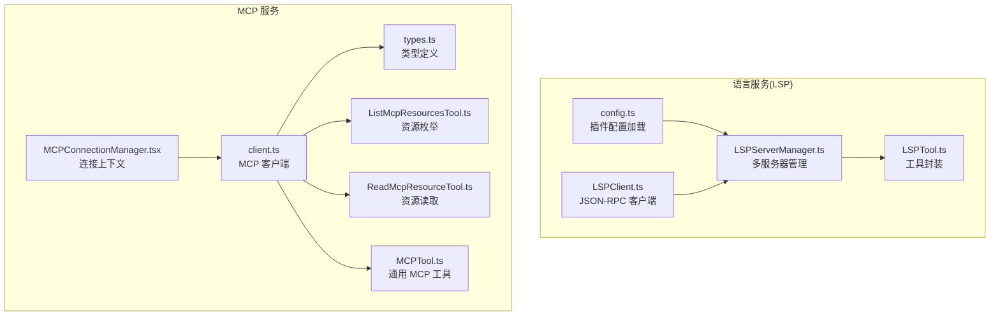
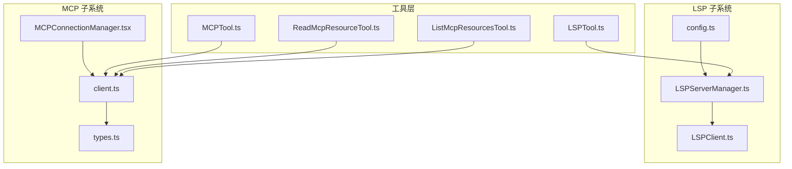
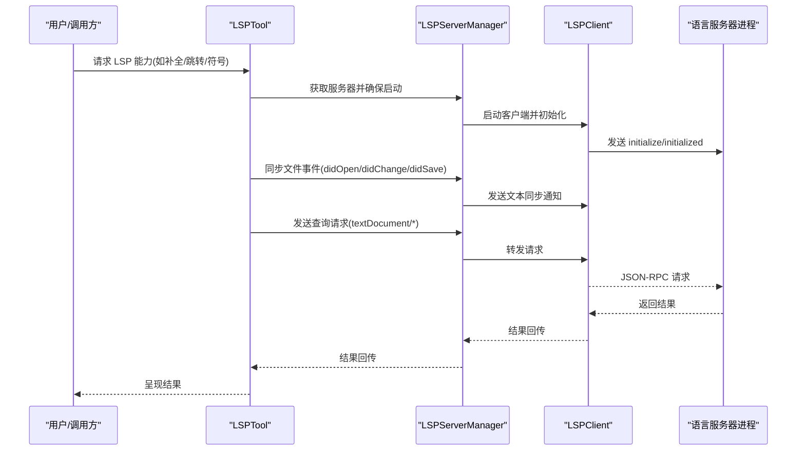
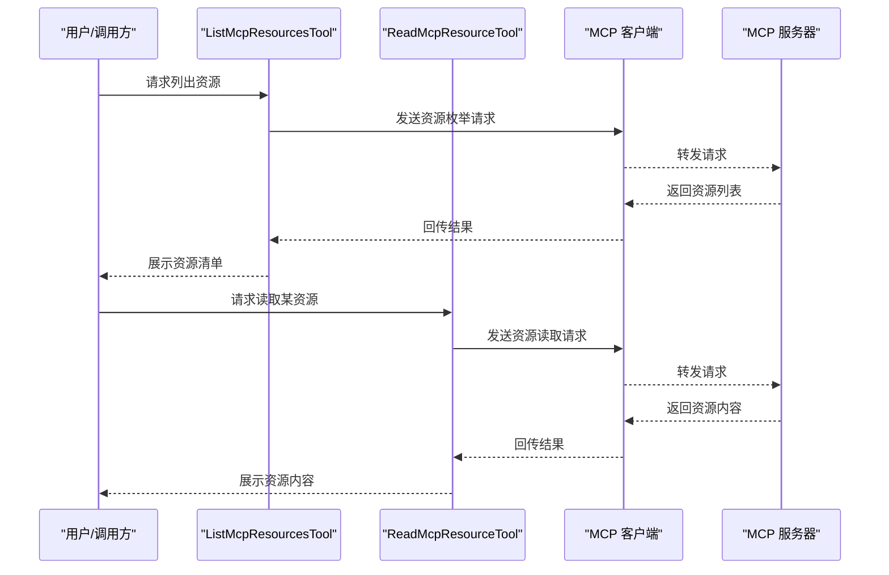
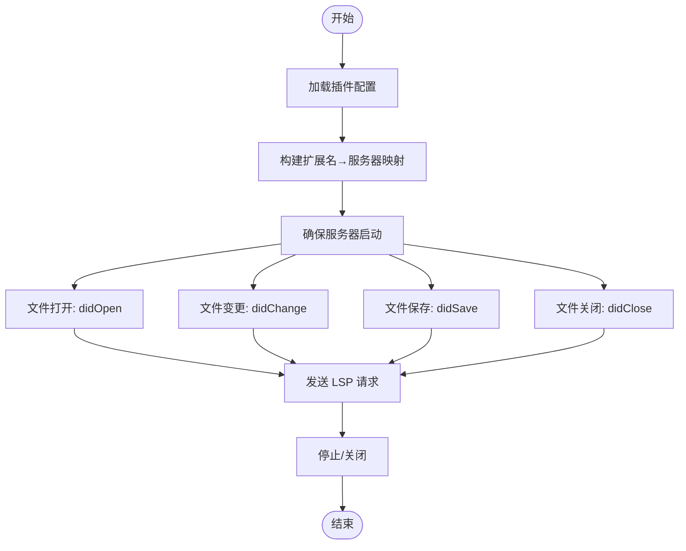
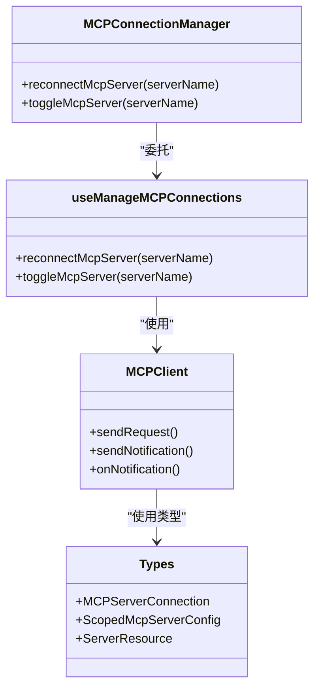
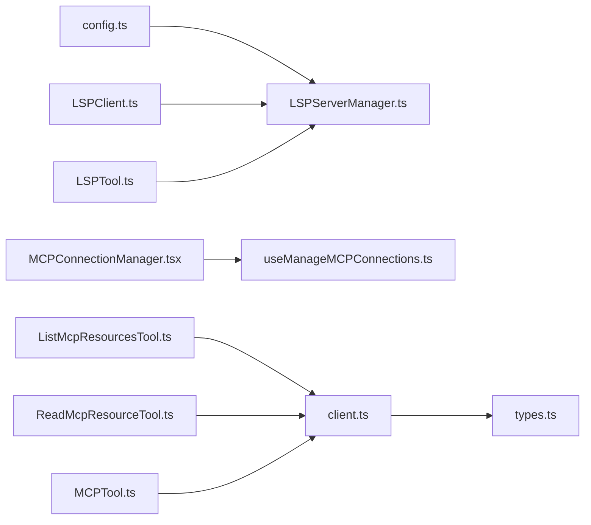

# 开发辅助工具

<cite>
**本文引用的文件**
- [LSPClient.ts](file://src/services/lsp/LSPClient.ts)
- [LSPServerManager.ts](file://src/services/lsp/LSPServerManager.ts)
- [config.ts](file://src/services/lsp/config.ts)
- [LSPTool.ts](file://src/tools/LSPTool/LSPTool.ts)
- [ListMcpResourcesTool.ts](file://src/tools/ListMcpResourcesTool/ListMcpResourcesTool.ts)
- [ReadMcpResourceTool.ts](file://src/tools/ReadMcpResourceTool/ReadMcpResourceTool.ts)
- [MCPTool.ts](file://src/tools/MCPTool/MCPTool.ts)
- [MCPConnectionManager.tsx](file://src/services/mcp/MCPConnectionManager.tsx)
- [client.ts](file://src/services/mcp/client.ts)
- [types.ts](file://src/services/mcp/types.ts)
- [useManageMCPConnections.ts](file://src/services/mcp/useManageMCPConnections.ts)
- [auth.ts](file://src/services/mcp/auth.ts)
- [channelPermissions.ts](file://src/services/mcp/channelPermissions.ts)
- [channelAllowlist.ts](file://src/services/mcp/channelAllowlist.ts)
- [headersHelper.ts](file://src/services/mcp/headersHelper.ts)
- [sdkMessageAdapter.ts](file://src/remote/sdkMessageAdapter.ts)
</cite>

## 目录
1. [简介](#简介)
2. [项目结构](#项目结构)
3. [核心组件](#核心组件)
4. [架构总览](#架构总览)
5. [详细组件分析](#详细组件分析)
6. [依赖关系分析](#依赖关系分析)
7. [性能考量](#性能考量)
8. [故障排查指南](#故障排查指南)
9. [结论](#结论)
10. [附录](#附录)

## 简介
本文件面向开发辅助工具的使用者与维护者，系统性阐述以下能力与实现：
- LSPTool：语言服务器协议（LSP）集成、代码补全、语法检查与符号导航
- ListMcpResourcesTool 与 ReadMcpResourceTool：MCP 资源管理
- MCPTool：通用 MCP 工具能力
- 语言服务器配置、连接管理与诊断信息处理
- MCP 服务器配置方法与安全权限控制
- 典型 LSP 集成示例与开发工作流优化建议

## 项目结构
围绕“语言服务”和“MCP 服务”的两条主线组织：
- 语言服务（LSP）
  - 客户端封装与连接管理：LSPClient.ts
  - 多服务器管理与路由：LSPServerManager.ts
  - 插件式配置加载：config.ts
  - 工具层封装：LSPTool.ts
- MCP 服务
  - 连接上下文与重连逻辑：MCPConnectionManager.tsx
  - 客户端与类型定义：client.ts、types.ts
  - 资源管理工具：ListMcpResourcesTool.ts、ReadMcpResourceTool.ts
  - 通用 MCP 工具：MCPTool.ts
  - 权限与安全：auth.ts、channelPermissions.ts、channelAllowlist.ts、headersHelper.ts

图表来源
- [LSPClient.ts:1-448](file://src/services/lsp/LSPClient.ts#L1-L448)
- [LSPServerManager.ts:1-421](file://src/services/lsp/LSPServerManager.ts#L1-L421)
- [config.ts:1-80](file://src/services/lsp/config.ts#L1-L80)
- [LSPTool.ts](file://src/tools/LSPTool/LSPTool.ts)
- [MCPConnectionManager.tsx:1-73](file://src/services/mcp/MCPConnectionManager.tsx#L1-L73)
- [client.ts](file://src/services/mcp/client.ts)
- [types.ts](file://src/services/mcp/types.ts)
- [ListMcpResourcesTool.ts](file://src/tools/ListMcpResourcesTool/ListMcpResourcesTool.ts)
- [ReadMcpResourceTool.ts](file://src/tools/ReadMcpResourceTool/ReadMcpResourceTool.ts)
- [MCPTool.ts](file://src/tools/MCPTool/MCPTool.ts)

章节来源
- [LSPClient.ts:1-448](file://src/services/lsp/LSPClient.ts#L1-L448)
- [LSPServerManager.ts:1-421](file://src/services/lsp/LSPServerManager.ts#L1-L421)
- [config.ts:1-80](file://src/services/lsp/config.ts#L1-L80)
- [LSPTool.ts](file://src/tools/LSPTool/LSPTool.ts)
- [MCPConnectionManager.tsx:1-73](file://src/services/mcp/MCPConnectionManager.tsx#L1-L73)
- [client.ts](file://src/services/mcp/client.ts)
- [types.ts](file://src/services/mcp/types.ts)
- [ListMcpResourcesTool.ts](file://src/tools/ListMcpResourcesTool/ListMcpResourcesTool.ts)
- [ReadMcpResourceTool.ts](file://src/tools/ReadMcpResourceTool/ReadMcpResourceTool.ts)
- [MCPTool.ts](file://src/tools/MCPTool/MCPTool.ts)

## 核心组件
- LSP 客户端与连接管理
  - LSPClient：基于 vscode-jsonrpc 封装，负责进程启动、消息连接、请求/通知、初始化与关闭流程，并提供错误处理与调试追踪
  - LSPServerManager：按文件扩展名路由到具体服务器实例，统一管理启动、同步文件事件（didOpen/didChange/didSave/didClose）、发送请求
  - 配置加载：从已启用插件中聚合 LSP 服务器配置，支持并发加载与合并策略
- MCP 服务与工具
  - MCPConnectionManager：提供重连与启停接口的上下文封装，配合 useManageMCPConnections 实现动态配置与严格模式
  - MCP 客户端与类型：client.ts、types.ts 定义连接、通道、资源等核心类型
  - 资源工具：ListMcpResourcesTool 枚举资源，ReadMcpResourceTool 读取资源内容
  - 通用 MCP 工具：MCPTool 提供跨资源的通用操作入口

章节来源
- [LSPClient.ts:1-448](file://src/services/lsp/LSPClient.ts#L1-L448)
- [LSPServerManager.ts:1-421](file://src/services/lsp/LSPServerManager.ts#L1-L421)
- [config.ts:1-80](file://src/services/lsp/config.ts#L1-L80)
- [MCPConnectionManager.tsx:1-73](file://src/services/mcp/MCPConnectionManager.tsx#L1-L73)
- [client.ts](file://src/services/mcp/client.ts)
- [types.ts](file://src/services/mcp/types.ts)
- [ListMcpResourcesTool.ts](file://src/tools/ListMcpResourcesTool/ListMcpResourcesTool.ts)
- [ReadMcpResourceTool.ts](file://src/tools/ReadMcpResourceTool/ReadMcpResourceTool.ts)
- [MCPTool.ts](file://src/tools/MCPTool/MCPTool.ts)

## 架构总览
下图展示 LSP 与 MCP 在工具层的交互路径与职责边界。

图表来源
- [LSPTool.ts](file://src/tools/LSPTool/LSPTool.ts)
- [ListMcpResourcesTool.ts](file://src/tools/ListMcpResourcesTool/ListMcpResourcesTool.ts)
- [ReadMcpResourceTool.ts](file://src/tools/ReadMcpResourceTool/ReadMcpResourceTool.ts)
- [MCPTool.ts](file://src/tools/MCPTool/MCPTool.ts)
- [LSPClient.ts:1-448](file://src/services/lsp/LSPClient.ts#L1-L448)
- [LSPServerManager.ts:1-421](file://src/services/lsp/LSPServerManager.ts#L1-L421)
- [config.ts:1-80](file://src/services/lsp/config.ts#L1-L80)
- [MCPConnectionManager.tsx:1-73](file://src/services/mcp/MCPConnectionManager.tsx#L1-L73)
- [client.ts](file://src/services/mcp/client.ts)
- [types.ts](file://src/services/mcp/types.ts)

## 详细组件分析

### LSPTool：语言服务器集成与工作流
- 功能定位
  - 将 LSP 能力以工具形式暴露，支持在对话或任务中调用语言服务器进行补全、跳转、查找符号、诊断等
- 关键实现要点
  - 基于 LSPServerManager 按文件扩展选择服务器并确保启动
  - 统一的请求分发与文件事件同步（打开/变更/保存/关闭）
  - 对外提供可组合的提示词与格式化器，便于在不同场景复用
- 使用建议
  - 在编辑器侧先触发 openFile/changeFile/saveFile，再发起查询类请求，确保 LSP 有最新上下文
  - 对于需要高并发的场景，优先使用批量请求与去抖策略

图表来源
- [LSPTool.ts](file://src/tools/LSPTool/LSPTool.ts)
- [LSPServerManager.ts:1-421](file://src/services/lsp/LSPServerManager.ts#L1-L421)
- [LSPClient.ts:1-448](file://src/services/lsp/LSPClient.ts#L1-L448)

章节来源
- [LSPTool.ts](file://src/tools/LSPTool/LSPTool.ts)
- [LSPServerManager.ts:1-421](file://src/services/lsp/LSPServerManager.ts#L1-L421)
- [LSPClient.ts:1-448](file://src/services/lsp/LSPClient.ts#L1-L448)

### ListMcpResourcesTool 与 ReadMcpResourceTool：MCP 资源管理
- ListMcpResourcesTool
  - 职责：枚举指定 MCP 服务器上的可用资源列表，便于后续筛选与读取
  - 交互：通过 MCP 客户端向服务器发送资源枚举请求，解析返回并渲染
- ReadMcpResourceTool
  - 职责：根据资源标识读取具体资源内容，支持分页/分块读取与缓存
  - 交互：构造资源读取请求，处理响应与错误，输出可直接使用的数据
- 典型流程
  - 列表阶段：调用 ListMcpResourcesTool 获取资源清单
  - 读取阶段：对目标资源调用 ReadMcpResourceTool 获取内容
  - 可选：结合 MCPTool 进行资源分类、过滤或进一步加工

图表来源
- [ListMcpResourcesTool.ts](file://src/tools/ListMcpResourcesTool/ListMcpResourcesTool.ts)
- [ReadMcpResourceTool.ts](file://src/tools/ReadMcpResourceTool/ReadMcpResourceTool.ts)
- [client.ts](file://src/services/mcp/client.ts)
- [types.ts](file://src/services/mcp/types.ts)

章节来源
- [ListMcpResourcesTool.ts](file://src/tools/ListMcpResourcesTool/ListMcpResourcesTool.ts)
- [ReadMcpResourceTool.ts](file://src/tools/ReadMcpResourceTool/ReadMcpResourceTool.ts)
- [client.ts](file://src/services/mcp/client.ts)
- [types.ts](file://src/services/mcp/types.ts)

### MCPTool：通用 MCP 工具
- 职责：提供跨资源、跨命令的通用操作封装，支持资源分类、折叠策略与提示词生成
- 设计要点：以工具为中心的组合式设计，便于在不同工作流中复用
- 适用场景：资源检索、批量处理、跨域数据整合

章节来源
- [MCPTool.ts](file://src/tools/MCPTool/MCPTool.ts)
- [client.ts](file://src/services/mcp/client.ts)
- [types.ts](file://src/services/mcp/types.ts)

### LSP 服务器配置与连接管理
- 配置加载
  - 仅支持通过插件注入 LSP 服务器配置；从已启用插件并发加载，合并后按作用域命名
- 连接生命周期
  - 进程启动、stdio 连接、JSON-RPC 错误与关闭处理、协议追踪、优雅关闭与资源清理
- 文件事件同步
  - didOpen/didChange/didSave/didClose 的顺序约束与幂等处理，避免重复同步
- 初始化与请求
  - initialize/initialized 流程与请求队列延迟应用，保证在连接就绪后一次性激活所有挂起处理器

图表来源
- [config.ts:1-80](file://src/services/lsp/config.ts#L1-L80)
- [LSPServerManager.ts:1-421](file://src/services/lsp/LSPServerManager.ts#L1-L421)
- [LSPClient.ts:1-448](file://src/services/lsp/LSPClient.ts#L1-L448)

章节来源
- [config.ts:1-80](file://src/services/lsp/config.ts#L1-L80)
- [LSPServerManager.ts:1-421](file://src/services/lsp/LSPServerManager.ts#L1-L421)
- [LSPClient.ts:1-448](file://src/services/lsp/LSPClient.ts#L1-L448)

### MCP 服务器配置与连接管理
- 连接上下文
  - MCPConnectionManager 提供重连与启停接口，通过 useManageMCPConnections 实现动态配置与严格模式切换
- 类型与客户端
  - types.ts 定义连接、通道、资源等类型；client.ts 提供与服务器通信的客户端封装
- 安全与权限
  - auth.ts、channelPermissions.ts、channelAllowlist.ts、headersHelper.ts 提供认证、通道白名单、权限控制与头部处理

图表来源
- [MCPConnectionManager.tsx:1-73](file://src/services/mcp/MCPConnectionManager.tsx#L1-L73)
- [useManageMCPConnections.ts](file://src/services/mcp/useManageMCPConnections.ts)
- [client.ts](file://src/services/mcp/client.ts)
- [types.ts](file://src/services/mcp/types.ts)

章节来源
- [MCPConnectionManager.tsx:1-73](file://src/services/mcp/MCPConnectionManager.tsx#L1-L73)
- [client.ts](file://src/services/mcp/client.ts)
- [types.ts](file://src/services/mcp/types.ts)
- [auth.ts](file://src/services/mcp/auth.ts)
- [channelPermissions.ts](file://src/services/mcp/channelPermissions.ts)
- [channelAllowlist.ts](file://src/services/mcp/channelAllowlist.ts)
- [headersHelper.ts](file://src/services/mcp/headersHelper.ts)

## 依赖关系分析
- LSP
  - config.ts 依赖插件系统加载 LSP 服务器配置
  - LSPServerManager 依赖 LSPClient 并按扩展名路由
  - LSPTool 依赖 LSPServerManager 提供统一能力
- MCP
  - MCPConnectionManager 依赖 useManageMCPConnections 实现动态管理
  - client.ts 依赖 types.ts 的类型定义
  - ListMcpResourcesTool/ReadMcpResourceTool/MCPTool 依赖 MCP 客户端完成资源操作

图表来源
- [config.ts:1-80](file://src/services/lsp/config.ts#L1-L80)
- [LSPServerManager.ts:1-421](file://src/services/lsp/LSPServerManager.ts#L1-L421)
- [LSPClient.ts:1-448](file://src/services/lsp/LSPClient.ts#L1-L448)
- [LSPTool.ts](file://src/tools/LSPTool/LSPTool.ts)
- [MCPConnectionManager.tsx:1-73](file://src/services/mcp/MCPConnectionManager.tsx#L1-L73)
- [useManageMCPConnections.ts](file://src/services/mcp/useManageMCPConnections.ts)
- [client.ts](file://src/services/mcp/client.ts)
- [types.ts](file://src/services/mcp/types.ts)
- [ListMcpResourcesTool.ts](file://src/tools/ListMcpResourcesTool/ListMcpResourcesTool.ts)
- [ReadMcpResourceTool.ts](file://src/tools/ReadMcpResourceTool/ReadMcpResourceTool.ts)
- [MCPTool.ts](file://src/tools/MCPTool/MCPTool.ts)

章节来源
- [config.ts:1-80](file://src/services/lsp/config.ts#L1-L80)
- [LSPServerManager.ts:1-421](file://src/services/lsp/LSPServerManager.ts#L1-L421)
- [LSPClient.ts:1-448](file://src/services/lsp/LSPClient.ts#L1-L448)
- [LSPTool.ts](file://src/tools/LSPTool/LSPTool.ts)
- [MCPConnectionManager.tsx:1-73](file://src/services/mcp/MCPConnectionManager.tsx#L1-L73)
- [client.ts](file://src/services/mcp/client.ts)
- [types.ts](file://src/services/mcp/types.ts)
- [ListMcpResourcesTool.ts](file://src/tools/ListMcpResourcesTool/ListMcpResourcesTool.ts)
- [ReadMcpResourceTool.ts](file://src/tools/ReadMcpResourceTool/ReadMcpResourceTool.ts)
- [MCPTool.ts](file://src/tools/MCPTool/MCPTool.ts)

## 性能考量
- LSP
  - 批量请求与去抖：对高频请求（如补全）采用节流/去抖策略，减少服务器压力
  - 文件事件合并：在短时间内多次变更时合并为一次 didChange，降低冗余
  - 连接复用：同一服务器实例复用连接，避免频繁重启
- MCP
  - 资源分页/分块读取：ReadMcpResourceTool 支持分块传输，降低单次请求负载
  - 并发控制：对大量资源的枚举与读取设置并发上限，避免阻塞
  - 缓存策略：对热点资源建立本地缓存，减少重复读取

## 故障排查指南
- LSP
  - 进程启动失败：检查命令是否存在、环境变量与工作目录是否正确；查看 stderr 输出
  - 连接异常：确认 JSON-RPC 错误与连接关闭事件；启用协议追踪日志
  - 初始化失败：核对 initialize 参数与 capabilities；确保收到 initialized 通知
  - 文件同步问题：确认 didOpen/didChange 顺序与 URI 规范；避免重复同步
- MCP
  - 认证失败：检查 auth 配置与凭据有效性；核对 headers 与通道白名单
  - 权限不足：确认 channelPermissions 与 allowlist 设置；必要时提升权限
  - 服务器不可达：通过 MCPConnectionManager 的重连接口尝试恢复

章节来源
- [LSPClient.ts:1-448](file://src/services/lsp/LSPClient.ts#L1-L448)
- [LSPServerManager.ts:1-421](file://src/services/lsp/LSPServerManager.ts#L1-L421)
- [auth.ts](file://src/services/mcp/auth.ts)
- [channelPermissions.ts](file://src/services/mcp/channelPermissions.ts)
- [channelAllowlist.ts](file://src/services/mcp/channelAllowlist.ts)
- [headersHelper.ts](file://src/services/mcp/headersHelper.ts)

## 结论
本项目通过模块化的 LSP 与 MCP 子系统，为开发工作流提供了强大的语言智能与资源管理能力。LSPTool、ListMcpResourcesTool、ReadMcpResourceTool 与 MCPTool 形成了从“感知—检索—读取—加工”的完整闭环。配合完善的配置加载、连接管理与安全控制机制，可在复杂工程中稳定高效地支撑日常开发与自动化任务。

## 附录
- 开发工作流优化建议
  - 在编辑器侧先行同步文件事件，再发起查询请求，确保上下文一致
  - 对高频操作（补全、符号）启用去抖与缓存策略
  - 对 MCP 资源操作采用分页/分块与并发限制，避免阻塞
  - 使用协议追踪与日志定位问题，逐步缩小范围
- MCP 安全与权限
  - 严格控制通道白名单与权限范围，最小化暴露面
  - 使用认证头与加密通道，防止中间人攻击
  - 对外部服务器进行审批与审计，避免未授权访问