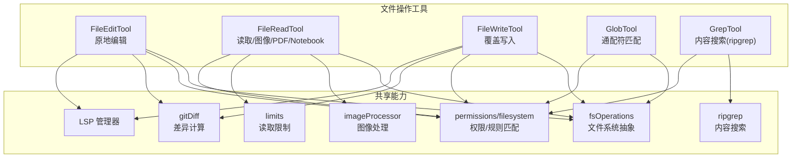
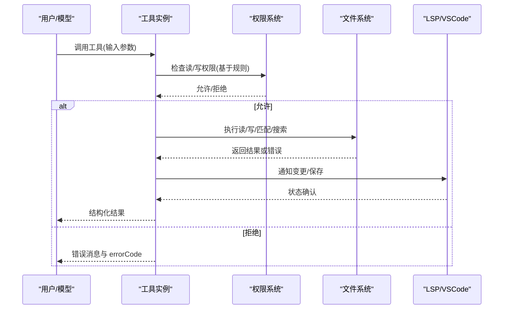
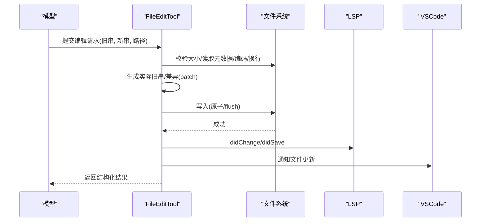
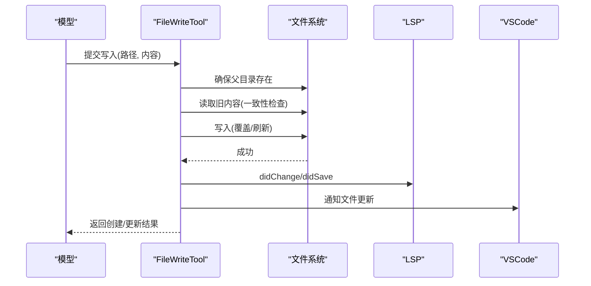
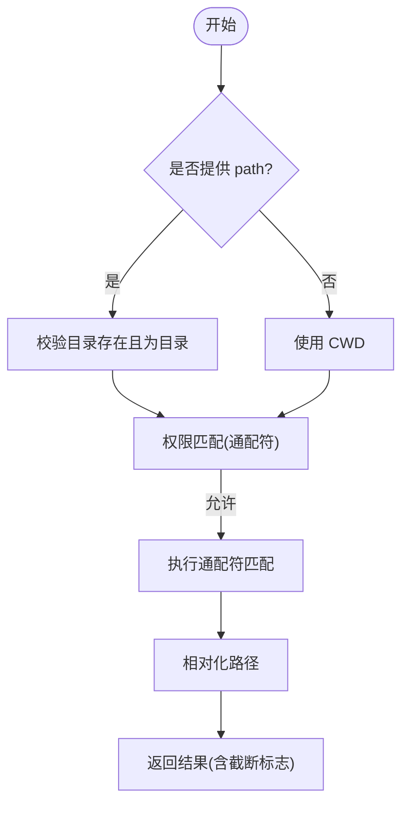
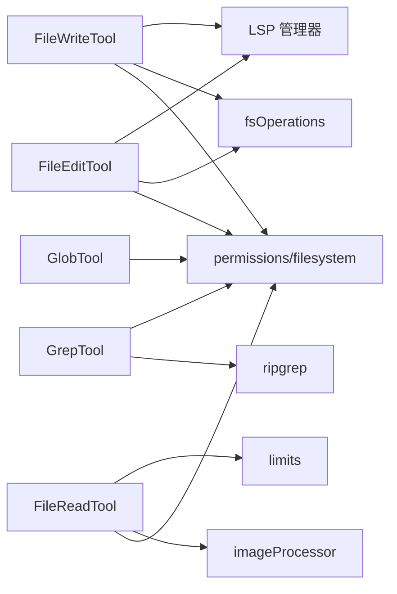

# 文件操作工具

<cite>
**本文引用的文件**
- [src/tools/FileEditTool/FileEditTool.ts](file://src/tools/FileEditTool/FileEditTool.ts)
- [src/tools/FileReadTool/FileReadTool.ts](file://src/tools/FileReadTool/FileReadTool.ts)
- [src/tools/FileWriteTool/FileWriteTool.ts](file://src/tools/FileWriteTool/FileWriteTool.ts)
- [src/tools/GlobTool/GlobTool.ts](file://src/tools/GlobTool/GlobTool.ts)
- [src/tools/GrepTool/GrepTool.ts](file://src/tools/GrepTool/GrepTool.ts)
- [src/tools/FileReadTool/imageProcessor.ts](file://src/tools/FileReadTool/imageProcessor.ts)
- [src/tools/FileReadTool/limits.ts](file://src/tools/FileReadTool/limits.ts)
- [src/tools/FileReadTool/prompt.ts](file://src/tools/FileReadTool/prompt.ts)
- [src/tools/FileReadTool/UI.tsx](file://src/tools/FileReadTool/UI.tsx)
- [src/tools/FileEditTool/constants.ts](file://src/tools/FileEditTool/constants.ts)
- [src/tools/FileEditTool/prompt.ts](file://src/tools/FileEditTool/prompt.ts)
- [src/tools/FileEditTool/types.ts](file://src/tools/FileEditTool/types.ts)
- [src/tools/FileEditTool/utils.ts](file://src/tools/FileEditTool/utils.ts)
- [src/tools/FileEditTool/UI.tsx](file://src/tools/FileEditTool/UI.tsx)
- [src/tools/FileWriteTool/prompt.ts](file://src/tools/FileWriteTool/prompt.ts)
- [src/tools/FileWriteTool/UI.tsx](file://src/tools/FileWriteTool/UI.tsx)
- [src/tools/GlobTool/prompt.ts](file://src/tools/GlobTool/prompt.ts)
- [src/tools/GlobTool/UI.tsx](file://src/tools/GlobTool/UI.tsx)
- [src/tools/GrepTool/prompt.ts](file://src/tools/GrepTool/prompt.ts)
- [src/tools/GrepTool/UI.tsx](file://src/tools/GrepTool/UI.tsx)
</cite>

## 目录
1. [简介](#简介)
2. [项目结构](#项目结构)
3. [核心组件](#核心组件)
4. [架构总览](#架构总览)
5. [详细组件分析](#详细组件分析)
6. [依赖关系分析](#依赖关系分析)
7. [性能考量](#性能考量)
8. [故障排查指南](#故障排查指南)
9. [结论](#结论)
10. [附录](#附录)

## 简介
本文件面向“文件操作工具”的使用者与维护者，系统性梳理以下五大工具的能力边界与实现要点：
- FileEditTool：文件原地编辑（替换字符串），支持差异生成、权限校验、路径与时间戳一致性检查、笔记文件保护等。
- FileReadTool：文件读取，支持文本、图片、PDF、Jupyter Notebook、分页提取；具备令牌上限与大小限制、设备文件阻断、macOS 截图兼容、会话文件识别与去重等。
- FileWriteTool：文件覆盖写入，支持原子性写入、LSP 通知、VSCode 差异提示、历史备份、Git Diff 记录等。
- GlobTool：基于通配符的文件名匹配，支持目录合法性校验与结果相对化。
- GrepTool：基于 ripgrep 的内容搜索，支持正则、上下文、大小写不敏感、类型过滤、计数模式、分页与限流。

同时，文档涵盖权限控制、路径验证、文件大小限制、图像处理能力，并提供批量处理方法与性能优化建议，解释差异显示、搜索模式与结果高亮策略。

## 项目结构
五大工具均位于 src/tools 下，采用“工具定义 + 输入输出 Schema + 提示词 + UI 渲染”的模块化组织方式。FileReadTool 还包含图像处理与读取限制模块；FileEditTool 与 FileWriteTool 共享 diff、历史记录与 LSP 通知等基础设施。

图表来源
- [src/tools/FileEditTool/FileEditTool.ts](file://src/tools/FileEditTool/FileEditTool.ts)
- [src/tools/FileReadTool/FileReadTool.ts](file://src/tools/FileReadTool/FileReadTool.ts)
- [src/tools/FileWriteTool/FileWriteTool.ts](file://src/tools/FileWriteTool/FileWriteTool.ts)
- [src/tools/GlobTool/GlobTool.ts](file://src/tools/GlobTool/GlobTool.ts)
- [src/tools/GrepTool/GrepTool.ts](file://src/tools/GrepTool/GrepTool.ts)

章节来源
- [src/tools/FileEditTool/FileEditTool.ts](file://src/tools/FileEditTool/FileEditTool.ts)
- [src/tools/FileReadTool/FileReadTool.ts](file://src/tools/FileReadTool/FileReadTool.ts)
- [src/tools/FileWriteTool/FileWriteTool.ts](file://src/tools/FileWriteTool/FileWriteTool.ts)
- [src/tools/GlobTool/GlobTool.ts](file://src/tools/GlobTool/GlobTool.ts)
- [src/tools/GrepTool/GrepTool.ts](file://src/tools/GrepTool/GrepTool.ts)

## 核心组件
- FileEditTool：以“旧串→新串”替换为核心，严格校验路径、权限、文件存在性与时间戳一致性，生成结构化差异并通知 LSP/VSCode。
- FileReadTool：统一读取入口，按扩展名分流到文本、图像、PDF、Notebook；内置令牌与大小限制、设备文件阻断、macOS 截图兼容、会话文件识别与重复读取去重。
- FileWriteTool：全量内容覆盖写入，确保父目录存在与原子写入，更新 LSP/VSCode，记录历史与 Git Diff。
- GlobTool：对路径进行合法性校验（存在且为目录），执行通配符匹配，返回相对化路径列表。
- GrepTool：封装 ripgrep 参数，支持多种输出模式、上下文、大小写不敏感、类型过滤、计数模式与分页。

章节来源
- [src/tools/FileEditTool/FileEditTool.ts](file://src/tools/FileEditTool/FileEditTool.ts)
- [src/tools/FileReadTool/FileReadTool.ts](file://src/tools/FileReadTool/FileReadTool.ts)
- [src/tools/FileWriteTool/FileWriteTool.ts](file://src/tools/FileWriteTool/FileWriteTool.ts)
- [src/tools/GlobTool/GlobTool.ts](file://src/tools/GlobTool/GlobTool.ts)
- [src/tools/GrepTool/GrepTool.ts](file://src/tools/GrepTool/GrepTool.ts)

## 架构总览
五大工具均通过 buildTool 构建，遵循统一的输入/输出 Schema、权限校验、路径展开、只读/并发安全标记与 UI 渲染接口。FileReadTool 在读取时可触发技能目录发现与激活；FileEditTool 与 FileWriteTool 在写入前后与 LSP/VSCode 同步状态。

图表来源
- [src/tools/FileEditTool/FileEditTool.ts](file://src/tools/FileEditTool/FileEditTool.ts)
- [src/tools/FileReadTool/FileReadTool.ts](file://src/tools/FileReadTool/FileReadTool.ts)
- [src/tools/FileWriteTool/FileWriteTool.ts](file://src/tools/FileWriteTool/FileWriteTool.ts)
- [src/tools/GlobTool/GlobTool.ts](file://src/tools/GlobTool/GlobTool.ts)
- [src/tools/GrepTool/GrepTool.ts](file://src/tools/GrepTool/GrepTool.ts)

## 详细组件分析

### FileEditTool（文件编辑）
- 功能要点
  - 基于“旧串→新串”替换，支持 replace_all 控制是否全部替换。
  - 权限：基于通配符规则匹配文件路径，拒绝 deny 规则；UNC 路径跳过文件系统操作以避免凭据泄露。
  - 安全与一致性：禁止编辑 .ipynb；校验文件未被外部修改（时间戳与内容双重保障）；空 old_string 仅在空文件场景有效。
  - 编码与换行：自动检测 UTF-16 LE，统一换行为 LF；保留文件换行风格。
  - 输出：结构化差异（patch）、原始文件内容、是否用户修改、Git Diff（可选）。
  - 集成：LSP didChange/didSave、VSCode 文件更新通知、文件历史备份、行数变化统计与事件日志。
- 关键流程（调用链）

图表来源
- [src/tools/FileEditTool/FileEditTool.ts](file://src/tools/FileEditTool/FileEditTool.ts)

- 差异显示与高亮
  - 使用结构化 patch 展示增删行；行数变化统计用于指标追踪。
  - 可选 Git Diff 记录，便于远程环境下的可视化对比。
- 批量处理建议
  - 将多次编辑合并为单次调用，减少 LSP 通知与磁盘写入次数。
  - 对大文件使用 replace_all 并配合上下文定位，避免多处匹配导致的不确定性。
- 示例（路径参考）
  - 输入校验与拒绝逻辑：[src/tools/FileEditTool/FileEditTool.ts](file://src/tools/FileEditTool/FileEditTool.ts)
  - 写入与 LSP/VSCode 通知：[src/tools/FileEditTool/FileEditTool.ts](file://src/tools/FileEditTool/FileEditTool.ts)
  - 工具描述与 UI：[src/tools/FileEditTool/prompt.ts](file://src/tools/FileEditTool/prompt.ts)，[src/tools/FileEditTool/UI.tsx](file://src/tools/FileEditTool/UI.tsx)

章节来源
- [src/tools/FileEditTool/FileEditTool.ts](file://src/tools/FileEditTool/FileEditTool.ts)
- [src/tools/FileEditTool/prompt.ts](file://src/tools/FileEditTool/prompt.ts)
- [src/tools/FileEditTool/UI.tsx](file://src/tools/FileEditTool/UI.tsx)
- [src/tools/FileEditTool/types.ts](file://src/tools/FileEditTool/types.ts)
- [src/tools/FileEditTool/utils.ts](file://src/tools/FileEditTool/utils.ts)
- [src/tools/FileEditTool/constants.ts](file://src/tools/FileEditTool/constants.ts)

### FileReadTool（文件读取）
- 功能要点
  - 支持文本、图像、PDF、Notebook、分页提取五种输出类型。
  - 令牌与大小限制：根据扩展名估算 token 数，必要时通过 API 重新计数；超过阈值抛出 MaxFileReadTokenExceededError。
  - 设备文件阻断：对 /dev/zero/random/urandom 等阻断，避免无限输出或阻塞。
  - macOS 截图兼容：尝试替代空格字符（常规空格与窄空格）以命中不同版本的命名。
  - 会话文件识别：识别 ~/.claude 下的会话记忆与转录文件，附加新鲜度前缀。
  - 去重：若同一范围且 mtime 未变，直接返回“文件未更改”占位，节省缓存开销。
  - 图像处理：支持缩放、降采样与压缩，按 token 限额调整尺寸；返回 base64 与维度信息。
- 关键流程（文本/图像/PDF/Notebook 分支）

图表来源
- [src/tools/FileReadTool/FileReadTool.ts](file://src/tools/FileReadTool/FileReadTool.ts)

- 图像处理能力
  - 自动检测格式，按需缩放与降采样，保证输出尺寸与 MIME 类型一致；返回原始尺寸与显示尺寸，便于坐标映射。
- 批量处理建议
  - 使用 offset/limit 或 pages 参数分段读取，避免一次性读取超大文件。
  - 对图像/PDF 使用分页提取，降低 token 压力。
- 示例（路径参考）
  - 令牌与大小限制：[src/tools/FileReadTool/FileReadTool.ts](file://src/tools/FileReadTool/FileReadTool.ts)
  - 图像处理与尺寸信息：[src/tools/FileReadTool/imageProcessor.ts](file://src/tools/FileReadTool/imageProcessor.ts)
  - 读取限制配置：[src/tools/FileReadTool/limits.ts](file://src/tools/FileReadTool/limits.ts)
  - 工具描述与 UI：[src/tools/FileReadTool/prompt.ts](file://src/tools/FileReadTool/prompt.ts)，[src/tools/FileReadTool/UI.tsx](file://src/tools/FileReadTool/UI.tsx)

章节来源
- [src/tools/FileReadTool/FileReadTool.ts](file://src/tools/FileReadTool/FileReadTool.ts)
- [src/tools/FileReadTool/imageProcessor.ts](file://src/tools/FileReadTool/imageProcessor.ts)
- [src/tools/FileReadTool/limits.ts](file://src/tools/FileReadTool/limits.ts)
- [src/tools/FileReadTool/prompt.ts](file://src/tools/FileReadTool/prompt.ts)
- [src/tools/FileReadTool/UI.tsx](file://src/tools/FileReadTool/UI.tsx)

### FileWriteTool（文件写入）
- 功能要点
  - 全量内容覆盖写入，确保父目录存在与原子写入；写入后立即通知 LSP 与 VSCode。
  - 一致性检查：与 FileReadTool 相同的 mtime 与内容一致性校验，防止并发修改导致的数据不一致。
  - 历史与差异：启用文件历史时记录预写入备份；可选 Git Diff。
  - 输出：区分“新建”与“更新”，返回结构化差异与原始内容。
- 关键流程（调用链）

图表来源
- [src/tools/FileWriteTool/FileWriteTool.ts](file://src/tools/FileWriteTool/FileWriteTool.ts)

- 批量处理建议
  - 合并多次写入为一次调用，减少 LSP 通知与磁盘写入。
  - 大文件写入优先使用 FileReadTool 分段读取后再写入，避免一次性超大内容。
- 示例（路径参考）
  - 输入校验与拒绝逻辑：[src/tools/FileWriteTool/FileWriteTool.ts](file://src/tools/FileWriteTool/FileWriteTool.ts)
  - 写入与 LSP/VSCode 通知：[src/tools/FileWriteTool/FileWriteTool.ts](file://src/tools/FileWriteTool/FileWriteTool.ts)
  - 工具描述与 UI：[src/tools/FileWriteTool/prompt.ts](file://src/tools/FileWriteTool/prompt.ts)，[src/tools/FileWriteTool/UI.tsx](file://src/tools/FileWriteTool/UI.tsx)

章节来源
- [src/tools/FileWriteTool/FileWriteTool.ts](file://src/tools/FileWriteTool/FileWriteTool.ts)
- [src/tools/FileWriteTool/prompt.ts](file://src/tools/FileWriteTool/prompt.ts)
- [src/tools/FileWriteTool/UI.tsx](file://src/tools/FileWriteTool/UI.tsx)

### GlobTool（文件匹配模式）
- 功能要点
  - 通配符匹配文件名，默认当前工作目录；可选指定搜索目录（必须为目录）。
  - 结果相对化（相对于 CWD），避免 token 浪费；支持最多 100 条结果截断提示。
  - 权限：基于通配符规则匹配 pattern，拒绝 deny 规则。
- 关键流程（调用链）

图表来源
- [src/tools/GlobTool/GlobTool.ts](file://src/tools/GlobTool/GlobTool.ts)

- 批量处理建议
  - 使用更具体的 pattern 或 path 缩小搜索范围，避免过多结果。
- 示例（路径参考）
  - 输入校验与拒绝逻辑：[src/tools/GlobTool/GlobTool.ts](file://src/tools/GlobTool/GlobTool.ts)
  - 工具描述与 UI：[src/tools/GlobTool/prompt.ts](file://src/tools/GlobTool/prompt.ts)，[src/tools/GlobTool/UI.tsx](file://src/tools/GlobTool/UI.tsx)

章节来源
- [src/tools/GlobTool/GlobTool.ts](file://src/tools/GlobTool/GlobTool.ts)
- [src/tools/GlobTool/prompt.ts](file://src/tools/GlobTool/prompt.ts)
- [src/tools/GlobTool/UI.tsx](file://src/tools/GlobTool/UI.tsx)

### GrepTool（文本搜索）
- 功能要点
  - 基于 ripgrep 的内容搜索，支持正则、大小写不敏感、上下文（-B/-A/-C/-n）、类型过滤（--type）、计数模式（-c）。
  - 输出模式：content（显示匹配行，支持 head_limit 与 offset）、files_with_matches（默认，显示文件路径）、count（显示每文件匹配数与总数）。
  - 限流与分页：默认 head_limit=250，offset 支持分页；未显式设为 0 时可能截断。
  - 忽略与排除：应用权限忽略模式、VCS 目录排除、插件孤儿版本目录排除。
- 关键流程（调用链）

图表来源
- [src/tools/GrepTool/GrepTool.ts](file://src/tools/GrepTool/GrepTool.ts)

- 搜索模式与结果高亮
  - content 模式支持 -n 显示行号与 -C 上下文；files_with_matches 默认按最近修改时间排序；count 模式汇总总数。
- 批量处理建议
  - 使用 -i、--type、glob 与 head_limit/offset 实现高效分页检索。
  - 对超大结果集谨慎使用 content 模式，优先 files_with_matches 再结合 FileReadTool 逐个读取。
- 示例（路径参考）
  - 输入校验与拒绝逻辑：[src/tools/GrepTool/GrepTool.ts](file://src/tools/GrepTool/GrepTool.ts)
  - 工具描述与 UI：[src/tools/GrepTool/prompt.ts](file://src/tools/GrepTool/prompt.ts)，[src/tools/GrepTool/UI.tsx](file://src/tools/GrepTool/UI.tsx)

章节来源
- [src/tools/GrepTool/GrepTool.ts](file://src/tools/GrepTool/GrepTool.ts)
- [src/tools/GrepTool/prompt.ts](file://src/tools/GrepTool/prompt.ts)
- [src/tools/GrepTool/UI.tsx](file://src/tools/GrepTool/UI.tsx)

## 依赖关系分析
- 工具间耦合
  - FileEditTool 与 FileWriteTool 共享 diff、历史记录与 LSP/VSCode 通知；GlobTool 与 GrepTool 在 UI 层复用渲染组件。
- 外部依赖
  - FileReadTool 依赖图像处理与 PDF 工具；GrepTool 依赖 ripgrep；GlobTool 依赖通配符引擎。
- 权限与路径
  - 统一通过 permissions/filesystem 与 shellRuleMatching 进行规则匹配与拒绝控制；路径展开与相对化由 path 工具完成。

图表来源
- [src/tools/FileEditTool/FileEditTool.ts](file://src/tools/FileEditTool/FileEditTool.ts)
- [src/tools/FileWriteTool/FileWriteTool.ts](file://src/tools/FileWriteTool/FileWriteTool.ts)
- [src/tools/FileReadTool/FileReadTool.ts](file://src/tools/FileReadTool/FileReadTool.ts)
- [src/tools/GlobTool/GlobTool.ts](file://src/tools/GlobTool/GlobTool.ts)
- [src/tools/GrepTool/GrepTool.ts](file://src/tools/GrepTool/GrepTool.ts)

章节来源
- [src/tools/FileEditTool/FileEditTool.ts](file://src/tools/FileEditTool/FileEditTool.ts)
- [src/tools/FileWriteTool/FileWriteTool.ts](file://src/tools/FileWriteTool/FileWriteTool.ts)
- [src/tools/FileReadTool/FileReadTool.ts](file://src/tools/FileReadTool/FileReadTool.ts)
- [src/tools/GlobTool/GlobTool.ts](file://src/tools/GlobTool/GlobTool.ts)
- [src/tools/GrepTool/GrepTool.ts](file://src/tools/GrepTool/GrepTool.ts)

## 性能考量
- 令牌与大小限制
  - FileReadTool 对超大文件进行令牌估算与 API 二次计数，避免超出模型上下文阈值；建议分段读取或使用 GrepTool 先筛选再读取。
- 通配符与搜索范围
  - GlobTool/GrepTool 限制最大结果数量（默认 100），并通过 head_limit/offset 实现分页；合理设置 glob 与 --type 减少扫描范围。
- 去重与缓存
  - FileReadTool 在相同范围且 mtime 不变时返回“文件未更改”占位，减少重复传输；建议在对话中复用已读取范围。
- 并发与原子性
  - FileEditTool/FileWriteTool 在写入前后保持严格的原子性与一致性检查，避免并发写入导致的数据不一致。
- WSL 性能
  - GrepTool 对 WSL 的文件读取性能有明显影响，超时由 ripgrep 自身处理，避免中断代理循环。

[本节为通用性能建议，无需特定文件引用]

## 故障排查指南
- 文件不存在/路径错误
  - FileEditTool/GlobTool/GrepTool 在路径不存在时提供“是否接近 CWD”与“相似文件”建议；FileReadTool 对 macOS 截图尝试替代空格字符。
- 权限被拒绝
  - 统一通过 matchingRuleForInput 检测 deny 规则；UNC 路径在权限阶段即跳过文件系统操作，避免凭据泄露风险。
- 文件过大/令牌超限
  - FileReadTool 抛出 MaxFileReadTokenExceededError；建议使用 offset/limit 或 pages 分段读取。
- 文件被外部修改
  - FileEditTool/FileWriteTool 在写入前检查 mtime 与内容一致性；若不一致，提示先读取最新内容。
- 图像/PDF 读取异常
  - FileReadTool 的图像处理包含缩放与降采样；PDF 提供分页提取选项；如出现异常，检查 MIME 类型与原始尺寸。
- 搜索无结果/超时
  - GrepTool 对 WSL 存在性能退化与超时；建议缩小搜索范围、使用 --type 与 glob、或增加 head_limit/offset 分页。

章节来源
- [src/tools/FileEditTool/FileEditTool.ts](file://src/tools/FileEditTool/FileEditTool.ts)
- [src/tools/FileReadTool/FileReadTool.ts](file://src/tools/FileReadTool/FileReadTool.ts)
- [src/tools/FileWriteTool/FileWriteTool.ts](file://src/tools/FileWriteTool/FileWriteTool.ts)
- [src/tools/GlobTool/GlobTool.ts](file://src/tools/GlobTool/GlobTool.ts)
- [src/tools/GrepTool/GrepTool.ts](file://src/tools/GrepTool/GrepTool.ts)

## 结论
五大文件操作工具围绕“安全、可控、可观测”的设计目标构建：统一的权限与路径校验、严格的文件一致性检查、灵活的输出模式与分页策略、以及与 LSP/VSCode 的深度集成。通过合理组合使用（先搜索/匹配，再读取/编辑/写入），可在保证安全的前提下高效完成复杂的文件操作任务。

[本节为总结性内容，无需特定文件引用]

## 附录
- 最佳实践清单
  - 先 glob/grep 再 read/edit/write，避免全量扫描。
  - 使用 head_limit/offset 与 pages 控制输出规模。
  - 对大文件优先 content 模式分页，再按需读取完整内容。
  - 编辑前确保文件未被外部修改，必要时先 read 再 edit。
  - 图像/PDF 优先分页提取，降低 token 压力。
  - 在 WSL 环境下谨慎使用 content 模式，优先 files_with_matches。

[本节为通用建议，无需特定文件引用]