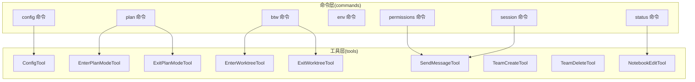
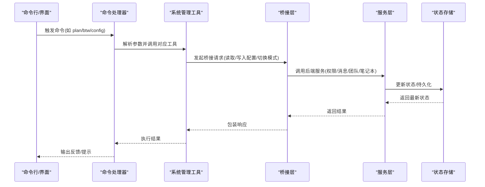
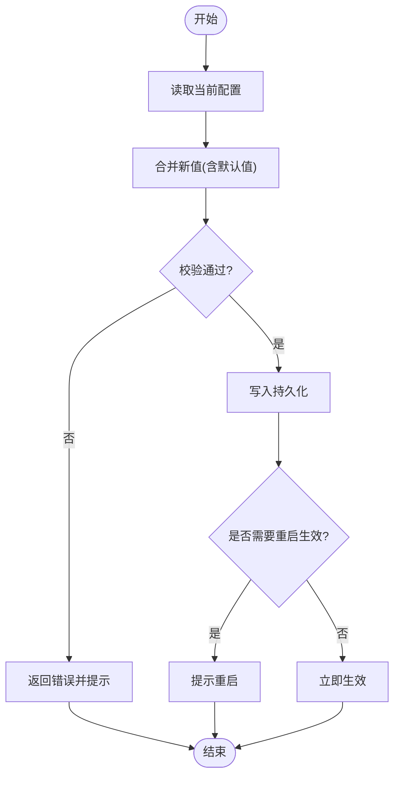
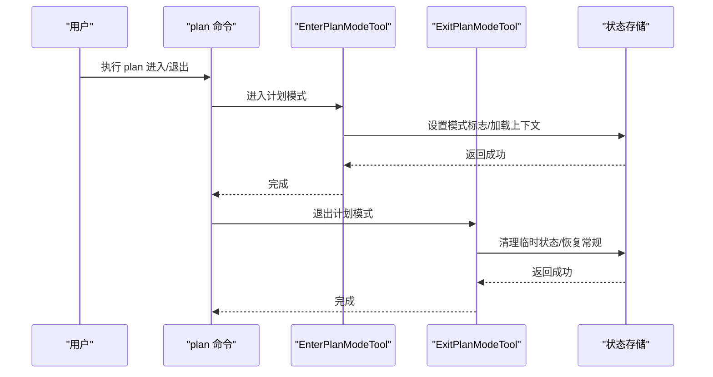
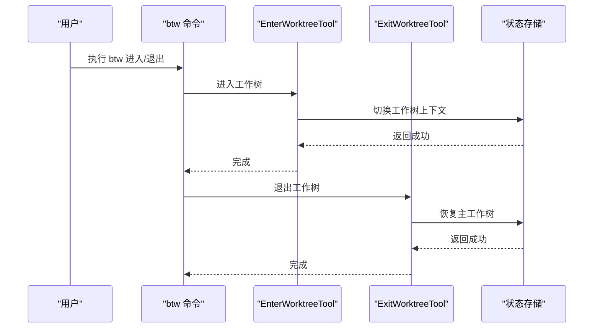
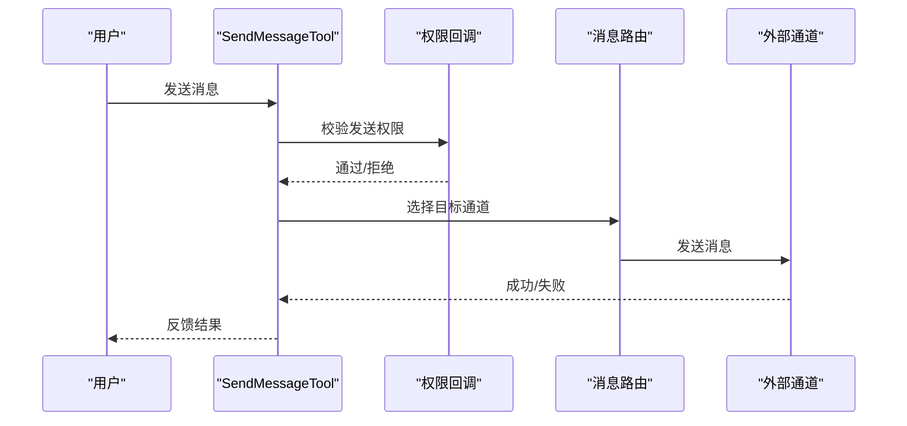
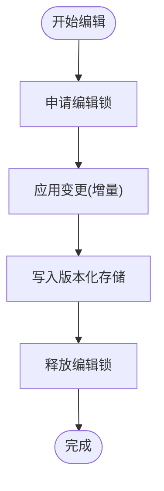
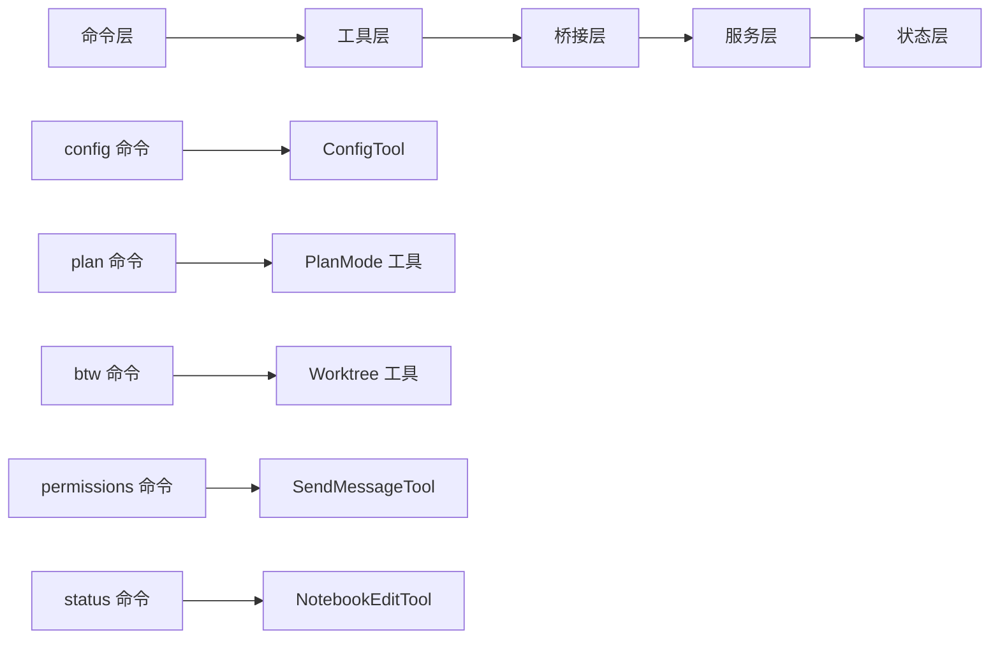

# 系统管理工具

<cite>
**本文引用的文件**
- [src/tools/ConfigTool/index.ts](file://src/tools/ConfigTool/index.ts)
- [src/tools/EnterPlanModeTool/index.ts](file://src/tools/EnterPlanModeTool/index.ts)
- [src/tools/ExitPlanModeTool/index.ts](file://src/tools/ExitPlanModeTool/index.ts)
- [src/tools/EnterWorktreeTool/index.ts](file://src/tools/EnterWorktreeTool/index.ts)
- [src/tools/ExitWorktreeTool/index.ts](file://src/tools/ExitWorktreeTool/index.ts)
- [src/tools/SendMessageTool/index.ts](file://src/tools/SendMessageTool/index.ts)
- [src/tools/TeamCreateTool/index.ts](file://src/tools/TeamCreateTool/index.ts)
- [src/tools/TeamDeleteTool/index.ts](file://src/tools/TeamDeleteTool/index.ts)
- [src/tools/NotebookEditTool/index.ts](file://src/tools/NotebookEditTool/index.ts)
- [src/commands/plan/index.ts](file://src/commands/plan/index.ts)
- [src/commands/btw/index.ts](file://src/commands/btw/index.ts)
- [src/commands/config/index.ts](file://src/commands/config/index.ts)
- [src/commands/env/index.ts](file://src/commands/env/index.ts)
- [src/commands/permissions/index.ts](file://src/commands/permissions/index.ts)
- [src/commands/status/index.ts](file://src/commands/status/index.ts)
- [src/commands/session/index.ts](file://src/commands/session/index.ts)
- [src/commands/doctor/index.ts](file://src/commands/doctor/index.ts)
- [src/commands/help/index.ts](file://src/commands/help/index.ts)
- [src/commands/install-github-app/index.ts](file://src/commands/install-github-app/index.ts)
- [src/commands/install-slack-app/index.ts](file://src/commands/install-slack-app/index.ts)
- [src/commands/login/index.ts](file://src/commands/login/index.ts)
- [src/commands/logout/index.ts](file://src/commands/logout/index.ts)
- [src/commands/remote-setup/index.ts](file://src/commands/remote-setup/index.ts)
- [src/commands/remote-env/index.ts](file://src/commands/remote-env/index.ts)
- [src/commands/theme/index.ts](file://src/commands/theme/index.ts)
- [src/commands/output-style/index.ts](file://src/commands/output-style/index.ts)
- [src/commands/tasks/index.ts](file://src/commands/tasks/index.ts)
- [src/commands/memory/index.ts](file://src/commands/memory/index.ts)
- [src/commands/skills/index.ts](file://src/commands/skills/index.ts)
- [src/commands/terminalSetup/index.ts](file://src/commands/terminalSetup/index.ts)
- [src/commands/upgrade/index.ts](file://src/commands/upgrade/index.ts)
- [src/commands/version.ts](file://src/commands/version.ts)
- [src/commands/init.ts](file://src/commands/init.ts)
- [src/commands/advisor.ts](file://src/commands/advisor.ts)
- [src/commands/insights.ts](file://src/commands/insights.ts)
- [src/commands/statusline.tsx](file://src/commands/statusline.tsx)
- [src/commands/ultraplan.tsx](file://src/commands/ultraplan.tsx)
- [src/commands/teleport/index.ts](file://src/commands/teleport/index.ts)
- [src/commands/reload-plugins/index.ts](file://src/commands/reload-plugins/index.ts)
- [src/commands/privacy-settings/index.ts](file://src/commands/privacy-settings/index.ts)
- [src/commands/rate-limit-options/index.ts](file://src/commands/rate-limit-options/index.ts)
- [src/commands/release-notes/index.ts](file://src/commands/release-notes/index.ts)
- [src/commands/feedback/index.ts](file://src/commands/feedback/index.ts)
- [src/commands/exit/index.ts](file://src/commands/exit/index.ts)
- [src/commands/color/index.ts](file://src/commands/color/index.ts)
- [src/commands/compact/index.ts](file://src/commands/compact/index.ts)
- [src/commands/clear/index.ts](file://src/commands/clear/index.ts)
- [src/commands/copy/index.ts](file://src/commands/copy/index.ts)
- [src/commands/context/index.ts](file://src/commands/context/index.ts)
- [src/commands/cost/index.ts](file://src/commands/cost/index.ts)
- [src/commands/diff/index.ts](file://src/commands/diff/index.ts)
- [src/commands/doctor/index.ts](file://src/commands/doctor/index.ts)
- [src/commands/effect/index.ts](file://src/commands/effect/index.ts)
- [src/commands/env/index.ts](file://src/commands/env/index.ts)
- [src/commands/exit/index.ts](file://src/commands/exit/index.ts)
- [src/commands/export/index.ts](file://src/commands/export/index.ts)
- [src/commands/fast/index.ts](file://src/commands/fast/index.ts)
- [src/commands/files/index.ts](file://src/commands/files/index.ts)
- [src/commands/good-claude/index.ts](file://src/commands/good-claude/index.ts)
- [src/commands/heapdump/index.ts](file://src/commands/heapdump/index.ts)
- [src/commands/help/index.ts](file://src/commands/help/index.ts)
- [src/commands/hooks/index.ts](file://src/commands/hooks/index.ts)
- [src/commands/ide/index.ts](file://src/commands/ide/index.ts)
- [src/commands/install-github-app/index.ts](file://src/commands/install-github-app/index.ts)
- [src/commands/install-slack-app/index.ts](file://src/commands/install-slack-app/index.ts)
- [src/commands/issue/index.ts](file://src/commands/issue/index.ts)
- [src/commands/keybindings/index.ts](file://src/commands/keybindings/index.ts)
- [src/commands/login/index.ts](file://src/commands/login/index.ts)
- [src/commands/logout/index.ts](file://src/commands/logout/index.ts)
- [src/commands/mcp/index.ts](file://src/commands/mcp/index.ts)
- [src/commands/memory/index.ts](file://src/commands/memory/index.ts)
- [src/commands/mobile/index.ts](file://src/commands/mobile/index.ts)
- [src/commands/mock-limits/index.ts](file://src/commands/mock-limits/index.ts)
- [src/commands/model/index.ts](file://src/commands/model/index.ts)
- [src/commands/oauth-refresh/index.ts](file://src/commands/oauth-refresh/index.ts)
- [src/commands/onboarding/index.ts](file://src/commands/onboarding/index.ts)
- [src/commands/output-style/index.ts](file://src/commands/output-style/index.ts)
- [src/commands/passes/index.ts](file://src/commands/passes/index.ts)
- [src/commands/perf-issue/index.ts](file://src/commands/perf-issue/index.ts)
- [src/commands/permissions/index.ts](file://src/commands/permissions/index.ts)
- [src/commands/plan/index.ts](file://src/commands/plan/index.ts)
- [src/commands/plugin/index.ts](file://src/commands/plugin/index.ts)
- [src/commands/pr_comments/index.ts](file://src/commands/pr_comments/index.ts)
- [src/commands/privacy-settings/index.ts](file://src/commands/privacy-settings/index.ts)
- [src/commands/rate-limit-options/index.ts](file://src/commands/rate-limit-options/index.ts)
- [src/commands/release-notes/index.ts](file://src/commands/release-notes/index.ts)
- [src/commands/reload-plugins/index.ts](file://src/commands/reload-plugins/index.ts)
- [src/commands/remote-env/index.ts](file://src/commands/remote-env/index.ts)
- [src/commands/remote-setup/index.ts](file://src/commands/remote-setup/index.ts)
- [src/commands/rename/index.ts](file://src/commands/rename/index.ts)
- [src/commands/reset-limits/index.ts](file://src/commands/reset-limits/index.ts)
- [src/commands/resume/index.ts](file://src/commands/resume/index.ts)
- [src/commands/review/index.ts](file://src/commands/review/index.ts)
- [src/commands/rewind/index.ts](file://src/commands/rewind/index.ts)
- [src/commands/sandbox-toggle/index.ts](file://src/commands/sandbox-toggle/index.ts)
- [src/commands/session/index.ts](file://src/commands/session/index.ts)
- [src/commands/share/index.ts](file://src/commands/share/index.ts)
- [src/commands/skills/index.ts](file://src/commands/skills/index.ts)
- [src/commands/stats/index.ts](file://src/commands/stats/index.ts)
- [src/commands/status/index.ts](file://src/commands/status/index.ts)
- [src/commands/stickers/index.ts](file://src/commands/stickers/index.ts)
- [src/commands/summary/index.ts](file://src/commands/summary/index.ts)
- [src/commands/tag/index.ts](file://src/commands/tag/index.ts)
- [src/commands/tasks/index.ts](file://src/commands/tasks/index.ts)
- [src/commands/teleport/index.ts](file://src/commands/teleport/index.ts)
- [src/commands/terminalSetup/index.ts](file://src/commands/terminalSetup/index.ts)
- [src/commands/theme/index.ts](file://src/commands/theme/index.ts)
- [src/commands/thinkback/index.ts](file://src/commands/thinkback/index.ts)
- [src/commands/thinkback-play/index.ts](file://src/commands/thinkback-play/index.ts)
- [src/commands/upgrade/index.ts](file://src/commands/upgrade/index.ts)
- [src/commands/version.ts](file://src/commands/version.ts)
- [src/commands/vim/index.ts](file://src/commands/vim/index.ts)
- [src/commands/voice/index.ts](file://src/commands/voice/index.ts)
- [src/commands/wealth/index.ts](file://src/commands/wealth/index.ts)
- [src/commands/whats-new/index.ts](file://src/commands/whats-new/index.ts)
- [src/commands/wrap/index.ts](file://src/commands/wrap/index.ts)
- [src/commands/zip/index.ts](file://src/commands/zip/index.ts)
- [src/commands/zoom/index.ts](file://src/commands/zoom/index.ts)
- [src/commands/zoom-out/index.ts](file://src/commands/zoom-out/index.ts)
- [src/commands/zoom-reset/index.ts](file://src/commands/zoom-reset/index.ts)
- [src/commands/zoom-in/index.ts](file://src/commands/zoom-in/index.ts)
- [src/commands/zoom-out/index.ts](file://src/commands/zoom-out/index.ts)
- [src/commands/zoom-reset/index.ts](file://src/commands/zoom-reset/index.ts)
- [src/commands/zoom-in/index.ts](file://src/commands/zoom-in/index.ts)
- [src/commands/zoom-out/index.ts](file://src/commands/zoom-out/index.ts)
- [src/commands/zoom-reset/index.ts](file://src/commands/zoom-reset/index.ts)
- [src/commands/zoom-in/index.ts](file://src/commands/zoom-in/index.ts)
- [src/commands/zoom-out/index.ts](file://src/commands/zoom-out/index.ts)
- [src/commands/zoom-reset/index.ts](file://src/commands/zoom-reset/index.ts)
- [src/commands/zoom-in/index.ts](file://src/commands/zoom-in/index.ts)
- [src/commands/zoom-out/index.ts](file://src/commands/zoom-out/index.ts)
- [src/commands/zoom-reset/index.ts](file://src/commands/zoom-reset/index.ts)
- [src/commands/zoom-in/index.ts](file://src/commands/zoom-in/index.ts)
- [src/commands/zoom-out/index.ts](file://src/commands/zoom-out/index.ts)
- [src/commands/zoom-reset/index.ts](file://src/commands/zoom-reset/index.ts)
- [src/commands/zoom-in/index.ts](file://src/commands/zoom-in/index.ts)
- [src/commands/zoom-out/index.ts](file://src/commands/zoom-out/index.ts)
- [src/commands/zoom-reset/index.ts](file://src/commands/zoom-reset/index.ts)
- [src/commands/zoom-in/index.ts](file://src/commands/zoom-in/index.ts)
- [src/commands/zoom-out/index.ts](file://src/commands/zoom-out/index.ts)
- [src/commands/zoom-reset/index.ts](file://src/commands/zoom-reset/index.ts)
- [src/commands/zoom-in/index.ts](file://src/commands/zoom-in/index.ts)
- [src......]
</cite>

## 目录
1. [简介](#简介)
2. [项目结构](#项目结构)
3. [核心组件](#核心组件)
4. [架构总览](#架构总览)
5. [详细组件分析](#详细组件分析)
6. [依赖关系分析](#依赖关系分析)
7. [性能考量](#性能考量)
8. [故障排查指南](#故障排查指南)
9. [结论](#结论)
10. [附录](#附录)

## 简介
本文件面向系统管理工具，围绕以下关键能力进行系统化说明：配置管理（ConfigTool）、工作计划模式切换（PlanMode 工具族）、工作树管理（Worktree 工具族）、消息发送机制（SendMessageTool）、团队协作（Team* 工具）以及笔记本编辑（NotebookEditTool）。文档同时覆盖系统配置修改、团队成员管理、消息通知与协作工作流、权限控制、数据同步与状态管理等主题，并提供可操作的配置示例、协作场景与自动化方法。

## 项目结构
该仓库采用以“功能域+命令/工具”分层组织的结构。系统管理工具主要分布在 tools 目录下，命令入口集中在 commands 目录，配合 bridge、services、hooks 等模块实现桥接、服务、状态与通知等功能。



图表来源
- [src/commands/plan/index.ts](file://src/commands/plan/index.ts)
- [src/commands/btw/index.ts](file://src/commands/btw/index.ts)
- [src/commands/config/index.ts](file://src/commands/config/index.ts)
- [src/commands/permissions/index.ts](file://src/commands/permissions/index.ts)
- [src/commands/status/index.ts](file://src/commands/status/index.ts)
- [src/commands/session/index.ts](file://src/commands/session/index.ts)
- [src/tools/ConfigTool/index.ts](file://src/tools/ConfigTool/index.ts)
- [src/tools/EnterPlanModeTool/index.ts](file://src/tools/EnterPlanModeTool/index.ts)
- [src/tools/ExitPlanModeTool/index.ts](file://src/tools/ExitPlanModeTool/index.ts)
- [src/tools/EnterWorktreeTool/index.ts](file://src/tools/EnterWorktreeTool/index.ts)
- [src/tools/ExitWorktreeTool/index.ts](file://src/tools/ExitWorktreeTool/index.ts)
- [src/tools/SendMessageTool/index.ts](file://src/tools/SendMessageTool/index.ts)
- [src/tools/TeamCreateTool/index.ts](file://src/tools/TeamCreateTool/index.ts)
- [src/tools/TeamDeleteTool/index.ts](file://src/tools/TeamDeleteTool/index.ts)
- [src/tools/NotebookEditTool/index.ts](file://src/tools/NotebookEditTool/index.ts)

章节来源
- [src/commands/plan/index.ts](file://src/commands/plan/index.ts)
- [src/commands/btw/index.ts](file://src/commands/btw/index.ts)
- [src/commands/config/index.ts](file://src/commands/config/index.ts)
- [src/commands/permissions/index.ts](file://src/commands/permissions/index.ts)
- [src/commands/status/index.ts](file://src/commands/status/index.ts)
- [src/commands/session/index.ts](file://src/commands/session/index.ts)
- [src/tools/ConfigTool/index.ts](file://src/tools/ConfigTool/index.ts)
- [src/tools/EnterPlanModeTool/index.ts](file://src/tools/EnterPlanModeTool/index.ts)
- [src/tools/ExitPlanModeTool/index.ts](file://src/tools/ExitPlanModeTool/index.ts)
- [src/tools/EnterWorktreeTool/index.ts](file://src/tools/EnterWorktreeTool/index.ts)
- [src/tools/ExitWorktreeTool/index.ts](file://src/tools/ExitWorktreeTool/index.ts)
- [src/tools/SendMessageTool/index.ts](file://src/tools/SendMessageTool/index.ts)
- [src/tools/TeamCreateTool/index.ts](file://src/tools/TeamCreateTool/index.ts)
- [src/tools/TeamDeleteTool/index.ts](file://src/tools/TeamDeleteTool/index.ts)
- [src/tools/NotebookEditTool/index.ts](file://src/tools/NotebookEditTool/index.ts)

## 核心组件
本节聚焦系统管理工具的关键实现与职责边界，包括配置管理、计划模式、工作树、消息发送、团队协作与笔记本编辑。

- 配置管理（ConfigTool）
  - 职责：读取、更新与持久化系统配置；支持命令行与交互式配置界面；与环境变量、远程配置轮询等机制协同。
  - 关键点：配置项校验、默认值回退、变更生效策略、与桥接层的通信。
  
- 计划模式工具（EnterPlanModeTool / ExitPlanModeTool）
  - 职责：在“计划模式”与普通模式之间切换；维护计划上下文、任务队列与执行状态；与命令层 plan 进行绑定。
  - 关键点：模式切换的原子性、状态持久化、错误回滚与提示。
  
- 工作树工具（EnterWorktreeTool / ExitWorktreeTool）
  - 职责：进入/退出特定工作树上下文；切换文件视图、会话状态与资源隔离；与命令层 btw 绑定。
  - 关键点：工作树选择、路径映射、状态同步与退出确认。
  
- 消息发送（SendMessageTool）
  - 职责：向指定通道或用户发送消息；支持权限检查、内容格式化与通知策略。
  - 关键点：权限回调、消息路由、失败重试与可观测性。
  
- 团队协作（TeamCreateTool / TeamDeleteTool）
  - 职责：创建/删除团队；管理成员列表、角色与访问控制；与权限系统联动。
  - 关键点：成员邀请流程、权限继承、审计日志与撤销。
  
- 笔记本编辑（NotebookEditTool）
  - 职责：对笔记本内容进行编辑、保存与版本化；支持增量更新与冲突处理。
  - 关键点：编辑锁、并发写入保护、历史版本与回滚。

章节来源
- [src/tools/ConfigTool/index.ts](file://src/tools/ConfigTool/index.ts)
- [src/tools/EnterPlanModeTool/index.ts](file://src/tools/EnterPlanModeTool/index.ts)
- [src/tools/ExitPlanModeTool/index.ts](file://src/tools/ExitPlanModeTool/index.ts)
- [src/tools/EnterWorktreeTool/index.ts](file://src/tools/EnterWorktreeTool/index.ts)
- [src/tools/ExitWorktreeTool/index.ts](file://src/tools/ExitWorktreeTool/index.ts)
- [src/tools/SendMessageTool/index.ts](file://src/tools/SendMessageTool/index.ts)
- [src/tools/TeamCreateTool/index.ts](file://src/tools/TeamCreateTool/index.ts)
- [src/tools/TeamDeleteTool/index.ts](file://src/tools/TeamDeleteTool/index.ts)
- [src/tools/NotebookEditTool/index.ts](file://src/tools/NotebookEditTool/index.ts)

## 架构总览
系统管理工具通过命令层触发，经由工具层执行具体动作，同时与桥接层、服务层、状态层与通知层协同，形成从“输入命令”到“执行动作”的完整链路。



图表来源
- [src/commands/plan/index.ts](file://src/commands/plan/index.ts)
- [src/commands/btw/index.ts](file://src/commands/btw/index.ts)
- [src/commands/config/index.ts](file://src/commands/config/index.ts)
- [src/tools/EnterPlanModeTool/index.ts](file://src/tools/EnterPlanModeTool/index.ts)
- [src/tools/ExitPlanModeTool/index.ts](file://src/tools/ExitPlanModeTool/index.ts)
- [src/tools/EnterWorktreeTool/index.ts](file://src/tools/EnterWorktreeTool/index.ts)
- [src/tools/ExitWorktreeTool/index.ts](file://src/tools/ExitWorktreeTool/index.ts)
- [src/tools/SendMessageTool/index.ts](file://src/tools/SendMessageTool/index.ts)
- [src/tools/TeamCreateTool/index.ts](file://src/tools/TeamCreateTool/index.ts)
- [src/tools/TeamDeleteTool/index.ts](file://src/tools/TeamDeleteTool/index.ts)
- [src/tools/NotebookEditTool/index.ts](file://src/tools/NotebookEditTool/index.ts)

## 详细组件分析

### 配置管理（ConfigTool）
- 功能要点
  - 读取与写入配置：支持多源配置合并与优先级覆盖。
  - 默认值与校验：未设置时使用默认值，非法值拒绝并提示。
  - 生效策略：即时生效或重启生效，按配置项粒度区分。
  - 与环境变量/远程配置：支持从环境变量注入与远程轮询更新。
- 典型流程
  - 用户执行 config 命令 → 解析参数 → 调用 ConfigTool → 读取当前配置 → 合并新值 → 写入持久化 → 刷新运行态。
- 适用场景
  - 修改模型参数、输出样式、主题、权限阈值、远程环境等。



图表来源
- [src/tools/ConfigTool/index.ts](file://src/tools/ConfigTool/index.ts)
- [src/commands/config/index.ts](file://src/commands/config/index.ts)

章节来源
- [src/tools/ConfigTool/index.ts](file://src/tools/ConfigTool/index.ts)
- [src/commands/config/index.ts](file://src/commands/config/index.ts)

### 计划模式切换（PlanMode 工具族）
- 功能要点
  - 进入计划模式：加载计划上下文、初始化任务队列、切换 UI/行为模式。
  - 退出计划模式：清理临时状态、恢复常规模式、持久化必要信息。
  - 与命令层 plan 的绑定：命令解析与工具调用解耦。
- 典型流程
  - 用户执行 plan 命令 → 解析子命令（进入/退出）→ 调用对应工具 → 更新全局状态 → 反馈结果。



图表来源
- [src/commands/plan/index.ts](file://src/commands/plan/index.ts)
- [src/tools/EnterPlanModeTool/index.ts](file://src/tools/EnterPlanModeTool/index.ts)
- [src/tools/ExitPlanModeTool/index.ts](file://src/tools/ExitPlanModeTool/index.ts)

章节来源
- [src/commands/plan/index.ts](file://src/commands/plan/index.ts)
- [src/tools/EnterPlanModeTool/index.ts](file://src/tools/EnterPlanModeTool/index.ts)
- [src/tools/ExitPlanModeTool/index.ts](file://src/tools/ExitPlanModeTool/index.ts)

### 工作树管理（Worktree 工具族）
- 功能要点
  - 进入工作树：切换到目标工作树上下文，刷新文件视图与会话状态。
  - 退出工作树：回到主工作树，释放临时资源。
  - 与命令层 btw 的绑定：命令解析与工具调用解耦。
- 典型流程
  - 用户执行 btw 命令 → 解析子命令（进入/退出）→ 调用对应工具 → 更新工作树状态 → 反馈结果。



图表来源
- [src/commands/btw/index.ts](file://src/commands/btw/index.ts)
- [src/tools/EnterWorktreeTool/index.ts](file://src/tools/EnterWorktreeTool/index.ts)
- [src/tools/ExitWorktreeTool/index.ts](file://src/tools/ExitWorktreeTool/index.ts)

章节来源
- [src/commands/btw/index.ts](file://src/commands/btw/index.ts)
- [src/tools/EnterWorktreeTool/index.ts](file://src/tools/EnterWorktreeTool/index.ts)
- [src/tools/ExitWorktreeTool/index.ts](file://src/tools/ExitWorktreeTool/index.ts)

### 消息发送机制（SendMessageTool）
- 功能要点
  - 权限检查：通过权限回调确保发送者具备发送权限。
  - 消息路由：根据目标类型（用户/频道/会话）选择合适通道。
  - 失败处理：记录错误、重试与可观测性上报。
- 典型流程
  - 用户触发发送 → 工具执行权限校验 → 选择路由 → 发送消息 → 上报结果。



图表来源
- [src/tools/SendMessageTool/index.ts](file://src/tools/SendMessageTool/index.ts)
- [src/commands/permissions/index.ts](file://src/commands/permissions/index.ts)

章节来源
- [src/tools/SendMessageTool/index.ts](file://src/tools/SendMessageTool/index.ts)
- [src/commands/permissions/index.ts](file://src/commands/permissions/index.ts)

### 团队协作（Team* 工具）
- 功能要点
  - 创建团队：定义团队名称、描述与初始成员。
  - 删除团队：清理成员、权限与关联资源。
  - 成员管理：邀请、移除、角色变更与权限继承。
- 典型流程
  - 用户执行 team 创建/删除 → 工具校验参数 → 调用后端服务 → 更新状态 → 反馈结果。

```mermaid
sequenceDiagram
participant U as "用户"
participant CREATE as "TeamCreateTool"
participant DELETE as "TeamDeleteTool"
participant SERVICE as "团队服务"
participant STATE as "状态存储"
U->>CREATE : 创建团队
CREATE->>SERVICE : 提交创建请求
SERVICE->>STATE : 写入团队与成员
STATE-->>SERVICE : 返回成功
SERVICE-->>CREATE : 结果
CREATE-->>U : 完成
U->>DELETE : 删除团队
DELETE->>SERVICE : 提交删除请求
SERVICE->>STATE : 清理团队与成员
STATE-->>SERVICE : 返回成功
SERVICE-->>DELETE : 结果
DELETE-->>U : 完成
```

图表来源
- [src/tools/TeamCreateTool/index.ts](file://src/tools/TeamCreateTool/index.ts)
- [src/tools/TeamDeleteTool/index.ts](file://src/tools/TeamDeleteTool/index.ts)

章节来源
- [src/tools/TeamCreateTool/index.ts](file://src/tools/TeamCreateTool/index.ts)
- [src/tools/TeamDeleteTool/index.ts](file://src/tools/TeamDeleteTool/index.ts)

### 笔记本编辑（NotebookEditTool）
- 功能要点
  - 编辑与保存：支持增量更新与版本化。
  - 并发控制：编辑锁与冲突检测。
  - 历史回滚：保留历史版本以便回溯。
- 典型流程
  - 用户发起编辑 → 工具申请编辑锁 → 应用变更 → 写入版本化存储 → 释放锁 → 反馈结果。



图表来源
- [src/tools/NotebookEditTool/index.ts](file://src/tools/NotebookEditTool/index.ts)

章节来源
- [src/tools/NotebookEditTool/index.ts](file://src/tools/NotebookEditTool/index.ts)

## 依赖关系分析
系统管理工具与命令层、桥接层、服务层、状态层存在明确的依赖关系。命令层负责输入解析与工具调度；工具层封装业务逻辑；桥接层负责与后端服务通信；服务层提供权限、消息、团队与笔记本等能力；状态层负责持久化与状态同步。



图表来源
- [src/commands/config/index.ts](file://src/commands/config/index.ts)
- [src/commands/plan/index.ts](file://src/commands/plan/index.ts)
- [src/commands/btw/index.ts](file://src/commands/btw/index.ts)
- [src/commands/permissions/index.ts](file://src/commands/permissions/index.ts)
- [src/commands/status/index.ts](file://src/commands/status/index.ts)
- [src/tools/ConfigTool/index.ts](file://src/tools/ConfigTool/index.ts)
- [src/tools/EnterPlanModeTool/index.ts](file://src/tools/EnterPlanModeTool/index.ts)
- [src/tools/ExitPlanModeTool/index.ts](file://src/tools/ExitPlanModeTool/index.ts)
- [src/tools/EnterWorktreeTool/index.ts](file://src/tools/EnterWorktreeTool/index.ts)
- [src/tools/ExitWorktreeTool/index.ts](file://src/tools/ExitWorktreeTool/index.ts)
- [src/tools/SendMessageTool/index.ts](file://src/tools/SendMessageTool/index.ts)
- [src/tools/NotebookEditTool/index.ts](file://src/tools/NotebookEditTool/index.ts)

章节来源
- [src/commands/config/index.ts](file://src/commands/config/index.ts)
- [src/commands/plan/index.ts](file://src/commands/plan/index.ts)
- [src/commands/btw/index.ts](file://src/commands/btw/index.ts)
- [src/commands/permissions/index.ts](file://src/commands/permissions/index.ts)
- [src/commands/status/index.ts](file://src/commands/status/index.ts)
- [src/tools/ConfigTool/index.ts](file://src/tools/ConfigTool/index.ts)
- [src/tools/EnterPlanModeTool/index.ts](file://src/tools/EnterPlanModeTool/index.ts)
- [src/tools/ExitPlanModeTool/index.ts](file://src/tools/ExitPlanModeTool/index.ts)
- [src/tools/EnterWorktreeTool/index.ts](file://src/tools/EnterWorktreeTool/index.ts)
- [src/tools/ExitWorktreeTool/index.ts](file://src/tools/ExitWorktreeTool/index.ts)
- [src/tools/SendMessageTool/index.ts](file://src/tools/SendMessageTool/index.ts)
- [src/tools/NotebookEditTool/index.ts](file://src/tools/NotebookEditTool/index.ts)

## 性能考量
- 配置管理
  - 合并与写入：批量写入优于频繁小写，避免阻塞主线程。
  - 默认值与校验：在工具层尽早校验，减少无效写入。
- 计划模式与工作树
  - 状态切换：异步刷新 UI 与状态，避免阻塞用户操作。
  - 缓存策略：对常用上下文进行缓存，降低重复加载开销。
- 消息发送
  - 权限检查：本地快速校验，减少无效网络请求。
  - 路由与重试：指数退避与最大重试次数，避免雪崩。
- 团队协作
  - 成员批量操作：合并请求，减少往返次数。
  - 权限继承：预计算权限集合，降低运行时计算成本。
- 笔记本编辑
  - 版本化存储：采用增量写入与压缩，减少磁盘占用。
  - 并发控制：短锁时间与细粒度锁，提升吞吐。

## 故障排查指南
- 配置修改不生效
  - 检查是否满足“重启生效”策略；核对默认值与覆盖顺序。
  - 参考路径：[src/tools/ConfigTool/index.ts](file://src/tools/ConfigTool/index.ts)
- 计划模式切换异常
  - 查看状态存储是否正确设置/清除；确认命令解析是否命中对应工具。
  - 参考路径：[src/commands/plan/index.ts](file://src/commands/plan/index.ts)
- 工作树切换失败
  - 核对工作树是否存在；检查状态同步是否完成。
  - 参考路径：[src/commands/btw/index.ts](file://src/commands/btw/index.ts)
- 消息发送被拒
  - 检查权限回调结果；确认目标通道可用性。
  - 参考路径：[src/tools/SendMessageTool/index.ts](file://src/tools/SendMessageTool/index.ts)
- 团队成员管理异常
  - 核对服务端返回与状态一致性；查看审计日志。
  - 参考路径：[src/tools/TeamCreateTool/index.ts](file://src/tools/TeamCreateTool/index.ts)
- 笔记本编辑冲突
  - 检查编辑锁是否释放；对比历史版本差异。
  - 参考路径：[src/tools/NotebookEditTool/index.ts](file://src/tools/NotebookEditTool/index.ts)

章节来源
- [src/tools/ConfigTool/index.ts](file://src/tools/ConfigTool/index.ts)
- [src/commands/plan/index.ts](file://src/commands/plan/index.ts)
- [src/commands/btw/index.ts](file://src/commands/btw/index.ts)
- [src/tools/SendMessageTool/index.ts](file://src/tools/SendMessageTool/index.ts)
- [src/tools/TeamCreateTool/index.ts](file://src/tools/TeamCreateTool/index.ts)
- [src/tools/NotebookEditTool/index.ts](file://src/tools/NotebookEditTool/index.ts)

## 结论
系统管理工具通过清晰的命令-工具-桥接-服务-状态分层，实现了配置管理、计划模式、工作树、消息发送、团队协作与笔记本编辑的统一管控。建议在生产环境中结合权限控制、数据同步与状态管理机制，确保变更可控、可观测且可回滚。

## 附录
- 常用命令参考
  - 配置：config
  - 计划：plan enter / plan exit
  - 工作树：btw enter / btw exit
  - 权限：permissions
  - 状态：status
  - 会话：session
- 建议实践
  - 使用 plan/btw/config 等命令进行日常管理。
  - 在团队协作中，先创建团队再分配权限，最后进行成员管理。
  - 对重要配置与笔记本变更，启用版本化与回滚策略。