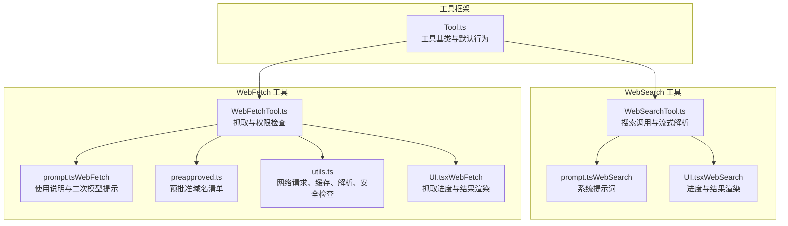
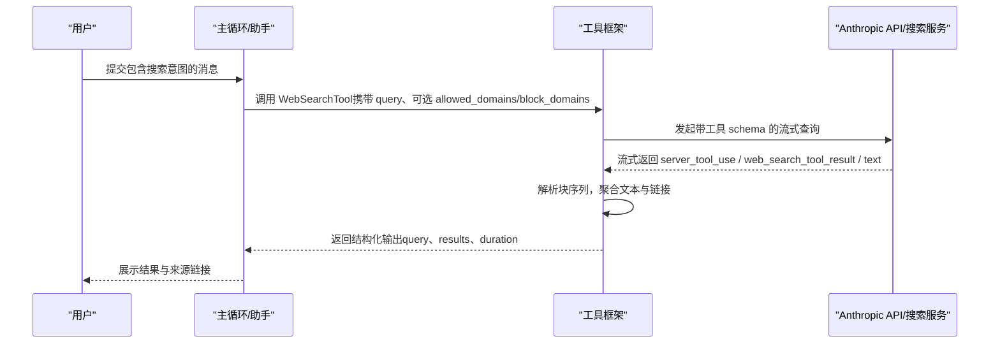
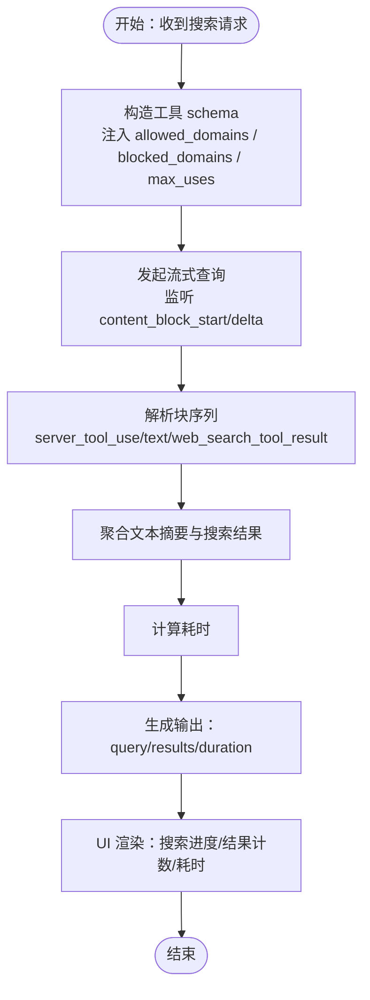
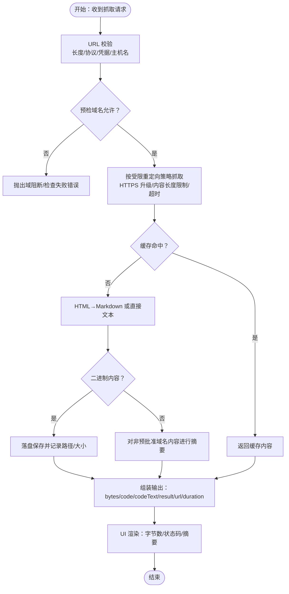
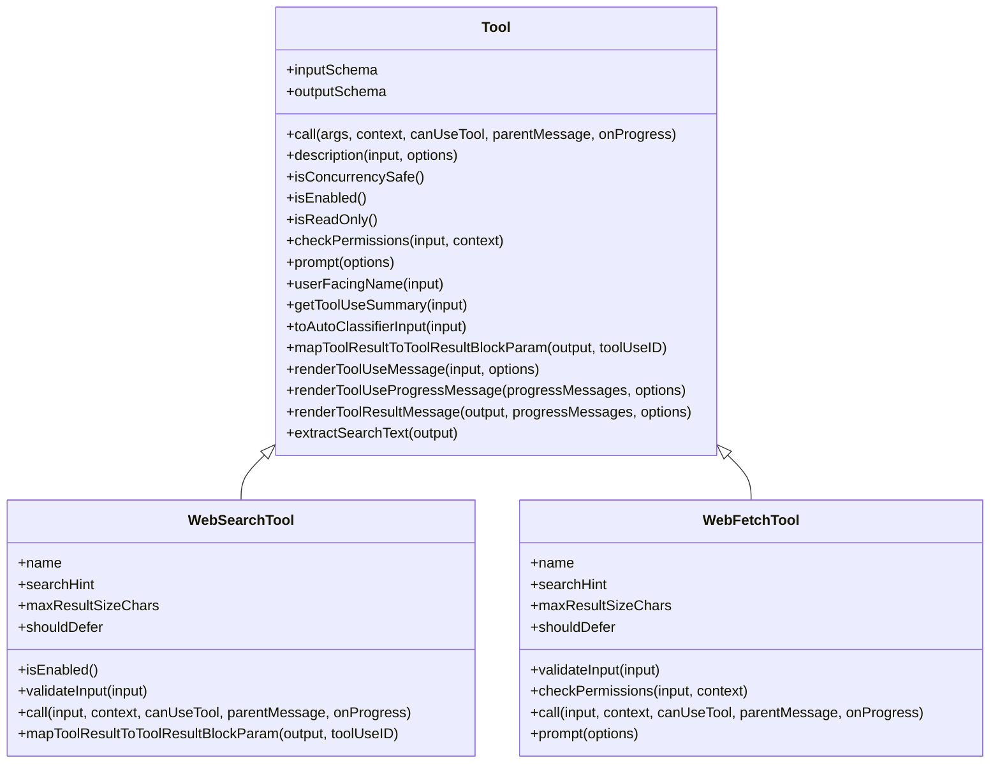
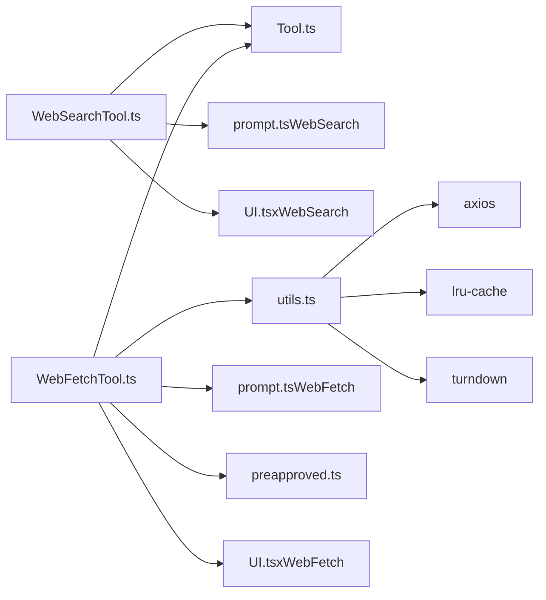

# 网页搜索工具

<cite>
**本文引用的文件**
- [WebSearchTool.ts](file://src/tools/WebSearchTool/WebSearchTool.ts)
- [prompt.ts（WebSearch）](file://src/tools/WebSearchTool/prompt.ts)
- [UI.tsx（WebSearch）](file://src/tools/WebSearchTool/UI.tsx)
- [WebFetchTool.ts](file://src/tools/WebFetchTool/WebFetchTool.ts)
- [prompt.ts（WebFetch）](file://src/tools/WebFetchTool/prompt.ts)
- [preapproved.ts](file://src/tools/WebFetchTool/preapproved.ts)
- [utils.ts](file://src/tools/WebFetchTool/utils.ts)
- [UI.tsx（WebFetch）](file://src/tools/WebFetchTool/UI.tsx)
- [Tool.ts](file://src/Tool.ts)
</cite>

## 目录
1. [简介](#简介)
2. [项目结构](#项目结构)
3. [核心组件](#核心组件)
4. [架构总览](#架构总览)
5. [详细组件分析](#详细组件分析)
6. [依赖关系分析](#依赖关系分析)
7. [性能考量](#性能考量)
8. [故障排查指南](#故障排查指南)
9. [结论](#结论)
10. [附录](#附录)

## 简介
本文件面向网页搜索与网页抓取工具的使用者与维护者，系统性阐述以下内容：
- WebSearchTool 的搜索引擎集成方式、搜索算法与结果排序机制
- WebFetchTool 的网页抓取流程、内容解析、预批准域名列表与安全限制
- 网络请求处理流程、缓存策略、错误重试机制与速率限制
- 具体的搜索查询示例、网页内容获取方法与网络安全防护措施
- 预批准域名的作用与安全考虑

## 项目结构
WebSearchTool 与 WebFetchTool 均基于统一的工具框架构建，遵循一致的输入校验、权限检查、进度渲染与输出映射规范。

图示来源
- [Tool.ts](file://src/Tool.ts)
- [WebSearchTool.ts](file://src/tools/WebSearchTool/WebSearchTool.ts)
- [prompt.ts（WebSearch）](file://src/tools/WebSearchTool/prompt.ts)
- [UI.tsx（WebSearch）](file://src/tools/WebSearchTool/UI.tsx)
- [WebFetchTool.ts](file://src/tools/WebFetchTool/WebFetchTool.ts)
- [prompt.ts（WebFetch）](file://src/tools/WebFetchTool/prompt.ts)
- [preapproved.ts](file://src/tools/WebFetchTool/preapproved.ts)
- [utils.ts](file://src/tools/WebFetchTool/utils.ts)
- [UI.tsx（WebFetch）](file://src/tools/WebFetchTool/UI.tsx)

章节来源
- [Tool.ts](file://src/Tool.ts)
- [WebSearchTool.ts](file://src/tools/WebSearchTool/WebSearchTool.ts)
- [WebFetchTool.ts](file://src/tools/WebFetchTool/WebFetchTool.ts)

## 核心组件
- WebSearchTool：通过流式消息与工具模式触发后端搜索，聚合文本与搜索结果块，生成统一输出并渲染进度与结果。
- WebFetchTool：对指定 URL 执行安全检查与预检，支持受限重定向，将 HTML 转换为 Markdown 并应用小型模型进行内容抽取或摘要，具备自清理缓存与二进制落盘能力。

章节来源
- [WebSearchTool.ts](file://src/tools/WebSearchTool/WebSearchTool.ts)
- [WebFetchTool.ts](file://src/tools/WebFetchTool/WebFetchTool.ts)

## 架构总览
WebSearchTool 与 WebFetchTool 在调用链上共享工具框架的通用能力：输入校验、权限决策、并发安全、只读属性、进度回调与结果映射。二者在“网络访问”与“内容处理”层面分别承担“搜索检索”和“网页抓取”的职责。

图示来源
- [WebSearchTool.ts](file://src/tools/WebSearchTool/WebSearchTool.ts)
- [prompt.ts（WebSearch）](file://src/tools/WebSearchTool/prompt.ts)
- [UI.tsx（WebSearch）](file://src/tools/WebSearchTool/UI.tsx)

## 详细组件分析

### WebSearchTool 组件分析
- 搜索集成与工具模式
  - 使用工具 schema 注入 allowed_domains、blocked_domains，并设置最大使用次数上限。
  - 通过流式查询接口接收 content_block_start/content_block_delta 事件，解析 server_tool_use 与 web_search_tool_result。
- 搜索算法与结果排序
  - 代码注释表明搜索由后端自动执行且单次 API 调用完成；结果块序列中包含“文本片段 + 搜索结果 + 引用混排”，最终聚合为字符串与搜索结果对象的混合数组。
  - 结果排序与去重逻辑未在前端实现，由后端返回顺序决定。
- 输出与渲染
  - 输出包含 query、results（字符串摘要与搜索结果对象）、durationSeconds。
  - 渲染层根据 results 中的对象数量统计“搜索次数”与“总结果数”，并在 UI 中展示耗时。
- 权限与可用性
  - 只读工具，支持并发安全。
  - 可用性受模型与提供商限制（如 Vertex AI 的特定模型版本），以及地区限制（仅美国可用）。

图示来源
- [WebSearchTool.ts](file://src/tools/WebSearchTool/WebSearchTool.ts)
- [UI.tsx（WebSearch）](file://src/tools/WebSearchTool/UI.tsx)

章节来源
- [WebSearchTool.ts](file://src/tools/WebSearchTool/WebSearchTool.ts)
- [prompt.ts（WebSearch）](file://src/tools/WebSearchTool/prompt.ts)
- [UI.tsx（WebSearch）](file://src/tools/WebSearchTool/UI.tsx)

### WebFetchTool 组件分析
- 抓取流程与安全限制
  - URL 校验：长度、协议、用户名/密码、主机名合法性。
  - 预检域名白名单：通过 api.anthropic.com 查询是否允许抓取，失败则抛出明确错误。
  - 重定向策略：仅允许同源（含 www 规则）或路径变更的重定向；超过最大跳转次数会报错。
  - 缓存策略：URL 键的 LRU 缓存，15 分钟 TTL，50MB 总大小；域名预检独立缓存，5 分钟 TTL。
  - 二进制内容：检测到二进制类型时落盘保存，返回文件路径与大小供后续查看。
- 内容解析与二次处理
  - HTML 自动转换为 Markdown；超长内容截断至 10 万字符；对非 HTML 内容直接使用原始文本。
  - 对非预批准域名内容，采用小型模型进行摘要与合规约束（如引号长度限制、禁止歌词等）。
- 预批准域名列表
  - 限定为代码相关文档站点，仅允许 GET 请求；不继承沙箱网络限制，避免上传通道导致数据外泄风险。
- 权限与提示
  - 若 URL 指向需认证或私有资源，工具描述中明确提示优先使用 MCP 提供的已认证工具。
  - 支持基于规则的权限决策：允许/拒绝/询问三态，必要时建议添加本地规则。

图示来源
- [WebFetchTool.ts](file://src/tools/WebFetchTool/WebFetchTool.ts)
- [utils.ts](file://src/tools/WebFetchTool/utils.ts)
- [preapproved.ts](file://src/tools/WebFetchTool/preapproved.ts)
- [UI.tsx（WebFetch）](file://src/tools/WebFetchTool/UI.tsx)

章节来源
- [WebFetchTool.ts](file://src/tools/WebFetchTool/WebFetchTool.ts)
- [utils.ts](file://src/tools/WebFetchTool/utils.ts)
- [preapproved.ts](file://src/tools/WebFetchTool/preapproved.ts)
- [prompt.ts（WebFetch）](file://src/tools/WebFetchTool/prompt.ts)
- [UI.tsx（WebFetch）](file://src/tools/WebFetchTool/UI.tsx)

### 类关系与职责（代码级）

图示来源
- [Tool.ts](file://src/Tool.ts)
- [WebSearchTool.ts](file://src/tools/WebSearchTool/WebSearchTool.ts)
- [WebFetchTool.ts](file://src/tools/WebFetchTool/WebFetchTool.ts)

## 依赖关系分析
- WebSearchTool
  - 依赖工具框架提供的流式查询接口与工具 schema 注入能力，依赖系统提示词与 UI 渲染模块。
- WebFetchTool
  - 依赖 axios 进行 HTTP 请求，LRU 缓存管理抓取内容，Turndown 将 HTML 转 Markdown，小型模型用于摘要与合规处理。
  - 依赖预批准域名清单与安全检查模块，以确保仅对受控域抓取。

图示来源
- [Tool.ts](file://src/Tool.ts)
- [WebSearchTool.ts](file://src/tools/WebSearchTool/WebSearchTool.ts)
- [prompt.ts（WebSearch）](file://src/tools/WebSearchTool/prompt.ts)
- [UI.tsx（WebSearch）](file://src/tools/WebSearchTool/UI.tsx)
- [WebFetchTool.ts](file://src/tools/WebFetchTool/WebFetchTool.ts)
- [utils.ts](file://src/tools/WebFetchTool/utils.ts)
- [prompt.ts（WebFetch）](file://src/tools/WebFetchTool/prompt.ts)
- [preapproved.ts](file://src/tools/WebFetchTool/preapproved.ts)
- [UI.tsx（WebFetch）](file://src/tools/WebFetchTool/UI.tsx)

章节来源
- [Tool.ts](file://src/Tool.ts)
- [WebSearchTool.ts](file://src/tools/WebSearchTool/WebSearchTool.ts)
- [WebFetchTool.ts](file://src/tools/WebFetchTool/WebFetchTool.ts)
- [utils.ts](file://src/tools/WebFetchTool/utils.ts)

## 性能考量
- WebSearchTool
  - 单次 API 调用内完成搜索，前端通过流式事件逐步聚合结果，减少等待时间。
  - 输出包含耗时字段，便于评估整体性能。
- WebFetchTool
  - 15 分钟自清理缓存显著降低重复请求开销；域名预检缓存缩短同域多次抓取的往返。
  - 内容截断与二进制落盘避免大体积内容占用内存与带宽。
  - 限制最大重定向次数与超时，防止恶意服务器导致的资源耗尽。

## 故障排查指南
- WebSearchTool
  - 输入校验失败：缺少查询词或同时指定允许/阻止域名组合。
  - 可用性限制：当前提供商/模型不支持 WebSearch 或地区限制。
  - 结果为空：后端返回空结果或错误信息会被聚合到输出中。
- WebFetchTool
  - 域阻断/预检失败：明确抛出错误，提示网络策略或企业代理限制。
  - 重定向异常：跨域重定向被拒绝，工具返回重定向详情以便用户改用新 URL。
  - 大内容/二进制：内容被截断或落盘保存，可在 UI 中看到补充信息。
  - 认证/私有内容：工具描述明确提示应使用 MCP 已认证工具替代。

章节来源
- [WebSearchTool.ts](file://src/tools/WebSearchTool/WebSearchTool.ts)
- [WebFetchTool.ts](file://src/tools/WebFetchTool/WebFetchTool.ts)
- [utils.ts](file://src/tools/WebFetchTool/utils.ts)

## 结论
WebSearchTool 与 WebFetchTool 在工具框架之上实现了清晰的职责分离：前者专注于“搜索检索与结果聚合”，后者专注于“安全抓取与内容解析”。二者均内置了严格的输入校验、权限控制、缓存与安全策略，能够在保证安全的前提下高效满足用户对最新信息与网页内容的获取需求。

## 附录

### 搜索查询示例
- 使用 WebSearchTool
  - 示例查询：针对“最新 React 文档”的搜索，工具会在系统提示词中强调使用正确年份。
  - 可选参数：allowed_domains 与 blocked_domains 二选一，避免跨域干扰。
- 使用 WebFetchTool
  - 示例请求：对某技术文档页面进行内容抽取，prompt 描述所需提取的信息点。
  - 注意：若 URL 指向需认证或私有资源，请优先使用 MCP 提供的已认证工具。

章节来源
- [prompt.ts（WebSearch）](file://src/tools/WebSearchTool/prompt.ts)
- [prompt.ts（WebFetch）](file://src/tools/WebFetchTool/prompt.ts)

### 网络请求处理流程与安全
- WebFetchTool 的网络层
  - URL 校验与 HTTPS 升级
  - 预检域名允许/阻断
  - 受限重定向策略（仅同源或路径变更）
  - 最大重定向次数与超时控制
  - 二进制内容落盘与路径提示
- 预批准域名的作用
  - 仅限代码相关文档站点，支持 GET 请求
  - 不继承沙箱网络限制，避免上传通道带来的数据外泄风险
  - 与权限规则结合，形成“信任域 + 明确授权”的双重边界

章节来源
- [utils.ts](file://src/tools/WebFetchTool/utils.ts)
- [preapproved.ts](file://src/tools/WebFetchTool/preapproved.ts)