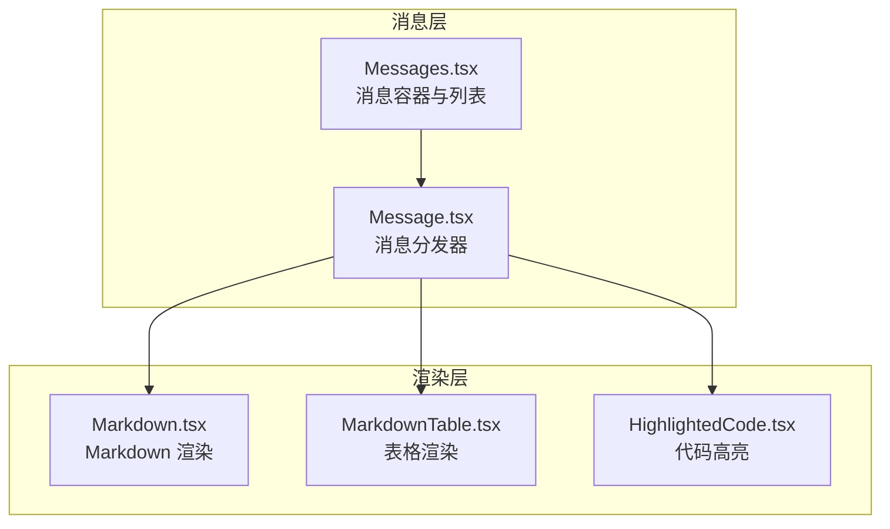
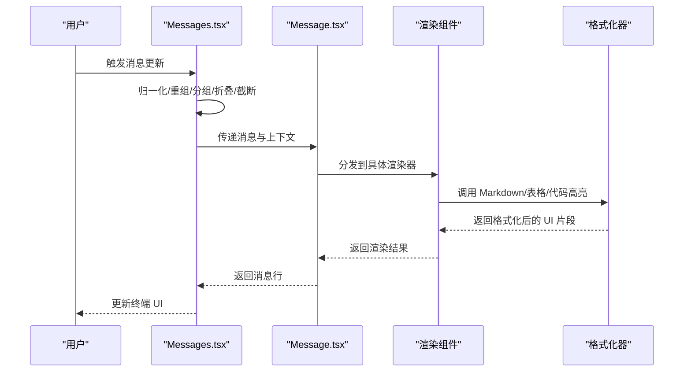
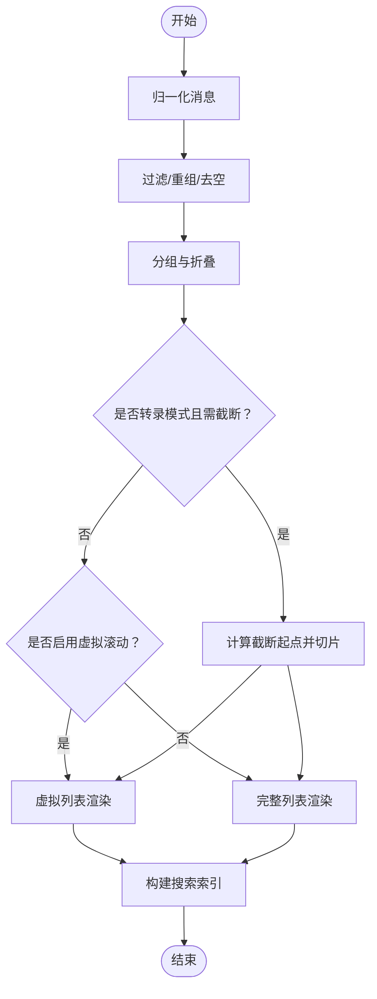
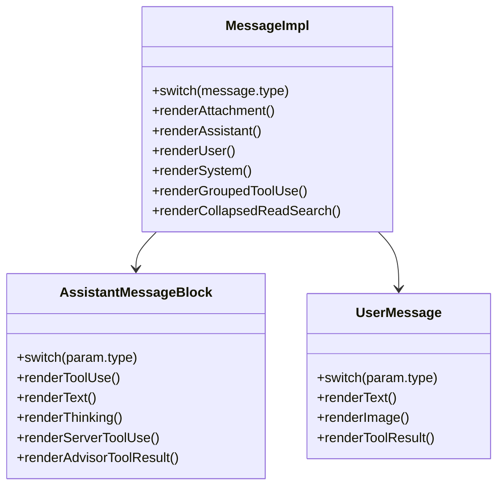
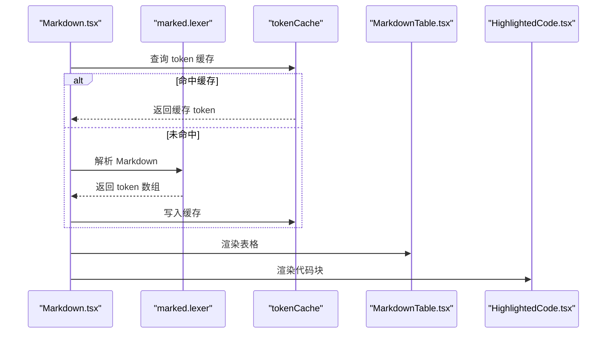
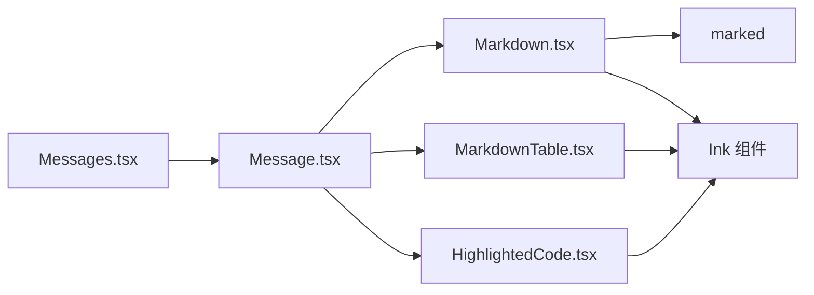

# 工具 UI 集成

<cite>
**本文档引用的文件**
- [Message.tsx](file://src/components/Message.tsx)
- [Messages.tsx](file://src/components/Messages.tsx)
- [Markdown.tsx](file://src/components/Markdown.tsx)
- [MarkdownTable.tsx](file://src/components/MarkdownTable.tsx)
- [HighlightedCode.tsx](file://src/components/HighlightedCode.tsx)
</cite>

## 目录
1. [简介](#简介)
2. [项目结构](#项目结构)
3. [核心组件](#核心组件)
4. [架构总览](#架构总览)
5. [详细组件分析](#详细组件分析)
6. [依赖关系分析](#依赖关系分析)
7. [性能考虑](#性能考虑)
8. [故障排除指南](#故障排除指南)
9. [结论](#结论)
10. [附录](#附录)

## 简介
本文件面向 Claude Code 工具 UI 集成，系统性阐述工具结果在终端 UI 中的渲染机制与交互能力。内容覆盖以下主题：
- 工具使用消息、进度消息、结果消息的类型与显示方式
- 工具结果的存储与缓存策略（含大结果文件化、预览与检索）
- 工具结果的格式化与美化（代码高亮、表格渲染、图片占位、附件处理）
- 工具结果的交互功能（展开/折叠、复制、下载、分享）
- 工具结果的搜索与索引机制（文本提取、关键词匹配、结果定位）
- 自定义工具 UI 组件的开发指南与样式定制方法

## 项目结构
本项目的 UI 基于 Ink 框架构建，采用分层设计：
- 消息容器与列表：负责消息的归一化、分组、折叠、截断与虚拟滚动
- 消息渲染器：根据消息类型选择具体渲染组件（工具调用、工具结果、文本、表格、代码等）
- 内容格式化器：Markdown 解析与渲染、表格布局、代码高亮
- 交互与状态：展开/折叠、选中、搜索定位、进度条反馈

**图表来源**
- [Messages.tsx:341-721](file://src/components/Messages.tsx#L341-L721)
- [Message.tsx:58-627](file://src/components/Message.tsx#L58-L627)
- [Markdown.tsx:78-171](file://src/components/Markdown.tsx#L78-L171)
- [MarkdownTable.tsx:72-321](file://src/components/MarkdownTable.tsx#L72-L321)
- [HighlightedCode.tsx:18-136](file://src/components/HighlightedCode.tsx#L18-L136)

**章节来源**
- [Messages.tsx:341-721](file://src/components/Messages.tsx#L341-L721)
- [Message.tsx:58-627](file://src/components/Message.tsx#L58-L627)

## 核心组件
- Messages.tsx：负责消息的归一化、重组、分组、折叠、截断、虚拟滚动与搜索索引；管理展开/折叠状态、进度条反馈、转录模式等。
- Message.tsx：根据消息类型分发到具体渲染组件，支持工具调用、工具结果、思考块、系统消息等。
- Markdown.tsx：Markdown 解析与渲染，支持语法高亮、表格与非表格内容混合渲染、流式增量渲染。
- MarkdownTable.tsx：表格布局与换行，自动宽度计算与垂直格式回退。
- HighlightedCode.tsx：代码高亮渲染，支持行号、禁用高亮、全屏模式下的行号栏。

**章节来源**
- [Messages.tsx:207-275](file://src/components/Messages.tsx#L207-L275)
- [Message.tsx:32-57](file://src/components/Message.tsx#L32-L57)
- [Markdown.tsx:11-15](file://src/components/Markdown.tsx#L11-L15)
- [MarkdownTable.tsx:30-35](file://src/components/MarkdownTable.tsx#L30-L35)
- [HighlightedCode.tsx:11-16](file://src/components/HighlightedCode.tsx#L11-L16)

## 架构总览
工具 UI 的渲染流程从消息列表开始，经过归一化与分组后，按类型分发到对应的渲染组件。Markdown 与表格组件负责富文本与结构化数据的展示，代码高亮组件提供语法着色与行号。交互层面通过展开/折叠、选中、搜索定位实现深度浏览与快速导航。

**图表来源**
- [Messages.tsx:475-529](file://src/components/Messages.tsx#L475-L529)
- [Message.tsx:82-354](file://src/components/Message.tsx#L82-L354)
- [Markdown.tsx:78-171](file://src/components/Markdown.tsx#L78-L171)
- [MarkdownTable.tsx:72-321](file://src/components/MarkdownTable.tsx#L72-L321)
- [HighlightedCode.tsx:18-136](file://src/components/HighlightedCode.tsx#L18-L136)

## 详细组件分析

### 消息容器与列表（Messages.tsx）
- 功能要点
  - 归一化与重组：对消息进行去重、顺序调整与结构化处理
  - 分组与折叠：将工具调用与其结果、阅读/搜索组等进行逻辑分组与折叠
  - 截断与虚拟滚动：在转录模式下限制显示数量，并在长会话中启用虚拟滚动以控制内存占用
  - 展开/折叠状态：基于工具调用 ID 或消息 UUID 记录展开状态，支持点击切换
  - 进度条反馈：根据工具执行状态向终端报告进度（OSC 9）
  - 搜索索引：为工具结果建立可搜索文本缓存，支持关键词匹配与结果定位
- 关键实现
  - computeSliceStart：基于锚点 UUID 的滑动窗口截断，避免长度波动导致的滚动跳变
  - extractSearchText：优先使用工具实现的精确文本提取，否则回退到通用提取逻辑
  - renderRange：支持分片导出场景，仅渲染指定范围的消息

**图表来源**
- [Messages.tsx:475-529](file://src/components/Messages.tsx#L475-L529)
- [Messages.tsx:314-340](file://src/components/Messages.tsx#L314-L340)
- [Messages.tsx:639-676](file://src/components/Messages.tsx#L639-L676)

**章节来源**
- [Messages.tsx:276-340](file://src/components/Messages.tsx#L276-L340)
- [Messages.tsx:341-721](file://src/components/Messages.tsx#L341-L721)
- [Messages.tsx:639-720](file://src/components/Messages.tsx#L639-L720)

### 消息分发器（Message.tsx）
- 功能要点
  - 类型分发：根据消息类型（附件、助手、用户、系统、分组工具调用、折叠阅读/搜索）选择对应渲染器
  - 工具调用与结果：渲染工具调用块与工具结果块，支持结果截断检测与点击展开
  - 思考块：在转录模式或详细模式下控制思考块的可见性与展开
  - 进度与速率限制：结合进度消息与速率限制提示，提供上下文信息
- 关键实现
  - AssistantMessageBlock：根据内容块类型（tool_use、text、thinking、server_tool_use、advisor_tool_result）选择渲染路径
  - UserMessage：根据内容类型（text、image、tool_result）选择渲染路径
  - GroupedToolUseContent：用于合并同一轮次的多个工具调用

**图表来源**
- [Message.tsx:58-354](file://src/components/Message.tsx#L58-L354)
- [Message.tsx:356-627](file://src/components/Message.tsx#L356-L627)

**章节来源**
- [Message.tsx:32-57](file://src/components/Message.tsx#L32-L57)
- [Message.tsx:82-354](file://src/components/Message.tsx#L82-L354)
- [Message.tsx:356-590](file://src/components/Message.tsx#L356-L590)

### Markdown 渲染与表格（Markdown.tsx、MarkdownTable.tsx）
- 功能要点
  - Markdown 解析：使用 marked 进行解析，支持模块级 token 缓存以提升虚拟滚动时的重渲染性能
  - 表格渲染：自动计算列宽、换行与对齐，必要时回退为垂直键值格式
  - 代码高亮：在 Markdown 中嵌入代码块时，通过 HighlightedCode 提供语法高亮
  - 流式增量渲染：StreamingMarkdown 将新内容增量地追加到已稳定渲染的部分之后
- 关键实现
  - cachedLexer：基于内容哈希的 token 缓存，避免重复解析
  - MarkdownTable：最小词宽、理想宽度、可用空间分配与硬换行策略
  - wrapText：ANSI 友好的换行与空行过滤

**图表来源**
- [Markdown.tsx:37-71](file://src/components/Markdown.tsx#L37-L71)
- [Markdown.tsx:123-171](file://src/components/Markdown.tsx#L123-L171)
- [MarkdownTable.tsx:106-156](file://src/components/MarkdownTable.tsx#L106-L156)

**章节来源**
- [Markdown.tsx:17-71](file://src/components/Markdown.tsx#L17-L71)
- [Markdown.tsx:78-171](file://src/components/Markdown.tsx#L78-L171)
- [MarkdownTable.tsx:72-184](file://src/components/MarkdownTable.tsx#L72-L184)
- [MarkdownTable.tsx:290-321](file://src/components/MarkdownTable.tsx#L290-L321)

### 代码高亮（HighlightedCode.tsx）
- 功能要点
  - 语法高亮：基于 ColorFile 实例渲染带颜色的代码片段
  - 行号：在全屏模式下显示行号栏，便于复制与定位
  - 宽度适配：根据容器宽度或测量宽度动态调整渲染区域
  - 回退机制：当高亮不可用时，回退到纯文本渲染
- 关键实现
  - expectColorFile：延迟加载高亮模块
  - render：调用 ColorFile.render(theme, width, dim) 输出 ANSI 字符串
  - 全屏行号：统计换行数并计算行号栏宽度

**章节来源**
- [HighlightedCode.tsx:18-136](file://src/components/HighlightedCode.tsx#L18-L136)
- [HighlightedCode.tsx:137-189](file://src/components/HighlightedCode.tsx#L137-L189)

## 依赖关系分析
- 组件耦合
  - Messages.tsx 与 Message.tsx：消息容器与分发器的直接耦合，前者负责数据与状态，后者负责渲染
  - Message.tsx 与 Markdown/MarkdownTable/HighlightedCode：渲染器对格式化器的依赖
- 外部依赖
  - marked：Markdown 解析
  - Ink：终端 UI 组件与主题系统
  - ANSI/字符串工具：换行、宽度计算、ANSI 处理

**图表来源**
- [Messages.tsx:341-721](file://src/components/Messages.tsx#L341-L721)
- [Message.tsx:58-627](file://src/components/Message.tsx#L58-L627)
- [Markdown.tsx:1-10](file://src/components/Markdown.tsx#L1-L10)
- [MarkdownTable.tsx:1-10](file://src/components/MarkdownTable.tsx#L1-L10)
- [HighlightedCode.tsx:1-10](file://src/components/HighlightedCode.tsx#L1-L10)

**章节来源**
- [Messages.tsx:341-721](file://src/components/Messages.tsx#L341-L721)
- [Message.tsx:58-627](file://src/components/Message.tsx#L58-L627)

## 性能考虑
- 渲染性能
  - token 缓存：Markdown 解析热点（marked.lexer）通过模块级缓存降低重渲染成本
  - 虚拟滚动：在长会话中启用虚拟列表，限制挂载节点数量，避免内存与写屏压力
  - 截断策略：基于锚点 UUID 的滑动窗口截断，避免长度波动导致的滚动跳变
- 交互性能
  - 展开/折叠状态：基于 Set 与 Map 的轻量状态管理，避免深层重渲染
  - 搜索索引：弱引用缓存 + 小写化，减少键盘事件下的分配与比较成本

**章节来源**
- [Markdown.tsx:22-71](file://src/components/Markdown.tsx#L22-L71)
- [Messages.tsx:299-340](file://src/components/Messages.tsx#L299-L340)
- [Messages.tsx:639-676](file://src/components/Messages.tsx#L639-L676)

## 故障排除指南
- 工具结果未显示或显示异常
  - 检查消息类型是否被正确识别（工具调用/工具结果/文本）
  - 确认工具实现是否返回了可索引的文本（extractSearchText）
- 表格渲染错位或溢出
  - 调整终端宽度或禁用硬换行，观察是否回退到垂直格式
  - 检查列宽计算与安全边距设置
- 代码高亮不生效
  - 确认语法高亮开关状态
  - 检查 ColorFile 是否成功加载
- 性能问题
  - 启用虚拟滚动或关闭截断以验证性能瓶颈
  - 检查 token 缓存命中率与缓存大小

**章节来源**
- [MarkdownTable.tsx:313-317](file://src/components/MarkdownTable.tsx#L313-L317)
- [Markdown.tsx:81-91](file://src/components/Markdown.tsx#L81-L91)
- [HighlightedCode.tsx:40-49](file://src/components/HighlightedCode.tsx#L40-L49)

## 结论
该工具 UI 集成通过“消息容器 + 类型分发 + 格式化器”的架构，实现了对工具调用、结果、文本、表格与代码的统一渲染。借助缓存、虚拟滚动与智能截断，系统在长会话与大数据量场景下仍保持良好性能。搜索索引与交互功能进一步提升了用户体验，便于快速定位与深入分析工具输出。

## 附录

### 工具结果存储与缓存策略
- 存储
  - 消息历史：以不可变数组形式保存，通过 UUID 锚点与切片窗口管理
  - Markdown token：模块级缓存，基于内容哈希键
- 缓存
  - tokenCache：LRU 式淘汰，最大容量限制
  - 搜索文本缓存：WeakMap + 小写化，避免重复解析与比较
- 大结果处理
  - 通过分片导出（renderRange）与虚拟滚动，避免一次性渲染全部历史
  - 工具结果的可展开性由 isResultTruncated 判定，点击后触发展开

**章节来源**
- [Messages.tsx:314-340](file://src/components/Messages.tsx#L314-L340)
- [Markdown.tsx:22-71](file://src/components/Markdown.tsx#L22-L71)
- [Messages.tsx:639-676](file://src/components/Messages.tsx#L639-L676)

### 工具结果的格式化与美化
- Markdown：支持表格与非表格混合，ANSI 友好换行
- 表格：自动列宽、对齐与换行，必要时回退为垂直格式
- 代码：语法高亮、行号（全屏模式）、禁用高亮回退
- 图片与附件：作为占位或链接呈现，具体行为由工具决定

**章节来源**
- [Markdown.tsx:78-171](file://src/components/Markdown.tsx#L78-L171)
- [MarkdownTable.tsx:72-321](file://src/components/MarkdownTable.tsx#L72-L321)
- [HighlightedCode.tsx:18-136](file://src/components/HighlightedCode.tsx#L18-L136)

### 工具结果的交互功能
- 展开/折叠：基于工具调用 ID 或消息 UUID 的键集合
- 复制：全屏模式下通过 NoSelect 提供选择，避免影响终端原生选择
- 下载/分享：通过外部命令或导出接口实现（不在当前 UI 组件内）

**章节来源**
- [Messages.tsx:559-594](file://src/components/Messages.tsx#L559-L594)
- [HighlightedCode.tsx:164-188](file://src/components/HighlightedCode.tsx#L164-L188)

### 工具结果的搜索与索引机制
- 文本提取：优先使用工具实现的 extractSearchText，否则使用通用提取逻辑
- 索引构建：为每个消息建立可搜索文本缓存，小写化以降低匹配成本
- 结果定位：通过搜索匹配计数与当前位置回调，支持跳转到匹配项

**章节来源**
- [Messages.tsx:639-676](file://src/components/Messages.tsx#L639-L676)

### 自定义工具 UI 组件开发指南
- 组件职责
  - 工具结果渲染：实现 extractSearchText 以提供可搜索文本
  - 交互扩展：支持 isResultTruncated 以声明结果可展开
  - 主题适配：遵循 Ink 主题系统，确保在不同主题下可读性
- 开发步骤
  - 在工具实现中添加 extractSearchText 与 isResultTruncated
  - 在消息分发器中注册新的工具结果渲染器
  - 使用 Markdown/MarkdownTable/HighlightedCode 组合实现复杂内容
  - 通过 Messages 的搜索索引机制保证可检索性

**章节来源**
- [Message.tsx:583-594](file://src/components/Message.tsx#L583-L594)
- [Markdown.tsx:650-676](file://src/components/Markdown.tsx#L650-L676)
- [MarkdownTable.tsx:72-184](file://src/components/MarkdownTable.tsx#L72-L184)
- [HighlightedCode.tsx:18-136](file://src/components/HighlightedCode.tsx#L18-L136)