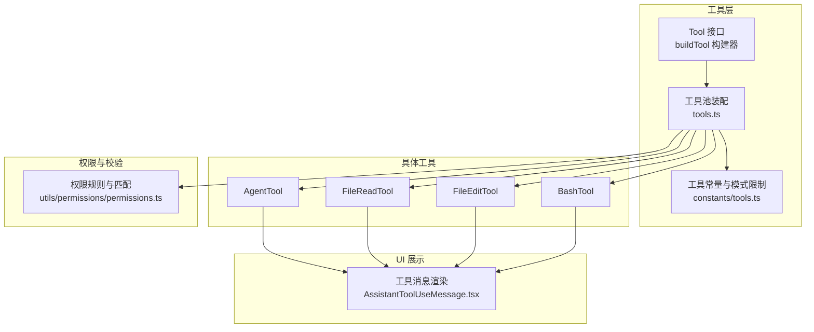
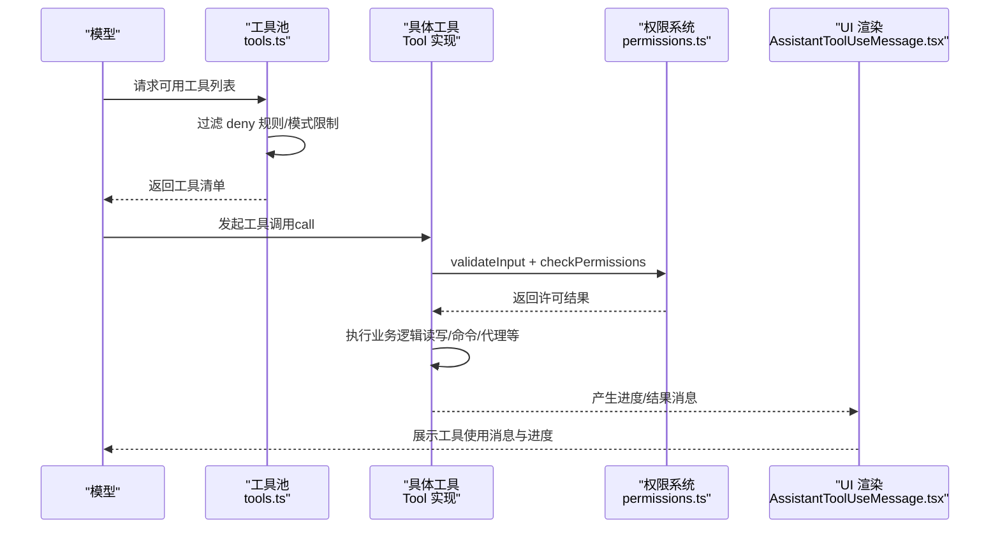
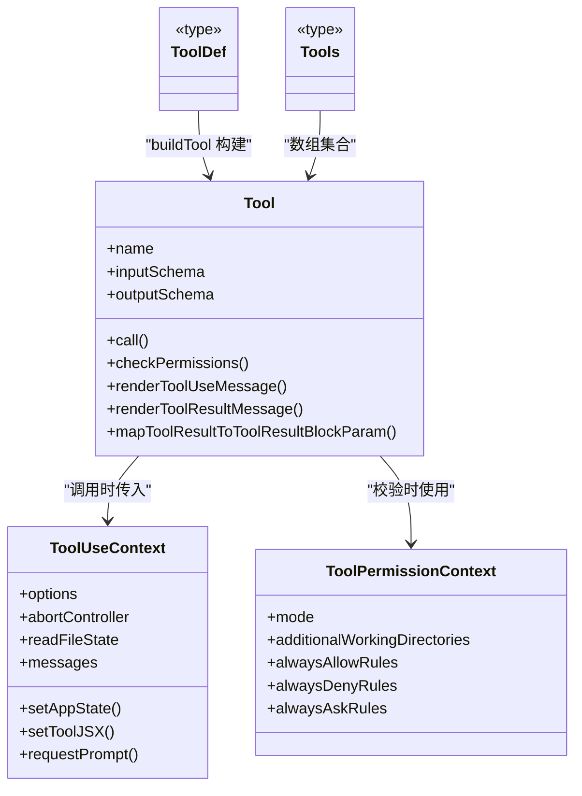

# 工具开发指南

<cite>
**本文引用的文件**
- [src/Tool.ts](file://src/Tool.ts)
- [src/tools.ts](file://src/tools.ts)
- [src/constants/tools.ts](file://src/constants/tools.ts)
- [src/tools/FileReadTool/FileReadTool.ts](file://src/tools/FileReadTool/FileReadTool.ts)
- [src/tools/FileEditTool/FileEditTool.ts](file://src/tools/FileEditTool/FileEditTool.ts)
- [src/tools/BashTool/BashTool.tsx](file://src/tools/BashTool/BashTool.tsx)
- [src/tools/AgentTool/AgentTool.tsx](file://src/tools/AgentTool/AgentTool.tsx)
- [src/tools/utils.ts](file://src/tools/utils.ts)
- [src/utils/permissions/permissions.ts](file://src/utils/permissions/permissions.ts)
- [src/components/messages/AssistantToolUseMessage.tsx](file://src/components/messages/AssistantToolUseMessage.tsx)
- [src/tools/testing/TestingPermissionTool.tsx](file://src/tools/testing/TestingPermissionTool.tsx)
- [README.md](file://README.md)
</cite>

## 目录
1. [简介](#简介)
2. [项目结构](#项目结构)
3. [核心组件](#核心组件)
4. [架构总览](#架构总览)
5. [详细组件分析](#详细组件分析)
6. [依赖关系分析](#依赖关系分析)
7. [性能考量](#性能考量)
8. [故障排查指南](#故障排查指南)
9. [结论](#结论)
10. [附录](#附录)

## 简介
本指南面向希望在 Claude Code 平台上开发自定义工具的工程师，系统讲解工具定义流程、必需与可选方法、工具构建器 buildTool 的用法、权限与输入校验、错误处理与结果格式化、UI 集成（进度、结果渲染、交互）、最佳实践、性能优化与调试技巧，以及测试与质量保障方法。文档基于仓库源码进行深入分析，确保内容与实际实现一致。

## 项目结构
Claude Code 将“工具”作为可插拔能力单元，通过统一的 Tool 接口抽象，结合工具池装配、权限过滤、UI 渲染等机制，形成端到端的工具调用链路。关键目录与职责概览：
- src/Tool.ts：定义 Tool 接口、工具构建器 buildTool、工具上下文 ToolUseContext、权限上下文 ToolPermissionContext 等核心类型与默认行为。
- src/tools.ts：工具注册与装配入口，负责按环境与权限过滤生成最终可用工具集。
- src/constants/tools.ts：内置工具集合与模式限制（如异步代理允许工具集、协调者模式允许工具集等）。
- 具体工具实现：位于 src/tools 下各子目录，例如 FileReadTool、FileEditTool、BashTool、AgentTool 等。
- 权限与校验：src/utils/permissions/permissions.ts 提供权限规则匹配与决策逻辑。
- UI 集成：src/components/messages/AssistantToolUseMessage.tsx 负责工具使用消息与进度的渲染。
- 测试工具：src/tools/testing/TestingPermissionTool.tsx 提供仅用于测试的权限弹窗工具。

图表来源
- [src/Tool.ts:783-792](file://src/Tool.ts#L783-L792)
- [src/tools.ts:193-390](file://src/tools.ts#L193-L390)
- [src/constants/tools.ts:36-113](file://src/constants/tools.ts#L36-L113)
- [src/utils/permissions/permissions.ts:247-1297](file://src/utils/permissions/permissions.ts#L247-L1297)
- [src/components/messages/AssistantToolUseMessage.tsx:339-367](file://src/components/messages/AssistantToolUseMessage.tsx#L339-L367)

章节来源
- [README.md:95-114](file://README.md#L95-L114)

## 核心组件
- Tool 接口与工具构建器
  - Tool 定义了工具的输入输出模式、生命周期钩子、权限与校验、UI 渲染、结果映射等能力边界。
  - buildTool 通过合并默认实现与用户提供的部分实现，确保工具具备一致的最小可用能力集。
- 工具上下文 ToolUseContext
  - 提供工具执行所需的运行时信息（命令、调试开关、模型、工具集、是否非交互会话、MCP 客户端与资源、文件读取缓存、状态更新回调等）。
- 权限上下文 ToolPermissionContext
  - 描述当前权限模式、附加工作目录、允许/拒绝/询问规则、是否可绕过权限等，贯穿工具的 validateInput 与 checkPermissions 流程。
- 工具池装配
  - tools.ts 提供 getTools、assembleToolPool、getMergedTools 等函数，按权限规则过滤、按名称去重、排序稳定，保证提示词缓存命中与一致性。

章节来源
- [src/Tool.ts:362-695](file://src/Tool.ts#L362-L695)
- [src/Tool.ts:783-792](file://src/Tool.ts#L783-L792)
- [src/tools.ts:271-390](file://src/tools.ts#L271-L390)

## 架构总览
工具从“被模型选择”到“UI 展示”的完整链路如下：

图表来源
- [src/tools.ts:271-327](file://src/tools.ts#L271-L327)
- [src/utils/permissions/permissions.ts:1262-1297](file://src/utils/permissions/permissions.ts#L1262-L1297)
- [src/components/messages/AssistantToolUseMessage.tsx:339-367](file://src/components/messages/AssistantToolUseMessage.tsx#L339-L367)

## 详细组件分析

### 工具构建器 buildTool 使用指南
- 必备字段
  - name：工具唯一标识
  - inputSchema：输入 Zod 模式（或 inputJSONSchema）
  - outputSchema：输出 Zod 模式（可选）
  - call(args, context, canUseTool, parentMessage, onProgress?)：核心执行逻辑
- 常用可选增强
  - description(prompt)：工具描述文本
  - userFacingName(input?)：面向用户的展示名
  - isReadOnly(input?)：是否只读
  - isDestructive(input?)：是否破坏性操作
  - isConcurrencySafe(input?)：并发安全
  - validateInput(input, context)：输入校验与错误码
  - checkPermissions(input, context)：权限决策
  - isSearchOrReadCommand(input?)：UI 折叠显示策略
  - renderToolUseMessage(...) / renderToolResultMessage(...) / renderToolUseProgressMessage(...)：UI 渲染
  - mapToolResultToToolResultBlockParam(output, toolUseID)：结果映射到模型消息块
- 默认值覆盖
  - 若未显式提供，buildTool 会注入安全默认：isEnabled=true、isConcurrencySafe=false、isReadOnly=false、isDestructive=false、checkPermissions 直接放行、toAutoClassifierInput 返回空串、userFacingName 返回 name。
  - 可通过在定义中提供同名方法覆盖默认行为。

章节来源
- [src/Tool.ts:716-792](file://src/Tool.ts#L716-L792)
- [src/Tool.ts:362-695](file://src/Tool.ts#L362-L695)

### 文件只读工具（FileReadTool）开发示例
- 关键点
  - 输入参数：file_path、offset、limit、pages
  - 输出类型：文本/图片/笔记本/PDF/分页/未变更占位
  - 严格模式 strict=true，maxResultSizeChars=Infinity
  - 权限：checkReadPermissionForTool，路径展开 expandPath，UNC 路径特殊处理，设备文件阻断
  - 输入校验：PDF 页范围解析与上限、二进制扩展名排除、设备文件阻断
  - 结果映射：根据类型映射为模型消息块；文本类型追加安全提醒
  - UI：renderToolUseMessage/renderToolResultMessage/renderToolUseErrorMessage
- 开发步骤
  1) 定义 inputSchema 与 outputSchema
  2) 实现 validateInput 与 checkPermissions
  3) 实现 call 执行读取与结果构造
  4) 实现 mapToolResultToToolResultBlockParam
  5) 实现 UI 渲染相关方法
  6) 可选：isSearchOrReadCommand、getActivityDescription、getToolUseSummary

章节来源
- [src/tools/FileReadTool/FileReadTool.ts:227-335](file://src/tools/FileReadTool/FileReadTool.ts#L227-L335)
- [src/tools/FileReadTool/FileReadTool.ts:398-495](file://src/tools/FileReadTool/FileReadTool.ts#L398-L495)
- [src/tools/FileReadTool/FileReadTool.ts:594-718](file://src/tools/FileReadTool/FileReadTool.ts#L594-L718)

### 文件编辑工具（FileEditTool）开发示例
- 关键点
  - 输入参数：file_path、old_string、new_string、replace_all
  - 输出：结构化补丁、原始内容、用户修改标记、可选 Git Diff
  - 严格模式 strict=true，maxResultSizeChars=100k
  - 并发安全：isConcurrencySafe=false（需要读后再写一致性）
  - 输入校验：空旧字符串、路径拒绝、UNC 特殊处理、过大文件保护、存在性与一致性检查、多处匹配提示
  - 权限：checkWritePermissionForTool
  - 执行：原子读改写、LSP 通知、VSCode 差异通知、历史记录备份、事件统计
  - UI：renderToolUseMessage/renderToolResultMessage/renderToolUseRejectedMessage/renderToolUseErrorMessage
- 开发步骤
  1) 定义 inputSchema 与 outputSchema
  2) 实现 validateInput（含多处匹配、路径一致性、大小限制等）
  3) 实现 checkPermissions
  4) 实现 call（原子读改写、通知与日志）
  5) 实现 mapToolResultToToolResultBlockParam
  6) 实现 UI 渲染相关方法

章节来源
- [src/tools/FileEditTool/FileEditTool.ts:59-132](file://src/tools/FileEditTool/FileEditTool.ts#L59-L132)
- [src/tools/FileEditTool/FileEditTool.ts:137-362](file://src/tools/FileEditTool/FileEditTool.ts#L137-L362)
- [src/tools/FileEditTool/FileEditTool.ts:387-595](file://src/tools/FileEditTool/FileEditTool.ts#L387-L595)

### 交互式命令工具（BashTool）开发示例
- 关键点
  - 搜索/读取/列表命令识别：isSearchOrReadBashCommand，用于 UI 折叠显示
  - 进度阈值与后台自动挂起：PROGRESS_THRESHOLD_MS、ASSISTANT_BLOCKING_BUDGET_MS
  - 权限：bashToolHasPermission、matchWildcardPattern、cd 约束
  - 只读约束：checkReadOnlyConstraints
  - 输出处理：图像输出检测、终端截断、大结果预览
  - UI：renderToolUseMessage/renderToolUseProgressMessage/renderToolUseErrorMessage
- 开发步骤
  1) 定义 inputSchema（命令字符串等）
  2) 实现 validateInput（命令解析、只读约束、权限）
  3) 实现 checkPermissions（基于规则匹配）
  4) 实现 call（执行命令、流式输出、进度上报、结果持久化）
  5) 实现 UI 渲染相关方法

章节来源
- [src/tools/BashTool/BashTool.tsx:59-172](file://src/tools/BashTool/BashTool.tsx#L59-L172)
- [src/tools/BashTool/BashTool.tsx:178-200](file://src/tools/BashTool/BashTool.tsx#L178-L200)

### 多智能体工具（AgentTool）开发示例
- 关键点
  - 输入：description、prompt、subagent_type、model、run_in_background、隔离模式（worktree/remote）、工作目录覆盖等
  - 输出：同步完成或异步启动（agentId、outputFile、是否可读）
  - 权限：支持按 agent 类型与工具白名单控制
  - UI：renderToolUseMessage/renderToolUseProgressMessage/renderToolResultMessage
- 开发步骤
  1) 定义 baseInputSchema 与 fullInputSchema（按特性开关裁剪）
  2) 实现 validateInput（参数合法性、隔离模式互斥、权限模式）
  3) 实现 checkPermissions（按 agent 与工具白名单）
  4) 实现 call（同步执行或异步派发、任务管理、输出文件）
  5) 实现 UI 渲染相关方法

章节来源
- [src/tools/AgentTool/AgentTool.tsx:82-126](file://src/tools/AgentTool/AgentTool.tsx#L82-L126)
- [src/tools/AgentTool/AgentTool.tsx:196-200](file://src/tools/AgentTool/AgentTool.tsx#L196-L200)

### 工具权限检查机制
- 规则匹配
  - 支持工具名精确匹配、MCP 服务器前缀匹配、通配符匹配
  - 工具级规则优先于服务器级规则
- 决策流程
  - 模式放行（bypassPermissions、plan 模式携带的绕过）
  - 总是允许规则
  - 总是拒绝规则（直接拒绝）
  - 询问规则（弹出权限对话框）
- 工具侧配合
  - validateInput：先做输入合法性与路径/规则检查
  - checkPermissions：补充工具特定权限逻辑（如文件读写、命令执行）

章节来源
- [src/utils/permissions/permissions.ts:247-269](file://src/utils/permissions/permissions.ts#L247-L269)
- [src/utils/permissions/permissions.ts:1262-1297](file://src/utils/permissions/permissions.ts#L1262-L1297)

### 输入验证与错误处理
- 输入验证
  - 使用 Zod 模式定义输入结构，validateInput 中进行业务规则校验（如 PDF 页范围、路径存在性、文件大小、只读约束等）
  - 返回结构化 ValidationResult，包含 result、message、errorCode
- 错误处理
  - 工具内部捕获异常并抛出带友好提示的错误
  - UI 层通过 renderToolUseErrorMessage 渲染错误消息
- 结果格式化
  - mapToolResultToToolResultBlockParam 将工具输出映射为模型消息块，确保跨工具一致性

章节来源
- [src/Tool.ts:95-101](file://src/Tool.ts#L95-L101)
- [src/tools/FileReadTool/FileReadTool.ts:418-495](file://src/tools/FileReadTool/FileReadTool.ts#L418-L495)
- [src/tools/FileEditTool/FileEditTool.ts:137-362](file://src/tools/FileEditTool/FileEditTool.ts#L137-L362)

### UI 集成（进度、结果渲染、用户交互）
- 进度显示
  - 工具可通过 onProgress 回调上报 ToolProgressData
  - UI 通过 renderToolUseProgressMessage 渲染实时进度
- 结果渲染
  - renderToolUseMessage：工具使用消息
  - renderToolResultMessage：结果消息
  - renderToolUseErrorMessage / renderToolUseRejectedMessage：错误与拒绝消息
- 用户交互
  - requestPrompt：在交互式上下文中请求用户输入
  - setToolJSX：动态注入 JSX（如 REPL 包装器）
- 消息标记
  - tagMessagesWithToolUseID：为用户消息附带 sourceToolUseID，避免重复“正在运行”提示

章节来源
- [src/Tool.ts:158-300](file://src/Tool.ts#L158-L300)
- [src/tools/utils.ts:12-41](file://src/tools/utils.ts#L12-L41)
- [src/components/messages/AssistantToolUseMessage.tsx:339-367](file://src/components/messages/AssistantToolUseMessage.tsx#L339-L367)

### 工具开发最佳实践
- 明确定义输入输出模式，使用 Zod 严格约束
- 优先实现 validateInput 与 checkPermissions，尽早失败
- 对可能的副作用（写文件、执行命令）标注 isDestructive 与 isReadOnly
- 提供清晰的 userFacingName 与 getActivityDescription，提升 UX
- 合理使用 isSearchOrReadCommand，优化 UI 折叠体验
- 在 call 中实现幂等与原子性（如文件编辑的读改写）
- 使用 mapToolResultToToolResultBlockParam 统一结果格式
- 为复杂工具提供 renderToolUseProgressMessage，展示长耗时过程

章节来源
- [src/Tool.ts:416-433](file://src/Tool.ts#L416-L433)
- [src/tools/FileEditTool/FileEditTool.ts:387-595](file://src/tools/FileEditTool/FileEditTool.ts#L387-L595)

### 性能优化建议
- 读取类工具采用 readFileState 缓存与“文件未变更”占位，减少重复传输
- 大文件/大输出使用预览与磁盘落盘，控制单次结果大小
- Bash 工具对搜索/读取命令进行折叠，降低 UI 压力
- 合理设置 maxResultSizeChars 与 fileReadingLimits，避免内存压力
- 使用 isConcurrencySafe 与 inputsEquivalent 优化并发与去重

章节来源
- [src/tools/FileReadTool/FileReadTool.ts:534-573](file://src/tools/FileReadTool/FileReadTool.ts#L534-L573)
- [src/tools/BashTool/BashTool.tsx:59-172](file://src/tools/BashTool/BashTool.tsx#L59-L172)

### 调试技巧
- 使用 setToolJSX 注入本地 JSX 命令，快速验证 UI 行为
- 利用 setStreamMode 控制流式渲染模式
- 使用 onCompactProgress 与 setSDKStatus 获取底层状态
- 在 validateInput 中返回 meta 字段，辅助定位问题
- 使用 TestingPermissionTool 在测试中强制弹出权限对话框

章节来源
- [src/Tool.ts:198-236](file://src/Tool.ts#L198-L236)
- [src/tools/testing/TestingPermissionTool.tsx:12-74](file://src/tools/testing/TestingPermissionTool.tsx#L12-L74)

### 测试与质量保障
- 单元测试
  - 使用 Zod 模式驱动的输入/输出测试
  - 使用 withTokenCountVCR 对消息与工具序列化进行去水印哈希，保证测试稳定性
- 集成测试
  - TestingPermissionTool 强制触发权限弹窗，验证权限链路
- 性能与追踪
  - startToolExecutionSpan/endToolBlockedOnUserSpan 记录工具执行与阻塞事件
  - endToolPerfettoSpan 输出 Perfetto 事件，便于性能分析

章节来源
- [src/services/vcr.ts:382-406](file://src/services/vcr.ts#L382-L406)
- [src/utils/telemetry/perfettoTracing.ts:696-763](file://src/utils/telemetry/perfettoTracing.ts#L696-L763)
- [src/utils/telemetry/sessionTracing.ts:574-634](file://src/utils/telemetry/sessionTracing.ts#L574-L634)
- [src/tools/testing/TestingPermissionTool.tsx:12-74](file://src/tools/testing/TestingPermissionTool.tsx#L12-L74)

## 依赖关系分析

图表来源
- [src/Tool.ts:362-695](file://src/Tool.ts#L362-L695)
- [src/Tool.ts:158-300](file://src/Tool.ts#L158-L300)
- [src/Tool.ts:123-148](file://src/Tool.ts#L123-L148)

章节来源
- [src/Tool.ts:362-695](file://src/Tool.ts#L362-L695)

## 性能考量
- 工具结果大小控制：合理设置 maxResultSizeChars，避免一次性传输超大结果
- 读取缓存：利用 readFileState 去重与“文件未变更”占位，显著降低重复传输
- UI 折叠：对搜索/读取命令进行折叠，减少消息数量
- 并发与去重：isConcurrencySafe 与 inputsEquivalent 有助于减少重复执行
- 大输出预览：使用预览文件与磁盘落盘，避免内存溢出

章节来源
- [src/tools/FileReadTool/FileReadTool.ts:534-573](file://src/tools/FileReadTool/FileReadTool.ts#L534-L573)
- [src/tools/BashTool/BashTool.tsx:59-172](file://src/tools/BashTool/BashTool.tsx#L59-L172)

## 故障排查指南
- 权限相关
  - 检查 deny 规则与 alwaysAllowRules 是否匹配
  - 使用 TestingPermissionTool 强制触发权限弹窗，验证权限链路
- 输入错误
  - 查看 validateInput 返回的 errorCode 与 message
  - 确认路径展开与 UNC 路径处理
- UI 不显示或重复
  - 检查 setToolJSX 与 setHasInterruptibleToolInProgress 的使用
  - 使用 tagMessagesWithToolUseID 避免重复“正在运行”提示
- 性能问题
  - 启用 Perfetto 追踪，查看工具执行时间与阻塞事件
  - 使用 withTokenCountVCR 固定消息与工具序列化，复现实验

章节来源
- [src/utils/permissions/permissions.ts:1262-1297](file://src/utils/permissions/permissions.ts#L1262-L1297)
- [src/tools/testing/TestingPermissionTool.tsx:12-74](file://src/tools/testing/TestingPermissionTool.tsx#L12-L74)
- [src/tools/utils.ts:12-41](file://src/tools/utils.ts#L12-L41)
- [src/utils/telemetry/perfettoTracing.ts:696-763](file://src/utils/telemetry/perfettoTracing.ts#L696-L763)
- [src/services/vcr.ts:382-406](file://src/services/vcr.ts#L382-L406)

## 结论
通过统一的 Tool 接口与 buildTool 构建器，Claude Code 提供了标准化的工具开发框架。开发者只需关注业务逻辑与 UI 渲染，其余由工具池装配、权限系统与 UI 渲染层自动处理。遵循本文的开发步骤、最佳实践与测试策略，可以高效地创建从简单只读工具到复杂交互式工具的各类能力，并确保安全性、可维护性与用户体验。

## 附录
- 工具池装配流程（简化）
  - 过滤 deny 规则
  - 按模式（simple/repl/coordinator）调整工具集合
  - 合并 MCP 工具并去重
  - 名称排序以稳定提示词缓存

章节来源
- [src/tools.ts:262-367](file://src/tools.ts#L262-L367)