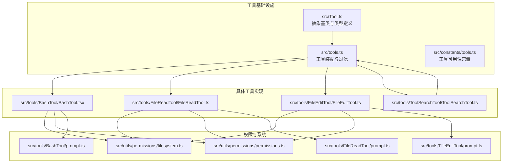
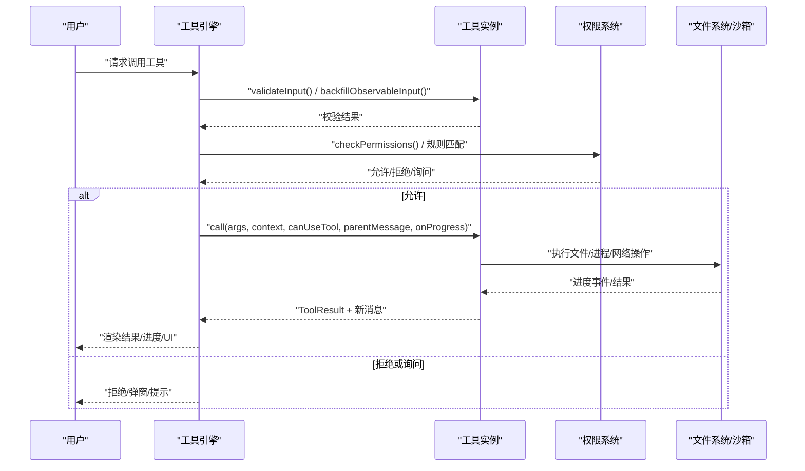
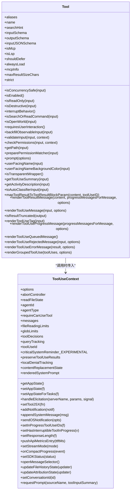
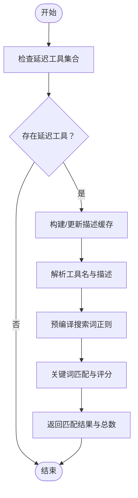
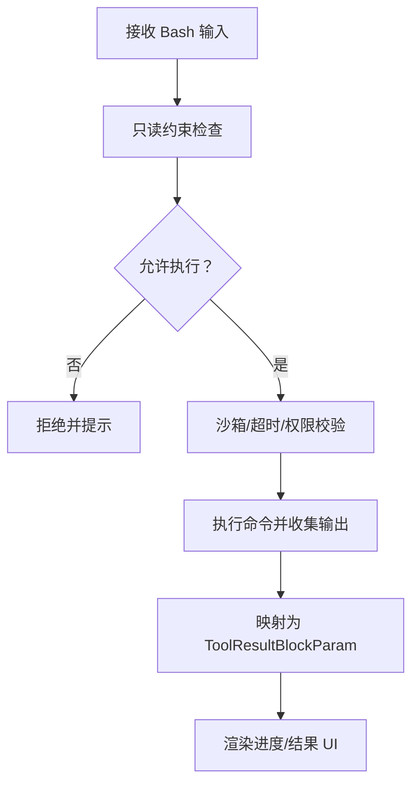
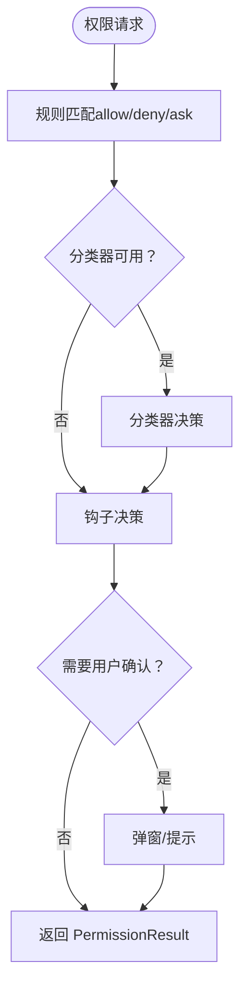
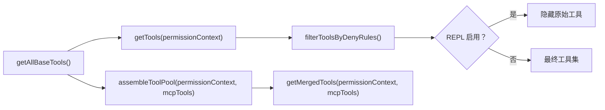

# 工具架构设计

<cite>
**本文引用的文件**
- [src/Tool.ts](file://src/Tool.ts)
- [src/tools.ts](file://src/tools.ts)
- [src/constants/tools.ts](file://src/constants/tools.ts)
- [src/tools/FileReadTool/FileReadTool.ts](file://src/tools/FileReadTool/FileReadTool.ts)
- [src/tools/FileEditTool/FileEditTool.ts](file://src/tools/FileEditTool/FileEditTool.ts)
- [src/tools/BashTool/BashTool.tsx](file://src/tools/BashTool/BashTool.tsx)
- [src/tools/ToolSearchTool/ToolSearchTool.ts](file://src/tools/ToolSearchTool/ToolSearchTool.ts)
- [src/utils/permissions/filesystem.ts](file://src/utils/permissions/filesystem.ts)
- [src/utils/permissions/permissions.ts](file://src/utils/permissions/permissions.ts)
- [src/tools/BashTool/prompt.ts](file://src/tools/BashTool/prompt.ts)
- [src/tools/FileReadTool/prompt.ts](file://src/tools/FileReadTool/prompt.ts)
- [src/tools/FileEditTool/prompt.ts](file://src/tools/FileEditTool/prompt.ts)
</cite>

## 目录
1. [引言](#引言)
2. [项目结构](#项目结构)
3. [核心组件](#核心组件)
4. [架构总览](#架构总览)
5. [详细组件分析](#详细组件分析)
6. [依赖关系分析](#依赖关系分析)
7. [性能考量](#性能考量)
8. [故障排查指南](#故障排查指南)
9. [结论](#结论)
10. [附录](#附录)

## 引言
本文件系统化阐述 Claude Code 的工具架构设计，围绕 Tool 抽象基类展开，覆盖工具生命周期管理、权限控制系统、进度报告机制、输入输出模式与 JSON Schema 验证、工具分类与标记属性、工具搜索与延迟加载、工具上下文（ToolUseContext）设计与使用场景，以及工具与命令系统的交互模式。目标是帮助开发者在不深入源码细节的前提下，快速理解并正确扩展工具生态。

## 项目结构
- 工具抽象与类型定义集中在 Tool 基础设施中，提供统一的工具接口规范、默认行为与上下文模型。
- 工具集合装配逻辑位于 tools.ts，负责按环境与权限过滤、合并内置工具与 MCP 工具，并支持延迟加载与去重。
- 具体工具实现（如 Bash、FileRead、FileEdit、ToolSearch）遵循 Tool 接口规范，体现各自能力边界与安全策略。
- 权限控制贯穿工具调用前后，由权限模块提供规则匹配、分类器决策与拒绝追踪等能力。

**图表来源**
- [src/Tool.ts:1-793](file://src/Tool.ts#L1-L793)
- [src/tools.ts:1-390](file://src/tools.ts#L1-L390)
- [src/constants/tools.ts:1-113](file://src/constants/tools.ts#L1-L113)
- [src/tools/BashTool/BashTool.tsx:1-200](file://src/tools/BashTool/BashTool.tsx#L1-L200)
- [src/tools/FileReadTool/FileReadTool.ts:1-200](file://src/tools/FileReadTool/FileReadTool.ts#L1-L200)
- [src/tools/FileEditTool/FileEditTool.ts:1-200](file://src/tools/FileEditTool/FileEditTool.ts#L1-L200)
- [src/tools/ToolSearchTool/ToolSearchTool.ts:1-200](file://src/tools/ToolSearchTool/ToolSearchTool.ts#L1-L200)
- [src/utils/permissions/filesystem.ts:1-200](file://src/utils/permissions/filesystem.ts#L1-L200)
- [src/utils/permissions/permissions.ts:1-200](file://src/utils/permissions/permissions.ts#L1-L200)

**章节来源**
- [src/Tool.ts:1-793](file://src/Tool.ts#L1-L793)
- [src/tools.ts:1-390](file://src/tools.ts#L1-L390)

## 核心组件
- Tool 抽象基类与工具类型
  - 定义工具统一接口：call、description、checkPermissions、renderToolResultMessage 等。
  - 提供工具标记属性：只读、破坏性、并发安全、延迟加载、始终加载、是否 MCP/LSP 等。
  - 输入输出模式：inputSchema（Zod）、可选 inputJSONSchema（JSON Schema）、outputSchema；支持自定义 backfillObservableInput、validateInput、toAutoClassifierInput 等。
  - 进度与结果：ToolResult、ToolProgress、Progress、filterToolProgressMessages 等。
  - 上下文：ToolUseContext，承载会话状态、消息、文件限制、权限上下文、回调钩子等。
- 工具集合与装配
  - getAllBaseTools、getTools、assembleToolPool、getMergedTools 等函数负责按权限与特性门控组装工具集。
  - 支持 REPL 模式下的工具隐藏与简单模式过滤。
- 权限系统
  - ToolPermissionContext、PermissionResult、deny/rule/mode 分类决策。
  - 文件系统权限检查、路径规范化、危险路径/目录保护、技能作用域建议等。
- 工具搜索与延迟加载
  - ToolSearchTool 提供关键词搜索与匹配，支持缓存失效与 MCP 服务器待连接提示。
  - 工具的 shouldDefer/alwaysLoad 标记决定是否延迟加载与初始可见性。

**章节来源**
- [src/Tool.ts:362-695](file://src/Tool.ts#L362-L695)
- [src/tools.ts:193-390](file://src/tools.ts#L193-L390)
- [src/utils/permissions/filesystem.ts:53-200](file://src/utils/permissions/filesystem.ts#L53-L200)
- [src/tools/ToolSearchTool/ToolSearchTool.ts:1-200](file://src/tools/ToolSearchTool/ToolSearchTool.ts#L1-L200)

## 架构总览
工具架构以 Tool 抽象为核心，通过 buildTool 统一注入默认行为，结合工具集合装配函数与权限系统，形成“声明式工具 + 运行时装配 + 权限控制”的整体设计。工具调用链路从上下文（ToolUseContext）出发，经过输入验证、权限决策、工具执行、进度渲染与结果展示，最终回写到会话消息流。

**图表来源**
- [src/Tool.ts:379-503](file://src/Tool.ts#L379-L503)
- [src/utils/permissions/permissions.ts:137-200](file://src/utils/permissions/permissions.ts#L137-L200)
- [src/tools/BashTool/BashTool.tsx:1-200](file://src/tools/BashTool/BashTool.tsx#L1-L200)

## 详细组件分析

### Tool 抽象基类与接口规范
- 核心方法
  - call(args, context, canUseTool, parentMessage, onProgress): 执行工具逻辑，返回 ToolResult，可产生新消息与上下文修改器。
  - description(input, options): 返回工具能力描述，用于 ToolSearch 与系统提示。
  - checkPermissions(input, context): 工具级权限决策入口，返回 PermissionResult。
  - renderToolResultMessage(content, progressMessagesForMessage, options): 渲染工具结果消息。
  - renderToolUseMessage(input, options): 渲染工具使用消息（早期参数可能不完整）。
  - renderToolUseProgressMessage(progressMessagesForMessage, options): 渲染进行中的进度消息。
  - renderToolUseRejectedMessage(...) / renderToolUseErrorMessage(...): 自定义拒绝/错误 UI。
  - renderGroupedToolUse(...): 并发多实例分组渲染。
- 标记与属性
  - isReadOnly/isDestructive/isConcurrencySafe/interruptBehavior/isSearchOrReadCommand/isOpenWorld/requiresUserInteraction/isMcp/isLsp/shouldDefer/alwaysLoad/maxResultSizeChars/strict/backfillObservableInput/validateInput/preparePermissionMatcher/userFacingName/getActivityDescription/toAutoClassifierInput/mapToolResultToToolResultBlockParam/extractSearchText/isResultTruncated/renderToolUseTag。
- 上下文与进度
  - ToolUseContext：包含命令、调试开关、模型、工具池、MCP 客户端与资源、文件读取限制、消息列表、回调（通知、系统消息、JSX 设置、权限提示等）、查询跟踪、内容替换状态等。
  - ToolProgress/Progress/filterToolProgressMessages：统一进度事件类型与过滤。

**图表来源**
- [src/Tool.ts:362-695](file://src/Tool.ts#L362-L695)
- [src/Tool.ts:158-300](file://src/Tool.ts#L158-L300)

**章节来源**
- [src/Tool.ts:362-695](file://src/Tool.ts#L362-L695)
- [src/Tool.ts:158-300](file://src/Tool.ts#L158-L300)

### 工具分类体系与标记属性
- 只读工具：isReadOnly 返回 true，通常不修改文件或外部状态。
- 破坏性工具：isDestructive 返回 true，涉及删除、覆盖、发送等不可逆操作。
- 并发安全工具：isConcurrencySafe 返回 true，允许多实例同时运行而不互相干扰。
- 延迟加载与始终加载：shouldDefer/alwaysLoad 控制工具是否延迟加载与初始可见性。
- 其他标记：isMcp/isLsp、interruptBehavior、isSearchOrReadCommand、isOpenWorld、requiresUserInteraction 等。

这些标记由工具实现自行声明，也可通过 buildTool 注入默认值，确保一致性与可维护性。

**章节来源**
- [src/Tool.ts:402-473](file://src/Tool.ts#L402-L473)
- [src/Tool.ts:757-792](file://src/Tool.ts#L757-L792)

### 工具输入输出模式与 JSON Schema 验证
- 输入模式
  - inputSchema 使用 Zod 类型，提供强类型参数校验与自动补全。
  - inputJSONSchema 允许 MCP 工具直接提供 JSON Schema，避免 Zod 转换开销。
  - backfillObservableInput 用于在观察者可见前填充衍生字段，保持提示缓存稳定。
  - validateInput 可对输入进行业务规则校验，返回 ValidationResult。
- 输出模式
  - outputSchema 使用 Zod 描述工具输出结构。
  - mapToolResultToToolResultBlockParam 将工具输出映射为 SDK 块参数。
  - renderToolResultMessage/renderToolUseMessage 提供 UI 层渲染。
- JSON Schema 验证
  - 通过 Zod 对输入进行编译与运行时校验，确保参数类型与约束一致。
  - 对于 MCP 工具，可直接使用 inputJSONSchema，提升性能与兼容性。

**章节来源**
- [src/Tool.ts:15-21](file://src/Tool.ts#L15-L21)
- [src/Tool.ts:394-401](file://src/Tool.ts#L394-L401)
- [src/Tool.ts:489-492](file://src/Tool.ts#L489-L492)
- [src/Tool.ts:557-560](file://src/Tool.ts#L557-L560)

### 工具搜索与延迟加载
- ToolSearchTool
  - 提供关键词搜索与匹配，支持缓存失效与 MCP 服务器待连接提示。
  - 解析工具名（含 MCP 命名空间）与描述，构建搜索索引，返回匹配工具名称列表。
  - 缓存描述以减少重复计算，当延迟工具集合变化时主动失效。
- 延迟加载策略
  - 工具可通过 shouldDefer 标记延迟加载；ToolSearchTool 在模型需要时触发加载。
  - alwaysLoad 标记用于确保某些工具在首轮即可见，避免额外往返。

**图表来源**
- [src/tools/ToolSearchTool/ToolSearchTool.ts:66-105](file://src/tools/ToolSearchTool/ToolSearchTool.ts#L66-L105)
- [src/tools/ToolSearchTool/ToolSearchTool.ts:186-200](file://src/tools/ToolSearchTool/ToolSearchTool.ts#L186-L200)

**章节来源**
- [src/tools/ToolSearchTool/ToolSearchTool.ts:1-200](file://src/tools/ToolSearchTool/ToolSearchTool.ts#L1-L200)

### 工具上下文（ToolUseContext）设计与使用场景
- 关键职责
  - 会话状态：getAppState/setAppState/setAppStateForTasks，支持主任务线程与子代理的跨层级状态更新。
  - 消息与通知：appendSystemMessage/addNotification/openMessageSelector 等。
  - 进度与 UI：setToolJSX/setStreamMode/onCompactProgress，支持透明包装器与紧凑视图。
  - 权限与安全：handleElicitation、requestPrompt、localDenialTracking、contentReplacementState 等。
  - 限制与配额：fileReadingLimits/globLimits、toolDecisions、queryTracking。
- 使用场景
  - 主线程与子代理：主线程使用 setAppStateForTasks 保证后台任务状态持久化。
  - REPL/SDK 模式：handleElicitation 与 setSDKStatus 协同 UI 与 SDK 流程。
  - 权限提示：requestPrompt 生成交互式提示，避免阻塞异步代理。

**章节来源**
- [src/Tool.ts:158-300](file://src/Tool.ts#L158-L300)

### 工具与命令系统的交互模式
- 命令集成
  - ToolUseContext.options.commands 提供可用命令列表，工具可在描述或渲染中引用。
  - REPL 模式下，REPL_ONLY_TOOLS 会隐藏原始工具，仅允许 REPL 包装器直接使用。
- 工具选择与提示
  - description/prompt 提供模型侧提示，结合 ToolSearchTool 实现“先搜索再调用”的体验。
  - 工具的 searchHint 与 userFacingName 影响模型检索与显示。

**章节来源**
- [src/tools.ts:312-327](file://src/tools.ts#L312-L327)
- [src/tools/BashTool/prompt.ts:1-200](file://src/tools/BashTool/prompt.ts#L1-L200)

### 具体工具实现要点

#### Bash 工具
- 能力与安全
  - 支持后台运行、超时控制、沙箱隔离、只读约束检测。
  - 搜索/读取/列表命令识别，支持 UI 折叠显示。
- 输入输出
  - 输入通过 Zod 校验，支持 run_in_background、timeout 等参数。
  - 输出映射为 SDK 块参数，支持图像/终端输出处理。
- 权限
  - bashToolHasPermission/matchWildcardPattern 等实现命令级权限匹配。

**图表来源**
- [src/tools/BashTool/BashTool.tsx:1-200](file://src/tools/BashTool/BashTool.tsx#L1-L200)
- [src/tools/BashTool/prompt.ts:1-200](file://src/tools/BashTool/prompt.ts#L1-L200)

**章节来源**
- [src/tools/BashTool/BashTool.tsx:1-200](file://src/tools/BashTool/BashTool.tsx#L1-L200)
- [src/tools/BashTool/prompt.ts:1-200](file://src/tools/BashTool/prompt.ts#L1-L200)

#### 文件读取工具（FileRead）
- 能力
  - 支持文本、图片、PDF、Jupyter Notebook 等多种格式读取。
  - 行号格式、偏移与大小限制、设备文件阻断、macOS 截图路径兼容。
- 安全
  - 文件系统权限检查、危险路径/目录保护、会话文件类型检测。
- 输入输出
  - 输入通过 Zod 校验，输出映射为 SDK 块参数，支持 UI 渲染与搜索文本提取。

**章节来源**
- [src/tools/FileReadTool/FileReadTool.ts:1-200](file://src/tools/FileReadTool/FileReadTool.ts#L1-L200)
- [src/tools/FileReadTool/prompt.ts:1-50](file://src/tools/FileReadTool/prompt.ts#L1-L50)
- [src/utils/permissions/filesystem.ts:53-200](file://src/utils/permissions/filesystem.ts#L53-L200)

#### 文件编辑工具（FileEdit）
- 能力
  - 精确字符串替换、批量替换、差异生成、历史记录跟踪。
- 安全
  - 团队内存敏感内容检查、危险文件/目录保护、UNC 路径安全处理。
- 输入输出
  - 输入校验（相同旧串/过大文件/忽略路径），输出映射为 SDK 块参数，支持 UI 渲染与拒绝消息。

**章节来源**
- [src/tools/FileEditTool/FileEditTool.ts:1-200](file://src/tools/FileEditTool/FileEditTool.ts#L1-L200)
- [src/tools/FileEditTool/prompt.ts:1-29](file://src/tools/FileEditTool/prompt.ts#L1-L29)
- [src/utils/permissions/filesystem.ts:53-200](file://src/utils/permissions/filesystem.ts#L53-L200)

### 权限控制系统
- 决策流程
  - 规则匹配（allow/deny/ask）→ 分类器决策（可选）→ 钩子拦截（可选）→ 用户交互（可选）→ 最终 PermissionResult。
- 关键机制
  - ToolPermissionContext：集中管理权限模式、附加工作目录、规则来源与拒绝追踪。
  - deny 规则过滤：在工具装配阶段即剔除黑名单工具。
  - 路径规范化与大小写归一化：防止大小写绕过与路径遍历。
  - 技能作用域建议：针对 .claude/skills 下的特定技能提供更窄范围的授权建议。

**图表来源**
- [src/utils/permissions/permissions.ts:137-200](file://src/utils/permissions/permissions.ts#L137-L200)
- [src/utils/permissions/filesystem.ts:90-157](file://src/utils/permissions/filesystem.ts#L90-L157)

**章节来源**
- [src/utils/permissions/permissions.ts:1-200](file://src/utils/permissions/permissions.ts#L1-200)
- [src/utils/permissions/filesystem.ts:1-200](file://src/utils/permissions/filesystem.ts#L1-L200)

## 依赖关系分析
- 工具装配与过滤
  - getAllBaseTools 依据特性门控与环境变量组装基础工具集。
  - getTools 在权限上下文与 REPL 模式下进一步过滤。
  - assembleToolPool 合并内置与 MCP 工具，保持排序稳定性与去重。
- 工具可用性常量
  - constants/tools.ts 定义了不同角色/模式下的工具可用性集合（如异步代理、协调者模式、内联队友等）。

**图表来源**
- [src/tools.ts:193-390](file://src/tools.ts#L193-L390)
- [src/constants/tools.ts:36-113](file://src/constants/tools.ts#L36-L113)

**章节来源**
- [src/tools.ts:193-390](file://src/tools.ts#L193-L390)
- [src/constants/tools.ts:1-113](file://src/constants/tools.ts#L1-L113)

## 性能考量
- 延迟加载与缓存
  - ToolSearchTool 对工具描述进行缓存，当延迟工具集合变化时主动失效，避免重复计算。
- 工具集合排序与缓存稳定性
  - assembleToolPool 对内置与 MCP 工具分别排序后合并，内置工具保持前缀连续，避免全局缓存键失效。
- 输入输出体积控制
  - maxResultSizeChars 限制工具结果大小，超过阈值自动落盘并返回预览，降低内存压力。
- 进度与 UI 更新
  - 进度事件压缩与过滤（filterToolProgressMessages）减少渲染负担。

**章节来源**
- [src/tools/ToolSearchTool/ToolSearchTool.ts:50-105](file://src/tools/ToolSearchTool/ToolSearchTool.ts#L50-L105)
- [src/tools.ts:345-367](file://src/tools.ts#L345-L367)
- [src/Tool.ts:466](file://src/Tool.ts#L466)

## 故障排查指南
- 工具未出现或被隐藏
  - 检查 REPL_ONLY_TOOLS 与 getTools 中的隐藏逻辑；确认 isReplModeEnabled 与 REPLTool 是否启用。
  - 检查 deny 规则过滤（filterToolsByDenyRules）是否误删。
- 权限被拒绝或频繁弹窗
  - 查看 ToolPermissionContext 的规则来源与模式；确认 deny/allow/ask 规则是否命中。
  - 检查本地拒绝追踪（localDenialTracking）与自动降级阈值（shouldFallbackToPrompting）。
- 输入校验失败
  - 检查 validateInput 返回的错误码与消息；确认 backfillObservableInput 是否正确填充。
- 结果过大导致内存问题
  - 调整 maxResultSizeChars 或改用分段读取/搜索替代全量读取。
- Bash 工具超时或无输出
  - 检查超时设置与 run_in_background 参数；确认沙箱配置与输出重定向。

**章节来源**
- [src/tools.ts:312-327](file://src/tools.ts#L312-L327)
- [src/utils/permissions/permissions.ts:137-200](file://src/utils/permissions/permissions.ts#L137-L200)
- [src/Tool.ts:489-492](file://src/Tool.ts#L489-L492)

## 结论
该工具架构以 Tool 抽象为核心，通过统一接口、默认行为与上下文模型，实现了工具的可组合、可扩展与可治理。配合权限系统、延迟加载与工具搜索，既保证了安全性与可控性，又提升了模型使用工具的效率与体验。开发者在新增工具时，应严格遵循接口规范、合理标注工具属性、完善输入输出模式与权限策略，并充分利用上下文与进度机制，确保工具在复杂会话场景中的稳定运行。

## 附录
- 工具可用性常量参考
  - ALL_AGENT_DISALLOWED_TOOLS/CUSTOM_AGENT_DISALLOWED_TOOLS/ASYNC_AGENT_ALLOWED_TOOLS/IN_PROCESS_TEAMMATE_ALLOWED_TOOLS/COORDINATOR_MODE_ALLOWED_TOOLS 等集合定义了不同角色/模式下的工具可用范围。
- 提示模板与 UI
  - 各工具的 prompt.ts 与 UI.js 提供了模型提示与前端渲染的参考实现。

**章节来源**
- [src/constants/tools.ts:36-113](file://src/constants/tools.ts#L36-L113)
- [src/tools/BashTool/prompt.ts:1-200](file://src/tools/BashTool/prompt.ts#L1-L200)
- [src/tools/FileReadTool/prompt.ts:1-50](file://src/tools/FileReadTool/prompt.ts#L1-L50)
- [src/tools/FileEditTool/prompt.ts:1-29](file://src/tools/FileEditTool/prompt.ts#L1-L29)