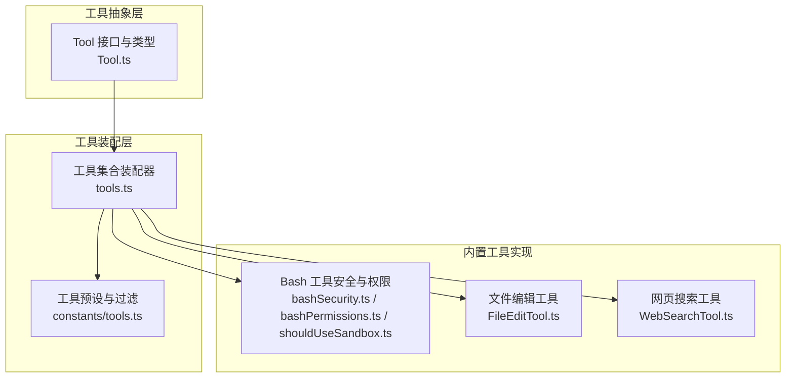
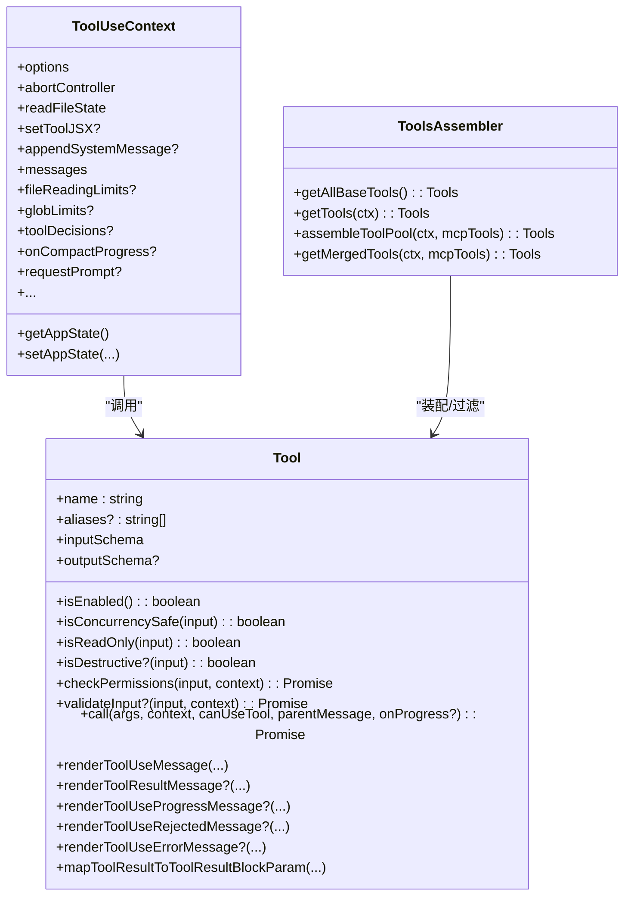
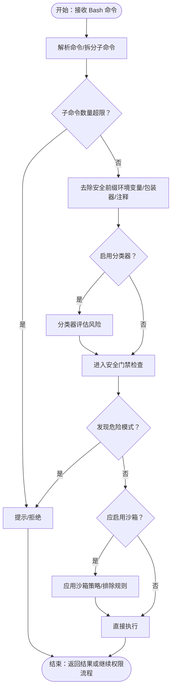
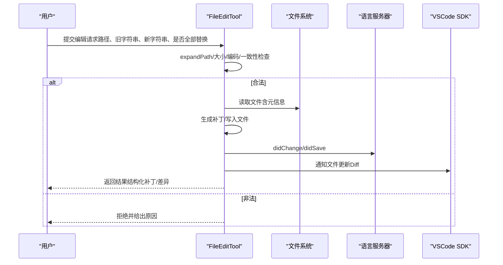
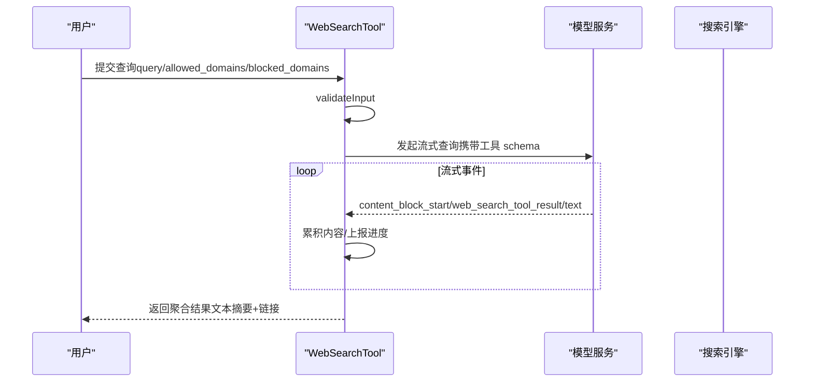
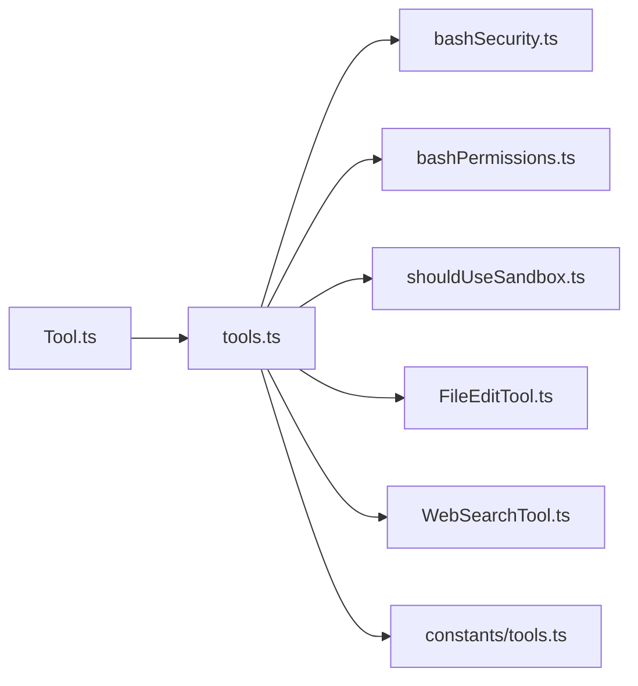

# 工具系统

<cite>
**本文引用的文件**
- [Tool.ts](file://src/Tool.ts)
- [tools.ts](file://src/tools.ts)
- [FileEditTool.ts](file://src/tools/FileEditTool/FileEditTool.ts)
- [WebSearchTool.ts](file://src/tools/WebSearchTool/WebSearchTool.ts)
- [bashSecurity.ts](file://src/tools/BashTool/bashSecurity.ts)
- [bashPermissions.ts](file://src/tools/BashTool/bashPermissions.ts)
- [shouldUseSandbox.ts](file://src/tools/BashTool/shouldUseSandbox.ts)
- [tools.ts（常量）](file://src/constants/tools.ts)
</cite>

## 目录
1. [简介](#简介)
2. [项目结构](#项目结构)
3. [核心组件](#核心组件)
4. [架构总览](#架构总览)
5. [详细组件分析](#详细组件分析)
6. [依赖关系分析](#依赖关系分析)
7. [性能考量](#性能考量)
8. [故障排查指南](#故障排查指南)
9. [结论](#结论)
10. [附录](#附录)

## 简介
本文件系统性阐述 Claude Code 的“工具系统”，覆盖工具抽象基类的设计理念、接口规范、生命周期管理；内置工具（如 BashTool、FileEditTool、WebSearchTool）的功能与实现；权限控制、安全限制与沙箱机制；工具开发指南、与命令系统的交互模式；最佳实践与性能优化建议；以及工具执行的错误处理与结果格式化策略。

## 项目结构
工具系统的核心由三部分构成：
- 抽象基类与类型：定义工具统一接口、上下文、进度与结果模型
- 工具集合装配器：按权限与运行环境筛选、合并内置工具与 MCP 工具
- 内置工具实现：以 Bash、文件编辑、网络搜索等为代表的具体工具

图表来源
- [Tool.ts](file://src/Tool.ts)
- [tools.ts](file://src/tools.ts)
- [tools.ts（常量）](file://src/constants/tools.ts)
- [bashSecurity.ts](file://src/tools/BashTool/bashSecurity.ts)
- [bashPermissions.ts](file://src/tools/BashTool/bashPermissions.ts)
- [shouldUseSandbox.ts](file://src/tools/BashTool/shouldUseSandbox.ts)
- [FileEditTool.ts](file://src/tools/FileEditTool/FileEditTool.ts)
- [WebSearchTool.ts](file://src/tools/WebSearchTool/WebSearchTool.ts)

章节来源
- [Tool.ts](file://src/Tool.ts)
- [tools.ts](file://src/tools.ts)
- [tools.ts（常量）](file://src/constants/tools.ts)

## 核心组件
- 工具抽象基类与接口
  - 工具统一接口：call、description、inputSchema、outputSchema、checkPermissions、validateInput、render 系列方法、isConcurrencySafe/isReadOnly/isDestructive 等
  - 上下文 ToolUseContext：承载命令、调试开关、思考配置、MCP 客户端、文件读写缓存、消息与进度回调、权限上下文等
  - 结果模型 ToolResult：返回数据与可选新消息、上下文修饰器、MCP 元数据
  - 进度模型：ToolProgressData、HookProgress、filterToolProgressMessages
  - 构建器 buildTool：填充默认行为（如默认允许、非并发安全、只读等），确保一致性
- 工具集合装配器
  - getAllBaseTools/getTools/assembleToolPool/getMergedTools：按权限规则过滤、REPL 模式隐藏原始工具、MCP 工具去重与排序、生成最终工具池
  - 条件特性开关：根据 feature()/USER_TYPE 控制工具可用性
- 权限与安全
  - 工具级 checkPermissions/validateInput
  - Bash 工具安全检查与权限决策：命令解析、AST 语义检查、危险模式识别、沙箱策略
  - 沙箱启用策略 shouldUseSandbox：排除列表、用户设置、动态配置

章节来源
- [Tool.ts](file://src/Tool.ts)
- [tools.ts](file://src/tools.ts)
- [bashSecurity.ts](file://src/tools/BashTool/bashSecurity.ts)
- [bashPermissions.ts](file://src/tools/BashTool/bashPermissions.ts)
- [shouldUseSandbox.ts](file://src/tools/BashTool/shouldUseSandbox.ts)

## 架构总览
工具系统采用“抽象基类 + 装配器 + 具体实现”的分层设计。抽象层定义统一契约，装配器负责在不同运行时（权限、REPL、MCP）下生成一致的工具集，具体工具实现遵循契约并注入各自业务逻辑与 UI 渲染。

图表来源
- [Tool.ts](file://src/Tool.ts)
- [tools.ts](file://src/tools.ts)

## 详细组件分析

### 抽象基类与生命周期
- 设计理念
  - 统一输入/输出模式：通过 Zod schema 或 JSON Schema 描述参数与结果，便于自动补全、校验与 UI 渲染
  - 生命周期钩子：validateInput → checkPermissions → call → 渲染结果/进度/拒绝消息
  - 并发与安全：isConcurrencySafe/isReadOnly/isDestructive 提示执行器进行并发控制与安全提示
  - 可观察输入回填：backfillObservableInput 用于向观察者暴露兼容字段
- 关键方法
  - call：实际执行工具逻辑，支持 onProgress 回调上报进度
  - render 系列：渲染工具使用消息、结果消息、进度消息、被拒绝/错误消息
  - mapToolResultToToolResultBlockParam：将工具输出映射为模型消费的块参数
- 上下文
  - ToolUseContext 提供命令、MCP、文件状态缓存、消息、通知、权限上下文等，贯穿整个生命周期

章节来源
- [Tool.ts](file://src/Tool.ts)

### Bash 工具：安全、权限与沙箱
- 安全检查
  - 命令解析与 AST 语义检查：拆分复合命令、限制最大子命令数，避免 ReDoS 与事件循环饥饿
  - 危险模式识别：命令替换、heredoc 在 substitution 中的安全形态、git commit 消息中的命令替换、jq 危险函数、变量注入、重定向剥离、IFS 注入、控制字符、Unicode 空白、中缀注释等
  - 早期放行路径：对可证明安全的 heredoc 替换模式直接放行，并要求剩余文本通过全部验证器
- 权限决策
  - 前缀提取：getSimpleCommandPrefix/getFirstWordPrefix 生成稳定前缀，避免精确匹配规则随参数变化而失效
  - 规则匹配：stripSafeWrappers/stripAllLeadingEnvVars 去除包装与环境变量前缀，支持精确/前缀/通配规则匹配
  - 分类器集成：可选 Bash 分类器评估命令风险，记录分析日志（ANT-ONLY）
- 沙箱策略
  - shouldUseSandbox：基于特性开关、用户设置、动态配置与排除列表综合判断是否启用沙箱
  - 排除命令：支持用户配置与动态配置的命令/子串排除，避免误伤合法命令

图表来源
- [bashSecurity.ts](file://src/tools/BashTool/bashSecurity.ts)
- [bashPermissions.ts](file://src/tools/BashTool/bashPermissions.ts)
- [shouldUseSandbox.ts](file://src/tools/BashTool/shouldUseSandbox.ts)

章节来源
- [bashSecurity.ts](file://src/tools/BashTool/bashSecurity.ts)
- [bashPermissions.ts](file://src/tools/BashTool/bashPermissions.ts)
- [shouldUseSandbox.ts](file://src/tools/BashTool/shouldUseSandbox.ts)

### 文件编辑工具（FileEditTool）
- 功能概述
  - 在不破坏文件内容的前提下进行字符串替换，支持“全部替换”与“单次替换”
  - 严格输入校验：路径存在性、大小限制、编码检测、内容一致性（防并发修改）
  - 安全与合规：禁止对笔记本文件直接编辑、团队内存敏感内容检查、权限规则匹配
  - 输出与可视化：生成结构化补丁、更新 LSP 状态、记录文件历史、统计行变更
- 关键流程
  - 输入校验：expandPath、文件大小、读取时间戳、旧字符串查找、多匹配提示
  - 执行阶段：原子读改写、保持行尾与编码、触发 LSP didChange/save、VSCode Diff 更新
  - 结果映射：将结果映射为模型可消费的块参数

图表来源
- [FileEditTool.ts](file://src/tools/FileEditTool/FileEditTool.ts)

章节来源
- [FileEditTool.ts](file://src/tools/FileEditTool/FileEditTool.ts)

### 网页搜索工具（WebSearchTool）
- 功能概述
  - 通过模型流式调用执行网页搜索，聚合搜索命中与模型总结
  - 支持域白名单/黑名单、并发安全、只读属性
  - 权限：需要显式授权（添加规则）
- 关键流程
  - validateInput：查询必填、互斥参数校验
  - call：构造系统提示与工具模式，流式消费内容块，累计搜索命中并上报进度
  - mapToolResultToToolResultBlockParam：将结果序列化为可展示文本并附带来源链接

图表来源
- [WebSearchTool.ts](file://src/tools/WebSearchTool/WebSearchTool.ts)

章节来源
- [WebSearchTool.ts](file://src/tools/WebSearchTool/WebSearchTool.ts)

### 工具集合装配与权限过滤
- 工具集合装配器
  - getAllBaseTools：汇总所有内置工具（受特性开关与环境变量影响）
  - getTools：按权限上下文过滤、REPL 模式隐藏原始工具、仅启用工具检查
  - assembleToolPool：合并内置与 MCP 工具，去重并排序，保证提示缓存稳定性
  - getMergedTools：返回包含 MCP 的完整工具集
- 权限过滤
  - filterToolsByDenyRules：基于 deny 规则剔除工具
  - constants/tools.ts：集中定义各类别工具的允许/禁止集合（如异步代理、协调者模式）

章节来源
- [tools.ts](file://src/tools.ts)
- [tools.ts（常量）](file://src/constants/tools.ts)

## 依赖关系分析
- 组件耦合
  - Tool.ts 作为抽象层，被 tools.ts 与各内置工具实现依赖
  - Bash 工具内部模块（security/permissions/sandbox）相互协作，形成闭环
  - 装配器依赖权限上下文与特性开关，决定工具可用性
- 外部依赖
  - 模型 API、MCP 服务、文件系统、LSP、VSCode SDK、沙箱适配器等

图表来源
- [Tool.ts](file://src/Tool.ts)
- [tools.ts](file://src/tools.ts)
- [bashSecurity.ts](file://src/tools/BashTool/bashSecurity.ts)
- [bashPermissions.ts](file://src/tools/BashTool/bashPermissions.ts)
- [shouldUseSandbox.ts](file://src/tools/BashTool/shouldUseSandbox.ts)
- [FileEditTool.ts](file://src/tools/FileEditTool/FileEditTool.ts)
- [WebSearchTool.ts](file://src/tools/WebSearchTool/WebSearchTool.ts)
- [tools.ts（常量）](file://src/constants/tools.ts)

## 性能考量
- Bash 工具
  - 子命令上限与事件循环保护：MAX_SUBCOMMANDS_FOR_SECURITY_CHECK 防止过宽复合命令导致阻塞
  - 去除输出重定向参与规则匹配：提升匹配效率并避免误判
  - 分类器可选：在高负载场景可关闭分类器以降低开销
- 文件编辑
  - 大文件限制：防止 OOM 与长时间 IO
  - 读取状态缓存：避免重复读取与并发写入冲突
- 网页搜索
  - 流式处理：边收边渲染，减少等待时间
  - 小模型/禁用思考：在特定场景下降低推理成本

## 故障排查指南
- Bash 工具
  - “命令片段/操作符开头”：提示输入不完整，补充完整命令
  - “包含 shell 元字符/危险模式”：调整参数或使用更安全的替代方案
  - “heredoc 替换模式不安全”：简化 heredoc 结构或移除潜在危险片段
  - “沙箱排除命令”：检查用户设置与动态配置，确认是否误排除
- 文件编辑
  - “文件不存在/已修改”：先读取再编辑，或接受用户交互确认
  - “大小超过限制”：拆分编辑或使用其他工具
  - “旧字符串未找到”：提供更明确的上下文或启用“全部替换”
- 网页搜索
  - “缺少查询/互斥参数”：修正输入
  - “权限未授予”：添加本地规则或通过对话框授权

章节来源
- [bashSecurity.ts](file://src/tools/BashTool/bashSecurity.ts)
- [bashPermissions.ts](file://src/tools/BashTool/bashPermissions.ts)
- [shouldUseSandbox.ts](file://src/tools/BashTool/shouldUseSandbox.ts)
- [FileEditTool.ts](file://src/tools/FileEditTool/FileEditTool.ts)
- [WebSearchTool.ts](file://src/tools/WebSearchTool/WebSearchTool.ts)

## 结论
工具系统通过抽象基类统一了工具契约，借助装配器在不同运行环境下生成一致的工具集，内置工具在安全与权限方面实现了纵深防御。Bash 工具的安全检查、权限决策与沙箱策略构成了高安全性执行链路；文件编辑与网页搜索工具分别覆盖了文件级与网络级能力。配合完善的错误处理与结果格式化，系统在易用性与安全性之间取得平衡。

## 附录
- 开发自定义工具
  - 使用 buildTool 包装实现，至少提供：名称、输入/输出 schema、isEnabled/isConcurrencySafe/isReadOnly、checkPermissions、call、render 系列方法
  - 如需 UI，实现 renderToolUseMessage/renderToolResultMessage 等；如涉及文件路径，实现 getPath
  - 如需延迟加载，设置 shouldDefer；如需严格模式，设置 strict
- 与命令系统的交互
  - 在 validateInput 中完成参数合法性与上下文一致性检查
  - 在 checkPermissions 中完成工具级权限判定，必要时返回建议规则
  - 在 call 中实现业务逻辑，支持 onProgress 上报进度
  - 使用 mapToolResultToToolResultBlockParam 将输出映射为模型消费的块参数
- 最佳实践
  - 优先使用只读/并发安全工具，必要时在 UI 中提示风险
  - 对大文件与长耗时操作提供进度反馈
  - 严格限制 Bash 命令中的危险模式，必要时启用沙箱
  - 明确工具边界，避免跨工具的副作用未被感知