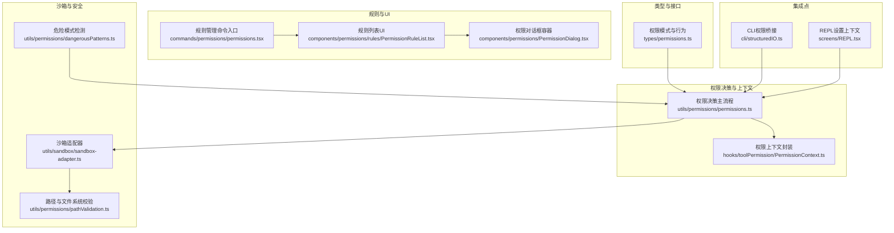
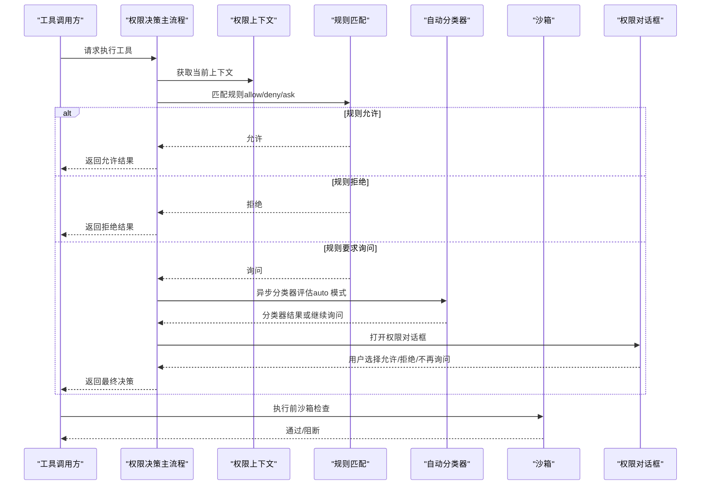
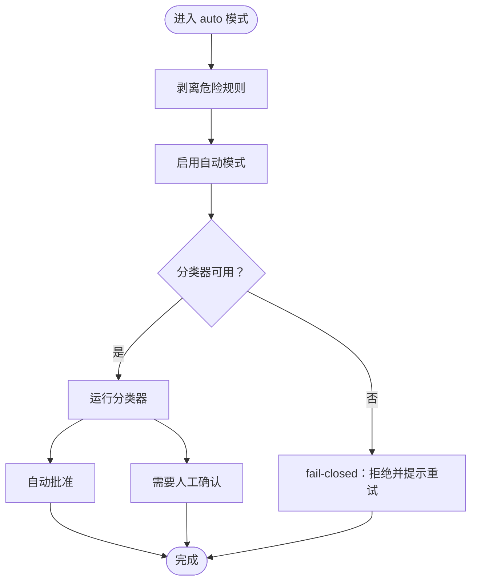
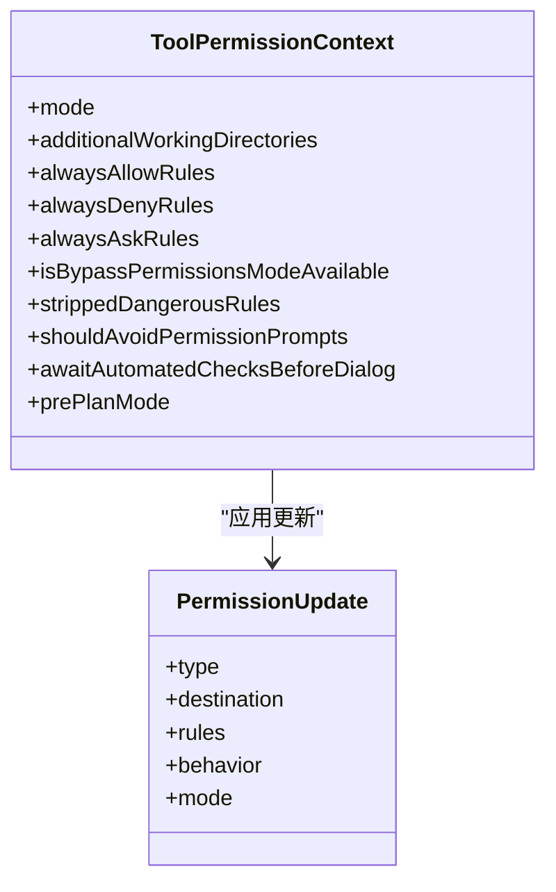
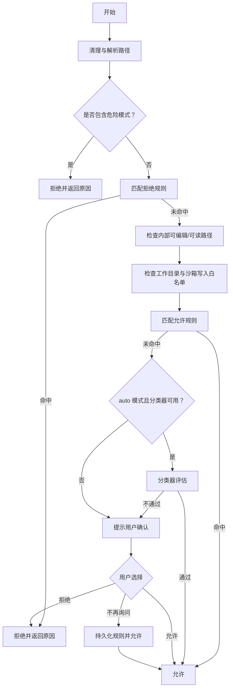
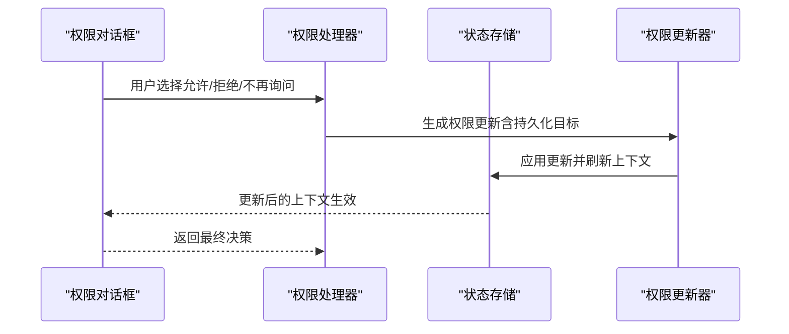
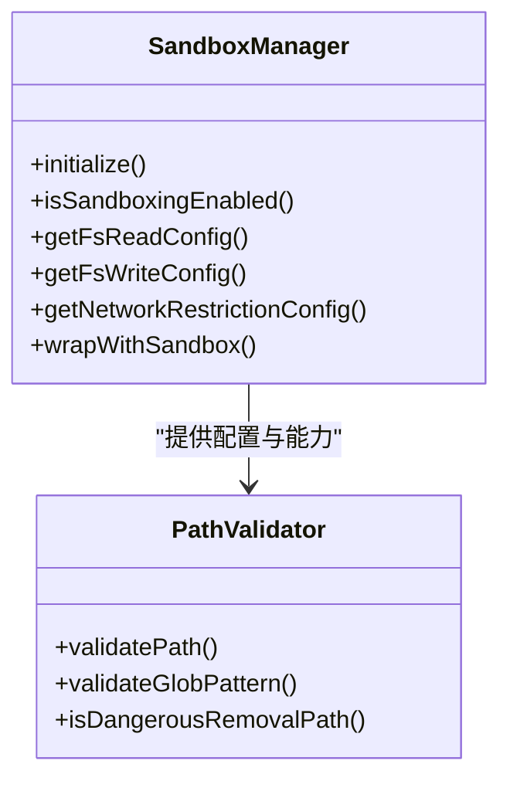
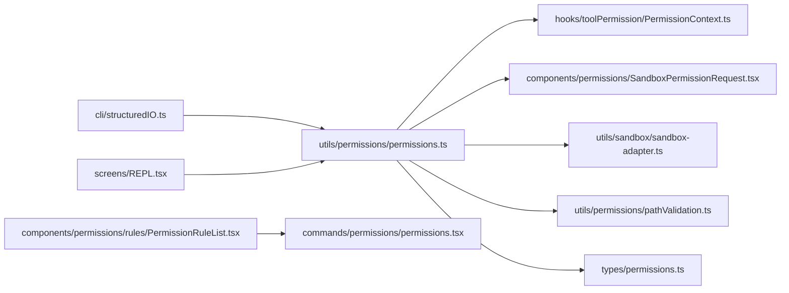

# 权限控制系统

<cite>
**本文档引用的文件**
- [permissions.ts](file://src/utils/permissions/permissions.ts)
- [permissions.tsx](file://src/commands/permissions/permissions.tsx)
- [PermissionRuleList.tsx](file://src/components/permissions/rules/PermissionRuleList.tsx)
- [PermissionDialog.tsx](file://src/components/permissions/PermissionDialog.tsx)
- [SandboxPermissionRequest.tsx](file://src/components/permissions/SandboxPermissionRequest.tsx)
- [sandbox-adapter.ts](file://src/utils/sandbox/sandbox-adapter.ts)
- [pathValidation.ts](file://src/utils/permissions/pathValidation.ts)
- [dangerousPatterns.ts](file://src/utils/permissions/dangerousPatterns.ts)
- [PermissionContext.ts](file://src/hooks/toolPermission/PermissionContext.ts)
- [permissions.ts](file://src/types/permissions.ts)
- [structuredIO.ts](file://src/cli/structuredIO.ts)
- [REPL.tsx](file://src/screens/REPL.tsx)
</cite>

## 目录
1. [简介](#简介)
2. [项目结构](#项目结构)
3. [核心组件](#核心组件)
4. [架构总览](#架构总览)
5. [详细组件分析](#详细组件分析)
6. [依赖关系分析](#依赖关系分析)
7. [性能考虑](#性能考虑)
8. [故障排除指南](#故障排除指南)
9. [结论](#结论)

## 简介
本文件系统性阐述 Claude Code 的工具权限控制系统，覆盖权限模式（auto、ask、deny）、权限规则体系、自动分类器工作原理、工具权限检查流程、权限规则配置方法、权限提示对话框实现、沙箱机制与安全限制，以及配置示例与故障排除建议。目标是帮助开发者与使用者全面理解权限控制的设计与运行机制。

## 项目结构
权限控制相关代码主要分布在以下模块：
- 类型定义与模式：types/permissions.ts
- 权限上下文与决策：utils/permissions/permissions.ts、hooks/toolPermission/PermissionContext.ts
- 规则与配置界面：components/permissions/rules/PermissionRuleList.tsx、commands/permissions/permissions.tsx
- 沙箱与安全限制：utils/sandbox/sandbox-adapter.ts、utils/permissions/pathValidation.ts
- 危险模式与自动模式：utils/permissions/dangerousPatterns.ts、utils/permissions/permissionSetup.ts
- CLI 与 REPL 集成：cli/structuredIO.ts、screens/REPL.tsx

**图表来源**
- [permissions.ts:1-200](file://src/utils/permissions/permissions.ts#L1-L200)
- [PermissionContext.ts:1-389](file://src/hooks/toolPermission/PermissionContext.ts#L1-L389)
- [PermissionRuleList.tsx:471-835](file://src/components/permissions/rules/PermissionRuleList.tsx#L471-L835)
- [sandbox-adapter.ts:1-200](file://src/utils/sandbox/sandbox-adapter.ts#L1-L200)
- [pathValidation.ts:1-486](file://src/utils/permissions/pathValidation.ts#L1-L486)
- [dangerousPatterns.ts:1-81](file://src/utils/permissions/dangerousPatterns.ts#L1-L81)
- [structuredIO.ts:723-753](file://src/cli/structuredIO.ts#L723-L753)
- [REPL.tsx:2340-4710](file://src/screens/REPL.tsx#L2340-L4710)

**章节来源**
- [permissions.ts:1-200](file://src/utils/permissions/permissions.ts#L1-L200)
- [permissions.ts:1-442](file://src/types/permissions.ts#L1-L442)

## 核心组件
- 权限模式与行为
  - 模式：acceptEdits、bypassPermissions、default、dontAsk、plan、auto（可选）
  - 行为：allow、deny、ask
- 权限规则
  - 规则值包含工具名与可选内容（如 Bash(python:*)），支持多来源（用户设置、项目设置、本地设置、策略等）
  - 支持添加/替换/移除规则，以及设置模式、工作目录增删
- 权限决策结果
  - 允许（可携带更新后的输入、用户修改标记、决策原因）
  - 提示（携带消息、建议、阻断路径、元数据、异步分类器检查）
  - 拒绝（携带消息与决策原因）
- 沙箱与安全
  - 文件系统读写限制、网络主机白名单、UNIX 套接字与本地绑定控制
  - 路径解析与安全校验（UNC、波浪号变体、通配符、路径穿越）

**章节来源**
- [permissions.ts:16-132](file://src/types/permissions.ts#L16-L132)
- [permissions.ts:152-325](file://src/types/permissions.ts#L152-L325)
- [sandbox-adapter.ts:172-200](file://src/utils/sandbox/sandbox-adapter.ts#L172-L200)
- [pathValidation.ts:141-263](file://src/utils/permissions/pathValidation.ts#L141-L263)

## 架构总览
权限控制采用“规则驱动 + 自动分类器 + 沙箱约束”的分层设计：
- 规则层：按来源聚合规则，匹配允许/拒绝/询问
- 分类器层：在 auto 模式下对敏感操作进行自动判定，降低人工干预
- 沙箱层：强制执行文件系统与网络访问限制，阻断越权行为
- UI 层：规则编辑、权限请求对话框、沙箱网络请求确认

**图表来源**
- [permissions.ts:846-876](file://src/utils/permissions/permissions.ts#L846-L876)
- [PermissionContext.ts:174-215](file://src/hooks/toolPermission/PermissionContext.ts#L174-L215)
- [SandboxPermissionRequest.tsx:1-163](file://src/components/permissions/SandboxPermissionRequest.tsx#L1-L163)

## 详细组件分析

### 权限模式与自动分类器
- 权限模式
  - default/dontAsk/acceptEdits/bypassPermissions/plan/auto 等模式影响默认决策与提示触发
  - auto 模式下会剥离可能绕过分类器的危险规则，并在分类器不可用时采取 fail-closed 或 fail-open 策略
- 自动分类器
  - 在 Bash 等敏感工具上，若存在待评估的分类器检查，可在对话前尝试自动批准
  - 分类器失败时根据策略返回拒绝并提示重试，或回退到常规权限流程

**图表来源**
- [permissions.ts:846-876](file://src/utils/permissions/permissions.ts#L846-L876)
- [permissions.ts:505-560](file://src/utils/permissions/permissionSetup.ts#L505-L560)

**章节来源**
- [permissions.ts:505-560](file://src/utils/permissions/permissionSetup.ts#L505-L560)
- [permissions.ts:846-876](file://src/utils/permissions/permissions.ts#L846-L876)

### 权限规则系统与配置
- 规则来源与持久化
  - 支持用户设置、项目设置、本地设置、策略设置、命令行参数、会话等来源
  - 支持添加/替换/移除规则，以及设置模式、工作目录增删
- 规则列表 UI
  - 提供“最近拒绝”、“允许”等标签页，支持批量审批与重试
  - 审批后自动应用更新并刷新队列中的待确认项

**图表来源**
- [permissions.ts:414-442](file://src/types/permissions.ts#L414-L442)
- [permissions.ts:49-83](file://src/utils/permissions/PermissionUpdate.ts#L49-L83)
- [REPL.tsx:2345-2375](file://src/screens/REPL.tsx#L2345-L2375)

**章节来源**
- [permissions.ts:49-83](file://src/utils/permissions/PermissionUpdate.ts#L49-L83)
- [PermissionRuleList.tsx:471-835](file://src/components/permissions/rules/PermissionRuleList.tsx#L471-L835)
- [REPL.tsx:2345-2375](file://src/screens/REPL.tsx#L2345-L2375)

### 工具权限检查流程
- 输入验证与预处理
  - 清理路径、展开波浪号、处理 UNC、通配符与路径穿越
  - 对写/创建操作进行危险路径检测（如根目录、家目录、Windows 驱动器根）
- 规则匹配
  - 优先匹配拒绝规则；再检查内部可编辑/可读路径；随后工作目录与沙箱写入白名单；最后允许规则
- 自动分类器与沙箱
  - auto 模式下尝试分类器自动批准；网络请求通过沙箱回调向宿主发起权限请求
- 用户交互
  - 弹出权限对话框，支持“允许/不再询问/拒绝”，并记录反馈

**图表来源**
- [pathValidation.ts:373-486](file://src/utils/permissions/pathValidation.ts#L373-L486)
- [permissions.ts:137-200](file://src/utils/permissions/permissions.ts#L137-L200)
- [SandboxPermissionRequest.tsx:1-163](file://src/components/permissions/SandboxPermissionRequest.tsx#L1-L163)

**章节来源**
- [pathValidation.ts:141-263](file://src/utils/permissions/pathValidation.ts#L141-L263)
- [permissions.ts:137-200](file://src/utils/permissions/permissions.ts#L137-L200)

### 权限提示对话框实现
- 组件职责
  - PermissionDialog 提供统一的对话框容器样式与标题区域
  - 各具体权限请求组件（如 Bash、FileEdit、WebFetch）负责展示操作详情与选项
- 用户选择处理
  - 支持“允许”、“不再询问（仅网络）”、“拒绝并反馈”
  - 将用户选择转换为权限更新（如添加规则），并持久化到相应来源
- 与分类器联动
  - 若存在 pendingClassifierCheck，可在对话前尝试自动批准

**图表来源**
- [PermissionDialog.tsx:1-72](file://src/components/permissions/PermissionDialog.tsx#L1-L72)
- [SandboxPermissionRequest.tsx:1-163](file://src/components/permissions/SandboxPermissionRequest.tsx#L1-L163)
- [PermissionContext.ts:139-147](file://src/hooks/toolPermission/PermissionContext.ts#L139-L147)

**章节来源**
- [PermissionDialog.tsx:1-72](file://src/components/permissions/PermissionDialog.tsx#L1-L72)
- [SandboxPermissionRequest.tsx:1-163](file://src/components/permissions/SandboxPermissionRequest.tsx#L1-L163)
- [PermissionContext.ts:139-147](file://src/hooks/toolPermission/PermissionContext.ts#L139-L147)

### 沙箱机制与安全限制
- 文件系统访问控制
  - 读/写限制配置、拒绝在允许范围内的路径（denyWithinAllow）
  - 写入操作在外工作目录时，需 acceptEdits 模式或明确允许规则
- 网络请求限制
  - 通过 createSandboxAskCallback 将网络请求转发给宿主进行权限确认
  - 可配置仅允许受管域名或策略域
- 命令执行保护
  - 排除命令列表、弱嵌套沙箱开关、代理端口与 SOCKS 配置
  - 与危险模式检测配合，阻止高风险命令前缀

**图表来源**
- [sandbox-adapter.ts:880-985](file://src/utils/sandbox/sandbox-adapter.ts#L880-L985)
- [pathValidation.ts:141-263](file://src/utils/permissions/pathValidation.ts#L141-L263)

**章节来源**
- [sandbox-adapter.ts:172-200](file://src/utils/sandbox/sandbox-adapter.ts#L172-L200)
- [sandbox-adapter.ts:880-985](file://src/utils/sandbox/sandbox-adapter.ts#L880-L985)
- [pathValidation.ts:373-486](file://src/utils/permissions/pathValidation.ts#L373-L486)

### 危险模式检测与自动模式
- 危险模式检测
  - 列举跨平台与 Bash 特有的危险前缀（如 python、node、ssh、sudo 等）
  - 在 auto 模式进入时剥离可能绕过分类器的规则，避免高危前缀被滥用
- 自动模式状态管理
  - 进入/退出 auto 模式时，保存/恢复危险规则，确保用户体验与安全平衡

**章节来源**
- [dangerousPatterns.ts:14-81](file://src/utils/permissions/dangerousPatterns.ts#L14-L81)
- [permissions.ts:505-560](file://src/utils/permissions/permissionSetup.ts#L505-L560)

## 依赖关系分析

**图表来源**
- [permissions.ts:1-200](file://src/utils/permissions/permissions.ts#L1-L200)
- [PermissionContext.ts:1-389](file://src/hooks/toolPermission/PermissionContext.ts#L1-L389)
- [SandboxPermissionRequest.tsx:1-163](file://src/components/permissions/SandboxPermissionRequest.tsx#L1-L163)
- [sandbox-adapter.ts:1-200](file://src/utils/sandbox/sandbox-adapter.ts#L1-L200)
- [pathValidation.ts:1-486](file://src/utils/permissions/pathValidation.ts#L1-L486)
- [permissions.ts:1-442](file://src/types/permissions.ts#L1-L442)
- [structuredIO.ts:723-753](file://src/cli/structuredIO.ts#L723-L753)
- [REPL.tsx:2340-4710](file://src/screens/REPL.tsx#L2340-L4710)
- [PermissionRuleList.tsx:471-835](file://src/components/permissions/rules/PermissionRuleList.tsx#L471-L835)
- [permissions.tsx:1-9](file://src/commands/permissions/permissions.tsx#L1-L9)

**章节来源**
- [permissions.ts:1-200](file://src/utils/permissions/permissions.ts#L1-L200)
- [permissions.ts:1-442](file://src/types/permissions.ts#L1-L442)

## 性能考虑
- 缓存与去重
  - 路径解析与沙箱配置路径解析使用 memoize，减少重复系统调用
  - 分类器检查与令牌用量统计集中记录，便于分析与优化
- 异步评估
  - 分类器评估与权限对话框并行，减少等待时间
- 规则匹配优化
  - 按优先级短路匹配（拒绝规则优先），避免不必要的后续检查

[本节为通用指导，无需特定文件来源]

## 故障排除指南
- 分类器不可用
  - 现象：auto 模式下分类器不可用，出现“分类器不可用”提示
  - 处理：检查网络与模型服务状态；必要时切换到 ask 模式手动审批
  - 参考：分类器失败时的 fail-closed/fail-open 策略
- 沙箱网络请求被阻断
  - 现象：网络请求被沙箱拦截并弹出确认对话框
  - 处理：在对话框中选择“允许”或“不再询问”，必要时在规则中添加允许域
  - 参考：createSandboxAskCallback 的实现
- 路径校验失败
  - 现象：UNC 路径、波浪号变体、通配符或路径穿越导致拒绝
  - 处理：修正路径格式；对需要的路径在沙箱写入白名单中添加
- 规则未生效
  - 现象：已添加规则但仍然提示
  - 处理：确认规则来源与持久化目标；在 REPL 中重新设置权限上下文以刷新队列

**章节来源**
- [permissions.ts:846-876](file://src/utils/permissions/permissions.ts#L846-L876)
- [structuredIO.ts:723-753](file://src/cli/structuredIO.ts#L723-L753)
- [pathValidation.ts:373-486](file://src/utils/permissions/pathValidation.ts#L373-L486)
- [REPL.tsx:2345-2375](file://src/screens/REPL.tsx#L2345-L2375)

## 结论
该权限控制系统通过“规则 + 分类器 + 沙箱”的分层设计，在保证安全性的同时兼顾了易用性与自动化程度。auto 模式下的智能决策与 fail-closed/fail-open 策略有效降低了误判风险；规则编辑与权限对话框提供了灵活的人工干预通道；沙箱机制则从底层限制了越权行为。结合本文提供的配置示例与故障排除建议，用户可以更高效地管理权限并应对常见问题。