# 代码组织最佳实践

<cite>
**本文档引用的文件**
- [README.md](file://README.md)
- [package.json](file://package.json)
- [src/main.tsx](file://src/main.tsx)
- [src/setup.ts](file://src/setup.ts)
- [src/bootstrap/state.ts](file://src/bootstrap/state.ts)
- [src/commands.ts](file://src/commands.ts)
- [src/tools.ts](file://src/tools.ts)
- [src/services/api/bootstrap.ts](file://src/services/api/bootstrap.ts)
- [src/utils/errors.ts](file://src/utils/errors.ts)
- [src/utils/config.ts](file://src/utils/config.ts)
- [src/utils/log.ts](file://src/utils/log.ts)
- [src/utils/gracefulShutdown.ts](file://src/utils/gracefulShutdown.ts)
- [src/utils/startupProfiler.ts](file://src/utils/startupProfiler.ts)
- [src/entrypoints/init.ts](file://src/entrypoints/init.ts)
</cite>

## 目录
1. [简介](#简介)
2. [项目结构](#项目结构)
3. [核心组件](#核心组件)
4. [架构概览](#架构概览)
5. [详细组件分析](#详细组件分析)
6. [依赖关系分析](#依赖关系分析)
7. [性能考虑](#性能考虑)
8. [故障排除指南](#故障排除指南)
9. [结论](#结论)
10. [附录](#附录)

## 简介

Claude Code 是一个基于 TypeScript 的命令行工具，允许用户通过终端与 Claude AI 进行交互，执行软件工程任务如文件编辑、命令运行、代码搜索、Git 工作流管理等。该项目采用模块化架构设计，具有清晰的代码组织结构和完善的错误处理机制。

本项目的核心特点包括：
- 基于 React 和 Ink 框架的终端用户界面
- 支持多种工具和技能扩展
- 完善的配置管理和状态管理
- 强大的错误处理和优雅关闭机制
- 性能监控和诊断工具

## 项目结构

项目采用按功能域划分的模块化结构，主要目录包含：

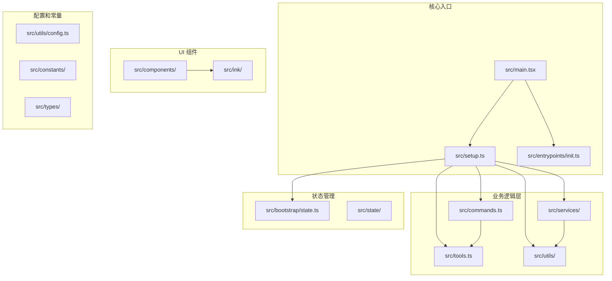

**图表来源**
- [src/main.tsx:1-800](file://src/main.tsx#L1-L800)
- [src/setup.ts:1-478](file://src/setup.ts#L1-L478)
- [src/commands.ts:1-755](file://src/commands.ts#L1-L755)

**章节来源**
- [README.md:95-114](file://README.md#L95-L114)
- [package.json:1-34](file://package.json#L1-L34)

## 核心组件

### 启动流程管理

启动流程采用分阶段初始化策略，确保关键组件在正确时机加载：

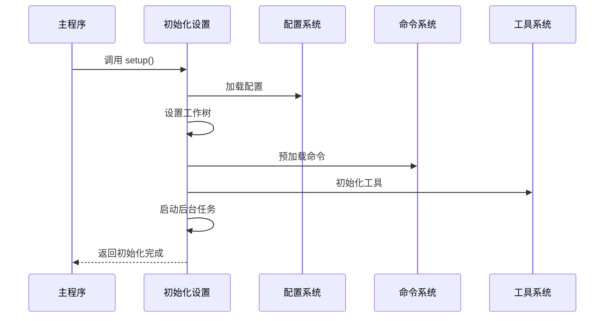

**图表来源**
- [src/main.tsx:585-800](file://src/main.tsx#L585-L800)
- [src/setup.ts:56-478](file://src/setup.ts#L56-L478)

### 状态管理系统

状态管理采用集中式设计，通过单一数据源保证状态一致性：

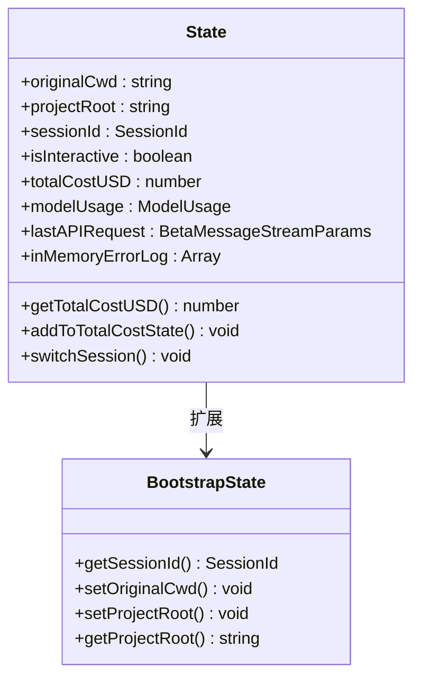

**图表来源**
- [src/bootstrap/state.ts:45-257](file://src/bootstrap/state.ts#L45-L257)

**章节来源**
- [src/bootstrap/state.ts:1-800](file://src/bootstrap/state.ts#L1-L800)
- [src/main.tsx:1-800](file://src/main.tsx#L1-L800)

## 架构概览

项目采用分层架构设计，各层职责明确：

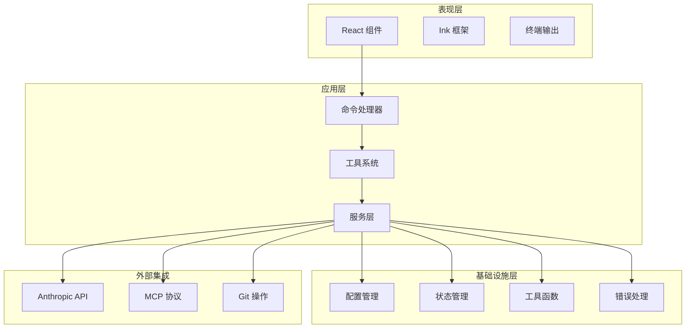

**图表来源**
- [src/commands.ts:258-470](file://src/commands.ts#L258-L470)
- [src/tools.ts:193-390](file://src/tools.ts#L193-L390)

## 详细组件分析

### 命令系统设计

命令系统采用动态加载和缓存机制，支持插件扩展：

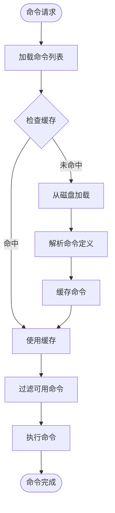

**图表来源**
- [src/commands.ts:449-517](file://src/commands.ts#L449-L517)

命令系统的特性包括：
- **动态加载**：支持插件和技能的动态发现
- **权限控制**：基于用户权限和环境变量的命令过滤
- **缓存机制**：避免重复的磁盘 I/O 操作
- **类型安全**：完整的 TypeScript 类型定义

**章节来源**
- [src/commands.ts:1-755](file://src/commands.ts#L1-L755)

### 工具系统架构

工具系统采用统一接口设计，支持内置工具和 MCP 工具的统一管理：

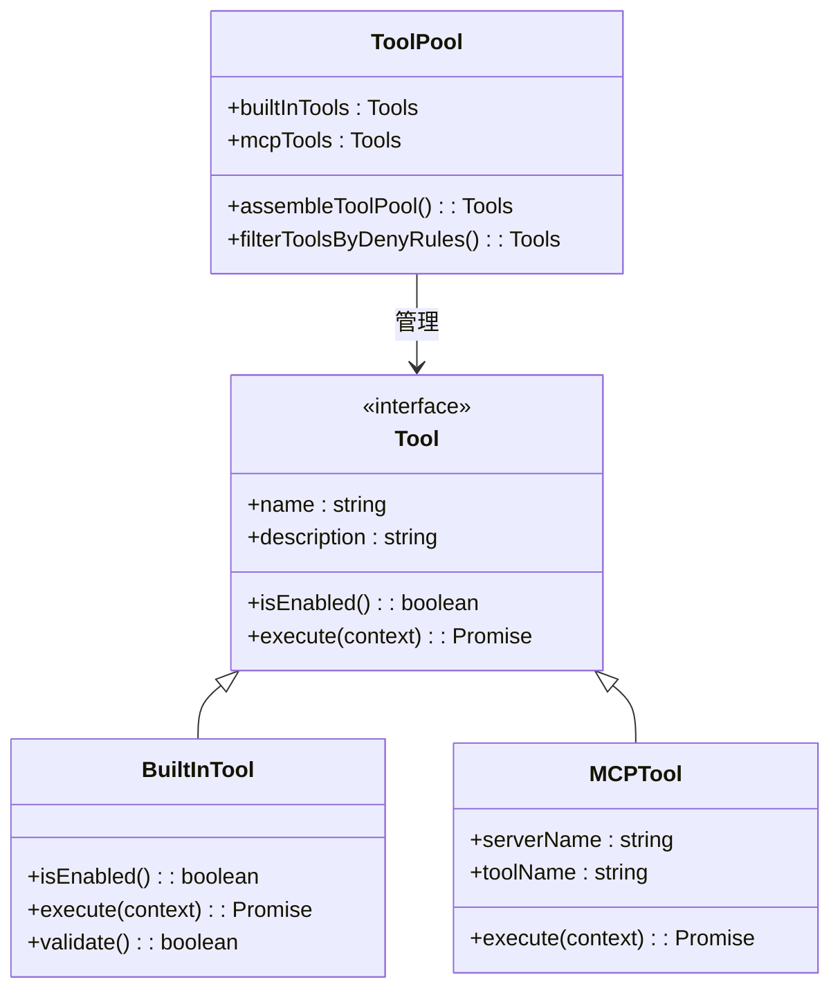

**图表来源**
- [src/tools.ts:193-390](file://src/tools.ts#L193-L390)

工具系统的关键特性：
- **统一接口**：所有工具实现相同的接口
- **权限控制**：基于规则的工具访问控制
- **动态组合**：内置工具和 MCP 工具的统一管理
- **性能优化**：工具池的去重和排序机制

**章节来源**
- [src/tools.ts:1-390](file://src/tools.ts#L1-L390)

### 错误处理和异常管理

项目实现了多层次的错误处理机制：

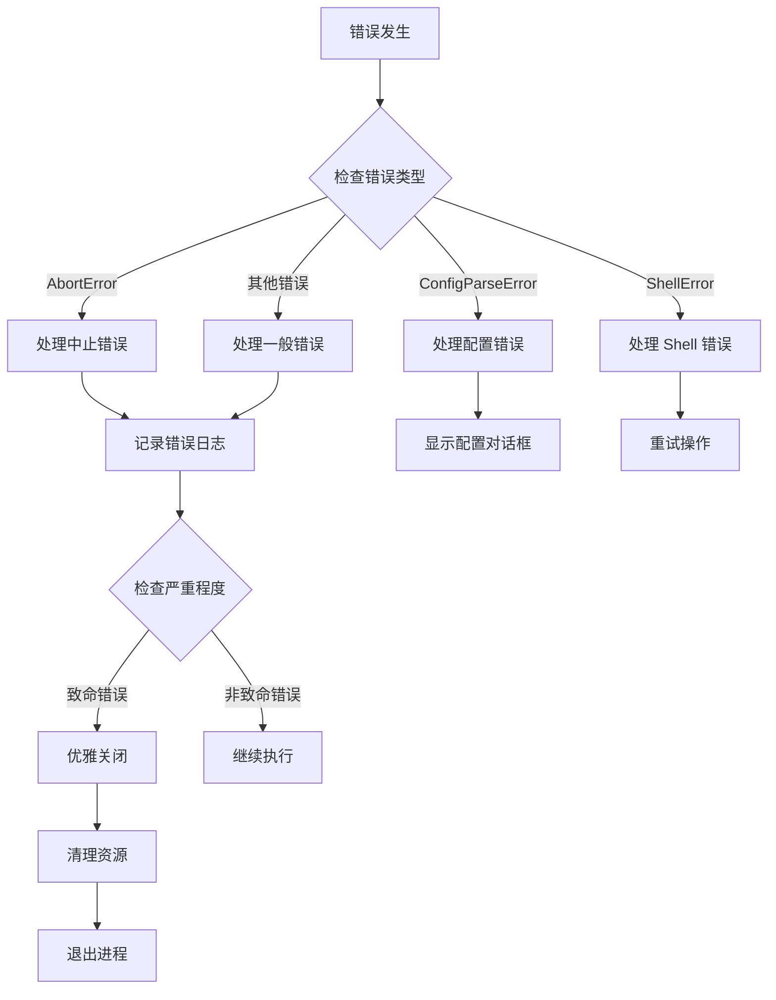

**图表来源**
- [src/utils/errors.ts:1-239](file://src/utils/errors.ts#L1-L239)
- [src/utils/gracefulShutdown.ts:1-530](file://src/utils/gracefulShutdown.ts#L1-L530)

错误处理系统的核心组件：
- **错误分类**：区分不同类型的错误并采取相应处理策略
- **日志记录**：多级日志记录和错误队列管理
- **优雅关闭**：确保资源正确释放和状态保存
- **用户反馈**：针对不同类型错误提供适当的用户提示

**章节来源**
- [src/utils/errors.ts:1-239](file://src/utils/errors.ts#L1-L239)
- [src/utils/gracefulShutdown.ts:1-530](file://src/utils/gracefulShutdown.ts#L1-L530)

### 配置管理系统

配置系统采用分层设计，支持全局和项目级别的配置：

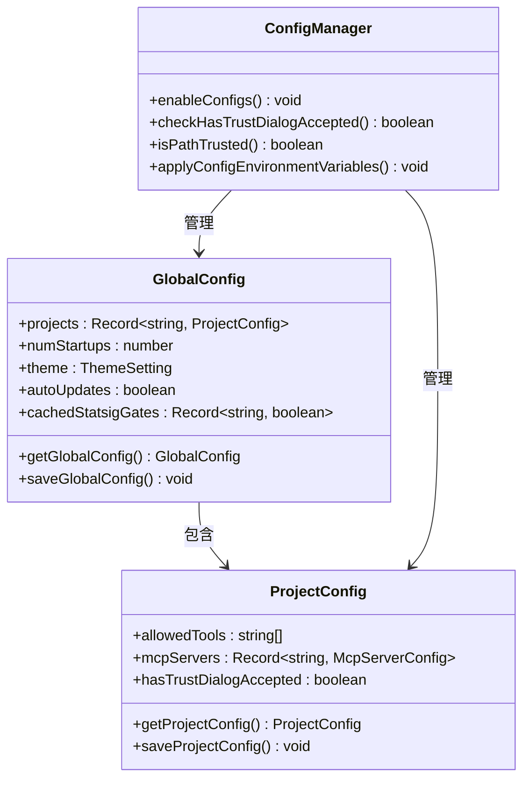

**图表来源**
- [src/utils/config.ts:183-578](file://src/utils/config.ts#L183-L578)

配置管理系统的特性：
- **分层存储**：全局配置和项目配置分离
- **动态加载**：按需加载和缓存配置数据
- **权限验证**：信任对话框和路径信任检查
- **环境变量**：支持从配置文件注入环境变量

**章节来源**
- [src/utils/config.ts:1-800](file://src/utils/config.ts#L1-L800)

## 依赖关系分析

项目采用模块化的依赖管理策略：

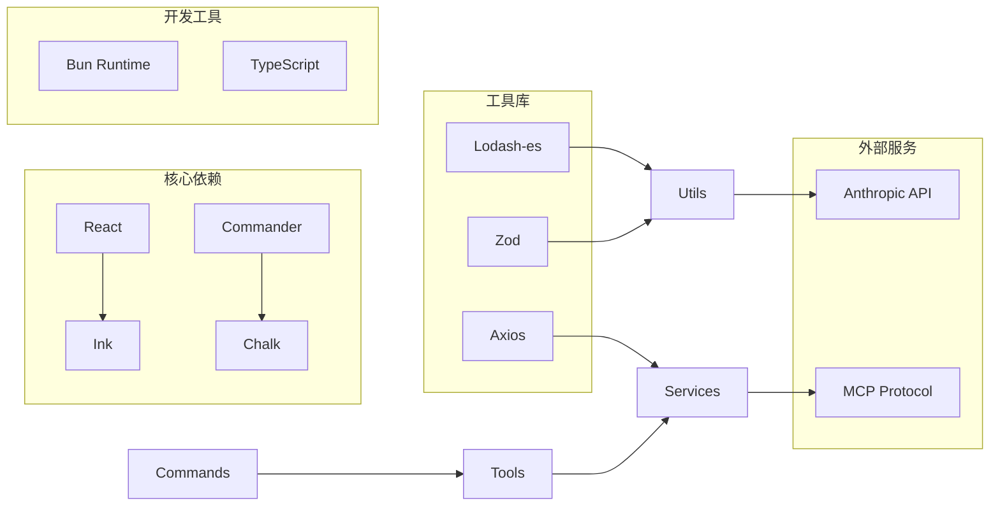

**图表来源**
- [package.json:18-33](file://package.json#L18-L33)

**章节来源**
- [package.json:1-34](file://package.json#L1-L34)

## 性能考虑

### 启动性能优化

项目实现了多层性能优化策略：

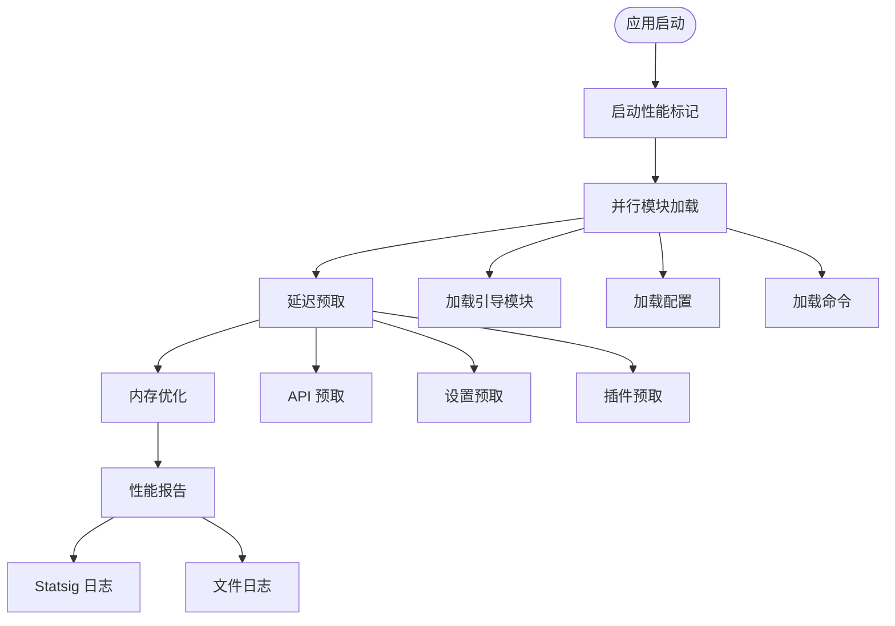

**图表来源**
- [src/utils/startupProfiler.ts:1-195](file://src/utils/startupProfiler.ts#L1-L195)
- [src/main.tsx:388-431](file://src/main.tsx#L388-L431)

性能优化的关键措施：
- **并行加载**：多个模块同时加载减少启动时间
- **延迟预取**：在首次渲染后进行耗时操作
- **内存快照**：详细的内存使用情况监控
- **性能采样**：统计和分析启动性能数据

**章节来源**
- [src/utils/startupProfiler.ts:1-195](file://src/utils/startupProfiler.ts#L1-L195)
- [src/main.tsx:388-431](file://src/main.tsx#L388-L431)

### 内存管理策略

项目采用多种内存管理技术：

- **懒加载**：大型模块按需加载，减少初始内存占用
- **缓存机制**：命令和工具列表的智能缓存
- **垃圾回收优化**：及时释放不再使用的对象引用
- **内存监控**：实时监控内存使用情况

## 故障排除指南

### 常见问题诊断

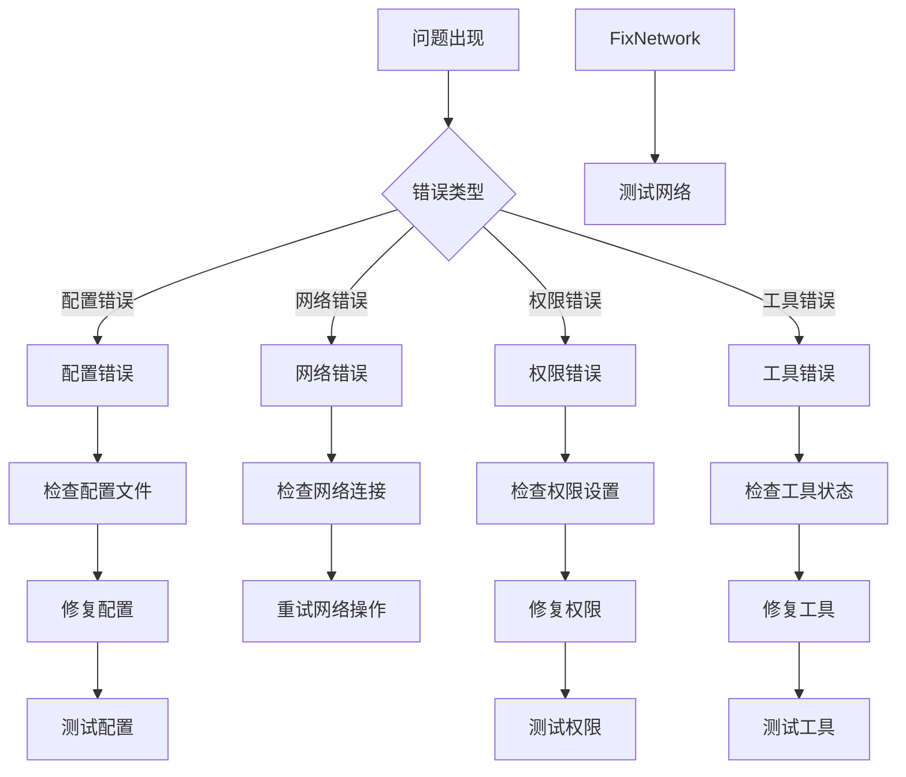

**图表来源**
- [src/utils/errors.ts:197-239](file://src/utils/errors.ts#L197-L239)
- [src/utils/log.ts:158-200](file://src/utils/log.ts#L158-L200)

### 调试和诊断工具

项目提供了丰富的调试工具：

- **详细日志**：通过 `--debug` 参数启用详细日志记录
- **性能分析**：启动性能报告和内存使用分析
- **错误追踪**：完整的错误堆栈跟踪和上下文信息
- **状态监控**：实时监控应用状态和资源使用情况

**章节来源**
- [src/utils/log.ts:136-200](file://src/utils/log.ts#L136-L200)
- [src/utils/startupProfiler.ts:81-145](file://src/utils/startupProfiler.ts#L81-L145)

## 结论

Claude Code 项目展现了优秀的代码组织实践，其架构设计体现了以下最佳实践：

1. **模块化设计**：清晰的功能域划分和职责分离
2. **异步架构**：充分利用 Promise 和 async/await 实现非阻塞操作
3. **错误处理**：多层次的错误处理和恢复机制
4. **性能优化**：从启动到运行的全方位性能优化策略
5. **可扩展性**：插件和工具系统的灵活扩展能力
6. **可观测性**：完善的日志记录和性能监控

这些实践为构建大型命令行工具提供了宝贵的参考，特别是在处理复杂业务逻辑、多平台兼容性和用户体验优化方面。

## 附录

### 代码审查清单

#### 可读性检查
- [ ] 函数和变量命名是否清晰表达意图
- [ ] 注释是否充分解释复杂的业务逻辑
- [ ] 代码结构是否符合单一职责原则
- [ ] 是否存在重复代码需要重构

#### 安全性评估
- [ ] 用户输入是否经过适当的验证和清理
- [ ] 文件系统操作是否有适当的权限检查
- [ ] API 调用是否包含错误处理
- [ ] 敏感信息是否正确处理和隐藏

#### 可维护性评分
- [ ] 依赖关系是否清晰且合理
- [ ] 测试覆盖率是否足够
- [ ] 配置管理是否灵活
- [ ] 文档是否完整更新

#### 团队协作规范
- [ ] 代码风格是否一致
- [ ] 提交消息是否规范
- [ ] 分支管理策略是否明确
- [ ] 代码评审流程是否严格执行