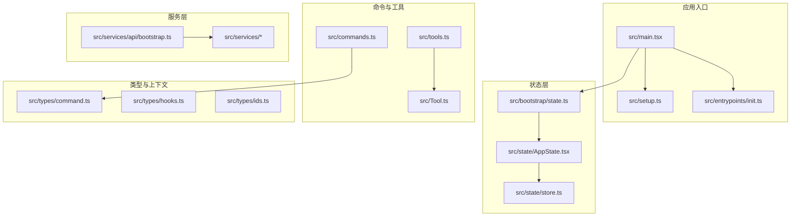
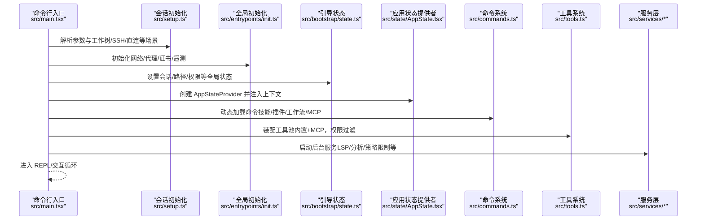
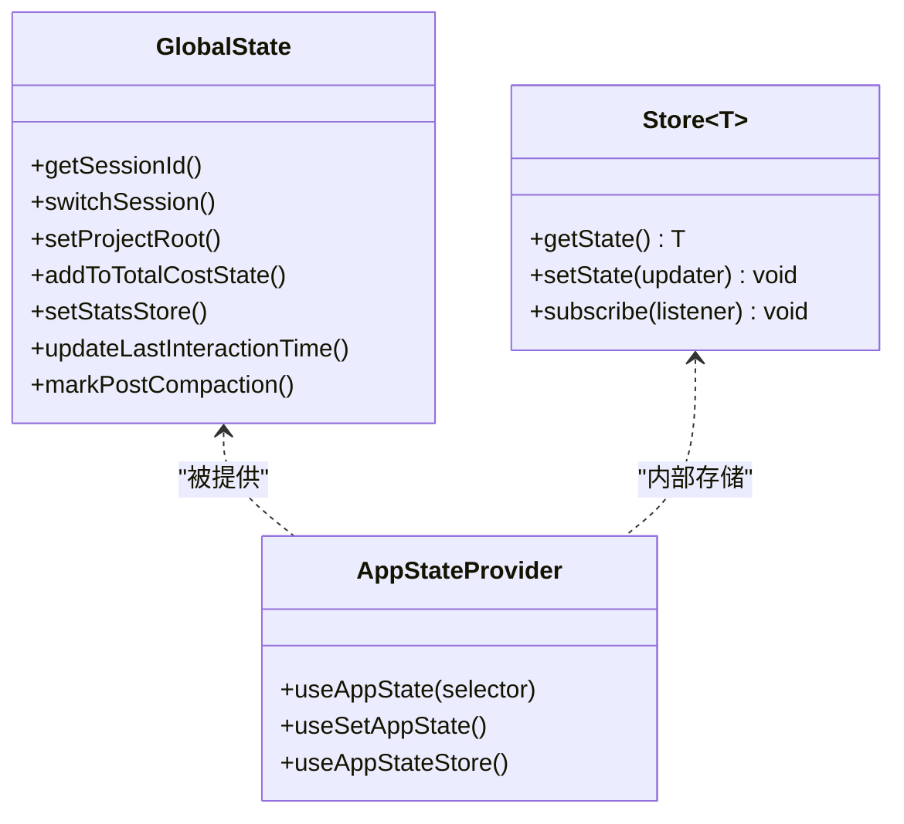
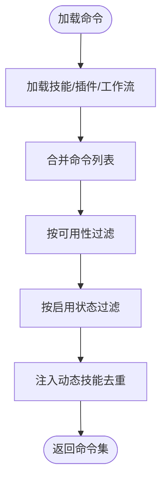
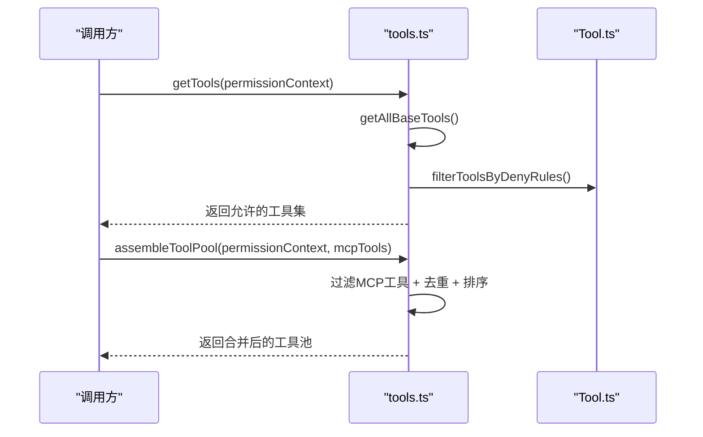
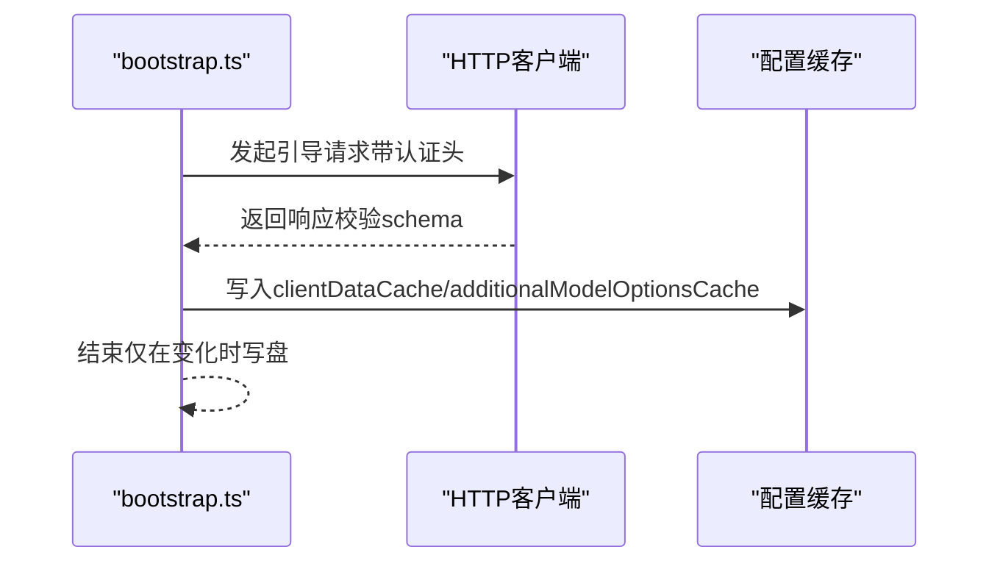
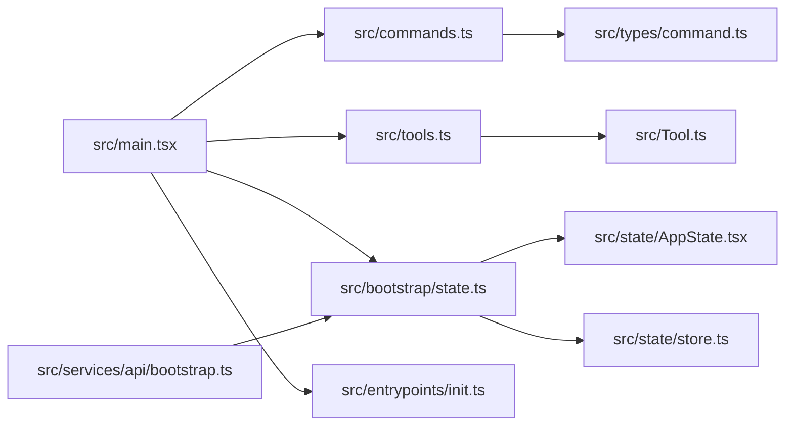

# 代码结构与组织

<cite>
**本文档引用的文件**
- [README.md](file://README.md)
- [package.json](file://package.json)
- [src/main.tsx](file://src/main.tsx)
- [src/setup.ts](file://src/setup.ts)
- [src/bootstrap/state.ts](file://src/bootstrap/state.ts)
- [src/state/AppState.tsx](file://src/state/AppState.tsx)
- [src/state/store.ts](file://src/state/store.ts)
- [src/commands.ts](file://src/commands.ts)
- [src/tools.ts](file://src/tools.ts)
- [src/Tool.ts](file://src/Tool.ts)
- [src/types/command.ts](file://src/types/command.ts)
- [src/types/hooks.ts](file://src/types/hooks.ts)
- [src/types/ids.ts](file://src/types/ids.ts)
- [src/services/api/bootstrap.ts](file://src/services/api/bootstrap.ts)
- [src/entrypoints/init.ts](file://src/entrypoints/init.ts)
- [src/components/App.tsx](file://src/components/App.tsx)
</cite>

## 目录
1. [简介](#简介)
2. [项目结构](#项目结构)
3. [核心组件](#核心组件)
4. [架构总览](#架构总览)
5. [详细组件分析](#详细组件分析)
6. [依赖分析](#依赖分析)
7. [性能考虑](#性能考虑)
8. [故障排除指南](#故障排除指南)
9. [结论](#结论)

## 简介
本指南面向 Claude Code 的 TypeScript 源码仓库，系统性阐述其模块化设计理念与分层架构，覆盖引导模块、状态管理、服务层、UI 组件、工具系统、命令系统等核心目录的职责边界与协作方式；同时给出 TypeScript 项目结构中的类型定义、接口设计与模块导入导出规范，并提供代码组织最佳实践与新增功能模块的实际示例路径。

## 项目结构
项目采用按“职责领域”划分的模块化组织方式，核心目录如下：
- src/bootstrap：应用启动阶段的状态初始化与全局状态入口
- src/state：应用状态容器与 React 状态提供者
- src/services：核心业务服务（API、分析、策略限制、OAuth、MCP 等）
- src/commands：命令实现与动态加载机制
- src/tools：工具实现（文件编辑、搜索、终端、任务、MCP 工具等）
- src/components：UI 组件与 Ink 渲染体系
- src/types：类型定义与接口规范
- src/utils：通用工具函数与运行时能力
- 其他：hooks、entrypoints、constants、context、entrypoints 等

**图表来源**
- [src/main.tsx](file://src/main.tsx)
- [src/setup.ts](file://src/setup.ts)
- [src/entrypoints/init.ts](file://src/entrypoints/init.ts)
- [src/bootstrap/state.ts](file://src/bootstrap/state.ts)
- [src/state/AppState.tsx](file://src/state/AppState.tsx)
- [src/state/store.ts](file://src/state/store.ts)
- [src/commands.ts](file://src/commands.ts)
- [src/tools.ts](file://src/tools.ts)
- [src/Tool.ts](file://src/Tool.ts)
- [src/services/api/bootstrap.ts](file://src/services/api/bootstrap.ts)
- [src/types/command.ts](file://src/types/command.ts)
- [src/types/hooks.ts](file://src/types/hooks.ts)
- [src/types/ids.ts](file://src/types/ids.ts)

**章节来源**
- [README.md](file://README.md)
- [package.json](file://package.json)

## 核心组件
- 引导与启动
  - main.tsx：应用入口，负责早期环境准备、特性开关、延迟预取、命令与插件加载、会话初始化等
  - setup.ts：会话级初始化流程，包括工作树模式、消息通道、钩子快照、插件钩子热加载等
  - entrypoints/init.ts：全局初始化，配置网络代理、证书、遥测、清理注册等
- 状态管理
  - bootstrap/state.ts：全局会话状态（路径、计费、指标、权限、MCP 配置等），提供读写访问器
  - state/AppState.tsx：React 应用状态提供者，结合 useAppState/useSetAppState 提供订阅式状态更新
  - state/store.ts：轻量级 Store 实现，支持 getState/setState/subscribe
- 命令系统
  - commands.ts：命令聚合与动态加载，支持技能、插件、工作流、MCP 技能的统一装载与可用性过滤
  - types/command.ts：命令类型定义（prompt/local/local-jsx），包含描述、参数、执行上下文、可见性控制等
- 工具系统
  - tools.ts：内置工具集合与装配逻辑，支持简单模式、REPL 包装、MCP 工具合并、权限规则过滤
  - Tool.ts：工具抽象与默认行为，定义工具输入输出、权限校验、进度渲染、结果渲染等契约
- 服务层
  - services/api/bootstrap.ts：从后端拉取引导数据并缓存到磁盘，用于模型选项与客户端数据
- 类型与上下文
  - types/hooks.ts：钩子协议与响应类型，涵盖同步/异步钩子、权限请求、文件变更、会话事件等
  - types/ids.ts：会话 ID 与代理 ID 的品牌化类型，避免混用
  - components/App.tsx：顶层应用包装器，注入 FPS、统计与状态上下文

**章节来源**
- [src/main.tsx](file://src/main.tsx)
- [src/setup.ts](file://src/setup.ts)
- [src/entrypoints/init.ts](file://src/entrypoints/init.ts)
- [src/bootstrap/state.ts](file://src/bootstrap/state.ts)
- [src/state/AppState.tsx](file://src/state/AppState.tsx)
- [src/state/store.ts](file://src/state/store.ts)
- [src/commands.ts](file://src/commands.ts)
- [src/tools.ts](file://src/tools.ts)
- [src/Tool.ts](file://src/Tool.ts)
- [src/services/api/bootstrap.ts](file://src/services/api/bootstrap.ts)
- [src/types/command.ts](file://src/types/command.ts)
- [src/types/hooks.ts](file://src/types/hooks.ts)
- [src/types/ids.ts](file://src/types/ids.ts)
- [src/components/App.tsx](file://src/components/App.tsx)

## 架构总览
下图展示了从应用入口到状态、命令、工具与服务的整体调用链路与职责分工：

**图表来源**
- [src/main.tsx](file://src/main.tsx)
- [src/setup.ts](file://src/setup.ts)
- [src/entrypoints/init.ts](file://src/entrypoints/init.ts)
- [src/bootstrap/state.ts](file://src/bootstrap/state.ts)
- [src/state/AppState.tsx](file://src/state/AppState.tsx)
- [src/commands.ts](file://src/commands.ts)
- [src/tools.ts](file://src/tools.ts)

## 详细组件分析

### 引导与状态模块
- 全局状态
  - bootstrap/state.ts 提供会话级全局状态与读写方法，包括路径、成本、指标、权限、MCP 配置、计划/技能缓存、慢操作记录等
  - 使用随机 UUID 生成会话 ID，并提供切换会话、重置成本等操作
- React 应用状态
  - state/AppState.tsx 将全局状态注入 React 树，提供 useAppState/useSetAppState/useAppStateStore 订阅式访问
  - state/store.ts 提供最小 Store 实现，支持 setState、subscribe 与 onChange 回调
- 典型流程
  - main.tsx 在启动早期设置特性开关、并行预取、命令与插件加载
  - setup.ts 在会话维度完成工作树、钩子快照、插件钩子热加载等
  - entrypoints/init.ts 完成网络、证书、代理、遥测等全局初始化

**图表来源**
- [src/bootstrap/state.ts](file://src/bootstrap/state.ts)
- [src/state/store.ts](file://src/state/store.ts)
- [src/state/AppState.tsx](file://src/state/AppState.tsx)

**章节来源**
- [src/bootstrap/state.ts](file://src/bootstrap/state.ts)
- [src/state/AppState.tsx](file://src/state/AppState.tsx)
- [src/state/store.ts](file://src/state/store.ts)
- [src/main.tsx](file://src/main.tsx)
- [src/setup.ts](file://src/setup.ts)
- [src/entrypoints/init.ts](file://src/entrypoints/init.ts)

### 命令系统
- 命令聚合与动态加载
  - commands.ts 聚合所有命令源（内置、技能目录、插件、工作流、MCP），并通过 memoize 缓存以降低 I/O 成本
  - 支持按可用性（auth/provider）与启用状态过滤，动态技能去重插入
- 命令类型与元信息
  - types/command.ts 定义命令类型（prompt/local/local-jsx），包含描述、别名、可见性、是否可被模型调用、来源（builtin/plugin/bundled/mcp）等
- 远程安全命令
  - 提供 REMOTE_SAFE_COMMANDS 与 BRIDGE_SAFE_COMMANDS，确保远程模式下仅允许本地无副作用命令

**图表来源**
- [src/commands.ts](file://src/commands.ts)
- [src/types/command.ts](file://src/types/command.ts)

**章节来源**
- [src/commands.ts](file://src/commands.ts)
- [src/types/command.ts](file://src/types/command.ts)

### 工具系统
- 工具装配与权限过滤
  - tools.ts 提供 getAllBaseTools/getTools/assembleToolPool/getMergedTools 等装配函数，支持简单模式、REPL 包装、MCP 工具合并与权限规则过滤
- 工具抽象
  - Tool.ts 定义工具契约：输入/输出模式、权限检查、并发安全、只读/破坏性标记、进度与结果渲染、拒绝/错误 UI 等
- 典型流程
  - getTools() 根据权限上下文过滤内置工具
  - assembleToolPool() 合并内置与 MCP 工具，保持内置工具前缀连续以稳定提示缓存键

**图表来源**
- [src/tools.ts](file://src/tools.ts)
- [src/Tool.ts](file://src/Tool.ts)

**章节来源**
- [src/tools.ts](file://src/tools.ts)
- [src/Tool.ts](file://src/Tool.ts)

### 服务层与 API
- 引导数据拉取
  - services/api/bootstrap.ts 通过 OAuth 或 API Key 拉取引导数据，解析并缓存到全局配置，避免每次启动重复写盘
- 其他服务
  - entrypoints/init.ts 中初始化 LSP 管理器、OAuth 账户信息、代理/证书、遥测等

**图表来源**
- [src/services/api/bootstrap.ts](file://src/services/api/bootstrap.ts)

**章节来源**
- [src/services/api/bootstrap.ts](file://src/services/api/bootstrap.ts)
- [src/entrypoints/init.ts](file://src/entrypoints/init.ts)

## 依赖分析
- 模块耦合与内聚
  - commands.ts 与 tools.ts 分别对命令与工具进行集中装配，降低上层调用方的复杂度
  - Tool.ts 与 types/command.ts 提供强类型约束，保证工具与命令的契约一致
  - bootstrap/state.ts 作为全局状态中心，被多处模块读取/修改，需谨慎维护其稳定性
- 外部依赖与集成点
  - package.json 显示项目为模块化包，使用 Bun 打包特性（如 feature 标记）进行死代码消除
  - 通过入口脚本 bin/cli.js 提供 CLI 能力，实际源码位于 src/main.tsx

**图表来源**
- [src/main.tsx](file://src/main.tsx)
- [src/commands.ts](file://src/commands.ts)
- [src/tools.ts](file://src/tools.ts)
- [src/bootstrap/state.ts](file://src/bootstrap/state.ts)
- [src/state/AppState.tsx](file://src/state/AppState.tsx)
- [src/state/store.ts](file://src/state/store.ts)
- [src/services/api/bootstrap.ts](file://src/services/api/bootstrap.ts)
- [src/entrypoints/init.ts](file://src/entrypoints/init.ts)

**章节来源**
- [package.json](file://package.json)
- [src/main.tsx](file://src/main.tsx)

## 性能考虑
- 启动性能
  - main.tsx 中对部分初始化步骤进行并行预取与延迟加载，减少首屏阻塞
  - setup.ts 对插件钩子与技能索引进行懒加载与缓存，避免重复 I/O
- 工具与命令装配
  - commands.ts 与 tools.ts 使用 memoize 缓存昂贵的装载过程，显著降低重复加载开销
- 遥测与网络
  - entrypoints/init.ts 在网络配置完成后进行 API 预连接，缩短首次请求延迟
  - services/api/bootstrap.ts 仅在数据变化时写盘缓存，避免频繁磁盘写入

[本节为通用指导，不直接分析具体文件]

## 故障排除指南
- 配置错误
  - entrypoints/init.ts 在非交互模式下遇到配置解析错误会直接退出并输出错误信息；在交互模式下弹出无效配置对话框
- 权限与信任
  - bootstrap/state.ts 提供会话级信任标志与权限模式，确保在未建立信任前不执行潜在危险操作
- 插件与钩子
  - setup.ts 中对插件钩子与文件变更监听器进行初始化与热加载，若加载失败会记录日志但不中断主流程

**章节来源**
- [src/entrypoints/init.ts](file://src/entrypoints/init.ts)
- [src/bootstrap/state.ts](file://src/bootstrap/state.ts)
- [src/setup.ts](file://src/setup.ts)

## 结论
本项目通过清晰的模块化与分层架构实现了 CLI 与交互式 TUI 的统一能力：入口层负责启动与调度，状态层提供稳定的全局与应用状态，命令与工具层以类型驱动的方式实现可扩展的能力组合，服务层承载外部集成与后台能力。配合严格的类型定义与权限过滤机制，既保证了可维护性，也兼顾了安全性与性能。