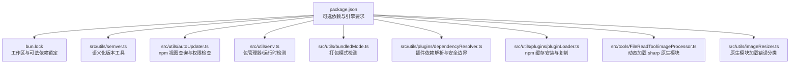
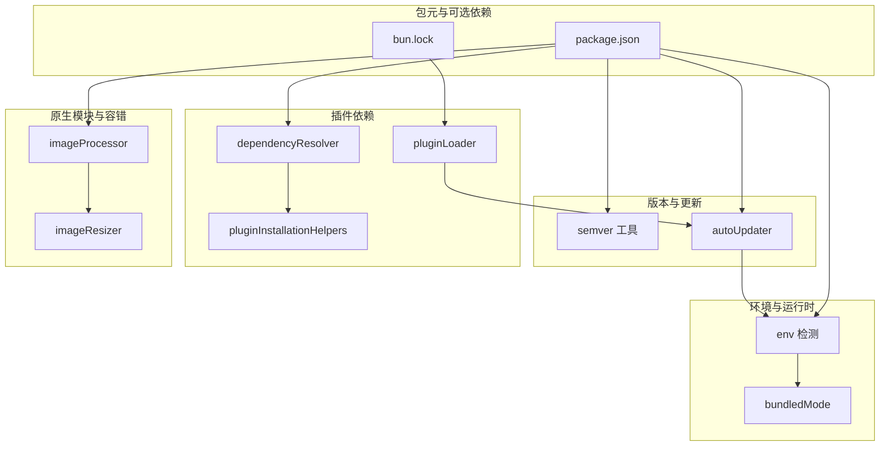
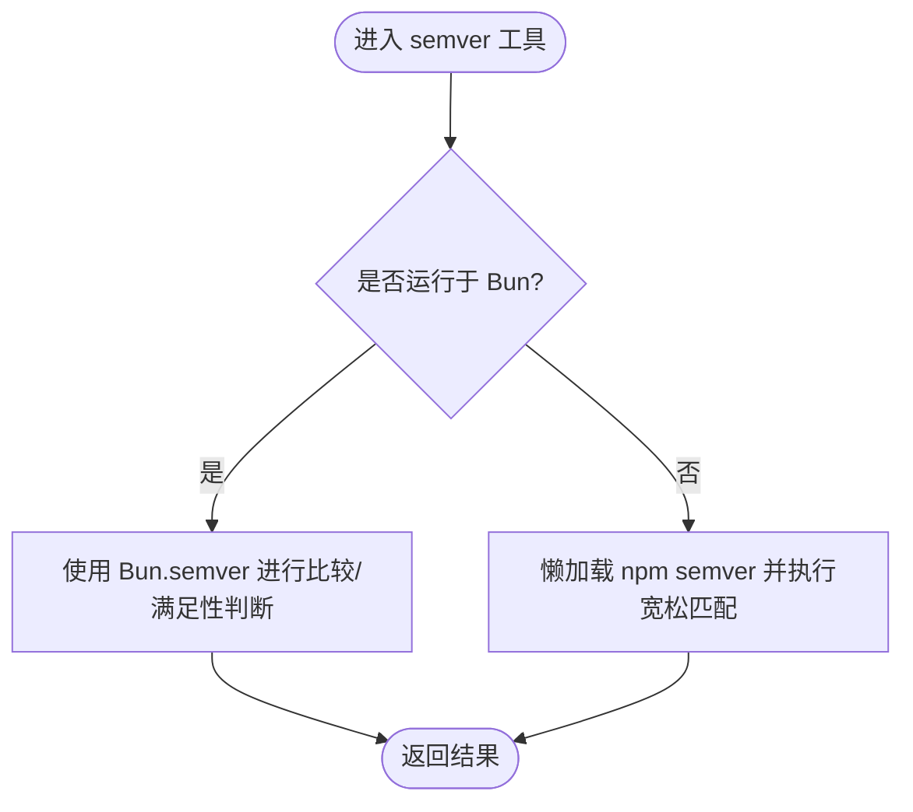
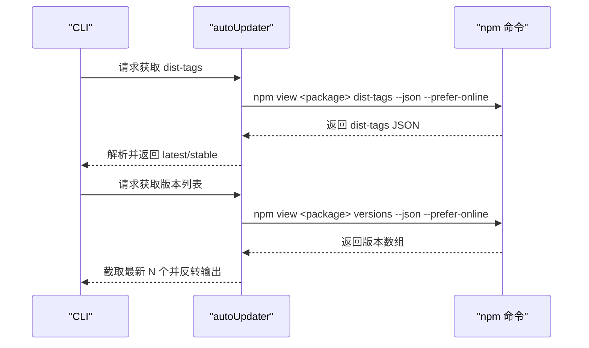
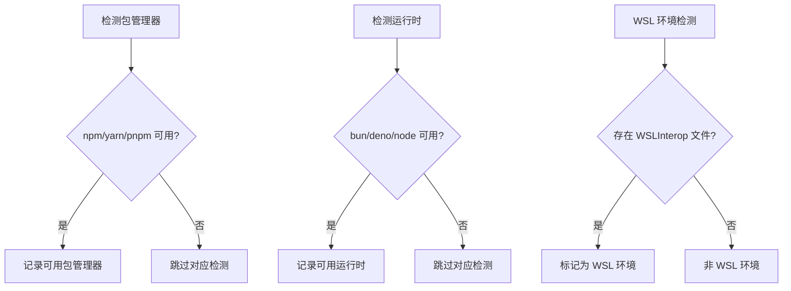
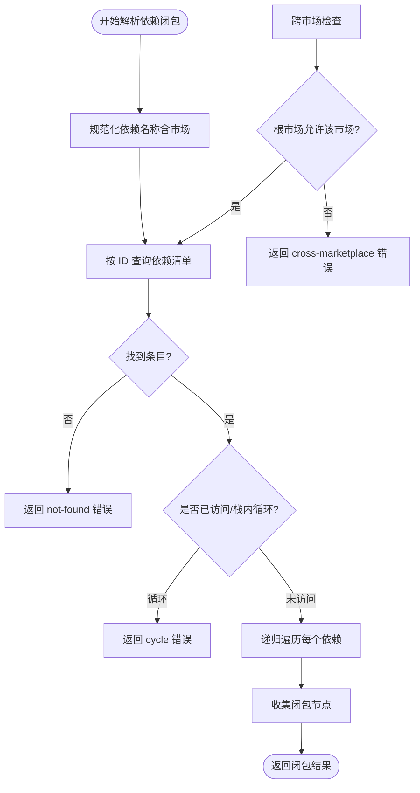
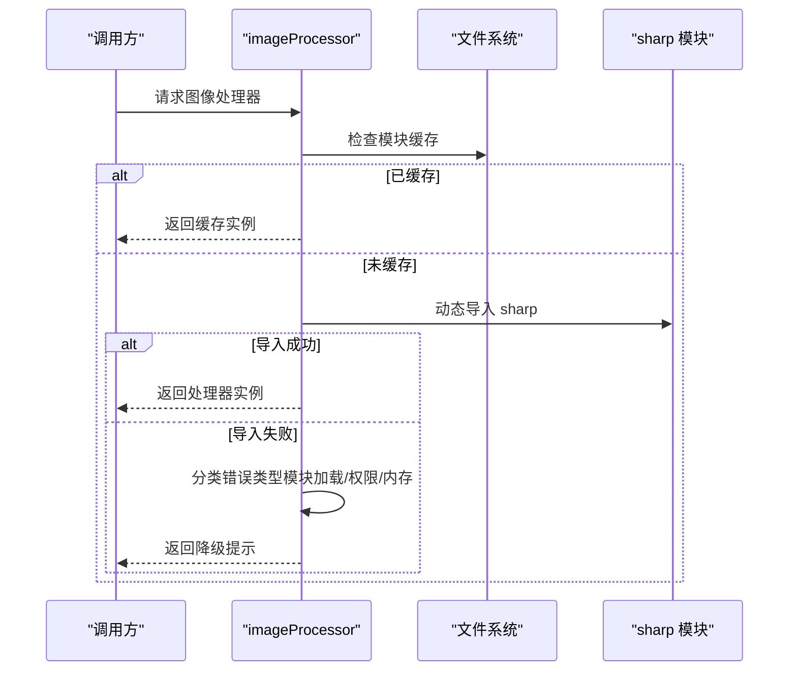
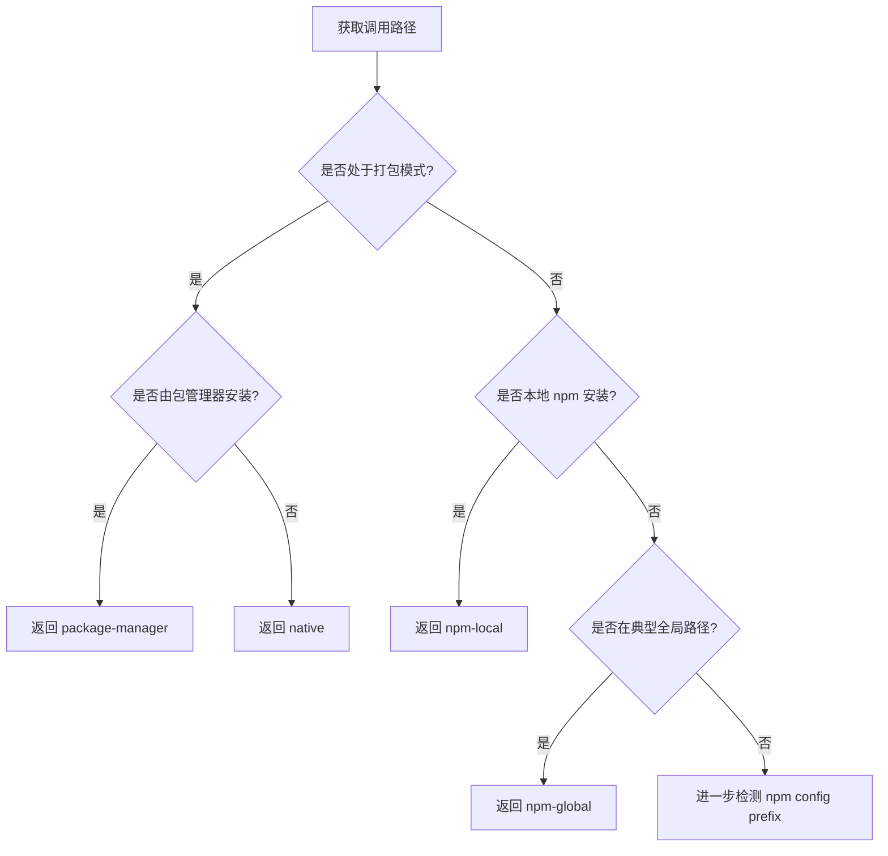
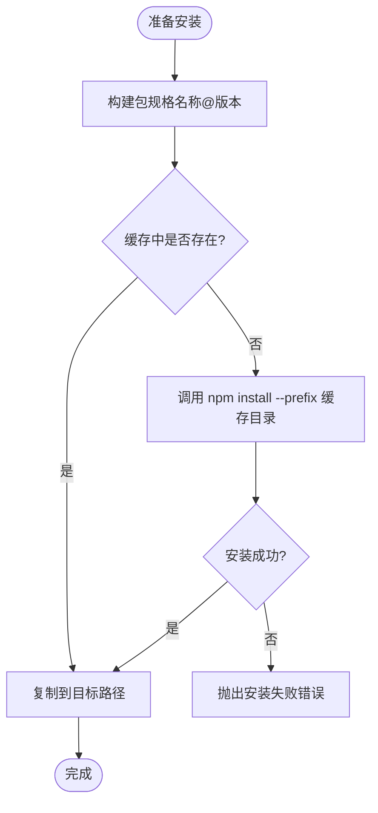
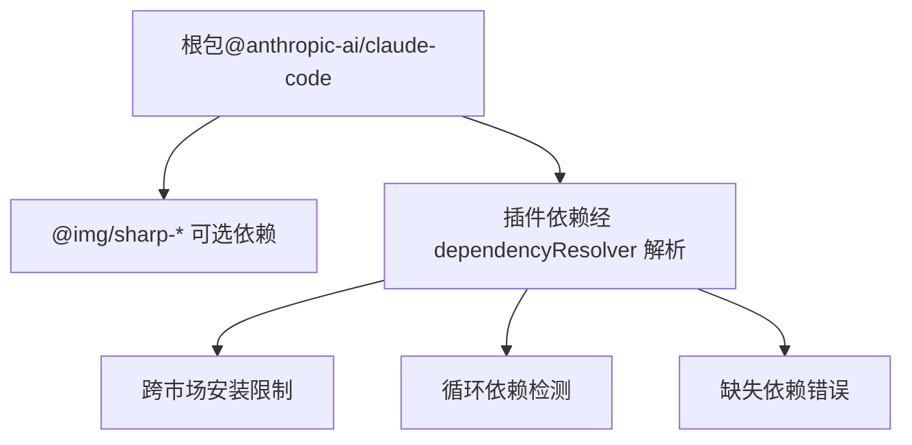

# NPM 包管理

<cite>
**本文引用的文件**
- [package.json](file://package.json)
- [bun.lock](file://bun.lock)
- [README.md](file://README.md)
- [src/utils/semver.ts](file://src/utils/semver.ts)
- [src/utils/autoUpdater.ts](file://src/utils/autoUpdater.ts)
- [src/utils/env.ts](file://src/utils/env.ts)
- [src/utils/bundledMode.ts](file://src/utils/bundledMode.ts)
- [src/utils/plugins/dependencyResolver.ts](file://src/utils/plugins/dependencyResolver.ts)
- [src/utils/plugins/pluginInstallationHelpers.ts](file://src/utils/plugins/pluginInstallationHelpers.ts)
- [src/utils/plugins/pluginLoader.ts](file://src/utils/plugins/pluginLoader.ts)
- [src/utils/doctorDiagnostic.ts](file://src/utils/doctorDiagnostic.ts)
- [src/utils/lockfile.ts](file://src/utils/lockfile.ts)
- [src/tools/FileReadTool/imageProcessor.ts](file://src/tools/FileReadTool/imageProcessor.ts)
- [src/utils/imageResizer.ts](file://src/utils/imageResizer.ts)
</cite>

## 目录
1. [简介](#简介)
2. [项目结构](#项目结构)
3. [核心组件](#核心组件)
4. [架构总览](#架构总览)
5. [详细组件分析](#详细组件分析)
6. [依赖关系分析](#依赖关系分析)
7. [性能考量](#性能考量)
8. [故障排查指南](#故障排查指南)
9. [结论](#结论)
10. [附录](#附录)

## 简介
本文件系统性梳理该仓库的 NPM 包管理实践与实现细节，重点覆盖以下方面：
- 如何通过 package.json 管理依赖（dependencies、devDependencies、optionalDependencies）与版本策略（语义化版本、版本锁定、兼容性约束）
- 安装与更新最佳实践（生产与开发环境差异、锁文件与缓存策略）
- 冲突解决与依赖树分析（循环依赖检测、跨市场依赖限制、反向依赖查找）
- 可选依赖的使用场景与跨平台兼容性处理（原生二进制包、动态加载、错误分类）

本项目以官方发布的 npm 包为蓝本，提取源码进行分析；实际发布包中包含可选的原生二进制依赖，用于图像处理能力，且通过动态导入在缺失时优雅降级。

## 项目结构
该仓库为 CLI 工具的源码提取版本，核心入口与命令实现位于 src/ 下，包管理相关逻辑主要体现在：
- package.json：定义包元信息、可选依赖、Node 引擎要求、脚本钩子等
- bun.lock：工作区与可选依赖的锁定信息
- 多处工具模块：负责版本比较、自动更新、包管理器与运行时检测、插件依赖解析、原生二进制加载与错误分类等

图表来源
- [package.json:1-34](file://package.json#L1-L34)
- [bun.lock:1-22](file://bun.lock#L1-L22)
- [src/utils/semver.ts:1-60](file://src/utils/semver.ts#L1-L60)
- [src/utils/autoUpdater.ts:251-300](file://src/utils/autoUpdater.ts#L251-L300)
- [src/utils/env.ts:49-333](file://src/utils/env.ts#L49-L333)
- [src/utils/bundledMode.ts:1-22](file://src/utils/bundledMode.ts#L1-L22)
- [src/utils/plugins/dependencyResolver.ts:1-306](file://src/utils/plugins/dependencyResolver.ts#L1-L306)
- [src/utils/plugins/pluginLoader.ts:499-548](file://src/utils/plugins/pluginLoader.ts#L499-L548)
- [src/tools/FileReadTool/imageProcessor.ts:1-94](file://src/tools/FileReadTool/imageProcessor.ts#L1-L94)
- [src/utils/imageResizer.ts:44-76](file://src/utils/imageResizer.ts#L44-L76)

章节来源
- [package.json:1-34](file://package.json#L1-L34)
- [bun.lock:1-22](file://bun.lock#L1-L22)
- [README.md:1-120](file://README.md#L1-L120)

## 核心组件
- 版本比较与兼容性
  - 提供跨运行时（Bun/Node）的 semver 工具，支持宽松匹配与排序判断，用于版本范围满足性与比较
- 自动更新与权限
  - 通过 npm 视图查询远端版本与 dist-tags，结合全局安装前缀检测，辅助诊断与升级流程
- 包管理器与运行时检测
  - 检测可用的包管理器（npm/yarn/pnpm）与运行时（bun/deno/node），并识别 WSL 与 Windows 路径下的 npm 行为
- 插件依赖解析
  - 实现插件间依赖的闭包解析、循环依赖检测、跨市场依赖限制与反向依赖查找
- 原生二进制加载与容错
  - 动态导入 sharp 原生模块，缺失时进行错误分类与降级提示
- 锁文件与并发控制
  - 懒加载锁文件库，避免冷启动开销；提供锁/解锁与检查接口

章节来源
- [src/utils/semver.ts:1-60](file://src/utils/semver.ts#L1-L60)
- [src/utils/autoUpdater.ts:346-454](file://src/utils/autoUpdater.ts#L346-L454)
- [src/utils/env.ts:49-333](file://src/utils/env.ts#L49-L333)
- [src/utils/plugins/dependencyResolver.ts:1-306](file://src/utils/plugins/dependencyResolver.ts#L1-L306)
- [src/tools/FileReadTool/imageProcessor.ts:1-94](file://src/tools/FileReadTool/imageProcessor.ts#L1-L94)
- [src/utils/imageResizer.ts:44-76](file://src/utils/imageResizer.ts#L44-L76)
- [src/utils/lockfile.ts:1-43](file://src/utils/lockfile.ts#L1-L43)

## 架构总览
下图展示了包管理相关的关键交互路径：从包元信息与可选依赖出发，到版本比较、自动更新、包管理器检测、插件依赖解析、原生模块加载与错误分类。

图表来源
- [package.json:1-34](file://package.json#L1-L34)
- [bun.lock:1-22](file://bun.lock#L1-L22)
- [src/utils/semver.ts:1-60](file://src/utils/semver.ts#L1-L60)
- [src/utils/autoUpdater.ts:251-300](file://src/utils/autoUpdater.ts#L251-L300)
- [src/utils/env.ts:49-333](file://src/utils/env.ts#L49-L333)
- [src/utils/bundledMode.ts:1-22](file://src/utils/bundledMode.ts#L1-L22)
- [src/utils/plugins/dependencyResolver.ts:1-306](file://src/utils/plugins/dependencyResolver.ts#L1-L306)
- [src/utils/plugins/pluginInstallationHelpers.ts:299-327](file://src/utils/plugins/pluginInstallationHelpers.ts#L299-L327)
- [src/utils/plugins/pluginLoader.ts:499-548](file://src/utils/plugins/pluginLoader.ts#L499-L548)
- [src/tools/FileReadTool/imageProcessor.ts:1-94](file://src/tools/FileReadTool/imageProcessor.ts#L1-L94)
- [src/utils/imageResizer.ts:44-76](file://src/utils/imageResizer.ts#L44-L76)

## 详细组件分析

### 组件一：版本与兼容性（semver 工具）
- 设计要点
  - 在 Bun 环境优先使用内置 semver，性能显著优于 npm semver；在 Node 环境回退至 npm semver 并采用宽松匹配
  - 提供比较、满足性判断与排序等常用操作，统一对外接口
- 性能与兼容性
  - 通过条件分支选择运行时实现，避免在 Node 环境引入额外依赖的冷启动成本
- 使用建议
  - 在需要严格版本范围校验时，优先使用满足性判断；在排序或比较大小时，使用 order/gt/lte 等函数

图表来源
- [src/utils/semver.ts:1-60](file://src/utils/semver.ts#L1-L60)

章节来源
- [src/utils/semver.ts:1-60](file://src/utils/semver.ts#L1-L60)

### 组件二：自动更新与权限检查（autoUpdater）
- 设计要点
  - 通过 npm 视图查询远端 dist-tags 与版本列表，支持超时控制与错误日志记录
  - 获取全局安装前缀（npm 或 bun），用于判断权限与安装位置
- 最佳实践
  - 在 CI 或受限环境中，优先使用 home 目录执行 npm 命令，避免读取项目级配置
  - 对网络请求设置合理超时，防止阻塞主流程

图表来源
- [src/utils/autoUpdater.ts:346-454](file://src/utils/autoUpdater.ts#L346-L454)
- [src/utils/autoUpdater.ts:251-300](file://src/utils/autoUpdater.ts#L251-L300)

章节来源
- [src/utils/autoUpdater.ts:346-454](file://src/utils/autoUpdater.ts#L346-L454)
- [src/utils/autoUpdater.ts:251-300](file://src/utils/autoUpdater.ts#L251-L300)

### 组件三：包管理器与运行时检测（env）
- 设计要点
  - 检测可用的包管理器（npm/yarn/pnpm）与运行时（bun/deno/node）
  - 识别 WSL 环境与 Windows 路径下的 npm 行为，辅助诊断与兼容性处理
- 使用建议
  - 在多运行时环境下，优先使用 Bun；若不可用则回退 Node，并确保 npm semver 松散匹配启用

图表来源
- [src/utils/env.ts:49-333](file://src/utils/env.ts#L49-L333)

章节来源
- [src/utils/env.ts:49-333](file://src/utils/env.ts#L49-L333)

### 组件四：插件依赖解析（dependencyResolver）
- 设计要点
  - 将裸依赖规范化为“名称@市场”形式，支持 inline 市场的特殊处理
  - DFS 遍历依赖闭包，检测循环依赖与缺失依赖；默认禁止跨市场自动安装，除非根市场显式允许
  - 加载时进行固定点验证，对不满足的依赖进行降级并生成错误列表
  - 支持反向依赖查找，便于卸载/禁用时给出警告
- 安全与稳定性
  - 通过 allowlist 控制跨市场依赖，避免信任边界被绕过
  - 已启用依赖跳过策略，避免重复写入设置与意外行为

图表来源
- [src/utils/plugins/dependencyResolver.ts:1-306](file://src/utils/plugins/dependencyResolver.ts#L1-L306)

章节来源
- [src/utils/plugins/dependencyResolver.ts:1-306](file://src/utils/plugins/dependencyResolver.ts#L1-L306)
- [src/utils/plugins/pluginInstallationHelpers.ts:299-327](file://src/utils/plugins/pluginInstallationHelpers.ts#L299-L327)

### 组件五：原生二进制加载与错误分类（imageProcessor 与 imageResizer）
- 设计要点
  - 通过动态导入加载 sharp 原生模块；若模块不存在或加载失败，进行错误分类（模块加载、权限、内存等）
  - 在缺失时提供降级提示，避免影响主流程
- 跨平台兼容性
  - 发布包包含多平台原生二进制（Darwin/Linux/Windows 的 arm/x64 与 musl 变体），通过可选依赖方式提供
  - 运行时根据平台选择最优二进制；若缺失，应用层进行容错处理

图表来源
- [src/tools/FileReadTool/imageProcessor.ts:1-94](file://src/tools/FileReadTool/imageProcessor.ts#L1-L94)
- [src/utils/imageResizer.ts:44-76](file://src/utils/imageResizer.ts#L44-L76)
- [package.json:22-32](file://package.json#L22-L32)
- [bun.lock:7-18](file://bun.lock#L7-L18)

章节来源
- [src/tools/FileReadTool/imageProcessor.ts:1-94](file://src/tools/FileReadTool/imageProcessor.ts#L1-L94)
- [src/utils/imageResizer.ts:44-76](file://src/utils/imageResizer.ts#L44-L76)
- [package.json:22-32](file://package.json#L22-L32)
- [bun.lock:7-18](file://bun.lock#L7-L18)

### 组件六：包管理器检测与诊断（doctorDiagnostic）
- 设计要点
  - 判断当前运行模式（打包/本地/全局），并检测常见的包管理器安装路径
  - 结合 npm config prefix 判断全局安装位置，辅助诊断问题

图表来源
- [src/utils/doctorDiagnostic.ts:91-144](file://src/utils/doctorDiagnostic.ts#L91-L144)

章节来源
- [src/utils/doctorDiagnostic.ts:91-144](file://src/utils/doctorDiagnostic.ts#L91-L144)

### 组件七：npm 缓存安装与复制（pluginLoader）
- 设计要点
  - 将 npm 包安装到独立缓存目录，再复制到目标路径，避免污染用户环境
  - 支持指定 registry 与版本，安装失败时抛出明确错误

图表来源
- [src/utils/plugins/pluginLoader.ts:499-548](file://src/utils/plugins/pluginLoader.ts#L499-L548)

章节来源
- [src/utils/plugins/pluginLoader.ts:499-548](file://src/utils/plugins/pluginLoader.ts#L499-L548)

## 依赖关系分析
- package.json 中的可选依赖
  - 以 @img/sharp-* 开头的多平台原生二进制包，覆盖 Darwin/arm64、Darwin/x64、Linux/arm、Linux/arm64、Linux/x64、Linuxmusl/arm64、Linuxmusl/x64、Win32/arm64、Win32/x64
  - 这些包在安装时可能因平台/架构不匹配而失败，但不会阻止主包功能
- bun.lock 的作用
  - 记录工作区与可选依赖的锁定信息，确保团队与 CI 的一致性
- 插件依赖的安全边界
  - 默认禁止跨市场自动安装，需根市场显式允许；循环依赖与缺失依赖均会终止安装流程

图表来源
- [package.json:22-32](file://package.json#L22-L32)
- [bun.lock:7-18](file://bun.lock#L7-L18)
- [src/utils/plugins/dependencyResolver.ts:78-132](file://src/utils/plugins/dependencyResolver.ts#L78-L132)

章节来源
- [package.json:22-32](file://package.json#L22-L32)
- [bun.lock:7-18](file://bun.lock#L7-L18)
- [src/utils/plugins/dependencyResolver.ts:78-132](file://src/utils/plugins/dependencyResolver.ts#L78-L132)

## 性能考量
- 版本比较性能
  - Bun.semver.order 比 npm semver 快约 20 倍；在 Bun 环境优先使用内置实现
- 启动冷启动优化
  - proper-lockfile 采用懒加载，避免在无需加锁时引入额外开销
- 安装与缓存
  - 将 npm 安装置于独立缓存目录，减少重复安装时间；仅在缓存缺失时触发安装

章节来源
- [src/utils/semver.ts:1-60](file://src/utils/semver.ts#L1-L60)
- [src/utils/lockfile.ts:1-43](file://src/utils/lockfile.ts#L1-L43)
- [src/utils/plugins/pluginLoader.ts:499-548](file://src/utils/plugins/pluginLoader.ts#L499-L548)

## 故障排查指南
- 可选依赖安装失败
  - 症状：安装 sharp 原生包时报错（如模块加载失败、权限不足、内存不足）
  - 排查：确认平台/架构匹配；查看 imageResizer 的错误分类逻辑；必要时移除可选依赖或切换运行环境
- 循环依赖与缺失依赖
  - 症状：插件安装报错，提示循环或缺失
  - 排查：使用 dependencyResolver 的格式化错误消息定位根因；检查跨市场依赖是否被允许
- 全局安装权限问题
  - 症状：无法全局安装或权限不足
  - 排查：通过 autoUpdater 的权限检查获取 npm/bun 前缀；在受限环境使用本地安装或提升权限

章节来源
- [src/utils/imageResizer.ts:44-76](file://src/utils/imageResizer.ts#L44-L76)
- [src/utils/plugins/pluginInstallationHelpers.ts:299-327](file://src/utils/plugins/pluginInstallationHelpers.ts#L299-L327)
- [src/utils/autoUpdater.ts:251-300](file://src/utils/autoUpdater.ts#L251-L300)

## 结论
本项目在包管理层面体现了以下特点：
- 明确区分可选依赖与核心依赖，通过可选依赖提供跨平台原生能力
- 以 semver 工具与锁文件保障版本一致性与兼容性
- 通过插件依赖解析建立安全边界，防止跨市场与循环依赖
- 在原生模块缺失时提供清晰的错误分类与降级策略
- 在自动更新与权限检查方面，结合 npm 视图与运行时检测，提升诊断与用户体验

## 附录
- 版本控制策略
  - 使用语义化版本号，配合宽松匹配与排序判断，确保兼容性与稳定性
- 锁定与一致性
  - 使用 bun.lock 记录可选依赖与工作区状态，保证团队与 CI 的一致性
- 安装与更新最佳实践
  - 生产环境优先使用锁定版本与缓存目录；开发环境可开启在线查询与宽松匹配
- 冲突解决与依赖树分析
  - 使用循环检测与跨市场限制；结合反向依赖查找，提供卸载/禁用警告
- 可选依赖与跨平台兼容性
  - 通过多平台原生二进制覆盖主流架构；在缺失时进行错误分类与降级提示