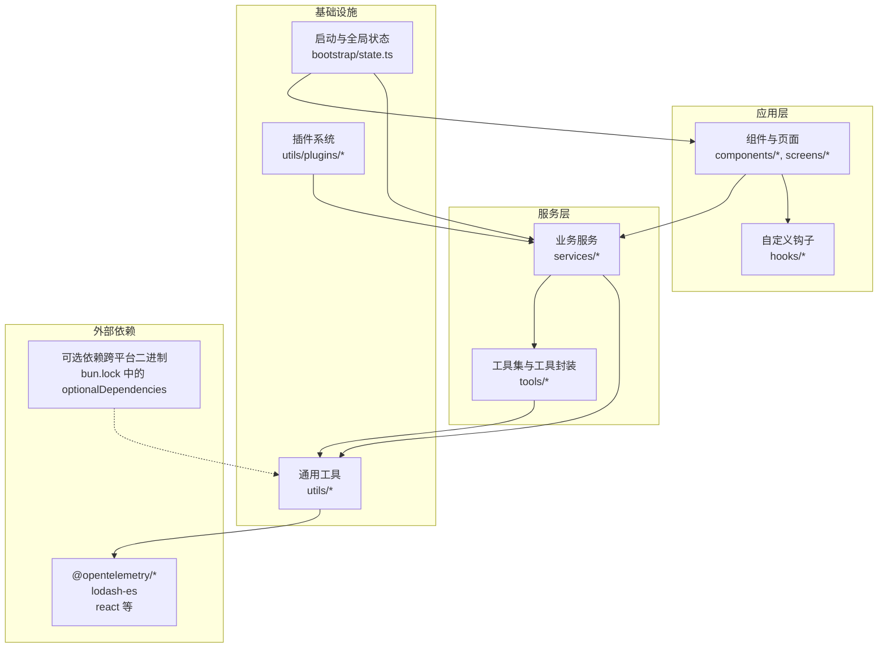
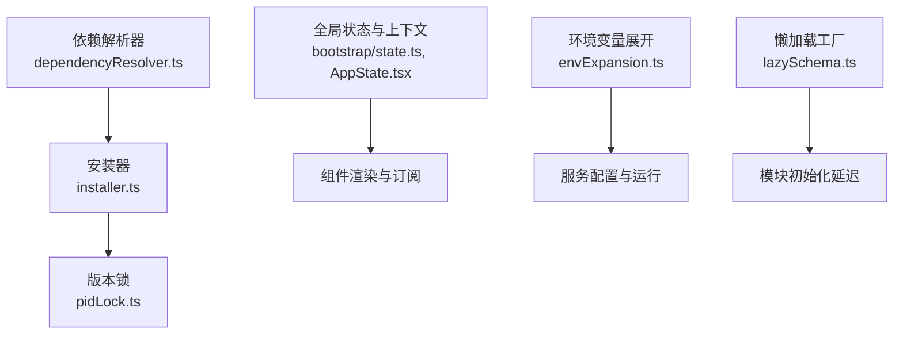
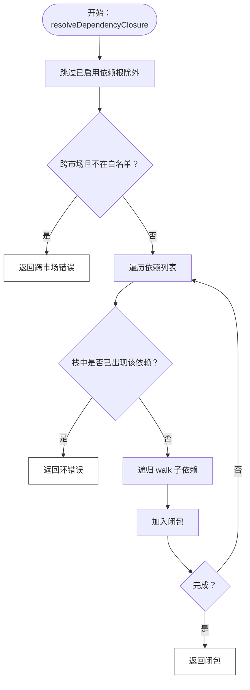
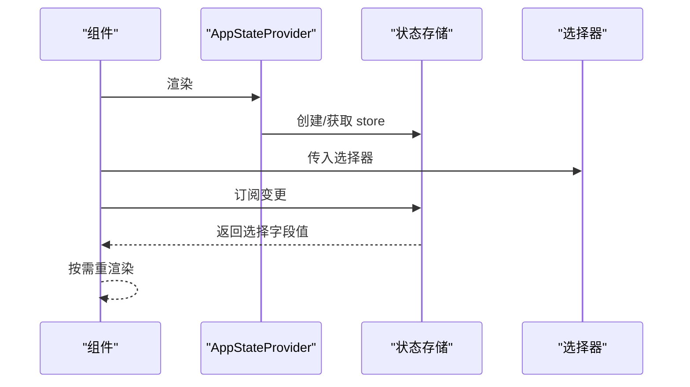
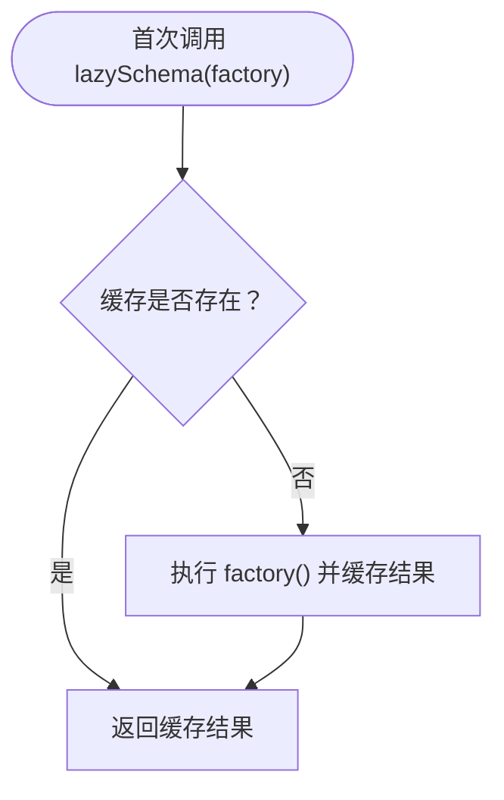
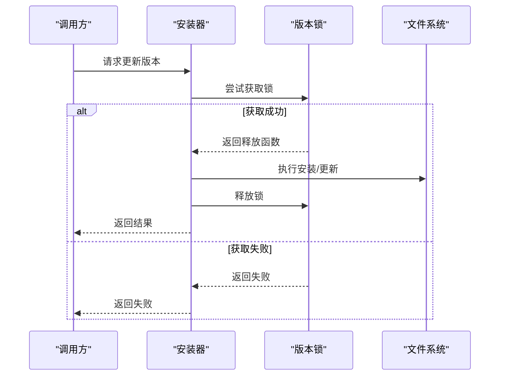

# 依赖关系管理

<cite>
**本文引用的文件**
- [package.json](file://package.json)
- [bun.lock](file://bun.lock)
- [src/utils/plugins/dependencyResolver.ts](file://src/utils/plugins/dependencyResolver.ts)
- [src/utils/plugins/pluginInstallationHelpers.ts](file://src/utils/plugins/pluginInstallationHelpers.ts)
- [src/bootstrap/state.ts](file://src/bootstrap/state.ts)
- [src/state/AppState.tsx](file://src/state/AppState.tsx)
- [src/utils/lazySchema.ts](file://src/utils/lazySchema.ts)
- [src/services/mcp/envExpansion.ts](file://src/services/mcp/envExpansion.ts)
- [src/utils/nativeInstaller/installer.ts](file://src/utils/nativeInstaller/installer.ts)
- [src/utils/nativeInstaller/pidLock.ts](file://src/utils/nativeInstaller/pidLock.ts)
</cite>

## 目录
1. [简介](#简介)
2. [项目结构](#项目结构)
3. [核心组件](#核心组件)
4. [架构总览](#架构总览)
5. [详细组件分析](#详细组件分析)
6. [依赖分析](#依赖分析)
7. [性能考量](#性能考量)
8. [故障排查指南](#故障排查指南)
9. [结论](#结论)
10. [附录](#附录)

## 简介
本文件系统化阐述 Claude Code 的依赖关系管理策略与实践，覆盖 npm 包管理、内部模块依赖、第三方库集成、依赖注入模式（构造函数注入、属性注入、方法注入）、循环依赖识别与解决、版本管理与升级策略、依赖分析工具使用以及性能优化中的懒加载与按需引入。内容基于仓库源码进行深入分析，确保可操作与可落地。

## 项目结构
该项目采用以功能域为中心的组织方式，核心目录包含 bridge、services、tools、components、hooks、utils 等，形成清晰的分层与边界。依赖管理策略贯穿于：
- 外部依赖：通过包管理器统一声明与锁定，当前以可选依赖形式提供跨平台二进制能力。
- 内部依赖：通过模块导入与状态共享机制（如全局状态、上下文）实现松耦合。
- 插件生态：自研插件依赖解析与安装流程，具备循环检测与跨市场限制等安全策略。

图表来源
- [src/bootstrap/state.ts](file://src/bootstrap/state.ts)
- [src/state/AppState.tsx](file://src/state/AppState.tsx)
- [src/utils/plugins/dependencyResolver.ts](file://src/utils/plugins/dependencyResolver.ts)
- [bun.lock](file://bun.lock)

章节来源
- [package.json](file://package.json)
- [bun.lock](file://bun.lock)

## 核心组件
- 插件依赖解析与安装：提供安装时的 DFS 遍历、环检测、跨市场限制与加载时的固定点校验与降级。
- 全局状态与上下文：通过 React 上下文与状态存储实现跨组件的状态共享与订阅。
- 懒加载与延迟初始化：通过工厂缓存与延迟求值避免模块初始化开销。
- 可选依赖与跨平台二进制：通过可选依赖满足不同平台的运行需求。
- 版本锁与并发更新：通过进程级锁保障安装过程的原子性与一致性。

章节来源
- [src/utils/plugins/dependencyResolver.ts](file://src/utils/plugins/dependencyResolver.ts)
- [src/state/AppState.tsx](file://src/state/AppState.tsx)
- [src/utils/lazySchema.ts](file://src/utils/lazySchema.ts)
- [bun.lock](file://bun.lock)
- [src/utils/nativeInstaller/installer.ts](file://src/utils/nativeInstaller/installer.ts)
- [src/utils/nativeInstaller/pidLock.ts](file://src/utils/nativeInstaller/pidLock.ts)

## 架构总览
下图展示了依赖管理在系统中的位置与交互路径：插件安装与加载、全局状态与上下文、环境变量展开、以及版本锁与并发控制。

图表来源
- [src/utils/plugins/dependencyResolver.ts](file://src/utils/plugins/dependencyResolver.ts)
- [src/utils/nativeInstaller/installer.ts](file://src/utils/nativeInstaller/installer.ts)
- [src/utils/nativeInstaller/pidLock.ts](file://src/utils/nativeInstaller/pidLock.ts)
- [src/services/mcp/envExpansion.ts](file://src/services/mcp/envExpansion.ts)
- [src/bootstrap/state.ts](file://src/bootstrap/state.ts)
- [src/state/AppState.tsx](file://src/state/AppState.tsx)
- [src/utils/lazySchema.ts](file://src/utils/lazySchema.ts)

## 详细组件分析

### 插件依赖解析与安装
- 安装期解析：采用 DFS 遍历收集依赖闭包，自动跳过已启用依赖，避免意外写入设置；支持跨市场依赖白名单，阻断默认跨市场自动安装。
- 加载期校验：对已启用插件进行固定点迭代校验，若存在未满足依赖则降级并记录错误，直至稳定。
- 循环检测：通过栈记录遍历路径，发现环即返回错误链路。
- 用户提示：将解析失败原因格式化为用户可读消息，包含跨市场依赖提示与市场添加建议。

图表来源
- [src/utils/plugins/dependencyResolver.ts](file://src/utils/plugins/dependencyResolver.ts)

章节来源
- [src/utils/plugins/dependencyResolver.ts](file://src/utils/plugins/dependencyResolver.ts)
- [src/utils/plugins/pluginInstallationHelpers.ts](file://src/utils/plugins/pluginInstallationHelpers.ts)

### 全局状态与上下文
- 全局状态：集中管理会话、指标、遥测、权限等横切关注点，避免在组件树中层层传递。
- React 上下文：通过 Provider 提供状态访问与订阅，支持“安全”读取（在 Provider 外部返回 undefined），便于组件在不同上下文中复用。
- 订阅模型：基于 useSyncExternalStore 实现细粒度订阅，仅在选择字段变化时触发重渲染。

图表来源
- [src/state/AppState.tsx](file://src/state/AppState.tsx)
- [src/bootstrap/state.ts](file://src/bootstrap/state.ts)

章节来源
- [src/state/AppState.tsx](file://src/state/AppState.tsx)
- [src/bootstrap/state.ts](file://src/bootstrap/state.ts)

### 懒加载与延迟初始化
- 工厂缓存：通过惰性工厂与缓存避免模块初始化时的昂贵计算（如 Zod Schema 构造）。
- 初始化延迟：将耗时初始化推迟到首次访问，降低冷启动成本。

图表来源
- [src/utils/lazySchema.ts](file://src/utils/lazySchema.ts)

章节来源
- [src/utils/lazySchema.ts](file://src/utils/lazySchema.ts)

### 可选依赖与跨平台二进制
- 可选依赖：通过可选依赖声明不同平台的二进制包，避免在不适用平台安装无用依赖。
- 锁定文件：使用工作区锁文件统一管理可选依赖版本，保证构建一致性。

章节来源
- [package.json](file://package.json)
- [bun.lock](file://bun.lock)

### 版本锁与并发更新
- 进程级锁：在执行版本更新前尝试获取锁，避免并发安装导致的竞态条件。
- 原子更新：在锁保护下执行安装或更新，失败重试后释放锁。
- 诊断信息：提供锁状态查询，辅助定位卡顿或死锁问题。

图表来源
- [src/utils/nativeInstaller/installer.ts](file://src/utils/nativeInstaller/installer.ts)
- [src/utils/nativeInstaller/pidLock.ts](file://src/utils/nativeInstaller/pidLock.ts)

章节来源
- [src/utils/nativeInstaller/installer.ts](file://src/utils/nativeInstaller/installer.ts)
- [src/utils/nativeInstaller/pidLock.ts](file://src/utils/nativeInstaller/pidLock.ts)

## 依赖分析
- 外部依赖管理：当前 package.json 显式依赖为空，主要通过可选依赖提供跨平台二进制能力，建议在需要时补充明确的生产依赖并配合锁定文件。
- 内部模块依赖：通过模块导入与状态共享减少耦合；插件系统通过解析器与安装器解耦依赖发现与安装执行。
- 第三方库集成：对 OpenTelemetry、lodash-es 等库的使用集中在服务与工具层，保持了清晰的职责边界。

章节来源
- [package.json](file://package.json)
- [bun.lock](file://bun.lock)
- [src/bootstrap/state.ts](file://src/bootstrap/state.ts)

## 性能考量
- 懒加载与延迟初始化：通过工厂缓存与延迟求值降低模块初始化成本，适合大型工具或复杂配置对象。
- 按需引入：在插件安装与加载阶段仅启用必要组件，避免一次性加载全部资源。
- 并发控制：通过版本锁避免重复安装与竞态，提升稳定性与吞吐。
- 状态订阅优化：使用细粒度选择器与订阅，减少不必要的重渲染。

章节来源
- [src/utils/lazySchema.ts](file://src/utils/lazySchema.ts)
- [src/state/AppState.tsx](file://src/state/AppState.tsx)
- [src/utils/nativeInstaller/installer.ts](file://src/utils/nativeInstaller/installer.ts)
- [src/utils/nativeInstaller/pidLock.ts](file://src/utils/nativeInstaller/pidLock.ts)

## 故障排查指南
- 插件依赖错误
  - 环：解析器返回环链路，检查依赖声明中的相互引用。
  - 跨市场：根市场未允许跨市场依赖，需先手动安装目标插件或在根市场的清单中添加白名单。
  - 未找到：目标插件未在任何市场中找到，确认市场是否已添加。
  - 未启用：目标插件存在于集合但未启用，启用后再试。
- 安装卡住或失败
  - 使用锁诊断工具查看锁文件状态，清理僵尸锁后重试。
  - 在强制重装场景下，确保移除旧锁再尝试。
- 环境变量展开
  - 对配置中的环境变量进行展开，缺失变量会记录并返回原样，便于调试。

章节来源
- [src/utils/plugins/dependencyResolver.ts](file://src/utils/plugins/dependencyResolver.ts)
- [src/utils/plugins/pluginInstallationHelpers.ts](file://src/utils/plugins/pluginInstallationHelpers.ts)
- [src/utils/nativeInstaller/pidLock.ts](file://src/utils/nativeInstaller/pidLock.ts)
- [src/services/mcp/envExpansion.ts](file://src/services/mcp/envExpansion.ts)

## 结论
本项目在依赖管理上形成了“解析-安装-校验-锁”的闭环：解析器负责安全与一致性，安装器与锁保障并发安全，全局状态与上下文提供稳定的运行时依赖，懒加载与按需引入优化性能。建议在后续维护中完善生产依赖声明、持续监控插件生态健康度，并结合可视化工具定期巡检依赖图谱与冲突。

## 附录
- 依赖注入模式实践
  - 构造函数注入：通过工厂与参数传递依赖（如状态选择器、配置对象）。
  - 属性注入：在组件挂载时根据远程设置动态调整上下文状态。
  - 方法注入：通过回调与事件处理器注入行为（如设置变更监听）。
- 循环依赖识别与解决
  - 识别：解析器栈追踪与错误链路；UI/状态订阅中的上下文嵌套。
  - 解决：模块拆分、接口抽象、延迟加载、运行时依赖注入。
- 版本管理最佳实践
  - 锁定：使用工作区锁文件统一版本。
  - 兼容性：在升级前进行兼容性检查与回归测试。
  - 升级策略：灰度发布与回滚预案，结合锁与原子更新保障一致性。

章节来源
- [src/state/AppState.tsx](file://src/state/AppState.tsx)
- [src/utils/plugins/dependencyResolver.ts](file://src/utils/plugins/dependencyResolver.ts)
- [bun.lock](file://bun.lock)