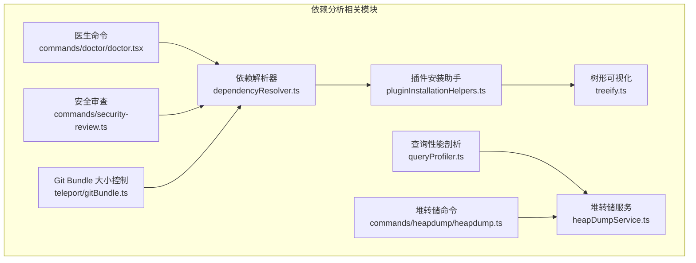
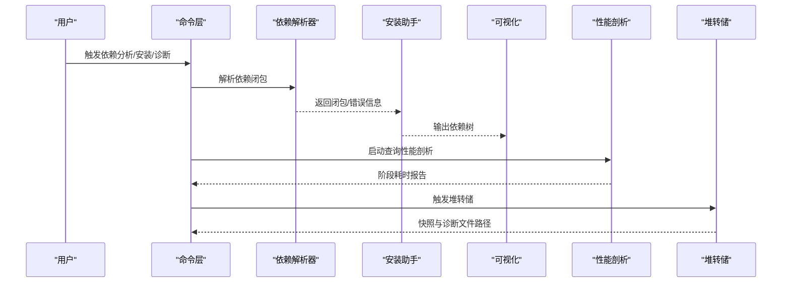
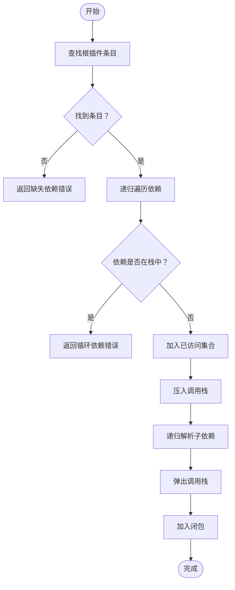
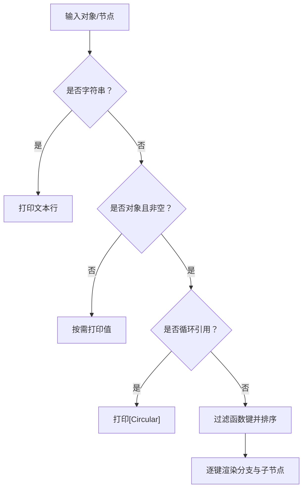
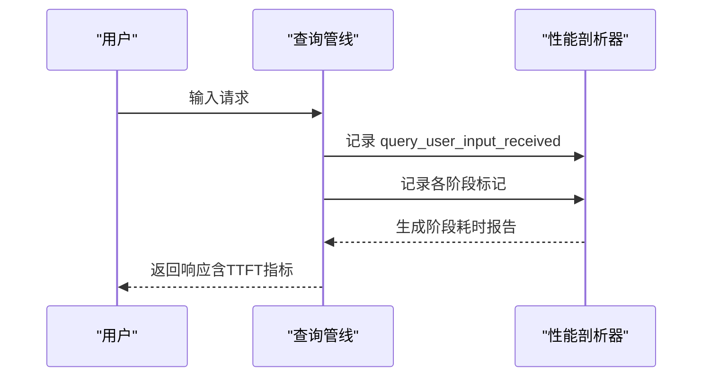
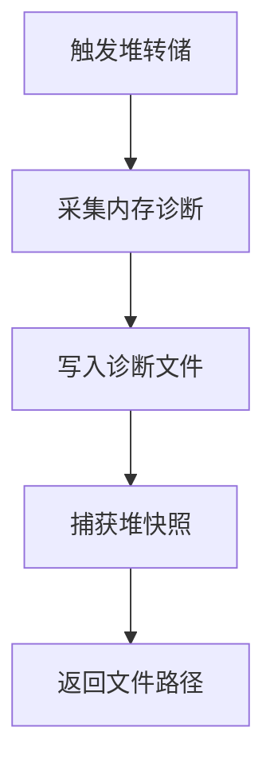
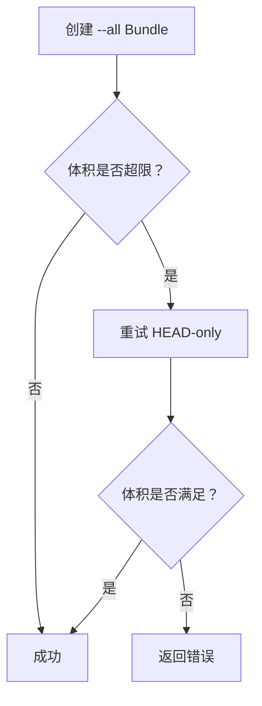
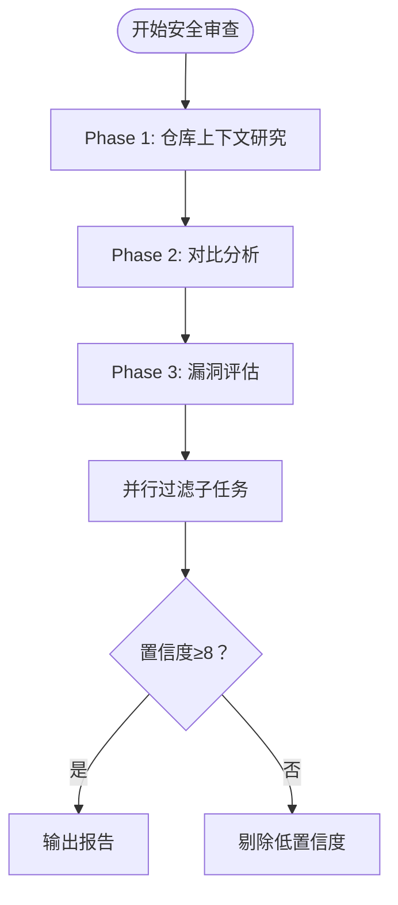
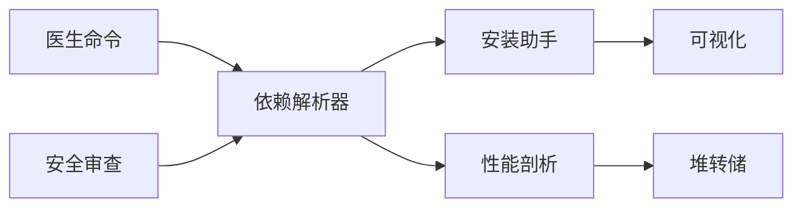

# 依赖分析工具

<cite>
**本文档引用的文件**
- [package.json](file://package.json)
- [bun.lock](file://bun.lock)
- [README.md](file://README.md)
- [src/utils/plugins/dependencyResolver.ts](file://src/utils/plugins/dependencyResolver.ts)
- [src/utils/plugins/pluginInstallationHelpers.ts](file://src/utils/plugins/pluginInstallationHelpers.ts)
- [src/utils/treeify.ts](file://src/utils/treeify.ts)
- [src/utils/queryProfiler.ts](file://src/utils/queryProfiler.ts)
- [src/utils/heapDumpService.ts](file://src/utils/heapDumpService.ts)
- [src/commands/heapdump/heapdump.ts](file://src/commands/heapdump/heapdump.ts)
- [src/commands/doctor/doctor.tsx](file://src/commands/doctor/doctor.tsx)
- [src/commands/security-review.ts](file://src/commands/security-review.ts)
- [src/utils/bash/parser.ts](file://src/utils/bash/parser.ts)
- [src/utils/teleport/gitBundle.ts](file://src/utils/teleport/gitBundle.ts)
</cite>

## 目录
1. [简介](#简介)
2. [项目结构](#项目结构)
3. [核心组件](#核心组件)
4. [架构总览](#架构总览)
5. [详细组件分析](#详细组件分析)
6. [依赖关系分析](#依赖关系分析)
7. [性能考量](#性能考量)
8. [故障排查指南](#故障排查指南)
9. [结论](#结论)
10. [附录](#附录)

## 简介
本文件面向使用者与维护者，系统化介绍本仓库中的依赖分析能力与实践方法，覆盖以下方面：
- 依赖图生成：基于插件依赖解析器构建闭包依赖图，支持跨市场依赖策略与循环检测。
- 包大小分析：通过打包产物体积监控与 Git Bundle 限制控制，辅助识别大体积变更。
- 安全漏洞扫描：结合内置安全审查流程与硬排除规则，聚焦真实风险点。
- 可视化依赖图解读与优化：提供关键路径识别与冗余依赖发现思路。
- 依赖性能分析：加载时间分析（TTFT/阶段拆分）与内存占用评估（堆转储与诊断）。
- 自动化依赖检查流程：在 CI/本地开发中集成依赖健康检查与性能回归预警。

本项目为 CLI 工具的源码提取版本，核心分析逻辑集中在依赖解析、查询性能剖析与内存诊断等模块。

## 项目结构
该仓库采用按功能域划分的目录组织方式，与依赖分析相关的关键位置如下：
- 插件系统与依赖解析：src/utils/plugins
- 依赖图可视化：src/utils/treeify
- 查询性能剖析：src/utils/queryProfiler
- 内存诊断与堆转储：src/utils/heapDumpService 与命令入口 src/commands/heapdump
- 依赖健康检查与安全审查：src/commands/doctor 与 src/commands/security-review
- 包大小与传输控制：src/utils/teleport/gitBundle

**图表来源**
- [src/utils/plugins/dependencyResolver.ts:95-159](file://src/utils/plugins/dependencyResolver.ts#L95-L159)
- [src/utils/plugins/pluginInstallationHelpers.ts:391-427](file://src/utils/plugins/pluginInstallationHelpers.ts#L391-L427)
- [src/utils/treeify.ts:50-104](file://src/utils/treeify.ts#L50-L104)
- [src/utils/queryProfiler.ts:1-302](file://src/utils/queryProfiler.ts#L1-L302)
- [src/utils/heapDumpService.ts:1-278](file://src/utils/heapDumpService.ts#L1-L278)
- [src/commands/heapdump/heapdump.ts:1-18](file://src/commands/heapdump/heapdump.ts#L1-L18)
- [src/commands/doctor/doctor.tsx:1-7](file://src/commands/doctor/doctor.tsx#L1-L7)
- [src/commands/security-review.ts:76-212](file://src/commands/security-review.ts#L76-L212)
- [src/utils/teleport/gitBundle.ts:75-96](file://src/utils/teleport/gitBundle.ts#L75-L96)

**章节来源**
- [README.md: 95-114:95-114](file://README.md#L95-L114)

## 核心组件
- 依赖解析器：递归遍历插件依赖，构建闭包，处理缺失依赖、循环依赖与跨市场策略。
- 插件安装助手：在安装前执行依赖闭包验证与策略检查，确保合规性。
- 依赖图可视化：将对象结构渲染为树形图，便于直观理解依赖层次。
- 查询性能剖析：记录从用户输入到首字节到达的各阶段耗时，输出阶段分解报告。
- 堆转储与内存诊断：捕获 V8 堆快照与进程内存统计，辅助定位内存泄漏与增长趋势。
- 医生命令：集中式诊断入口，可联动依赖与环境问题检测。
- 安全审查：基于明确规则与排除项的安全扫描流程，聚焦真实风险。

**章节来源**
- [src/utils/plugins/dependencyResolver.ts: 95-159:95-159](file://src/utils/plugins/dependencyResolver.ts#L95-L159)
- [src/utils/plugins/pluginInstallationHelpers.ts: 391-427:391-427](file://src/utils/plugins/pluginInstallationHelpers.ts#L391-L427)
- [src/utils/treeify.ts: 50-104:50-104](file://src/utils/treeify.ts#L50-L104)
- [src/utils/queryProfiler.ts: 1-302:1-302](file://src/utils/queryProfiler.ts#L1-L302)
- [src/utils/heapDumpService.ts: 1-278:1-278](file://src/utils/heapDumpService.ts#L1-L278)
- [src/commands/heapdump/heapdump.ts: 1-18:1-18](file://src/commands/heapdump/heapdump.ts#L1-L18)
- [src/commands/doctor/doctor.tsx: 1-7:1-7](file://src/commands/doctor/doctor.tsx#L1-L7)
- [src/commands/security-review.ts: 76-212:76-212](file://src/commands/security-review.ts#L76-L212)

## 架构总览
下图展示了依赖分析与性能诊断在系统中的交互关系：

**图表来源**
- [src/utils/plugins/dependencyResolver.ts:95-159](file://src/utils/plugins/dependencyResolver.ts#L95-L159)
- [src/utils/plugins/pluginInstallationHelpers.ts:391-427](file://src/utils/plugins/pluginInstallationHelpers.ts#L391-L427)
- [src/utils/treeify.ts:50-104](file://src/utils/treeify.ts#L50-L104)
- [src/utils/queryProfiler.ts:1-302](file://src/utils/queryProfiler.ts#L1-L302)
- [src/utils/heapDumpService.ts:1-278](file://src/utils/heapDumpService.ts#L1-L278)

## 详细组件分析

### 依赖解析器与安装助手
- 依赖解析器负责从根插件出发，递归收集所有直接与间接依赖，同时检测缺失与循环依赖，并尊重跨市场策略。
- 安装助手在实际写入设置前，对闭包内的每个依赖进行策略校验，避免引入被策略阻止的依赖。

**图表来源**
- [src/utils/plugins/dependencyResolver.ts: 95-159:95-159](file://src/utils/plugins/dependencyResolver.ts#L95-L159)

**章节来源**
- [src/utils/plugins/dependencyResolver.ts: 95-159:95-159](file://src/utils/plugins/dependencyResolver.ts#L95-L159)
- [src/utils/plugins/pluginInstallationHelpers.ts: 391-427:391-427](file://src/utils/plugins/pluginInstallationHelpers.ts#L391-L427)

### 依赖图可视化
- treeify 将任意对象结构渲染为带分支的树形图，自动规避循环引用，支持隐藏函数、着色主题与键值显示。
- 在依赖分析后，可将解析得到的闭包结构传入该工具，快速获得可读性强的依赖视图。

**图表来源**
- [src/utils/treeify.ts: 50-104:50-104](file://src/utils/treeify.ts#L50-L104)

**章节来源**
- [src/utils/treeify.ts: 50-104:50-104](file://src/utils/treeify.ts#L50-L104)

### 查询性能剖析（加载时间分析）
- 通过性能标记记录从用户输入到首字节到达的各阶段时间，输出阶段分解与慢操作警告。
- 支持计算预请求开销占比、网络延迟占比与总体 TTFT 指标，帮助定位瓶颈。

**图表来源**
- [src/utils/queryProfiler.ts: 1-L302:1-302](file://src/utils/queryProfiler.ts#L1-L302)

**章节来源**
- [src/utils/queryProfiler.ts: 1-L302:1-302](file://src/utils/queryProfiler.ts#L1-L302)

### 堆转储与内存诊断（内存占用评估）
- 堆转储服务先写入内存诊断数据，再捕获 V8 堆快照，避免大堆转储导致崩溃。
- 诊断包含 V8 堆空间统计、上下文数量、句柄/请求状态等指标，辅助判断泄漏类型与趋势。

**图表来源**
- [src/utils/heapDumpService.ts: 221-L278:221-278](file://src/utils/heapDumpService.ts#L221-L278)
- [src/commands/heapdump/heapdump.ts: 1-L18:1-18](file://src/commands/heapdump/heapdump.ts#L1-L18)

**章节来源**
- [src/utils/heapDumpService.ts: 1-L278:1-278](file://src/utils/heapDumpService.ts#L1-L278)
- [src/commands/heapdump/heapdump.ts: 1-L18:1-18](file://src/commands/heapdump/heapdump.ts#L1-L18)

### 包大小分析与传输控制
- 通过 Git Bundle 创建与体积限制，自动回退到更小范围以满足传输阈值，避免超大包导致失败或超时。
- 结合依赖闭包规模与第三方二进制（如多平台 sharp）可评估整体包体积影响。

**图表来源**
- [src/utils/teleport/gitBundle.ts: 75-L96:75-96](file://src/utils/teleport/gitBundle.ts#L75-L96)

**章节来源**
- [src/utils/teleport/gitBundle.ts: 75-L96:75-96](file://src/utils/teleport/gitBundle.ts#L75-L96)

### 安全漏洞扫描（安全审查）
- 基于明确的分析方法论与硬排除规则，聚焦真实风险，避免误报噪音。
- 提供并行过滤子任务与置信度阈值，最终输出可执行的修复建议清单。

**图表来源**
- [src/commands/security-review.ts: 76-L212:76-212](file://src/commands/security-review.ts#L76-L212)

**章节来源**
- [src/commands/security-review.ts: 76-L212:76-212](file://src/commands/security-review.ts#L76-L212)

## 依赖关系分析
- 依赖解析器与安装助手形成闭环：解析器负责“发现”，安装助手负责“校验与落地”。
- 可视化模块独立于解析过程，便于在任何阶段输出依赖树。
- 性能剖析与内存诊断作为“后置分析”工具，用于验证与优化依赖带来的性能与资源影响。
- 医生命令作为统一入口，串联依赖、环境与安全检查。

**图表来源**
- [src/utils/plugins/dependencyResolver.ts:95-159](file://src/utils/plugins/dependencyResolver.ts#L95-L159)
- [src/utils/plugins/pluginInstallationHelpers.ts:391-427](file://src/utils/plugins/pluginInstallationHelpers.ts#L391-L427)
- [src/utils/treeify.ts:50-104](file://src/utils/treeify.ts#L50-L104)
- [src/utils/queryProfiler.ts:1-302](file://src/utils/queryProfiler.ts#L1-L302)
- [src/utils/heapDumpService.ts:1-278](file://src/utils/heapDumpService.ts#L1-L278)
- [src/commands/doctor/doctor.tsx:1-7](file://src/commands/doctor/doctor.tsx#L1-L7)
- [src/commands/security-review.ts:76-212](file://src/commands/security-review.ts#L76-L212)

## 性能考量
- 依赖闭包规模直接影响启动与运行时性能。建议：
  - 优先选择轻量级替代方案，避免重复依赖与深层嵌套。
  - 使用可视化工具识别关键路径与冗余依赖，定期清理未使用依赖。
- 包大小控制：
  - 利用 Git Bundle 的体积回退策略，减少传输与部署时间。
  - 对多平台二进制（如 sharp）按需启用，避免不必要的 optionalDependencies。
- 性能剖析：
  - 开启查询性能剖析，关注“预请求开销”“网络延迟”“工具执行”等阶段占比。
  - 结合内存诊断，识别是否存在 V8 堆增长或上下文泄漏。

[本节为通用指导，无需特定文件来源]

## 故障排查指南
- 依赖解析失败
  - 缺失依赖：根据解析器返回的缺失 ID 进行安装或替换。
  - 循环依赖：检查依赖链路，必要时拆分模块或引入适配层。
  - 跨市场依赖：确认允许列表与策略配置，避免违规引入。
- 包体积过大
  - 使用 Git Bundle 回退策略，优先 HEAD-only 传输。
  - 清理 optionalDependencies 中不必要平台的二进制。
- 性能异常
  - 查看性能剖析报告，定位慢阶段并针对性优化。
  - 若存在持续内存增长，使用堆转储与诊断文件进行根因分析。
- 安全风险
  - 依据安全审查的硬排除规则与前置条件，聚焦真实高危点。
  - 对高置信度漏洞立即修复；对低置信度项进行进一步验证。

**章节来源**
- [src/utils/plugins/dependencyResolver.ts: 95-159:95-159](file://src/utils/plugins/dependencyResolver.ts#L95-L159)
- [src/utils/plugins/pluginInstallationHelpers.ts: 391-427:391-427](file://src/utils/plugins/pluginInstallationHelpers.ts#L391-L427)
- [src/utils/teleport/gitBundle.ts: 75-L96:75-96](file://src/utils/teleport/gitBundle.ts#L75-L96)
- [src/utils/queryProfiler.ts: 1-L302:1-302](file://src/utils/queryProfiler.ts#L1-L302)
- [src/utils/heapDumpService.ts: 1-L278:1-278](file://src/utils/heapDumpService.ts#L1-L278)
- [src/commands/security-review.ts: 76-L212:76-212](file://src/commands/security-review.ts#L76-L212)

## 结论
本仓库提供了从“依赖发现—校验—可视化—性能与内存诊断—安全审查”的完整分析闭环。通过合理使用依赖解析器、可视化工具、性能剖析与堆转储，可以有效识别关键路径、冗余依赖与潜在风险，保障 CLI 的稳定性与可维护性。建议在日常开发与发布流程中固化这些工具的使用，形成自动化检查与回归预警机制。

[本节为总结，无需特定文件来源]

## 附录

### 依赖图生成与解读
- 生成步骤
  - 使用依赖解析器构建闭包。
  - 将闭包结构传入 treeify 进行可视化。
- 解读要点
  - 关注根到叶子的最长链路，识别关键路径。
  - 寻找重复出现的中间层模块，考虑合并或去重。
  - 对 optionalDependencies 与跨市场依赖单独标注。

**章节来源**
- [src/utils/plugins/dependencyResolver.ts: 95-159:95-159](file://src/utils/plugins/dependencyResolver.ts#L95-L159)
- [src/utils/treeify.ts: 50-104:50-104](file://src/utils/treeify.ts#L50-L104)

### 包大小分析实践
- 传输控制
  - 优先 HEAD-only，仅在必要时回退到 --all。
  - 对超限场景记录日志并提示回退结果。
- 体积优化
  - 清理未使用的 optionalDependencies。
  - 合理拆分平台特定二进制，按需启用。

**章节来源**
- [src/utils/teleport/gitBundle.ts: 75-L96:75-96](file://src/utils/teleport/gitBundle.ts#L75-L96)
- [package.json: 22-32:22-32](file://package.json#L22-L32)
- [bun.lock: 7-17:7-17](file://bun.lock#L7-L17)

### 安全漏洞扫描流程
- 分析方法论
  - 上下文研究 → 对比分析 → 漏洞评估 → 并行过滤 → 置信度阈值。
- 排除规则
  - 明确列出不作为漏洞的场景，减少误报。
- 执行建议
  - 对高置信度项立即修复；对低置信度项补充证据链。

**章节来源**
- [src/commands/security-review.ts: 76-L212:76-212](file://src/commands/security-review.ts#L76-L212)

### 依赖性能分析方法
- 加载时间分析
  - 使用查询性能剖析记录阶段标记，输出阶段分解与 TTFT 统计。
- 内存占用评估
  - 使用堆转储服务捕获快照与诊断，结合诊断指标判断泄漏类型与趋势。

**章节来源**
- [src/utils/queryProfiler.ts: 1-L302:1-302](file://src/utils/queryProfiler.ts#L1-L302)
- [src/utils/heapDumpService.ts: 1-L278:1-278](file://src/utils/heapDumpService.ts#L1-L278)

### 自动化依赖检查流程设置
- 依赖健康检查
  - 在 CI 中运行依赖解析与可视化，输出依赖树与关键路径报告。
- 性能回归预警
  - 对查询性能剖析报告设定阈值，超过阈值触发告警。
- 安全扫描
  - 在 PR 流程中执行安全审查，结合硬排除规则与置信度阈值输出报告。

[本节为通用指导，无需特定文件来源]