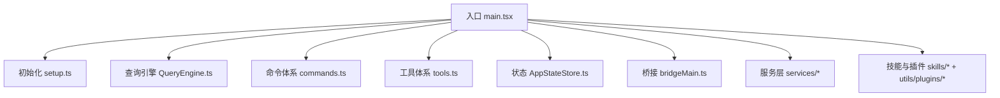
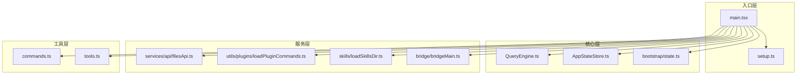
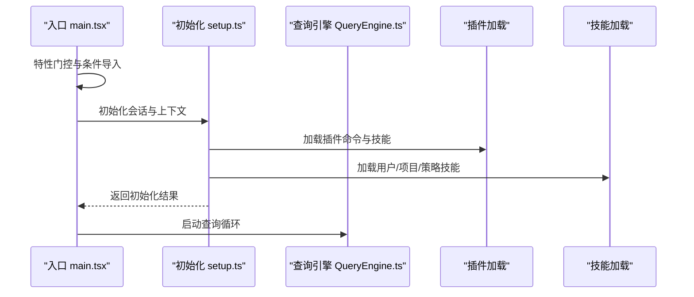
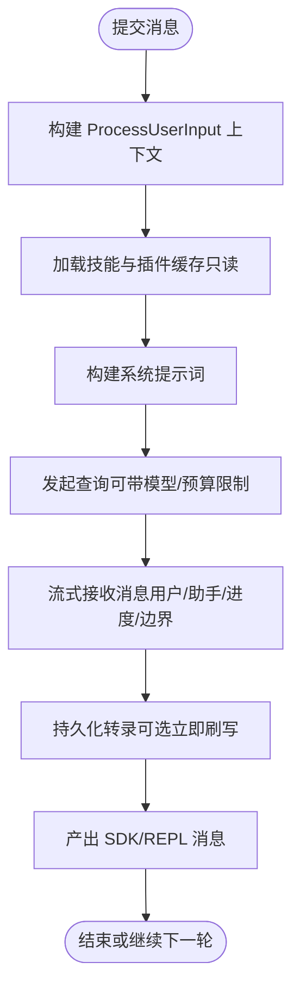
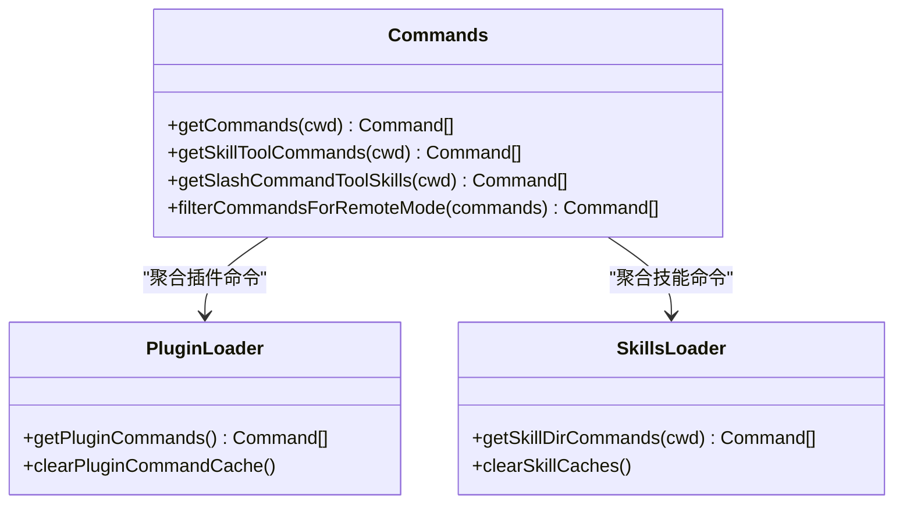
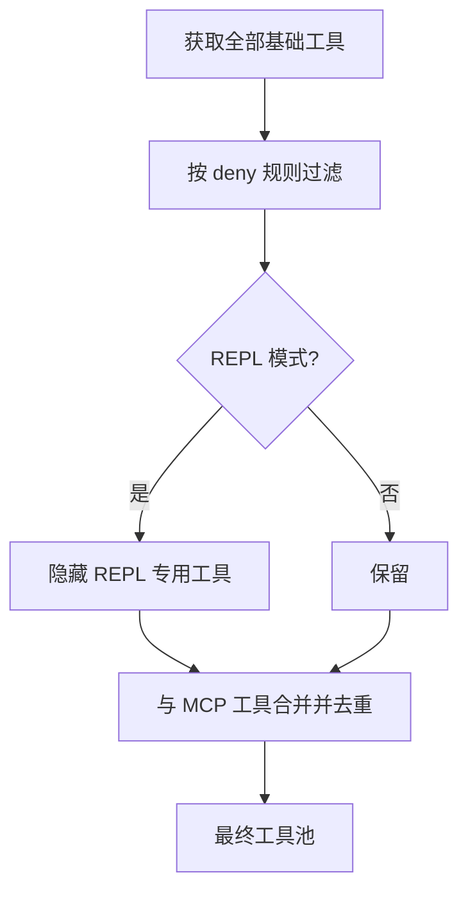

# 内部模块依赖

<cite>
**本文档引用的文件**
- [package.json](file://package.json)
- [main.tsx](file://src/main.tsx)
- [setup.ts](file://src/setup.ts)
- [QueryEngine.ts](file://src/QueryEngine.ts)
- [commands.ts](file://src/commands.ts)
- [tools.ts](file://src/tools.ts)
- [AppStateStore.ts](file://src/state/AppStateStore.ts)
- [bootstrap/state.ts](file://src/bootstrap/state.ts)
- [bridgeMain.ts](file://src/bridge/bridgeMain.ts)
- [filesApi.ts](file://src/services/api/filesApi.ts)
- [loadPluginCommands.ts](file://src/utils/plugins/loadPluginCommands.ts)
- [loadSkillsDir.ts](file://src/skills/loadSkillsDir.ts)
</cite>

## 目录
1. [引言](#引言)
2. [项目结构](#项目结构)
3. [核心组件](#核心组件)
4. [架构总览](#架构总览)
5. [详细组件分析](#详细组件分析)
6. [依赖关系分析](#依赖关系分析)
7. [性能考虑](#性能考虑)
8. [故障排除指南](#故障排除指南)
9. [结论](#结论)
10. [附录](#附录)

## 引言
本文件聚焦于该项目的内部模块依赖管理，系统性梳理模块导入导出规范、循环依赖检测与解决方案、模块解耦策略（接口抽象、依赖注入、模块边界）、依赖层次结构（核心层、服务层、工具层），以及模块重构与依赖优化实践（懒加载、按需引入、代码分割）与模块测试中的依赖模拟与隔离技术。目标是帮助开发者在不破坏现有功能的前提下，安全地演进模块化架构。

## 项目结构
项目采用以功能域划分的模块组织方式，主要目录包含：
- 入口与启动：src/main.tsx、src/setup.ts
- 核心引擎：src/QueryEngine.ts、src/state/AppStateStore.ts
- 命令体系：src/commands.ts 及各子命令目录
- 工具体系：src/tools.ts 及各工具实现
- 桥接与远程：src/bridge/ 下的桥接相关模块
- 服务层：src/services/ 下的各类服务（API、分析、插件等）
- 技能与插件：src/skills/、src/utils/plugins/、src/plugins/
- 类型与常量：src/types/、src/constants/ 等

图表来源
- [main.tsx](file://src/main.tsx)
- [setup.ts](file://src/setup.ts)
- [QueryEngine.ts](file://src/QueryEngine.ts)
- [commands.ts](file://src/commands.ts)
- [tools.ts](file://src/tools.ts)
- [AppStateStore.ts](file://src/state/AppStateStore.ts)
- [bridgeMain.ts](file://src/bridge/bridgeMain.ts)

章节来源
- [package.json](file://package.json)
- [main.tsx](file://src/main.tsx)
- [setup.ts](file://src/setup.ts)

## 核心组件
- 启动与初始化：main.tsx 负责早期侧效应执行、特性门控、环境准备与延迟预取；setup.ts 负责会话级初始化、工作树与 tmux 集成、插件与技能加载、权限校验等。
- 查询引擎：QueryEngine.ts 封装对话生命周期、消息处理、工具调用、权限控制与持久化。
- 命令系统：commands.ts 统一聚合内置命令、动态技能、插件命令，并提供过滤与可用性检查。
- 工具系统：tools.ts 提供工具池装配、权限规则过滤、REPL 模式下的工具屏蔽等。
- 状态管理：AppStateStore.ts 定义应用状态结构与默认值，贯穿交互与远程模式。
- 桥接与远程：bridgeMain.ts 实现多会话桥接、心跳、令牌刷新、工作项调度与清理。
- 服务层：services/api/filesApi.ts 提供文件下载/上传/列举能力，配合 analytics、mcp、plugins 等服务。

章节来源
- [main.tsx](file://src/main.tsx)
- [setup.ts](file://src/setup.ts)
- [QueryEngine.ts](file://src/QueryEngine.ts)
- [commands.ts](file://src/commands.ts)
- [tools.ts](file://src/tools.ts)
- [AppStateStore.ts](file://src/state/AppStateStore.ts)
- [bridgeMain.ts](file://src/bridge/bridgeMain.ts)
- [filesApi.ts](file://src/services/api/filesApi.ts)

## 架构总览
整体架构遵循“入口引导 → 初始化 → 引擎驱动 → 服务/插件/桥接协同”的分层模式。入口模块负责特性门控与早期预取；初始化模块负责会话上下文与资源准备；引擎模块负责对话与工具调用；服务/插件/桥接模块提供外部能力扩展与远程协作。

图表来源
- [main.tsx](file://src/main.tsx)
- [setup.ts](file://src/setup.ts)
- [QueryEngine.ts](file://src/QueryEngine.ts)
- [AppStateStore.ts](file://src/state/AppStateStore.ts)
- [bootstrap/state.ts](file://src/bootstrap/state.ts)
- [filesApi.ts](file://src/services/api/filesApi.ts)
- [loadPluginCommands.ts](file://src/utils/plugins/loadPluginCommands.ts)
- [loadSkillsDir.ts](file://src/skills/loadSkillsDir.ts)
- [bridgeMain.ts](file://src/bridge/bridgeMain.ts)
- [commands.ts](file://src/commands.ts)
- [tools.ts](file://src/tools.ts)

## 详细组件分析

### 启动与初始化流程
- main.tsx 通过特性门控（feature）与条件导入实现死代码消除与按需加载；对关键模块进行延迟预取以缩短首屏时间；对调试模式进行安全检查。
- setup.ts 在会话维度完成工作树/终端备份恢复、钩子快照、插件与技能加载、权限校验与统计事件上报等。

图表来源
- [main.tsx](file://src/main.tsx)
- [setup.ts](file://src/setup.ts)
- [loadPluginCommands.ts](file://src/utils/plugins/loadPluginCommands.ts)
- [loadSkillsDir.ts](file://src/skills/loadSkillsDir.ts)

章节来源
- [main.tsx](file://src/main.tsx)
- [setup.ts](file://src/setup.ts)

### 查询引擎与消息处理
- QueryEngine.ts 将对话生命周期与会话状态封装为类，支持异步生成器的消息流式处理、权限拒绝追踪、文件历史快照、插件与技能缓存只读加载等。
- 使用条件导入与死代码消除控制可选功能（如压缩、协调者模式、简报等）。

图表来源
- [QueryEngine.ts](file://src/QueryEngine.ts)

章节来源
- [QueryEngine.ts](file://src/QueryEngine.ts)

### 命令系统与动态聚合
- commands.ts 通过 memoized 缓存与条件导入聚合内置命令、动态技能、插件命令，并提供可用性过滤与远程模式安全命令集合。
- 动态技能与插件命令通过文件系统扫描与 frontmatter 解析生成命令对象，支持参数替换、模型/努力度配置、shell 执行等。

图表来源
- [commands.ts](file://src/commands.ts)
- [loadPluginCommands.ts](file://src/utils/plugins/loadPluginCommands.ts)
- [loadSkillsDir.ts](file://src/skills/loadSkillsDir.ts)

章节来源
- [commands.ts](file://src/commands.ts)
- [loadPluginCommands.ts](file://src/utils/plugins/loadPluginCommands.ts)
- [loadSkillsDir.ts](file://src/skills/loadSkillsDir.ts)

### 工具系统与权限过滤
- tools.ts 提供工具池装配、REPL 模式下的工具屏蔽、简单模式下的工具精简、MCP 工具合并与去重等。
- 权限规则通过 deny 规则匹配实现全局过滤，确保工具调用符合策略。

图表来源
- [tools.ts](file://src/tools.ts)

章节来源
- [tools.ts](file://src/tools.ts)

### 状态管理与跨模块共享
- AppStateStore.ts 定义统一的应用状态结构，包含设置、任务、MCP/插件、通知、权限上下文、推测状态等，作为跨组件共享的状态源。
- bootstrap/state.ts 提供会话级状态读写与变更钩子，用于跨模块共享当前会话信息。

章节来源
- [AppStateStore.ts](file://src/state/AppStateStore.ts)
- [bootstrap/state.ts](file://src/bootstrap/state.ts)

### 桥接与远程会话
- bridgeMain.ts 实现多会话桥接、心跳、令牌刷新、工作项回收与清理、容量唤醒机制等，支撑远程/桥接场景的高并发与稳定性。

章节来源
- [bridgeMain.ts](file://src/bridge/bridgeMain.ts)

### 文件 API 服务
- filesApi.ts 提供文件下载/上传/列举能力，包含指数退避重试、路径规范化、并发限制与错误分类处理。

章节来源
- [filesApi.ts](file://src/services/api/filesApi.ts)

## 依赖关系分析

### 导入导出规范
- 条件导入与死代码消除：大量使用 feature 与 require 动态导入，避免无关模块进入产物。
- 懒加载与延迟初始化：对大型模块（如 insights、insights 的重模块）采用延迟导入，减少启动时模块评估开销。
- 缓存与去重：memoize 用于命令/技能/插件列表的缓存，避免重复 I/O 与解析。
- 分层依赖：入口层仅依赖核心层与服务层的轻量接口，核心层依赖状态与工具层，工具层依赖命令层与服务层。

章节来源
- [main.tsx](file://src/main.tsx)
- [commands.ts](file://src/commands.ts)
- [tools.ts](file://src/tools.ts)
- [QueryEngine.ts](file://src/QueryEngine.ts)

### 循环依赖检测与解决方案
- 检测手段
  - 通过静态分析工具（如 ESLint 插件、TypeStat）识别循环依赖。
  - 运行时通过 require 动态导入打破编译期循环（如 tools.ts 中 TeamCreate/TeamDelete/SendMessage 的懒加载）。
- 解决方案
  - 将相互依赖的类型与实现拆分为独立模块，通过接口抽象与工厂函数解耦。
  - 使用顶层 require 或 import 动态导入，延迟到使用前再解析。
  - 将共享状态集中到单一模块（如 bootstrap/state.ts），其他模块仅读取/订阅。

章节来源
- [tools.ts](file://src/tools.ts)
- [main.tsx](file://src/main.tsx)

### 模块解耦策略
- 接口抽象：命令/工具定义集中在 types 层，具体实现位于各自目录，调用方仅依赖接口。
- 依赖注入：通过构造函数或工厂函数注入依赖（如 QueryEngine 的配置对象），便于测试与替换。
- 模块边界：命令/工具/服务各自职责清晰，通过统一的装配函数（getTools、getCommands、assembleToolPool）对外暴露。

章节来源
- [QueryEngine.ts](file://src/QueryEngine.ts)
- [commands.ts](file://src/commands.ts)
- [tools.ts](file://src/tools.ts)

### 依赖层次结构
- 核心层：QueryEngine、AppStateStore、bootstrap/state
- 服务层：API（filesApi）、插件/技能加载、分析、MCP、权限策略
- 工具层：命令系统、工具系统、桥接与远程

章节来源
- [QueryEngine.ts](file://src/QueryEngine.ts)
- [AppStateStore.ts](file://src/state/AppStateStore.ts)
- [bootstrap/state.ts](file://src/bootstrap/state.ts)
- [filesApi.ts](file://src/services/api/filesApi.ts)
- [loadPluginCommands.ts](file://src/utils/plugins/loadPluginCommands.ts)
- [loadSkillsDir.ts](file://src/skills/loadSkillsDir.ts)
- [bridgeMain.ts](file://src/bridge/bridgeMain.ts)
- [commands.ts](file://src/commands.ts)
- [tools.ts](file://src/tools.ts)

### 模块重构与依赖优化实践
- 懒加载与按需引入
  - 对重型模块（如 insights）采用延迟导入，减少首屏模块评估。
  - 对可选功能（如压缩、简报、协调者模式）使用 feature 与 require 动态导入。
- 代码分割
  - 将大文件拆分为子模块，按需 import，结合打包器的动态 import 生成独立 chunk。
- 缓存与去重
  - 使用 memoize 缓存昂贵操作（命令/技能/插件列表），避免重复计算。
- 并发与节流
  - 文件下载/上传采用并发限制与指数退避，降低网络抖动影响。

章节来源
- [main.tsx](file://src/main.tsx)
- [QueryEngine.ts](file://src/QueryEngine.ts)
- [filesApi.ts](file://src/services/api/filesApi.ts)

### 模块测试中的依赖模拟与隔离
- 依赖注入：通过构造函数/工厂函数注入依赖，便于在测试中传入模拟对象。
- 懒加载隔离：对被测模块使用 jest.mock 或 require 的替代实现，避免真实模块加载。
- 缓存清空：提供 clear*Cache 方法（如 clearPluginCommandCache、clearSkillCaches），在测试前后清理缓存，保证测试隔离。
- 环境变量与特性门控：通过环境变量与 feature 控制测试场景，覆盖不同分支逻辑。

章节来源
- [commands.ts](file://src/commands.ts)
- [loadPluginCommands.ts](file://src/utils/plugins/loadPluginCommands.ts)
- [loadSkillsDir.ts](file://src/skills/loadSkillsDir.ts)

## 性能考虑
- 启动阶段
  - 早期侧效应与并行预取：在入口处并行触发 mdm/keychain 等预取，缩短首屏等待。
  - 死代码消除：通过 feature 与 require 动态导入剔除未启用功能。
- 运行阶段
  - 缓存优先：命令/技能/插件列表使用 memoize 缓存；文件 API 使用并发限制与指数退避。
  - 按需加载：重型 UI/模块延迟导入，避免阻塞主渲染。
- I/O 与网络
  - 文件 API 支持并发限制与错误分类，提升稳定性与吞吐。

章节来源
- [main.tsx](file://src/main.tsx)
- [QueryEngine.ts](file://src/QueryEngine.ts)
- [filesApi.ts](file://src/services/api/filesApi.ts)

## 故障排除指南
- 启动失败
  - 检查 Node 版本要求与调试模式限制（入口对调试模式有保护）。
  - 关注早期侧效应日志与诊断输出，定位 mdm/keychain 预取问题。
- 命令/技能加载异常
  - 查看插件/技能加载错误日志，确认 frontmatter 与文件路径格式。
  - 清理缓存后重试（clearPluginCommandCache、clearSkillCaches）。
- 文件 API 失败
  - 检查认证头与 beta 版本头；关注非重试错误（401/403/413）与网络错误分类。
- 桥接/远程问题
  - 关注心跳失败、令牌过期与工作项回收；检查容量唤醒与 at-capacity 策略。

章节来源
- [main.tsx](file://src/main.tsx)
- [commands.ts](file://src/commands.ts)
- [loadPluginCommands.ts](file://src/utils/plugins/loadPluginCommands.ts)
- [loadSkillsDir.ts](file://src/skills/loadSkillsDir.ts)
- [filesApi.ts](file://src/services/api/filesApi.ts)
- [bridgeMain.ts](file://src/bridge/bridgeMain.ts)

## 结论
本项目通过特性门控、条件导入、懒加载与缓存等手段实现了良好的模块解耦与性能表现。建议在后续演进中持续：
- 强化接口抽象与依赖注入，减少运行时耦合；
- 建立循环依赖检测与修复流程；
- 优化模块边界与职责划分，提升可维护性；
- 完善测试中的依赖模拟与隔离，保障重构安全性。

## 附录
- 术语
  - 特性门控（feature）：基于构建时开关控制模块包含与否。
  - 死代码消除：打包器剔除未使用的模块，减小产物体积。
  - 懒加载：按需导入，延迟模块评估与初始化。
  - 缓存（memoize）：对昂贵操作结果进行缓存，避免重复计算。
- 最佳实践清单
  - 优先使用接口抽象与依赖注入；
  - 对相互依赖模块采用 require 动态导入；
  - 对重型模块采用懒加载与按需引入；
  - 对昂贵操作使用 memoize 缓存；
  - 通过 clear*Cache 方法清理缓存，确保测试隔离。