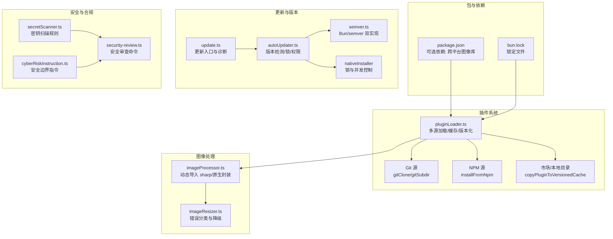
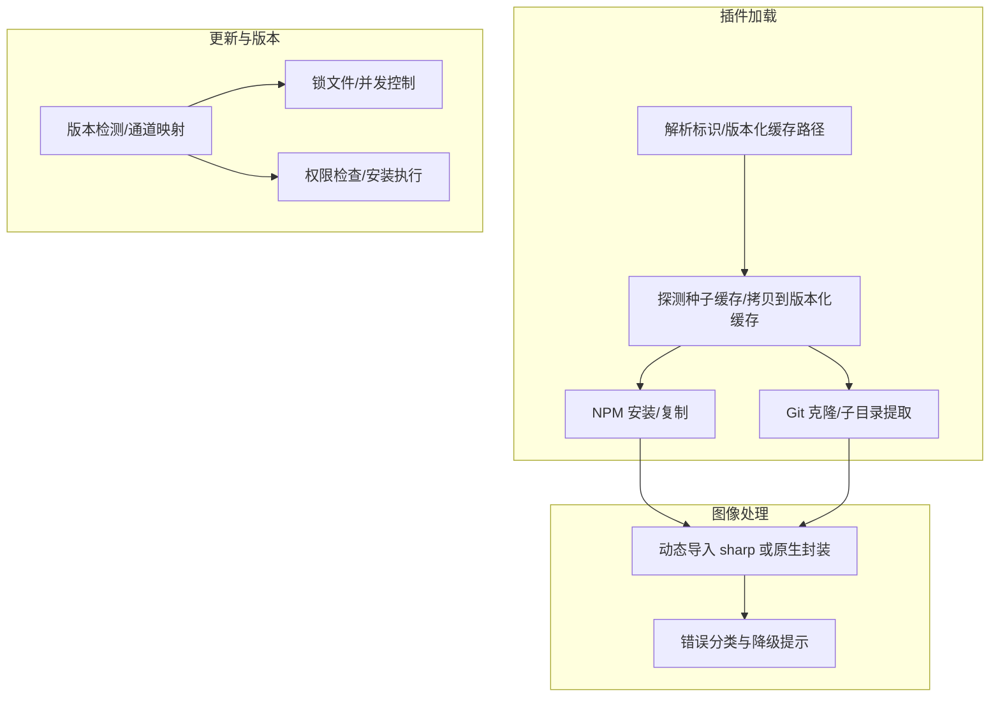
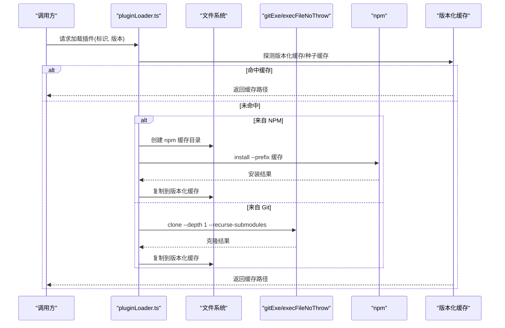
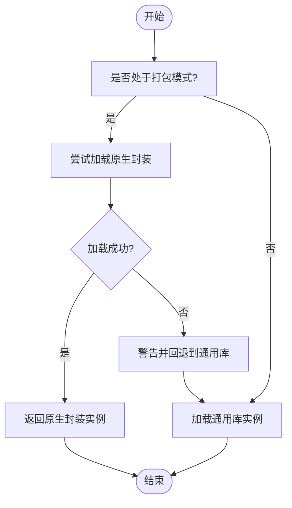
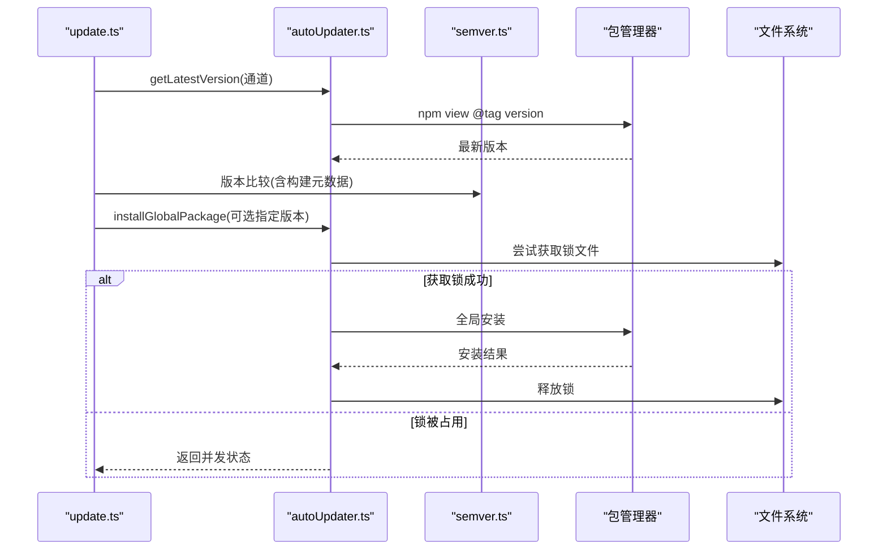
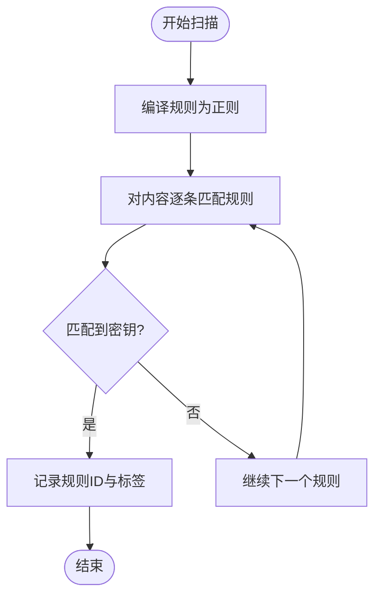
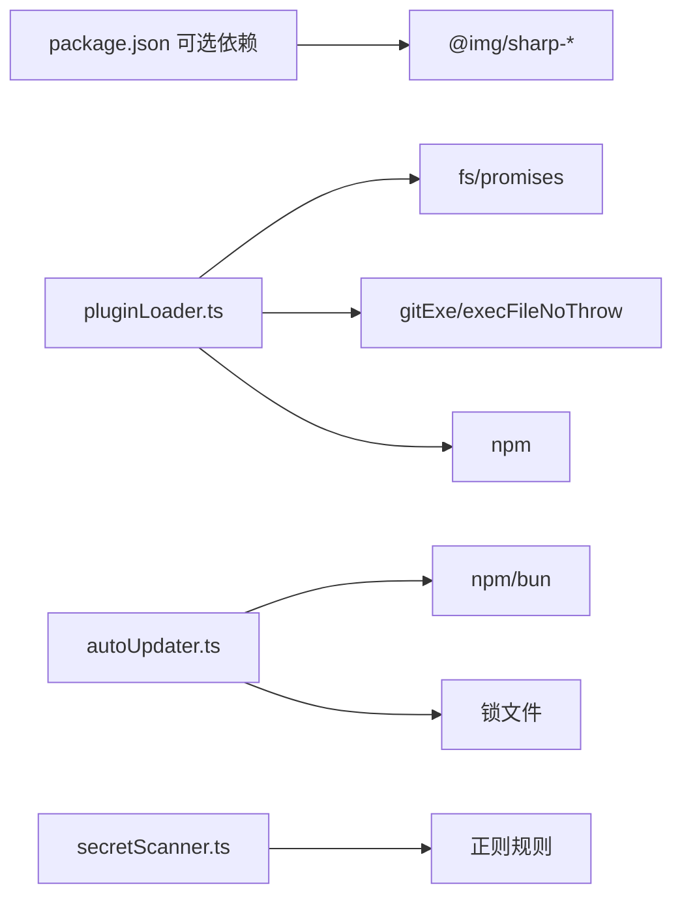

# 第三方库集成

<cite>
**本文引用的文件**
- [package.json](file://package.json)
- [bun.lock](file://bun.lock)
- [pluginLoader.ts](file://src/utils/plugins/pluginLoader.ts)
- [imageProcessor.ts](file://src/tools/FileReadTool/imageProcessor.ts)
- [imageResizer.ts](file://src/utils/imageResizer.ts)
- [update.ts](file://src/cli/update.ts)
- [autoUpdater.ts](file://src/utils/autoUpdater.ts)
- [semver.ts](file://src/utils/semver.ts)
- [installer.ts](file://src/utils/nativeInstaller/installer.ts)
- [pidLock.ts](file://src/utils/nativeInstaller/pidLock.ts)
- [secretScanner.ts](file://src/services/teamMemorySync/secretScanner.ts)
- [cyberRiskInstruction.ts](file://src/constants/cyberRiskInstruction.ts)
- [security-review.ts](file://src/commands/security-review.ts)
- [print.ts](file://src/cli/print.ts)
</cite>

## 目录
1. [简介](#简介)
2. [项目结构](#项目结构)
3. [核心组件](#核心组件)
4. [架构总览](#架构总览)
5. [详细组件分析](#详细组件分析)
6. [依赖关系分析](#依赖关系分析)
7. [性能考量](#性能考量)
8. [故障排查指南](#故障排查指南)
9. [结论](#结论)
10. [附录](#附录)

## 简介
本文件面向“第三方库集成管理”，聚焦于本项目在插件生态、图像处理、自动更新与版本管理、安全与合规等方面的实践。内容覆盖：
- 评估指标与选择标准：功能完备性、性能、许可证与安全、可维护性
- 集成策略：本地/远程来源、缓存与版本化路径、安装与加载流程
- 版本管理与升级策略：语义化版本比较、通道控制、锁机制与并发保护
- 配置与定制：全局配置、环境适配、性能优化
- 冲突解决与替代方案：多源加载、回退策略、错误分类
- 监控与维护：安全更新提醒、废弃库替换计划

## 项目结构
本项目采用模块化组织，第三方库主要通过以下方式引入与管理：
- 包管理器：以可选依赖形式引入平台特定的图像处理二进制包（如跨平台图像库），用于在不同运行环境下提供一致的图像处理能力
- 插件系统：支持从市场、Git 仓库、NPM 等多种来源加载插件，并进行缓存、版本化与校验
- 自动更新：基于 npm/GCS 的版本检测与安装，结合锁文件避免并发冲突
- 安全与合规：内置密钥扫描规则集、安全指令约束与安全审查命令

图表来源
- [package.json:22-32](file://package.json#L22-L32)
- [bun.lock:7-17](file://bun.lock#L7-L17)
- [pluginLoader.ts:492-524](file://src/utils/plugins/pluginLoader.ts#L492-L524)
- [pluginLoader.ts:534-640](file://src/utils/plugins/pluginLoader.ts#L534-L640)
- [imageProcessor.ts:37-85](file://src/tools/FileReadTool/imageProcessor.ts#L37-L85)
- [imageResizer.ts:50-76](file://src/utils/imageResizer.ts#L50-L76)
- [update.ts:30-422](file://src/cli/update.ts#L30-L422)
- [autoUpdater.ts:319-344](file://src/utils/autoUpdater.ts#L319-L344)
- [semver.ts:19-59](file://src/utils/semver.ts#L19-L59)
- [installer.ts:564-588](file://src/utils/nativeInstaller/installer.ts#L564-L588)
- [pidLock.ts:330-347](file://src/utils/nativeInstaller/pidLock.ts#L330-L347)
- [secretScanner.ts:21-268](file://src/services/teamMemorySync/secretScanner.ts#L21-L268)
- [cyberRiskInstruction.ts:1-24](file://src/constants/cyberRiskInstruction.ts#L1-L24)
- [security-review.ts:141-212](file://src/commands/security-review.ts#L141-L212)

章节来源
- [package.json:1-34](file://package.json#L1-L34)
- [bun.lock:1-22](file://bun.lock#L1-L22)

## 核心组件
- 插件加载与缓存：统一从市场、Git/NPM 等来源拉取与缓存，支持版本化路径与种子缓存，确保可重复与高性能
- 图像处理：动态导入跨平台图像库或原生封装，提供元数据读取、缩放与编码能力，并对缺失模块等错误进行分类与降级
- 自动更新：多通道版本检测、权限检查、锁文件并发控制、GCS 回退，支持本地/全局安装路径
- 安全与合规：内置密钥扫描规则集、安全边界指令、安全审查命令与硬限制清单

章节来源
- [pluginLoader.ts:126-287](file://src/utils/plugins/pluginLoader.ts#L126-L287)
- [imageProcessor.ts:37-85](file://src/tools/FileReadTool/imageProcessor.ts#L37-L85)
- [imageResizer.ts:50-76](file://src/utils/imageResizer.ts#L50-L76)
- [update.ts:30-422](file://src/cli/update.ts#L30-L422)
- [autoUpdater.ts:319-344](file://src/utils/autoUpdater.ts#L319-L344)
- [secretScanner.ts:21-268](file://src/services/teamMemorySync/secretScanner.ts#L21-L268)
- [cyberRiskInstruction.ts:1-24](file://src/constants/cyberRiskInstruction.ts#L1-L24)
- [security-review.ts:141-212](file://src/commands/security-review.ts#L141-L212)

## 架构总览
下图展示了第三方库在插件系统、图像处理与自动更新中的交互关系。

图表来源
- [pluginLoader.ts:139-188](file://src/utils/plugins/pluginLoader.ts#L139-L188)
- [pluginLoader.ts:365-465](file://src/utils/plugins/pluginLoader.ts#L365-L465)
- [pluginLoader.ts:492-524](file://src/utils/plugins/pluginLoader.ts#L492-L524)
- [pluginLoader.ts:534-640](file://src/utils/plugins/pluginLoader.ts#L534-L640)
- [imageProcessor.ts:37-85](file://src/tools/FileReadTool/imageProcessor.ts#L37-L85)
- [imageResizer.ts:50-76](file://src/utils/imageResizer.ts#L50-L76)
- [autoUpdater.ts:168-268](file://src/utils/autoUpdater.ts#L168-L268)
- [autoUpdater.ts:456-533](file://src/utils/autoUpdater.ts#L456-L533)

## 详细组件分析

### 组件A：插件加载与缓存（多源、版本化、缓存）
- 多源支持：市场、会话内、本地目录、Git 子目录、NPM
- 版本化缓存：按市场/插件/版本生成路径，支持 ZIP 缓存与种子缓存
- 安装流程：NPM 使用全局缓存目录；Git 支持浅克隆、稀疏检出与指定提交
- 错误处理：严格路径校验、空缓存检测、网络失败分类与日志记录

图表来源
- [pluginLoader.ts:139-188](file://src/utils/plugins/pluginLoader.ts#L139-L188)
- [pluginLoader.ts:365-465](file://src/utils/plugins/pluginLoader.ts#L365-L465)
- [pluginLoader.ts:492-524](file://src/utils/plugins/pluginLoader.ts#L492-L524)
- [pluginLoader.ts:534-640](file://src/utils/plugins/pluginLoader.ts#L534-L640)

章节来源
- [pluginLoader.ts:126-287](file://src/utils/plugins/pluginLoader.ts#L126-L287)
- [pluginLoader.ts:365-465](file://src/utils/plugins/pluginLoader.ts#L365-L465)
- [pluginLoader.ts:492-524](file://src/utils/plugins/pluginLoader.ts#L492-L524)
- [pluginLoader.ts:534-640](file://src/utils/plugins/pluginLoader.ts#L534-L640)

### 组件B：图像处理（动态导入与错误分类）
- 动态导入：优先尝试原生封装，失败时回退到通用图像库；提供统一接口类型
- 错误分类：基于 Node.js 错误码与消息匹配，区分模块加载、权限、内存等问题
- 性能与可用性：在打包模式与非打包模式下分别选择最优实现

图表来源
- [imageProcessor.ts:37-85](file://src/tools/FileReadTool/imageProcessor.ts#L37-L85)
- [imageResizer.ts:50-76](file://src/utils/imageResizer.ts#L50-L76)

章节来源
- [imageProcessor.ts:37-85](file://src/tools/FileReadTool/imageProcessor.ts#L37-L85)
- [imageResizer.ts:50-76](file://src/utils/imageResizer.ts#L50-L76)

### 组件C：自动更新与版本管理（通道、锁与权限）
- 版本检测：根据通道映射到 npm 标签，支持 GCS 回退；支持历史版本查询
- 并发控制：锁文件避免并发更新；支持重试与过期清理
- 权限检查：检测全局安装前缀写权限，防止失败安装
- 升级策略：本地/全局安装路径切换，配置跟踪与诊断输出

图表来源
- [update.ts:30-422](file://src/cli/update.ts#L30-L422)
- [autoUpdater.ts:319-344](file://src/utils/autoUpdater.ts#L319-L344)
- [autoUpdater.ts:456-533](file://src/utils/autoUpdater.ts#L456-L533)
- [autoUpdater.ts:168-268](file://src/utils/autoUpdater.ts#L168-L268)
- [semver.ts:19-59](file://src/utils/semver.ts#L19-L59)

章节来源
- [update.ts:30-422](file://src/cli/update.ts#L30-L422)
- [autoUpdater.ts:319-344](file://src/utils/autoUpdater.ts#L319-L344)
- [autoUpdater.ts:456-533](file://src/utils/autoUpdater.ts#L456-L533)
- [autoUpdater.ts:168-268](file://src/utils/autoUpdater.ts#L168-L268)
- [semver.ts:19-59](file://src/utils/semver.ts#L19-L59)

### 组件D：安全与合规（密钥扫描、安全指令与审查）
- 密钥扫描：基于 gitleaks 规则子集，编译为正则表达式进行扫描，标注规则标签
- 安全边界：明确防御性安全协助与拒绝项，指导模型行为
- 安全审查：提供安全审查命令，内置硬限制清单，过滤常见误报场景

图表来源
- [secretScanner.ts:226-237](file://src/services/teamMemorySync/secretScanner.ts#L226-L237)
- [secretScanner.ts:243-268](file://src/services/teamMemorySync/secretScanner.ts#L243-L268)
- [cyberRiskInstruction.ts:1-24](file://src/constants/cyberRiskInstruction.ts#L1-L24)
- [security-review.ts:141-212](file://src/commands/security-review.ts#L141-L212)

章节来源
- [secretScanner.ts:21-268](file://src/services/teamMemorySync/secretScanner.ts#L21-L268)
- [cyberRiskInstruction.ts:1-24](file://src/constants/cyberRiskInstruction.ts#L1-L24)
- [security-review.ts:141-212](file://src/commands/security-review.ts#L141-L212)

## 依赖关系分析
- 包与可选依赖：通过可选依赖引入跨平台图像库，满足不同操作系统与运行环境的图像处理需求
- 插件系统依赖：对文件系统、Git、NPM 的调用构成核心依赖链
- 更新系统依赖：对包管理器、文件系统与网络访问的依赖，以及锁文件的并发控制
- 安全依赖：正则表达式与规则集构成密钥扫描依赖

图表来源
- [package.json:22-32](file://package.json#L22-L32)
- [bun.lock:7-17](file://bun.lock#L7-L17)
- [pluginLoader.ts:47-76](file://src/utils/plugins/pluginLoader.ts#L47-L76)
- [autoUpdater.ts:1-30](file://src/utils/autoUpdater.ts#L1-L30)
- [secretScanner.ts:21-30](file://src/services/teamMemorySync/secretScanner.ts#L21-L30)

章节来源
- [package.json:1-34](file://package.json#L1-L34)
- [bun.lock:1-22](file://bun.lock#L1-L22)
- [pluginLoader.ts:47-76](file://src/utils/plugins/pluginLoader.ts#L47-L76)
- [autoUpdater.ts:1-30](file://src/utils/autoUpdater.ts#L1-L30)
- [secretScanner.ts:21-30](file://src/services/teamMemorySync/secretScanner.ts#L21-L30)

## 性能考量
- 插件加载
  - 浅克隆与稀疏检出显著降低网络与磁盘开销
  - 版本化缓存与 ZIP 缓存减少重复下载与解压
  - 种子缓存优先命中，避免重复拉取
- 图像处理
  - 动态导入优先使用原生封装，回退到通用库保证可用性
  - 错误分类快速定位问题，减少无效重试
- 自动更新
  - 锁文件避免并发冲突导致的资源竞争
  - 通道映射与 GCS 回退提升版本检测稳定性
- 版本比较
  - 在可用环境中优先使用更快的内置版本比较实现

章节来源
- [pluginLoader.ts:534-640](file://src/utils/plugins/pluginLoader.ts#L534-L640)
- [pluginLoader.ts:365-465](file://src/utils/plugins/pluginLoader.ts#L365-L465)
- [imageProcessor.ts:37-85](file://src/tools/FileReadTool/imageProcessor.ts#L37-L85)
- [imageResizer.ts:50-76](file://src/utils/imageResizer.ts#L50-L76)
- [autoUpdater.ts:168-268](file://src/utils/autoUpdater.ts#L168-L268)
- [semver.ts:19-59](file://src/utils/semver.ts#L19-L59)

## 故障排查指南
- 插件加载
  - 症状：无法找到源目录或缓存为空
  - 排查：确认市场条目 source 字段、路径校验与种子缓存命中；检查复制后目录是否存在内容
  - 参考
    - [pluginLoader.ts:415-452](file://src/utils/plugins/pluginLoader.ts#L415-L452)
    - [pluginLoader.ts:400-408](file://src/utils/plugins/pluginLoader.ts#L400-L408)
- 图像处理
  - 症状：模块加载失败或权限错误
  - 排查：检查错误码与消息匹配，确认原生封装可用性与回退逻辑
  - 参考
    - [imageResizer.ts:50-76](file://src/utils/imageResizer.ts#L50-L76)
    - [imageProcessor.ts:37-85](file://src/tools/FileReadTool/imageProcessor.ts#L37-L85)
- 自动更新
  - 症状：并发更新冲突或权限不足
  - 排查：检查锁文件存在与过期、全局前缀写权限；必要时移除过期锁
  - 参考
    - [autoUpdater.ts:168-268](file://src/utils/autoUpdater.ts#L168-L268)
    - [autoUpdater.ts:456-533](file://src/utils/autoUpdater.ts#L456-L533)
- 安全与合规
  - 症状：密钥泄露风险或安全边界误用
  - 排查：核对扫描规则与标签、安全指令约束与审查命令过滤清单
  - 参考
    - [secretScanner.ts:226-237](file://src/services/teamMemorySync/secretScanner.ts#L226-L237)
    - [cyberRiskInstruction.ts:1-24](file://src/constants/cyberRiskInstruction.ts#L1-L24)
    - [security-review.ts:141-212](file://src/commands/security-review.ts#L141-L212)

章节来源
- [pluginLoader.ts:400-452](file://src/utils/plugins/pluginLoader.ts#L400-L452)
- [imageResizer.ts:50-76](file://src/utils/imageResizer.ts#L50-L76)
- [imageProcessor.ts:37-85](file://src/tools/FileReadTool/imageProcessor.ts#L37-L85)
- [autoUpdater.ts:168-268](file://src/utils/autoUpdater.ts#L168-L268)
- [autoUpdater.ts:456-533](file://src/utils/autoUpdater.ts#L456-L533)
- [secretScanner.ts:226-237](file://src/services/teamMemorySync/secretScanner.ts#L226-L237)
- [cyberRiskInstruction.ts:1-24](file://src/constants/cyberRiskInstruction.ts#L1-L24)
- [security-review.ts:141-212](file://src/commands/security-review.ts#L141-L212)

## 结论
本项目在第三方库集成方面形成了清晰的策略与流程：
- 以插件系统为核心扩展点，支持多源、版本化与缓存，兼顾性能与可靠性
- 以动态导入与错误分类保障图像处理在不同环境下的可用性
- 以通道、锁与权限检查确保更新过程的安全与稳定
- 以密钥扫描、安全指令与审查命令强化安全与合规
建议持续关注依赖生命周期、安全通告与许可证合规，完善自动化扫描与升级策略。

## 附录
- 评估指标与选择标准
  - 功能与兼容性：是否满足业务需求与平台特性
  - 性能与体积：对启动时间、内存与 I/O 的影响
  - 许可证与合规：遵循项目许可策略与开源合规要求
  - 社区与维护：活跃度、安全公告响应速度
- 版本管理与升级策略
  - 通道控制：稳定/最新通道映射与最小版本限制
  - 并发保护：锁文件与重试策略
  - 回退与诊断：GCS 回退、诊断输出与错误分类
- 配置与定制
  - 全局配置：安装方式、通道、最小版本
  - 环境适配：跨平台二进制、原生封装回退
  - 性能优化：缓存、稀疏检出、浅克隆
- 冲突解决与替代方案
  - 多源加载与回退：市场/本地/远程优先级与降级
  - 错误分类与可观测性：错误码与消息匹配
- 监控与维护
  - 安全更新提醒：版本检测与最大版本限制
  - 废弃库替换：规则集更新与替代实现验证