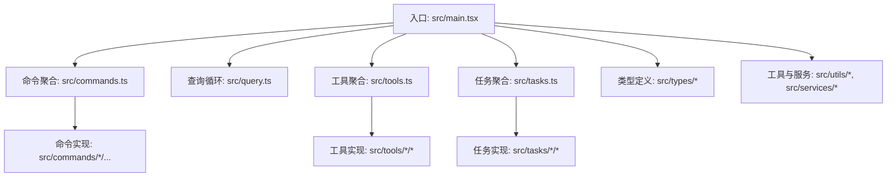
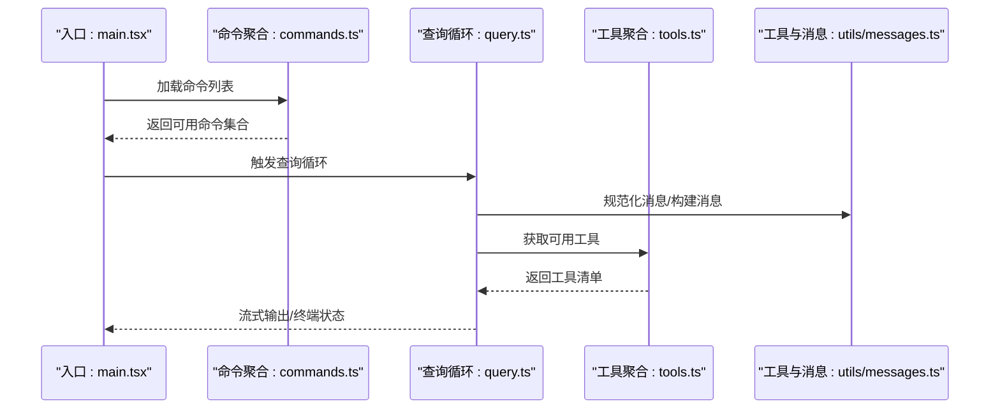
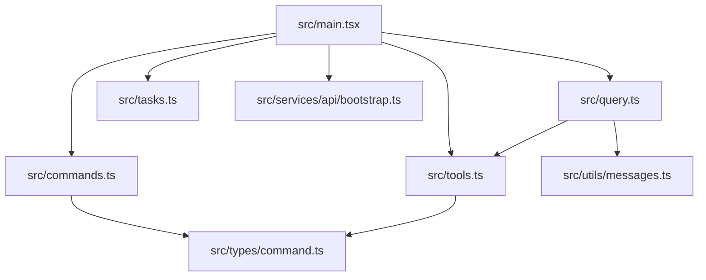
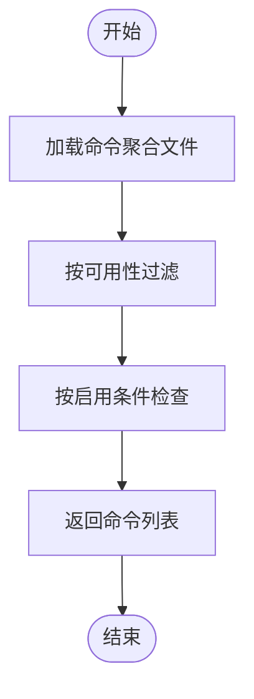

# 代码组织规范

<cite>
**本文档引用的文件**
- [README.md](file://README.md)
- [package.json](file://package.json)
- [src/main.tsx](file://src/main.tsx)
- [src/commands.ts](file://src/commands.ts)
- [src/query.ts](file://src/query.ts)
- [src/tools.ts](file://src/tools.ts)
- [src/tasks.ts](file://src/tasks.ts)
- [src/commands/init.ts](file://src/commands/init.ts)
- [src/services/api/bootstrap.ts](file://src/services/api/bootstrap.ts)
- [src/utils/messages.ts](file://src/utils/messages.ts)
- [src/types/command.ts](file://src/types/command.ts)
</cite>

## 目录
1. [引言](#引言)
2. [项目结构](#项目结构)
3. [核心组件](#核心组件)
4. [架构总览](#架构总览)
5. [详细组件分析](#详细组件分析)
6. [依赖关系分析](#依赖关系分析)
7. [性能考量](#性能考量)
8. [故障排查指南](#故障排查指南)
9. [结论](#结论)
10. [附录](#附录)

## 引言
本规范旨在为 Claude Code 的代码组织提供系统化、可操作的指导，覆盖文件拆分原则（单一职责、功能内聚、文件大小限制）、模块导出规范（命名导出与默认导出）、导入路径管理（相对路径、绝对路径与模块别名）、具体组织示例（良好实践与常见错误）以及代码注释规范（文件头注释、函数注释、复杂逻辑注释）。  
本规范以仓库现有代码为依据，结合入口点、命令体系、工具体系、任务体系与核心查询流程等关键模块进行深入分析，并通过图示展示模块间的交互关系。

## 项目结构
项目采用按“领域/功能”划分的目录结构，主要模块如下：
- 入口与主流程：src/main.tsx、src/query.ts
- 命令体系：src/commands.ts 及各子命令文件
- 工具体系：src/tools.ts 及各工具实现
- 任务体系：src/tasks.ts 及各任务实现
- 类型定义：src/types 下的类型声明
- 工具与服务：src/utils、src/services 等
- 组件与UI：src/components、src/ink 等
- 常量与配置：src/constants、src/entrypoints 等

图表来源
- [src/main.tsx:1-120](file://src/main.tsx#L1-L120)
- [src/commands.ts:1-120](file://src/commands.ts#L1-L120)
- [src/query.ts:1-120](file://src/query.ts#L1-L120)
- [src/tools.ts:1-120](file://src/tools.ts#L1-L120)
- [src/tasks.ts:1-40](file://src/tasks.ts#L1-L40)

章节来源
- [README.md:95-114](file://README.md#L95-L114)
- [package.json:1-34](file://package.json#L1-L34)

## 核心组件
- 入口与启动：src/main.tsx 负责初始化、预取、特性门控与延迟加载，确保启动性能与功能按需启用。
- 命令系统：src/commands.ts 聚合所有命令，支持条件导入、动态加载与可用性过滤。
- 查询引擎：src/query.ts 实现消息规范化、上下文压缩、工具执行与流式响应处理。
- 工具系统：src/tools.ts 聚合内置工具与 MCP 工具，支持权限过滤与去重。
- 任务系统：src/tasks.ts 聚合任务类型，支持条件导入。
- 类型与契约：src/types/command.ts 定义命令类型、参数与行为契约。
- 消息与上下文：src/utils/messages.ts 提供消息构建、规范化与工具结果处理。
- 启动数据：src/services/api/bootstrap.ts 提供引导数据拉取与缓存。

章节来源
- [src/main.tsx:1-200](file://src/main.tsx#L1-L200)
- [src/commands.ts:258-346](file://src/commands.ts#L258-L346)
- [src/query.ts:219-320](file://src/query.ts#L219-L320)
- [src/tools.ts:193-251](file://src/tools.ts#L193-L251)
- [src/tasks.ts:22-32](file://src/tasks.ts#L22-L32)
- [src/types/command.ts:175-206](file://src/types/command.ts#L175-L206)
- [src/utils/messages.ts:460-523](file://src/utils/messages.ts#L460-L523)
- [src/services/api/bootstrap.ts:114-142](file://src/services/api/bootstrap.ts#L114-L142)

## 架构总览
下图展示了从入口到命令、工具与查询的核心交互：

图表来源
- [src/main.tsx:585-720](file://src/main.tsx#L585-L720)
- [src/commands.ts:476-517](file://src/commands.ts#L476-L517)
- [src/query.ts:219-320](file://src/query.ts#L219-L320)
- [src/tools.ts:345-389](file://src/tools.ts#L345-L389)
- [src/utils/messages.ts:460-523](file://src/utils/messages.ts#L460-L523)

## 详细组件分析

### 文件拆分原则
- 单一职责原则
  - 命令模块仅负责命令注册、可用性与动态加载，不包含业务逻辑。例如命令聚合文件集中导出与过滤逻辑，具体命令实现位于独立文件中。
  - 工具模块仅负责工具注册、权限过滤与去重，不包含业务逻辑。
  - 查询模块专注于消息规范化、上下文压缩、工具执行与流式响应，不混入 UI 或持久化细节。
- 功能内聚性要求
  - 命令、工具、任务均通过各自的聚合文件集中管理，内部再按功能子目录细分，保持高内聚低耦合。
  - 类型定义集中在 types 目录，形成稳定的契约层，避免跨模块重复定义。
- 文件大小限制
  - 对于大型模块（如命令聚合、查询循环），采用延迟加载与条件导入，避免一次性加载造成体积与启动时间压力。
  - 使用 memoize 缓存昂贵计算结果，减少重复开销。

章节来源
- [src/commands.ts:258-346](file://src/commands.ts#L258-L346)
- [src/tools.ts:193-251](file://src/tools.ts#L193-L251)
- [src/query.ts:219-320](file://src/query.ts#L219-L320)

### 模块导出规范
- 导出策略
  - 命令聚合导出统一的命令列表与过滤器，便于上层按需选择；同时导出类型定义，保证类型安全。
  - 工具聚合导出工具池组装函数与过滤函数，支持内置与 MCP 工具合并。
  - 查询模块导出查询生成器与状态管理相关函数，便于测试与复用。
- 命名导出与默认导出
  - 命令与工具聚合文件采用命名导出，明确暴露接口；对单体命令或工具实现采用默认导出，便于按需懒加载。
  - 类型定义采用命名导出，避免默认导出带来的查找成本。

章节来源
- [src/commands.ts:212-222](file://src/commands.ts#L212-L222)
- [src/tools.ts:98-103](file://src/tools.ts#L98-L103)
- [src/types/command.ts:175-206](file://src/types/command.ts#L175-L206)

### 导入路径管理
- 相对路径导入
  - 在同一功能域内的模块间优先使用相对路径，降低跨包依赖风险。
- 绝对路径导入
  - 对于跨功能域或共享模块（如 utils、services、types），采用绝对路径导入，提升可读性与维护性。
- 模块别名
  - 项目未显式配置模块别名，建议在团队内约定别名（如 src/*）以统一导入风格，避免深层相对路径。

章节来源
- [src/main.tsx:1-120](file://src/main.tsx#L1-L120)
- [src/commands.ts:1-60](file://src/commands.ts#L1-L60)
- [src/tools.ts:1-60](file://src/tools.ts#L1-L60)

### 具体组织示例

#### 好的代码组织实践
- 命令组织
  - 将命令实现拆分为独立文件，聚合文件仅负责注册、过滤与导出，符合单一职责。
  - 使用条件导入与动态加载，减少非必要模块的初始加载。
- 工具组织
  - 工具实现按功能分层，聚合文件负责组装与权限过滤，保证内聚性。
- 查询组织
  - 查询循环将消息规范化、上下文压缩、工具执行与流式响应分离，便于测试与扩展。

章节来源
- [src/commands.ts:258-346](file://src/commands.ts#L258-L346)
- [src/tools.ts:193-251](file://src/tools.ts#L193-L251)
- [src/query.ts:219-320](file://src/query.ts#L219-L320)

#### 常见组织错误
- 过度耦合
  - 将命令实现与聚合文件混合，导致职责不清，难以测试与维护。
- 导入混乱
  - 同一模块中混用相对路径与绝对路径，缺乏一致性，增加维护成本。
- 缺少条件导入
  - 大型模块未采用条件导入与懒加载，导致启动时间过长与内存占用过高。

章节来源
- [src/commands.ts:400-470](file://src/commands.ts#L400-L470)
- [src/main.tsx:1-120](file://src/main.tsx#L1-L120)

### 代码注释规范
- 文件头部注释
  - 建议在每个模块顶部添加简要说明，概述模块职责、关键导出与适用场景。
- 函数注释
  - 对外暴露的公共函数应包含用途、参数说明、返回值与异常处理提示。
- 复杂逻辑注释
  - 对于复杂的控制流（如查询循环中的压缩、工具执行与恢复机制），应在关键节点添加注释说明目的与边界条件。

章节来源
- [src/query.ts:151-163](file://src/query.ts#L151-L163)
- [src/utils/messages.ts:460-523](file://src/utils/messages.ts#L460-L523)

## 依赖关系分析

图表来源
- [src/main.tsx:1-120](file://src/main.tsx#L1-L120)
- [src/commands.ts:1-60](file://src/commands.ts#L1-L60)
- [src/query.ts:1-60](file://src/query.ts#L1-L60)
- [src/tools.ts:1-60](file://src/tools.ts#L1-L60)
- [src/tasks.ts:1-40](file://src/tasks.ts#L1-L40)
- [src/types/command.ts:1-60](file://src/types/command.ts#L1-L60)
- [src/utils/messages.ts:1-60](file://src/utils/messages.ts#L1-L60)
- [src/services/api/bootstrap.ts:1-60](file://src/services/api/bootstrap.ts#L1-L60)

章节来源
- [src/main.tsx:1-120](file://src/main.tsx#L1-L120)
- [src/commands.ts:1-60](file://src/commands.ts#L1-L60)
- [src/query.ts:1-60](file://src/query.ts#L1-L60)
- [src/tools.ts:1-60](file://src/tools.ts#L1-L60)
- [src/tasks.ts:1-40](file://src/tasks.ts#L1-L40)
- [src/types/command.ts:1-60](file://src/types/command.ts#L1-L60)
- [src/utils/messages.ts:1-60](file://src/utils/messages.ts#L1-L60)
- [src/services/api/bootstrap.ts:1-60](file://src/services/api/bootstrap.ts#L1-L60)

## 性能考量
- 启动性能
  - 通过特性门控与条件导入减少初始加载模块数量；延迟加载重型模块（如技能搜索、事件循环检测）。
- 内存与计算
  - 使用 memoize 缓存昂贵计算（命令列表、技能索引等）；对工具结果预算与内容替换进行及时清理。
- I/O 与网络
  - 引导数据采用缓存策略，避免重复请求；对第三方服务调用设置超时与重试。

章节来源
- [src/main.tsx:388-431](file://src/main.tsx#L388-L431)
- [src/commands.ts:449-469](file://src/commands.ts#L449-L469)
- [src/services/api/bootstrap.ts:114-142](file://src/services/api/bootstrap.ts#L114-L142)

## 故障排查指南
- 命令不可用
  - 检查命令可用性过滤与特性门控；确认命令是否被权限规则屏蔽。
- 工具执行失败
  - 查看工具结果预算与内容替换记录；核对工具名称匹配与权限上下文。
- 查询阻塞
  - 关注令牌上限与自动压缩触发条件；检查上下文折叠与反应式压缩的协同效果。
- 引导数据异常
  - 校验认证状态与隐私级别；确认缓存一致性与写盘逻辑。

章节来源
- [src/commands.ts:417-443](file://src/commands.ts#L417-L443)
- [src/tools.ts:262-269](file://src/tools.ts#L262-L269)
- [src/query.ts:628-648](file://src/query.ts#L628-L648)
- [src/services/api/bootstrap.ts:114-142](file://src/services/api/bootstrap.ts#L114-L142)

## 结论
本规范基于 Claude Code 代码库的实际组织方式，总结了文件拆分、导出与导入路径管理的最佳实践，并提供了注释规范与故障排查建议。遵循这些原则有助于提升代码的可维护性、可扩展性与团队协作效率。

## 附录
- 示例：命令初始化流程
  - 通过命令聚合文件动态加载命令实现，结合特性门控与可用性检查，确保只暴露用户可使用的命令集。

图表来源
- [src/commands.ts:417-443](file://src/commands.ts#L417-L443)
- [src/commands.ts:476-517](file://src/commands.ts#L476-L517)

章节来源
- [src/commands.ts:417-443](file://src/commands.ts#L417-L443)
- [src/commands.ts:476-517](file://src/commands.ts#L476-L517)