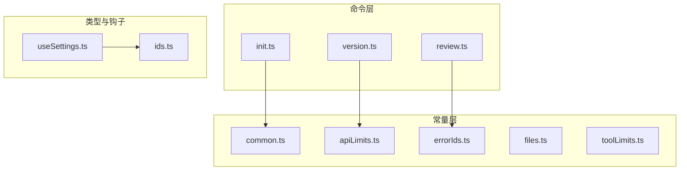
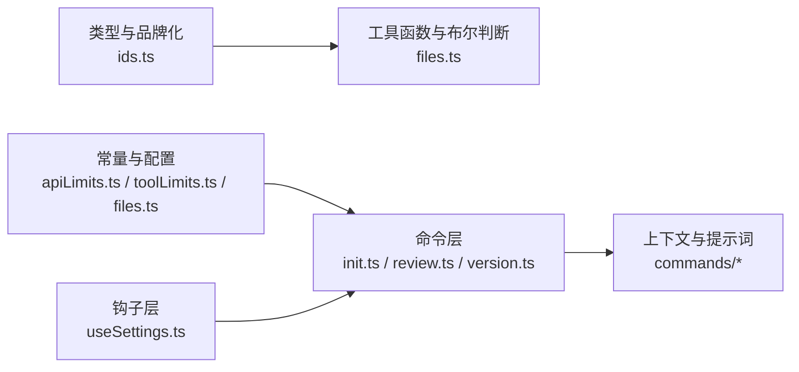
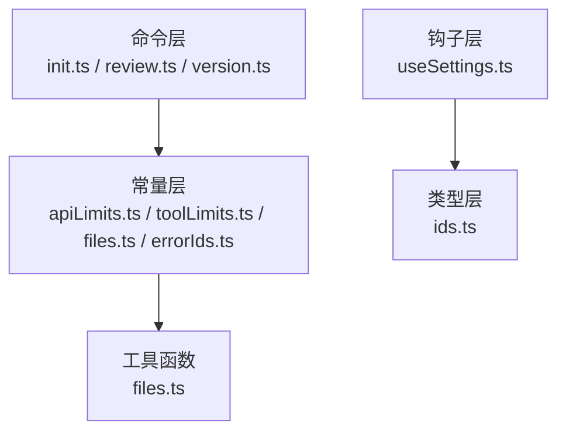

# 变量与函数命名

<cite>
**本文引用的文件**
- [README.md](file://README.md)
- [common.ts](file://src/constants/common.ts)
- [ids.ts](file://src/types/ids.ts)
- [apiLimits.ts](file://src/constants/apiLimits.ts)
- [errorIds.ts](file://src/constants/errorIds.ts)
- [files.ts](file://src/constants/files.ts)
- [toolLimits.ts](file://src/constants/toolLimits.ts)
- [init.ts](file://src/commands/init.ts)
- [review.ts](file://src/commands/review.ts)
- [version.ts](file://src/commands/version.ts)
- [useSettings.ts](file://src/hooks/useSettings.ts)
</cite>

## 目录
1. [简介](#简介)
2. [项目结构](#项目结构)
3. [核心组件](#核心组件)
4. [架构总览](#架构总览)
5. [详细组件分析](#详细组件分析)
6. [依赖分析](#依赖分析)
7. [性能考虑](#性能考虑)
8. [故障排查指南](#故障排查指南)
9. [结论](#结论)
10. [附录](#附录)

## 简介
本文件面向 Claude Code 的 TypeScript/TSX 代码库，系统化梳理变量与函数命名规范，覆盖以下主题：
- 变量命名约定：驼峰命名法、帕斯卡命名法、下划线命名法的使用场景
- 函数命名规范：动词开头、布尔值函数的问号后缀、回调函数命名
- 常量命名规范：全大写加下划线、枚举值命名
- TypeScript 特定命名：接口命名、类型别名、泛型参数
- 结合仓库中的实际文件进行示例说明与常见错误识别

## 项目结构
该仓库为 CLI 工具的 TypeScript 源码提取版本，采用按功能域分层的组织方式：
- src/commands：命令实现（含提示词与本地命令）
- src/constants：常量定义（API 限制、错误标识、文件类型等）
- src/hooks：React Hooks（状态访问与设置）
- src/types：品牌化类型与工具函数
- 其他目录包含服务、工具、组件、工具方法等

图表来源
- [init.ts:1-257](file://src/commands/init.ts#L1-L257)
- [review.ts:1-58](file://src/commands/review.ts#L1-L58)
- [version.ts:1-23](file://src/commands/version.ts#L1-L23)
- [common.ts:1-34](file://src/constants/common.ts#L1-L34)
- [apiLimits.ts:1-95](file://src/constants/apiLimits.ts#L1-L95)
- [errorIds.ts:1-16](file://src/constants/errorIds.ts#L1-L16)
- [files.ts:1-157](file://src/constants/files.ts#L1-L157)
- [toolLimits.ts:1-57](file://src/constants/toolLimits.ts#L1-L57)
- [ids.ts:1-45](file://src/types/ids.ts#L1-L45)
- [useSettings.ts:1-18](file://src/hooks/useSettings.ts#L1-L18)

章节来源
- [README.md:95-114](file://README.md#L95-L114)

## 核心组件
本节从命名角度对关键文件进行要点提炼，帮助建立统一的命名风格共识。

- 常量与配置
  - 使用全大写加下划线命名，如 API 限制、目标尺寸、阈值等，便于在全局范围内快速识别与维护。
  - 示例路径：[apiLimits.ts:17-22](file://src/constants/apiLimits.ts#L17-L22)、[toolLimits.ts:13-22](file://src/constants/toolLimits.ts#L13-L22)

- 品牌化类型与工具函数
  - 类型别名采用帕斯卡命名；工厂/转换函数采用驼峰命名，保持“类型名 + 动词”的清晰语义。
  - 示例路径：[ids.ts:10-17](file://src/types/ids.ts#L10-L17)、[ids.ts:23-33](file://src/types/ids.ts#L23-L33)

- 工具函数与布尔判断
  - 动词开头的函数用于执行动作；布尔函数以“isXxx”或“hasXxx”等谓词形式命名，返回布尔值。
  - 示例路径：[files.ts:117-120](file://src/constants/files.ts#L117-L120)、[files.ts:131-156](file://src/constants/files.ts#L131-L156)

- 命令与钩子
  - 命令对象的名称与描述遵循简洁明确原则；钩子函数以 use 开头，返回状态或派生数据。
  - 示例路径：[init.ts:226-254](file://src/commands/init.ts#L226-L254)、[useSettings.ts:15-17](file://src/hooks/useSettings.ts#L15-L17)

章节来源
- [apiLimits.ts:1-95](file://src/constants/apiLimits.ts#L1-L95)
- [toolLimits.ts:1-57](file://src/constants/toolLimits.ts#L1-L57)
- [ids.ts:1-45](file://src/types/ids.ts#L1-L45)
- [files.ts:1-157](file://src/constants/files.ts#L1-L157)
- [init.ts:1-257](file://src/commands/init.ts#L1-L257)
- [useSettings.ts:1-18](file://src/hooks/useSettings.ts#L1-L18)

## 架构总览
从命名视角看，项目遵循“类型/常量/函数/命令/钩子”的分层命名策略，确保跨模块一致性与可读性。

图表来源
- [ids.ts:1-45](file://src/types/ids.ts#L1-L45)
- [files.ts:1-157](file://src/constants/files.ts#L1-L157)
- [apiLimits.ts:1-95](file://src/constants/apiLimits.ts#L1-L95)
- [toolLimits.ts:1-57](file://src/constants/toolLimits.ts#L1-L57)
- [init.ts:1-257](file://src/commands/init.ts#L1-L257)
- [review.ts:1-58](file://src/commands/review.ts#L1-L58)
- [version.ts:1-23](file://src/commands/version.ts#L1-L23)
- [useSettings.ts:1-18](file://src/hooks/useSettings.ts#L1-L18)

## 详细组件分析

### 变量命名约定
- 驼峰命名法（camelCase）：用于普通变量、函数参数、局部状态与非品牌化类型实例。
  - 示例路径：[common.ts:4-15](file://src/constants/common.ts#L4-L15) 中的日期相关函数与变量命名
- 帕斯卡命名法（PascalCase）：用于类型别名、类名、接口名、命令对象名等。
  - 示例路径：[ids.ts:10-17](file://src/types/ids.ts#L10-L17) 中的 SessionId、AgentId 类型
- 下划线命名法（UPPER_SNAKE_CASE 或 lower_snake_case）：用于常量与枚举值，提升可读性与搜索效率。
  - 示例路径：[apiLimits.ts:22-43](file://src/constants/apiLimits.ts#L22-L43)、[toolLimits.ts:13-22](file://src/constants/toolLimits.ts#L13-L22)

章节来源
- [common.ts:1-34](file://src/constants/common.ts#L1-L34)
- [ids.ts:1-45](file://src/types/ids.ts#L1-L45)
- [apiLimits.ts:1-95](file://src/constants/apiLimits.ts#L1-L95)
- [toolLimits.ts:1-57](file://src/constants/toolLimits.ts#L1-L57)

### 函数命名规范
- 动词开头：函数名以动词起始，表达意图与行为，避免模糊命名。
  - 示例路径：[files.ts:117-120](file://src/constants/files.ts#L117-L120) 的 hasBinaryExtension、[files.ts:131-156](file://src/constants/files.ts#L131-L156) 的 isBinaryContent
- 布尔值函数：以 isXxx/hasXxx/shouldXxx 等谓词形式命名，返回布尔值。
  - 示例路径：[files.ts:117-120](file://src/constants/files.ts#L117-L120)、[files.ts:131-156](file://src/constants/files.ts#L131-L156)
- 回调函数：以 onXxx/withXxx/forXxx 等前缀命名，明确触发时机或作用范围。
  - 示例路径：[init.ts:239-253](file://src/commands/init.ts#L239-L253) 中的 getPromptForCommand 等

章节来源
- [files.ts:1-157](file://src/constants/files.ts#L1-L157)
- [init.ts:1-257](file://src/commands/init.ts#L1-L257)

### 常量命名规范
- 全大写加下划线：用于数值、字符串、布尔标志等不可变常量，便于在全局范围内检索与替换。
  - 示例路径：[apiLimits.ts:22-43](file://src/constants/apiLimits.ts#L22-L43)、[toolLimits.ts:13-22](file://src/constants/toolLimits.ts#L13-L22)、[errorIds.ts:15-16](file://src/constants/errorIds.ts#L15-L16)
- 枚举值：若使用数字枚举，建议采用全大写；若使用字符串枚举，建议结合业务语义选择 UPPER_SNAKE_CASE 或帕斯卡命名。
  - 示例路径：[errorIds.ts:15-16](file://src/constants/errorIds.ts#L15-L16)

章节来源
- [apiLimits.ts:1-95](file://src/constants/apiLimits.ts#L1-L95)
- [toolLimits.ts:1-57](file://src/constants/toolLimits.ts#L1-L57)
- [errorIds.ts:1-16](file://src/constants/errorIds.ts#L1-L16)

### TypeScript 特定命名约定
- 接口命名：采用帕斯卡命名，描述抽象契约或配置结构。
  - 示例路径：[ids.ts:10-17](file://src/types/ids.ts#L10-L17) 中的 SessionId、AgentId 类型注解
- 类型别名：采用帕斯卡命名，配合品牌化字段增强编译期安全。
  - 示例路径：[ids.ts:10-17](file://src/types/ids.ts#L10-L17) 中的 SessionId、AgentId
- 泛型参数：采用单字母或简短语义化名称，常用 T、U、V 表示通用类型，E 表示错误类型。
  - 本仓库未直接展示该模式，但可参考品牌化类型中通过“只读品牌字段”实现的类型约束思路。

章节来源
- [ids.ts:1-45](file://src/types/ids.ts#L1-L45)

### 命名示例与最佳实践
- 好的命名实践
  - 使用 hasBinaryExtension/isBinaryContent 明确判断逻辑，避免使用模糊的 isOk/check 等命名。
  - 使用 API_IMAGE_MAX_BASE64_SIZE 等全大写常量，便于在多处引用时保持一致。
  - 使用 SessionId/AgentId 等品牌化类型，避免将原始字符串混用。
  - 使用 useSettings 获取设置，语义清晰且与 React Hooks 约定一致。
- 常见命名错误
  - 将布尔函数命名为 ok/check，应改为 isXxx/hasXxx。
  - 将常量使用小写或驼峰，应改为 UPPER_SNAKE_CASE。
  - 将类型别名使用驼峰，应改为帕斯卡命名以符合接口/类型约定。

章节来源
- [files.ts:1-157](file://src/constants/files.ts#L1-L157)
- [apiLimits.ts:1-95](file://src/constants/apiLimits.ts#L1-L95)
- [ids.ts:1-45](file://src/types/ids.ts#L1-L45)
- [useSettings.ts:1-18](file://src/hooks/useSettings.ts#L1-L18)

## 依赖分析
从命名角度观察模块间的耦合关系：
- 命令层依赖常量层与工具层，保证行为稳定与可测试性
- 钩子层依赖类型层，确保状态访问的类型安全
- 品牌化类型为上层提供强类型保障，降低运行时风险

图表来源
- [init.ts:1-257](file://src/commands/init.ts#L1-L257)
- [review.ts:1-58](file://src/commands/review.ts#L1-L58)
- [version.ts:1-23](file://src/commands/version.ts#L1-L23)
- [apiLimits.ts:1-95](file://src/constants/apiLimits.ts#L1-L95)
- [toolLimits.ts:1-57](file://src/constants/toolLimits.ts#L1-L57)
- [files.ts:1-157](file://src/constants/files.ts#L1-L157)
- [errorIds.ts:1-16](file://src/constants/errorIds.ts#L1-L16)
- [ids.ts:1-45](file://src/types/ids.ts#L1-L45)
- [useSettings.ts:1-18](file://src/hooks/useSettings.ts#L1-L18)

## 性能考虑
- 常量命名与缓存：将易变的日期/时间计算结果以常量形式缓存，减少重复计算与上下文抖动。
  - 示例路径：[common.ts:24-24](file://src/constants/common.ts#L24-L24)
- 布尔函数命名与分支：使用明确的谓词函数名，有助于静态分析与分支优化。
  - 示例路径：[files.ts:117-120](file://src/constants/files.ts#L117-L120)、[files.ts:131-156](file://src/constants/files.ts#L131-L156)

章节来源
- [common.ts:1-34](file://src/constants/common.ts#L1-L34)
- [files.ts:1-157](file://src/constants/files.ts#L1-L157)

## 故障排查指南
- 常量不一致导致的行为异常
  - 症状：不同模块对同一阈值的定义不一致，引发边界条件错误
  - 排查：检查是否使用了全大写常量，确认其在各模块中的引用是否一致
  - 参考路径：[apiLimits.ts:22-43](file://src/constants/apiLimits.ts#L22-L43)、[toolLimits.ts:13-22](file://src/constants/toolLimits.ts#L13-L22)
- 品牌化类型误用
  - 症状：将原始字符串当作会话 ID 或代理 ID 使用，导致运行时类型错误
  - 排查：确认是否通过 asSessionId/asAgentId 进行显式转换
  - 参考路径：[ids.ts:23-33](file://src/types/ids.ts#L23-L33)
- 布尔函数命名不规范
  - 症状：难以理解函数意图，影响可读性与测试覆盖
  - 排查：将 isXxx/hasXxx 命名替换为更贴切的谓词形式
  - 参考路径：[files.ts:117-120](file://src/constants/files.ts#L117-L120)、[files.ts:131-156](file://src/constants/files.ts#L131-L156)

章节来源
- [apiLimits.ts:1-95](file://src/constants/apiLimits.ts#L1-L95)
- [toolLimits.ts:1-57](file://src/constants/toolLimits.ts#L1-L57)
- [ids.ts:1-45](file://src/types/ids.ts#L1-L45)
- [files.ts:1-157](file://src/constants/files.ts#L1-L157)

## 结论
通过在项目中统一变量、函数、常量与类型的命名规范，可以显著提升代码的可读性、可维护性与类型安全性。建议团队在后续开发中：
- 强制使用驼峰命名法、帕斯卡命名法与全大写下划线命名法的分层约定
- 严格遵循布尔函数的谓词命名与回调函数的前缀命名
- 在 TypeScript 中优先使用帕斯卡命名的类型别名与品牌化类型
- 对常量集中管理并统一导出，避免散落定义

## 附录
- 命名约定速查
  - 变量：驼峰命名（如 localDate、filePath）
  - 类型/接口：帕斯卡命名（如 SessionId、AgentId）
  - 常量：全大写下划线（如 API_IMAGE_MAX_BASE64_SIZE）
  - 布尔函数：isXxx/hasXxx（如 hasBinaryExtension、isBinaryContent）
  - 回调函数：onXxx/withXxx（如 getPromptForCommand）