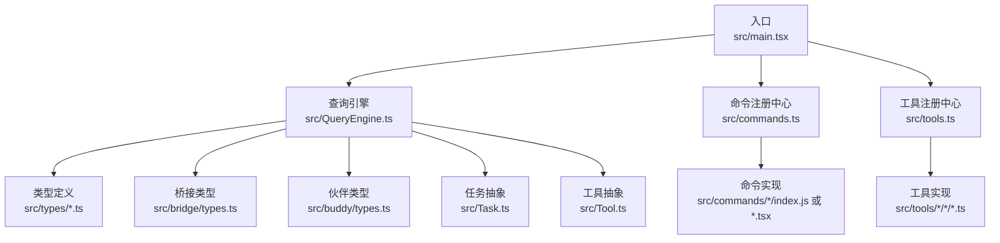
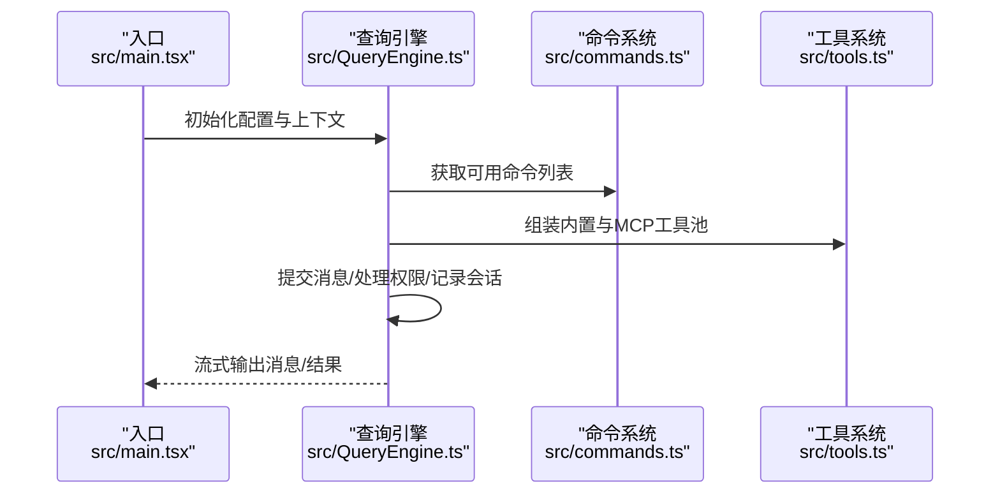
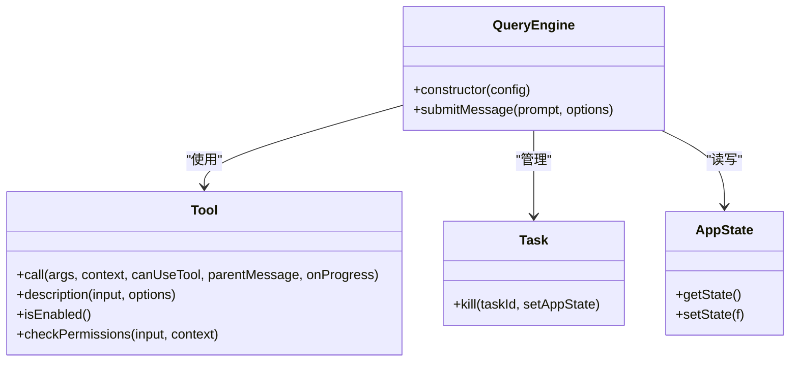
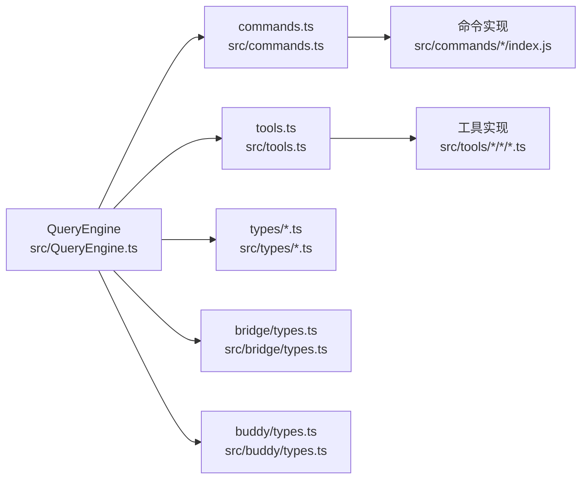

# 命名约定与规范

<cite>
**本文引用的文件**
- [README.md](file://README.md)
- [package.json](file://package.json)
- [src/main.tsx](file://src/main.tsx)
- [src/commands.ts](file://src/commands.ts)
- [src/tools.ts](file://src/tools.ts)
- [src/QueryEngine.ts](file://src/QueryEngine.ts)
- [src/Task.ts](file://src/Task.ts)
- [src/Tool.ts](file://src/Tool.ts)
- [src/types/command.ts](file://src/types/command.ts)
- [src/types/hooks.ts](file://src/types/hooks.ts)
- [src/bridge/types.ts](file://src/bridge/types.ts)
- [src/buddy/types.ts](file://src/buddy/types.ts)
</cite>

## 目录
1. [简介](#简介)
2. [项目结构](#项目结构)
3. [核心组件](#核心组件)
4. [架构总览](#架构总览)
5. [详细组件分析](#详细组件分析)
6. [依赖关系分析](#依赖关系分析)
7. [性能考量](#性能考量)
8. [故障排查指南](#故障排查指南)
9. [结论](#结论)
10. [附录](#附录)

## 简介
本文件系统化梳理 Claude Code（非官方源码提取）的命名约定与规范，覆盖文件命名、变量命名、函数命名、类命名、TypeScript 类型命名（接口、枚举、泛型参数）、目录命名、代码组织与模块导出、导入路径管理，并结合实际代码示例给出“好”的命名实践与常见反例，以及在团队协作中如何通过一致的命名提升可读性、可维护性与可审查性。

## 项目结构
该项目采用以功能域为中心的目录组织方式，主要模块包括：
- 入口与主流程：src/main.tsx、src/QueryEngine.ts
- 命令系统：src/commands.ts 及其子目录
- 工具系统：src/tools.ts 及其子目录
- 类型定义：src/types 下的命令、钩子等类型
- 桥接与远程能力：src/bridge
- 伙伴与角色：src/buddy
- 任务与工具基类：src/Task.ts、src/Tool.ts

图表来源
- [src/main.tsx:1-200](file://src/main.tsx#L1-L200)
- [src/QueryEngine.ts:130-173](file://src/QueryEngine.ts#L130-L173)
- [src/commands.ts:258-346](file://src/commands.ts#L258-L346)
- [src/tools.ts:193-251](file://src/tools.ts#L193-L251)

章节来源
- [README.md:95-114](file://README.md#L95-L114)
- [package.json:1-34](file://package.json#L1-L34)

## 核心组件
- 命名约定的核心原则
  - 语义化优先：名称应准确表达意图与职责
  - 一致性：同一语义在全仓库保持统一风格
  - 可读性：避免缩写与歧义；必要时使用完整单词
  - 避免魔法值：常量与枚举优先于字面量
  - 导出与导入：尽量使用清晰的相对/绝对路径，避免深层嵌套

- 代码组织与模块导出
  - 聚合导出：在模块入口集中 re-export，便于消费者统一导入
  - 条件导出：通过特性开关控制导出内容，减少无关依赖
  - 分层：类型定义、业务逻辑、工具函数分离，避免循环依赖

章节来源
- [src/commands.ts:212-222](file://src/commands.ts#L212-L222)
- [src/tools.ts:193-251](file://src/tools.ts#L193-L251)

## 架构总览
下图展示从入口到查询引擎、命令与工具系统的调用链，体现命名在模块间的一致性与可追踪性。

图表来源
- [src/main.tsx:585-800](file://src/main.tsx#L585-L800)
- [src/QueryEngine.ts:184-207](file://src/QueryEngine.ts#L184-L207)
- [src/commands.ts:476-517](file://src/commands.ts#L476-L517)
- [src/tools.ts:345-367](file://src/tools.ts#L345-L367)

## 详细组件分析

### 文件命名规范
- 功能模块文件
  - 使用小驼峰或短横线命名，如：sessionHistory.ts、createSession.ts、debugUtils.ts
  - 命名应直接反映文件职责，避免过长或含糊
- 命令与工具目录
  - 命令目录以复数形式表示集合，如 commands/、tools/，内部按功能细分
  - 子模块文件通常以 index.js 或具体功能名.ts/tsx 命名，如 add-dir/index.js、BashTool/BashTool.ts
- 类型定义文件
  - 放置于 types/ 目录，文件名与类型语义对应，如 command.ts、hooks.ts、ids.ts
- 资源与静态文件
  - 保持与功能域一致的目录层级，避免混杂

章节来源
- [src/assistant/sessionHistory.ts](file://src/assistant/sessionHistory.ts)
- [src/bridge/createSession.ts](file://src/bridge/createSession.ts)
- [src/commands/add-dir/index.js](file://src/commands/add-dir/index.js)
- [src/tools/BashTool/BashTool.ts](file://src/tools/BashTool/BashTool.ts)
- [src/types/command.ts](file://src/types/command.ts)

### 变量命名规范
- 布尔变量
  - 使用 isXxx、hasXxx、canXxx、shouldXxx 等前缀，语义明确且可读
  - 示例：isNonInteractiveSession、isBareMode、isClaudeAISubscriber
- 函数与方法
  - 使用动词或动词短语，如 startDeferredPrefetches、generateTaskId、assembleToolPool
  - 避免无意义的动词如 do、handle、process（除非上下文足够清晰）
- 常量
  - 全大写下划线或帕斯卡命名，如 DEFAULT_SESSION_TIMEOUT_MS、REMOTE_SAFE_COMMANDS
- 临时变量
  - 简短但语义化，如 idx、i、len；避免单字母在复杂作用域内滥用
- 上下文对象
  - 使用上下文语义命名，如 toolUseContext、ProcessUserInputContext、AppState

章节来源
- [src/main.tsx:388-431](file://src/main.tsx#L388-L431)
- [src/Task.ts:98-106](file://src/Task.ts#L98-L106)
- [src/tools.ts:345-367](file://src/tools.ts#L345-L367)

### 函数命名规范
- 命令与工具
  - 命令函数通常以动词开头，如 getCommands、assembleToolPool、filterToolsByDenyRules
  - 工具函数以动作或状态变化命名，如 generateTaskId、createTaskStateBase
- 查询与处理
  - 查询引擎方法以“提交/处理/记录”等动词命名，如 submitMessage、recordTranscript、normalizeMessage
- 辅助与校验
  - 校验函数以 isXxx 命名，如 isTerminalTaskStatus、isHookEvent、toolMatchesName

章节来源
- [src/commands.ts:476-517](file://src/commands.ts#L476-L517)
- [src/tools.ts:345-367](file://src/tools.ts#L345-L367)
- [src/QueryEngine.ts:209-212](file://src/QueryEngine.ts#L209-L212)
- [src/Task.ts:27-29](file://src/Task.ts#L27-L29)

### 类命名规范
- 类与接口
  - 使用帕斯卡命名，如 QueryEngine、Tool、Task、AppState
  - 接口用于描述契约，类用于实现与实例化
- 泛型参数
  - 使用单字母或简短语义化名称，如 T、U、P、Ctx、Input、Output
  - 在工具系统中广泛使用泛型约束输入/输出类型，增强类型安全

图表来源
- [src/QueryEngine.ts:184-207](file://src/QueryEngine.ts#L184-L207)
- [src/Tool.ts:362-473](file://src/Tool.ts#L362-L473)
- [src/Task.ts:72-76](file://src/Task.ts#L72-L76)
- [src/main.tsx:191-193](file://src/main.tsx#L191-L193)

章节来源
- [src/QueryEngine.ts:184-207](file://src/QueryEngine.ts#L184-L207)
- [src/Tool.ts:362-473](file://src/Tool.ts#L362-L473)
- [src/Task.ts:72-76](file://src/Task.ts#L72-L76)

### TypeScript 类型命名规范
- 接口与类型别名
  - 使用帕斯卡命名，如 Command、ToolUseContext、TaskStateBase、BridgeConfig
  - 对象字面量键名使用小驼峰，如 sessionId、accessToken、environmentId
- 枚举与联合类型
  - 枚举值使用帕斯卡命名，如 TaskType、TaskStatus、BridgeWorkerType
  - 联合类型使用名词或形容词，如 CommandResultDisplay、HookEvent
- 泛型参数
  - 单字母或简短语义化，如 T、U、P、Ctx、Input、Output
  - 在工具系统中广泛使用泛型约束输入/输出类型，增强类型安全

章节来源
- [src/types/command.ts:16-217](file://src/types/command.ts#L16-L217)
- [src/types/hooks.ts:22-291](file://src/types/hooks.ts#L22-L291)
- [src/bridge/types.ts:18-263](file://src/bridge/types.ts#L18-L263)
- [src/buddy/types.ts:1-149](file://src/buddy/types.ts#L1-L149)
- [src/Task.ts:6-29](file://src/Task.ts#L6-L29)

### 目录命名规范
- 功能模块目录
  - commands/、tools/、services/、components/、utils/、types/、hooks/、state/ 等
  - 子模块按功能细分，如 commands/add-dir/、tools/BashTool/
- 配置与资源
  - constants/、schemas/、assets/（如有）等
- 平台与环境
  - bridge/、remote/、native-ts/ 等

章节来源
- [README.md:95-114](file://README.md#L95-L114)

### 代码组织与模块导出规范
- 聚合导出
  - 在模块入口集中 re-export，便于消费者统一导入，如 commands.ts 中对 Command 的导出
- 条件导出
  - 通过特性开关控制导出内容，减少无关依赖，如 commands.ts 中的 feature 条件导入
- 分层与职责
  - 类型定义独立于实现，避免循环依赖；工具与命令通过统一入口组装

章节来源
- [src/commands.ts:212-222](file://src/commands.ts#L212-L222)
- [src/tools.ts:193-251](file://src/tools.ts#L193-L251)

### 导入路径管理
- 优先使用相对路径，避免深层嵌套导致的维护成本
- 对跨模块公共类型，建议在 types/ 下集中声明并在各模块导入
- 对第三方依赖，统一在 package.json 中声明版本，避免重复安装

章节来源
- [package.json:1-34](file://package.json#L1-L34)

### 具体命名示例与最佳实践
- 好的命名实践
  - isNonInteractiveSession、isBareMode、isClaudeAISubscriber（布尔谓词）
  - startDeferredPrefetches、generateTaskId、assembleToolPool（动词短语）
  - QueryEngine、Tool、Task（帕斯卡命名）
  - TaskType、TaskStatus、BridgeWorkerType（枚举/联合）
  - ToolUseContext、AppState、BridgeConfig（接口/类型别名）
- 常见命名错误
  - 过度缩写：如将 ToolUseContext 写成 tuc
  - 无意义动词：doSomething、handleX、processY（除非上下文明确）
  - 混淆大小写：部分大写与下划线混用，破坏一致性
  - 语义不清：如 data、info、value 等缺乏上下文

章节来源
- [src/main.tsx:388-431](file://src/main.tsx#L388-L431)
- [src/Task.ts:98-106](file://src/Task.ts#L98-L106)
- [src/Tool.ts:362-473](file://src/Tool.ts#L362-L473)

### 团队协作中的命名一致性与代码审查标准
- 审查要点
  - 是否遵循语义化命名；是否出现魔法值或未注释的常量
  - 类型命名是否一致；接口与实现是否分离
  - 导入路径是否清晰；是否存在循环依赖风险
  - 命名是否与功能域匹配；是否符合目录命名规范
- 工具与流程
  - 使用 ESLint/TypeScript 规则强制命名风格
  - 在 PR 中要求对新增命名进行说明与对齐
  - 对历史遗留命名进行逐步迁移与注释

[本节为通用指导，无需特定文件引用]

## 依赖关系分析
下图展示查询引擎与其依赖的命令、工具、类型之间的依赖关系，体现命名在模块边界的一致性。

图表来源
- [src/QueryEngine.ts:130-173](file://src/QueryEngine.ts#L130-L173)
- [src/commands.ts:258-346](file://src/commands.ts#L258-L346)
- [src/tools.ts:193-251](file://src/tools.ts#L193-L251)
- [src/bridge/types.ts:81-115](file://src/bridge/types.ts#L81-L115)
- [src/buddy/types.ts:100-124](file://src/buddy/types.ts#L100-L124)

章节来源
- [src/QueryEngine.ts:130-173](file://src/QueryEngine.ts#L130-L173)
- [src/commands.ts:258-346](file://src/commands.ts#L258-L346)
- [src/tools.ts:193-251](file://src/tools.ts#L193-L251)

## 性能考量
- 命名对性能的影响较小，但合理的命名有助于：
  - 减少调试与定位时间，间接提升整体开发效率
  - 降低因命名不一致导致的拼写错误与逻辑错误
  - 优化模块加载与打包体积（通过条件导出与聚合导出）

[本节为通用指导，无需特定文件引用]

## 故障排查指南
- 命名相关问题定位
  - 检查布尔变量命名是否与预期一致（如 isNonInteractiveSession）
  - 检查函数命名是否与调用方期望一致（如 assembleToolPool）
  - 检查类型命名是否与接口契约一致（如 ToolUseContext）
- 常见症状与修复
  - 类型不匹配：修正类型别名与接口命名，确保与实现一致
  - 导入路径错误：统一使用相对路径，避免深层嵌套
  - 特性开关导致的导出缺失：检查 feature 条件与导出逻辑

章节来源
- [src/main.tsx:388-431](file://src/main.tsx#L388-L431)
- [src/commands.ts:212-222](file://src/commands.ts#L212-L222)
- [src/tools.ts:193-251](file://src/tools.ts#L193-L251)

## 结论
通过建立并执行统一的命名约定与规范，可以显著提升代码的可读性、可维护性与可审查性。建议在团队内推广以下实践：
- 以语义化命名为核心，保持一致性与可读性
- 明确目录与文件命名规则，严格区分类型与实现
- 使用聚合导出与条件导出，减少循环依赖与无关依赖
- 在代码审查中重点检查命名质量与一致性

[本节为总结，无需特定文件引用]

## 附录
- 术语表
  - 命名约定：统一的命名风格与规则，用于提升代码一致性与可读性
  - 聚合导出：在模块入口集中导出子模块内容，便于统一导入
  - 条件导出：基于特性开关动态决定导出内容，减少无关依赖

[本节为通用信息，无需特定文件引用]