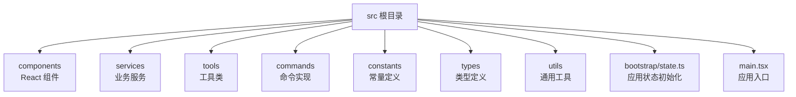
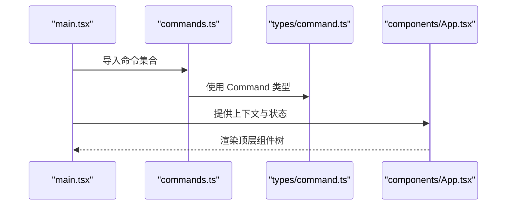
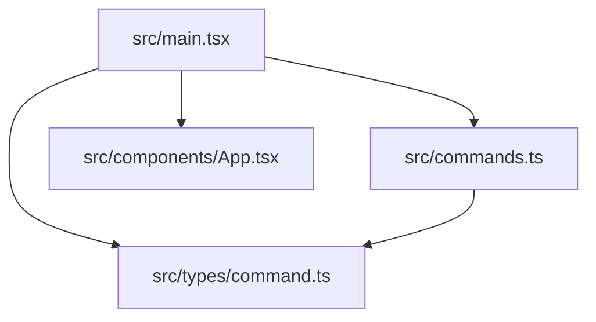

# 文件命名约定

<cite>
**本文档引用的文件**
- [src/main.tsx](file://src/main.tsx)
- [src/components/App.tsx](file://src/components/App.tsx)
- [src/commands.ts](file://src/commands.ts)
- [src/constants/files.ts](file://src/constants/files.ts)
- [src/types/command.ts](file://src/types/command.ts)
- [src/components/Markdown.tsx](file://src/components/Markdown.tsx)
- [src/utils/array.ts](file://src/utils/array.ts)
- [src/services/api/filesApi.ts](file://src/services/api/filesApi.ts)
- [src/tools/FileReadTool/FileReadTool.ts](file://src/tools/FileReadTool/FileReadTool.ts)
- [src/commands/context/index.ts](file://src/commands/context/index.ts)
- [package.json](file://package.json)
</cite>

## 目录
1. [简介](#简介)
2. [项目结构](#项目结构)
3. [核心组件](#核心组件)
4. [架构总览](#架构总览)
5. [详细组件分析](#详细组件分析)
6. [依赖关系分析](#依赖关系分析)
7. [性能考量](#性能考量)
8. [故障排查指南](#故障排查指南)
9. [结论](#结论)
10. [附录](#附录)

## 简介
本文件旨在为 Claude Code 项目建立统一的文件命名约定，覆盖以下方面：
- TypeScript/JavaScript 文件命名规范：单数名词命名、复数名词命名与特殊文件命名规则
- 目录命名约定：功能模块目录、配置目录与资源目录的命名规范
- 组件文件命名：React 组件文件、工具函数文件与类型定义文件的命名规则
- 具体命名示例：好实践与常见错误
- 文件扩展名使用规范：.ts、.tsx、.js、.jsx、.json 的使用约定

本规范以仓库现有代码为依据，结合实际导入与导出路径，提炼出可落地的命名策略。

## 项目结构
项目采用按功能域分层的组织方式，核心目录包括：
- src：源码根目录
  - components：React 组件
  - services：业务服务
  - tools：工具类（如 FileReadTool）
  - commands：命令实现
  - constants：常量定义
  - types：类型定义
  - utils：通用工具
  - bootstrap/state.ts：应用状态初始化
  - main.tsx：应用入口

**图表来源**
- [src/main.tsx](file://src/main.tsx)
- [src/components/App.tsx](file://src/components/App.tsx)
- [src/commands.ts](file://src/commands.ts)
- [src/types/command.ts](file://src/types/command.ts)

**章节来源**
- [src/main.tsx:1-120](file://src/main.tsx#L1-L120)
- [src/commands.ts:1-120](file://src/commands.ts#L1-L120)

## 核心组件
本节从命名角度梳理关键文件与目录的命名特征与建议。

- 单数名词命名
  - 命名对象通常为“单一实体”，例如：App、Markdown、FileReadTool、state
  - 示例：src/components/App.tsx、src/components/Markdown.tsx、src/tools/FileReadTool/FileReadTool.ts
  - 建议：当文件代表一个独立的类、组件或工具时，使用单数名词作为文件名，便于语义化理解

- 复数名词命名
  - 命名对象通常为“集合或列表”，例如：files、sessions、commands
  - 示例：src/constants/files.ts、src/commands.ts
  - 建议：当文件用于聚合导出或包含多个条目时，使用复数名词，体现集合属性

- 特殊文件命名
  - 入口文件：main.tsx、index.ts 等
  - 类型定义文件：types/*.ts
  - 配置文件：constants/*.ts
  - 工具函数文件：utils/*.ts
  - 建议：入口与配置文件保持简洁且明确，避免与业务逻辑混用

**章节来源**
- [src/components/App.tsx:1-56](file://src/components/App.tsx#L1-L56)
- [src/components/Markdown.tsx:1-236](file://src/components/Markdown.tsx#L1-L236)
- [src/tools/FileReadTool/FileReadTool.ts:1-120](file://src/tools/FileReadTool/FileReadTool.ts#L1-L120)
- [src/commands.ts:1-120](file://src/commands.ts#L1-L120)
- [src/constants/files.ts:1-157](file://src/constants/files.ts#L1-L157)

## 架构总览
下图展示入口文件如何组织命令与组件，体现命名在模块化中的作用。

**图表来源**
- [src/main.tsx:1-120](file://src/main.tsx#L1-L120)
- [src/commands.ts:1-120](file://src/commands.ts#L1-L120)
- [src/types/command.ts:1-217](file://src/types/command.ts#L1-L217)
- [src/components/App.tsx:1-56](file://src/components/App.tsx#L1-L56)

**章节来源**
- [src/main.tsx:1-120](file://src/main.tsx#L1-L120)
- [src/commands.ts:1-120](file://src/commands.ts#L1-L120)
- [src/types/command.ts:1-217](file://src/types/command.ts#L1-L217)
- [src/components/App.tsx:1-56](file://src/components/App.tsx#L1-L56)

## 详细组件分析

### TypeScript/JavaScript 文件命名规范
- 单数名词命名
  - 适用场景：代表单一实体的文件，如组件、工具、服务等
  - 示例：App.tsx、Markdown.tsx、FileReadTool.ts
  - 建议：文件名与导出的类/组件/工具名称一致，便于 IDE 自动补全与跳转

- 复数名词命名
  - 适用场景：聚合导出或包含多个条目的文件
  - 示例：commands.ts（聚合导出所有命令）、files.ts（二进制扩展名集合）

- 特殊文件命名
  - 入口文件：main.tsx（应用入口）
  - 类型定义：types/command.ts（命令类型定义）
  - 常量：constants/files.ts（文件相关常量）
  - 工具：utils/array.ts（数组工具函数）

**章节来源**
- [src/components/App.tsx:1-56](file://src/components/App.tsx#L1-L56)
- [src/components/Markdown.tsx:1-236](file://src/components/Markdown.tsx#L1-L236)
- [src/tools/FileReadTool/FileReadTool.ts:1-120](file://src/tools/FileReadTool/FileReadTool.ts#L1-L120)
- [src/commands.ts:1-120](file://src/commands.ts#L1-L120)
- [src/constants/files.ts:1-157](file://src/constants/files.ts#L1-L157)
- [src/utils/array.ts:1-14](file://src/utils/array.ts#L1-L14)

### 目录命名约定
- 功能模块目录
  - components：存放 React 组件
  - services：存放业务服务
  - tools：存放工具类（如 FileReadTool）
  - commands：存放命令实现
  - types：存放类型定义
  - utils：存放通用工具
  - constants：存放常量定义
  - bootstrap：存放应用初始化相关逻辑

- 配置目录
  - constants：集中存放配置相关的常量（如二进制扩展名）

- 资源目录
  - assets 或资源文件可放置于对应功能目录下，或单独建立资源目录；当前仓库未见专用资源目录，建议遵循“就近原则”或统一在根目录下建立 resources

**章节来源**
- [src/commands.ts:1-120](file://src/commands.ts#L1-L120)
- [src/constants/files.ts:1-157](file://src/constants/files.ts#L1-L157)

### 组件文件命名
- React 组件文件
  - 命名：首字母大写的 PascalCase，文件名与组件名一致
  - 示例：src/components/App.tsx、src/components/Markdown.tsx
  - 建议：组件文件名与导出的组件名保持一致，便于 IDE 识别与自动补全

- 工具函数文件
  - 命名：小写驼峰或复数名词，体现函数集合特性
  - 示例：src/utils/array.ts（包含多个数组操作函数）

- 类型定义文件
  - 命名：小写驼峰或复数名词，与类型集合相关
  - 示例：src/types/command.ts（命令类型定义）

**章节来源**
- [src/components/App.tsx:1-56](file://src/components/App.tsx#L1-L56)
- [src/components/Markdown.tsx:1-236](file://src/components/Markdown.tsx#L1-L236)
- [src/utils/array.ts:1-14](file://src/utils/array.ts#L1-L14)
- [src/types/command.ts:1-217](file://src/types/command.ts#L1-L217)

### 文件扩展名使用规范
- .ts：TypeScript 源文件（如 utils/array.ts、types/command.ts）
- .tsx：包含 JSX 的 TypeScript 文件（如 components/App.tsx、components/Markdown.tsx）
- .js：JavaScript 源文件（如 commands.ts 中的模块导入）
- .jsx：较少使用，建议统一使用 .tsx
- .json：配置文件（如 package.json）

**章节来源**
- [src/utils/array.ts:1-14](file://src/utils/array.ts#L1-L14)
- [src/types/command.ts:1-217](file://src/types/command.ts#L1-L217)
- [src/components/App.tsx:1-56](file://src/components/App.tsx#L1-L56)
- [src/components/Markdown.tsx:1-236](file://src/components/Markdown.tsx#L1-L236)
- [src/commands.ts:1-120](file://src/commands.ts#L1-L120)
- [package.json](file://package.json)

### 命名示例与最佳实践
- 好的命名实践
  - 组件：App.tsx、Markdown.tsx
  - 工具：array.ts、filesApi.ts
  - 类型：command.ts
  - 常量：files.ts
  - 命令：context/index.ts（命令入口）

- 常见命名错误
  - 将组件文件命名为小写或复数形式（如 app.tsx、markdown.tsx）会降低可读性
  - 将工具函数与类型定义混合在同一文件中，导致职责不清
  - 命令入口文件未使用 index.ts 或未与命令名称保持一致

**章节来源**
- [src/components/App.tsx:1-56](file://src/components/App.tsx#L1-L56)
- [src/components/Markdown.tsx:1-236](file://src/components/Markdown.tsx#L1-L236)
- [src/utils/array.ts:1-14](file://src/utils/array.ts#L1-L14)
- [src/types/command.ts:1-217](file://src/types/command.ts#L1-L217)
- [src/commands.ts:1-120](file://src/commands.ts#L1-L120)
- [src/commands/context/index.ts:1-25](file://src/commands/context/index.ts#L1-L25)

## 依赖关系分析
下图展示入口文件对命令与组件的依赖关系，体现命名在模块化中的作用。

**图表来源**
- [src/main.tsx:1-120](file://src/main.tsx#L1-L120)
- [src/commands.ts:1-120](file://src/commands.ts#L1-L120)
- [src/types/command.ts:1-217](file://src/types/command.ts#L1-L217)
- [src/components/App.tsx:1-56](file://src/components/App.tsx#L1-L56)

**章节来源**
- [src/main.tsx:1-120](file://src/main.tsx#L1-L120)
- [src/commands.ts:1-120](file://src/commands.ts#L1-L120)
- [src/types/command.ts:1-217](file://src/types/command.ts#L1-L217)
- [src/components/App.tsx:1-56](file://src/components/App.tsx#L1-L56)

## 性能考量
- 命名与模块化：清晰的命名有助于减少模块解析歧义，提升打包与运行时性能
- 命名与缓存：组件与工具的命名应稳定，避免频繁变更导致缓存失效
- 命名与可维护性：统一的命名规范降低维护成本，间接提升性能

## 故障排查指南
- 命名不一致导致的导入失败
  - 现象：组件文件名与导出组件名不一致，导致 IDE 无法正确识别
  - 排查：检查组件文件名与导出组件名是否一致（如 App.tsx 与 App 组件）
  - 参考文件：[src/components/App.tsx:1-56](file://src/components/App.tsx#L1-L56)

- 命令入口命名问题
  - 现象：命令入口文件未使用 index.ts 或未与命令名称保持一致
  - 排查：确认命令入口文件命名与命令名称一致（如 context/index.ts）
  - 参考文件：[src/commands/context/index.ts:1-25](file://src/commands/context/index.ts#L1-L25)

- 常量与类型文件命名
  - 现象：常量或类型文件命名不规范，影响团队协作
  - 排查：确保常量文件使用复数名词（如 files.ts），类型文件使用小写驼峰（如 command.ts）
  - 参考文件：[src/constants/files.ts:1-157](file://src/constants/files.ts#L1-L157)、[src/types/command.ts:1-217](file://src/types/command.ts#L1-L217)

**章节来源**
- [src/components/App.tsx:1-56](file://src/components/App.tsx#L1-L56)
- [src/commands/context/index.ts:1-25](file://src/commands/context/index.ts#L1-L25)
- [src/constants/files.ts:1-157](file://src/constants/files.ts#L1-L157)
- [src/types/command.ts:1-217](file://src/types/command.ts#L1-L217)

## 结论
通过本文件，我们总结了 Claude Code 项目中的文件命名约定，并将其映射到实际代码中。建议团队在后续开发中遵循以下原则：
- 组件与工具使用单数名词命名，类型与常量使用小写驼峰或复数名词
- 命令入口使用 index.ts 并与命令名称保持一致
- 扩展名严格区分 .ts、.tsx、.js、.jsx、.json 的使用场景
- 保持命名一致性，提升可维护性与性能

## 附录
- 相关文件路径参考
  - [src/main.tsx](file://src/main.tsx)
  - [src/components/App.tsx](file://src/components/App.tsx)
  - [src/components/Markdown.tsx](file://src/components/Markdown.tsx)
  - [src/commands.ts](file://src/commands.ts)
  - [src/commands/context/index.ts](file://src/commands/context/index.ts)
  - [src/types/command.ts](file://src/types/command.ts)
  - [src/constants/files.ts](file://src/constants/files.ts)
  - [src/utils/array.ts](file://src/utils/array.ts)
  - [src/services/api/filesApi.ts](file://src/services/api/filesApi.ts)
  - [src/tools/FileReadTool/FileReadTool.ts](file://src/tools/FileReadTool/FileReadTool.ts)
  - [package.json](file://package.json)