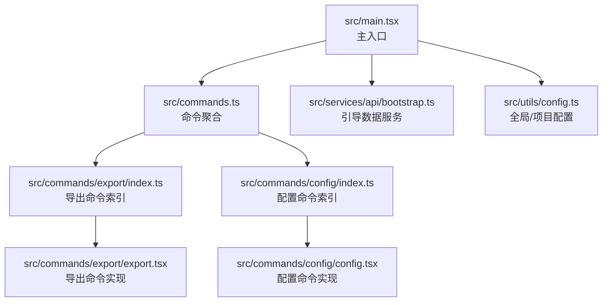
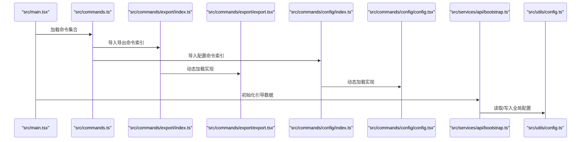
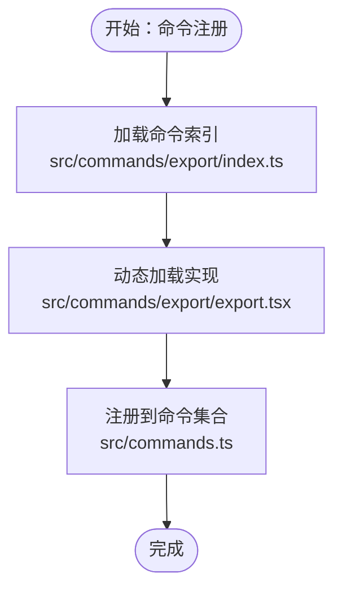
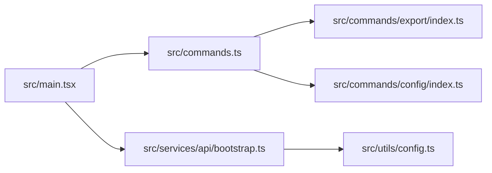

# 模块与包命名

<cite>
**本文引用的文件**
- [package.json](file://package.json)
- [README.md](file://README.md)
- [src/main.tsx](file://src/main.tsx)
- [src/commands.ts](file://src/commands.ts)
- [src/commands/export/index.ts](file://src/commands/export/index.ts)
- [src/commands/export/export.tsx](file://src/commands/export/export.tsx)
- [src/commands/config/index.ts](file://src/commands/config/index.ts)
- [src/commands/config/config.tsx](file://src/commands/config/config.tsx)
- [src/services/api/bootstrap.ts](file://src/services/api/bootstrap.ts)
- [src/utils/config.ts](file://src/utils/config.ts)
- [src/utils/sessionStoragePortable.ts](file://src/utils/sessionStoragePortable.ts)
- [src/utils/permissions/filesystem.ts](file://src/utils/permissions/filesystem.ts)
</cite>

## 目录
1. [简介](#简介)
2. [项目结构](#项目结构)
3. [核心组件](#核心组件)
4. [架构总览](#架构总览)
5. [详细组件分析](#详细组件分析)
6. [依赖关系分析](#依赖关系分析)
7. [性能考量](#性能考量)
8. [故障排查指南](#故障排查指南)
9. [结论](#结论)
10. [附录](#附录)

## 简介
本文件面向 Claude Code 的模块与包命名规范，结合仓库中的实际代码与结构，系统化总结以下内容：
- 模块命名约定：功能模块、工具模块、配置模块的命名规则与示例
- 包命名规范：npm 包名、内部包名、版本包命名约定
- 目录结构命名：功能目录、配置目录、资源目录的命名规则
- 导出与导入命名约定：默认导出、命名导出、混合导出的规范
- 具体命名示例与常见错误，帮助团队在保持一致性的同时提升可读性与可维护性

## 项目结构
该仓库采用以“功能域”为中心的分层组织方式，主要目录如下：
- src/cli：命令行入口与参数解析
- src/commands：命令实现（每个命令一个子目录）
- src/components：UI 组件（Ink/React）
- src/constants：常量与配置
- src/context：上下文管理
- src/hooks：React Hooks
- src/ink：终端 UI（Ink 框架）
- src/services：核心服务
- src/skills：技能定义
- src/tools：工具实现（文件编辑、搜索等）
- src/types：类型定义
- src/utils：通用工具函数
- src/main.tsx：主应用入口
- src/commands.ts：命令聚合与导出

**图表来源**
- [src/main.tsx:1-200](file://src/main.tsx#L1-L200)
- [src/commands.ts:1-200](file://src/commands.ts#L1-L200)
- [src/commands/export/index.ts:1-12](file://src/commands/export/index.ts#L1-L12)
- [src/commands/export/export.tsx:1-91](file://src/commands/export/export.tsx#L1-L91)
- [src/commands/config/index.ts:1-12](file://src/commands/config/index.ts#L1-L12)
- [src/commands/config/config.tsx:1-7](file://src/commands/config/config.tsx#L1-L7)
- [src/services/api/bootstrap.ts:1-142](file://src/services/api/bootstrap.ts#L1-L142)
- [src/utils/config.ts:1-200](file://src/utils/config.ts#L1-L200)

**章节来源**
- [README.md:95-114](file://README.md#L95-L114)

## 核心组件
- 命令系统：通过 src/commands.ts 聚合各命令，并按需条件加载；命令实现位于 src/commands/<name>/index.ts 或 <name>.ts。
- 主入口：src/main.tsx 引入并初始化各类服务、插件、技能与命令，体现模块间的依赖关系。
- 配置体系：src/utils/config.ts 定义全局与项目级配置接口与默认值；src/services/api/bootstrap.ts 提供引导数据缓存与持久化。

**章节来源**
- [src/commands.ts:1-200](file://src/commands.ts#L1-L200)
- [src/main.tsx:1-200](file://src/main.tsx#L1-L200)
- [src/utils/config.ts:1-200](file://src/utils/config.ts#L1-L200)
- [src/services/api/bootstrap.ts:1-142](file://src/services/api/bootstrap.ts#L1-L142)

## 架构总览
下图展示从主入口到命令与服务的关键交互路径，体现模块命名与导入/导出的规范如何支撑整体架构：

**图表来源**
- [src/main.tsx:1-200](file://src/main.tsx#L1-L200)
- [src/commands.ts:1-200](file://src/commands.ts#L1-L200)
- [src/commands/export/index.ts:1-12](file://src/commands/export/index.ts#L1-L12)
- [src/commands/export/export.tsx:1-91](file://src/commands/export/export.tsx#L1-L91)
- [src/commands/config/index.ts:1-12](file://src/commands/config/index.ts#L1-L12)
- [src/commands/config/config.tsx:1-7](file://src/commands/config/config.tsx#L1-L7)
- [src/services/api/bootstrap.ts:1-142](file://src/services/api/bootstrap.ts#L1-L142)
- [src/utils/config.ts:1-200](file://src/utils/config.ts#L1-L200)

## 详细组件分析

### 模块命名约定
- 功能模块命名
  - 使用小驼峰或短横线分隔的小写形式，语义清晰且与功能职责一致。例如：export、config、bootstrap、filesystem。
  - 示例：src/commands/export、src/commands/config、src/services/api、src/utils/config、src/utils/permissions。
- 工具模块命名
  - 以工具/功能语义命名，避免使用缩略词或无意义名称；必要时使用复数或后缀区分集合/实现。
  - 示例：sessionStoragePortable、permissions/filesystem。
- 配置模块命名
  - 以 config 或 settings 相关词汇命名，明确表示配置读取/写入能力。
  - 示例：src/utils/config.ts、src/services/api/bootstrap.ts。

**章节来源**
- [src/commands/export/index.ts:1-12](file://src/commands/export/index.ts#L1-L12)
- [src/commands/config/index.ts:1-12](file://src/commands/config/index.ts#L1-L12)
- [src/services/api/bootstrap.ts:1-142](file://src/services/api/bootstrap.ts#L1-L142)
- [src/utils/config.ts:1-200](file://src/utils/config.ts#L1-L200)
- [src/utils/sessionStoragePortable.ts:288-319](file://src/utils/sessionStoragePortable.ts#L288-L319)
- [src/utils/permissions/filesystem.ts:761-805](file://src/utils/permissions/filesystem.ts#L761-L805)

### 包命名规范
- npm 包命名
  - 使用作用域前缀与语义化名称，确保唯一性与可发现性。
  - 示例：@anthropic-ai/claude-code（见 package.json）。
- 内部包命名
  - 在 monorepo 或多包场景中，建议使用统一作用域与清晰的功能域前缀，便于区分与管理。
  - 当前仓库为单包形态，未见跨包引用，故不展开具体示例。
- 版本包命名约定
  - 采用语义化版本号，遵循主.次.补丁格式；发布前确保变更日志与版本号同步。
  - 示例：2.1.88（见 package.json）。

**章节来源**
- [package.json:1-34](file://package.json#L1-L34)

### 目录结构命名
- 功能目录命名
  - 采用小写、名词短语，反映模块职责；避免动词或缩写。
  - 示例：commands、services、tools、utils、components、hooks、ink、cli。
- 配置目录命名
  - 以 config 或 settings 命名，集中存放配置相关逻辑与常量。
  - 示例：src/constants、src/utils/config.ts。
- 资源目录命名
  - 以资源类型命名，如 assets、icons、styles 等；当前仓库未见此类目录，但可作为未来扩展参考。
  - 文件命名建议：小写、短横线分隔、带扩展名。

**章节来源**
- [README.md:95-114](file://README.md#L95-L114)

### 模块导出与导入的命名约定
- 默认导出
  - 命令索引文件通常默认导出命令对象，便于统一导入与注册。
  - 示例：src/commands/export/index.ts 默认导出命令对象；src/commands/config/index.ts 同理。
- 命名导出
  - 对于需要重命名或避免冲突的导出，使用命名导出并在导入时显式指定别名。
  - 示例：src/commands.ts 中对部分命令使用命名导出并重命名为默认导出别名，再统一 re-export。
- 混合导出
  - 在同一模块中同时存在默认导出与命名导出时，应保持一致性与可读性，避免混淆。
  - 示例：src/commands.ts 对某些命令使用命名导出并导出工具函数（如 getCommandName、isCommandEnabled）。

**图表来源**
- [src/commands.ts:170-369](file://src/commands.ts#L170-L369)
- [src/commands/export/index.ts:1-12](file://src/commands/export/index.ts#L1-L12)
- [src/commands/export/export.tsx:1-91](file://src/commands/export/export.tsx#L1-L91)

**章节来源**
- [src/commands.ts:170-369](file://src/commands.ts#L170-L369)
- [src/commands/export/index.ts:1-12](file://src/commands/export/index.ts#L1-L12)
- [src/commands/export/export.tsx:1-91](file://src/commands/export/export.tsx#L1-L91)
- [src/commands/config/index.ts:1-12](file://src/commands/config/index.ts#L1-L12)
- [src/commands/config/config.tsx:1-7](file://src/commands/config/config.tsx#L1-L7)

### 具体命名示例与常见错误
- 好的命名实践
  - 命令索引文件：export/index.ts、config/index.ts，简洁明了，职责单一。
  - 实现文件：export.tsx、config.tsx，与索引文件一一对应，便于查找。
  - 服务与工具：bootstrap.ts、config.ts、sessionStoragePortable.ts、permissions/filesystem.ts，语义清晰。
- 常见命名错误
  - 使用缩略词或无意义名称（如“cfg”、“svc”），降低可读性。
  - 目录与文件混用不同风格（如“Config”与“config.ts”），破坏一致性。
  - 导出混用默认与命名导出但未统一别名，导致导入复杂度上升。

**章节来源**
- [src/commands/export/index.ts:1-12](file://src/commands/export/index.ts#L1-L12)
- [src/commands/export/export.tsx:1-91](file://src/commands/export/export.tsx#L1-L91)
- [src/commands/config/index.ts:1-12](file://src/commands/config/index.ts#L1-L12)
- [src/commands/config/config.tsx:1-7](file://src/commands/config/config.tsx#L1-L7)
- [src/utils/sessionStoragePortable.ts:288-319](file://src/utils/sessionStoragePortable.ts#L288-L319)
- [src/utils/permissions/filesystem.ts:761-805](file://src/utils/permissions/filesystem.ts#L761-L805)

## 依赖关系分析
- 模块耦合与内聚
  - 命令模块通过索引文件与实现文件解耦，实现按需加载，降低启动成本。
  - 主入口仅负责初始化与调度，具体功能由服务与工具模块承担，内聚性良好。
- 外部依赖与集成点
  - 通过 axios 访问 API，使用 zod 进行响应校验，体现对外部系统的稳健集成。
  - 配置读写通过 utils/config.ts 封装，避免分散在各处。

**图表来源**
- [src/main.tsx:1-200](file://src/main.tsx#L1-L200)
- [src/commands.ts:1-200](file://src/commands.ts#L1-L200)
- [src/commands/export/index.ts:1-12](file://src/commands/export/index.ts#L1-L12)
- [src/commands/config/index.ts:1-12](file://src/commands/config/index.ts#L1-L12)
- [src/services/api/bootstrap.ts:1-142](file://src/services/api/bootstrap.ts#L1-L142)
- [src/utils/config.ts:1-200](file://src/utils/config.ts#L1-L200)

**章节来源**
- [src/main.tsx:1-200](file://src/main.tsx#L1-L200)
- [src/commands.ts:1-200](file://src/commands.ts#L1-L200)
- [src/services/api/bootstrap.ts:1-142](file://src/services/api/bootstrap.ts#L1-L142)
- [src/utils/config.ts:1-200](file://src/utils/config.ts#L1-L200)

## 性能考量
- 按需加载与懒加载
  - 命令实现通过动态 import 按需加载，减少初始模块体积与启动时间。
- 缓存与去重
  - 引导数据通过缓存判断避免重复写盘；命令集合使用 memoize 避免重复计算。
- 文件系统与路径处理
  - 路径安全与长度限制处理，确保在不同平台上的兼容性与稳定性。

**章节来源**
- [src/commands.ts:188-202](file://src/commands.ts#L188-L202)
- [src/services/api/bootstrap.ts:114-142](file://src/services/api/bootstrap.ts#L114-L142)
- [src/utils/sessionStoragePortable.ts:288-319](file://src/utils/sessionStoragePortable.ts#L288-L319)

## 故障排查指南
- 命令未显示或无法加载
  - 检查命令索引文件是否正确默认导出命令对象，实现文件是否存在且可被动态加载。
  - 参考：src/commands/export/index.ts、src/commands/config/index.ts。
- 配置读取异常
  - 确认全局配置接口与默认值定义完整，读写流程无循环依赖。
  - 参考：src/utils/config.ts。
- 引导数据未更新
  - 检查缓存判断逻辑与写盘条件，确认网络请求与校验流程正常。
  - 参考：src/services/api/bootstrap.ts。

**章节来源**
- [src/commands/export/index.ts:1-12](file://src/commands/export/index.ts#L1-L12)
- [src/commands/config/index.ts:1-12](file://src/commands/config/index.ts#L1-L12)
- [src/utils/config.ts:1-200](file://src/utils/config.ts#L1-L200)
- [src/services/api/bootstrap.ts:1-142](file://src/services/api/bootstrap.ts#L1-L142)

## 结论
本仓库在模块与包命名方面体现了清晰的职责分离与良好的一致性：
- 目录与文件命名遵循小写、语义化与单一职责原则；
- 命令系统通过索引与实现解耦，配合动态加载提升性能；
- 配置与服务模块封装明确，便于维护与扩展。

建议在后续迭代中持续遵循上述规范，保持一致性与可读性，进一步完善跨包命名与版本管理策略。

## 附录
- 术语
  - 命令：CLI 可执行的操作单元，包含索引与实现两部分。
  - 服务：封装特定业务能力的模块，如引导数据、权限策略等。
  - 工具：通用函数与辅助逻辑，如路径处理、配置读写等。