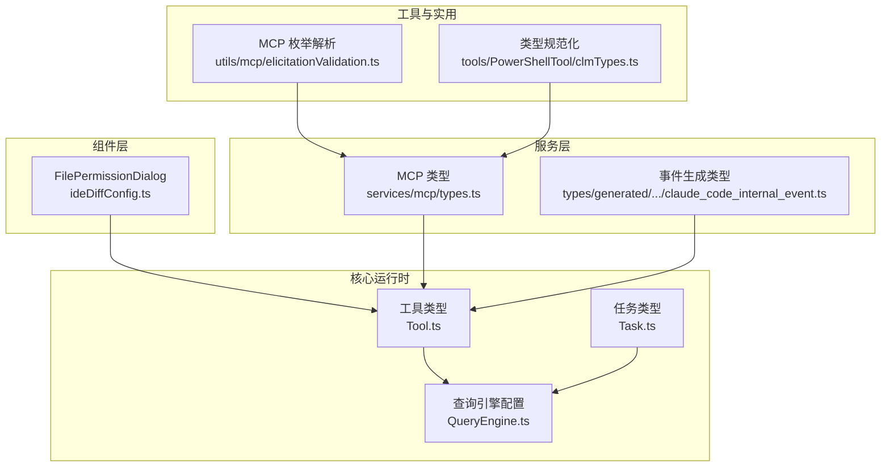
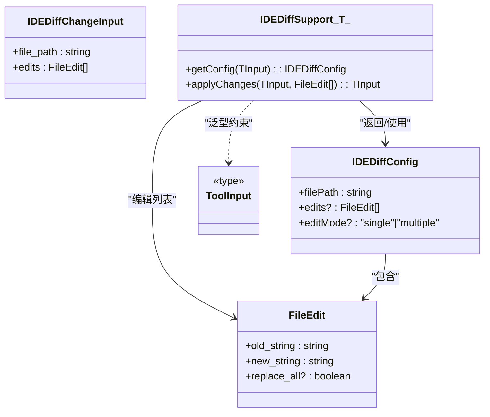
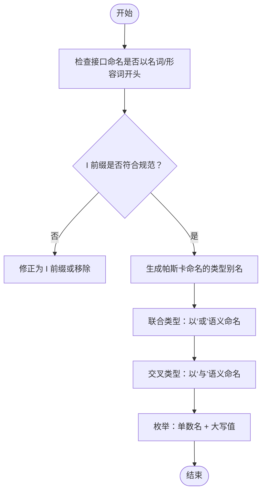
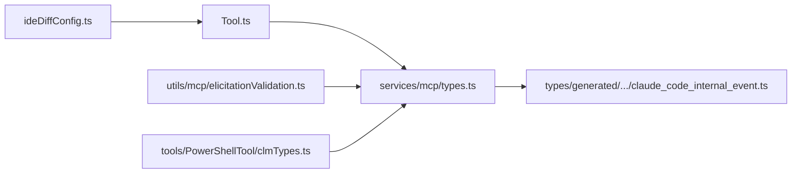

# 类与接口命名

<cite>
**本文档引用的文件**
- [src/components/permissions/FilePermissionDialog/ideDiffConfig.ts](file://src/components/permissions/FilePermissionDialog/ideDiffConfig.ts)
- [src/services/mcp/types.ts](file://src/services/mcp/types.ts)
- [src/types/generated/events_mono/claude_code/v1/claude_code_internal_event.ts](file://src/types/generated/events_mono/claude_code/v1/claude_code_internal_event.ts)
- [src/ink/screen.ts](file://src/ink/screen.ts)
- [src/Tool.ts](file://src/Tool.ts)
- [src/Task.ts](file://src/Task.ts)
- [src/QueryEngine.ts](file://src/QueryEngine.ts)
- [src/utils/mcp/elicitationValidation.ts](file://src/utils/mcp/elicitationValidation.ts)
- [src/tools/PowerShellTool/clmTypes.ts](file://src/tools/PowerShellTool/clmTypes.ts)
</cite>

## 目录
1. [简介](#简介)
2. [项目结构](#项目结构)
3. [核心组件](#核心组件)
4. [架构总览](#架构总览)
5. [详细组件分析](#详细组件分析)
6. [依赖分析](#依赖分析)
7. [性能考量](#性能考量)
8. [故障排查指南](#故障排查指南)
9. [结论](#结论)
10. [附录](#附录)

## 简介
本文件系统性梳理 Claude Code 在 TypeScript/TSX 中的类与接口命名规范，覆盖以下主题：
- 接口命名：以名词或形容词开头、接口前缀使用、接口继承与组合的命名规则
- 类命名：帕斯卡命名法、抽象类命名、泛型类命名
- 枚举命名：枚举名单数、枚举值大写、枚举类型命名
- TypeScript 类型系统：类型别名、联合类型、交叉类型的命名约定
- 实际示例与常见错误对比，帮助团队统一风格、提升可读性与可维护性

## 项目结构
本仓库为大型前端/CLI 工程，类型定义广泛分布于多处目录：
- 组件层：如权限对话框相关接口位于 components/permissions/FilePermissionDialog
- 服务层：如 MCP 协议类型位于 services/mcp/types.ts
- 生成类型：如事件协议生成的类型位于 types/generated
- 核心运行时：如工具、任务、查询引擎等位于根级模块
- 工具与实用函数：如枚举解析、类型规范化等位于 utils 与 tools 子目录

图示来源
- [src/components/permissions/FilePermissionDialog/ideDiffConfig.ts:1-43](file://src/components/permissions/FilePermissionDialog/ideDiffConfig.ts#L1-L43)
- [src/services/mcp/types.ts:1-259](file://src/services/mcp/types.ts#L1-L259)
- [src/types/generated/events_mono/claude_code/v1/claude_code_internal_event.ts:1-130](file://src/types/generated/events_mono/claude_code/v1/claude_code_internal_event.ts#L1-L130)
- [src/Tool.ts:1-793](file://src/Tool.ts#L1-L793)
- [src/Task.ts:1-126](file://src/Task.ts#L1-L126)
- [src/QueryEngine.ts:130-173](file://src/QueryEngine.ts#L130-L173)
- [src/utils/mcp/elicitationValidation.ts:101-133](file://src/utils/mcp/elicitationValidation.ts#L101-L133)
- [src/tools/PowerShellTool/clmTypes.ts:190-211](file://src/tools/PowerShellTool/clmTypes.ts#L190-L211)

章节来源
- [src/components/permissions/FilePermissionDialog/ideDiffConfig.ts:1-43](file://src/components/permissions/FilePermissionDialog/ideDiffConfig.ts#L1-L43)
- [src/services/mcp/types.ts:1-259](file://src/services/mcp/types.ts#L1-L259)
- [src/types/generated/events_mono/claude_code/v1/claude_code_internal_event.ts:1-130](file://src/types/generated/events_mono/claude_code/v1/claude_code_internal_event.ts#L1-L130)
- [src/Tool.ts:1-793](file://src/Tool.ts#L1-L793)
- [src/Task.ts:1-126](file://src/Task.ts#L1-L126)
- [src/QueryEngine.ts:130-173](file://src/QueryEngine.ts#L130-L173)
- [src/utils/mcp/elicitationValidation.ts:101-133](file://src/utils/mcp/elicitationValidation.ts#L101-L133)
- [src/tools/PowerShellTool/clmTypes.ts:190-211](file://src/tools/PowerShellTool/clmTypes.ts#L190-L211)

## 核心组件
本节从命名角度总结关键类型与接口的命名策略，并给出建议与反例。

- 接口命名
  - 建议以“名词”或“形容词”开头，清晰表达职责或状态（例如 IDEDiffConfig、IDiffSupport）
  - 避免无意义的动词或缩写；必要时使用 I 前缀表示接口（见下文“接口前缀”）
  - 对于泛型接口，保持类型参数语义化（如 TInput）

- 类命名
  - 使用帕斯卡命名法（PascalCase），如 Screen、StylePool
  - 抽象类建议以 Abstract 或 Base 前缀，便于识别（本仓库未出现此类命名，但可作为规范建议）
  - 泛型类在参数中体现约束（如泛型 TInput extends ToolInput）

- 枚举命名
  - 枚举名采用单数形式（如 CellWidth）
  - 枚举值采用大写常量命名（如 Narrow、Wide）
  - 枚举类型命名与枚举名一致（如 CellWidth）

- TypeScript 类型系统
  - 类型别名使用帕斯卡命名法（如 ToolUseContext、MCPServerConnection）
  - 联合类型用“或”的语义命名（如 TaskStatus、PermissionMode）
  - 交叉类型用“与”的语义命名（如 ToolPermissionContext 的 DeepImmutable 包装）

章节来源
- [src/components/permissions/FilePermissionDialog/ideDiffConfig.ts:3-23](file://src/components/permissions/FilePermissionDialog/ideDiffConfig.ts#L3-L23)
- [src/ink/screen.ts:288-300](file://src/ink/screen.ts#L288-L300)
- [src/Tool.ts:122-138](file://src/Tool.ts#L122-L138)
- [src/services/mcp/types.ts:221-227](file://src/services/mcp/types.ts#L221-L227)

## 架构总览
下图展示类型与接口在系统中的角色与关系，强调“职责清晰、命名一致”的设计原则。

图示来源
- [src/components/permissions/FilePermissionDialog/ideDiffConfig.ts:3-23](file://src/components/permissions/FilePermissionDialog/ideDiffConfig.ts#L3-L23)

章节来源
- [src/components/permissions/FilePermissionDialog/ideDiffConfig.ts:1-43](file://src/components/permissions/FilePermissionDialog/ideDiffConfig.ts#L1-L43)

## 详细组件分析

### 接口命名规范
- 命名动机
  - 以名词开头：强调“对象/状态/能力”，如 IDEDiffConfig 表示“IDE Diff 配置”
  - 以形容词开头：强调“属性/特征”，如 IDEDiffChangeInput 表示“变更输入（的）”
  - I 前缀：明确标识接口，便于区分接口与实现类（在本仓库中，接口名以 I 开头的模式存在）

- 具体示例
  - 文件差异接口族：IDiffConfig、IDiffChangeInput、IDiffSupport<TInput>
  - 工具输入：ToolInput（类型别名，用于约束泛型）
  - 生成类型：GitHubActionsMetadata、EnvironmentMetadata、SlackContext、ClaudeCodeInternalEvent

- 常见错误与反例
  - 避免无意义缩写：如将“Config”写成“Cfg”
  - 避免动词开头：如“Config”应改为“Config”或“Configuration”
  - 避免混用大小写：保持一致的帕斯卡命名法

章节来源
- [src/components/permissions/FilePermissionDialog/ideDiffConfig.ts:3-23](file://src/components/permissions/FilePermissionDialog/ideDiffConfig.ts#L3-L23)
- [src/types/generated/events_mono/claude_code/v1/claude_code_internal_event.ts:11-130](file://src/types/generated/events_mono/claude_code/v1/claude_code_internal_event.ts#L11-L130)

### 类命名规范
- 命名动机
  - 帕斯卡命名法：如 Screen、StylePool、CharPool
  - 抽象类建议以 Abstract/Base 前缀（建议纳入规范）
  - 泛型类参数体现约束：如 TInput extends ToolInput

- 具体示例
  - 屏幕渲染类：Screen、StylePool、CharPool
  - Cell 宽度分类：CellWidth（const enum）
  - 泛型支持：IDiffSupport<TInput>

- 常见错误与反例
  - 驼峰命名混用：避免首字母小写的类名
  - 泛型参数不具语义：如 T、U、V 应替换为更具描述性的名称

章节来源
- [src/ink/screen.ts:21-260](file://src/ink/screen.ts#L21-L260)

### 枚举命名规范
- 命名动机
  - 枚举名单数：如 CellWidth
  - 枚举值大写：如 Narrow、Wide、SpacerTail、SpacerHead
  - 枚举类型与枚举名一致：CellWidth

- 具体示例
  - Cell 宽度分类：Narrow、Wide、SpacerTail、SpacerHead
  - 生成类型中的 MessageFns<T>（内部使用，非对外枚举）

- 常见错误与反例
  - 复数形式：如 CellWidths
  - 混合大小写：如 narrow/Wide
  - 缺少类型一致性：枚举名与类型名不一致

章节来源
- [src/ink/screen.ts:288-300](file://src/ink/screen.ts#L288-L300)

### TypeScript 类型系统命名规范
- 类型别名
  - 帕斯卡命名法：如 ToolUseContext、MCPServerConnection、ConnectedMCPServer、FailedMCPServer、NeedsAuthMCPServer、PendingMCPServer、DisabledMCPServer
  - 语义化：如 ToolPermissionContext、ToolInputJSONSchema、AnyObject

- 联合类型
  - 以“或”的语义命名：如 TaskStatus、TaskType、MCPServerConnection（联合多个状态）

- 交叉类型
  - 以“与”的语义命名：如 DeepImmutable 包裹的 ToolPermissionContext

- 具体示例
  - 工具类型：Tool、Tools、ToolDef、BuiltTool、ToolProgress、ToolResult
  - 任务类型：TaskType、TaskStatus、TaskHandle、TaskContext、TaskStateBase
  - 查询引擎配置：QueryEngineConfig
  - MCP 连接状态：ConnectedMCPServer、FailedMCPServer、NeedsAuthMCPServer、PendingMCPServer、DisabledMCPServer
  - 枚举解析：getEnumValues、getEnumLabels、getEnumLabel

- 常见错误与反例
  - 类型别名驼峰：避免首字母小写
  - 联合类型语义不清：如将多种状态合并为单一名称
  - 交叉类型滥用：仅用于组合字段，避免过度复杂

章节来源
- [src/Tool.ts:122-138](file://src/Tool.ts#L122-L138)
- [src/Task.ts:6-29](file://src/Task.ts#L6-L29)
- [src/QueryEngine.ts:130-173](file://src/QueryEngine.ts#L130-L173)
- [src/services/mcp/types.ts:221-227](file://src/services/mcp/types.ts#L221-L227)
- [src/utils/mcp/elicitationValidation.ts:101-133](file://src/utils/mcp/elicitationValidation.ts#L101-L133)

### 类与接口命名流程图（算法/数据流视角）

图示来源
- [src/components/permissions/FilePermissionDialog/ideDiffConfig.ts:3-23](file://src/components/permissions/FilePermissionDialog/ideDiffConfig.ts#L3-L23)
- [src/Tool.ts:122-138](file://src/Tool.ts#L122-L138)
- [src/Task.ts:6-29](file://src/Task.ts#L6-L29)
- [src/ink/screen.ts:288-300](file://src/ink/screen.ts#L288-L300)

## 依赖分析
- 组件到工具：FilePermissionDialog 的接口依赖 ToolInput 类型
- 工具到服务：Tool.ts 中的工具上下文与服务层的 MCP 类型交互
- 生成类型到工具：事件生成类型与工具链交互
- 实用函数到服务：MCP 枚举解析与类型规范化

图示来源
- [src/components/permissions/FilePermissionDialog/ideDiffConfig.ts:1-43](file://src/components/permissions/FilePermissionDialog/ideDiffConfig.ts#L1-L43)
- [src/Tool.ts:1-793](file://src/Tool.ts#L1-L793)
- [src/services/mcp/types.ts:1-259](file://src/services/mcp/types.ts#L1-L259)
- [src/types/generated/events_mono/claude_code/v1/claude_code_internal_event.ts:1-130](file://src/types/generated/events_mono/claude_code/v1/claude_code_internal_event.ts#L1-L130)
- [src/utils/mcp/elicitationValidation.ts:101-133](file://src/utils/mcp/elicitationValidation.ts#L101-L133)
- [src/tools/PowerShellTool/clmTypes.ts:190-211](file://src/tools/PowerShellTool/clmTypes.ts#L190-L211)

章节来源
- [src/components/permissions/FilePermissionDialog/ideDiffConfig.ts:1-43](file://src/components/permissions/FilePermissionDialog/ideDiffConfig.ts#L1-L43)
- [src/Tool.ts:1-793](file://src/Tool.ts#L1-L793)
- [src/services/mcp/types.ts:1-259](file://src/services/mcp/types.ts#L1-L259)
- [src/types/generated/events_mono/claude_code/v1/claude_code_internal_event.ts:1-130](file://src/types/generated/events_mono/claude_code/v1/claude_code_internal_event.ts#L1-L130)
- [src/utils/mcp/elicitationValidation.ts:101-133](file://src/utils/mcp/elicitationValidation.ts#L101-L133)
- [src/tools/PowerShellTool/clmTypes.ts:190-211](file://src/tools/PowerShellTool/clmTypes.ts#L190-L211)

## 性能考量
- 命名本身不影响运行时性能，但良好的命名能减少理解成本，间接提升开发效率与代码质量
- 在大规模类型系统中，统一的命名规范有助于 IDE 智能提示与重构工具的准确性

## 故障排查指南
- 接口命名不一致导致的类型冲突
  - 症状：编译器报错或类型推断异常
  - 排查：检查接口是否以名词/形容词开头、是否使用 I 前缀
  - 参考路径：[src/components/permissions/FilePermissionDialog/ideDiffConfig.ts:3-23](file://src/components/permissions/FilePermissionDialog/ideDiffConfig.ts#L3-L23)

- 枚举命名不规范
  - 症状：枚举值大小写不一致或复数形式
  - 排查：确保枚举名为单数，枚举值为大写
  - 参考路径：[src/ink/screen.ts:288-300](file://src/ink/screen.ts#L288-L300)

- 类型别名驼峰命名
  - 症状：IDE 提示或重构工具无法正确识别
  - 排查：统一使用帕斯卡命名法
  - 参考路径：[src/Tool.ts:122-138](file://src/Tool.ts#L122-L138)

- 联合/交叉类型语义不清
  - 症状：类型组合复杂、难以理解
  - 排查：以“或/与”的语义重新命名，拆分复杂类型
  - 参考路径：[src/services/mcp/types.ts:221-227](file://src/services/mcp/types.ts#L221-L227)

章节来源
- [src/components/permissions/FilePermissionDialog/ideDiffConfig.ts:3-23](file://src/components/permissions/FilePermissionDialog/ideDiffConfig.ts#L3-L23)
- [src/ink/screen.ts:288-300](file://src/ink/screen.ts#L288-L300)
- [src/Tool.ts:122-138](file://src/Tool.ts#L122-L138)
- [src/services/mcp/types.ts:221-227](file://src/services/mcp/types.ts#L221-L227)

## 结论
通过统一接口、类、枚举与类型系统的命名规范，可以显著提升代码的可读性与可维护性。建议在团队内推广以下实践：
- 接口以名词/形容词开头，必要时使用 I 前缀
- 类使用帕斯卡命名法，抽象类建议以 Abstract/Base 前缀
- 枚举名单数、枚举值大写
- 类型别名、联合/交叉类型遵循帕斯卡命名与“或/与”的语义

## 附录
- 命名示例（来自仓库）
  - 接口：IDiffConfig、IDiffChangeInput、IDiffSupport<TInput>
  - 类：Screen、StylePool、CharPool、CellWidth
  - 类型别名：ToolUseContext、MCPServerConnection、ConnectedMCPServer、FailedMCPServer、NeedsAuthMCPServer、PendingMCPServer、DisabledMCPServer
  - 联合类型：TaskStatus、TaskType、MCPServerConnection
  - 交叉类型：DeepImmutable 包裹的 ToolPermissionContext
  - 枚举：CellWidth（Narrow、Wide、SpacerTail、SpacerHead）

- 常见错误（来自仓库）
  - 接口命名不规范：如缺少 I 前缀或动词开头
  - 枚举命名不规范：如复数形式或大小写不一致
  - 类型别名驼峰命名：不符合帕斯卡命名法
  - 联合/交叉类型语义不清：未体现“或/与”的语义

章节来源
- [src/components/permissions/FilePermissionDialog/ideDiffConfig.ts:3-23](file://src/components/permissions/FilePermissionDialog/ideDiffConfig.ts#L3-L23)
- [src/ink/screen.ts:288-300](file://src/ink/screen.ts#L288-L300)
- [src/Tool.ts:122-138](file://src/Tool.ts#L122-L138)
- [src/Task.ts:6-29](file://src/Task.ts#L6-L29)
- [src/services/mcp/types.ts:221-227](file://src/services/mcp/types.ts#L221-L227)
- [src/utils/mcp/elicitationValidation.ts:101-133](file://src/utils/mcp/elicitationValidation.ts#L101-L133)
- [src/tools/PowerShellTool/clmTypes.ts:190-211](file://src/tools/PowerShellTool/clmTypes.ts#L190-L211)