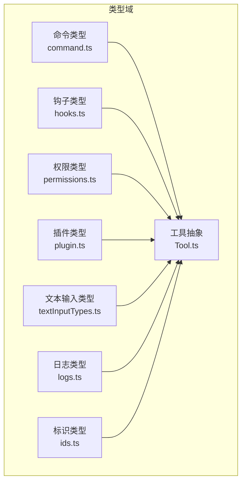
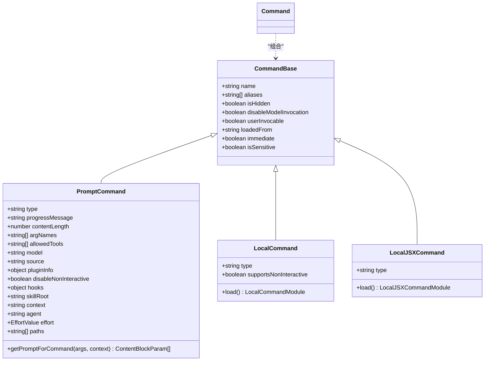
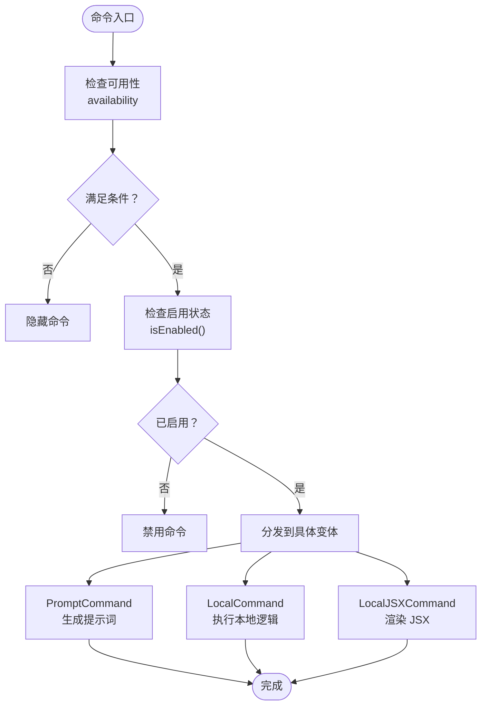
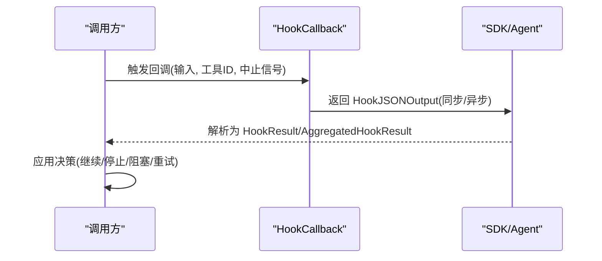
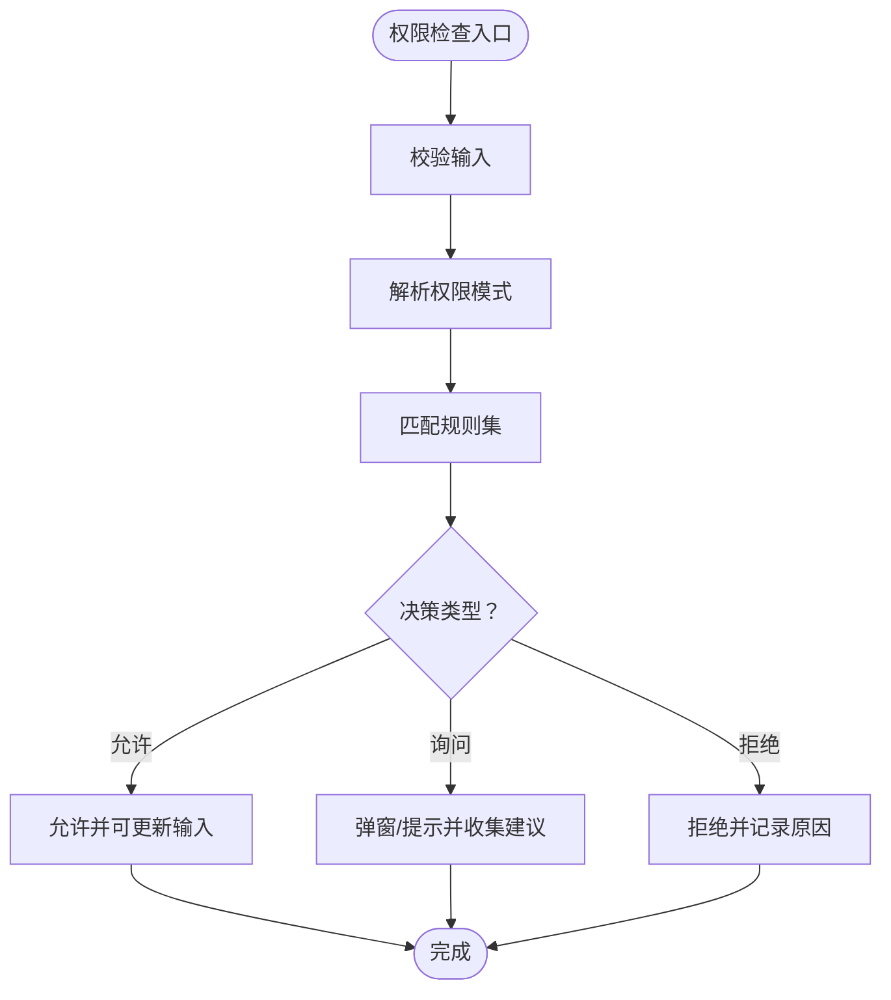
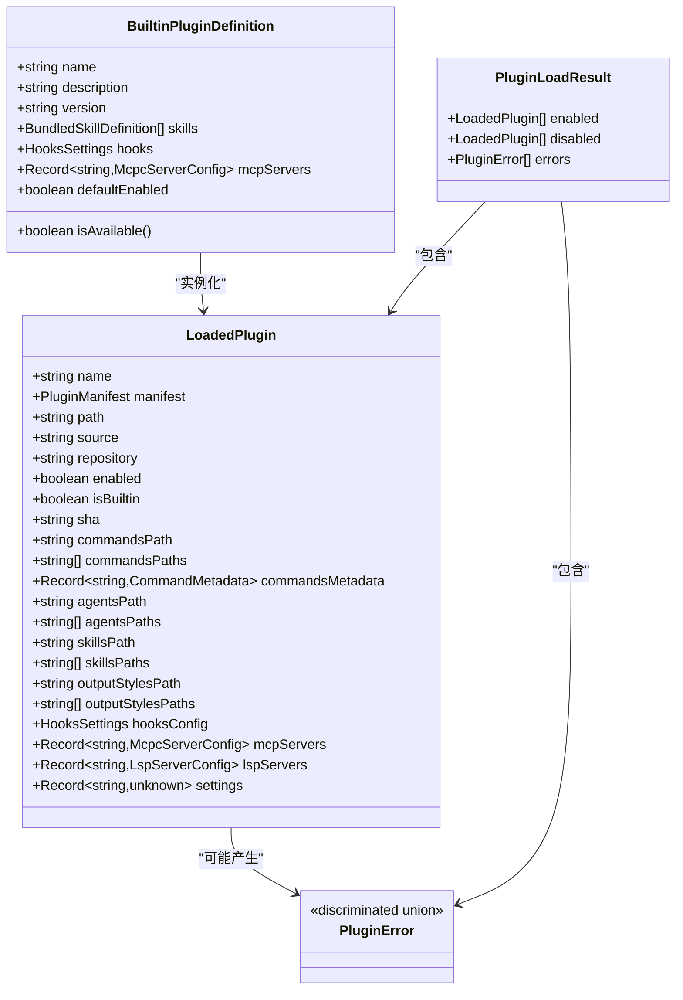
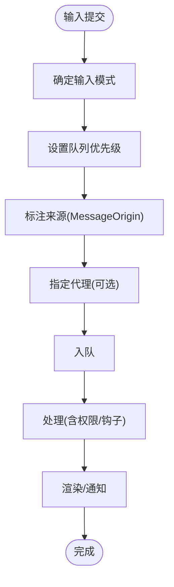
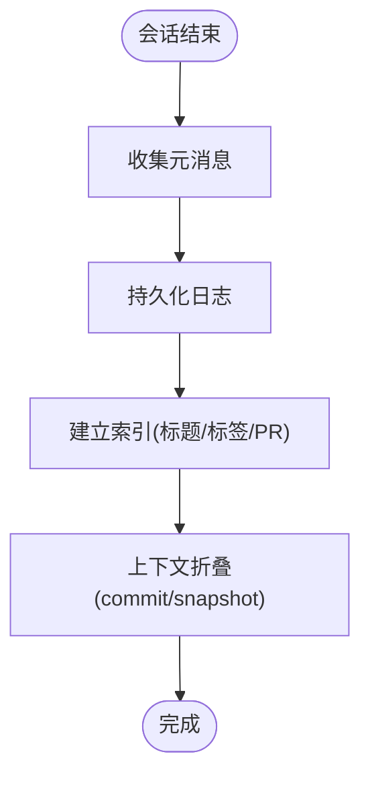
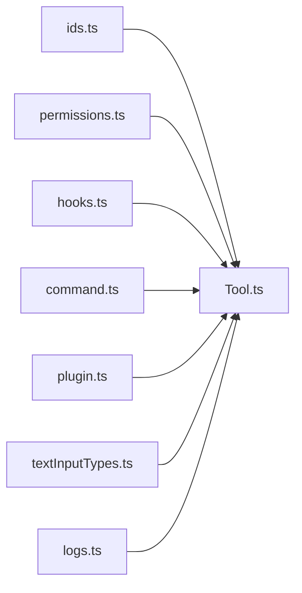

# TypeScript 架构体系

<cite>
**本文引用的文件**
- [src/types/command.ts](file://src/types/command.ts)
- [src/types/hooks.ts](file://src/types/hooks.ts)
- [src/types/ids.ts](file://src/types/ids.ts)
- [src/types/logs.ts](file://src/types/logs.ts)
- [src/types/permissions.ts](file://src/types/permissions.ts)
- [src/types/plugin.ts](file://src/types/plugin.ts)
- [src/types/textInputTypes.ts](file://src/types/textInputTypes.ts)
- [src/Tool.ts](file://src/Tool.ts)
</cite>

## 目录
1. [引言](#引言)
2. [项目结构](#项目结构)
3. [核心组件](#核心组件)
4. [架构总览](#架构总览)
5. [详细组件分析](#详细组件分析)
6. [依赖分析](#依赖分析)
7. [性能考量](#性能考量)
8. [故障排查指南](#故障排查指南)
9. [结论](#结论)
10. [附录](#附录)

## 引言
本文件系统化梳理 Claude Code 的 TypeScript 架构体系，聚焦类型系统设计与实现，包括：
- 类型系统设计原则：品牌类型、工具类型、命令类型、状态类型、API 类型的定义与使用
- 接口定义规范：统一的输入输出契约、权限与钩子协议、插件生态类型
- 泛型使用策略：约束与默认值、可选方法的默认填充模式
- 类型安全体现：编译时检查、运行时验证（Zod 模式）、类型推断与收敛
- 层次结构与继承关系：从命令到工具再到钩子与权限的分层设计
- 最佳实践与重构指南：避免循环依赖、集中化类型拆分、类型守卫与模式匹配

## 项目结构
本项目采用“按领域分层 + 按职责聚合”的组织方式，类型定义集中在 src/types 下，形成清晰的“类型域”：
- 命令域：命令元数据、本地命令、JSX 命令、可用性与启用控制
- 钩子域：事件枚举、同步/异步响应、回调钩子、结果聚合
- 权限域：权限模式、行为、规则、更新、决策与解释
- 插件域：内置插件、加载配置、错误类型与消息映射
- 文本输入域：输入组件属性、队列优先级、粘贴内容与权限关联
- 日志域：会话日志、标题/标签/PR 链接、上下文折叠、替换记录
- 工具域：工具抽象、调用上下文、进度与结果、构建器模式



**图表来源**
- [src/types/command.ts:16-217](file://src/types/command.ts#L16-L217)
- [src/types/hooks.ts:202-291](file://src/types/hooks.ts#L202-L291)
- [src/types/permissions.ts:16-442](file://src/types/permissions.ts#L16-L442)
- [src/types/plugin.ts:18-364](file://src/types/plugin.ts#L18-L364)
- [src/types/textInputTypes.ts:27-388](file://src/types/textInputTypes.ts#L27-L388)
- [src/types/logs.ts:8-331](file://src/types/logs.ts#L8-L331)
- [src/types/ids.ts:10-45](file://src/types/ids.ts#L10-L45)
- [src/Tool.ts:158-793](file://src/Tool.ts#L158-L793)

**章节来源**
- [src/types/command.ts:16-217](file://src/types/command.ts#L16-L217)
- [src/types/hooks.ts:202-291](file://src/types/hooks.ts#L202-L291)
- [src/types/permissions.ts:16-442](file://src/types/permissions.ts#L16-L442)
- [src/types/plugin.ts:18-364](file://src/types/plugin.ts#L18-L364)
- [src/types/textInputTypes.ts:27-388](file://src/types/textInputTypes.ts#L27-L388)
- [src/types/logs.ts:8-331](file://src/types/logs.ts#L8-L331)
- [src/types/ids.ts:10-45](file://src/types/ids.ts#L10-L45)
- [src/Tool.ts:158-793](file://src/Tool.ts#L158-L793)

## 核心组件
- 命令类型体系：统一的 Command 基础、PromptCommand、LocalCommand、LocalJSXCommand，以及命令可用性与启用控制函数
- 钩子类型体系：事件枚举、同步/异步响应模式、回调钩子签名、结果聚合与断言
- 权限类型体系：模式、行为、规则、更新、决策与解释，支持自动分类器与工作目录扩展
- 插件类型体系：内置插件定义、加载配置、错误类型与消息映射，逐步完善错误细分
- 文本输入类型体系：输入组件属性、队列优先级、粘贴内容与权限关联
- 日志类型体系：会话日志、标题/标签/PR 链接、上下文折叠、替换记录与排序
- 工具抽象：工具调用上下文、进度与结果、构建器模式与默认填充

**章节来源**
- [src/types/command.ts:16-217](file://src/types/command.ts#L16-L217)
- [src/types/hooks.ts:202-291](file://src/types/hooks.ts#L202-L291)
- [src/types/permissions.ts:16-442](file://src/types/permissions.ts#L16-L442)
- [src/types/plugin.ts:18-364](file://src/types/plugin.ts#L18-L364)
- [src/types/textInputTypes.ts:27-388](file://src/types/textInputTypes.ts#L27-L388)
- [src/types/logs.ts:8-331](file://src/types/logs.ts#L8-L331)
- [src/Tool.ts:158-793](file://src/Tool.ts#L158-L793)

## 架构总览
类型系统贯穿命令、工具、钩子、权限与插件五大领域，形成“声明式契约 + 运行时验证”的双轨保障。



**图表来源**
- [src/types/command.ts:175-207](file://src/types/command.ts#L175-L207)

**章节来源**
- [src/types/command.ts:175-207](file://src/types/command.ts#L175-L207)

## 详细组件分析

### 命令类型体系
- 统一基类：包含名称、别名、可见性、启用控制、加载来源等通用字段
- 多态变体：
  - PromptCommand：面向模型提示词生成，支持参数名、允许工具、上下文与代理类型
  - LocalCommand：本地 JS 实现，延迟加载模块
  - LocalJSXCommand：本地 JSX 实现，延迟加载并返回 React 节点
- 可用性与启用：通过 availability 与 isEnabled 控制展示与执行范围
- 结果与显示：CommandResultDisplay 控制结果呈现策略



**图表来源**
- [src/types/command.ts:169-217](file://src/types/command.ts#L169-L217)

**章节来源**
- [src/types/command.ts:16-217](file://src/types/command.ts#L16-L217)

### 钩子类型体系
- 事件枚举与类型守卫：isHookEvent、isSyncHookJSONOutput、isAsyncHookJSONOutput
- 同步/异步响应：syncHookResponseSchema 与 hookJSONOutputSchema 组合
- 回调钩子：HookCallback 签名，支持超时与内部钩子标记
- 结果聚合：HookResult 与 AggregatedHookResult，覆盖成功、阻塞、非阻塞错误与重试



**图表来源**
- [src/types/hooks.ts:169-226](file://src/types/hooks.ts#L169-L226)

**章节来源**
- [src/types/hooks.ts:22-226](file://src/types/hooks.ts#L22-L226)

### 权限类型体系
- 模式与行为：外部/内部模式集合、权限行为（允许/拒绝/询问）
- 规则与更新：规则来源、值与行为、增删改与目录管理
- 决策与解释：允许/询问/拒绝决策，带原因与建议；支持自动分类器与工作目录扩展
- 工具上下文：ToolPermissionContext 封装模式、额外目录、规则映射与策略开关



**图表来源**
- [src/types/permissions.ts:16-442](file://src/types/permissions.ts#L16-L442)

**章节来源**
- [src/types/permissions.ts:16-442](file://src/types/permissions.ts#L16-L442)

### 插件类型体系
- 内置插件：名称、描述、版本、技能、钩子、MCP/LSP 服务器与可用性
- 加载配置：仓库信息、插件路径与元数据
- 错误类型：渐进式细化，覆盖路径、网络、清单、市场、MCP/LSP、策略等场景
- 错误消息映射：统一的错误消息生成函数，便于 UI 展示与日志记录



**图表来源**
- [src/types/plugin.ts:18-289](file://src/types/plugin.ts#L18-L289)

**章节来源**
- [src/types/plugin.ts:18-364](file://src/types/plugin.ts#L18-L364)

### 文本输入类型体系
- 输入组件属性：占位符、多行、光标、粘贴、历史导航、图像粘贴、高亮等
- 队列优先级：now/next/later 的语义与中断行为
- 队列命令：模式、优先级、代理隔离、来源标注、工作负载标签
- 粘贴内容：图像有效性校验与 ID 提取



**图表来源**
- [src/types/textInputTypes.ts:299-358](file://src/types/textInputTypes.ts#L299-L358)

**章节来源**
- [src/types/textInputTypes.ts:27-388](file://src/types/textInputTypes.ts#L27-L388)

### 日志类型体系
- 会话日志：时间戳、消息计数、文件大小、是否轻量、团队/代理信息
- 元消息：标题、自定义标题、AI 标题、最后提示、任务摘要、标签、代理名称/颜色/设置
- PR 链接、模式、工作树状态、内容替换、文件历史快照、归属快照
- 上下文折叠：提交与快照，支持有序与最后获胜策略
- 排序：按修改时间与创建时间排序



**图表来源**
- [src/types/logs.ts:19-331](file://src/types/logs.ts#L19-L331)

**章节来源**
- [src/types/logs.ts:8-331](file://src/types/logs.ts#L8-L331)

### 工具抽象与构建器
- 工具抽象：工具名称、别名、描述、输入/输出模式、并发安全、只读/破坏性、延迟加载、严格模式
- 调用上下文：选项、中止控制器、文件状态缓存、应用状态访问、钩子/通知回调、权限上下文
- 进度与结果：ToolResult、ToolProgressData、过滤工具进度消息
- 构建器模式：默认填充常用方法，确保一致性与安全性

```mermaid
classDiagram
class Tool {
+string name
+string[] aliases
+string searchHint
+call(args, context, canUseTool, parentMessage, onProgress) ToolResult
+description(input, options) string
+inputSchema
+inputJSONSchema?
+outputSchema?
+inputsEquivalent?(a,b)
+isConcurrencySafe(input) boolean
+isEnabled() boolean
+isReadOnly(input) boolean
+isDestructive?(input) boolean
+interruptBehavior?() "cancel|block"
+isSearchOrReadCommand?(input) {isSearch,isRead,isList}
+isOpenWorld?(input) boolean
+requiresUserInteraction?() boolean
+isMcp?
+isLsp?
+shouldDefer?
+alwaysLoad?
+mcpInfo?
+maxResultSizeChars number
+strict?
+backfillObservableInput?(input)
+validateInput?(input, context) ValidationResult
+checkPermissions(input, context) PermissionResult
+getPath?(input) string
+preparePermissionMatcher?(input)
+prompt(options) string
+userFacingName(input) string
+userFacingNameBackgroundColor?(input)
+isTransparentWrapper?() boolean
+getToolUseSummary?(input) string|null
+getActivityDescription?(input) string|null
+toAutoClassifierInput(input) unknown
+mapToolResultToToolResultBlockParam(content, toolUseID) ToolResultBlockParam
+renderToolResultMessage?(content, progress, options) React.ReactNode
+extractSearchText?(out) string
+renderToolUseMessage(input, options) React.ReactNode
+isResultTruncated?(output) boolean
+renderToolUseTag?(input) React.ReactNode
+renderToolUseProgressMessage?(progress, options) React.ReactNode
+renderToolUseQueuedMessage?() React.ReactNode
+renderToolUseRejectedMessage?(input, options) React.ReactNode
+renderToolUseErrorMessage?(result, options) React.ReactNode
+renderGroupedToolUse?(toolUses, options) React.ReactNode|null
}
class ToolUseContext {
+options
+AbortController abortController
+FileStateCache readFileState
+AppState getAppState()
+setAppState(f)
+setAppStateForTasks?(f)
+handleElicitation?(serverName, params, signal)
+setToolJSX?(jsx)
+addNotification?(notif)
+appendSystemMessage?(msg)
+sendOSNotification?(opts)
+nestedMemoryAttachmentTriggers?
+loadedNestedMemoryPaths?
+dynamicSkillDirTriggers?
+discoveredSkillNames?
+userModified?
+setInProgressToolUseIDs(f)
+setHasInterruptibleToolInProgress?(v)
+setResponseLength(f)
+pushApiMetricsEntry?(ttftMs)
+setStreamMode?(mode)
+onCompactProgress?(event)
+setSDKStatus?(status)
+openMessageSelector?()
+updateFileHistoryState(updater)
+updateAttributionState(updater)
+setConversationId?(id)
+agentId?
+agentType?
+requireCanUseTool?
+Message[] messages
+fileReadingLimits?
+globLimits?
+toolDecisions?
+queryTracking?
+requestPrompt?(sourceName, toolInputSummary?)
+toolUseId?
+criticalSystemReminder_EXPERIMENTAL?
+preserveToolUseResults?
+localDenialTracking?
+contentReplacementState?
+renderedSystemPrompt?
}
class ToolDef {
}
class Tools {
}
Tool --> ToolUseContext : "使用"
ToolDef --> Tool : "构建"
Tools --> Tool : "集合"
```

**图表来源**
- [src/Tool.ts:362-793](file://src/Tool.ts#L362-L793)

**章节来源**
- [src/Tool.ts:158-793](file://src/Tool.ts#L158-L793)

## 依赖分析
- 品牌类型（Brand Types）：SessionId/AgentId 通过字面量断言防止混用
- 循环依赖规避：权限与钩子类型集中于 types 子域，工具侧仅导入类型以避免运行时依赖
- 模式驱动验证：Zod 模式与类型守卫配合，确保 SDK 与模式一致
- 统一错误模型：插件错误类型采用判别联合，逐步细化错误种类



**图表来源**
- [src/types/ids.ts:10-45](file://src/types/ids.ts#L10-L45)
- [src/types/permissions.ts:16-442](file://src/types/permissions.ts#L16-L442)
- [src/types/hooks.ts:202-291](file://src/types/hooks.ts#L202-L291)
- [src/types/command.ts:175-207](file://src/types/command.ts#L175-L207)
- [src/types/plugin.ts:18-364](file://src/types/plugin.ts#L18-L364)
- [src/types/textInputTypes.ts:27-388](file://src/types/textInputTypes.ts#L27-L388)
- [src/types/logs.ts:8-331](file://src/types/logs.ts#L8-L331)
- [src/Tool.ts:158-793](file://src/Tool.ts#L158-L793)

**章节来源**
- [src/types/ids.ts:10-45](file://src/types/ids.ts#L10-L45)
- [src/types/permissions.ts:16-442](file://src/types/permissions.ts#L16-L442)
- [src/types/hooks.ts:202-291](file://src/types/hooks.ts#L202-L291)
- [src/types/command.ts:175-207](file://src/types/command.ts#L175-L207)
- [src/types/plugin.ts:18-364](file://src/types/plugin.ts#L18-L364)
- [src/types/textInputTypes.ts:27-388](file://src/types/textInputTypes.ts#L27-L388)
- [src/types/logs.ts:8-331](file://src/types/logs.ts#L8-L331)
- [src/Tool.ts:158-793](file://src/Tool.ts#L158-L793)

## 性能考量
- 品牌类型与判别联合：减少运行时类型检查成本，提升分支收敛效率
- 延迟加载与延迟模块：命令与 JSX 命令采用延迟加载，降低首屏与热路径开销
- 队列优先级与中断行为：通过 now/next/later 与 cancel/block 策略，平衡吞吐与交互体验
- 工具构建器默认填充：统一默认行为，减少重复判断与分支
- Zod 模式与类型守卫：在边界处进行一次性验证，后续使用类型安全对象

## 故障排查指南
- 命令不可见或禁用：检查 availability 与 isEnabled 的组合逻辑
- 钩子未生效：确认 isHookEvent 与 isSyncHookJSONOutput/isAsyncHookJSONOutput 的判定
- 权限弹窗频繁：检查 ToolPermissionContext 与规则来源，关注自动分类器与工作目录扩展
- 插件加载失败：根据 PluginError 类型定位具体问题（路径、网络、清单、市场、MCP/LSP、策略），使用 getPluginErrorMessage 获取用户友好消息
- 输入队列异常：核对 QueuedCommand 的模式、优先级、代理隔离与来源标注

**章节来源**
- [src/types/command.ts:169-217](file://src/types/command.ts#L169-L217)
- [src/types/hooks.ts:22-226](file://src/types/hooks.ts#L22-L226)
- [src/types/permissions.ts:16-442](file://src/types/permissions.ts#L16-L442)
- [src/types/plugin.ts:101-364](file://src/types/plugin.ts#L101-L364)
- [src/types/textInputTypes.ts:299-358](file://src/types/textInputTypes.ts#L299-L358)

## 结论
本项目的 TypeScript 架构以“类型即契约”为核心理念，通过品牌类型、判别联合、Zod 模式与构建器模式，实现了强类型约束下的高内聚、低耦合。命令、工具、钩子、权限与插件五大领域的类型体系相互协作，既保证了编译时安全，又提供了运行时验证与可演进的错误模型。遵循本文的最佳实践与重构指南，可在保持高质量的同时持续扩展功能边界。

## 附录
- 最佳实践
  - 使用品牌类型区分 SessionId/AgentId，避免混淆
  - 优先使用判别联合表达多态，配合类型守卫收敛分支
  - 在边界处使用 Zod 模式进行一次性验证，内部使用类型安全对象
  - 将通用逻辑下沉至工具构建器默认值，减少重复实现
  - 将类型集中于 types 子域，避免循环依赖
- 重构指南
  - 新增命令变体时，先定义判别字段与必要属性，再实现具体逻辑
  - 新增钩子事件时，补充响应模式与类型守卫，并在回调中返回标准化结果
  - 新增权限规则时，明确来源与行为，提供默认值与解释原因
  - 新增插件错误类型时，先定义判别字段与上下文数据，再实现消息映射
  - 新增输入模式时，明确优先级与中断行为，确保队列一致性