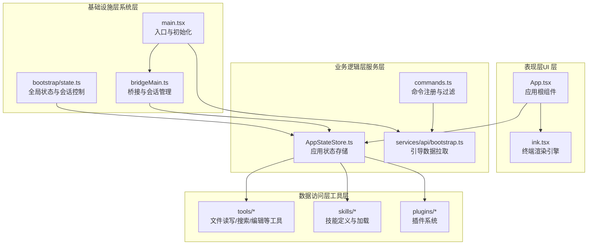
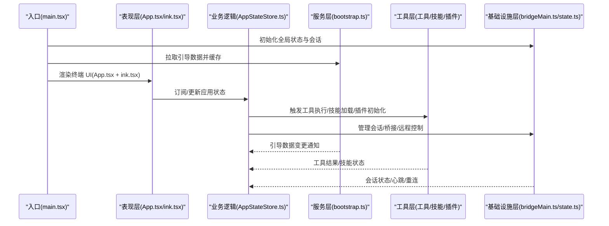
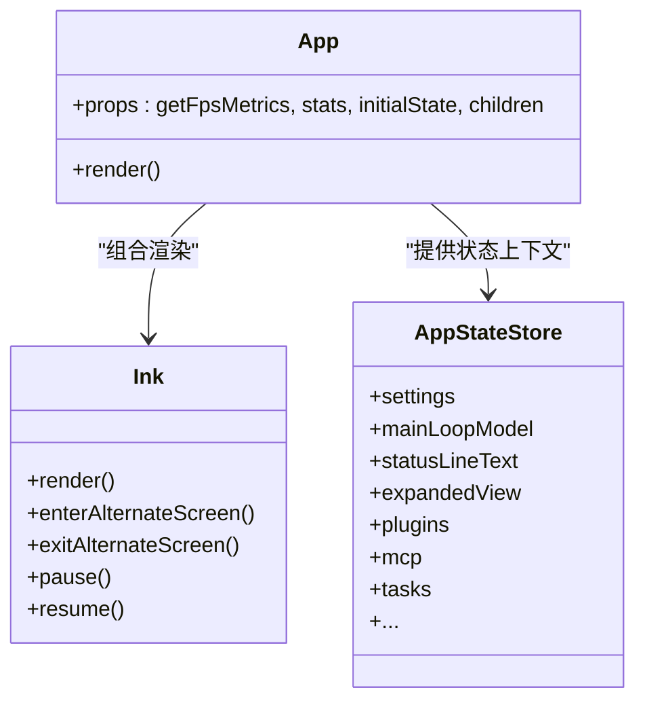
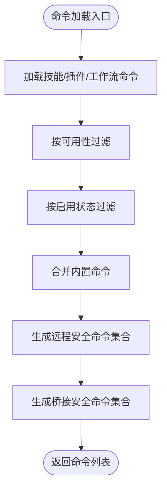
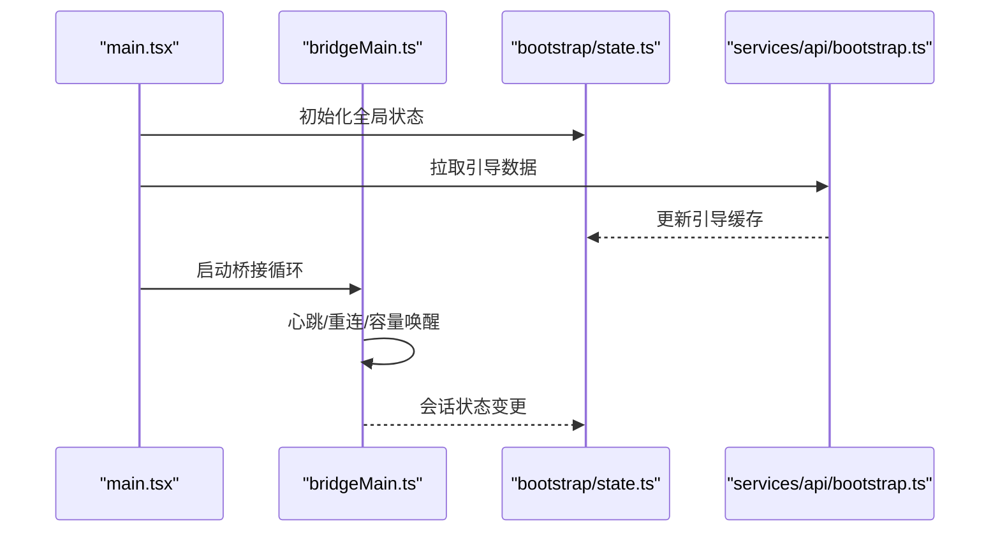
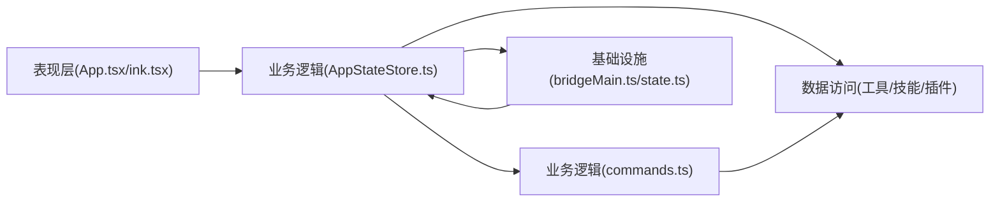

# 分层架构设计

<cite>
**本文档引用的文件**
- [README.md](file://README.md)
- [package.json](file://package.json)
- [src/main.tsx](file://src/main.tsx)
- [src/components/App.tsx](file://src/components/App.tsx)
- [src/bootstrap/state.ts](file://src/bootstrap/state.ts)
- [src/services/api/bootstrap.ts](file://src/services/api/bootstrap.ts)
- [src/bridge/bridgeMain.ts](file://src/bridge/bridgeMain.ts)
- [src/ink/ink.tsx](file://src/ink/ink.tsx)
- [src/state/AppStateStore.ts](file://src/state/AppStateStore.ts)
- [src/commands.ts](file://src/commands.ts)
</cite>

## 目录
1. [简介](#简介)
2. [项目结构](#项目结构)
3. [核心组件](#核心组件)
4. [架构总览](#架构总览)
5. [详细组件分析](#详细组件分析)
6. [依赖分析](#依赖分析)
7. [性能考虑](#性能考虑)
8. [故障排除指南](#故障排除指南)
9. [结论](#结论)

## 简介
本设计文档基于 Claude Code 的源码实现，阐述其四层架构模式：表现层（UI 层）、业务逻辑层（服务层）、数据访问层（工具层）、基础设施层（系统层）。文档重点说明各层职责边界与依赖关系，展示层间通信机制与数据流向，并总结架构决策的技术考量（模块化原则、依赖注入、错误处理策略等）。

## 项目结构
该项目采用以功能域为中心的目录组织方式，结合分层架构进行模块划分：
- 表现层（UI 层）：React + Ink 终端 UI 框架，负责渲染交互界面与用户输入输出。
- 业务逻辑层（服务层）：命令与服务模块，封装核心业务规则与流程编排。
- 数据访问层（工具层）：工具与技能模块，抽象文件系统与网络访问能力。
- 基础设施层（系统层）：桥接与远程会话管理、启动状态与配置、分析与遥测等系统级能力。

**图表来源**
- [src/components/App.tsx:1-56](file://src/components/App.tsx#L1-L56)
- [src/ink/ink.tsx:1-800](file://src/ink/ink.tsx#L1-L800)
- [src/state/AppStateStore.ts:1-570](file://src/state/AppStateStore.ts#L1-L570)
- [src/commands.ts:1-755](file://src/commands.ts#L1-L755)
- [src/services/api/bootstrap.ts:1-142](file://src/services/api/bootstrap.ts#L1-L142)
- [src/bridge/bridgeMain.ts:1-800](file://src/bridge/bridgeMain.ts#L1-L800)
- [src/bootstrap/state.ts:1-800](file://src/bootstrap/state.ts#L1-L800)
- [src/main.tsx:1-800](file://src/main.tsx#L1-L800)

**章节来源**
- [README.md:95-114](file://README.md#L95-L114)
- [package.json:1-34](file://package.json#L1-L34)

## 核心组件
- 表现层核心
  - App.tsx：顶层应用容器，提供状态上下文与 FPS/统计信息。
  - ink.tsx：终端渲染引擎，负责 React 节点到终端屏幕的差异渲染与帧更新。
- 业务逻辑层核心
  - commands.ts：集中式命令注册、可用性过滤与远程安全命令集合。
  - AppStateStore.ts：应用状态模型与默认值，承载 UI 与业务状态。
  - services/api/bootstrap.ts：引导数据拉取与缓存持久化。
- 基础设施层核心
  - bridgeMain.ts：桥接循环、会话生命周期管理、心跳与重连、容量唤醒。
  - bootstrap/state.ts：全局状态与会话切换、指标计数器、时间戳与令牌刷新。
  - main.tsx：应用入口，初始化、设置标志、延迟预取、入口点识别与深链处理。

**章节来源**
- [src/components/App.tsx:1-56](file://src/components/App.tsx#L1-L56)
- [src/ink/ink.tsx:1-800](file://src/ink/ink.tsx#L1-L800)
- [src/state/AppStateStore.ts:1-570](file://src/state/AppStateStore.ts#L1-L570)
- [src/commands.ts:1-755](file://src/commands.ts#L1-L755)
- [src/services/api/bootstrap.ts:1-142](file://src/services/api/bootstrap.ts#L1-L142)
- [src/bridge/bridgeMain.ts:1-800](file://src/bridge/bridgeMain.ts#L1-L800)
- [src/bootstrap/state.ts:1-800](file://src/bootstrap/state.ts#L1-L800)
- [src/main.tsx:1-800](file://src/main.tsx#L1-L800)

## 架构总览
下图展示了四层架构在运行时的交互关系与数据流：

**图表来源**
- [src/main.tsx:585-800](file://src/main.tsx#L585-L800)
- [src/components/App.tsx:1-56](file://src/components/App.tsx#L1-L56)
- [src/ink/ink.tsx:1-800](file://src/ink/ink.tsx#L1-L800)
- [src/state/AppStateStore.ts:1-570](file://src/state/AppStateStore.ts#L1-L570)
- [src/services/api/bootstrap.ts:114-142](file://src/services/api/bootstrap.ts#L114-L142)
- [src/bridge/bridgeMain.ts:141-800](file://src/bridge/bridgeMain.ts#L141-L800)
- [src/bootstrap/state.ts:431-499](file://src/bootstrap/state.ts#L431-L499)

## 详细组件分析

### 表现层（UI 层）
- 组件职责
  - App.tsx：为子树提供应用状态、统计信息与 FPS 上下文，确保 UI 与业务状态解耦。
  - ink.tsx：终端渲染引擎，负责 React 节点布局计算、差异渲染、光标定位与滚动同步，支持 Alt 屏幕与选择高亮。
- 关键特性
  - 帧调度与节流：通过 throttle 控制渲染频率，避免频繁重绘。
  - 光标声明与自愈：通过 cursorDeclaration 与锚定光标位置，保证 IME 与可访问性体验。
  - 选择高亮与搜索：在 Alt 屏幕模式下支持文本选择与位置高亮，提升交互效率。
- 与业务层交互
  - 通过 AppStateStore 提供的状态驱动 UI 更新；命令执行结果经由状态回传至 UI。

**图表来源**
- [src/components/App.tsx:1-56](file://src/components/App.tsx#L1-L56)
- [src/ink/ink.tsx:76-800](file://src/ink/ink.tsx#L76-L800)
- [src/state/AppStateStore.ts:89-452](file://src/state/AppStateStore.ts#L89-L452)

**章节来源**
- [src/components/App.tsx:1-56](file://src/components/App.tsx#L1-L56)
- [src/ink/ink.tsx:1-800](file://src/ink/ink.tsx#L1-L800)
- [src/state/AppStateStore.ts:1-570](file://src/state/AppStateStore.ts#L1-L570)

### 业务逻辑层（服务层）
- 组件职责
  - commands.ts：集中注册命令，按可用性与启用状态过滤，提供远程安全命令集合与桥接安全命令判定。
  - services/api/bootstrap.ts：根据认证与提供商条件拉取引导数据，进行响应校验与缓存持久化。
  - AppStateStore.ts：定义应用状态模型与默认值，包含插件、MCP、任务、通知、权限上下文等。
- 关键特性
  - 命令动态加载与去重：从技能目录、插件、工作流中动态加载命令，避免重复并插入到合适位置。
  - 远程安全命令白名单：在远程模式下预过滤本地命令，减少 UI 抖动与不必要渲染。
  - 引导数据缓存：仅在数据变化时写入磁盘，降低 I/O 开销。
- 与数据层交互
  - 命令执行触发工具层能力；状态变更驱动 UI 层更新。

**图表来源**
- [src/commands.ts:449-517](file://src/commands.ts#L449-L517)
- [src/commands.ts:619-686](file://src/commands.ts#L619-L686)
- [src/commands.ts:651-676](file://src/commands.ts#L651-L676)

**章节来源**
- [src/commands.ts:1-755](file://src/commands.ts#L1-L755)
- [src/services/api/bootstrap.ts:1-142](file://src/services/api/bootstrap.ts#L1-L142)
- [src/state/AppStateStore.ts:1-570](file://src/state/AppStateStore.ts#L1-L570)

### 数据访问层（工具层）
- 组件职责
  - 工具（tools/*）：文件读写、搜索、编辑、终端命令执行、网络抓取等。
  - 技能（skills/*）：面向模型的提示与执行能力，支持动态加载与缓存。
  - 插件（plugins/*）：扩展命令与工具集，支持安装状态与错误收集。
- 关键特性
  - 动态加载：技能与插件在运行时按需加载，避免冷启动开销。
  - 缓存与去重：命令加载使用 memoize，减少重复 I/O。
  - 安全性：桥接安全命令白名单限制远程输入命令的副作用。
- 与业务层交互
  - 工具执行结果作为状态变更源，驱动 UI 更新与后续流程。

**章节来源**
- [src/commands.ts:353-398](file://src/commands.ts#L353-L398)
- [src/commands.ts:563-608](file://src/commands.ts#L563-L608)

### 基础设施层（系统层）
- 组件职责
  - bridgeMain.ts：桥接循环、会话生命周期管理、心跳与重连、容量唤醒、调试日志与事件上报。
  - bootstrap/state.ts：全局状态与会话切换、指标计数器、时间戳、令牌刷新与持久化。
  - main.tsx：应用入口，初始化、设置标志、延迟预取、入口点识别与深链处理。
- 关键特性
  - 多会话与容量管理：支持多会话并发与容量唤醒，优化空闲轮询与心跳。
  - 错误恢复：心跳失败自动重连，致命错误终止环境，避免死循环。
  - 启动性能优化：延迟预取与非关键路径异步化，减少首帧阻塞。
- 与业务层交互
  - 会话状态与桥接状态通过全局状态暴露给业务层；引导数据与分析门控影响业务行为。

**图表来源**
- [src/main.tsx:585-800](file://src/main.tsx#L585-L800)
- [src/bridge/bridgeMain.ts:141-800](file://src/bridge/bridgeMain.ts#L141-L800)
- [src/bootstrap/state.ts:431-499](file://src/bootstrap/state.ts#L431-L499)
- [src/services/api/bootstrap.ts:114-142](file://src/services/api/bootstrap.ts#L114-L142)

**章节来源**
- [src/bridge/bridgeMain.ts:1-800](file://src/bridge/bridgeMain.ts#L1-L800)
- [src/bootstrap/state.ts:1-800](file://src/bootstrap/state.ts#L1-L800)
- [src/main.tsx:1-800](file://src/main.tsx#L1-L800)

## 依赖分析
- 模块内聚与耦合
  - 表现层与业务层通过状态接口解耦，UI 不直接依赖具体工具实现。
  - 业务层与数据层通过命令与状态解耦，工具层对上层暴露统一接口。
  - 基础设施层对业务层与数据层保持最小依赖，仅通过状态与事件交互。
- 外部依赖与集成
  - React + Ink：终端 UI 渲染与事件处理。
  - Axios：引导数据拉取。
  - Bun 特性门控：按构建类型裁剪功能分支。
- 循环依赖规避
  - 通过懒加载与条件导入避免循环依赖（如命令与技能加载）。

**图表来源**
- [src/components/App.tsx:1-56](file://src/components/App.tsx#L1-L56)
- [src/ink/ink.tsx:1-800](file://src/ink/ink.tsx#L1-L800)
- [src/state/AppStateStore.ts:1-570](file://src/state/AppStateStore.ts#L1-L570)
- [src/commands.ts:1-755](file://src/commands.ts#L1-L755)
- [src/bridge/bridgeMain.ts:1-800](file://src/bridge/bridgeMain.ts#L1-L800)
- [src/bootstrap/state.ts:1-800](file://src/bootstrap/state.ts#L1-L800)

**章节来源**
- [src/commands.ts:1-755](file://src/commands.ts#L1-L755)
- [src/services/api/bootstrap.ts:1-142](file://src/services/api/bootstrap.ts#L1-L142)

## 性能考虑
- 帧渲染优化
  - ink.tsx 使用节流与差异渲染，避免高频重绘；Alt 屏幕模式下锚定光标，减少相对移动误差。
- 启动路径优化
  - main.tsx 将非关键预取延迟到首次渲染后，减少首帧阻塞；条件导入与死代码消除减少包体。
- 缓存与去重
  - commands.ts 对命令加载使用 memoize，避免重复 I/O；引导数据仅在变更时写入磁盘。
- 资源管理
  - bridgeMain.ts 在容量满载时采用心跳模式或慢速轮询，降低服务器压力与本地 CPU 占用。

[本节为通用性能建议，无需特定文件引用]

## 故障排除指南
- 常见问题
  - 引导数据未生效：检查引导数据拉取条件与缓存一致性。
  - 会话心跳失败：确认令牌刷新与重连逻辑是否触发；检查致命错误日志。
  - UI 卡顿：检查帧耗时统计与 Yoga 布局计数器，定位过长渲染路径。
- 排查步骤
  - 启用调试日志与诊断输出，观察引导与桥接阶段的关键事件。
  - 使用状态快照与错误日志定位异常命令或工具执行失败。
  - 在远程模式下验证命令白名单，确保仅执行安全命令。

**章节来源**
- [src/services/api/bootstrap.ts:114-142](file://src/services/api/bootstrap.ts#L114-L142)
- [src/bridge/bridgeMain.ts:202-270](file://src/bridge/bridgeMain.ts#L202-L270)
- [src/ink/ink.tsx:772-789](file://src/ink/ink.tsx#L772-L789)

## 结论
该架构通过清晰的四层划分实现了表现、业务、数据与基础设施的有效分离。表现层专注于终端 UI 体验，业务层封装命令与状态，数据层抽象工具与技能，基础设施层保障会话与桥接稳定性。模块化与条件导入提升了可维护性与可扩展性，错误处理与性能优化确保了生产环境的可靠性与用户体验。