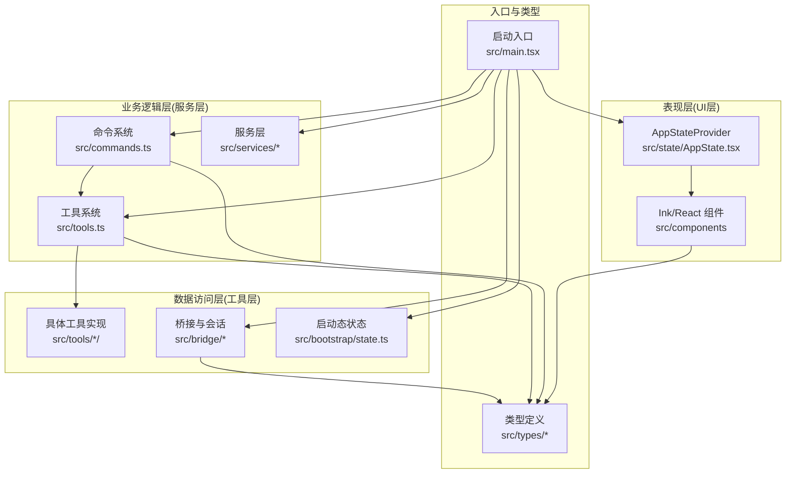
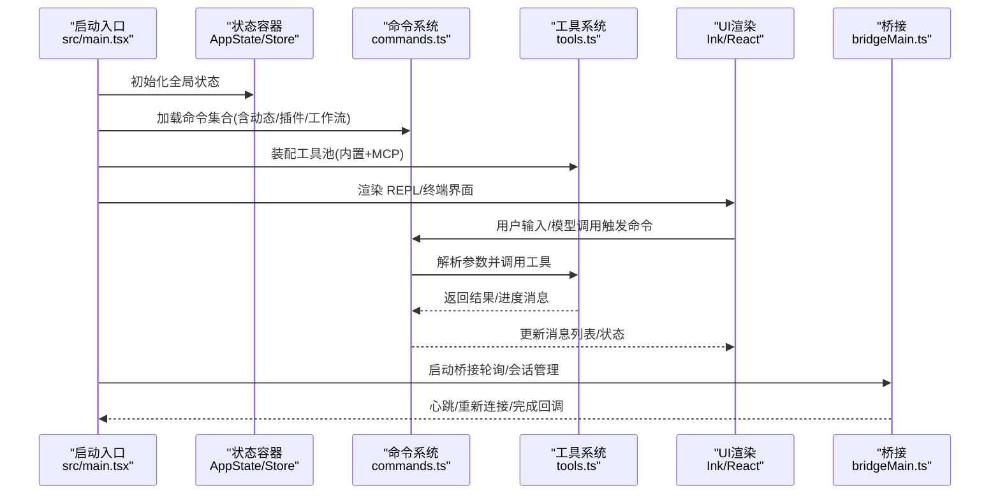
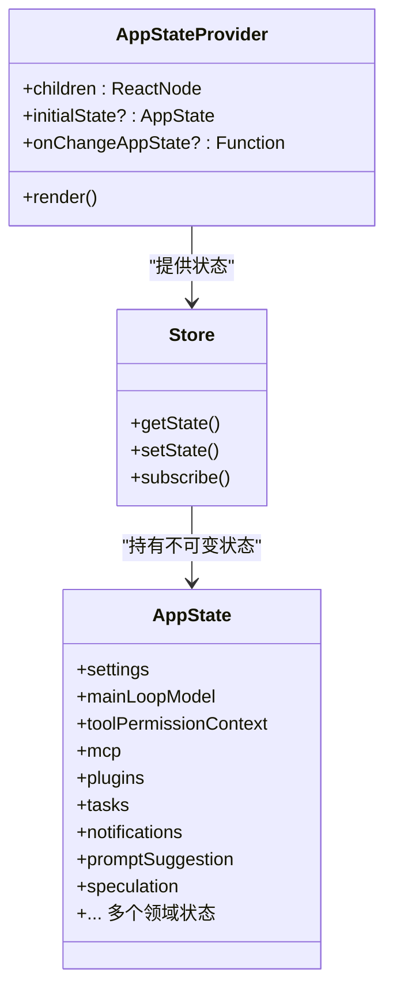
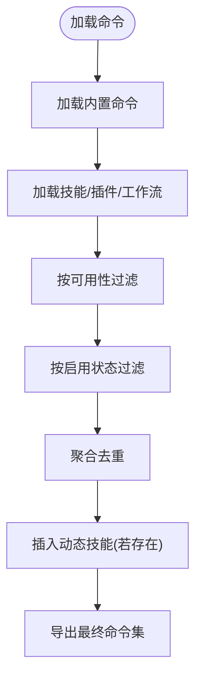
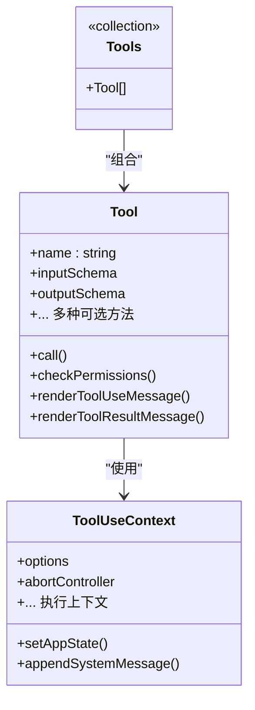
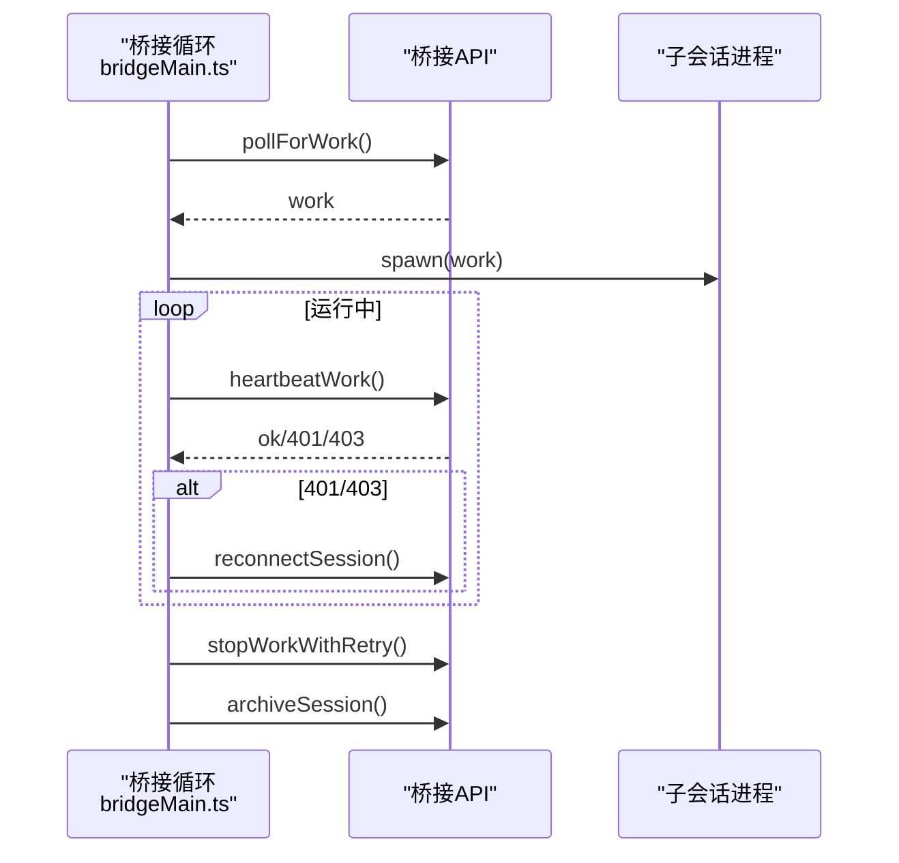
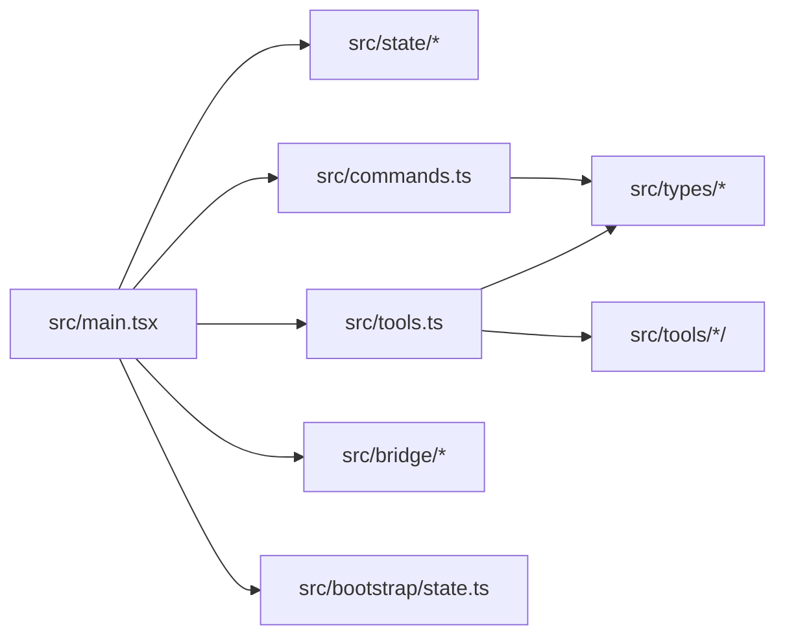

# 整体架构设计

<cite>
**本文档引用的文件**
- [README.md](file://README.md)
- [main.tsx](file://src/main.tsx)
- [AppState.tsx](file://src/state/AppState.tsx)
- [AppStateStore.ts](file://src/state/AppStateStore.ts)
- [commands.ts](file://src/commands.ts)
- [tools.ts](file://src/tools.ts)
- [Tool.ts](file://src/Tool.ts)
- [bridgeMain.ts](file://src/bridge/bridgeMain.ts)
- [state.ts](file://src/bootstrap/state.ts)
- [command.ts](file://src/types/command.ts)
- [package.json](file://package.json)
</cite>

## 目录
1. [引言](#引言)
2. [项目结构](#项目结构)
3. [核心组件](#核心组件)
4. [架构总览](#架构总览)
5. [详细组件分析](#详细组件分析)
6. [依赖关系分析](#依赖关系分析)
7. [性能考虑](#性能考虑)
8. [故障排除指南](#故障排除指南)
9. [结论](#结论)
10. [附录](#附录)

## 引言
本文件面向 Claude Code 的整体架构设计，系统阐述其分层架构模式与模块化组织方式，重点说明表现层（UI 层）、业务逻辑层（服务层）、数据访问层（工具层）的设计理念与职责边界；同时解析 TypeScript 在架构中的作用，包括类型安全、接口设计与模块导入导出规范；最后通过架构图与组件关系图展示核心组件如 AppState、Command、Tool、Bridge 的交互模式，并给出架构决策的技术考量与权衡。

## 项目结构
该项目采用以功能域为中心的模块化组织方式，主要目录与职责如下：
- src/bootstrap：应用启动态状态管理，集中存放会话级全局状态与运行时开关
- src/state：应用状态容器与上下文，提供 React 状态提供者与选择器
- src/commands：命令体系定义与加载，统一承载用户输入与模型调用的“指令”
- src/tools：工具体系定义与装配，封装文件操作、搜索、外部进程等能力
- src/bridge：远程桥接与会话管理，负责与远端环境建立连接、调度工作负载
- src/services：核心服务层，包含分析、插件、MCP、权限策略等横切关注点
- src/components：UI 组件与终端渲染框架（Ink），负责表现层
- src/utils：通用工具函数与平台适配层
- src/types：跨模块共享的类型定义与接口契约
- 入口文件：src/main.tsx 作为 CLI 启动入口，协调初始化流程与渲染

图表来源
- [main.tsx](file://src/main.tsx)
- [AppState.tsx](file://src/state/AppState.tsx)
- [commands.ts](file://src/commands.ts)
- [tools.ts](file://src/tools.ts)
- [bridgeMain.ts](file://src/bridge/bridgeMain.ts)
- [state.ts](file://src/bootstrap/state.ts)
- [command.ts](file://src/types/command.ts)

章节来源
- [README.md](file://README.md)
- [package.json](file://package.json)

## 核心组件
本节聚焦于架构中的关键构件及其职责：

- AppState 与 AppStateProvider
  - AppState 提供会话级不可变状态快照与订阅机制，支持按需选择字段更新，避免不必要重渲染
  - AppStateProvider 将状态注入 React 上下文，统一处理设置变更、权限上下文、语音与邮箱等子提供者
  - 通过 useAppState/useSetAppState/useAppStateStore 提供钩子式访问

- Command 与命令系统
  - 命令分为 prompt/local/local-jsx 三类，统一在 commands.ts 中注册与过滤
  - 支持动态技能、插件技能、工作流命令的聚合与去重，按可用性与启用状态筛选
  - 远程模式与桥接模式的安全命令白名单用于限制远程执行范围

- Tool 与工具系统
  - Tool 抽象定义了工具的输入输出、权限校验、并发安全、进度回调、渲染与拒绝/错误 UI 等契约
  - 工具装配通过 tools.ts 聚合内置工具、MCP 工具与条件工具，支持 REPL 模式下的工具屏蔽与去重
  - 工具池合并策略确保提示缓存稳定性与一致性

- Bridge 与远程桥接
  - bridgeMain.ts 实现桥接轮询、心跳、会话生命周期管理、容量唤醒与错误回退
  - 支持多会话模式、v1/v2 令牌刷新策略、超时监控与清理

章节来源
- [AppState.tsx](file://src/state/AppState.tsx)
- [AppStateStore.ts](file://src/state/AppStateStore.ts)
- [commands.ts](file://src/commands.ts)
- [tools.ts](file://src/tools.ts)
- [Tool.ts](file://src/Tool.ts)
- [bridgeMain.ts](file://src/bridge/bridgeMain.ts)

## 架构总览
下图展示了从启动入口到 UI 渲染、命令与工具执行、以及桥接远程会话的整体交互路径。

图表来源
- [main.tsx](file://src/main.tsx)
- [commands.ts](file://src/commands.ts)
- [tools.ts](file://src/tools.ts)
- [bridgeMain.ts](file://src/bridge/bridgeMain.ts)

## 详细组件分析

### 表现层（UI 层）与状态容器
- AppStateProvider 通过 React Context 暴露状态与更新器，内部处理设置变更监听、权限上下文同步与子提供者注入
- 使用 useSyncExternalStore 订阅状态变化，仅在所选字段变化时触发重渲染，提升渲染性能
- 通过 useAppState 选择器模式避免返回新对象导致的全量重渲染

图表来源
- [AppState.tsx](file://src/state/AppState.tsx)
- [AppStateStore.ts](file://src/state/AppStateStore.ts)

章节来源
- [AppState.tsx](file://src/state/AppState.tsx)
- [AppStateStore.ts](file://src/state/AppStateStore.ts)

### 业务逻辑层（服务层）与命令系统
- 命令注册与过滤：commands.ts 统一导出命令清单，按可用性与启用状态进行筛选，支持动态技能与插件技能的聚合
- 远程安全命令白名单：REMOTE_SAFE_COMMANDS 与 BRIDGE_SAFE_COMMANDS 限定远程/桥接场景可执行的命令
- 命令类型抽象：command.ts 定义 prompt/local/local-jsx 三类命令的接口契约，支持钩子、主题、IDE 集成等扩展

图表来源
- [commands.ts](file://src/commands.ts)
- [command.ts](file://src/types/command.ts)

章节来源
- [commands.ts](file://src/commands.ts)
- [command.ts](file://src/types/command.ts)

### 数据访问层（工具层）与工具系统
- Tool 抽象：Tool.ts 定义工具的输入输出、权限检查、并发安全、渲染与进度回调等契约，提供 buildTool 默认填充
- 工具装配：tools.ts 聚合内置工具、MCP 工具与条件工具，支持 REPL 模式下的工具屏蔽与去重
- 工具池合并：assembleToolPool 保证内置工具优先且去重，维持提示缓存稳定性

图表来源
- [Tool.ts](file://src/Tool.ts)
- [tools.ts](file://src/tools.ts)

章节来源
- [Tool.ts](file://src/Tool.ts)
- [tools.ts](file://src/tools.ts)

### 桥接与远程会话（Bridge）
- 轮询与心跳：bridgeMain.ts 实现工作项轮询、心跳、令牌刷新与错误回退策略
- 会话生命周期：创建、运行、完成、归档与清理，支持 at-capacity 快速心跳与唤醒
- v1/v2 令牌策略：针对不同桥接版本采用不同的令牌刷新与重新派发策略

图表来源
- [bridgeMain.ts](file://src/bridge/bridgeMain.ts)

章节来源
- [bridgeMain.ts](file://src/bridge/bridgeMain.ts)

### 启动态状态与全局开关
- bootstrap/state.ts 提供会话级全局状态，包括计数器、指标、代理颜色、通道允许列表、计划/自动模式头缓存等
- 通过原子式切换函数（如 switchSession）保证状态一致性，避免漂移

章节来源
- [state.ts](file://src/bootstrap/state.ts)

## 依赖关系分析
- 分层耦合与内聚
  - 表现层仅依赖状态容器与类型定义，不直接依赖命令/工具实现，降低 UI 与业务逻辑耦合
  - 业务逻辑层（命令/工具）通过抽象接口与类型约束解耦具体实现
  - 数据访问层（工具实现）通过 Tool 抽象与权限上下文隔离平台差异
- 模块导入导出规范
  - 使用集中式导出（如 commands.ts、tools.ts）统一暴露接口，便于按需引入与死代码消除
  - 类型定义集中在 src/types 下，避免循环依赖并通过深度只读类型增强安全性
- 外部依赖与集成点
  - CLI 入口依赖 Ink/React 进行终端渲染，依赖命令/工具系统驱动业务行为
  - 桥接模块独立于主流程，通过 API 与子进程协作

图表来源
- [main.tsx](file://src/main.tsx)
- [commands.ts](file://src/commands.ts)
- [tools.ts](file://src/tools.ts)
- [Tool.ts](file://src/Tool.ts)
- [bridgeMain.ts](file://src/bridge/bridgeMain.ts)
- [state.ts](file://src/bootstrap/state.ts)

章节来源
- [main.tsx](file://src/main.tsx)
- [commands.ts](file://src/commands.ts)
- [tools.ts](file://src/tools.ts)
- [Tool.ts](file://src/Tool.ts)
- [bridgeMain.ts](file://src/bridge/bridgeMain.ts)
- [state.ts](file://src/bootstrap/state.ts)

## 性能考虑
- 渲染性能
  - 使用 useSyncExternalStore 与选择器模式，仅在所选字段变化时触发重渲染
  - 去除不必要的对象返回，避免 Object.is 总是视为变化
- 启动与预取
  - main.tsx 中对系统上下文与提示等进行延迟预取，减少首屏阻塞
  - 条件特性（如语音、助手模式）通过死代码消除减少包体积
- 工具与命令
  - 工具与命令加载采用 memoization，避免重复 I/O 与动态导入开销
  - 工具池去重与排序保持提示缓存稳定，减少下游缓存失效
- 桥接与会话
  - at-capacity 快速心跳与唤醒机制，避免空轮询带来的资源浪费
  - 令牌刷新与重新派发策略减少因过期导致的无效轮询

## 故障排除指南
- 命令未显示或不可用
  - 检查命令可用性与启用状态：meetAvailabilityRequirement 与 isCommandEnabled
  - 确认动态技能是否被正确去重与插入
- 工具调用失败或权限问题
  - 检查工具的 checkPermissions 与 validateInput 返回值
  - 确认权限上下文（ToolPermissionContext）与 deny 规则
- 桥接连接异常
  - 关注心跳失败与 401/403 错误，确认令牌刷新与 reconnectSession 流程
  - 检查 at-capacity 心跳配置与容量唤醒信号
- 状态不一致或漂移
  - 使用原子式切换函数（如 switchSession）确保 sessionId 与项目目录同步

章节来源
- [commands.ts](file://src/commands.ts)
- [Tool.ts](file://src/Tool.ts)
- [bridgeMain.ts](file://src/bridge/bridgeMain.ts)
- [state.ts](file://src/bootstrap/state.ts)

## 结论
该架构以功能域为中心，通过清晰的分层与模块化实现了表现层、业务逻辑层与数据访问层的职责分离。TypeScript 在类型安全、接口设计与模块导入导出方面提供了强约束，配合 React 状态容器与命令/工具抽象，既保证了可维护性，也兼顾了性能与可扩展性。桥接模块独立于主流程，通过 API 与子进程协作，满足远程会话与多会话场景需求。整体设计在可扩展性、维护性与性能之间取得了良好平衡。

## 附录
- 术语说明
  - 命令（Command）：用户输入或模型调用的指令单元，分为 prompt/local/local-jsx 三类
  - 工具（Tool）：执行具体任务的抽象单元，定义输入输出、权限与渲染契约
  - 桥接（Bridge）：连接本地 CLI 与远端环境的轮询与会话管理模块
  - 启动态状态（Bootstrap State）：会话级全局状态，包含计数器、指标与运行时开关