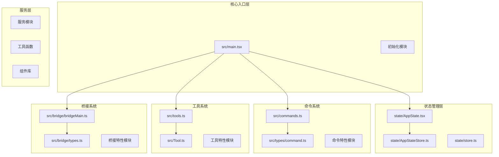
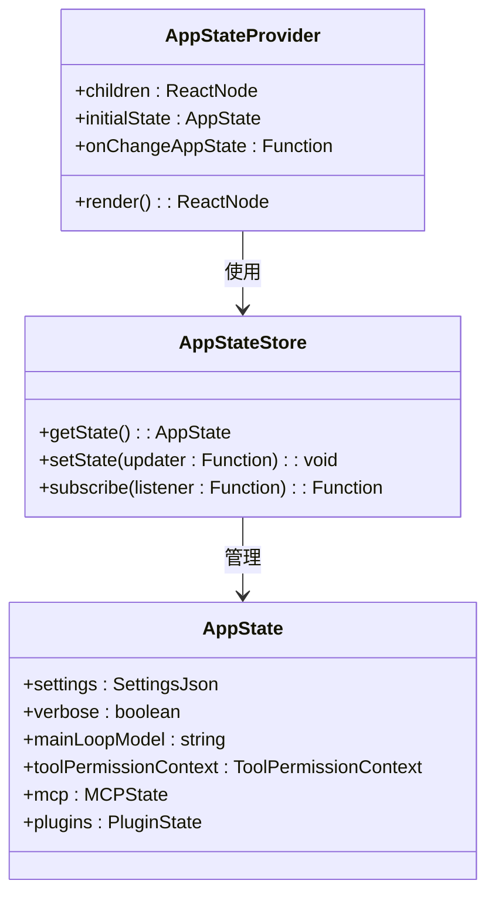
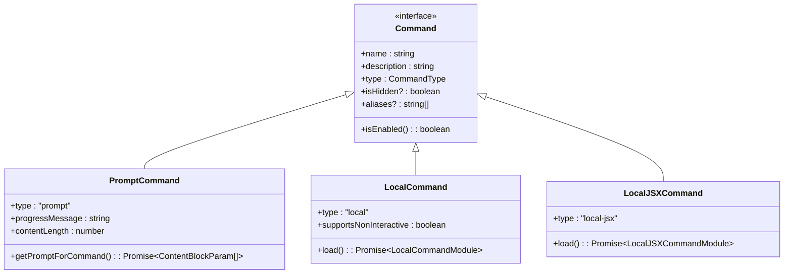
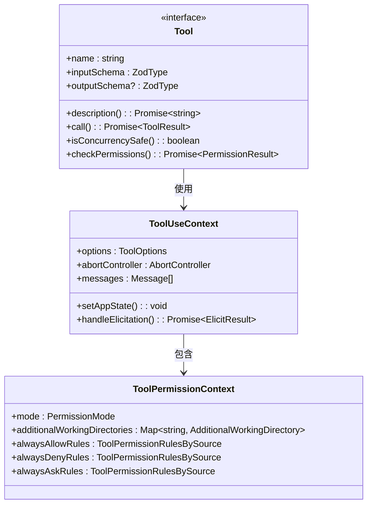
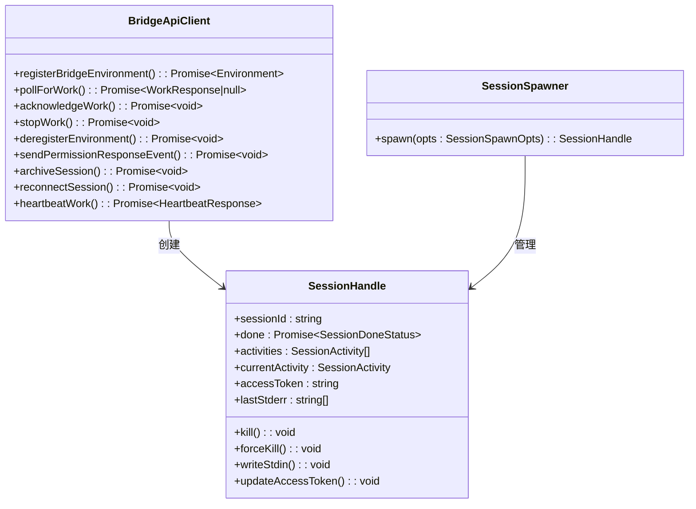
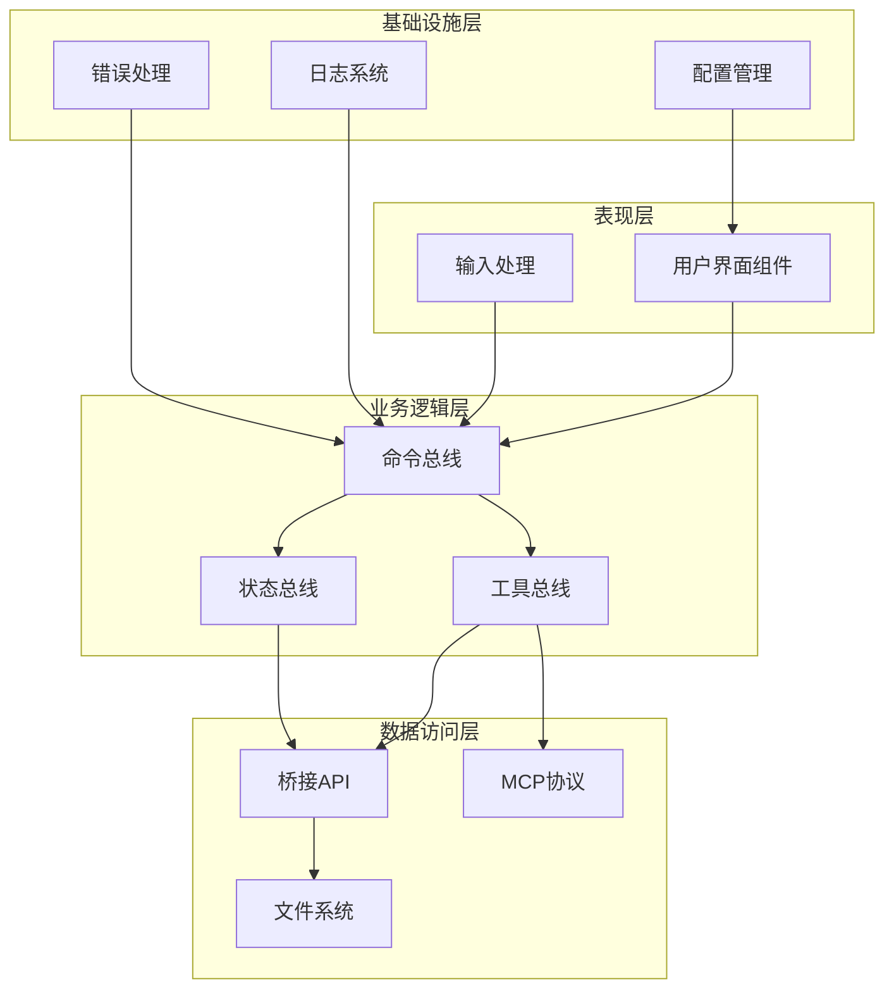
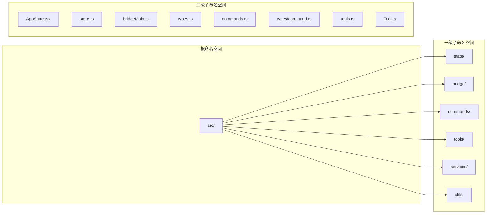
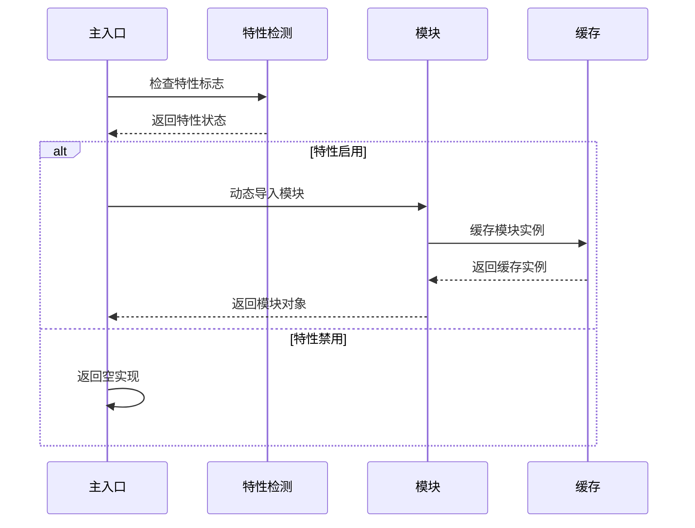
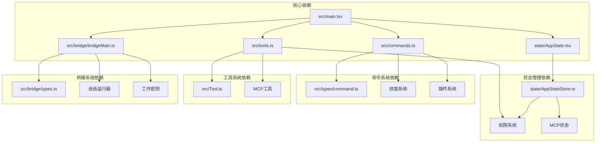
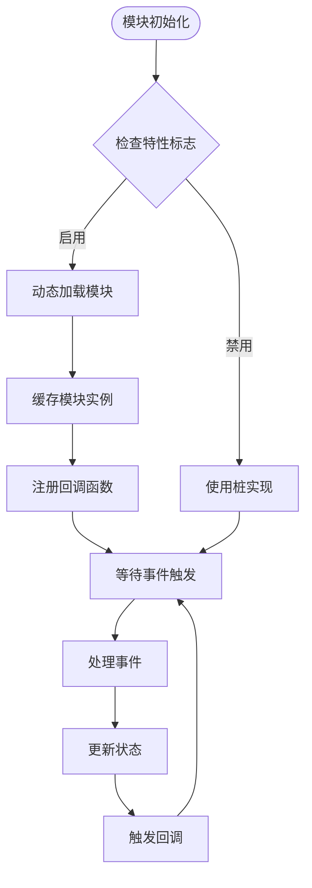

# 模块化设计原则

<cite>
**本文档引用的文件**
- [main.tsx](file://src/main.tsx)
- [AppState.tsx](file://src/state/AppState.tsx)
- [AppStateStore.ts](file://src/state/AppStateStore.ts)
- [commands.ts](file://src/commands.ts)
- [tools.ts](file://src/tools.ts)
- [Tool.ts](file://src/Tool.ts)
- [bridgeMain.ts](file://src/bridge/bridgeMain.ts)
- [types.ts](file://src/bridge/types.ts)
- [command.ts](file://src/types/command.ts)
</cite>

## 目录
1. [引言](#引言)
2. [项目结构](#项目结构)
3. [核心组件](#核心组件)
4. [架构概览](#架构概览)
5. [详细组件分析](#详细组件分析)
6. [依赖分析](#依赖分析)
7. [性能考虑](#性能考虑)
8. [故障排除指南](#故障排除指南)
9. [结论](#结论)

## 引言

Claude Code 采用高度模块化的架构设计，通过清晰的模块边界划分、命名空间组织和依赖管理策略，实现了代码的高内聚低耦合。本文件深入分析项目的模块化设计原则，重点阐述核心模块 AppState、Command、Tool、Bridge 的设计理念和相互关系。

## 项目结构

项目采用基于功能域的模块化组织方式，主要模块包括：

**图表来源**
- [main.tsx:1-800](file://src/main.tsx#L1-L800)
- [AppState.tsx:1-200](file://src/state/AppState.tsx#L1-L200)
- [commands.ts:1-755](file://src/commands.ts#L1-L755)
- [tools.ts:1-390](file://src/tools.ts#L1-L390)
- [bridgeMain.ts:1-800](file://src/bridge/bridgeMain.ts#L1-L800)

**章节来源**
- [main.tsx:1-800](file://src/main.tsx#L1-L800)
- [AppState.tsx:1-200](file://src/state/AppState.tsx#L1-L200)
- [commands.ts:1-755](file://src/commands.ts#L1-L755)
- [tools.ts:1-390](file://src/tools.ts#L1-L390)
- [bridgeMain.ts:1-800](file://src/bridge/bridgeMain.ts#L1-L800)

## 核心组件

### AppState 状态管理系统

AppState 是整个应用的状态管理中心，采用 React Context 模式实现全局状态管理：

**图表来源**
- [AppState.tsx:27-120](file://src/state/AppState.tsx#L27-L120)
- [AppStateStore.ts:89-452](file://src/state/AppStateStore.ts#L89-L452)

### Command 命令系统

Command 系统采用统一的命令接口设计，支持多种命令类型：

**图表来源**
- [command.ts:25-206](file://src/types/command.ts#L25-L206)
- [commands.ts:207-222](file://src/commands.ts#L207-L222)

### Tool 工具系统

Tool 系统采用统一的工具接口，支持工具权限控制和进度跟踪：

**图表来源**
- [Tool.ts:362-695](file://src/Tool.ts#L362-L695)
- [AppStateStore.ts:123-138](file://src/state/AppStateStore.ts#L123-L138)

### Bridge 桥接系统

Bridge 系统负责远程会话管理和环境桥接：

**图表来源**
- [types.ts:133-211](file://src/bridge/types.ts#L133-L211)
- [bridgeMain.ts:141-152](file://src/bridge/bridgeMain.ts#L141-L152)

**章节来源**
- [AppState.tsx:1-200](file://src/state/AppState.tsx#L1-L200)
- [AppStateStore.ts:1-570](file://src/state/AppStateStore.ts#L1-L570)
- [command.ts:1-217](file://src/types/command.ts#L1-L217)
- [Tool.ts:1-793](file://src/Tool.ts#L1-L793)
- [types.ts:1-263](file://src/bridge/types.ts#L1-L263)
- [bridgeMain.ts:1-800](file://src/bridge/bridgeMain.ts#L1-L800)

## 架构概览

项目采用分层架构设计，各层职责明确，模块间通过接口进行通信：

**图表来源**
- [main.tsx:585-800](file://src/main.tsx#L585-L800)
- [commands.ts:476-517](file://src/commands.ts#L476-L517)
- [tools.ts:345-389](file://src/tools.ts#L345-L389)

## 详细组件分析

### 模块边界划分

项目采用清晰的模块边界划分策略：

1. **功能域隔离**：每个功能域（命令、工具、桥接）都有独立的目录结构
2. **接口抽象**：通过 TypeScript 接口定义模块间契约
3. **依赖方向**：单向依赖，避免循环依赖

### 命名空间组织

项目采用层次化的命名空间组织：

**图表来源**
- [main.tsx:191-194](file://src/main.tsx#L191-L194)
- [commands.ts:258-346](file://src/commands.ts#L258-L346)
- [tools.ts:193-251](file://src/tools.ts#L193-L251)

### 依赖管理策略

项目采用多种依赖管理策略：

1. **条件导入**：使用 feature 标记实现按需加载
2. **延迟导入**：避免循环依赖，使用 require 动态导入
3. **接口依赖**：通过接口定义依赖关系，便于测试替换

**图表来源**
- [main.tsx:75-81](file://src/main.tsx#L75-L81)
- [commands.ts:61-90](file://src/commands.ts#L61-L90)
- [tools.ts:120-134](file://src/tools.ts#L120-L134)

**章节来源**
- [main.tsx:585-800](file://src/main.tsx#L585-L800)
- [commands.ts:258-346](file://src/commands.ts#L258-L346)
- [tools.ts:193-251](file://src/tools.ts#L193-L251)
- [AppStateStore.ts:456-570](file://src/state/AppStateStore.ts#L456-L570)

## 依赖分析

### 模块间依赖关系

**图表来源**
- [main.tsx:191-194](file://src/main.tsx#L191-L194)
- [AppState.tsx:20-27](file://src/state/AppState.tsx#L20-L27)
- [commands.ts:1-755](file://src/commands.ts#L1-L755)
- [tools.ts:1-390](file://src/tools.ts#L1-L390)
- [bridgeMain.ts:1-800](file://src/bridge/bridgeMain.ts#L1-L800)

### 解耦机制

项目采用多种解耦机制：

1. **事件驱动通信**：通过状态订阅和回调机制实现松耦合
2. **接口抽象**：通过 TypeScript 接口定义抽象契约
3. **依赖注入**：通过构造函数参数传递依赖，便于测试和替换

**图表来源**
- [main.tsx:170-186](file://src/main.tsx#L170-L186)
- [AppState.tsx:142-163](file://src/state/AppState.tsx#L142-L163)

**章节来源**
- [main.tsx:170-186](file://src/main.tsx#L170-L186)
- [AppState.tsx:142-163](file://src/state/AppState.tsx#L142-L163)
- [commands.ts:476-517](file://src/commands.ts#L476-L517)
- [tools.ts:345-389](file://src/tools.ts#L345-L389)

## 性能考虑

### 模块加载优化

项目采用多种性能优化策略：

1. **按需加载**：使用 feature 标记实现条件编译
2. **缓存机制**：使用 memoize 和缓存策略避免重复计算
3. **异步加载**：大量使用 Promise 实现非阻塞加载

### 内存管理

## 故障排除指南

### 常见问题诊断

1. **模块加载失败**：检查 feature 标记和条件导入逻辑
2. **状态同步问题**：验证 AppState 订阅机制和状态更新流程
3. **工具权限错误**：检查 ToolPermissionContext 配置和权限规则
4. **桥接连接问题**：验证 BridgeApiClient 配置和网络连接状态

### 调试技巧

1. **启用详细日志**：使用 --verbose 参数获取详细调试信息
2. **状态快照**：定期保存 AppState 快照用于问题重现
3. **性能分析**：使用内置性能分析器识别性能瓶颈
4. **单元测试**：为关键模块编写单元测试确保功能正确性

**章节来源**
- [main.tsx:265-271](file://src/main.tsx#L265-L271)
- [AppStateStore.ts:456-570](file://src/state/AppStateStore.ts#L456-L570)
- [Tool.ts:123-138](file://src/Tool.ts#L123-L138)
- [bridgeMain.ts:141-152](file://src/bridge/bridgeMain.ts#L141-L152)

## 结论

Claude Code 的模块化设计体现了现代前端架构的最佳实践：

1. **清晰的模块边界**：每个模块职责单一，接口定义明确
2. **灵活的依赖管理**：通过接口抽象和依赖注入实现高可测试性
3. **高效的性能优化**：采用按需加载、缓存和异步处理策略
4. **强大的扩展能力**：通过特性标记和插件系统支持功能扩展

这种设计原则不仅提高了代码的可维护性和可测试性，还为未来的功能扩展奠定了坚实的基础。通过遵循这些模块化设计原则，开发者可以更容易地理解和修改代码，同时保持系统的稳定性和性能。