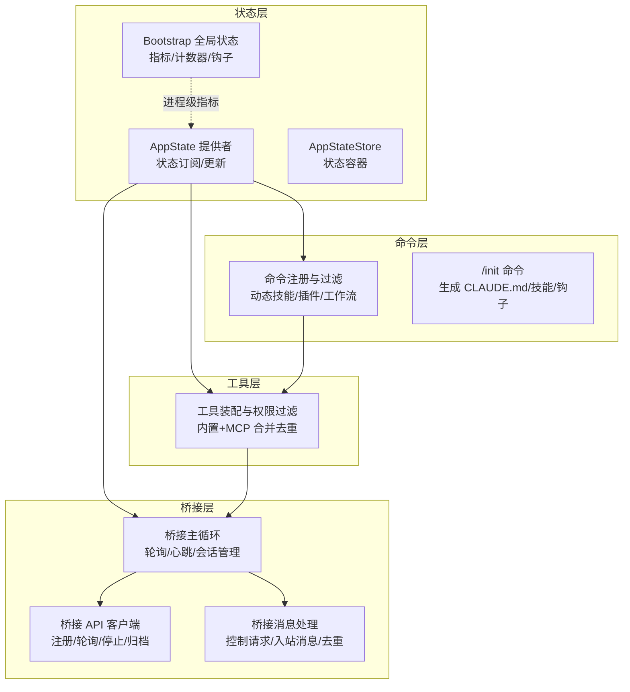
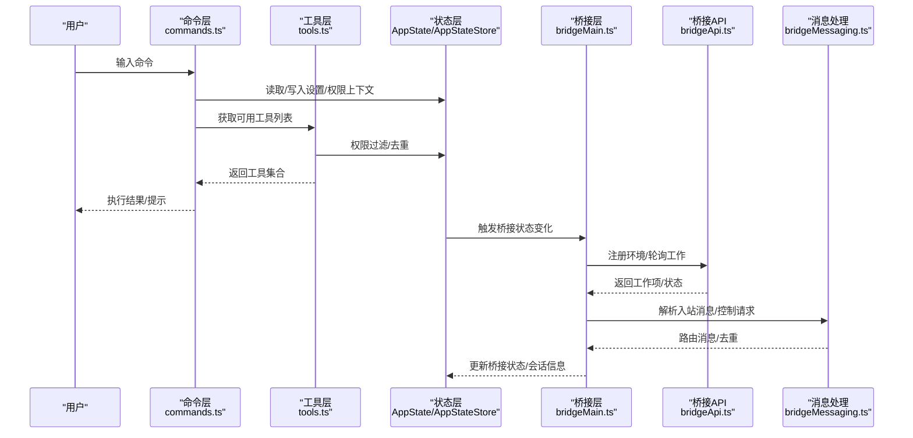
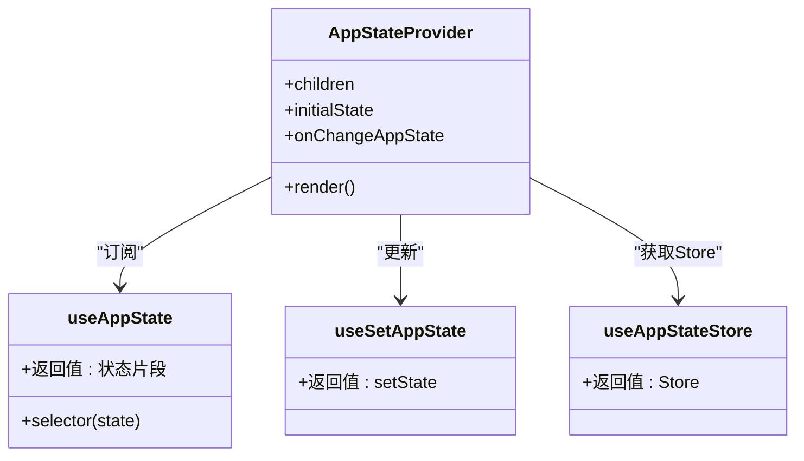
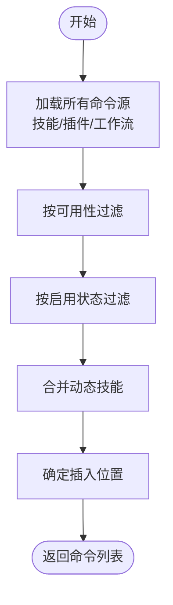
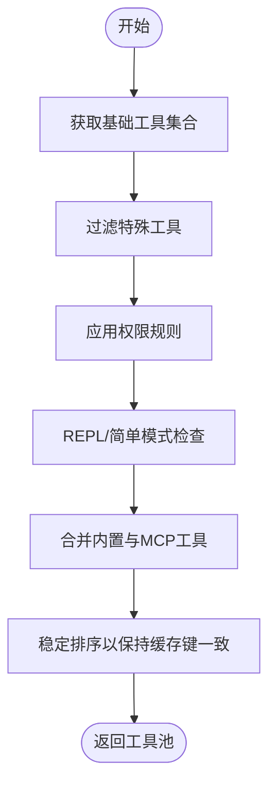
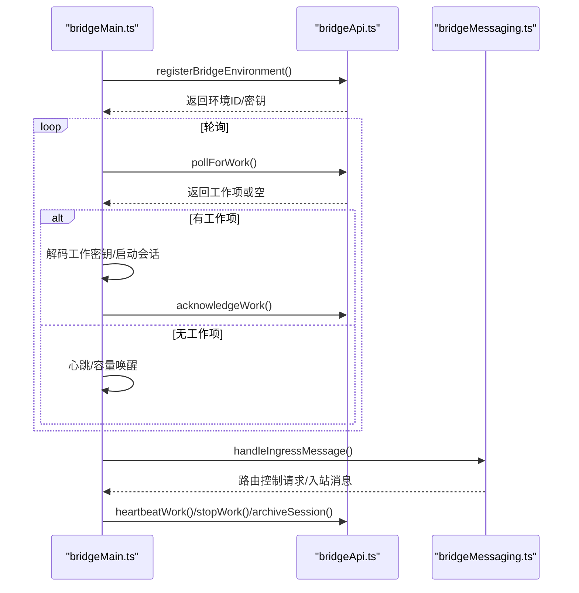
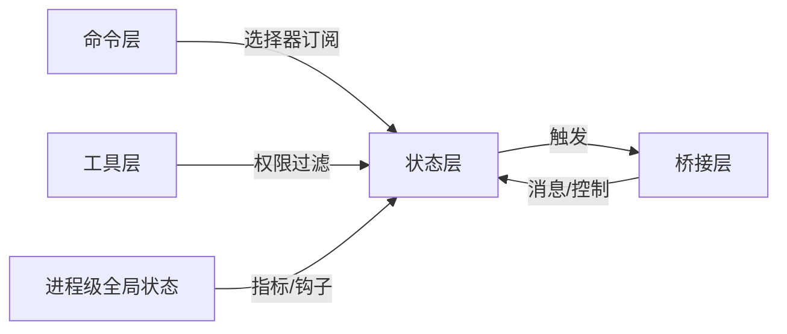
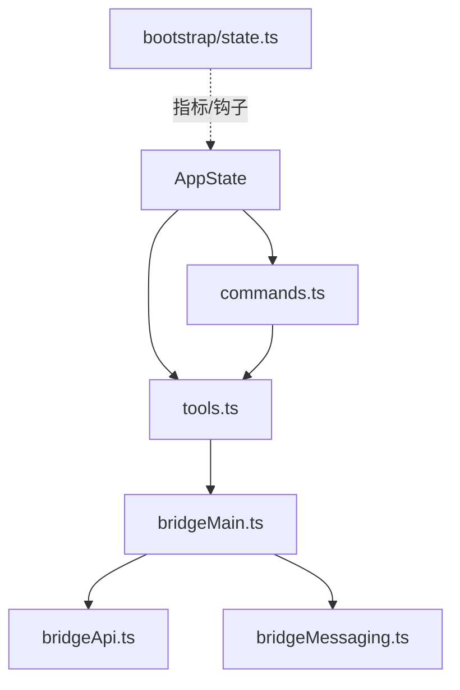

# 组件交互模式

<cite>
**本文引用的文件**
- [src/state/AppState.tsx](file://src/state/AppState.tsx)
- [src/state/AppStateStore.ts](file://src/state/AppStateStore.ts)
- [src/bootstrap/state.ts](file://src/bootstrap/state.ts)
- [src/commands.ts](file://src/commands.ts)
- [src/tools.ts](file://src/tools.ts)
- [src/bridge/bridgeMain.ts](file://src/bridge/bridgeMain.ts)
- [src/bridge/bridgeApi.ts](file://src/bridge/bridgeApi.ts)
- [src/bridge/bridgeMessaging.ts](file://src/bridge/bridgeMessaging.ts)
- [src/commands/init.ts](file://src/commands/init.ts)
</cite>

## 目录
1. [引言](#引言)
2. [项目结构](#项目结构)
3. [核心组件](#核心组件)
4. [架构总览](#架构总览)
5. [详细组件分析](#详细组件分析)
6. [依赖关系分析](#依赖关系分析)
7. [性能考量](#性能考量)
8. [故障排查指南](#故障排查指南)
9. [结论](#结论)
10. [附录](#附录)

## 引言
本文件聚焦 Claude Code 的组件交互模式，系统阐述 AppState 状态管理中心、Command 命令处理器、Tool 工具执行器与 Bridge 远程连接器之间的协作机制。内容涵盖：
- 组件间通信方式：事件总线、回调机制、消息传递、状态同步
- 生命周期管理与依赖注入模式：如何通过组件交互实现松耦合设计
- 组件交互图与数据流：从命令解析到工具执行再到远程桥接的完整链路
- 开发与调试指南：定位问题、优化性能、扩展新功能的最佳实践

## 项目结构
该项目采用“按职责分层 + 按功能域聚合”的组织方式：
- state 层：集中管理应用状态（React Provider + Store），提供订阅与更新能力
- commands 层：统一加载与过滤命令集合，支持动态技能与插件命令
- tools 层：统一装配内置工具与 MCP 工具，提供权限过滤与去重策略
- bridge 层：远程桥接核心逻辑，包含 API 客户端、消息处理、会话生命周期管理
- bootstrap 层：进程级全局状态与指标统计，贯穿会话生命周期

图表来源
- [src/state/AppState.tsx:37-110](file://src/state/AppState.tsx#L37-L110)
- [src/state/AppStateStore.ts:456-570](file://src/state/AppStateStore.ts#L456-L570)
- [src/bootstrap/state.ts:45-257](file://src/bootstrap/state.ts#L45-L257)
- [src/commands.ts:258-346](file://src/commands.ts#L258-L346)
- [src/tools.ts:345-367](file://src/tools.ts#L345-L367)
- [src/bridge/bridgeMain.ts:141-314](file://src/bridge/bridgeMain.ts#L141-L314)
- [src/bridge/bridgeApi.ts:68-139](file://src/bridge/bridgeApi.ts#L68-L139)
- [src/bridge/bridgeMessaging.ts:132-208](file://src/bridge/bridgeMessaging.ts#L132-L208)

章节来源
- [src/state/AppState.tsx:37-110](file://src/state/AppState.tsx#L37-L110)
- [src/state/AppStateStore.ts:456-570](file://src/state/AppStateStore.ts#L456-L570)
- [src/bootstrap/state.ts:45-257](file://src/bootstrap/state.ts#L45-L257)
- [src/commands.ts:258-346](file://src/commands.ts#L258-L346)
- [src/tools.ts:345-367](file://src/tools.ts#L345-L367)
- [src/bridge/bridgeMain.ts:141-314](file://src/bridge/bridgeMain.ts#L141-L314)
- [src/bridge/bridgeApi.ts:68-139](file://src/bridge/bridgeApi.ts#L68-L139)
- [src/bridge/bridgeMessaging.ts:132-208](file://src/bridge/bridgeMessaging.ts#L132-L208)

## 核心组件
- AppState 状态管理中心
  - 通过 React Provider 暴露状态上下文，提供订阅、更新与安全访问能力
  - 内置设置变更监听与调试日志，确保状态变更可追踪
- Command 命令处理器
  - 动态聚合内置命令、技能目录、插件技能与工作流命令
  - 支持按可用性与启用状态过滤，提供桥接安全命令白名单
- Tool 工具执行器
  - 装配内置工具与 MCP 工具，按权限规则过滤并去重
  - 支持简单模式与 REPL 模式下的工具集差异
- Bridge 远程连接器
  - 主循环负责轮询、心跳、会话生命周期管理与容量唤醒
  - API 客户端封装认证、重试与错误处理
  - 消息处理模块负责入站消息路由、控制请求响应与去重

章节来源
- [src/state/AppState.tsx:117-179](file://src/state/AppState.tsx#L117-L179)
- [src/state/AppStateStore.ts:89-452](file://src/state/AppStateStore.ts#L89-L452)
- [src/commands.ts:449-517](file://src/commands.ts#L449-L517)
- [src/tools.ts:345-367](file://src/tools.ts#L345-L367)
- [src/bridge/bridgeMain.ts:141-314](file://src/bridge/bridgeMain.ts#L141-L314)
- [src/bridge/bridgeApi.ts:68-139](file://src/bridge/bridgeApi.ts#L68-L139)
- [src/bridge/bridgeMessaging.ts:132-208](file://src/bridge/bridgeMessaging.ts#L132-L208)

## 架构总览
下图展示了从命令输入到工具执行再到远程桥接的端到端流程，以及状态在各组件间的同步路径。

图表来源
- [src/commands.ts:449-517](file://src/commands.ts#L449-L517)
- [src/tools.ts:345-367](file://src/tools.ts#L345-L367)
- [src/state/AppState.tsx:117-179](file://src/state/AppState.tsx#L117-L179)
- [src/state/AppStateStore.ts:89-452](file://src/state/AppStateStore.ts#L89-L452)
- [src/bridge/bridgeMain.ts:141-314](file://src/bridge/bridgeMain.ts#L141-L314)
- [src/bridge/bridgeApi.ts:68-139](file://src/bridge/bridgeApi.ts#L68-L139)
- [src/bridge/bridgeMessaging.ts:132-208](file://src/bridge/bridgeMessaging.ts#L132-L208)

## 详细组件分析

### AppState 状态管理中心
- 设计要点
  - 使用 React Context 提供状态上下文，避免深层传参
  - 通过 Store 抽象状态订阅与更新，支持选择器式订阅与稳定引用
  - 集成设置变更监听与调试日志，便于诊断状态异常
- 关键接口
  - useAppState(selector)：按选择器订阅状态片段
  - useSetAppState()：获取 setState 引用，避免渲染抖动
  - useAppStateStore()：直接获取 Store 实例，用于非 React 场景
- 生命周期
  - 在 Provider 内部初始化 Store，并在挂载时进行权限模式一致性检查
  - 通过 useEffect 处理外部设置变更与调试输出

图表来源
- [src/state/AppState.tsx:37-110](file://src/state/AppState.tsx#L37-L110)
- [src/state/AppState.tsx:117-179](file://src/state/AppState.tsx#L117-L179)
- [src/state/AppStateStore.ts:456-570](file://src/state/AppStateStore.ts#L456-L570)

章节来源
- [src/state/AppState.tsx:37-110](file://src/state/AppState.tsx#L37-L110)
- [src/state/AppState.tsx:117-179](file://src/state/AppState.tsx#L117-L179)
- [src/state/AppStateStore.ts:456-570](file://src/state/AppStateStore.ts#L456-L570)

### Command 命令处理器
- 设计要点
  - 统一加载内置命令、技能目录、插件技能与工作流命令
  - 按可用性与启用状态过滤，支持动态技能插入与去重
  - 提供桥接安全命令白名单，保障远程模式安全性
- 关键流程
  - 加载所有命令源（技能/插件/工作流）并缓存
  - 过滤可用命令与启用状态，合并动态技能
  - 暴露查找与格式化描述等辅助函数

图表来源
- [src/commands.ts:449-517](file://src/commands.ts#L449-L517)
- [src/commands.ts:563-581](file://src/commands.ts#L563-L581)
- [src/commands.ts:586-608](file://src/commands.ts#L586-L608)

章节来源
- [src/commands.ts:258-346](file://src/commands.ts#L258-L346)
- [src/commands.ts:449-517](file://src/commands.ts#L449-L517)
- [src/commands.ts:563-581](file://src/commands.ts#L563-L581)
- [src/commands.ts:586-608](file://src/commands.ts#L586-L608)

### Tool 工具执行器
- 设计要点
  - 装配内置工具与 MCP 工具，按权限规则过滤并去重
  - 支持简单模式与 REPL 模式下的工具集差异
  - 保证提示缓存稳定性，避免工具顺序变化导致缓存失效
- 关键流程
  - 获取基础工具集合，过滤特殊工具
  - 应用权限规则与 REPL 模式限制
  - 合并内置与 MCP 工具，保持内置工具前缀连续

图表来源
- [src/tools.ts:193-251](file://src/tools.ts#L193-L251)
- [src/tools.ts:345-367](file://src/tools.ts#L345-L367)

章节来源
- [src/tools.ts:193-251](file://src/tools.ts#L193-L251)
- [src/tools.ts:345-367](file://src/tools.ts#L345-L367)

### Bridge 远程连接器
- 设计要点
  - 主循环负责轮询、心跳、会话生命周期管理与容量唤醒
  - API 客户端封装认证、重试与错误处理
  - 消息处理模块负责入站消息路由、控制请求响应与去重
- 关键流程
  - 注册环境并建立会话
  - 轮询工作项，解码工作密钥，处理会话启动与清理
  - 心跳维护与令牌刷新，处理过期与致命错误
  - 控制请求处理（初始化/模型设置/权限模式/中断）

图表来源
- [src/bridge/bridgeMain.ts:141-314](file://src/bridge/bridgeMain.ts#L141-L314)
- [src/bridge/bridgeApi.ts:68-139](file://src/bridge/bridgeApi.ts#L68-L139)
- [src/bridge/bridgeMessaging.ts:132-208](file://src/bridge/bridgeMessaging.ts#L132-L208)

章节来源
- [src/bridge/bridgeMain.ts:141-314](file://src/bridge/bridgeMain.ts#L141-L314)
- [src/bridge/bridgeApi.ts:68-139](file://src/bridge/bridgeApi.ts#L68-L139)
- [src/bridge/bridgeMessaging.ts:132-208](file://src/bridge/bridgeMessaging.ts#L132-L208)

### 组件交互与数据流
- 命令到工具
  - 命令层根据当前权限与模式选择可用工具，工具层进行权限过滤与去重
- 工具到桥接
  - 当处于远程模式或桥接激活时，工具执行结果通过桥接消息通道回传
- 状态同步
  - AppStateStore 作为单一事实源，命令与工具层通过选择器订阅状态变化
  - 进程级全局状态（bootstrap/state.ts）提供指标与钩子，贯穿会话生命周期

图表来源
- [src/commands.ts:449-517](file://src/commands.ts#L449-L517)
- [src/tools.ts:345-367](file://src/tools.ts#L345-L367)
- [src/state/AppState.tsx:117-179](file://src/state/AppState.tsx#L117-L179)
- [src/bootstrap/state.ts:45-257](file://src/bootstrap/state.ts#L45-L257)

章节来源
- [src/commands.ts:449-517](file://src/commands.ts#L449-L517)
- [src/tools.ts:345-367](file://src/tools.ts#L345-L367)
- [src/state/AppState.tsx:117-179](file://src/state/AppState.tsx#L117-L179)
- [src/bootstrap/state.ts:45-257](file://src/bootstrap/state.ts#L45-L257)

## 依赖关系分析
- 组件耦合与内聚
  - AppState 与 commands/tools 存在高内聚的状态读写依赖，但通过选择器与稳定引用降低耦合
  - bridgeMain 依赖 bridgeApi 与 bridgeMessaging，形成清晰的职责边界
- 外部依赖与集成点
  - axios 用于桥接 API 请求
  - Bun 特性标志（feature）用于条件编译与功能开关
  - 进程级全局状态（bootstrap/state.ts）为跨组件提供共享指标与钩子
- 循环依赖规避
  - tools.ts 中通过延迟导入避免循环依赖（如 TeamCreateTool/TeamDeleteTool）
  - commands.ts 中使用动态导入与缓存机制减少模块体积与加载开销

图表来源
- [src/state/AppState.tsx:37-110](file://src/state/AppState.tsx#L37-L110)
- [src/commands.ts:258-346](file://src/commands.ts#L258-L346)
- [src/tools.ts:62-72](file://src/tools.ts#L62-L72)
- [src/bridge/bridgeMain.ts:141-314](file://src/bridge/bridgeMain.ts#L141-L314)
- [src/bridge/bridgeApi.ts:68-139](file://src/bridge/bridgeApi.ts#L68-L139)
- [src/bridge/bridgeMessaging.ts:132-208](file://src/bridge/bridgeMessaging.ts#L132-L208)
- [src/bootstrap/state.ts:45-257](file://src/bootstrap/state.ts#L45-L257)

章节来源
- [src/tools.ts:62-72](file://src/tools.ts#L62-L72)
- [src/bridge/bridgeMain.ts:141-314](file://src/bridge/bridgeMain.ts#L141-L314)
- [src/bridge/bridgeApi.ts:68-139](file://src/bridge/bridgeApi.ts#L68-L139)
- [src/bridge/bridgeMessaging.ts:132-208](file://src/bridge/bridgeMessaging.ts#L132-L208)
- [src/bootstrap/state.ts:45-257](file://src/bootstrap/state.ts#L45-L257)

## 性能考量
- 缓存与懒加载
  - 命令与工具加载采用 memoize 缓存，减少磁盘 I/O 与动态导入成本
  - 桥接轮询间隔与心跳配置支持按容量与状态动态调整
- 去重与稳定排序
  - 工具池去重与稳定排序避免提示缓存失效
  - 消息 UUID 去重环形缓冲区控制内存占用
- 资源释放
  - 会话结束时清理定时器、令牌刷新与工作树，确保资源及时回收

## 故障排查指南
- 命令与工具相关
  - 检查命令可用性与启用状态过滤逻辑，确认动态技能是否正确插入
  - 核对权限规则与 REPL/简单模式限制，避免工具不可见
- 桥接相关
  - 关注轮询空闲周期日志与心跳失败原因，区分致命错误与可恢复错误
  - 检查令牌刷新与 401/403 处理逻辑，确认重试与回退策略
  - 核对入站消息去重与控制请求响应，避免重复处理与超时
- 状态相关
  - 使用 useAppState 选择器订阅关键状态，结合调试日志定位异常
  - 检查 AppStateProvider 是否嵌套使用，避免上下文冲突

章节来源
- [src/commands.ts:449-517](file://src/commands.ts#L449-L517)
- [src/tools.ts:345-367](file://src/tools.ts#L345-L367)
- [src/bridge/bridgeApi.ts:454-500](file://src/bridge/bridgeApi.ts#L454-L500)
- [src/bridge/bridgeMessaging.ts:132-208](file://src/bridge/bridgeMessaging.ts#L132-L208)
- [src/state/AppState.tsx:117-179](file://src/state/AppState.tsx#L117-L179)

## 结论
本文件系统梳理了 Claude Code 的组件交互模式，强调通过 AppState 状态中心、Command 命令处理器、Tool 工具执行器与 Bridge 远程连接器的协同，实现了命令解析、工具装配与远程桥接的完整闭环。通过事件总线、回调机制、消息传递与状态同步，系统在保证功能完整性的同时，实现了松耦合与高可维护性。建议在扩展新功能时遵循现有模式：优先通过状态层暴露必要状态，命令与工具层通过选择器订阅，桥接层通过 API 客户端与消息处理模块解耦，确保整体架构的一致性与可演进性。

## 附录
- 开发与调试建议
  - 使用 useAppState 选择器精确订阅状态片段，避免不必要的重渲染
  - 在命令与工具层引入细粒度日志，定位过滤与装配异常
  - 对桥接主循环的关键节点增加可观测性埋点，便于定位轮询与心跳问题
- 扩展新命令与工具
  - 新增命令：在 commands.ts 中注册并提供可用性与启用状态判断
  - 新增工具：在 tools.ts 中加入工具类并确保权限规则与 REPL 模式兼容
- 远程桥接接入
  - 通过 bridgeApi 创建客户端实例，遵循认证与重试策略
  - 使用 bridgeMessaging 处理入站消息与控制请求，确保去重与超时处理